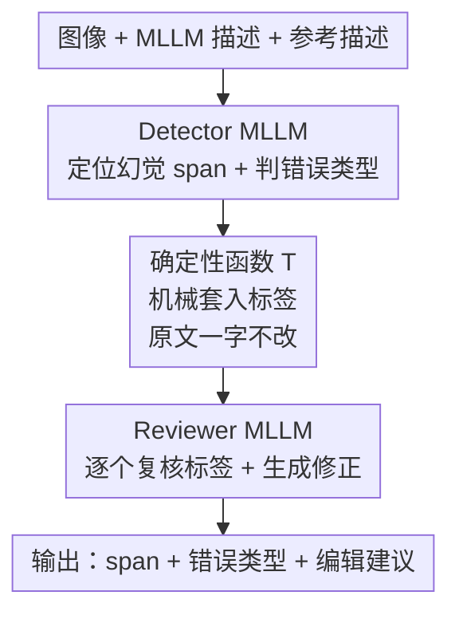

# Zina: Multimodal Fine-grained Hallucination Detection and Editing

**会议**: CVPR 2026  
**arXiv**: [2506.13130](https://arxiv.org/abs/2506.13130)  
**代码**: [https://yuiga.dev/zina](https://yuiga.dev/zina)  
**领域**: 幻觉检测  
**关键词**: 多模态幻觉检测、细粒度编辑、VLM评估、合成数据、标签分类

## 一句话总结
Zina 提出了多模态细粒度幻觉检测与编辑任务，设计了两阶段系统（detector MLLM + reviewer MLLM）将 token 复制委托给确定性函数以简化模型负担，同时构建了 VisionHall 数据集（6.9K 人工标注 + 20K 图结构合成数据），在检测 F1 上超过 GPT-4o 达 15.8 个点。

## 研究背景与动机

**领域现状**：多模态大语言模型（MLLM）在图像描述等任务中经常产生幻觉——生成的文本内容偏离图像实际内容。现有的幻觉检测方法主要在粗粒度层面工作：POPE 用 Yes/No 问题检测物体幻觉，AMBER 用 CHAIR 指标衡量物体级错误率，MHalDetect 做三分类（hallucinated/non-hallucinated/partial）。

**现有痛点**：(1) 粗粒度方法只能判断"这句话有幻觉"，无法精确定位"哪个词/片段"出错以及"错误类型是什么"；(2) 现有方法只做检测不做修正，无法提供可操作的纠正建议；(3) 幻觉形式多样（物体错误、颜色错误、数量错误、关系错误、文字错误、事实错误），但多数方法只聚焦于物体幻觉一种类型。

**核心矛盾**：要做细粒度幻觉检测+编辑，需要模型同时完成三件事——精确定位 span、分类错误类型、生成修正建议。但如果像 FAVA 那样让模型逐 token 复制原句并插入标签，模型需要(i)完美复制原文、(ii)逐 token 判断标签位置、(iii)处理曝光偏差导致的级联错误。这三重负担对模型能力要求过高。

**本文目标** (1) 形式化多模态细粒度幻觉检测与编辑任务，建立 6 类幻觉分类体系；(2) 设计降低任务复杂度的两阶段方法；(3) 构建高质量训练和评估数据集。

**切入角度**：将 token 复制这一机械性工作从语言模型中剥离，交给确定性函数处理，让模型专注于检测和编辑本身，从而大幅降低任务难度。

**核心 idea**：通过两阶段解耦（detector 定位 + deterministic tagging + reviewer 审核编辑），将幻觉检测与编辑的复杂度分治化。

## 方法详解

### 整体框架
给定一张图像 $x_{\text{img}}$、MLLM 生成的描述 $x_{\text{desc}}$ 和人工参考描述 $x_{\text{ref}}$，Zina 的流程为：(1) Detector MLLM $\mathcal{M}_{\text{det}}$ 接收三元组输入，输出幻觉 span 列表及其错误类型；(2) 确定性函数 $\mathcal{T}$ 在原文对应位置插入标签生成带标记序列；(3) Reviewer MLLM $\mathcal{M}_{\text{rev}}$ 逐个审核标签是否正确，并在编辑模式下生成修正建议。最终输出为幻觉 span 集合 $\hat{\mathcal{Y}}_{\text{text}}$、错误类型集合 $\hat{\mathcal{Y}}_{\text{type}}$ 和编辑建议集合 $\hat{\mathcal{Y}}_{\text{edit}}$。

### 关键设计

**1. 确定性标签插入函数 $\mathcal{T}$：把"逐字复制原文"从模型职责里彻底拿走**

细粒度检测最棘手的不是"看出哪里错"，而是要把检测结果嵌回原句又不破坏其余文字。前人方法（如 FAVA）让模型自回归地逐 token 复制原句、同时在恰当位置插入标签——只要某个字母漏了或多了，后面所有标签的边界都跟着错位，曝光偏差让错误一路级联。Zina 的做法是把这步交给一个纯字符串函数：

$$z_i = \mathcal{T}(x_{\text{desc}},\, h_{\text{text}}^{(i)},\, h_{\text{type}}^{(i)})$$

给定原始描述、检测到的幻觉 span 以及它的错误类型，$\mathcal{T}$ 在 span 前后机械地套上对应类型的开闭标签（如 `<object>books</object>`），不调用任何模型推理。这样原文一定被原样保留，标签位置也一定对齐，模型再也不用为"格式遵循"分心，只负责"内容理解"。

**2. Detector–Reviewer 两阶段：把一个高负荷任务拆成两个各自简单的子任务**

单个模型若要同时完成定位 span、判类型、写修正，认知负荷过重。Zina 把它劈成两道工序：Detector $\mathcal{M}_{\text{det}}$（Qwen2.5-VL-72B）只回答"哪些 span 有问题、各属什么类型"，既不用复制原文也不用排标签；经 $\mathcal{T}$ 打好标签后，Reviewer $\mathcal{M}_{\text{rev}}$（同样 Qwen2.5-VL-72B）逐个审核"这个标签的位置和类型对不对"，并在编辑模式下产出修正文本，相当于一个二次确认兼编辑器。两个模型都用交叉熵训练。这种"先粗检、再复核+编辑"的分工类似 chain-of-thought 的分步思考，消融里 Reviewer 的引入是涨点最猛的一环。

**3. 基于图的合成数据增强：让造出来的错误带上真实幻觉的连锁结构**

真实幻觉往往不是孤立的——模型凭空说出一个不存在的苹果，紧接着就会编造"苹果放在桌上""苹果是红色的"等一连串依附错误。若只往描述里随机插入独立错误，合成数据的分布会和真实分布对不上。Zina 分两步解决：先用 Error Insertion 让 o3-mini 向无幻觉描述注入错误，并以 XML 记录错误之间的依赖（"提到不存在的苹果"→"描述苹果与其他物体的关系"）；再用 GraphAug 把这些依赖建成有向图，删环得到 DAG，然后以概率 $p$ 选中某节点连同它的全部后代一起剪除。剪掉一个根错误时，依附其上的子错误也成片消失，于是同一条描述能派生出大量错误组合各异、却都符合因果结构的训练样本。

### 一个完整示例

以一张书架照片、MLLM 描述 "Three red books are stacked on the wooden desk" 为例走一遍：Detector 比对图像与参考描述，输出两个 span——`red`（颜色错误，书其实是蓝色）和 `desk`（物体错误，实为 shelf）；确定性函数 $\mathcal{T}$ 据此把原句改写成 `Three <attribute>red</attribute> books are stacked on the wooden <object>desk</object>`，原文其余部分一字未动；Reviewer 逐个复核——确认 `<attribute>red</attribute>` 标得对并把它编辑为 "blue"、确认 `<object>desk</object>` 成立并改为 "shelf"，若发现某个标签是 Detector 误判则直接撤销。最终系统返回 span 集合 $\{$red, desk$\}$、类型 $\{$attribute, object$\}$ 与编辑建议 $\{$blue, shelf$\}$，三者一一对应、可直接落到原句上。

### 损失函数 / 训练策略
Detector 和 Reviewer 均使用标准交叉熵损失训练。Detector 训练在合成数据上，Reviewer 训练在经 Detector 标注后的数据上。评估使用改进的 BERT-F1 和 CLIP-F1 指标（基于嵌入相似度而非精确匹配计算 F1），因为幻觉修正存在多种有效表达形式。

## 实验关键数据

### 主实验（VisionHall 数据集）

| 方法 | Detection F1↑ | CLIP-S↑ | PAC-S↑ | BERT-F1↑ | CLIP-F1↑ |
|------|-------------|---------|--------|----------|----------|
| GPT-4o | 29.37 | 65.58 | 73.86 | 24.89 | 30.19 |
| Qwen2.5-VL-72B | 21.31 | 64.38 | 72.99 | 18.85 | 23.67 |
| LLaVA-OV-72B | 25.70 | 65.74 | 73.91 | 20.81 | 26.81 |
| Llama-3.2-90B | 16.92 | 65.28 | 73.54 | 14.56 | 17.62 |
| **Zina (Ours)** | **45.15** | **66.08** | **74.36** | **44.02** | **50.39** |

### 消融实验

| 配置 | Detection F1 | BERT-F1 | CLIP-F1 | 说明 |
|------|-------------|---------|---------|------|
| (i) 无 Reviewer，直接 Qwen2.5-VL-72B 3-shot | 21.91 | 15.54 | 17.88 | 基线 |
| (ii) +Reviewer (32B) | 32.55 | 27.52 | 34.66 | 加 Reviewer 提升 +10.6 |
| (iii) +Reviewer (LLaVA-OV-72B) | 34.41 | 31.39 | 36.10 | 换更大 backbone |
| (iv) Zina, n=1 | 43.25 | 42.53 | 49.54 | few-shot 数影响不大 |
| (vi) Zina, n=3 (Full) | 45.15 | 44.02 | 50.39 | 完整模型 |

### 关键发现
- **Reviewer 的引入贡献最大**：从配置(i)到(ii)，F1 从 21.91 跳到 32.55，说明两阶段解耦策略是性能提升的核心
- **GPT-4o 在细粒度检测上表现不佳**：即使是最强闭源模型也只有 29.37 F1，说明这个任务对当前 MLLM 仍然很难
- **错误类型分布分析**：Object 幻觉最多（~30-40%），Fact 幻觉最少（<5%）。不同模型的错误分布差异明显——GPT-4o 的 Text 幻觉比例（12.27%）高于 Qwen-7B（14.96%）
- **在域外数据集 MHaluBench 上也表现出色**：Zina 在 10 个指标中的 9 个上超过 baseline，证明方法的泛化能力

## 亮点与洞察
- **"将 token 复制委托给确定性函数"这一设计思路极为巧妙**：它本质上是将语言模型从"格式遵循"的负担中解放，让其专注于"内容理解"。这个思路不仅适用于幻觉检测，也可以推广到任何需要保持原文结构同时做局部修改的任务（如语法纠错、事实核查）
- **图结构依赖的错误注入**是另一个亮点：通过 DAG 建模错误间的因果关系，使合成数据更贴近真实幻觉分布。DAG 剪枝策略天然提供了数据多样性
- **BERT-F1 和 CLIP-F1 指标**解决了编辑评估中"多种正确答案"的问题，比精确匹配 F1 更合理

## 局限与展望
- **依赖人工参考描述**：任务定义假设有可靠的 reference caption，在实际应用中获取成本高。未来可以探索无参考检测
- **6 类幻觉分类可能不够全面**：例如缺少"因果关系错误"（事件A导致事件B的因果推断）和"时态错误"（过去/现在/将来混淆）
- **Detector 和 Reviewer 使用相同架构（Qwen2.5-VL-72B）**：72B 模型的推理成本高，能否用更小模型+蒸馏达到接近效果值得探索
- **VisionHall 数据集基于 DCI 参考描述**：DCI 的图像多为日常场景，对特定领域（如医学图像、遥感图像）的幻觉检测覆盖不足

## 相关工作与启发
- **vs FAVA**: FAVA 是文本幻觉检测方法，让模型逐 token 复制+插入标签。Zina 的核心改进是用确定性函数替代 token 复制，且扩展到多模态
- **vs UniHD**: UniHD 先提取可验证 claim 再用工具验证，流程较重且依赖外部工具（物体检测器、OCR）。Zina 端到端更轻量
- **vs HalLocalizer**: HalLocalizer 做 token 级定位但无法保证替换检测 token 就能修正幻觉；Zina 做 span 级定位，检测结果直接可编辑
- **启发**：Detector-Reviewer 的两阶段范式可以推广到其他 self-refinement 任务，如代码 bug 检测+修复、翻译错误检测+纠正

## 评分
- 新颖性: ⭐⭐⭐⭐ 任务定义新颖（细粒度检测+编辑），确定性标签插入和图结构数据生成是创新点
- 实验充分度: ⭐⭐⭐⭐⭐ 对比了 10+ 个 baseline，VisionHall + MHaluBench 双数据集验证，消融分析充分
- 写作质量: ⭐⭐⭐⭐⭐ 问题定义清晰，动机推导自然，图表质量高
- 价值: ⭐⭐⭐⭐ 为 MLLM 幻觉治理提供了精细化工具，VisionHall 数据集有持久价值

<!-- RELATED:START -->

## 相关论文

- [\[CVPR 2026\] Fine-Grained Multi-Image Object Hallucination Benchmark](fine-grained_multi_image_object_hallucination_benchmark.md)
- [\[CVPR 2026\] FINER: MLLMs Hallucinate under Fine-grained Negative Queries](finer_mllms_hallucinate_under_fine-grained_negative_queries.md)
- [\[CVPR 2026\] Beyond the Global Scores: Fine-Grained Token Grounding as a Robust Detector of LVLM Hallucinations](beyond_global_scores_fine_grained_token_grounding_as_robust_detector_of_lvlm_hallucinations.md)
- [\[ACL 2025\] Fine-grained Hallucination Detection and Mitigation in Long-form Question Answering](../../ACL2025/hallucination/localizing_and_mitigating_errors_in_long-form_question_answering.md)
- [\[CVPR 2026\] HulluEdit: Single-Pass Evidence-Consistent Subspace Editing for Mitigating Hallucinations in Large Vision-Language Models](hulluedit_single-pass_evidence-consistent_subspace_editing_for_mitigating_halluc.md)

<!-- RELATED:END -->
