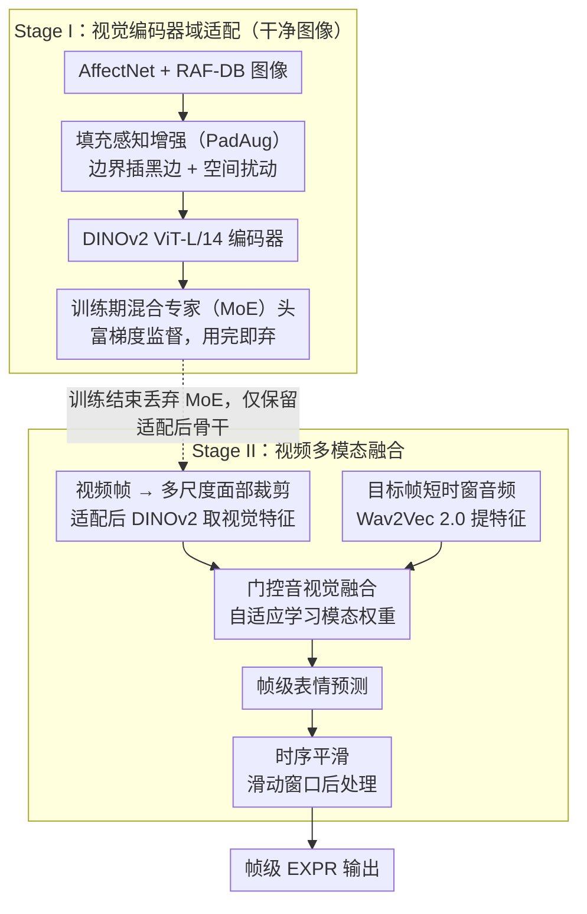

# A Two-Stage Dual-Modality Model for Facial Expression Recognition

**会议**: CVPR 2026  
**arXiv**: [2603.12221](https://arxiv.org/abs/2603.12221)  
**代码**: 无  
**领域**: 人体理解 / 表情识别  
**关键词**: 面部表情识别, DINOv2, 音视觉融合, 混合专家, 数据增强

## 一句话总结

提出两阶段双模态面部表情识别框架：Stage I 通过填充感知增强和训练期 MoE 头在外部数据集上适配 DINOv2 编码器；Stage II 通过多尺度面部裁剪、Wav2Vec 2.0 音频特征提取和门控融合实现帧级音视觉表情分类，在 ABAW 2026 竞赛中取得 0.5368 Macro-F1。

## 研究背景与动机

帧级面部表情识别（EXPR）在野外环境中面临巨大挑战：面部定位不稳定、尺度变化大、模糊/遮挡/极端姿态/光照变化普遍。Aff-Wild2 数据集中的原始视频包含大量这些干扰因素，使得单帧视觉特征嘈杂且不一致。

此外，情感信号本质上是多模态的——视觉信息在歧义场景下可能不足以准确判断表情，而音频（如语气词、爆破音）可提供关键补充线索。然而，有效融合多模态数据并保持时间一致性仍是挑战。

本文策略：分两阶段解决——先在外部图像数据集上增强视觉编码器的表情感知能力，再在视频上进行多模态融合和时序平滑。

## 方法详解

### 整体框架

这篇竞赛方案要解决的是 Aff-Wild2 这类野外视频里帧级表情识别（EXPR）的两个老大难：单帧视觉特征又嘈杂又不稳，且歧义场景下光看脸不够判。作者把问题拆成前后两阶段，让两件事互不干扰。Stage I 只在干净的图像数据集（AffectNet + RAF-DB）上把 DINOv2 ViT-L/14 编码器的表情感知能力练好——这一步引入 PadAug 增强和一个只在训练时存在的 MoE 头。Stage II 才上视频：对每一帧做多尺度面部裁剪过 Stage I 适配好的 DINOv2 拿视觉特征，同时用 Wav2Vec 2.0 抽帧对齐的音频特征，两路经门控融合得到帧级表情预测，最后再用滑动窗口对时间轴做平滑。

### 关键设计

**1. 填充感知增强（PadAug）：把"裁出画面外"这件事提前在训练里演练一遍**

痛点出在 Stage II 的多尺度裁剪——为了不丢上下文，大尺度裁剪框经常超出原画面边界，超出的部分只能补黑边。推理时模型频繁见到这种带填充条的输入，但如果训练阶段从没见过，就会撞上分布偏移。PadAug 的做法是在训练图像的边界主动插入黑色填充条并加小幅空间扰动，覆盖左/右/上/下/角落等各种边界形态，让模型在 Stage I 就习惯这类伪影。等价于把推理时一定会遇到的"出界裁剪"提前喂进训练分布，使大尺度裁剪不再触发性能塌陷。

**2. 训练期混合专家（Training-only MoE）头：用更富的梯度帮编码器适配，但不留下任何推理开销**

视觉适配阶段如果只接一个普通线性分类头，监督信号偏弱，DINOv2 学到的表情判别特征有限。作者在编码器之后挂一个 MoE 分类头，靠样本依赖的专家路由给出更丰富、更有针对性的梯度，把 DINOv2 往表情判别方向拉得更狠。关键的一招是这个 MoE 头"用完即弃"——只在 Stage I 训练时参与，训练结束就丢掉，最终部署只保留微调后的 DINOv2 骨干。于是 MoE 的好处（更强监督）留在了编码器权重里，而它的代价（更大的推理计算）一点都不带进 Stage II。

**3. 门控音视觉融合 + 时序平滑：自适应决定何时信音频，并压掉帧间抖动**

到了 Stage II，视觉这一路来自三种尺度面部裁剪经 Stage I 适配后的 DINOv2 编码，音频这一路来自目标帧附近短时窗的 Wav2Vec 2.0 编码。直接拼接会有个隐患：音频不是任何时候都有用——它在歧义场景里能补刀（比如愤怒的语气帮着把"愤怒"和"厌恶"分开），但很多帧根本没有有意义的语音，硬融反而引入噪声。作者用一个轻量门控融合模块学习每个模态的权重，让模型自适应判断这一帧该多信视觉还是多信音频，而非一刀切等权相加。最后因为逐帧独立预测会在时间轴上抖动，推理时再叠一层滑动窗口时序平滑做后处理，把相邻帧的预测拉平。

### 损失函数 / 训练策略

Stage I 使用交叉熵损失在 AffectNet + RAF-DB 上微调 DINOv2（8 类表情分类）。Stage II 在 Aff-Wild2 视频上训练门控融合模块。推理时施加时序平滑后处理。

## 实验关键数据

### 主实验

| 评估设置 | Macro-F1 | 说明 |
|---------|----------|------|
| 官方验证集 | **0.5368** | 最终提交结果 |
| 5 折交叉验证 | 0.5122 ± 0.0277 | 稳定性验证 |
| 官方测试集 | 0.391 | 挑战赛服务器 |

### 消融实验

| 配置 | Macro-F1 变化 | 说明 |
|------|-------------|------|
| 无 PadAug | 下降 | 边界伪影影响多尺度裁剪 |
| 无 MoE 头 | 下降 | 视觉适配效果减弱 |
| 仅视觉（无音频） | 下降 | 音频提供补充信息 |
| 无时序平滑 | 下降 | 帧间预测不稳定 |
| 完整模型 | **最优** | 各组件互补 |

### 关键发现

- 视觉编码器的域适配（Stage I）是性能的主要来源——图像通常包含视频中的主要情感信息
- 音频作为补充模态提供了最后一块拼图，但增益有限
- PadAug 对多尺度裁剪场景特别重要
- 验证集和测试集性能差距较大（0.54 vs 0.39），可能存在过拟合或分布偏移

## 亮点与洞察

- **PadAug 针对实际问题设计**：填充伪影是野外视频中普遍但被忽视的问题，这种针对性增强比通用增强更有效
- **训练期 MoE 的"用完即弃"策略**：利用 MoE 的丰富梯度帮助编码器适配，但不引入推理开销——巧妙的设计模式
- **两阶段解耦**：先在干净图像上学好视觉表示，再在嘈杂视频上做融合，避免了端到端训练中视频噪声污染视觉学习

## 局限与展望

- 验证集与测试集性能差距大（0.54→0.39），泛化性存疑
- 门控融合模块过于简单，未建模音视频的时序交互
- 仅使用 DINOv2 一种视觉骨干，未探索 CLIP 等其他预训练模型
- 时序平滑为后处理而非端到端学习的时序模型

## 相关工作与启发

- **vs MAE-based EXPR**: MAE 的重建目标对表情判别特征可能不如 DINOv2 的自蒸馏目标
- **vs CLIP-based EXPR**: CLIP 的文本对齐可能在表情分类的文本提示设计上提供优势
- **vs 多任务方法**: 某些 ABAW 方法联合训练 EXPR + AU + VA，可能通过共享表示提升性能

## 评分

- 新颖性: ⭐⭐⭐ PadAug 和训练期 MoE 有设计巧思，但整体框架较常规
- 实验充分度: ⭐⭐⭐⭐ 消融研究验证了各组件贡献，但测试集性能下降大
- 写作质量: ⭐⭐⭐⭐ 方法描述清晰，图示直观
- 价值: ⭐⭐⭐ 竞赛解决方案，实用技巧有参考价值但学术创新有限

<!-- RELATED:START -->

## 相关论文

- [\[CVPR 2026\] D³FER: Dual Channel and Dual Branch Network for Robust Facial Expression Recognition under Dual Challenges](d3fer_dual_channel_and_dual_branch_network_for_robust_facial_expression_recognit.md)
- [\[CVPR 2026\] Dynamic Label Noise Suppression with Optimal Teacher Pool for Facial Expression Recognition](dynamic_label_noise_suppression_with_optimal_teacher_pool_for_facial_expression_.md)
- [\[CVPR 2026\] CLEX: Complementary Label Exchange Learning for Noisy Facial Expression Recognition](clex_complementary_label_exchange_learning_for_noisy_facial_expression_recogniti.md)
- [\[CVPR 2026\] Region-Aware Instance Consistency Learning for Micro-Expression Recognition](region-aware_instance_consistency_learning_for_micro-expression_recognition.md)
- [\[ECCV 2024\] Generalizable Facial Expression Recognition](../../ECCV2024/human_understanding/generalizable_facial_expression_recognition.md)

<!-- RELATED:END -->
