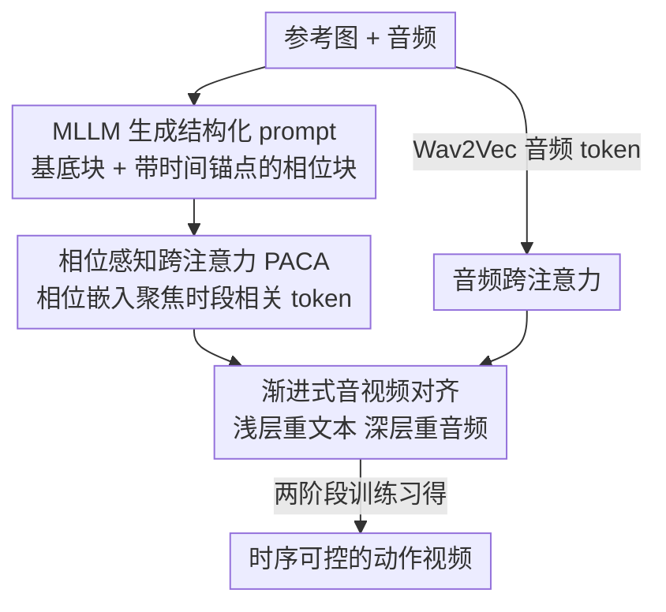

# ActAvatar: Temporally-Aware Precise Action Control for Talking Avatars

**会议**: CVPR 2026  
**论文**: [CVF Open Access](https://openaccess.thecvf.com/content/CVPR2026/html/Peng_ActAvatar_Temporally-Aware_Precise_Action_Control_for_Talking_Avatars_CVPR_2026_paper.html)  
**代码**: [项目页](https://ziqiaopeng.github.io/ActAvatar/)（未见公开仓库）  
**领域**: 数字人 / 视频生成 / 多模态  
**关键词**: 说话人视频生成, 动作控制, 时序对齐, 跨注意力, 扩散 Transformer

## 一句话总结
ActAvatar 用「结构化文本提示 + 相位感知跨注意力」让说话人视频在指定时间窗口精确做出指定动作，再配合「按层深递增的音频影响」和「两阶段训练」，在不依赖姿态骨架的前提下同时保住唇音同步、动作准确度和画质，5B 模型达到 14B 级效果。

## 研究背景与动机
**领域现状**：音频驱动的说话人视频（talking avatar）生成借助扩散模型已经能做出画质不错、唇形对得上的数字人，近期工作（HunyuanVideo-Avatar、OmniAvatar、Wan-S2V 等）还能生成一些合理的手部动作。

**现有痛点**：作者指出三个具体毛病。其一，**文本跟随能力差**——模型把整条 prompt 当作一团均匀的条件来处理，描述动作的词和描述场景/身份的词在注意力里互相抢资源，导致"让他挥手"经常做不出来。其二，**动作和语音内容时序不对齐**——动作可能在任意时刻冒出来，而不是卡在语义相关的那段话上，因为标准条件机制没有显式的时间结构，注意力在时间轴上被摊平。其三，**依赖额外控制信号**——很多方法靠姿态骨架序列（pose skeleton）来控动作，既增加标注/推理复杂度，又限制了生成新动作的能力。

**核心矛盾**：要做到"按文本精确控动作"，本质上要同时建立三种对应关系——语言语义（做什么动作）、时间窗口（什么时候做）、音频线索（动作和语音怎么配合）。更麻烦的是，**文本驱动的动作生成**和**音频驱动的唇形同步**是一对相互竞争的目标：两个模态同时强势施加影响时，模型在冲突信号间摇摆，要么动作质量塌、要么唇音对不上。此外，在领域数据上微调预训练模型来提升唇音对齐，又常常引发灾难性遗忘，把原有的文本跟随能力削没了。

**核心 idea**：把扁平的全局 prompt 拆成"全局基底块 + 带时间锚点的相位块"，让跨注意力学会在对应时间窗口聚焦到对应相位的 token（解决"做什么 + 何时做"）；再让音频影响随 Transformer 层深逐渐增大、和扩散模型"先粗结构后细节"的特征学习层级对齐（解决两模态打架）；最后用两阶段训练把"学唇音对齐"和"注入动作控制"解耦（解决遗忘）。

## 方法详解

### 整体框架
ActAvatar 建立在一个图生视频（image-to-video）扩散 Transformer 骨干上（实现用的是 Wan2.2-TI2V-5B，30 个 DiT block）。输入是一段音频 $a$、一张参考图 $I_{ref}$，以及一条**结构化 prompt** $P$；这条 prompt 由多模态大模型（MLLM，如 Qwen3-Omni）根据图像和音频内容自动生成，写明"在哪个时间段做什么动作"。输出是一段视频 $V=\{I_t\}_{t=1}^T$，要求唇形对得上音频、动作出现在语义合适的时间窗口里。

整个 DiT block 内部，文本条件通过**相位感知跨注意力（PACA）**注入、音频条件通过**音频跨注意力（Audio Cross-Attention）**注入，二者由**渐进式音视频对齐**按层深加权融合；而 PACA 用的相位嵌入和音频适配器（Audio Adapter）由**两阶段训练**分别习得。三个组件分工明确：PACA 管"动作语义↔时间窗口"的对齐，渐进对齐管"文本 vs 音频"不打架，两阶段训练管"新能力不冲掉旧能力"。

### 关键设计

**1. 相位感知跨注意力 PACA：把扁平 prompt 拆成带时间锚点的相位块，让注意力卡时段聚焦**

针对的是"文本跟随差 + 动作不卡点"这两个痛点。标准做法只用一条全局 prompt $P_{global}$ 描述整个场景，缺乏时间结构，动作相关信息被均匀摊到所有时间步上（语义弥散）。PACA 做**层级化 prompt 分解**：

$$P = \{P_{base}, \{P_k, T_k\}_{k=1}^K\}$$

其中 $P_{base}$ 是全局基底块，编码时不变的场景语义（身份、环境、情绪、风格、整体运动特征）；每个相位块 $P_k$ 描述一段局部动作，并绑定一个归一化时间窗口 $T_k=[\tau_k^{start}, \tau_k^{end}]$。例如基底块"一位穿职业装的女性专业地讲话"，相位块 Phase-1 [0–2s]"向外摊开手掌做手势"、Phase-2 [2–4s]"向下指强调细节"。

光有时间锚点还不够，模型得知道哪个 token 属于哪个相位。作者加了**可学习的相位位置嵌入**：对属于相位 $k$ 的每个文本 token $c_i$，加上一个相位偏置 $c'_i = c_i + e_k$，其中 $e_k$ 零初始化（保证训练初期不破坏原行为）。这给了模型一个归纳偏置，鼓励它在跨注意力里区分基底 token 和各相位 token。之后查询、键、值都从相位增广后的 token 算，做标准 softmax 跨注意力 $\mathrm{softmax}(Q_f K^T/\sqrt{D})V$。经过在带时序标注数据上的训练，当某一帧 $f$（归一化到视频时间 $\tau$）落进窗口 $T_k$ 时，注意力就会自然集中到该相位的 token 上——时间锚点提供"该聚焦哪段"，相位嵌入提供"哪些 token 是这段的"，两者合起来实现时序-语义对齐。论文的注意力可视化（Figure 4）显示：两相位 prompt 下，前半段注意力压在 Phase-1 token、后半段切到 Phase-2，且深层（layer 20）比浅层（layer 5）相位分离更锐利。

**2. 渐进式音视频对齐：让音频影响随层深递增，避免文本和音频在同一层抢主导**

针对"文本驱动动作"和"音频驱动唇形"这对竞争目标。作者利用扩散 Transformer 天然的**由粗到细**特征层级——浅层抓全局结构/布局，深层精修局部细节/高频。于是对音频跨注意力的残差做**层深感知缩放**：

$$x_\ell \leftarrow x_\ell + f(\ell)\cdot r_\ell^{audio}, \qquad f(\ell)=\left(\frac{\ell}{L}\right)^{\gamma}, \;\gamma>1$$

$\gamma>1$ 让 $f(\ell)$ 在深层才显著放大。这样浅层（$\ell\ll L$，$f(\ell)$ 小）由文本主导，先把动作的整体骨架——身体姿态、手部轨迹、手势类型——定下来，此时音频影响极小、不来捣乱；到了深层（$\ell\to L$，$f(\ell)$ 大）音频权重升上来，在动作框架已定的基础上精修唇形和面部发音。文本和音频因此进入**互补而非竞争**的工作区间：文本在粗特征区立结构，音频在高频细节区修唇形，避免了同时强势施压导致的相互干扰。实现里 $\gamma=1.5$、$L=30$。消融显示加上它后唇音 Sync-C 从 6.39 提到 6.57，同时动作指标基本不掉。

**3. 两阶段训练：先在海量数据上学唇音对齐（冻骨干），再注入动作控制（全量微调），防遗忘**

针对"微调提升音视频对齐却把文本跟随能力冲掉"的灾难性遗忘。作者把"学音视频对应"和"学时序动作控制"两件事拆开。

**Stage 1（音频适配器训练）**：在 50 万条多样的说话头视频上建立稳健的唇音对应，用 Flow Matching 训练。给定数据 $x_0$ 和纯噪声 $x_1\sim N(0,I)$，构造最优传输路径 $x_t=(1-t)x_0+tx_1$，模型预测速度场目标 $v_{target}=x_1-x_0$，损失为 $\mathbb{E}\big[\|v_\theta(x_t,t,C_{brief},A)-(x_1-x_0)\|^2\big]$；这里只用简短文本 $C_{brief}$（如"一位女性在讲话"）和 Wav2Vec 2.0 的音频嵌入 $A$。关键是**冻结文生视频骨干 $\theta_{base}$，只训音频适配器 $\theta_{audio}$**（音频投影模块把音频编码映射成逐帧对齐的 token + 音频跨注意力层），从而既学到唇音对齐又不动骨干原有能力。

**Stage 2（时序动作控制注入）**：先构数据集——用 DWPose 算运动幅度、挑出动作显著的视频，再用 MLLM 生成带基底块和相位描述+时间锚点的层级 prompt，得到 10 万条带相位级时序标注的样本。模型从基础图生视频骨干出发、注入 Stage 1 训好的音频适配器，仍用 Flow Matching 目标，但条件换成带相位位置嵌入的 $C_{PACA}$。这一阶段做**全量微调** $\theta_{stage2}=\{\theta_{base},\theta_{audio},\theta_{PACA}\}$，同时优化唇音同步和动作控制。把动作控制当作既有能力的**组合式扩展**而非破坏性的参数重写，因此两种能力都能保住。

### 损失函数 / 训练策略
两阶段都用 Flow Matching（最优传输路径 + 速度场回归），损失见上式 $\mathcal{L}=\mathbb{E}\big[\|v_\theta(x_t,t,C,A)-(x_1-x_0)\|^2\big]$，区别只在条件 $C$（Stage 1 用简短文本、Stage 2 用 PACA 结构化 prompt）。Stage 1 训 20K 步、Stage 2 训 14K 步，batch size 40，学习率 $5\times10^{-6}$，AdamW，40 张 H20。推理生成 125 帧（25 FPS、5 秒）、704×1280 分辨率，flow-matching 采样 40 步，文本和音频的 CFG scale 都为 5.0。

## 实验关键数据

### 主实验
在 **HDTF 测试集**（100 条高质量说话头、只有上半身无手部动作，主测唇音和画质）上，ActAvatar 用 5B 参数 @720p 拿到最佳画质，同时唇音同步与最强方法持平：

| 方法 | 参数/分辨率 | FID↓ | IQA↑ | ASE↑ | Sync-C↑ | Sync-D↓ | 时间 |
|------|------------|------|------|------|---------|---------|------|
| HunyuanVideo-Avatar | 13B/720p | 24.515 | 4.054 | 2.693 | 7.647 | 7.564 | 74 min |
| OmniAvatar | 14B/480p | 24.398 | 4.088 | 2.664 | **7.986** | 7.696 | 36 min |
| Wan-S2V | 14B/720p | 23.850 | 4.108 | 2.684 | 7.462 | 7.745 | 68 min |
| **ActAvatar (Ours)** | **5B/720p** | **23.471** | **4.120** | **2.714** | 7.663 | **7.545** | **16 min** |

在自建的 **Action Bench**（200 条带多样动作指令，配参考图 + TTS 语音 + 结构化 prompt）上，动作控制全面领先。动作指标用 Gemini 评测框架打分：H@S（命中相位比例）、AA（动作准确度）、TC（时序正确性）、AQ（动作质量）、HC（手部清晰度）：

| 方法 | Sync-C↑ | H@S↑ | AA↑ | TC↑ | AQ↑ | HC↑ |
|------|---------|------|------|------|------|------|
| HunyuanVideo-Avatar | 6.251 | 0.674 | 3.977 | 5.491 | 6.609 | 8.044 |
| OmniAvatar | 6.765 | 0.818 | 5.505 | 7.032 | 7.147 | 8.042 |
| Wan-S2V | 6.473 | 0.754 | 4.934 | 6.465 | 6.630 | 8.168 |
| **ActAvatar (Ours)** | **6.893** | **0.854** | **5.971** | **7.353** | **7.671** | **8.483** |

值得注意的是 ActAvatar 在 Action Bench 上**唇音同步也是最好的（Sync-C 6.893）**，说明 PACA 实现精确动作控制并没有牺牲音视频对齐。推理效率上，单卡 H20 生成 5 秒视频 16 分钟，比 Wan-S2V（68 min）/ HunyuanVideo-Avatar（74 min）快 4 倍以上；8 卡能压到 2 分钟。

### 消融实验
在 Action Bench 上逐组件叠加（Table 4）：

| 配置 | Sync-C↑ | H@S↑ | AA↑ | TC↑ | AQ↑ | HC↑ |
|------|---------|------|------|------|------|------|
| Base（全局 prompt） | 6.37 | 0.725 | 3.91 | 6.47 | 6.21 | 7.68 |
| + PACA | 6.39 | 0.829 | 5.78 | 7.12 | 7.48 | 8.36 |
| + PACA + 渐进对齐 | 6.57 | 0.831 | 5.75 | 7.10 | 7.52 | 8.47 |
| + 两阶段训练（完整） | **6.89** | **0.854** | **5.97** | **7.35** | **7.67** | **8.48** |

45 人用户研究（0–5 分）也是全维度第一：Action-Prompt Alignment 4.03、Action Quality 4.15、Hand Clarity 4.22、Lip Sync 3.89、Overall 4.18，其中手部清晰度是最强项。

### 关键发现
- **PACA 是动作控制的主引擎**：加上 PACA 后 H@S 从 0.725 跳到 0.829、AA 从 3.91 跳到 5.78、TC 从 6.47 升到 7.48；可视化里 base 模型从头到尾静止不动，加 PACA 后动作自然涌现。
- **渐进对齐主要补唇音**：它把 Sync-C 从 6.39 提到 6.57，同时动作指标几乎不掉，印证"浅层让文本立动作、深层让音频修唇形"确实化解了两模态干扰。
- **两阶段训练再全面拔高**：完整版拿到最佳 Sync-C（6.89）和最佳动作控制（H@S 0.854），说明把音视频学习和动作控制注入解耦，对两种能力同时保留是必要的。
- **质量-效率甜点**：5B 模型在 720p 下打平甚至超过 14B 模型，且推理快数倍。

## 亮点与洞察
- **把"什么时候做"显式写进 prompt 结构**：用"基底块 + 带时间锚点的相位块"这种层级 prompt，配合零初始化的可学习相位嵌入，让跨注意力自己学会按时段聚焦——不需要姿态骨架这类外部控制信号，就拿到了相位级时序精度，这是最巧妙也最可迁移的一招。
- **用网络层深当"模态调度器"**：把"扩散 Transformer 先粗后细"的固有层级，直接拿来当文本/音频影响的时间表（浅层文本、深层音频），一个简单的 $(\ell/L)^\gamma$ 缩放就化解了多模态条件打架——这个"按层深排优先级"的思路可迁移到任意多条件视频生成。
- **解耦训练防遗忘**：Stage 1 冻骨干只训音频适配器、Stage 2 再全量注入动作控制，把新能力当成旧能力的组合扩展，是对付"领域微调冲掉通用能力"的实用范式。

## 局限与展望
- 结构化 prompt 依赖 MLLM 自动生成相位描述和时间锚点，prompt 质量、时间窗口划分是否准确会直接影响动作控制；论文也用了人工校验，说明全自动 prompt 仍不完全可靠。⚠️
- 动作控制指标 AA/TC/AQ/HC 大量依赖 Gemini-based 自动打分（虽跑 5 次取均值并配 45 人用户研究），这类 LLM 评测的绝对分值跨论文不可直接比较。
- 评测里相位多为两段（Phase-1/Phase-2、各约 2 秒），更细粒度、更多相位、更长视频下的时序精度未充分展示；生成长度固定 5 秒。
- 渐进对齐的缩放函数形式 $(\ell/L)^\gamma$ 和 $\gamma=1.5$ 偏经验，论文未给 $\gamma$ 的敏感性分析。

## 相关工作与启发
- **vs OmniAvatar / Wan-S2V / HunyuanVideo-Avatar（强骨干全局 prompt 类）**：它们靠强视频骨干做出还不错的动作，但仍在**全局 prompt**上做扩散，无法精确控时序；ActAvatar 用相位分解 + 相位嵌入把时序结构显式注入注意力，H@S/AA/TC 全面更高。
- **vs EchoMimic v2 / Hallo 4（姿态骨架控制类）**：它们用 skeleton 序列显式控动作，增加标注成本、限制生成新动作；ActAvatar 纯靠文本就实现相位级控制，pipeline 更简、更灵活。
- **vs AgentAvatar（时间线方法）**：AgentAvatar 也引入时间线，但只生成面部表情；ActAvatar 把时序精确控制扩展到全身动作（手势、姿态）。
- **vs MultiTalk（自然动作生成）**：MultiTalk 能动手但动作不跟随 prompt 内容；ActAvatar 的相位条件注意力让动作真正对应到文本描述的那段话。

## 评分
- 新颖性: ⭐⭐⭐⭐ 相位级 prompt 分解 + 相位嵌入 + 按层深的模态调度，组合很巧，但每个零件都建立在成熟机制（跨注意力、Flow Matching、两阶段微调）之上。
- 实验充分度: ⭐⭐⭐⭐ 两个测试集 + 逐组件消融 + 45 人用户研究 + 注意力可视化，较完整；但动作指标重度依赖 Gemini 打分、相位数量偏少。
- 写作质量: ⭐⭐⭐⭐ 三个痛点→三个组件的对应关系清晰，公式和动机讲得明白。
- 价值: ⭐⭐⭐⭐ 无需骨架、纯文本控时序动作 + 5B 打平 14B，对可控数字人产品很实用。

<!-- RELATED:START -->

## 相关论文

- [\[CVPR 2026\] PC-Talk: Precise Facial Animation Control for Audio-Driven Talking Face Generation](pc-talk_precise_facial_animation_control_for_audio-driven_talking_face_generatio.md)
- [\[CVPR 2026\] AudioAvatar: Personalized Audio-driven Whole-body Talking Avatars](audioavatar_personalized_audio-driven_whole-body_talking_avatars.md)
- [\[CVPR 2026\] Tavatar: Topology-Aware Gaussian Attribute Derivation for Animatable Human Avatars](tavatar_topology-aware_gaussian_attribute_derivation_for_animatable_human_avatar.md)
- [\[CVPR 2026\] SyncDreamer: Controllable and Expressive Avatar Generation Beyond the Talking Head](syncdreamer_controllable_and_expressive_avatar_generation_beyond_the_talking_hea.md)
- [\[CVPR 2026\] FlexAvatar: Learning Complete 3D Head Avatars with Partial Supervision](flexavatar_learning_complete_3d_head_avatars_with_partial_supervision.md)

<!-- RELATED:END -->
