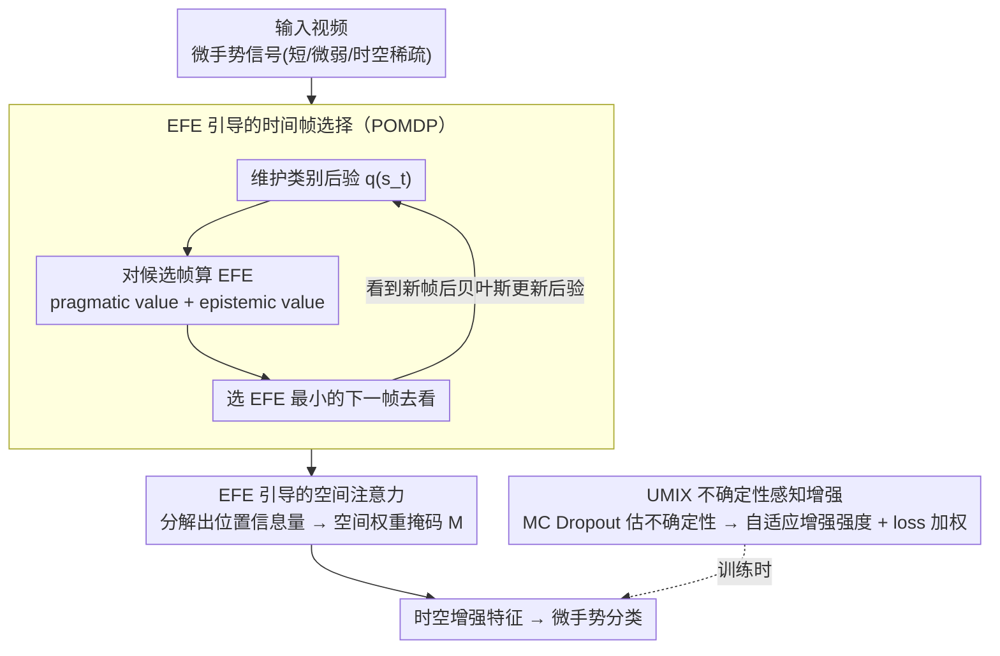

# Active Inference for Micro-Gesture Recognition: EFE-Guided Temporal Sampling and Adaptive Learning

**会议**: CVPR 2026  
**arXiv**: [2603.07559](https://arxiv.org/abs/2603.07559)  
**作者**: Weijia Feng 等 (Tianjin Normal University, Shenzhen University, Zhejiang University, Tianjin University)  
**领域**: 医学图像  
**关键词**: Micro-Gesture Recognition, Active Inference, Expected Free Energy, POMDP, 不确定性感知增强

## 一句话总结

提出 UAAI 框架，首次将主动推理(Active Inference)引入微手势识别，通过 EFE 引导的时间帧选择 + 空间注意力 + UMIX不确定性感知增强，在SMG数据集RGB模态上达到63.47%，大幅超越传统RGB方法。

## 研究背景与动机

微手势(Micro-Gesture)是指人在交流中无意识产生的细微身体动作，如轻微的手指敲击、微小的头部倾斜等。与常规手势识别不同，微手势具有以下特殊挑战：

**持续时间极短**：通常 <0.5 秒，在长视频中占比极低

**幅度极小**：动作幅度远小于日常手势，易被噪声淹没

**高个体差异**：同一类微手势在不同人身上表现形式差异大

**时空稀疏性**：关键信息仅存在于特定的少数帧和局部区域

现有方法（如C3D、TSM、SlowFast）是为常规动作识别设计的，对微手势这种"稍纵即逝"的信号缺乏针对性建模。核心问题是：**如何在时间和空间维度上精准捕捉这些转瞬即逝的微弱信号？**

主动推理(Active Inference)是贝叶斯脑理论下的认知框架，智能体通过最小化"期望自由能"(EFE)来选择动作——既追求信息增益(epistemic value)又追求目标达成(pragmatic value)。这与微手势识别中"主动搜索关键帧和关键区域"的需求天然契合。

## 方法详解

### 整体框架

UAAI（Uncertainty-Aware Active Inference）要对付的是微手势那种"稍纵即逝"的信号——持续 <0.5 秒、幅度极小、关键信息只藏在少数几帧和局部区域。它借主动推理的认知框架，把"在哪一帧、哪块区域看"当成智能体要主动决策的动作，用期望自由能（EFE）来挑信息量最大的帧和区域，再用一个不确定性感知的数据增强稳住训练。整体三个模块串起来：EFE 引导的时间帧选择负责"看哪几帧"，EFE 引导的空间注意力负责"看哪块区域"，UMIX 负责"怎么从带噪样本里稳稳学"。

### 关键设计

**1. EFE 引导的时间帧选择：把"找关键帧"建成主动决策问题**

微手势的关键信息只在极少数帧里，均匀或随机采样大概率会错过（消融里它们比完整模型低 5–6 个点）。UAAI 把帧选择建成 POMDP：状态是视频对微手势类别的隐含信念、观测是当前帧视觉特征、动作是选下一帧去看。每个时间步 $t$ 维护类别后验 $q(s_t)$，用 MLP 参数化的似然矩阵 $A_{a_t}$ 把观测映射成状态更新，并对每个候选动作算 EFE：

$$G(a) = \underbrace{-D_{KL}[q(o|a) \| \tilde{p}(o)]}_{\text{pragmatic value}} - \underbrace{E_{q(o|a)}[H[q(s|o,a)]]}_{\text{epistemic value}}$$

选 EFE 最小的动作，也就是既贴近目标（pragmatic）又最能降不确定性（epistemic）的下一帧，看到新帧后再用似然矩阵贝叶斯更新后验。和 attention/采样这种事后挑帧不同，EFE 是前瞻的——它预测"哪一帧最能减少我对类别的困惑"再去看，所以这个模块在消融里贡献最大（去掉后掉 3.64%）。

**2. EFE 引导的空间注意力：把信息量评分摊到每个空间位置**

帧选对了，微动作还可能淹在背景里。这一模块把 EFE 沿空间维度分解，得到每个位置的信息量评分，再生成可学习的空间权重掩码 $M = \sigma(\text{Conv}([F_{\text{avg}}; F_{\text{max}}]))$，其中 $F_{\text{avg}}$、$F_{\text{max}}$ 是沿通道的平均池化和最大池化特征。掩码增强微手势真正发生的局部区域、压低无关背景，和时间选择形成"先定帧、再定位"的互补（去掉后掉 2.45%，两者同时去掉则掉 6.21%，说明是协同而非简单叠加）。

**3. UMIX 不确定性感知增强：按样本"有多没把握"分别对待**

微手势数据噪声大、歧义多，对所有样本一视同仁地增强会把噪声梯度也放大。UMIX 用蒙特卡洛 Dropout 估每个样本的预测不确定性，然后分情况处理：不确定性高的样本加大增强强度、同时降低 loss 权重（避开噪声梯度），不确定性低的样本减小增强、保持正常权重（别过度扰动已有信心的样本），混合比例按不确定性自适应取 $\lambda = \text{Beta}(\alpha(u), \beta(u))$。这样增强强度跟着置信度走，既扩了难样本的多样性又没让噪声带偏训练（去掉后掉 1.93%）。

### 损失函数 / 训练策略

总损失基于变分自由能（VFE）最小化：$L = L_{\text{accuracy}} + \beta \cdot L_{\text{complexity}}$，其中 $L_{\text{accuracy}}$ 是分类交叉熵保证预测正确，$L_{\text{complexity}}$ 是后验与先验的 KL 散度、防过拟合并鼓励紧凑表示。训练上交替优化：先 warm-up 基础特征提取器，再端到端训练时空选择模块；UMIX 在每个 mini-batch 内在线算不确定性并调整增强；EFE 计算通过重参数化实现可微。

## 实验关键数据

### 主实验 (SMG数据集 RGB模态)

| 方法 | Backbone | Top-1 Acc (%) |
|------|----------|---------------|
| C3D | 3D CNN | 45.90 |
| I3D | Inception | 50.23 |
| TSM | ResNet-50 | 58.69 |
| SlowFast | ResNet-50 | 56.42 |
| Video Swin-T | Swin | 59.14 |
| TimeSformer | ViT | 57.83 |
| **UAAI (Ours)** | **ResNet-50** | **63.47** |
| MS-G3D (Skeleton) | GCN | 64.75 |

UAAI在RGB模态下达到63.47%，大幅超越其他RGB方法，逼近需要骨架标注的MS-G3D。

### 消融实验

| 配置 | Top-1 Acc (%) | 变化 |
|------|---------------|------|
| Full UAAI | 63.47 | — |
| w/o EFE Temporal | 59.83 | -3.64 |
| w/o EFE Spatial | 61.02 | -2.45 |
| w/o UMIX | 61.54 | -1.93 |
| w/o EFE Temporal + Spatial | 57.26 | -6.21 |
| Random Temporal Sampling | 56.91 | -6.56 |
| Uniform Temporal Sampling | 58.12 | -5.35 |

### 关键发现

1. **EFE时间选择贡献最大**（-3.64%），验证了"找到关键帧"是微手势识别的核心瓶颈
2. **空间注意力互补**（-2.45%），进一步聚焦微动作发生的身体部位
3. **UMIX稳定训练**（-1.93%），不确定性感知的增强有效对抗了微手势数据的噪声和歧义
4. **时空联合移除下降剧烈**（-6.21%），说明两者协同工作而非简单叠加
5. **EFE远优于随机/均匀采样**（领先6.56/5.35个点），证明主动推理的帧选择策略显著优于启发式方法

## 亮点与洞察

1. **认知科学与CV的跨界融合**：主动推理源自神经科学的自由能原理(Free Energy Principle)，首次引入微手势识别，理论动机优雅
2. **POMDP建模帧选择**：不同于attention/采样的后验方法，EFE是前瞻性(forward-looking)的——选择预期能最大减少不确定性的帧
3. **不确定性贯穿全局**：从EFE的信息增益到UMIX的自适应增强，不确定性作为统一的指导信号
4. **RGB追骨架**：纯RGB方法达到63.47%，接近需要骨架标注的MS-G3D(64.75%)，实际部署中免去骨架估计的开销

## 局限与展望

1. **计算效率**：EFE计算在每帧每动作上都需要前向推理，时间步数多时计算量可能较大
2. **POMDP近似**：真实EFE需要对未来轨迹积分，实际实现使用了单步近似，可能丢失长程依赖
3. **数据集单一**：主要在SMG数据集验证，缺少跨数据集泛化实验（如iMiGUE等）
4. **领域归属问题**：微手势识别严格来说更属于行为理解而非医学图像，但方法论可迁移至医学视频分析
5. **多模态融合**：未与骨架模态融合，若结合可能进一步提升
6. **不确定性估计开销**：UMIX依赖MC Dropout的多次前向，训练时间增加

## 相关工作与启发

- **Free Energy Principle (Friston)**：主动推理的理论源头，智能体通过最小化自由能来感知和行动
- **AdaFrame / SCSampler**：视频理解中的帧采样方法，但基于强化学习而非主动推理
- **MS-G3D**：骨架图卷积网络在微手势上的强基线，UAAI的RGB方法几乎追平
- **Mixup / CutMix**：数据增强的经典方法，UMIX基于不确定性的自适应是有意义的扩展
- **启发**：EFE引导的时空选择框架可推广至其他需要精准时空定位的任务（如微表情、疼痛检测、手术关键步骤识别）

## 评分

| 维度 | 分数 (1-5) | 说明 |
|------|-----------|------|
| 创新性 | 4.5 | 首次将主动推理引入微手势，跨界创新 |
| 技术深度 | 4 | POMDP+EFE+贝叶斯更新体系完整 |
| 实验充分度 | 3.5 | 消融详尽但数据集偏少 |
| 实用价值 | 3.5 | RGB免骨架有实用性，但场景较窄 |
| 写作清晰度 | 4 | 理论推导与直觉解释并重 |
| **总分** | **3.9** | 认知科学视角独特，框架有通用价值 |

<!-- RELATED:START -->

## 相关论文

- [\[CVPR 2026\] Region-Aware Instance Consistency Learning for Micro-Expression Recognition](region-aware_instance_consistency_learning_for_micro-expression_recognition.md)
- [\[CVPR 2026\] OMG-Bench: A New Challenging Benchmark for Skeleton-based Online Micro Hand Gesture Recognition](omg-bench_a_new_challenging_benchmark_for_skeleton-based_online_micro_hand_gestu.md)
- [\[CVPR 2026\] LaMoGen: Language to Motion Generation Through LLM-Guided Symbolic Inference](lamogen_language_to_motion_generation_through_llm-guided_symbolic_inference.md)
- [\[CVPR 2026\] Active Intelligence in Video Avatars via Closed-loop World Modeling](active_intelligence_in_video_avatars_via_closed-loop_world_modeling.md)
- [\[CVPR 2026\] Text-guided Feature Disentanglement for Cross-modal Gait Recognition](text-guided_feature_disentanglement_for_cross-modal_gait_recognition.md)

<!-- RELATED:END -->
