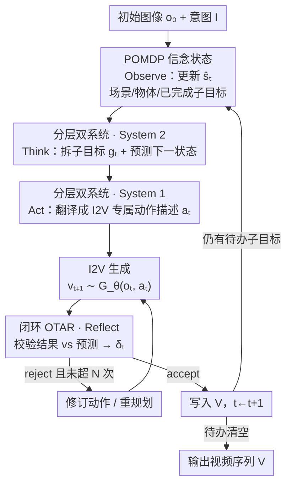

# Active Intelligence in Video Avatars via Closed-loop World Modeling

**会议**: CVPR 2026  
**论文**: [CVF Open Access](https://openaccess.thecvf.com/content/CVPR2026/html/He_Active_Intelligence_in_Video_Avatars_via_Closed-loop_World_Modeling_CVPR_2026_paper.html)  
**代码**: [项目页 ORCA](https://xuanhuahe.github.io/ORCA/)（未见公开代码仓库）  
**领域**: 视频理解 / 数字人 / 智能体  
**关键词**: 视频数字人, 内部世界模型, 闭环规划, POMDP, 双系统架构

## 一句话总结
针对当前视频数字人"只会被动跟随语音/姿态、缺乏自主目标驱动"的问题，本文提出 L-IVA 任务（把数字人控制建模成以 I2V 生成模型为环境模拟器的 POMDP）和 ORCA 框架——用「观察-思考-行动-反思」(OTAR) 闭环对抗生成随机性、用 System 2/System 1 双系统分层完成开放域规划与精确落地，在 100 个任务的基准上把平均任务成功率做到 71.0%，显著超过开环、反应式与无反思基线。

## 研究背景与动机

**领域现状**：可控视频数字人目前主流是"被动条件驱动"——给一张参考图，再用语音、姿态序列或文本作为驱动信号，让模型逐段（chunk-level）自回归地生成保持身份一致的视频。它们在身份保持、与驱动信号对齐这两件事上已经做得很好。

**现有痛点**：这些方法本质上是**反应式信号处理**——动作只是对音频的响应、身份只是特征融合，数字人能执行预定义动作或听简单指令，却**无法自主地朝一个长期目标做多步规划并与环境交互**。比如给一个"泡茶"或"主持产品演示"的高层意图，它没法自己拆解成"开罐→舀茶叶→放进滤网→倒热水"这种连贯的多步流程。

**核心矛盾**：要从被动动画跨到主动智能，智能体必须做到三件事：(1) 从不完整的视觉观测（只能看到自己生成出来的视频片段）里推断任务进度；(2) 预测动作如何改变未来状态；(3) 朝长期目标规划连贯的动作序列。这要求一个**内部世界模型 (Internal World Model, IWM)** 来综合观测历史、估计真实世界状态。但在生成式环境里实现 IWM 又有两个机器人/具身 AI 里不存在的独特困难：

- **生成不确定性下的状态估计**：传统 IWM 假设世界确定——同一动作反复执行结果一致；但 I2V 生成本质是随机的，同一条动作描述能产生五花八门的视觉结果。数字人没有传感器，只能靠自己生成的片段反推状态，如果不校验"生成出来的"和"想要的"是否一致，内部信念就会被污染，长程规划随之崩坏。
- **开放域动作空间下的规划**：机器人动作空间有界（关节角），但数字人动作是语义的、开放域的，没有预定义原语。一句"拿起红杯子"留下了大量视觉细节未指定，会导致生成结果多样且常常出错。这要求**分层规划**——既要决定下一个动作，又要把它翻译成针对具体 I2V 模型的、详细的控制信号。

**核心 idea**：把数字人控制形式化为 POMDP，用**闭环 OTAR + 双系统**实现 IWM——持续用反思校验生成结果以维持准确信念，用 System 2 做策略推理、System 1 做模型专属的动作落地，从而无需训练就能在开放域里自主完成多步任务。

## 方法详解

### 整体框架

ORCA（Online Reasoning and Cognitive Architecture）要解决的是：给一张初始场景图 $o_0$ 和一个高层意图 $I$（如"移栽植物"），让数字人**自己**生成一段连贯的、通过有意义物体交互逐步完成目标的视频序列 $V=[v_1,\dots,v_T]$。

它整体是一个**逐回合自回归的闭环**。智能体看不到真实世界状态 $s_t$，只能维护一个带历史信息的**内部信念状态** $\hat{s}_t$，并执行依赖信念的策略 $\pi(a_t|\hat{s}_t)$。每一回合走一遍 OTAR 四阶段：**Observe**（从最新片段更新信念）→ **Think**（System 2 拆子目标、预测下一状态）→ **Act**（System 1 把抽象子目标翻译成 I2V 专属动作描述并生成视频）→ **Reflect**（System 2 校验生成结果是否符合预测，accept/reject）。reject 就重试或重规划，accept 才把片段写入结果、推进到下一回合，直到待办子目标清空。整个框架不需要任何任务专属训练，全靠对预训练 VLM 的结构化提示驱动。

### 关键设计

**1. L-IVA 建模为 POMDP + 内部世界模型信念状态：给"看不全又测不准"的环境一个可推断的状态表示**

痛点是数字人面对的是双重不可观测：真实状态 $s_t$ 藏在视频背后（一帧只含部分信息），而且同一动作因 I2V 随机性会得到不同结果。本文把任务形式化为元组 $(S, A, T, R, \Omega, O)$ 的 POMDP——真实状态 $s_t$ 不可见，动作空间 $A$ 是自然语言描述的开放集合，观测 $o_t$ 是 I2V 生成的视频帧、由 $O(o_t|s_t)$ 给出部分视图，状态转移 $T(s_{t+1}|s_t,a_t)$ 隐式不可见，能观测到的只是随机生成 $o_{t+1}\sim G_\theta(o_t,a_t)$；奖励 $R$ 稀疏且终态化——只有轨迹终态满足意图才给 1。

既然 $s_t$ 不可见，智能体就不能直接对状态做决策，而是维护一个**信念状态** $\hat{s}_t$，初始化为 $\hat{s}_0=(s_{\text{scene}}, C_{\text{plan}}, h_\varnothing)$：$s_{\text{scene}}$ 是初始图里可交互物体及其属性，$C_{\text{plan}}$ 是把意图 $I$ 拆成的子目标清单，$h_\varnothing$ 是空交互历史。每回合 Observe 阶段用 $\hat{s}_t=f_{\text{observe}}(o_t,\hat{s}_{t-1})$ 把最新片段里的场景变化、物体状态更新、已完成子目标结构化地并进信念。这个显式状态正是后续"能不能判断子目标做完没""动作之间有没有依赖"的依据——消融里去掉它（w/o Belief State）TSR 从 0.77 掉到 0.67，掉得最狠，智能体会出现重复或乱序动作。

**2. 分层双系统架构：把"想得对"和"画得准"拆给两个 VLM 分别负责**

痛点是开放域控制同时要两种能力：高层策略推理（动作是语义、开放域的）和低层精确提示（约束随机的 I2V 模型，而且可靠生成控制往往是模型专属的）。单一系统很难兼顾——既要广博的世界知识做组合推理，又要迁就生成模型的格式要求，二者会互相掣肘。受双过程理论 (dual-process theory) 启发，ORCA 把规划和执行解耦成两个专门的 VLM 模块。

**System 2（策略规划器）** 维护 IWM 的高层信念 $\hat{s}_t$、做策略推理，输出 $g_t, g_{\hat{s}} = \pi_{\text{Sys2}}(\hat{s}_t, I)$，其中 $g_t$ 是朝下一子目标的文本命令、$g_{\hat{s}}$ 是对预测下一状态的详细结构化描述；它不被生成模型的格式要求束缚，专注用预训练 VLM 的世界知识做开放域推理，并贯穿 Observe/Think/Reflect 多个阶段。**System 1（动作落地器）** 只在 Act 阶段工作，把多模态意图 $(g_t, g_{\hat{s}})$ 翻译成针对具体 I2V 模型 $G_\theta$ 的详细动作描述 $a_t = \pi_{\text{Sys1}}(g_t, g_{\hat{s}}, o_t, \hat{s}_t)$，靠大量提示工程保证高保真翻译。这样 System 2 守长程策略一致性、System 1 守执行精度。消融去掉 System 1（直接用 System 2 的抽象命令喂生成模型）TSR 与 BWS 都下降，证明"策略推理"和"执行落地"必须分离。

**3. 闭环 OTAR 循环：用 Reflect 在信念被污染前拦下错误生成**

痛点是开环计划极易失败——哪怕微小执行误差也会累积；而普通的 Observe-Think-Act 三段循环也不够，因为 I2V 结果可能和意图严重偏离，一次失败生成会产生难以恢复的错误状态，若把它并进信念就会污染整条内部信念。ORCA 在 Act 之后加一个 **Reflect** 阶段：System 2 用 $\delta_t, \text{analysis} = f_{\text{reflect}}(o_{t+1}, g_t, g_{\hat{s}})$ 校验采样帧 $o_{t+1}$ 是否匹配预测状态 $g_{\hat{s}}$，产出 $\delta_t\in\{\text{accept}, \text{reject}\}$。

accept 则推进到下一回合、用新片段更新信念；reject 则分析失败原因，要么用 $a_t^{\text{new}}=f_{\text{revise}}(a_t, o_{t+1}, \text{analysis})$ 修订动作重试（最多 $N_{\text{retry}}$ 次），要么自适应地为下一轮重规划。这一闭环的关键在于"**先验证、后更新信念**"——它把失败生成挡在信念之外，防止错误状态向后传播。这也解释了视频质量上的反直觉结果：开环规划虽然 TSR 不低，却因不做结果筛选而 Subject Consistency 最低（视觉伪影随长程累积），ORCA 反而在 Reflect 阶段主动滤掉低质生成，拿到最高的主体一致性。消融去掉 Reflect（w/o Reflect）主要伤的就是 Subject Consistency 和人类偏好 BWS。

### 一个完整示例：移栽植物 (Transfer Plant)

意图是"移栽植物"，GT 子目标为：①往盆里加土 → ②把幼苗从育苗盆取出 → ③把幼苗放进大盆 → ④用土填满剩余空间。

- **开环规划**：一次性生成全部 I2V 描述直接喂给生成模型，无中间校验。前几步看着还行，但第 2 步"取幼苗"在生成视频里执行偏差未被发现，误差一路累积，到第 4 步画面里已经在对完全错误的物体操作。
- **反应式智能体**：有闭环纠错但没有世界状态建模，不知道"加土"这个子目标已经完成，于是反复执行"加土"，产生物理上不合理的重复行为。
- **VAGEN 式 CoT**：有规划+闭环执行，但假设环境确定、且无反思机制，I2V 的幻觉错误会直接污染终态（图中红框）。
- **ORCA（本文）**：靠 OTAR 循环在反思阶段**早期检测**到执行错误并纠正，顺利完成大部分子目标且执行质量稳定一致。

这个例子把三个设计为什么缺一不可串了起来：没有信念状态就像反应式那样重复动作，没有反思就像 VAGEN 那样被生成幻觉带偏，没有分层落地则动作描述不够精确。

## 实验关键数据

实验在 L-IVA 基准上做：100 个任务、5 类真实场景（Kitchen / Livestream / Workshop / Garden / Office），每类含 5 个双人协作任务；每个任务需 3-8 个交互步、涉及 3 个以上物体，平均 5.0 个子目标。场景用固定视角单房间以规避当前 I2V 的空间不一致。主指标是**任务成功率 TSR**——按完成子目标比例加权：

$$\text{TSR} = \frac{1}{N}\sum_{i=1}^{N}\frac{k_i}{M_i}$$

其中 $k_i$ 是任务 $i$ 完成的子目标数、$M_i$ 是总子目标数，由人工核验。另有诊断指标：人评的 Physical Plausibility Score (PPS, 1-5)、VLM 评的 Action Fidelity Score (AFS, 0-1)，以及视频质量 (Aesthetics / Subject Consistency) 与 Best-Worst Scaling (BWS) 人类偏好。ORCA 训练无关，VLM 用 Gemini-2.5-Flash（System 1/2 共用），I2V 用 Wanx2.2 + 蒸馏 LoRA；所有基线共用同套设置以保证公平。

### 主实验（任务完成与执行质量，平均值）

| 方法 | TSR (%) ↑ | PPS (1-5) ↑ | AFS (0-1) ↑ |
|------|-----------|-------------|-------------|
| Reactive（反应式，无信念无反思） | 50.9 | 3.11 | 0.55 |
| Open-Loop（开环规划） | 62.3 | 3.17 | 0.62 |
| VAGEN（确定性世界模型 CoT） | 61.2 | 3.22 | 0.62 |
| **ORCA（本文）** | **71.0** | **3.72** | **0.64** |

ORCA 平均 TSR 71.0% 与 PPS 3.72 均最高。但有一个值得注意的 trade-off：在低状态依赖场景（Livestream 58.4、Kitchen 73.8）开环规划很有竞争力甚至反超，因为它在固定步预算内把所有子目标都尝试一遍、容易拿到"名义完成"，而 ORCA 严格的反思会把算力花在纠错上、简单任务里反而可能把步预算耗在重试上。优势在**高依赖复杂场景**才决定性显现：Garden 81.5 vs 开环 46.2、Workshop 80.4 vs 72.7——开环早期执行出错且无法检测，后续动作全失去意义。

### 视频质量与人类偏好（平均值）

| 方法 | Aesthetics ↑ | Subject Consistency ↑ | BWS (%)（人类偏好）|
|------|--------------|-----------------------|--------------------|
| Reactive | 0.59 | 0.92 | −18.0 |
| Open-Loop | 0.56 | 0.90 | −7.52 |
| VAGEN | 0.57 | 0.92 | −4.12 |
| **ORCA（本文）** | 0.58 | **0.93** | **+28.7** |

> ⚠️ 原文表头把 BWS 标为 "↓"，但正文称 ORCA "ranks significantly higher" 且基线均为负分、ORCA 为 +28.7，从语义看应是**越高越受偏好**，方向以原文叙述为准。开环虽 TSR 不低却 Subject Consistency 最低，印证"无结果校验→视觉伪影随长程累积→身份退化"；ORCA 靠 Reflect 主动滤掉低质生成拿到最高主体一致性。人类评测里两个无反思/无信念基线都是负分，说明主动智能不止靠单片画质。

### 消融实验（Workshop 场景重评）

| 配置 | TSR ↑ | Consistency ↑ | BWS | 说明 |
|------|-------|---------------|-----|------|
| ORCA (Full) | 0.77 | 0.94 | 26.7% | 完整模型 |
| w/o System 1 | 0.74 | 0.93 | −6.72% | 去分层落地，直接用 System 2 抽象命令→生成不精确 |
| w/o Reflect | 0.72 | 0.92 | −20.0% | 去反思校验→错误生成污染后续步 |
| w/o Belief State | 0.67 | 0.93 | 0.00% | 去信念状态→无法追踪子目标/依赖，重复或乱序 |

### 关键发现
- **信念状态贡献最大**：去掉它 TSR 从 0.77 掉到 0.67，是掉点最多的——显式世界状态是"知道做到哪一步"的根，没有它就退化成反应式的重复动作。
- **反思主要保的是质量与偏好**：去掉 Reflect TSR 只小掉到 0.72，但 BWS 从 +26.7% 崩到 −20.0%、一致性也降——它防的是生成幻觉污染信念，体现在画面连贯和人评上而非单纯成功率。
- **任务依赖度决定方法优劣**：低依赖任务里开环"无脑全做"反而占便宜，ORCA 的反思在简单任务里有耗预算风险；高依赖任务里早期纠错才让 ORCA 拉开差距。横向比较不同场景的绝对数值需带此 caveat。

## 亮点与洞察
- **把"生成随机性"当成 POMDP 的部分可观测来处理**，而不是当噪声去硬抗——同一动作描述产出不同视觉结果，被显式建成观测函数 $O(o_t|s_t)$ 与随机生成 $o_{t+1}\sim G_\theta$，这让"先验证后更新信念"的闭环有了理论落点，巧妙在于它把生成模型直接当成 POMDP 的环境模拟器。
- **Reflect 的副作用是"画质过滤器"**：本来是为防信念污染加的校验，却顺带在长程里挡掉低质生成、稳住身份一致性，一个机制同时服务"任务对不对"和"画面崩不崩"两件事，这是最让人"啊哈"的地方。
- **双系统分工可直接迁移**：用一个强推理 VLM 做开放域策略、一个提示工程重的 VLM 做"模型专属翻译层"，这种"策略与落地解耦"思路可迁到任何"通用规划→特定生成器控制信号"的场景（如文生图编辑链、机器人语言控制），换生成器只需重写 System 1。

## 局限与展望
- 训练无关、全靠预训练 VLM 的结构化提示，能力上限被 Gemini-2.5-Flash 的推理与 Wanx2.2 的生成保真度卡住；System 1 大量依赖"模型专属提示工程"，换 I2V 模型要重做这层翻译，泛化成本不低。
- 基准为规避当前 I2V 空间不一致，限定**固定视角、单房间**，且 100 任务里 92 张合成图、仅 8 张真实图（⚠️ 据图 3 统计），离真实开放世界的视角变化、跨房间长程仍有距离。
- 简单/低依赖任务里反思会耗步预算、反被开环超越，说明"何时该反思、反思预算如何自适应分配"还没解决；可探索按任务依赖度动态调度 OTAR 的纠错强度。
- 奖励稀疏且终态化、TSR 与子目标完成靠人工核验，评测成本高、可扩展性受限。

## 相关工作与启发
- **vs 被动条件驱动数字人（InterActHuman 等）**：它们把生成当成反应式信号处理（动作=音频响应、身份=特征融合），无目标导向规划；本文在合成前先从长期目标推理出动作序列，实现超越反应生成的有意图行为。
- **vs 视频生成多智能体/迭代精修（DreamFactory、StoryAgent、VISTA、GENMAC）**：先前 agent 大多聚焦把**单个 clip** 通过反馈精修到位、纠正与初始 prompt 的偏差；ORCA 维持跨长程的目标导向行为，每个 clip 是一段演进交互中的一步而非待精修的终点。
- **vs 用于具身/游戏的世界模型（VAGEN 等）**：它们假设低方差、确定性环境——同一动作结果一致；本文核心差异是工作在**生成式随机环境**里，必须靠 Reflect 校验对抗"同一描述不同结果"，实验中 VAGEN 因无反思被 I2V 幻觉污染终态。

## 评分
- 新颖性: ⭐⭐⭐⭐⭐ 首个为生成式视频数字人引入闭环内部世界模型、并把控制建成以 I2V 为模拟器的 POMDP，问题设定本身就开了新方向。
- 实验充分度: ⭐⭐⭐⭐ 5 场景 100 任务、TSR/PPS/AFS/一致性/BWS 多维评测 + 三消融，但基准受限于固定视角且以合成图为主。
- 写作质量: ⭐⭐⭐⭐⭐ 两大挑战→两大设计→OTAR 算法逐阶段讲清，框架与消融一一对应，逻辑闭合。
- 价值: ⭐⭐⭐⭐ 把数字人从被动动画推向主动智能，且训练无关、即插即用，对虚拟直播/自主主持等应用有直接想象空间。

<!-- RELATED:START -->

## 相关论文

- [\[CVPR 2026\] Active Inference for Micro-Gesture Recognition: EFE-Guided Temporal Sampling and Adaptive Learning](active_inference_for_micro-gesture_recognition_efe-guided_temporal_sampling_and_.md)
- [\[ICCV 2025\] UDC-VIT: A Real-World Video Dataset for Under-Display Cameras](../../ICCV2025/human_understanding/udc-vit_a_real-world_video_dataset_for_under-display_cameras.md)
- [\[CVPR 2025\] RGBAvatar: Reduced Gaussian Blendshapes for Online Modeling of Head Avatars](../../CVPR2025/human_understanding/rgbavatar_reduced_gaussian_blendshapes_for_online_modeling_of_head_avatars.md)
- [\[CVPR 2026\] LAMP: Localization Aware Multi-camera People Tracking in Metric 3D World](lamp_localization_aware_multi-camera_people_tracking_in_metric_3d_world.md)
- [\[CVPR 2026\] Decoupled Generative Modeling for Human-Object Interaction Synthesis](decoupled_generative_modeling_for_human-object_interaction_synthesis.md)

<!-- RELATED:END -->
