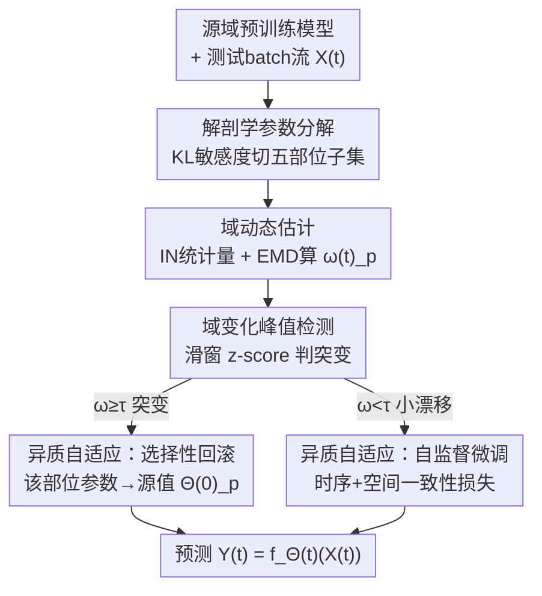

# Anatomical Domain Shifts: Test-time Heterogeneous Adaptation for 3D Human Pose Prediction

**会议**: CVPR 2026  
**论文**: [CVF Open Access](https://openaccess.thecvf.com/content/CVPR2026/html/Cui_Anatomical_Domain_Shifts_Test-time_Heterogeneous_Adaptation_for_3D_Human_Pose_CVPR_2026_paper.html)  
**代码**: 未公开  
**领域**: 3D视觉 / 人体理解  
**关键词**: 人体姿态预测, 持续测试时自适应, 解剖学异质性, 实例归一化, EMD域漂移检测

## 一句话总结
针对 3D 人体姿态预测的持续测试时自适应（CTTA），本文指出"域漂移其实集中在个别身体部位、而非全身均匀发生"这一被忽视的事实，提出 TT-HA：把模型参数按左右臂、左右腿、躯干拆成五个解剖学子集，用 IN 统计量 + EMD 在线度量每个部位的域变化，再据此对小漂移部位做自监督微调、对突变部位只回滚该部位参数到源模型，从而在全身 MPJPE 降 4.7% 的同时让四肢误差多降 9.2%。

## 研究背景与动机

**领域现状**：3D 人体姿态预测（HPP）给定一段历史姿态序列、预测未来 1 秒的关节运动。主流做法（GCN 的 LTD/PGBIG、MLP 的 siMLPe）都是"源域训练、直接部署到目标域"，但源域（受控实验室）和目标域（真实开放场景）之间存在显著分布差异，即域漂移，会让性能大幅退化。为此近年引入测试时自适应（TTA），在推理时就地把预训练模型对齐到目标样本。

**现有痛点**：标准 TTA 假设目标域是静态的，而真实部署里目标域持续演变（走路切换成跑步、与不同物体交互）。目前唯一能处理这种持续演变的方法是 HoCoTTA，它把模型参数分成"域敏感"和"域不变"两类，只在线更新前者、冻结后者。但它仍把人体当成一个均匀整体，对全身参数做统一适配。

**核心矛盾**：人体运动天然带有生物力学异质性——不同解剖部位的运动学特征差异巨大。论文用 t-SNE 给出了"概念验证"（Figure 1）：从 H3.6M 迁到 GRAB 时，全身特征拓扑确实变了，但拆开看，右腿和躯干的分布几乎没动，真正漂移的是手臂这类与交互强相关的部位。比如吸烟动作里腿的模式接近讨论动作、而手臂却差异巨大。把所有部位一视同仁地统一适配，会导致稳定部位被过度适配、易漂移关节又适配不足。

**本文目标**：让自适应"对症下药"——隐式估计每个解剖部位各自的域变化，并据此决定哪些部位参数要动、动多少。

**核心 idea**：用"按身体部位拆参数 + 逐部位在线度量域漂移 + 漂移大就回滚、漂移小就微调"的异质自适应，替代 HoCoTTA 那种全身一刀切的同质自适应。

## 方法详解

### 整体框架

TT-HA（Test-time Heterogeneous Adaptation）面对的是一串持续到来的测试 batch $X^{(1)} \to X^{(2)} \to \dots \to X^{(t)} \to \dots$，目标域满足 $D_{target}^{(1)} \neq D_{target}^{(2)} \neq \dots$（持续演变）。从源域预训练模型 $f_{\Theta^{(0)}}$ 出发，每来一个 batch 就把参数从 $\Theta^{(t-1)}$ 更新到 $\Theta^{(t)}$ 再做预测。

整条流程分两步：**离线**先用信息论敏感度把模型参数一次性切成五个解剖子集 + 一个共享子集；**在线**对每个 batch、每个部位 $p$，先用实例归一化（IN）统计量算出它相对上一域的 EMD 域变化 $\omega_p^{(t)}$，再用滑动窗口峰值检测判断这是否是一次"突变"——是突变就把该部位参数回滚到源值（保护住关键源知识、避免被剧变带崩），不是突变就用自监督损失对该部位做温和微调。每个部位独立走这套判断，所以同一时刻可能"手臂在回滚、躯干在微调"。骨干网络选了开源且性能最强的 siMLPe。

### 关键设计

**1. 解剖学参数分解：把"全身一锅端"拆成五个可独立调控的部位**

这一步针对"统一适配导致稳定区过度适配、漂移区适配不足"的根因：既然漂移是局部的，参数控制也得是局部的。作者把全参数集 $\Theta \in \mathbb{R}^D$ 切成五个解剖子集 $\{\Theta_{l\_leg}, \Theta_{l\_arm}, \Theta_{r\_leg}, \Theta_{r\_arm}, \Theta_{torso}\}$ 加一个共享子集 $\Theta_{shared}$。怎么判断某个参数属于哪个部位？用信息论稳定性度量：给参数加一个均匀扰动 $\epsilon \sim U(-a, a)$（$a=10^{-2}$），看输出分布对该部位 $p$ 的预测有多敏感，用期望 KL 散度衡量

$$S_p(\Theta_i) = \mathbb{E}_{X}\big[\mathbb{E}_{\epsilon}[D_{KL}(P(Y_p|X,\Theta) \| P(Y_p|X,\Theta+\epsilon))]\big].$$

直觉上，$S_p$ 越低说明这个参数对该部位的扰动越"无所谓"、与该部位耦合越紧（论文表述为低敏感度对应强相关）。对每个部位取 $\tau$-分位（$\tau=0.2$）的低敏感参数归入该部位子集 $\Theta_p$，所有部位都跨不过阈值的剩余参数归为共享子集 $\Theta_{shared} = \Theta \setminus \bigcup_p \Theta_p$。这样后续就能只动"漂移部位对应的那撮参数"。

**2. 域动态估计：用 IN 统计量 + EMD 逐部位量化"这一帧漂了多少"**

要对症下药，先得测出每个部位漂移多大。作者弃用 BN 而改用实例归一化（IN）——BN 对 batch size 敏感、且一个 batch 里混入多域数据会互相干扰；IN 按单样本归一化，剥掉个体特有的运动风格、保留与域相关的内容特征，天然适合"每个人习惯不同"的 HPP，也能给出更细粒度的逐部位域表征。为了在数据有限、上下文持续变化时保持稳定，IN 统计量用动量 $\eta=0.95$ 做指数滑动平均维护全局量：$\mu_p^{(t-1)} = (1-\eta)\mu_p^{(t-2)} + \eta\mu_p^{(t-1)}$（方差同理），只取倒数第二层的 IN 统计量以省算力。

有了上一域的全局 IN 分布 $N(\mu_p^{(t-1)}, \sigma_p^{(t-1)})$ 和当前 batch 适配前的 IN 分布 $N(\tilde\mu_p^{(t)}, \tilde\sigma_p^{(t)})$，用 Earth Mover's Distance（EMD）度量从上一域搬到当前域要花的"最小搬运成本"，这与持续适配的设定天然契合。把每通道 IN 统计当作高斯，逐通道求和得部位 $p$ 的域变化

$$\omega_p^{(t)} = \frac{\sqrt{2\pi}}{C}\sum_{c=1}^{C} \frac{\sigma_{p,c}^{(t-1)} + \tilde\sigma_{p,c}^{(t)}}{2}\cdot \mathrm{erfc}\!\left(\frac{\tilde\mu_{p,c}^{(t)} - \mu_{p,c}^{(t-1)}}{\sigma_{p,c}^{(t-1)} + \tilde\sigma_{p,c}^{(t)}}\right),$$

其中 $\mathrm{erfc}$ 是误差互补函数。$\omega_p^{(t)}$ 非负，值越大说明域变化越剧烈、越难适配。⚠️ 该闭式 EMD 表达式以原文为准。

**3. 域变化峰值检测：用滑动窗口 z-score 区分"渐变"与"突变"**

光有 $\omega_p^{(t)}$ 的绝对值还不够——持续场景里域一直在缓慢漂移，需要识别的是"相对历史的突然跳变"，这种突变才意味着旧参数已经救不回来、必须回滚。作者借用在线时间序列峰值检测：对部位 $p$ 维护一个长度 $w=36$ 的滑动窗口 $\Omega_p = [\omega_p^{(t-w)}, \dots, \omega_p^{(t-1)}]$，把窗口内的值除以最大值归一化到 $[0,1]$ 得 $\bar\Omega_p$，算出其均值 $\mu_{\bar\Omega}$ 与标准差 $\sigma_{\bar\Omega}$，再对当前归一化值算 z-score $z = (\bar\omega^{(t)} - \mu_{\bar\Omega})/\sigma_{\bar\Omega}$。若 $z \geq \tau_{peak}$（默认设为 12 倍标准差）就判定为峰值、触发该部位的源知识回滚；否则窗口滑动、继续。这把"该不该重置"从拍脑袋的固定阈值变成了自适应于历史波动的统计判据。

**4. 异质测试时自适应：突变回滚、小漂移自监督微调的双策略**

前三步算完每个部位的域变化和是否突变，这一步真正落到参数更新，且五个部位各走各的。对检测到峰值（$\omega_p^{(t)} \geq \tau_{peak}$）的部位，做**选择性知识回滚**——只把该部位参数重置回源训练值，其它部位的已适配知识保留：

$$\Theta_p^{(t)} \leftarrow \Theta_p^{(0)}, \quad \text{if } \omega_p^{(t)} \geq \tau_{peak}.$$

对未触发峰值（$\omega_p^{(t)} < \tau_{peak}$）的部位，做**解剖学测试时适配**，用学习率 $\lambda=10^{-3}$ 对该部位参数沿自监督损失梯度下降：

$$\Theta_p^{(t)} \leftarrow \Theta_p^{(t)} - \lambda \cdot \nabla_{\Theta_p^{(t)}}(\mathcal{L}_{temp} + \mathcal{L}_{spatial}).$$

之所以用自监督而非伪标签/知识蒸馏：持续场景里伪标签会越来越不可靠、误差不断累积，而自监督直接约束预测的物理合理性、不依赖标签。这套"哪坏修哪、坏太狠就重置"的机制既防止了稳定区被过度适配、又保住了关键源知识，是全文异质性思想的落地。

### 损失函数 / 训练策略

两个自监督损失都是逐部位 $p$ 计算（令观测长度 $T$ = 预测长度 $\Delta T$）：

- **时序一致性 $\mathcal{L}_{temp}$**：让预测姿态的逐帧位移与观测的逐帧位移保持一致（速度连续），$\mathcal{L}_{temp}^p = \frac{1}{T-1}\sum_{i=1}^{T-1}\|\tilde y_{p,i+1} - \tilde y_{p,i} - (x_{p,i+1} - x_{p,i})\|_2$，其中 $\tilde y$ 来自上一步适配参数 $\Theta^{(t-1)}$。
- **空间一致性 $\mathcal{L}_{spatial}$**：基于"人固定时相邻关节的相对位置不变"的先验，约束骨长稳定，$\mathcal{L}_{spatial}^p = \frac{1}{T(N-1)}\sum_{i=1}^{T}\sum_{n=1}^{N-1}\|\tilde L_{i,n}^{pred} - L_{i,n}^{obs}\|_1$，$\tilde L^{pred}$ 与 $L^{obs}$ 分别是预测/观测的第 $n$ 根骨在第 $i$ 帧的长度。

关键超参：动量 $\eta=0.95$、学习率 $\lambda=10^{-3}$、峰值阈值 $\tau_{peak}=12$ 倍标准差、窗口 $w=36$、部位数 $P=5$、分位 $\tau=0.2$。每个姿态用 17 个关节的 3D 坐标表示并归一化到 $[-1,1]$，观测 1 秒、预测 1 秒。

## 实验关键数据

四个数据集：H3.6M、CMU MoCap、GRAB（最难，人-物交互）、RICH（含场景接触，本文新引入）。对比 5 个基线分三组：GCN 的 LTD/PGBIG、MLP 的 siMLPe、TTA 的 H/P-TTP 与 HoCoTTA（前 SOTA）。指标：MPJPE、P-MPJPE（Procrustes 对齐）、PCK@150mm。四种实验设定：setup-1 常规、setup-2 未见类别、setup-3 未见受试者、setup-4 跨数据集（H3.6M→GRAB，最难）。

### 主实验（setup-1，MPJPE[mm]↓，节选）

| 数据集@时刻 | siMLPe | H/P-TTP | HoCoTTA | TT-HA |
|------------|--------|---------|---------|-------|
| H3.6M @400ms | 57.3 | 55.6 | 52.8 | **49.7** |
| H3.6M @1000ms | 109.4 | 103.7 | 101.4 | **97.4** |
| GRAB @1000ms | 137.5 | 138.0 | 131.8 | **127.5** |
| RICH @400ms | 48.7 | 45.3 | 43.5 | **32.2** |
| RICH @1000ms | 125.5 | 129.4 | 127.2 | **119.4** |

TT-HA 在全部数据集/时刻/三个指标上都取得最优。在新引入的 RICH 上提升尤为明显（@400ms 从 HoCoTTA 的 43.5 降到 32.2）。论文报告全身 MPJPE 平均降 4.7%，而四肢误差比此前方法多降 9.2%——印证"对症下药"主要赢在易漂移的四肢。

### 跨数据集（setup-4，H3.6M→GRAB，MPJPE[mm]↓，节选）

| 动作@时刻 | H/P-TTP | HoCoTTA | TT-HA |
|----------|---------|---------|-------|
| A1 passing @1000ms | 121.4 | 116.2 | **113.4** |
| A2 eating @1000ms | 152.4 | 147.3 | **143.6** |
| A3 drinking @1000ms | 133.6 | 128.5 | **124.3** |
| A4 lifting @1000ms | 138.5 | 132.2 | **128.8** |

最难的开放世界跨域设定下，TT-HA 在所有动作/指标上稳定领先 HoCoTTA，说明部位级动态适配 + 选择性回滚确实能扛住剧烈域差异。

### 消融实验（均在 setup-4，仅报 MPJPE）

| 超参配置 | @200 | @400 | @800 | @1000 |
|---------|------|------|------|-------|
| η=0.92, λ=1e-3 | 26.8 | 33.7 | 70.0 | 121.7 |
| **η=0.95, λ=1e-3（默认）** | **23.5** | **31.3** | **64.8** | **117.1** |
| η=0.95, λ=1.5e-3 | 26.4 | 32.1 | 65.7 | 119.2 |
| η=0.98, λ=1e-3 | 27.2 | 33.5 | 68.9 | 120.6 |
| τpeak=10, w=36 | 25.1 | 33.3 | 67.1 | 122.0 |
| **τpeak=12, w=36（默认）** | **23.5** | **31.3** | **64.8** | **117.1** |
| τpeak=14, w=36 | 25.0 | 36.2 | 67.0 | 121.6 |
| τpeak=12, w=24 | 24.3 | 32.2 | 65.8 | 119.7 |
| τpeak=12, w=48 | 24.5 | 34.3 | 66.2 | 120.1 |

### 关键发现
- **动量 η 控制 IN 统计的稳定性**：η=0.95 最优；过小（0.92）统计估计不稳、过大（0.98）对新域反应迟钝，两端都掉点。
- **峰值阈值 τpeak 控制回滚的激进程度**：τpeak 越小越爱判突变、越频繁回滚源知识；12 倍标准差在"敏感"与"性能"间取得平衡，10 和 14 都更差。
- **窗口 w 控制峰值检测的稳定性**：w=36 最优，更大（48）反应迟钝、更小（24）对噪声过敏。
- 整体上各超参附近性能相对平稳，但仍需调到最优值才出最好结果，说明方法对配置不算脆弱。
- 定性结果（Figure 3，knife-chop）显示 TT-HA 在手臂、腿部明显更贴近真值，而躯干、头部与 HoCoTTA 接近——与"漂移集中在四肢"的核心假设一致。

## 亮点与洞察
- **"域漂移是局部的"这个观察本身最值钱**：用 t-SNE 直接展示右腿/躯干在源/目标域几乎重合、只有手臂漂移，把一个直觉变成了可验证的现象，并据此重构了整个自适应粒度——这是全文的"啊哈"点。
- **用 IN 统计 + 闭式高斯 EMD 做在线域漂移度量很巧**：IN 天然按样本、按部位给出细粒度域表征，再配上可解析计算的高斯 EMD，让"漂移多大"变成一个便宜可算的标量，避免了对全测试集的依赖。
- **"回滚 vs 微调"按部位独立触发**：把灾难性遗忘的防护（回滚源参数）和持续适配（自监督微调）统一在同一个 z-score 判据下、且粒度细到单个解剖部位，这套机制可迁移到任何"漂移空间非均匀"的 CTTA 任务（如多区域医学影像、多传感器自动驾驶）。
- 自监督的时序+空间一致性损失绕开了持续场景里伪标签退化的老问题，是个干净的替代。

## 局限与展望
- **部位划分依赖人体解剖先验**：固定为左右臂/腿+躯干五段，对非人体或更细粒度（手指、面部）任务不一定适用；分解只做一次、不随域演变更新。
- **超参偏多且需调**：η、λ、τpeak、w 四个关键超参都在 setup-4 上调，跨任务的可迁移性未充分验证；τpeak=12 倍标准差这类设定较 ad-hoc。
- ⚠️ **EMD 闭式公式与敏感度"低=强相关"的表述**论文写得较简略，建议复现时回原文/附录核对；代码未公开增加了复现难度。
- **缺与全身回滚的彻底对照**：消融主要扫超参，没看到"去掉解剖分解、退化为全身统一适配"在同一表里的直接对比项，部位级粒度的净增益还可更显式地量化。

## 相关工作与启发
- **vs HoCoTTA**：同为持续 TTA、同样区分敏感/不变参数，但 HoCoTTA 把人体当均匀整体、全身统一适配；TT-HA 把参数按解剖部位拆开、逐部位度量漂移并独立决定回滚或微调，赢在四肢这类易漂移区（四肢误差多降 9.2%）。
- **vs H/P-TTP**：H/P-TTP 用辅助任务/知识蒸馏做 TTA，但在持续场景下伪标签会退化、误差累积；TT-HA 换成时序+空间自监督一致性损失，不依赖伪标签。
- **vs TENT / NOTE / TTN 等 TTA**：这些主要面向图像分类、靠更新 BN/IN 归一化参数或混合源-测试统计；TT-HA 把 IN 统计的用途从"被更新的参数"升级为"度量逐部位域漂移的探针"，并接上 EMD + 峰值检测做决策，面向人体运动的结构化异质性。

## 评分
- 新颖性: ⭐⭐⭐⭐⭐ "域漂移按解剖部位异质分布"是个被忽视且经验证的新视角，并据此重构了自适应粒度
- 实验充分度: ⭐⭐⭐⭐ 四数据集四设定 + 三指标覆盖全面，但缺"去掉解剖分解退化为全身适配"的直接对照项
- 写作质量: ⭐⭐⭐⭐ 动机清晰、t-SNE 论证有力，个别公式（EMD 闭式）与表述偏简略
- 价值: ⭐⭐⭐⭐ 部位级 CTTA 机制可迁移到其他"漂移非均匀"任务，但代码未公开略减实用度

<!-- RELATED:START -->

## 相关论文

- [\[ECCV 2024\] Human Motion Forecasting in Dynamic Domain Shifts: A Homeostatic Continual Test-Time Adaptation Framework](../../ECCV2024/human_understanding/human_motion_forecasting_in_dynamic_domain_shifts_a_homeostatic_continual_test-t.md)
- [\[AAAI 2026\] Robust Long-term Test-Time Adaptation for 3D Human Pose Estimation through Motion Discretization](../../AAAI2026/human_understanding/robust_long-term_test-time_adaptation_for_3d_human_pose_estimation_through_motio.md)
- [\[CVPR 2025\] CRISP: Object Pose and Shape Estimation with Test-Time Adaptation](../../CVPR2025/human_understanding/crisp_object_pose_and_shape_estimation_with_test-time_adaptation.md)
- [\[CVPR 2026\] Gaussian-Mixture Latent Flow for Stochastic 3D Human Motion Prediction](gaussian-mixture_latent_flow_for_stochastic_3d_human_motion_prediction.md)
- [\[CVPR 2026\] HamiPose: Hamiltonian Optimization for Unsupervised Domain Adaptive Pose Estimation](hamipose_hamiltonian_optimization_for_unsupervised_domain_adaptive_pose_estimati.md)

<!-- RELATED:END -->
