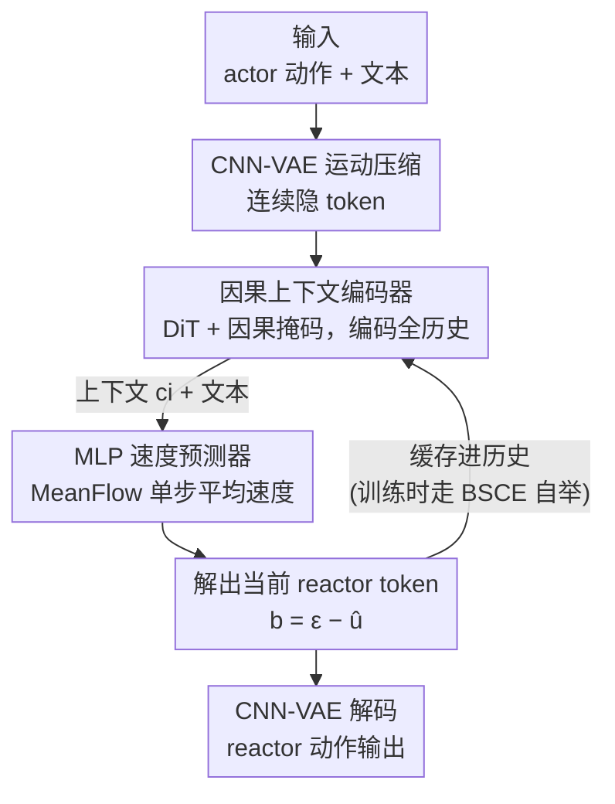

# ARMFlow: AutoRegressive MeanFlow for Online 3D Human Reaction Generation

**会议**: CVPR 2026  
**论文**: [CVF Open Access](https://openaccess.thecvf.com/content/CVPR2026/html/Geng_ARMFlow_AutoRegressive_MeanFlow_for_Online_3D_Human_Reaction_Generation_CVPR_2026_paper.html)  
**代码**: https://github.com/ZenGengChin/armflow_official  
**领域**: 3D视觉 / 人体理解 / 动作生成  
**关键词**: 3D人体反应生成, MeanFlow, 自回归生成, 单步推理, 实时动作合成

## 一句话总结
把"单步生成"的 MeanFlow 范式首次引入人体动作领域，用一个"因果上下文编码器 + 轻量 MLP 速度预测器"的自回归结构，配合自举历史训练（BSCE）抑制误差累积，让在线 3D 人体反应生成在单次推理内完成，FID 比已有在线方法降约 30%，速度还最快。

## 研究背景与动机
**领域现状**：3D 人体反应生成（action–reaction）要根据一个"主动者"（actor）的动作实时合成一个"反应者"（reactor）的动作，典型场景是人机交互、AR/VR。它和文本到动作、人物交互生成不同——条件是连续演化、不可预知的，必须**实时**响应，容不得秒级延迟。

**现有痛点**：要在线生成就必须用自回归结构来建模过去/未来动作的时序依赖，但现有自回归方案（CAMDM、HumanX）有两个硬伤。其一是**固定长度上下文窗口**：CAMDM 只看前 10 帧历史，超出窗口的信息直接丢掉，长序列上语义漂移严重，而且无法从零（t=0、无历史）起步生成。其二是**多步去噪太慢**：它们基于扩散模型，即便用 DDIM 加速也通常要 ≥8 步，在细粒度时间分辨率下计算开销大。另一类如 R2R 虽然做了全历史编码，却要 50 步推理，效率被拖垮。

**核心矛盾**：高保真、实时、长程上下文这三者在已有框架里很难同时满足——上下文窗口越长越准但越慢，去噪步数越多越真但越不实时。同时，自回归推理天然会**累积误差**：模型训练时只见过干净的真值历史，推理时却要吃自己生成的、带噪的历史，越滚越偏。

**本文目标**：(1) 用单步推理满足实时约束；(2) 编码全量历史而非固定窗口，保住全局语义；(3) 让模型在训练阶段就学会处理"自己生成的不完美历史"，抑制误差累积。

**切入角度**：作者注意到新近提出的 MeanFlow 范式——它不学每个时刻的瞬时速度场，而是直接学整条轨迹上的**平均速度**，因此一步积分就能从噪声跳到数据。把它接到自回归动作生成上，恰好同时解掉"慢"和"步数多"。

**核心 idea**：用 MeanFlow 的单步平均速度场替代多步扩散去噪做反应生成，再用一个因果全历史编码器替代固定窗口，并在训练里用模型自己生成的历史（而非真值历史）做条件，让它提前适应误差累积。

## 方法详解

### 整体框架
ARMFlow 要解决的是"给定文本 $\text{text}$ 和主动者动作序列 $x^a\in\mathbb{R}^{T,D}$，在线逐帧合成反应者动作 $x^b\in\mathbb{R}^{T,D}$"。整套方法分三层：先用一个 1D-CNN VAE 把 actor / reactor 动作压进共享连续隐空间；然后在这个隐空间上做 MeanFlow 生成——离线版 ReMFlow 用一个 DiT 整段一次性出，在线版 ARMFlow 用"DiT 因果上下文编码器 + MLP 速度预测器"逐 token 自回归出；训练阶段对在线模型施加 BSCE，用模型自己生成的历史构造上下文条件，渐进式引入累积误差以提升鲁棒性。

在线推理时是一个自回归回环：起始用一个可学习的 $\langle sos\rangle$ token 当初始历史，每步把当前 actor token、一个高斯噪声 token 喂给 MLP，单步预测平均速度并解出当前 reactor token，再把它缓存进历史、驱动下一步，直到 actor token 用尽。

### 关键设计

**1. MeanFlow 单步生成：把多步去噪压成一次平均速度积分**

针对"扩散/流模型要多步去噪太慢"这个痛点，本文不再学瞬时速度场 $v(z_\tau,\tau)$，而是学任意两个时刻 $r,t$ 之间的**平均速度**：

$$u(z_t,r,t)=\frac{1}{t-r}\int_r^t v(z_\tau,\tau)\,d\tau$$

这样从 $r=0$（噪声）到 $t=1$（数据）只需一步积分就能采样，推理成本骤降。对两边用 Leibniz 法则求导得到训练目标 $\mathcal{L}(\theta)=\mathbb{E}\lVert u_\theta(z_t,r,t)-\mathrm{sg}(u_{tgt})\rVert_2^2$，其中目标 $u_{tgt}=v(z_t,t)-(t-r)\big(v(z_t,t)\partial_z u_\theta+\partial_t u_\theta\big)$，$\mathrm{sg}(\cdot)$ 是 stop-gradient 稳定优化，雅可比–向量积（JVP）由自动微分算、不显式构造雅可比以省显存。作者还用了**有偏时间采样**：让一部分时间对满足 $r=t$（概率设 0.25），专门强化瞬时速度 $v(z_t,t)$ 的学习，对反应动作里关键的高频成分尤其有帮助。这是首个把 MeanFlow 用到人体动作生成的工作，也是它能"单次推理 + 高保真"的根。

**2. 因果上下文编码器 + MLP 速度预测器：全历史自回归替代固定窗口**

针对 CAMDM/HumanX 固定窗口"看不远、丢信息、无法从零起步"的痛点，ARMFlow 借鉴 MAR 的结构，把生成拆成"重的上下文编码 + 轻的速度预测"两半。编码器是 DiT 主干：把 actor 与 reactor 历史 token $(a_i,b_i)$ 沿最后一维拼接，前置可学习 $\langle sos\rangle$ 保证 $t=0$ 也能推理，文本经归一化层（AdaLN）注入，并施加**因果掩码**强制只看过去——于是它能从零编码、保留全部历史、不再受窗口长度限制，全局时序语义得以保留。编码出的上下文 $c_i$ 与上采样后的时间对 $(r,t)$ 一起，作为条件喂给一个 AdaLN 调制的轻量 5 层 MLP 速度预测器；当前从速度场插值得到的 reactor 样本 $b_i^{r,t}$ 进 MLP，输出平均速度 $\hat{u}^{r,t}$，反推出 reactor token。由于在线条件里多了"累积历史"，做 CFG 时也相应给 null token 配上 null 历史，保持条件接口一致。

**3. BSCE 自举上下文编码：训练就喂模型自己生成的历史，提前吃下误差累积**

针对自回归"训练见真值、推理吃自带噪历史 → 越滚越偏"的痛点，HumanX 用 history-rollout 渐进替换真值历史，但有三个毛病：为稳训要逐步从生成历史里减去真值、拖慢收敛；模型收敛后生成历史越来越像真值、自增强不足；只换 reactor 历史不换 actor、容易过拟合 actor 动作。BSCE 直接从训练**最开始**就把 actor 和 reactor 历史**双双换成模型生成的样本**（见算法 1）：每个 iteration 采一条样本，初始化上下文缓冲 $Z=\{\langle sos\rangle\}$，自回归跑 $K$ 步，每步编码上下文、采 $(r,t)$ 和噪声、单步预测速度并解出 token 追加进 $Z$、累计损失，最后用平均损失更新参数；并按调度逐渐增大自回归步数 $K$。随训练推进，生成历史会自然逼近真实轨迹，相当于一条"上下文噪声随时间递减"的自适应课程；而递增的 $K$ 又主动放大累积误差、把可控噪声注回去，增强对累积误差的鲁棒性。关键是 BSCE 天然契合 MeanFlow——单步推理让"生成增广历史样本"几乎零代价，不像 HumanX 那样 rollout 要跑多步扩散，训练效率大幅提升、收敛也更快。

### 损失函数 / 训练策略
- **CNN-VAE**：连续隐 token + KL 正则 $\mathcal{L}_{VAE}=\mathbb{E}_{q(z|x)}[\log p(x|z)]-\mathrm{KL}(q(z|x)\Vert p(z))$，并加逆运动学（IK）loss 约束关节位置、速度 loss 保平滑；用连续而非离散量化是因为 reactor 动作高度动态、缺乏标准化，离散码本会损失精度。
- **MeanFlow 主目标**：式 (2)(3)，时间步取 logit-normal 采样，$r=t$ 概率 0.25。
- **CFG**：训练期内置无分类器引导（构造 Ground-Truth Field），ReMFlow 取 $\omega=1.8$/2.0（InterHuman/InterX），ARMFlow 取 $\omega=1.8$/1.2。
- 超参：DiT 512 维、7 层、8 头带 skip；MLP 5 层；batch 64；AdamW，lr $1\times10^{-4}$；H100 训练。ARMFlow 在 4 帧粒度上做实时合成。

## 实验关键数据

数据集：InterHuman（7,779 条交互序列，AMASS 22 关节）与 InterX（11,388 条，SMPL-X 55 关节），均带 3 条文本描述。指标：FID（保真）、R-Precision@1/2/3 与 MM Dist（文本-动作语义对齐）、Diversity、MModality。

### 主实验（在线生成对比）

| 数据集 | 模型 | FID ↓ | R-Prec@3 ↑ | MM Dist ↓ |
|--------|------|-------|-----------|-----------|
| InterHuman | CAMDM | 4.000 | 0.587 | 3.828 |
| InterHuman | ReGenNet | 4.176 | 0.600 | 3.817 |
| InterHuman | R2R（次优） | 2.795 | 0.674 | 3.793 |
| InterHuman | **ARMFlow** | **2.178** | **0.699** | **3.783** |
| InterX | ReGenNet | 0.071 | 0.690 | 3.843 |
| InterX | R2R | 0.063 | 0.704 | 3.745 |
| InterX | **ARMFlow** | **0.042** | **0.711** | **3.728** |

在线设定下，ARMFlow 在 InterHuman 上 FID 比次优的 R2R 相对降约 28%（2.795→2.178），R-Prec@3 直逼真值（0.699 vs 真值 0.701）；InterX 上同样最优。有意思的是，ARMFlow 的在线 FID 甚至略低于自己离线版——说明在线自回归并不必然掉点。速度上，ARMFlow 每个实时步只做**一次**推理，而 ReGenNet 35–78 ms、CAMDM 45 ms、InterMask（离线）需 ≥20 步约 0.77 s、R2R 需 50 步。

离线版 ReMFlow 也在两数据集上拿到 SOTA：InterHuman FID 2.433（优于 InterMask 3.453、ReGenNet* 2.930），InterX FID 0.058，且仅需单次前向。

### 消融实验

| 配置 | FID ↓ (InterHuman) | FID ↓ (InterX) | 说明 |
|------|--------------------|----------------|------|
| ARMFlow-GTE（真值历史编码） | 5.136 | 0.548 | 只见真值历史，推理崩 |
| ARMFlow-Rollout（HumanX 策略） | 4.161 | 0.192 | 渐进 rollout，仍明显差 |
| **ARMFlow（BSCE）** | **2.178** | **0.042** | 自举双历史 |
| 换 DDIM-10 | 3.528 | 0.093 | 同架构改扩散目标 |
| 换 DDIM-50 | 3.449 | 0.064 | 多步扩散仍不及 |
| 换 Rectified Flow-10 | 2.449 | 0.059 | 流匹配也不及 MeanFlow |

### 关键发现
- **BSCE 是抗误差累积的关键**：相比直接喂真值历史（GTE，FID 5.136）和 HumanX 的 rollout（4.161），BSCE 把 InterHuman FID 压到 2.178、InterX 压到 0.042，提升幅度巨大——印证"训练就让模型吃自己生成的双历史"远比只换 reactor 历史/渐进减真值有效。
- **MeanFlow 优于扩散/流匹配**：固定架构只换生成目标，MeanFlow 在两数据集、在线/离线四种设置里 FID 与语义对齐全面最好，且单步生成让 BSCE 的历史增广近乎免费、训练大幅加速。
- **离散 vs 连续表示**：InterMask 的共享 VQ-VAE 过度压缩动作特征、重建变差，FID 明显偏高——这正是本文坚持用连续隐 token 的理由。
- **短序列上 ReGenNet 更吃香**：InterX 序列短，ReGenNet 的短时注意力反而较有效，但仍不及 ARMFlow。

## 亮点与洞察
- **把 MeanFlow"单步平均速度"接到自回归动作生成**：一步解决"慢"和"多步"，是全文最巧的杠杆点——单步推理不仅省时，还让 BSCE 的"生成历史增广"几乎零成本，二者天然耦合。
- **BSCE 的"双历史 + 递增步数"课程**：把"生成历史逐渐逼近真值"当作天然降噪课程，又用递增自回归步数主动放大累积误差注回鲁棒性，一减一增的设计很有想法，可迁移到任何自回归序列生成的 exposure bias 问题。
- **重编码器 + 轻预测器的解耦**：DiT 编全历史、5 层 MLP 出速度，把"理解上下文"和"快速预测"分到不同算力档位，是兼顾长程语义与实时性的实用工程范式。

## 局限与展望
- 作者承认：当前实现对自回归小窗口**没有弹性延迟处理**，多智能体交互时可能出现轻微异步；且 MeanFlow 不支持扩散式的事后 classifier guidance，无法做基于优化的后处理修正。
- 自己观察：在线 ARMFlow 的 CFG 强度 $\omega$ 在两数据集上差异较大（1.8 vs 1.2），暗示对条件强度较敏感、需逐数据集调；消融主要围绕 FID/R-Prec，缺少对"实时延迟稳定性 / 长序列漂移随帧数变化"的定量曲线，⚠️ 端到端实时延迟仅在 Fig.1 定性给出，未列严格 wall-clock 表。
- 改进方向：把弹性延迟/多智能体异步纳入训练目标；探索 MeanFlow 下可用的轻量引导机制以补回后处理修正能力。

## 相关工作与启发
- **vs CAMDM / HumanX**：它们用固定长度上下文窗口的自回归扩散，看不远、无法从零起步、需多步去噪；本文用因果全历史编码器 + MeanFlow 单步，既保全局语义又实时，FID 大幅领先。
- **vs ReGenNet**：它是 transformer-decoder 扩散、每步从高斯噪声初始化 reactor 且只条件于 actor 前一帧，时序不连贯；ARMFlow 显式利用 reactor 自身历史做自回归，长序列更稳。
- **vs R2R**：同样做全历史编码，但 R2R 要 50 步推理效率被拖垮；本文单步推理，在线 FID 还相对再降约 28%。
- **vs MAR（图像自回归）**：借鉴其"上下文编码器 + 轻 MLP"解耦结构，但 MAR 用 MAE 式随机掩码降误差传播，对要求时序一致的实时任务不合适；本文换成因果掩码 + BSCE 这一更贴合有序/实时生成的方案。

## 评分
- 新颖性: ⭐⭐⭐⭐⭐ 首个把 MeanFlow 用于人体动作生成，并用 BSCE 把单步推理与抗误差累积训练自然耦合。
- 实验充分度: ⭐⭐⭐⭐ 在线/离线 × 两数据集 + 生成目标/训练策略双消融充分，但实时延迟缺严格 wall-clock 表。
- 写作质量: ⭐⭐⭐⭐ 三大挑战→两大局限→三点贡献的逻辑清晰，公式与算法完整。
- 价值: ⭐⭐⭐⭐⭐ 实时高保真反应生成对 HRI/AR/VR 有直接落地价值，框架可推广到其他自回归动作任务。

<!-- RELATED:START -->

## 相关论文

- [\[CVPR 2026\] PolySLGen: Online Multimodal Speaking-Listening Reaction Generation in Polyadic Interaction](polyslgen_online_multimodal_speaking-listening_reaction_generation_in_polyadic_i.md)
- [\[CVPR 2026\] ReMoGen: Real-time Human Interaction-to-Reaction Generation via Modular Learning from Diverse Data](remogen_real-time_human_interaction-to-reaction_generation_via_modular_learning_.md)
- [\[CVPR 2026\] Next-Scale Autoregressive Models for Text-to-Motion Generation](next-scale_autoregressive_models_for_text-to-motion_generation.md)
- [\[CVPR 2026\] ReGenHOI: Unifying Reconstruction and Generation for 3D Human-Object Interaction Understanding](regenhoi_unifying_reconstruction_and_generation_for_3d_human-object_interaction_.md)
- [\[CVPR 2026\] LLaMo: Scaling Pretrained Language Models for Unified Motion Understanding and Generation with Continuous Autoregressive Tokens](llamo_scaling_pretrained_language_models_for_unified_motion_understanding_and_ge.md)

<!-- RELATED:END -->
