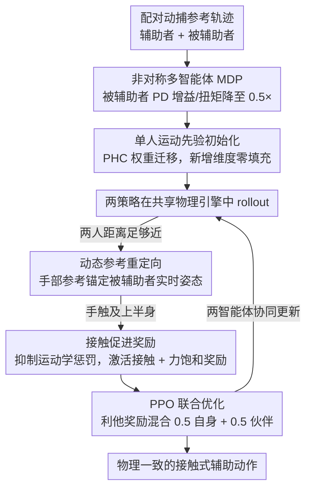

# AssistMimic: Physics-Grounded Humanoid Assistance via Multi-Agent RL

**会议**: CVPR 2026  
**arXiv**: [2603.11346](https://arxiv.org/abs/2603.11346)  
**代码**: [项目页](https://yutoshibata07.github.io/AssistMimic/)  
**领域**: 其他  
**关键词**: 多智能体强化学习, 物理仿真, 辅助行为, 运动模仿, 接触式交互  

## 一句话总结

首个在物理仿真中实现接触式人-人辅助行为模仿学习的多智能体RL框架，通过运动先验初始化、动态参考重定向和接触促进奖励使MARL在高接触设置中可行。

## 研究背景与动机

**领域现状**：单人运动跟踪（PHC、DeepMimic）已能模仿广泛的人类动作，但主要限于无接触社交或孤立运动。辅助场景（扶起跌倒者、护理卧床者）需要持续感知伙伴并适应其动态变化，涉及紧密接触和力交换——这比 high-five 等无接触社交交互困难得多。

**现有痛点**：先前方法用"运动学回放"策略——先独立生成被辅助者运动再训练辅助者反应。但在辅助场景中，被辅助者在物理上无法独立完成动作（如肌无力者无法自行站起），此范式根本不适用；解耦两个智能体的学习会打破物理一致性。

**核心矛盾**：接触式辅助运动的 RL 训练极其不稳定——接触位置和力的微小误差就能使被辅助者失去平衡，加上动捕数据中严重的遮挡导致参考轨迹噪声大。因此需要一整套使 MARL 在物理紧耦合场景中可行的技术组件。

## 方法详解

### 整体框架

这篇论文要让一个仿真人形机器人（辅助者 Supporter）在物理仿真里真正"扶住"另一个虚弱的人（被辅助者 Recipient）——比如把跌倒者扶起、给卧床者翻身——而不是隔空比划。为此它把任务写成一个**非对称多智能体 MDP**：两个智能体各有独立策略、共享同一套物理引擎，靠 PPO 联合优化。关键在"非对称"：被辅助者被人为削弱以模拟身体障碍——它的 PD 控制增益和最大关节扭矩被统一降到原来的 $0.5\times$（下肢、上肢都按 0.5 倍），所以它光靠自己站不起来，必须依赖辅助者施加的真实接触力才能完成动作。这一刀切掉了旧范式"先单独生成被辅助者运动、再训练辅助者反应"的退路，逼着两个策略在物理上紧耦合地一起学。难点也随之而来：接触位置和力的微小误差就能让被辅助者失衡，加上动捕参考因遮挡噪声很大，直接上 MARL 几乎不收敛。下面三个设计就是为把这套训练从"完全跑不动"拉到可行而加的：**单人运动先验初始化**给一个不崩的起点、**动态参考重定向**保证扶得准、**接触促进奖励**保证扶得实，三者依次嵌进"初始化→近距 rollout→接触"的数据流里。

### 关键设计

**1. 单人运动先验初始化：给紧耦合 MARL 一个不崩的起点**

从零训练时，两个智能体要同时学会站立、行走、互相接触，搜索空间太大——实验里直接出现 0% 成功率或 reward hacking（钻奖励漏洞而非真去辅助）。这里的做法是用一个预训练好的 PHC 单人跟踪控制器去初始化两个策略**共享的网络参数**，让它们一上来就具备基本的站立和行走能力，只需在此基础上学接触协调。难点是辅助任务比单人多了"伙伴状态"这部分输入，网络入层维度对不上。解决办法是把新增的辅助状态输入维度用零填充，权重写成 $\mathbf{W}_{new} = [\mathbf{W}_{prior} \mid \mathbf{0}]$——旧维度沿用先验权重、新维度初值为零，从数学上保证初始时刻的输出和单人先验完全一致，不会一开始就被随机新参数带偏。

**2. 动态参考重定向：让扶的手始终锚在伙伴身上，而不是锚在噪声轨迹上**

辅助者的手该放哪，本来是去跟踪一条动捕参考轨迹，但这条轨迹因遮挡噪声很大，硬跟会让手偏离被辅助者真实身体位置，一旦脱离接触，被削弱的被辅助者立刻摔倒。重定向的机制是：当两人距离足够近时，把辅助者的手部参考从"固定的世界系参考轨迹"切换成"相对于被辅助者当前姿态的偏移量"——也就是手的目标不再钉在空间某点，而是钉在伙伴身体的正确部位上，随对方实时姿态一起动。这样即便参考轨迹本身漂移，手也始终贴在该扶的地方，接触不丢。消融显示去掉它在床上护理类场景（HHI）掉 $-10.3\%$，正说明这类伙伴姿态变化大的场景最依赖它。

**3. 接触促进奖励：在该接触时换一套奖励，别用运动学惩罚扼杀正确接触**

纯运动学跟踪奖励有个内在矛盾：在噪声参考下，辅助者做出"正确的物理支撑"动作反而会因偏离参考被惩罚，于是策略学会躲着不接触。这里按距离做切换——当辅助者的手接近被辅助者上半身时，抑制运动学跟踪惩罚项，转而激活一组基于接触的奖励：一是**接触稀疏奖励**，判断有没有真接触上；二是**力饱和聚合函数**，对接触力的质量打分（力太小不算扶住、力饱和后不再加分），从而鼓励真正吃上力的支撑而非贴一下的假接触。两项合起来把奖励信号从"贴着参考轨迹"重新对准到"真把人扶住"。

### 一个完整示例：扶起一个站不起来的人

把三个设计串起来看一次"辅助者扶被辅助者站起"的完整流程，就能看清它们各管一段：

- **起步（先验初始化生效）**：回合开始时两个策略都从 PHC 先验权重出发，辅助者能稳稳站立、走近，被辅助者（PD 增益 $0.5\times$）尝试起身但力不从心、独自起不来——若没有先验，这一步往往直接崩成 0% 成功。
- **接近（重定向切换触发）**：辅助者走到足够近，手部参考从世界系固定轨迹切换为"锚定被辅助者当前姿态的偏移"。此刻即便动捕参考因遮挡在抖，辅助者的手依然对准伙伴的手臂/躯干，不会扑空。
- **接触（接触促进奖励接管）**：手一触到被辅助者上半身，运动学惩罚被抑制、接触奖励激活；力饱和聚合函数推动辅助者施加足够大且持续的支撑力，把站不起来的被辅助者真正托起。
- **结果**：被辅助者借这股外力完成站立。整个过程里三个设计分别保证了"能动""扶得准""扶得实"，缺一个流程就在对应环节断掉（消融里去掉初始化或接触奖励，成功率分别塌到 0% 与显著下降）。

### 损失函数 / 训练策略

每个智能体的总奖励由任务奖励与 AMP 对抗奖励等权混合：$r = 0.5\,r_{task} + 0.5\,r_{AMP}$，后者用对抗运动先验约束动作自然、像人。为鼓励利他行为，辅助者的最终奖励再把自己和被辅助者的奖励各取一半混合：$r_{sup} = 0.5\,r_{sup}^{self} + 0.5\,r_{rec}$，这样辅助者的收益直接和被辅助者是否被扶好挂钩。训练分两段：先按各个动作片段分别训练专家策略，再用 DAgger 把这些专家蒸馏成一个通用策略（直接训练通用策略只有 $39.8\%$ 成功率，DAgger 蒸馏能拉到 $64.7\%$）。

## 实验关键数据

### 主实验

| 数据集 | 指标 | AssistMimic | 无初始化 | 无接触奖励 |
|--------|------|-------------|---------|-----------|
| Inter-X | SR | 83.3% | 0% | 77.1% |
| HHI-Assist | SR | 73.2% | hacking | 27.7% |

### 消融实验

| 配置 | 关键指标 | 说明 |
|------|---------|------|
| 联合训练 vs 顺序训练 | 72.8% vs 50.5% | 联合优化对物理一致性至关重要 |
| 通用策略(DAgger) | SR=64.7% | 直接训练仅39.8%，DAgger蒸馏有效 |
| 无动态重定向 | -10.3% (HHI) | 对床上护理等场景至关重要 |
| 1.5×体重/0.5×PD | 仍成功 | 零样本鲁棒性验证 |

### 关键发现

- 运动先验初始化绝对不可或缺：无初始化在Inter-X上0%成功率，HHI-Assist上产生reward hacking
- 可成功跟踪扩散模型生成的交互轨迹——策略具有对未见运动的泛化能力
- 主要失败模式是手部灵巧性不足：抓臂举起等精细操作仍然困难

## 亮点与洞察

- 首次实现物理仿真中接触式辅助行为的多智能体模仿学习，填补了从"无接触社交"到"力交换辅助"的重要空白。通过降低被辅助者物理参数来isolate辅助贡献的实验设计非常巧妙。

## 局限与展望

- 手部灵巧性不足是主要失败模式，需要更精细的手部建模
- 策略依赖特权物理状态信息，缺乏视觉观测
- 未进行sim-to-real迁移验证
- 运动规划器与跟踪控制器之间缺乏紧耦合

## 相关工作与启发

- **vs Human-X**: 用运动学回放+反应式策略，辅助场景中被辅助者"自己站起来"导致物理不一致
- **vs PHC**: AssistMimic以PHC为基础，扩展到双人partner-aware架构

## 评分

- 新颖性: ⭐⭐⭐⭐⭐ 首次解决辅助运动模仿，问题形式化和技术方案都很创新
- 实验充分度: ⭐⭐⭐⭐⭐ 两个数据集、多场景、详尽消融、生成轨迹泛化
- 写作质量: ⭐⭐⭐⭐ 结构清晰，技术细节完整
- 价值: ⭐⭐⭐⭐⭐ 开辟辅助机器人控制新方向

<!-- RELATED:START -->

## 相关论文

- [\[CVPR 2026\] InterAgent: Physics-based Multi-agent Command Execution via Diffusion on Interaction Graphs](interagent_physics-based_multi-agent_command_execution_via_diffusion_on_interaction_graphs.md)
- [\[CVPR 2026\] PHASE-Net: Physics-Grounded Harmonic Attention System for Efficient Remote Photoplethysmography Measurement](phase-net_physics-grounded_harmonic_attention_system_for_efficient_remote_photop.md)
- [\[CVPR 2026\] SyncMos: Scalable Motion Synchronisation for Multi-Agent Scene Interaction](syncmos_scalable_motion_synchronisation_for_multi-agent_scene_interaction.md)
- [\[CVPR 2026\] Push-and-Step: From RL-Based Balance Recovery to Physical Simulation of Dense Crowds](push-and-step_from_rl-based_balance_recovery_to_physical_simulation_of_dense_cro.md)
- [\[CVPR 2026\] Humanoid-GPT: Scaling Data and Structure for Zero-Shot Motion Tracking](humanoid-gpt_scaling_data_and_structure_for_zero-shot_motion_tracking.md)

<!-- RELATED:END -->
