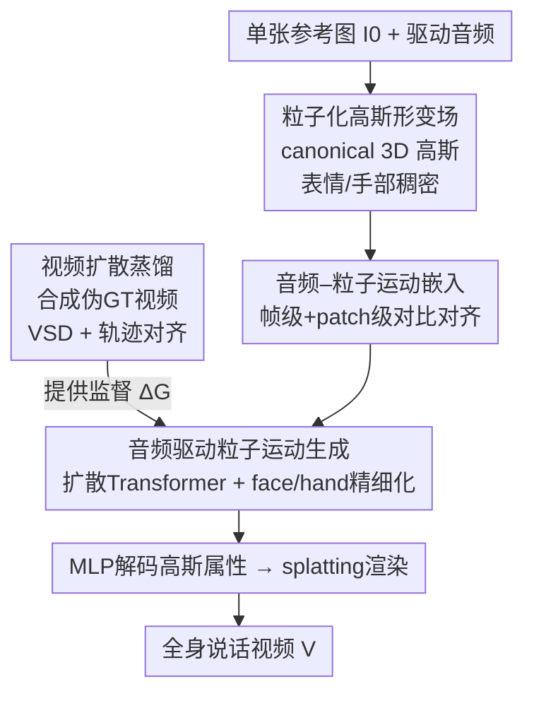

# AudioAvatar: Personalized Audio-driven Whole-body Talking Avatars

**会议**: CVPR 2026  
**论文**: [CVF Open Access](https://openaccess.thecvf.com/content/CVPR2026/html/Lee_AudioAvatar_Personalized_Audio-driven_Whole-body_Talking_Avatars_CVPR_2026_paper.html)  
**代码**: 无  
**领域**: 人体理解 / 数字人 / 3D视觉  
**关键词**: 音频驱动数字人, 3D高斯, 粒子形变场, 扩散蒸馏, 单图个性化  

## 一句话总结
AudioAvatar 用一张人像照片重建一个 canonical 的 3D 高斯全身数字人，并让音频**直接**调制每个高斯粒子的运动轨迹（跳过"音频→参数化姿态→渲染"这条有损中间链），再借大型音频驱动视频扩散模型做特征蒸馏，从而在嘴形同步、面部微表情和手势自然度上全面超过姿态驱动的基线。

## 研究背景与动机
**领域现状**：当前做"会说话的全身数字人"主要有两条路。(a) 大规模**音频驱动视频扩散模型**（OmniAvatar、HunyuanVideo-Avatar 等），从一张参考图+音频直接生成说话视频；(b) **模板化 3D 数字人**，用 SMPL/SMPL-X 拟合 canonical 几何外观，再用姿态驱动的 LBS 配合 NeRF / 3D 高斯渲染。

**现有痛点**：扩散模型这条路通常只覆盖头部/上半身、手和面部细节糊、长序列里身份会漂移，而且推理时要反复去噪、慢且不可复用同一身份。模板化 3D 数字人这条路渲染逼真，但要驱动它说话，必须先经过一个**独立的音频→姿态模块**预测参数化的身体/面部/手部姿态，再喂给姿态条件渲染器。

**核心矛盾**：那个音频→姿态的中间环节是个**有损瓶颈**——量化、retarget、逐帧 tracking 的误差会层层累积，导致唇音不同步，并且把对真实感至关重要的**微articulation**（双唇闭合、鼓腮、鼻唇沟运动、眨眼、手指细微动作）给抹平了。在"单图个性化"这种本就病态的设定下，这个问题被进一步放大。

**本文目标**：从单张照片同时拿到 (1) 一个可形变、保身份的全身 canonical 数字人，和 (2) 一个能直接从音频对齐 face/hands/body 动态的控制器。

**核心 idea**：**让音频直接调制 canonical 高斯粒子的逐粒子轨迹**，端到端地把音频映射成稠密可微形变场，彻底去掉音频→姿态→渲染的两次有损交接；再用大型视频扩散模型的先验做蒸馏来弥补单图监督的不足。

## 方法详解

### 整体框架
给定参考图 $I_0$ 和驱动音频，目标是合成保持身份的全身说话视频 $V=\{I_t\}_{t=0}^{T}$。场景用一组 canonical 空间里的 3D 高斯 $G=\{g_i\}_{i=1}^{N}$ 表示，这些粒子在表情/手部等表达力强的区域稠密、其它地方稀疏以省算力。整条管线分四块串起来：先把音频特征和高斯形变嵌进同一个语义流形里对齐（嵌入），再用一个扩散 Transformer 从对齐后的音频生成逐粒子运动并对 face/hand 做精细化（生成），生成的粒子运动经 MLP 解码成高斯属性后用 splatting 渲染出视频；而整套生成器和形变场的监督，来自一个**视频扩散蒸馏**模块——它先合成身份特定的说话视频当伪 GT，再用 score distillation + 轨迹对齐 loss 把扩散先验注入粒子动力学。

训练设定上是"自举"的：先用大规模音频驱动视频扩散模型合成身份特定的说话视频 $\hat{V}_i$，把一个可形变高斯 splatting 模型拟合到这些视频上得到高斯形变 $\Delta G$，这些**伪 ground-truth 运动**就成了后续学习"音频–粒子嵌入"和"音频驱动粒子生成"的监督信号。

### 关键设计

**1. 粒子化高斯形变场：把音频直接接到逐粒子轨迹上，绕开姿态中间层**

针对的就是"音频→参数化姿态"那个有损瓶颈。作者不再预测 SMPL-X 之类的低维姿态，而是从单张照片重建一个保身份的 canonical 数字人，并在其上实例化高斯粒子——在嘴、眼、手这些表达力区域**稠密**铺点、其它地方**稀疏**以省算力。音频特征**直接**调制每个粒子的运动轨迹，于是嘴/眼/手的微articulation 可以被局部控制，而身体大动作保持全局协调。把这套控制跑在与音频同步的帧率上，既能表达爆破音闭合这种快速瞬态，也能表达点头、beat 手势这种较长的韵律运动。为了在保留高频细节的同时压住抖动，作者在 locality 和频谱上加正则；并用 ARAP 距离保持先验约束相邻时刻 k 近邻粒子之间的几何（⚠️ 正则项的具体频谱形式原文未给闭式，以原文为准）。

**2. 音频–粒子运动嵌入：把音频和高斯形变压进同一语义流形，让生成有锚点**

直接拿原始音频去回归粒子运动会很不稳，因为两种模态没对齐。作者借鉴 CLIP 式对比学习，训练一个粒子运动编码器 $\mathcal{E}_X$ 把高斯形变 $\Delta G_t$ 映成隐式运动特征 $x_t=\mathcal{E}_X(\Delta G_t)$，使**语义对应**的音频–粒子对余弦相似度高、错配对相似度低，最小化帧级相似性损失 $\mathcal{L}_{sim}$，从而得到模态不变的运动表示。在此之上再加一层 **patch 级对比**：用滑动时间窗把音频特征 $a_t$ 和粒子运动 $x_t$ 切成短时 patch，对 patch 做平均池化后再算余弦相似度。这样帧级+patch 级的层次对齐既保证逐帧语义匹配，又保证短时上下文内运动轨迹平滑连贯，为后面的生成提供一个稳健的共享流形。

**3. 音频驱动粒子运动生成：扩散 Transformer 先出全身、再精细化 face/hand**

单一网络很难同时管好"全身大动作"和"指尖/嘴角的高频细节"。作者用分层设计：因为运动表示已经被压在紧凑低维流形里，先用一个高容量**扩散 Transformer** $F$ 合成全身粒子运动 $x_t=\{x_t^{body}, x_t^{face}, x_t^{hand}\}$。它把加噪粒子运动 $X_\tau$ 与音频特征 $A$ 拼接后输入，扩散步 $\tau$ 通过 FiLM 注入，并直接预测干净运动：
$$X_0 = F(X_\tau \mid A, \tau)$$
接着对 face/hand 子集再过一个 Transformer **精细化模块**——关键区别是它**不**以扩散步 $\tau$ 为条件，而是以说话序列真实时间轴上的运动时间索引 $t$ 为条件，从而做时间一致的细粒度运动精修。最后整套粒子运动（含精修后的 face/hand）经前馈 MLP 解码成高斯属性 $\{G_0,\dots,G_T\}$，再 splatting 渲染成视频。

**4. 视频扩散蒸馏：用大模型先验补单图监督，并强约束时序一致性**

单图个性化的监督太稀薄，作者把大规模视频扩散模型的"音频–运动先验"蒸馏进粒子表示。第一步是**混合数据合成**：先用一个文本条件的图像生成基模型按属性字典（性别/年龄/发型/着装等）造出多样的全身身份图，配上由文本语料 TTS 合成的语音，再喂给若干**音频驱动视频扩散模型**生成与音频同步的说话视频——前者给视觉保真与外观多样性，后者给音频–运动同步，两者互补出高质量伪 GT。第二步是两个 loss 把先验注入动力学：**视频 score distillation（VSD）**让渲染帧落到教师的音频条件视频流形上，对噪声水平 $\tau$、教师 score 网络 $s_\psi$，梯度为
$$\nabla_\Phi \mathcal{L}_{vsd} = \mathbb{E}_{t,\tau,\epsilon}\Big[w(\tau)\big(s_\psi(\tilde{I}_{t,\tau},\tau,c)-\epsilon\big)\frac{\partial \tilde{I}_{t,\tau}}{\partial \Phi}\Big]$$
其中 $\tilde{I}_{t,\tau}=\alpha(\tau)\hat{I}_t+\sigma(\tau)\epsilon$；**轨迹对齐 loss** 则保证 4D 高斯形变时序一致——每个高斯渲染出一条 2D 像素轨迹，用扩散生成的像素运动当 GT，对渲染中心 $\hat{u}_t^i$ 和目标像素 $u_t^i$ 做逐帧重投影误差累加：
$$\mathcal{L}_{traj}=\sum_i\sum_t \lVert \hat{u}_t^i - u_t^i \rVert_2^2$$
此外还用 L1 监督渲染帧与扩散生成图的一致。消融显示轨迹对齐是同步性的最强单一保证。

### 损失函数 / 训练策略
端到端训练，渲染 loss 的梯度穿过时间回传到音频条件形变场，让渲染器和动力学协同适配紧致的音视频对齐。总目标由几部分组成：粒子生成模块沿用 [56] 的 $\mathcal{L}_{simple}$ 扩散损失；视频 score distillation $\mathcal{L}_{vsd}$；轨迹对齐 $\mathcal{L}_{traj}$；渲染帧与扩散图之间的 L1；以及相邻时刻 k 近邻之间的 ARAP 距离保持先验做正则。嵌入阶段则用帧级 + patch 级对比损失 $\mathcal{L}_{sim}$。

## 实验关键数据

### 主实验
测试集为 30 个训练中未见的说话主体（来自公开 causal conversational、seamless-interaction 数据集及自采/自生成数据，单人全身、5–10 秒、音视频对齐）。基线分两类：单图可驱动高斯数字人 LHM、PERSONA（不能直接吃音频，需外接音频→姿态转换器 [6]），以及音频驱动视频扩散模型 OmniAvatar、HunyuanVideo-Avatar、EchoMimicV2。

| 方法 | IQA↑ | ASE↑ | SyncC↑ | SyncD↓ | HKC↑ | CSIM↑ | SSIM↑ | PSNR↑ | FID↓ | FVD↓ |
|------|------|------|--------|--------|------|-------|-------|-------|------|------|
| EchoMimicV2 | 3.37 | 1.98 | 4.12 | 10.20 | 0.836 | 0.458 | 0.660 | 15.90 | 22.8 | 420 |
| OmniAvatar | 3.99 | 2.64 | 6.40 | 7.60 | 0.858 | 0.525 | 0.705 | 17.20 | 18.6 | 350 |
| HunyuanVideo-Avatar | 4.08 | 2.71 | 6.90 | 7.12 | 0.875 | 0.539 | 0.709 | 17.55 | 17.2 | 320 |
| LHM | 3.80 | 2.50 | 6.10 | 7.00 | 0.860 | 0.500 | 0.700 | 16.90 | 19.5 | 365 |
| PERSONA | 3.88 | 2.58 | 6.30 | 6.80 | 0.868 | 0.510 | 0.708 | 17.20 | 18.9 | 345 |
| **AudioAvatar (Ours)** | **4.22** | **2.83** | **7.20** | **5.42** | **0.897** | **0.551** | **0.742** | **18.30** | **12.4** | **240** |

相对单图高斯数字人基线，感知质量 IQA +3.4% / ASE +4.4%、唇音同步 SyncC +4.3% / SyncD +20.3%、低层保真 SSIM +4.7% / PSNR +4.3%；相对最强扩散基线，FID 降 27.9%、FVD 降 25.0%，手势保真 HKC +2.5%。所有指标均领先。

### 消融实验
| 配置 | SyncC↑ | SyncD↓ | HKC↑ | FID↓ | FVD↓ | 说明 |
|------|--------|--------|------|------|------|------|
| Full model | 7.20 | 5.42 | 0.897 | 12.4 | 240 | 完整模型 |
| w/o 音频–粒子嵌入 | 7.05 | 5.60 | 0.890 | 13.8 | 265 | 同步性下滑，模态对齐受损 |
| w/o patch 级对齐 | 7.15 | 5.45 | 0.870 | 13.1 | 252 | SSIM/PSNR 降、FID/FVD 升，空间一致性差 |
| w/o face/hand 精细化 | 7.10 | 5.50 | 0.860 | 13.7 | 258 | HKC 0.897→0.860，高articulation 区域结构性退化 |
| w/o 混合视频合成 | 6.85 | 5.80 | 0.888 | 14.2 | 272 | 音视频同步明显变差（SyncC 7.20→6.85，ASE 2.83→2.74）|
| w/o 视频 score distillation | 6.90 | 5.78 | 0.886 | 15.0 | 290 | 时序平滑被破坏，FVD 240→290 |
| w/o 轨迹对齐 | 6.70 | 6.20 | 0.872 | 15.6 | 310 | **同步最差**：SyncD 5.42→6.20 |

### 关键发现
- **轨迹对齐 loss 是同步性的命门**：去掉后 SyncD 从 5.42 飙到 6.20，是所有消融里同步性最差的，说明轨迹级（而非逐帧姿态级）对齐才是稳定连贯运动的关键。
- **VSD loss 主要管时序平滑**：去掉它 FVD 从 240 涨到 290，验证它把教师的时间相干性注入了粒子动力学。
- **face/hand 精细化模块对手部最敏感**：去掉后 HKC 从 0.897 掉到 0.860，证明它专门负责高articulation 区域的结构一致性。
- 各模块互补：每去掉任意一个组件，视觉保真、运动自然度、音频–运动同步都会同时受损，没有冗余设计。

## 亮点与洞察
- **"去姿态中间层"是核心赌注**：用稠密可微的逐粒子轨迹替代参数化姿态，从根上消掉了量化/retarget/逐帧 tracking 的误差累积——这套思路对任何"信号→参数→渲染"的有损管线（手语、舞蹈、面捕）都有迁移价值。
- **表达力自适应的粒子密度**：嘴/眼/手稠密、其它稀疏，等于把算力预算按"哪里需要高频控制"分配，是高斯表示天然好用的一点。
- **自举式监督闭环**：先用大扩散模型造伪 GT 视频，再把可形变高斯拟合上去得到 $\Delta G$ 当监督，巧妙绕过了"会话全身视频+音频"配对数据稀缺的硬约束。
- **精细化模块换条件轴很关键**：把 refinement 的条件从扩散步 $\tau$ 换成真实时间索引 $t$，是它能做时间一致细修而不被去噪步数干扰的小而精的设计。

## 局限与展望
- **重度依赖教师扩散模型**：伪 GT 质量、身份多样性、音频同步都被上游视频扩散模型的能力上限卡住；教师在某些口型/语言上的系统性偏差会被蒸馏进来。
- **数据来源受限且部分自建**：作者明确承认公开"会话全身视频+音频"数据稀缺，测试仅 30 人、单段 5–10 秒，长序列稳定性和跨语种泛化未充分验证。⚠️ 训练/推理耗时与高斯粒子数 $N$ 的具体量级原文未给，效率优势主要是相对扩散模型的定性说法。
- **正则项细节偏粗**：locality/频谱正则与 ARAP 先验的具体形式与权重原文交代得简略，复现需补。
- 可改进：把蒸馏从单教师扩到多教师集成、引入显式长时身份记忆缓解长序列漂移、用更大规模真实会话数据替换部分合成监督。

## 相关工作与启发
- **vs 音频驱动视频扩散（OmniAvatar / HunyuanVideo-Avatar / EchoMimicV2）**：它们从单图+音频直接生成视频，但局限于头/上半身、手脸细节糊、无显式 3D 故推理慢且身份会漂；本文用显式 3D 高斯把身份固化在 canonical 空间，可重复高效渲染同一人，FID/FVD 反超它们。
- **vs 姿态驱动高斯数字人（LHM / PERSONA）**：它们渲染逼真但必须外接音频→姿态转换器才能"说话"，引入有损瓶颈、抹平微表情；本文让音频直接驱动粒子形变，同步与微articulation 全面更好。
- **vs 模板化 SMPL/SMPL-X + NeRF/3DGS 管线**：本文保留高斯渲染的真实感与效率，但用粒子化隐式形变层替换"姿态模板+LBS"，专门保住面部动态与手指手势。

## 评分
- 新颖性: ⭐⭐⭐⭐⭐ 把音频直接接到逐粒子高斯轨迹、彻底去掉姿态中间层，是数字人方向一个干净有力的范式转换。
- 实验充分度: ⭐⭐⭐⭐ 指标维度全、消融到位，但测试仅 30 人、缺效率数字与长序列/跨语种验证。
- 写作质量: ⭐⭐⭐⭐ 动机与管线讲得清楚，部分正则项与实现细节偏简略。
- 价值: ⭐⭐⭐⭐⭐ "去有损中间层 + 扩散蒸馏补单图监督"的组合对会话数字人很有落地与迁移价值。

<!-- RELATED:START -->

## 相关论文

- [\[CVPR 2026\] UniLS: End-to-End Audio-Driven Avatars for Unified Listening and Speaking](unils_end-to-end_audio-driven_avatars_for_unified_listening_and_speaking.md)
- [\[CVPR 2026\] PC-Talk: Precise Facial Animation Control for Audio-Driven Talking Face Generation](pc-talk_precise_facial_animation_control_for_audio-driven_talking_face_generatio.md)
- [\[CVPR 2026\] Talking Together: Synthesizing Co-Located 3D Conversations from Audio](talking_together_synthesizing_co-located_3d_conversations_from_audio.md)
- [\[CVPR 2026\] ActAvatar: Temporally-Aware Precise Action Control for Talking Avatars](actavatar_temporally-aware_precise_action_control_for_talking_avatars.md)
- [\[CVPR 2026\] CIGPose: Causal Intervention Graph Neural Network for Whole-Body Pose Estimation](cigpose_causal_intervention_graph_neural_network_for_whole-body_pose_estimation.md)

<!-- RELATED:END -->
