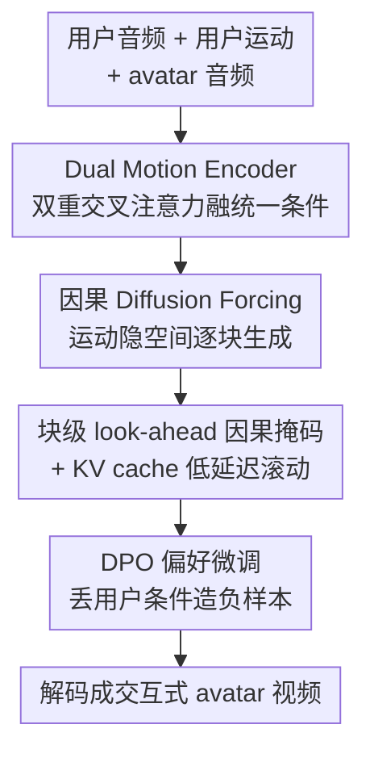

# Avatar Forcing: Real-Time Interactive Head Avatar Generation for Natural Conversation

**会议**: CVPR 2026  
**arXiv**: [2601.00664](https://arxiv.org/abs/2601.00664)  
**代码**: https://taekyungki.github.io/AvatarForcing （项目页）  
**领域**: 人体理解 / 数字人 / 扩散模型  
**关键词**: 交互式数字人、Diffusion Forcing、因果生成、偏好优化、实时低延迟

## 一句话总结
把"说话人头像生成"从单向播报升级成真正的双向对话：用因果 diffusion forcing 在运动隐空间里边收用户音频/动作、边自回归生成 avatar 头部运动，配合 KV cache 把延迟压到约 500ms（比基线快 6.8×），再用"丢掉用户条件造负样本"的免标注 DPO 让 avatar 学会点头、跟笑等富有表现力的反应，人类评测中超 80% 偏好率胜过最强基线。

## 研究背景与动机
**领域现状**：talking head 生成把一张静态肖像 + 一段音频驱动成会说话的数字人，主流工作（SadTalker、EMO、FLOAT、INFP 等）几乎都聚焦于把口型/头部运动和"avatar 自己的音频"对齐，做的是把信息准确、自然地"播报"出去。

**现有痛点**：这种范式本质是**单向**的——avatar 只顾自己说，不会"听"和"回应"用户。真实对话是双向的：用户点头、皱眉、笑、停顿，对面的人会即时给出主动倾听（active listening）和共情反馈。两个具体障碍：(1) **实时性**：要持续接收并响应用户的多模态信号，需要低推理时间 + 低延迟；但像 INFP 这样的双向 Transformer 必须拿到整段对话上下文（>3 秒，含未来帧）才能生成，导致 3.4s 级的延迟，根本没法即时交互。(2) **表现力**：交互反应天然"一对多"——同一个用户线索可以对应很多种合理回应，监督信号弱；而且现有倾听数据集普遍姿态僵硬、方差低，模型学出来的倾听行为又呆又同质。

**核心矛盾**：双向 attention 能建模丰富的用户-avatar 交互，却要求看到完整（含未来）上下文，与"实时因果生成"直接冲突；同时"反应该长什么样"缺乏明确标注和奖励，无法像口型那样靠强监督学到。

**本文目标**：(1) 造一个**因果**的头部运动生成框架，对在线输入即时反应；(2) 在没有额外人工标注的前提下，让反应变得生动、有表现力。

**切入角度**：借鉴交互式视频生成里的 diffusion forcing（给每个 token 独立加噪、可因果地预测下一个 token），把它搬到 talking head 的**运动隐空间**里——这样既保留扩散生成的可控性，又能像自回归一样逐块向前滚动、复用历史。

**核心 idea**：用"因果 diffusion forcing + KV cache"换掉"双向全上下文 Transformer"实现实时反应；再用"丢用户条件合成劣质样本"做免标注 DPO，把僵硬的倾听运动对齐成富有表现力的交互。

## 方法详解
### 整体框架
Avatar Forcing 的输入是：avatar 的参考图像（提供身份）、avatar 自己的音频、以及用户的实时音频 + 用户的运动隐变量；输出是一段会"听会回应"的 avatar 头部运动视频。整条管线在一个可解耦身份/运动的运动隐空间里跑：图像编码成 $z = z_S + \mathbf{m}_S$，其中 $z_S$ 是身份隐变量、$\mathbf{m}_S$ 是运动隐变量。生成被写成自回归形式

$$p_\theta(\mathbf{m}^{1:N}) = \prod_{i=1}^{N} p_\theta(\mathbf{m}^i \mid \mathbf{m}^{<i}, \mathbf{c}^{\le i})$$

即每一帧运动隐变量 $\mathbf{m}^i$ 都由过去的运动隐变量和当前条件三元组 $\mathbf{c}^i = (\mathbf{a}_u^i, \mathbf{m}_u^i, \mathbf{a}^i)$（用户音频、用户运动、avatar 音频）预测。核心向量场模型 $v_\theta$ 由两部分组成：**Dual Motion Encoder** 把三路条件融成统一条件，**Causal DFoT 运动生成器**在块级因果约束下逐块生成运动隐变量，再解码成视频。训练完成后再叠一道 **DPO 偏好微调**把表现力拉满。

### 关键设计

**1. 运动隐空间里的因果 Diffusion Forcing：把"实时反应"变成可能**

痛点直击 INFP 那类双向模型——它们的 DiT 必须看到整段时间窗（含未来帧）才能出一帧，延迟天然高。本文改用 diffusion forcing：沿用 flow matching 的加噪 $\mathbf{x}_{t_n}^n = t_n \mathbf{x}_1^n + (1-t_n)\mathbf{x}_0^n$，训练目标是回归向量场 $v_\theta(\mathbf{m}_{t_n}^n, t_n, \mathbf{c}^n) \to (\mathbf{m}_1^n - \mathbf{m}_0^n)$。关键是它把生成器做成**块级因果（blockwise causal）**结构：把 latent 帧切成若干 block，块**内**双向 attention 捕捉局部依赖、块**间**用 causal mask 禁止当前块看未来块，于是模型可以拿到一小段就立刻往前预测下一块，不必等完整上下文。这样生成在运动隐空间（维度 $d=512$）里完成，本身就比像素空间轻，配合下面的 KV cache，整体把延迟从 3.4s 压到 0.5s

**2. Dual Motion Encoder：让 avatar 真正"看见"并响应用户**

只听用户音频不够——用户笑、点头这些非语言线索是无声的，光靠音频根本感知不到。Dual Motion Encoder 用两层交叉注意力级联完成条件融合：先把用户的运动 $\mathbf{m}_u^i$ 和用户音频 $\mathbf{a}_u^i$ 通过一层 cross-attention 对齐，得到整体的"用户动作"表征；再把这个表征和 avatar 自己的音频 $\mathbf{a}^i$ 用第二层 cross-attention 融合，学到用户与 avatar 之间的因果关系，输出统一的 user-avatar 条件。消融实验证明，是否喂入用户运动 $\mathbf{m}_u$ 直接决定 avatar 会不会反应：去掉它后，一旦用户没出声 avatar 就僵在原地，即便用户在笑也无动于衷；加上它，avatar 能在用户笑完后跟着笑、在用户开口时切到专注表情

**3. 块级 look-ahead 因果掩码：在因果和流畅之间补一刀**

严格的块级因果 mask 虽然保证了实时性，却带来一个副作用——块与块交界处的运动过渡不连贯，会出现明显的逐帧抖动。本文给因果 mask 加了"前瞻（look-ahead）"：允许每个块在保持整体因果的前提下，多看一小段未来帧。掩码定义为 $M_{i,j} = 1 \text{ if } \lfloor j/B \rfloor \le \lfloor i/B \rfloor + l \text{ else } 0$，其中 $B$ 是块大小、$l$ 是前瞻帧数（实现里 $B=10$、$l=2$）。这一点小小的"偷看"换来了块间平滑过渡，显著缓解了纯因果结构下的抖动；推理时再叠一个大小 $2l$ 的滑动窗口 attention 做时间维平滑条件

**4. 免标注 DPO：用"丢条件造废样本"教会表现力**

实时性解决了，但模型生成的倾听运动依旧僵硬——因为反应是"一对多"问题，缺少明确奖励，而倾听数据本身方差就低。直接上 RLHF 又卡在"如何为交互行为定义奖励"这个几乎无解的问题上。本文把它转成 DPO（reward-free）：偏好样本 $\mathbf{m}^w$ 取自真实视频（表现力强、上下文恰当的反应）；**劣质样本 $\mathbf{m}^l$ 用一个只看 avatar 音频、不看任何用户信号的纯 talking 模型生成**——也就是"主动丢掉用户条件"合成的欠表现力运动。这对样本的设计很巧：两者差异恰好集中在"主动倾听/反应"上，而口型、说话驱动的运动几乎一致，于是优化信号干净地指向表现力本身，不会破坏口型同步。整体微调目标是 $\mathcal{L}_{ft}(\theta) = \mathcal{L}_{DF}(\theta) + \lambda \mathcal{L}_{DPO}(\theta)$，既保住生成质量又对齐偏好，全程不需要任何额外人工标注

### 损失函数 / 训练策略
- 主目标：diffusion forcing 向量场回归损失 $\mathcal{L}_{DF}$（式 6），逐帧独立噪声时间步 $t_n$。
- 微调目标：$\mathcal{L}_{ft} = \mathcal{L}_{DF} + \lambda \mathcal{L}_{DPO}$，DPO 用 DiffusionDPO 的扩散似然形式，$\pi_{\text{ref}}$ 为冻结的预训练权重。
- 推理：自回归 rollout + rolling KV cache（Algorithm 1），缓存满（达到 max cache size $M$）则弹出最旧块，保证显存与延迟恒定。
- 关键超参：Adam，lr $10^{-4}$，batch 8，latent 维 $d=512$，8 个 attention head、hidden $h=1024$、1D RoPE；$N=50$ 帧 / $B=5$ 块（每块 10 帧）/ $l=2$；音频用 Wav2Vec2.0 取 12 个多尺度特征；采样 10 NFE + Euler solver + CFG；单张 H100。

## 实验关键数据

### 主实验
数据集：RealTalk、ViCo（双人对话），HDTF（talking head）。在 RealTalk 上与最强交互基线 INFP*（官方未开源，作者复现）对比：

| 指标（RealTalk） | FLOAT(非交互,参考) | INFP* | Ours | GT |
|------|------|------|------|------|
| Latency ↓ | 2.4s | 3.4s | **0.5s** | N/A |
| rPCC-Exp ↓ | 0.054 | 0.035 | **0.003** | 0.000 |
| rPCC-Pose ↓ | 0.182 | 0.064 | **0.036** | 0.000 |
| SID ↑ | 2.785 | 2.343 | **2.442** | 3.972 |
| Var ↑ | 2.778 | 1.638 | **1.734** | 1.658 |
| FID ↓ | 81.30 | 24.55 | **24.33** | N/A |
| FVD ↓ | 438.82 | **159.00** | 170.87 | N/A |
| LSE-C ↑ | 6.361 | 6.536 | **6.723** | 6.940 |

延迟 0.5s vs 3.4s，即约 6.8× 加速；反应性（rPCC）与运动丰富度（SID/Var）全面超过 INFP*，视觉质量、口型同步保持相当。在 HDTF 的纯 talking head 对比（Table 2）中，Ours 取得最佳 FID 20.33、FVD 149.80，优于 SadTalker / Hallo3 / FLOAT / INFP*。在 ViCo 的倾听对比（Table 3）中 Ours 在 FD、rPCC 等几乎所有指标领先。人类评测：42 名参与者、12 组视频、5 个维度，总体偏好率超 80% 胜过 INFP*。

### 消融实验
Table 4（RealTalk，逐步加上用户运动 $\mathbf{m}_u$ 与 DPO）：

| w/ $\mathbf{m}_u$ | DPO | rPCC-Exp ↓ | rPCC-Pose ↓ | SID ↑ | Var ↑ |
|------|------|------|------|------|------|
| ✗ | ✗ | 0.052 | 0.175 | 2.165 | 1.586 |
| ✓ | ✗ | 0.042 | 0.146 | 2.236 | 1.408 |
| ✓ | ✓ | **0.003** | **0.036** | **2.442** | **1.734** |

### 关键发现
- **用户运动 $\mathbf{m}_u$ 是"会不会反应"的开关**：去掉它后 avatar 在用户静音时直接僵住，即便用户在笑也无反应——因为模型完全感知不到视觉线索；加回后才会"跟笑/转专注"。
- **DPO 是表现力的主要来源**：从第二行到第三行，rPCC-Exp 从 0.042 骤降到 0.003、rPCC-Pose 从 0.146 降到 0.036，SID/Var 同时显著上升，说明免标注偏好优化对"反应同步 + 运动多样"的提升最关键。
- 单看 $\mathbf{m}_u$ 而不做 DPO 时 Var 反而略降（1.586→1.408），印证了"只给输入还不够，倾听数据低方差会把模型带僵"，必须靠 DPO 拉开表现力。

## 亮点与洞察
- **把 diffusion forcing 从视频生成迁到 talking head 运动隐空间**：在低维运动 latent 上做块级因果生成 + KV cache，既拿到扩散的可控性又拿到自回归的实时性，是"实时交互数字人"的关键解法，思路可迁移到任何需要在线响应的生成式 avatar。
- **"丢条件造负样本"的 DPO 极其巧妙**：用一个只看 avatar 音频的旧模型生成"欠表现力"样本当 loser，让偏好差异天然聚焦在主动倾听上，绕开了"交互行为没法定义奖励"的死结，且零额外标注——这个造负样本的套路对任何"难以打分但能构造退化版本"的对齐任务都适用。
- **look-ahead 因果掩码**：用一点点"合法偷看未来 $l$ 帧"换块间平滑，是因果生成里平衡实时性与连贯性的小而有效的 trick。

## 局限与展望
- 主要交互基线 INFP* 是作者复现版（官方未开源），对比的公平性存在一定不确定性 ⚠️；倾听对比（Table 3）的部分基线结果也是从 DIM 论文继承的。
- 仍局限于头部 avatar（表情 + 头部运动），未涉及手势、上半身等更完整的具身交互；500ms 延迟虽达实时门槛，但端到端真实部署还要叠加音频处理/解码开销。
- DPO 的 loser 来自一个固定旧模型，负样本质量上限受限于该模型；偏好对的"表现力"定义仍间接，未必覆盖所有自然交互行为。
- 作者把伦理、局限与未来工作放在附录 E（涉及数字人换脸/伪造的潜在滥用风险，值得关注）。

## 相关工作与启发
- **vs INFP**：INFP 用双向 Transformer + 音频条件的语/非语记忆库统一建模，但必须拿到整段对话上下文，延迟 3.4s 不适合实时；本文用块级因果 DFoT + KV cache 做到 0.5s，且反应性/丰富度更强。
- **vs DIM**：DIM 把双人运动量化进语/非语两个离散隐空间，但需要手动的角色切换信号，说话/倾听状态过渡不连续；本文统一在一个连续运动隐空间里持续建模双向影响，无需角色切换。
- **vs FLOAT / EMO 等 talking head**：它们只对齐 avatar 自身音频做单向播报，不接收用户信号；本文把"听 + 回应"纳入条件，从播报升级为对话。
- **vs L2L / RLHG 等倾听生成**：它们靠个性化运动或显式文本/姿态控制信号缓解一对多，未真正学到交互行为；本文用 DPO 直接对齐表现力，免标注且更通用。

## 评分
- 新颖性: ⭐⭐⭐⭐⭐ 首次把因果 diffusion forcing 用于实时交互数字人，并配套"丢条件造负样本"的免标注 DPO，两点都很新。
- 实验充分度: ⭐⭐⭐⭐ 覆盖交互/talking/listening 三类基线 + 人类评测 + 消融，但核心交互基线为复现版，存在公平性 caveat。
- 写作质量: ⭐⭐⭐⭐ 问题拆解清晰、图示到位，方法叙述连贯。
- 价值: ⭐⭐⭐⭐⭐ 把数字人从单向播报推向真正双向对话，对实时人机交互、虚拟陪伴等落地场景价值高。

<!-- RELATED:START -->

## 相关论文

- [\[CVPR 2026\] OMG-Avatar: One-shot Multi-LOD Gaussian Head Avatar](omg-avatar_one-shot_multi-lod_gaussian_head_avatar.md)
- [\[CVPR 2026\] MimicTalker: A Multimodal Interactive and Memory-Enhanced Framework for Real-Time Dyadic 3D Head Generation](mimictalker_a_multimodal_interactive_and_memory-enhanced_framework_for_real-time.md)
- [\[CVPR 2026\] SyncDreamer: Controllable and Expressive Avatar Generation Beyond the Talking Head](syncdreamer_controllable_and_expressive_avatar_generation_beyond_the_talking_hea.md)
- [\[CVPR 2026\] FloodDiffusion: Tailored Diffusion Forcing for Streaming Motion Generation](flooddiffusion_tailored_diffusion_forcing_for_streaming_motion_generation.md)
- [\[CVPR 2026\] AVATAR: Reinforcement Learning to See, Hear, and Reason Over Video](avatar_reinforcement_learning_to_see_hear_and_reason_over_video.md)

<!-- RELATED:END -->
