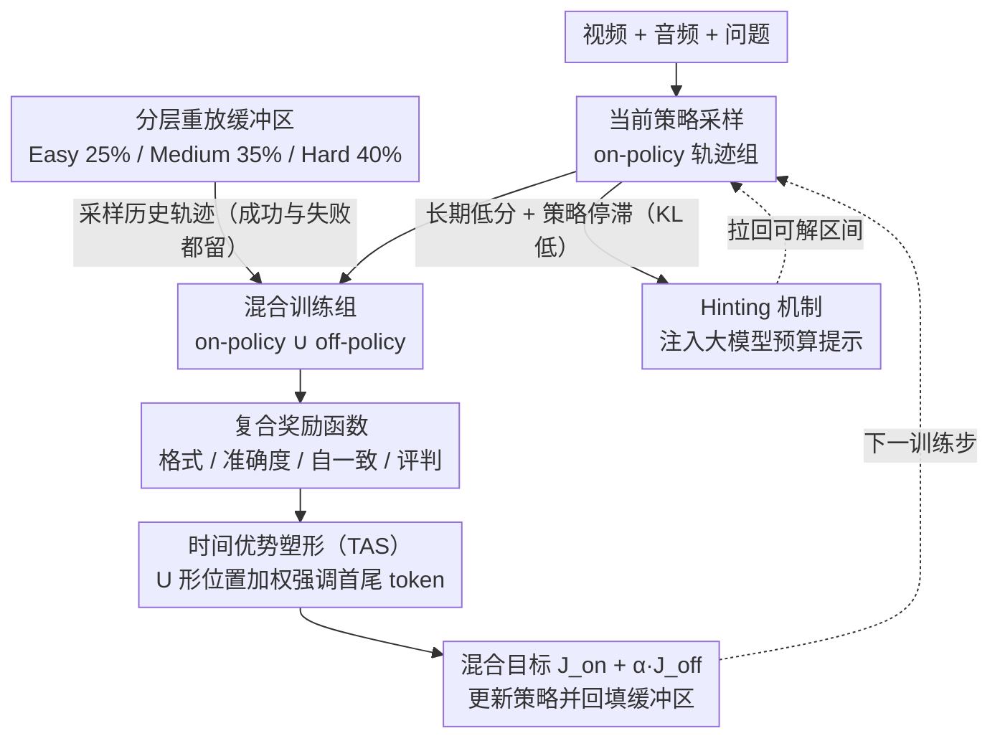

# AVATAR: Reinforcement Learning to See, Hear, and Reason Over Video

**会议**: CVPR 2026  
**arXiv**: [2508.03100](https://arxiv.org/abs/2508.03100)  
**代码**: [https://people-robots.github.io/AVATAR/](https://people-robots.github.io/AVATAR/)  
**领域**: 人体理解 / 多模态推理  
**关键词**: 音视频推理, GRPO改进, 离策略强化学习, 时间优势塑形, 多模态大语言模型

## 一句话总结
提出AVATAR框架，通过离策略训练架构（分层重放缓冲区）和时间优势塑形（TAS，U形加权强调推理链首尾）两个核心组件改进GRPO，解决其数据低效、优势消失和均匀信用分配三大问题，在音视频推理基准上显著超越GRPO基线。

## 研究背景与动机

1. **领域现状**：MLLM需要对齐视频、音频和语言模态来支持长时推理。GRPO作为RL方法已展示出增强推理的潜力，但在开放式视频域有显著局限。
2. **GRPO三大问题**：
    - **数据低效**：在策略方法，每次更新后丢弃经验，在昂贵视频标注数据上浪费严重
    - **优势消失**：组内奖励方差坍缩时（全正确或全错误），优势归零，学习信号消失
    - **均匀信用分配**：对推理链中所有token施加相同奖励，忽视规划阶段（开头）和综合阶段（结尾）的关键性
3. **切入角度**：从RL算法设计角度系统解决GRPO的三个结构性缺陷。
4. **核心idea**：离策略架构+分层重放缓冲区解决前两个问题；TAS的U形位置加权解决第三个问题。

## 方法详解

### 整体框架
AVATAR 想让一个全模态 MLLM 学会对视频、音频、语言一起做长链推理，而它认定 GRPO 在这种开放式视频场景下有三处会拖后腿：经验用完就丢、组内奖励方差一坍缩优势就归零、对推理链上所有 token 一视同仁地分信用。整套方法不另起炉灶，而是在 GRPO 的 on-policy 更新之外挂四样东西：一个复用历史轨迹的分层重放缓冲区、一个在模型卡壳时递台阶的 Hinting 机制、一组按 token 位置重新加权优势的时间优势塑形（TAS），外加一套面向音视频任务的复合奖励。前两者合起来构成离策略训练架构，专治"数据低效 + 优势消失"；TAS 单独对付"均匀信用分配"；复合奖励则不直接对应 GRPO 的某个缺陷，而是为音视频推理提供一个密集、多面的奖励信号。每个训练步都从重放缓冲区采历史轨迹与当前 on-policy 组混合，经复合奖励打分、TAS 加权后用混合目标更新策略，再把新经验回填缓冲区——形成一个带反馈的训练回环。这套训练机制外面再套一层四阶段课程：Stage 0 用 SFT 做冷启动，Stage 1 练纯视觉推理，Stage 2 升到音视频联合推理，Stage 3 再细到音频目标定位，每一阶段换数据集和奖励配置。

### 关键设计

**1. 离策略架构与分层重放缓冲区：把扔掉的经验捡回来，顺便堵住优势消失**

纯 on-policy 的 GRPO 每更新一步就把采样轨迹丢掉，而视频标注数据本来就贵，这种浪费很扎眼；更麻烦的是当一组采样要么全对要么全错时，组内奖励方差坍缩，归一化后的优势直接变成零，这一步白训。AVATAR 维护一个容量 10K 的分层缓冲区 $\mathcal{B}$，按每个 prompt 的移动平均奖励 $\bar{R}(q)$ 把它归到三层——Easy 占 25%、Medium 占 35%、Hard 占 40%，训练时从缓冲区取历史轨迹混进当前 on-policy 组，用混合目标

$$\mathcal{J}_{AVATAR} = \mathcal{J}_{on} + \alpha \cdot \mathcal{J}_{off}$$

把两路损失加在一起，离策略那部分再乘上重要性采样比 $r_i^{off} = \pi_\theta(o_i|q) / \pi_{\theta_{off}}(o_i|q)$ 来校正采样策略与当前策略之间的漂移。这么设计有两层好处：Hard 层容量给得最大，保证困难样本被反复拉出来训而不是训一次就忘；而把历史的成功和失败轨迹一起塞进当前组，组内奖励天然就有高有低、方差非零，优势消失的问题从根上被堵住。

**2. Hinting 机制：当模型卡在解不动的题上、又不再探索时，递一个台阶**

光有重放缓冲区还不够——有些 prompt 长期困难，策略会干脆躺平、停止探索，困在局部最优里出不来。AVATAR 同时盯两个信号判断是不是"卡住了"：一是该 prompt 的移动平均奖励 $\bar{R}(q)$ 一直很低，二是策略相对参考策略的 $D_{KL}(\pi_\theta \| \pi_\beta)$ 也很低（说明它早已不动了）。两者同时成立时就注入一条预先算好的提示，比如"先定位发声物体，再计数"，这些 hint 由 Qwen2.5-VL-72B 离线生成。本质上是一种 teacher-student 策略：用一个大模型给正在训练的小模型铺台阶，把训练样本重新拉回"有挑战但仍可解"的区间，而不是让它在一道彻底解不动的题上空转。

**3. 时间优势塑形（TAS）：别给推理链每个 token 发一样的信用**

GRPO 把同一个标量优势平摊到推理链的每个 token 上，可一条推理链里规划阶段（开头）和综合作答阶段（结尾）的分量明显比中间的过渡 token 更关键，均匀分信用等于把这种结构性差异抹平了。TAS 用一条 U 形抛物线给位置加权：

$$w_t = 1.0 + \lambda_{TAS} \cdot (2\tilde{t} - 1)^2, \quad \tilde{t} = \frac{t}{L-1}$$

归一化位置 $\tilde{t}$ 在首尾取 0 和 1，权重都顶到最高的 $1+\lambda_{TAS}$，中间 $\tilde{t}=0.5$ 处压回 1.0，于是 token 级优势变成 $A_{i,t}^{TAS} = w_{i,t} \cdot A_i$。这个 U 形不是拍脑袋——它对齐了 Transformer 里的注意力沉降现象（开头的 token 会被后续持续关注）以及末尾 token 在拼出最终答案时的决定作用，所以加重首尾的信用刚好打在最该负责的位置上。代价也极低：只改一行优势加权公式，不需要额外的 critic 网络。

**4. 复合奖励函数：把"格式对不对、答案准不准、推理靠不靠谱"拆开评**

音视频 QA 单看最终答案不足以驱动出好的推理，AVATAR 因此用四路奖励同时打分。$R_{format}$ 验证输出是否遵循约定的推理格式；$R_{acc}$ 用 rMAE 给出一个密集的准确度信号（而非只有对/错的稀疏奖励）；$R_{self}$ 拿多数投票产出的伪正确答案做一致性奖励，让模型在没有标注时也有自监督信号；$R_{judge}$ 则请一个冻结的 InternVL3-2B 来评判推理过程本身的质量。四者合起来既约束了形式，也分别盯住了答案和推理链两条线。

### 损失函数 / 训练策略
最终训练目标就是在标准 GRPO 损失上叠加离策略项（混合目标 $\mathcal{J}_{AVATAR}$），并把均匀优势替换成 TAS 加权后的 token 级优势，再用上面四路复合奖励驱动。四阶段课程从 SFT 冷启动起步，逐级从视觉推理过渡到音视频联合推理、最后收到音频目标定位，难度和模态逐步加码。

## 实验关键数据

### 主实验（多基准对比）

| 模型 | OmniBench | MMVU | Video-Holmes | AV-Odyssey |
|------|-----------|------|-------------|------------|
| Qwen2.5-Omni (基线) | 44.2 | - | - | 29.8 |
| + GRPO | 45.4 (+1.2) | - | - | 31.3 (+1.5) |
| + **AVATAR** | **49.1 (+4.9)** | - | - | **32.1 (+2.3)** |
| Ola-7B (基线) | 45.3 | - | - | 25.6 |
| + GRPO | 46.8 (+1.5) | - | - | 27.0 (+1.4) |
| + **AVATAR** | **47.2 (+1.9)** | - | - | **28.8 (+3.2)** |

AVATAR vs GRPO on Qwen2.5-Omni: OmniBench +3.7, Video-Holmes +1.9, 同时只需**80%更少的生成补全**达到目标性能。

### 消融实验

| 组件 | OmniBench | DailyOmni | 说明 |
|------|-----------|-----------|------|
| GRPO (基线) | 45.4 | 44.8 | |
| + Off-policy only | +1.5 | +1.2 | 离策略架构贡献 |
| + TAS only | +1.0 | +0.8 | 时间塑形贡献 |
| + Both (AVATAR) | **+3.7** | **+2.2** | 两者互补 |

### 关键发现
- AVATAR在两个基础模型(Qwen2.5-Omni和Ola-7B)上都一致有效，证明方法的模型无关性
- 样本效率提升5×：需要80%更少的生成补全即可达目标性能
- 离策略和TAS的增益互补而非重叠
- 所有改进均附95%置信区间(bootstrap)，统计可靠

## 亮点与洞察
- **系统性解决GRPO缺陷**：很好地将RL中的经典问题（离策略学习、信用分配、探索-利用）工程化应用到MLLM训练中
- **TAS的U形加权简洁有效**：理论上对齐了Transformer的注意力模式，实现上只需一行公式修改，无需额外网络或critic
- **Hinting机制的实用性**：利用大模型（72B）为小模型预计算学习引导，是一种实用的teacher-student RL策略

## 局限与展望
- TAS的U形是固定形状，不同任务/不同推理长度可能需要自适应的形状
- Hinting依赖外部大模型，在完全自主学习场景中不可用
- 仅在音视频QA任务上验证，对更长时间推理（如规划、决策）的效果未知
- 重放缓冲区的大小(10K)和层级比例(25/35/40)是手动设定的

## 相关工作与启发
- **vs 标准GRPO**: AVATAR是GRPO的直接改进，保持了GRPO的简洁性同时解决其三个结构性问题
- **vs Video-R1**: Video-R1使用时间对比奖励，AVATAR从训练算法角度优化，两者可组合
- **vs DAPO**: DAPO通过修改采样减少均匀组，但AVATAR通过离策略重放更根本地解决优势消失

## 评分
- 新颖性: ⭐⭐⭐⭐ 组合已有RL技术（离策略、信用分配），但在MLLM场景中的应用有新意
- 实验充分度: ⭐⭐⭐⭐ 多基准、多基础模型、统计检验、消融充分
- 写作质量: ⭐⭐⭐⭐⭐ 问题分析清晰，三个限制→三个解决方案的对应关系明确
- 价值: ⭐⭐⭐⭐ 对MLLM RL训练的通用性改进，方法可广泛应用

<!-- RELATED:START -->

## 相关论文

- [\[CVPR 2026\] Learning to Diversify and Focus: A Reinforcement Framework for Open-Vocabulary HOI Detection](learning_to_diversify_and_focus_a_reinforcement_framework_for_open-vocabulary_ho.md)
- [\[CVPR 2026\] OMG-Avatar: One-shot Multi-LOD Gaussian Head Avatar](omg-avatar_one-shot_multi-lod_gaussian_head_avatar.md)
- [\[CVPR 2026\] Avatar Forcing: Real-Time Interactive Head Avatar Generation for Natural Conversation](avatar_forcing_real-time_interactive_head_avatar_generation_for_natural_conversa.md)
- [\[CVPR 2026\] See Through the Noise: Improving Domain Generalization in Gaze Estimation](see_through_the_noise_improving_domain_generalization_in_gaze_estimation.md)
- [\[CVPR 2026\] Vision-Language Attribute Disentanglement and Reinforcement for Lifelong Person Re-Identification](vision-language_attribute_disentanglement_and_reinforcement_for_lifelong_person_.md)

<!-- RELATED:END -->
