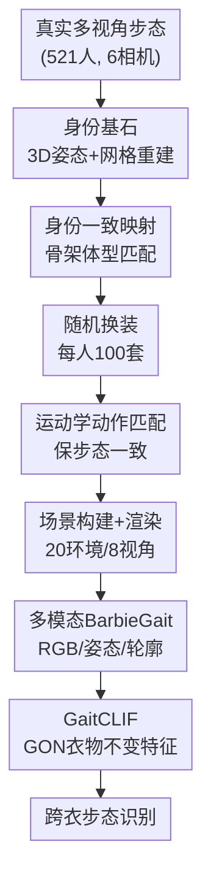

# BarbieGait: An Identity-Consistent Synthetic Human Dataset with Versatile Cloth-Changing for Gait Recognition

**会议**: CVPR2026  
**arXiv**: [2604.12221](https://arxiv.org/abs/2604.12221)  
**代码**: https://github.com/BarbieGait/BarbieGait  
**领域**: 人体理解 / 步态识别 / 合成数据集  
**关键词**: 步态识别, 跨衣换装, 合成数据集, 身份一致性, 衣物不变特征

## 一句话总结
针对真实世界几乎不可能采集"同一人穿上百种衣服"的步态数据这一痛点，本文把 521 个真实受试者一一映射进虚拟引擎、为每人随机生成 100 套换装，构建出身份一致的合成步态数据集 BarbieGait，并配套提出衣物不变特征基线 GaitCLIF，在 BarbieGait 及 CCPG / SUSTech1K / Gait3D / GREW 上均拿到 SOTA。

## 研究背景与动机
**领域现状**：步态识别是一种可远距离、无需配合的生物特征技术，适合监控安防场景。近年方法发展很快，但衣物、负重等协变量造成的外观变化一直是核心瓶颈。要验证"模型是否真的对换衣鲁棒"，需要每个人都有大量换装序列。

**现有痛点**：现有 benchmark 几乎都缺"每人大量换装"的数据——实验室数据集 CASIA-B 每人 3 种、室外数据集 GREW 每人 6 种；即便是专门做跨衣的 CCPG，投入大量人力物力也只能做到每人 7 种换装状态。衣物多样性不够，就既无法证明步态识别在大幅换衣下是否可靠，也无法检验现有方法能否真正处理极端换装。

**核心矛盾**：真实采集"覆盖多种族、多季节、复杂衣着风格"的跨衣步态数据，不仅成本极高，而且因隐私问题几乎不可能实现。而现有合成人体数据集（SURREAL、SynBody、VersatileGait 等）虽然能造海量数据，却普遍只强调"动作多样性"，要么用同一段动作驱动不同人、要么用差异极大的步态驱动同一人——**身份一致性被破坏**，合成出来的"同一个人"其实步态已经不像本人了。

**本文目标**：(1) 造一个每人换装量大、且每个虚拟人的步态身份都忠实复刻自某个真实人的数据集；(2) 提供一个能在大幅换衣下学到衣物不变特征的鲁棒基线。

**切入角度**：作者抓住一个关键问题——能不能用生成范式合成换衣步态数据，同时保住真实受试者的步态身份判别性？身份既体现在静态的骨架长度/体型，也体现在动态的关节运动轨迹，于是用高精度 3D 人体姿态与网格做"静态+动态"双重对齐。

**核心 idea**：用"真实人 → 虚拟人"的身份一致映射（骨架体型匹配 + 运动学动作匹配）造换衣数据，再用步态导向归一化（GON）剥离衣物统计量来学衣物不变特征。

## 方法详解

### 整体框架
全文分两块：前半是**数据生成系统**（产出 BarbieGait 数据集），后半是**识别基线 GaitCLIF**（在该数据集及真实数据集上学衣物不变特征）。

数据生成系统的输入是真实采集的多视角步态视频，输出是每人 100 套换装、含 RGB / 2D 姿态 / 轮廓三模态的合成步态序列。先用 6 相机阵列采 521 人的真实步态，靠 HRNet 估 2D 姿态、再经三角化 + EasyMoCap 重建高精度 3D 姿态与网格作为"身份基石"；随后依次经过骨架体型匹配（造出与真人对齐的虚拟人）、随机换装（每人随机选 100 套衣服）、运动学动作匹配（把真人步态搬到换装后的虚拟人身上保持步态一致）、场景构建（Blender 搭 20 个室内外环境、8 路相机）、GPU 集群渲染五个阶段，最后再做轮廓分割与 2D 姿态提取得到多模态数据。

GaitCLIF 则从两个角度学衣物不变特征：剥离衣物统计量（GON）+ 保留细粒度运动细节（GON-P3D/3D 帧级 + GON-FC 序列级），整体由四个视觉 stage、时间池化 TP、水平池化 HP、线性识别头组成。

### 关键设计

**1. 身份一致映射：让虚拟人静态体型 + 动态步态都复刻真人**

这是数据集"可信"的根基，直接针对前述"合成同一人却步态走样"的痛点。作者把对齐拆成静态与动态两层。静态层做**骨架长度 + 体型匹配**：3D 骨架长度对一个人基本稳定，于是用 3D 姿态对齐虚拟人的大腿、小腿等骨长；体型上用 EasyMoCap 逐帧估 SMPL 网格，再定义颈、胸、腰、臀等 12 个静态围度参数，取整段序列的帧平均值来对齐虚拟身体，以此压低单帧人体网格恢复的误差。动态层做**运动学动作匹配**（Algorithm 1）：为原始 3D 姿态的每根骨建立局部坐标系并算出其相对世界系的单位四元数 $Q^t=\text{CalQ}(P^t)$，再按预定义关节对应关系把局部旋转迁移到目标骨架——根关节用 $Q=Q^s(k)\cdot Q^t(k)$，其余骨用 $Q=Q^s(k)\cdot Q^t(k_p)\cdot Q^t(k)$ 把父骨旋转一并考虑进来，从而稳定、无万向锁地复现受试者专属动作。正因为骨架/体型/运动三者都锁到真人，换 100 套衣服后"还是这个人在走路"才成立，这是它区别于 SynBody、VersatileGait 等只追动作多样性的关键

**2. 随机换装 + 多场景渲染：在可控前提下把衣物多样性拉满**

真实世界采不到的"每人上百套衣服"，在虚拟引擎里用 MakeHuman 从一个涵盖发型、上装、下装、鞋子、配饰的多样衣橱里、按季节与日常搭配规则为每人随机抽 100 套来解决。为了让数据贴近真实采集条件，场景构建用 Blender 搭 20 个室内外环境，每个场景在 2.5m 高、半径 4m 圆周上每隔 45° 放 1 台共 8 台相机多视角拍摄，并主动加入遮挡物（椅子、墙）和昼夜光照变化引入真实世界因素。渲染时不像 SynBody 渲整张 1920×1080，而是只聚焦人体与阴影区、静态区只渲一次，把速度提到 5–6 倍。最终 BarbieGait 达 521 人、52.1 万网格、8 视角、120 万+序列、每人 100 套换装，且同时给出 3D 关节 / 3D 网格 / 轮廓三种 GT，在衣物多样性与序列规模上都领先现有数据集

**3. GON 步态导向归一化：按身体分区剥离衣物统计量**

识别端的核心痛点是衣物多样性大幅抬高同一身份的类内方差，形成与衣物相关的"子域"，干扰身份线索提取。作者把"逐帧去除衣物引起的变化"作为学衣物不变特征的关键一步。但他们发现域不变学习里常用的 Instance Normalization 不适合步态——轮廓特征每个通道都有噪声；于是提出受 Layer Norm 启发、专为步态设计的 **GON（Gait-Oriented Normalization）**。关键在于它不做全局归一化，而是把特征 $X\in\mathbb{R}^{N\times C\times H\times W}$ 沿高度方向水平切成 $m$ 个区域 $x_0,\dots,x_m$ 分别归一化再拼回：$X'=\text{Cat}(\text{GON}(x_0),\dots,\text{GON}(x_m))$，其中 $\text{GON}(x_i)=\gamma\cdot\frac{x_i-\mu(x_i)}{\sigma(x_i)}+\beta$，均值方差 $\mu,\sigma$ 跨通道 $C$ 与空间 $h_i,W$ 统计。这样设计的动机很具体：头部受衣物影响小、下半身受紧身裤/阔腿裤/裙子影响大，全局归一化抹不掉这种分区差异，按区域归一化才能在抑制衣物波动的同时保住身份相关结构、提升同一人在不同衣着下的类内紧致性

**4. 细粒度运动保留：帧级 GON-P3D/3D + 序列级 GON-FC 双管齐下**

只去衣物统计还不够，细粒度运动细节才是跨衣识别的身份关键。作者把 GON 嵌进网络的两个层级。帧级用 **GON-P3D / GON-3D** 两个视觉 block，在 GON 基础上加时间卷积来增强运动表示、改善帧级衣物不变特征学习（GaitCLIF-P3D / GaitCLIF-3D 两个变体即由此而来）。序列级则针对主流架构里 Separate FC 难以应对大幅换衣的问题，提出 **GON-FC**：两层 FC、每层 FC 后接 GON，在时间池化聚合之后进一步增强各细粒度区域的非线性表达、降低序列级的衣物方差。两者互补——GON-P3D 压住帧级衣物波动、GON-FC 稳住序列级身份线索，消融显示二者叠加才达到最佳

### 损失函数 / 训练策略
评测用 Rank-1 准确率（R1）与 mAP。为分析衣物厚度影响，作者还定义了一个**衣物复杂度指标**：分别渲染无衣轮廓与有衣轮廓，取二者非重叠区域作为衣物复杂度、再用无衣轮廓面积归一化得"相对衣物厚度"，按每 15% 递增划成 THK0–THK9 十个等级（THK0 为 gallery，THK1–THK9 为 probe）。训练沿用各数据集官方协议，不同数据集用不同 batch/blocks/迭代里程碑配置（如 BarbieGait 用 [1,1,1,1] blocks、6 万步，GREW 用 [1,4,4,1]、18 万步）。

## 实验关键数据

身份一致性验证：3D 姿态匹配 + 运动对齐后，真实与合成数据的平均关节位置误差仅 12.2 mm（主要来自层级累积误差），关节角误差仅 0.02°，表明对齐高度精确。

### 主实验

BarbieGait 上跨衣识别（THK0 为 gallery，THK1–THK9 为 probe，AVG 为平均）：

| 输入模态 | 方法 | AVG-R1 | AVG-mAP |
|----------|------|--------|---------|
| 轮廓 | GaitSet | 9.7 | 12.8 |
| 轮廓 | DeepGaitV2-P3D | 67.7 | 57.6 |
| 轮廓 | DeepGaitV2-3D | 71.7 | 60.2 |
| 轮廓 | **GaitCLIF-P3D (ours)** | **75.6** | **63.2** |
| 轮廓 | **GaitCLIF-3D (ours)** | **80.4** | **65.7** |
| 热图 | SkeletonGait | 77.1 | 72.3 |
| 热图 | **GaitCLIF-P3D (ours)** | **78.1** | **73.3** |

可见即便每人 100 套换装，GaitCLIF 仍把轮廓基线 DeepGaitV2-P3D 的 mAP 从 57.6% 提到 63.2%；用 Blender 理想轮廓喂 DeepGaitV2-P3D 可达 R1 91.2% / mAP 83.4%，但换成真实分割轮廓（带噪声）骤降到 R1 67.7% / mAP 57.6%，凸显跨衣场景的难度与提升空间。

真实数据集泛化（CCPG ReID 协议、SUSTech1K、in-the-wild）：

| 数据集 | 指标 | 增益 / 结果 |
|--------|------|------------|
| CCPG (ReID) | R1 / mAP | +1.9% / +2.3% |
| SUSTech1K | R1 / R5 | +2.4% / +1.1% |
| Gait3D | R1 / mAP | 76.5% / 67.9% |
| GREW | R1 / R5 | 80.2% / 89.2% |

对衣物变化有限的 in-the-wild 数据集（Gait3D / GREW），直接用全套 GON 会造成类内过度发散，因此只用 GON-FC 增强非线性映射。

### 消融实验

GaitCLIF-P3D 在 BarbieGait 上的模块消融：

| GON-P3D | GON-FC | AVG-R1 (%) | AVG-mAP (%) |
|---------|--------|-----------|-------------|
| × | × | 67.7 | 57.6 |
| √ | × | 69.8 | 57.6 |
| × | √ | 69.2 | 59.1 |
| √ | √ | **75.6** | **63.2** |

### 关键发现
- **两个模块强互补**：单加 GON-P3D（帧级）把 R1 提到 69.8% 但 mAP 不变；单加 GON-FC（序列级）把 mAP 提到 59.1%；二者叠加才一起跳到 75.6%/63.2%，说明帧级压衣物波动与序列级稳身份线索缺一不可。
- **轮廓质量是隐形天花板**：理想轮廓 mAP 83.4% vs 真实分割轮廓 57.6%，分割噪声吃掉了一大截性能，提示跨衣识别的真实瓶颈之一在轮廓提取。
- **姿态模态更抗换衣**：热图输入下 SkeletonGait（mAP 72.3%）反超轮廓型 GaitCLIF-3D（65.7%），印证 pose-based 方法天然对外观变化鲁棒，而 BarbieGait 的海量跨衣姿态数据正好让这一优势得以清晰评估。

## 亮点与洞察
- **"真人映虚拟人"双重对齐**是最巧的一点：用 3D 骨架/体型锁静态、用四元数运动学迁移锁动态，绕开了真实采集换衣数据的成本与隐私死结，又避免了以往合成数据"同一人步态走样"的通病——这套身份一致映射可迁移到 Re-ID、人体渲染等任何需要"换外观保身份"的合成任务。
- **GON 的"分区归一化"对应人体先验**：把"头部受衣影响小、下身受影响大"这个朴素观察直接落到按高度水平分区分别归一化上，比无脑全局 IN/LN 更贴合步态，是个轻量却有效的设计。
- **衣物厚度分级（THK0–THK9）**给了跨衣识别一把可量化的尺子：用有衣/无衣轮廓非重叠面积定义相对厚度，让"模型在多厚的衣服下崩"变得可分析，这个评测协议本身就有复用价值。

## 局限与展望
- **合成-真实域差仍在**：理想轮廓与真实分割轮廓之间 mAP 差距巨大（83.4% → 57.6%），说明在 BarbieGait 上训出的模型迁到真实分割数据仍受噪声制约，sim-to-real gap 没有被消除。
- **衣物来源受限于 MakeHuman 衣橱**：100 套换装虽多，但风格、材质、贴合度都受引擎资产与随机搭配规则约束，可能与真实世界的极端/罕见着装分布有偏。
- **GON 在低衣物变化场景会过度发散**：作者自己承认在 Gait3D/GREW 上必须退化为只用 GON-FC，否则类内过度分散——说明该归一化对"衣物多样性"是有适用区间的，并非万能。
- **公开范围**：出于隐私只发布合成数据、不放真实 RGB/人脸/环境，下游若想复现"真实→虚拟"映射链路会有数据缺口。

## 相关工作与启发
- **vs VersatileGait / SynBody**: 它们同样合成步态/人体数据，但只强调动作多样性，常因"同动作驱动不同人"或"同人用差异大的步态"破坏身份一致性；BarbieGait 用高精度 3D 姿态+网格做静态与动态双重对齐，第一个把"换衣同时保步态身份"做实。
- **vs CCPG**: CCPG 是真实跨衣数据集但每人仅 7 种换装、采集成本高；BarbieGait 用合成把每人换装量拉到 100 种、序列数到 120 万+，且 GaitCLIF 在 CCPG ReID 协议上仍取得 R1/mAP +1.9%/+2.3% 的增益，互为补充。
- **vs Instance Normalization 域不变学习**: 域不变学习常用 IN 去风格统计，但作者发现轮廓特征逐通道有噪声、IN 不适用，转而用受 LN 启发的分区 GON，针对步态数据特性重新设计归一化粒度。

## 评分
- 新颖性: ⭐⭐⭐⭐⭐ 首个用"真人→虚拟人"双重对齐造身份一致换衣步态数据集，思路新且填补真实采集空白
- 实验充分度: ⭐⭐⭐⭐ BarbieGait + 4 个真实数据集全面验证，含厚度分级与模块消融，唯 sim-to-real 迁移分析可更深入
- 写作质量: ⭐⭐⭐⭐ 数据集与方法两条线清晰，图表与协议交代完整
- 价值: ⭐⭐⭐⭐⭐ 提供可控的大规模跨衣步态数据 + 鲁棒基线，对推进换衣步态识别有明确长期价值

<!-- RELATED:START -->

## 相关论文

- [\[CVPR 2026\] MMGait: Towards Multi-Modal Gait Recognition](mmgait_multi_modal_gait_recognition.md)
- [\[CVPR 2026\] EventGait: Towards Robust Gait Recognition with Event Streams](eventgait_towards_robust_gait_recognition_with_event_streams.md)
- [\[CVPR 2026\] Text-guided Feature Disentanglement for Cross-modal Gait Recognition](text-guided_feature_disentanglement_for_cross-modal_gait_recognition.md)
- [\[CVPR 2026\] HyperGait: Unleashing the Power of Parsing for Gait Recognition in the Wild via Hypergraph](hypergait_unleashing_the_power_of_parsing_for_gait_recognition_in_the_wild_via_h.md)
- [\[CVPR 2026\] Unlocking Motion from Large Vision Models with a Semantic and Kinematic Duality for Gait Recognition](unlocking_motion_from_large_vision_models_with_a_semantic_and_kinematic_duality_.md)

<!-- RELATED:END -->
