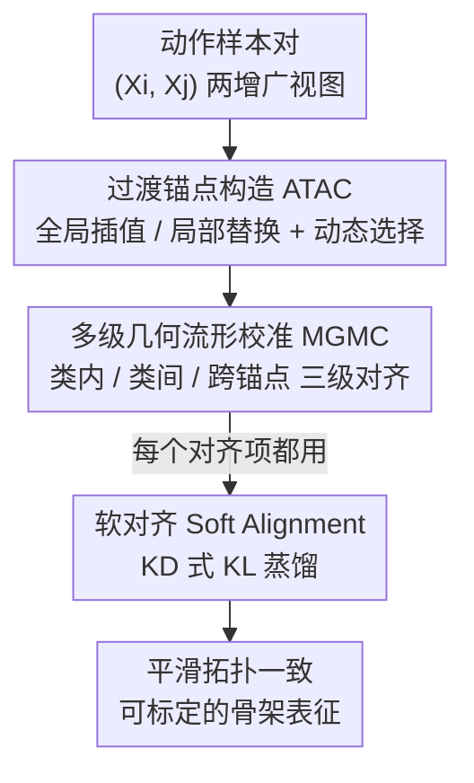

# Beyond Binary Contrast: Modeling Continuous Skeleton Action Spaces with Transitional Anchors

**会议**: CVPR 2026  
**论文**: [CVF Open Access](https://openaccess.thecvf.com/content/CVPR2026/html/Feng_Beyond_Binary_Contrast_Modeling_Continuous_Skeleton_Action_Spaces_with_Transitional_CVPR_2026_paper.html)  
**代码**: 待开源（论文称 Code will be made publicly available）  
**领域**: 自监督 / 骨架动作识别  
**关键词**: 骨架动作识别, 对比学习, 过渡锚点, 流形校准, 置信度标定  

## 一句话总结
针对自监督骨架动作识别中"二元对比"把动作切成孤立簇、边界僵硬的问题，TranCLR 在动作之间合成"过渡锚点"作为流形正则项，并用三级几何流形校准把表征空间从离散点云重塑成连续平滑流形，在 NTU/PKU-MMD 上线性评估、迁移、检索全面 SOTA，且把置信度标定误差 ECE 从 ~5.6% 砍到 0.65%。

## 研究背景与动机
**领域现状**：骨架动作识别用关节坐标序列来分类人体动作，主流自监督范式是对比学习——基于 MoCo v2 构造正负对，把同一样本的两个增广视图（正对）在嵌入空间拉近、把其他样本（负对）推远，从而在无标注下学到判别性表征。代表工作如 SkeletonCLR、AimCLR、ActCLR。

**现有痛点**：这类方法都采用**二元对比目标**——非正即负。作者通过可视化 top-3 预测+置信度发现，AimCLR/ActCLR 在"难样本""模糊样本"上预测既不可靠也不标定（confidence 与真实准确率脱节）。根因有二：(1) **类内连通性受限**——正对只来自同一样本的简单增广，同一动作的不同样本之间没有被拉到一起，导致类内簇被割裂成多块；(2) **类间边界僵硬**——共享子动作的不同动作（如"擦脸"和"头疼"都有手举到头部的过程）被负对硬性推开，破坏了动作流形本应平滑的拓扑。

**核心矛盾**：人体运动本质是**连续**的——动作渐变、相邻动作共享子动作，存在大量"过渡态"。而二元对比只给出"像/不像"的粗粒度信号，缺乏对嵌入空间中**细粒度距离**的感知，无法刻画过渡态和歧义行为，进而拖累标定与不确定性估计。

**本文目标**：从离散的二元对比，转向**连续、拓扑感知**的表征范式——不只是区分相似/不相似，而是显式建模动作之间潜在的连续过渡。

**核心 idea**：在两个动作样本之间**合成"过渡锚点"（transitional anchor）**当作流形正则项（而非真实可解释的姿态），再用多级几何校准把这些锚点的相对位置约束成连贯流形，从而让表征空间既平滑又判别。

## 方法详解

### 整体框架
TranCLR 建立在 MoCo v2 双网络（在线 encoder-projector $h_q=g_q(f_q)$ + 动量 $h_k$）+ InfoNCE 之上，整体分两大块串行：先 **ATAC** 在样本对之间造出"过渡锚点"（两条互补造法 + 动态选择），再 **MGMC** 用这些锚点在三个层级上对齐校准嵌入空间；为了缓解多目标冲突，所有对齐都走 **Soft Alignment**（知识蒸馏式软对齐）而非硬 InfoNCE。最终训练目标是 intra/inter/cross 三项之和。

输入是一个动作样本对 $(X_i, X_j)$ 的两个增广视图，输出是一个平滑、拓扑一致、且置信度可标定的骨架表征 encoder（下游冻结做线性评估/迁移/检索）。

### 关键设计

**1. ATAC 过渡锚点构造：在动作之间造"中间态路标"来填补流形空洞**

二元对比之所以把流形切碎，是因为它只有"端点"（真实样本）没有"中间态"。ATAC 在样本对 $X_i,X_j$ 之间合成过渡锚点 $A$——它不追求是物理上可解释的真实姿态，而是作为**流形正则项**，在两个动作的合理语义路径上插入中间路标，逼迫表征空间变连续。ATAC 用两条互补造法：

- **全局轨迹插值（Global Trajectory Interpolation）**：借鉴 Mixup，在数据层做凸组合 $A_G = \lambda_G X_i + (1-\lambda_G) X_j$，其中 $\lambda_G \sim U(0,1)$ 直接当作锚点到两端的语义距离度量。优点是全局平滑，但会把细粒度运动细节糊掉。
- **局部时空替换（Local Spatio-temporal Substitution）**：把骨架按身体部位拆成 5 部分 $P=\{$左臂,右臂,左腿,右腿,躯干$\}$，随机选 $S\in[S_{min},S_{max}]$ 个部位和长度 $T$ 的时间窗，从 $X_i$ 对应部位抽一段时长 $T'\in[\kappa_l T,\kappa_r T]$ 的子序列、resize 到 $T$ 帧后替换进 $X_j$：$A_L = M \odot \text{Resize}(X_i \odot M', \mathcal{T}) + (1-M)\odot X_j$。掩码均值 $\lambda_L=\mathbb{E}[M]$ 隐式量化语义距离。它保留了局部运动学保真度（不糊细节）。
- **动态锚点选择（Dynamic Anchor Selection）**：对每个动作对以各 0.5 概率二选一：$\text{ATAC}(X_i,X_j;\lambda)=\mathbf{1}_{\{p<0.5\}}A_G + \mathbf{1}_{\{p\ge0.5\}}A_L$。让模型同时见到"全局平滑"和"局部保真"两类过渡，兼得两者之长。消融证明两者缺一不可（见下）。

**2. MGMC 多级几何流形校准：把锚点对齐进嵌入空间，在三个层级上消除僵硬性**

光有锚点不够，得告诉嵌入空间这些锚点该落在哪。MGMC 用 ATAC 的锚点在三个互补层级施加拓扑一致性约束，核心都是一条**同态映射**约束——输入空间的语义过渡（混合系数 $\lambda$）必须对应嵌入空间的线性插值：

- **类内连续保持（Intra-Sample Continuity）**：针对"正对只是同样本增广→类内簇割裂"。对同一样本两视图造锚点 $A_i^{intra}=\text{ATAC}(\hat X_i,\tilde X_i;\lambda_{intra})$，约束 $h_q(A_i^{intra}) \longleftrightarrow \lambda_{intra}h_k(\hat X_i)+(1-\lambda_{intra})h_k(\tilde X_i)$，让正对轨迹上的插值在嵌入空间也是线性的，缝合类内不连续。
- **类间语义桥接（Inter-Sample Bridging）**：针对"共享子动作被硬推开→边界僵硬"。对不同动作 $X_i,X_j$ 造语义中点锚 $A_{ij}^{inter}$，约束 $h_q(A_{ij}^{inter})\longleftrightarrow \lambda_{inter}h_k(\tilde X_i)+(1-\lambda_{inter})h_k(\tilde X_j)$，把"走→跑"这类渐变表示成连续距离，软化类间边界。
- **跨锚点关系一致（Cross-Anchor Relational Consistency）**：前两级会从相关父对生成大量锚点，它们彼此有部分语义重叠却几何上不受约束。本级用一个确定性采样——把 $X_i$ 和它的逆序对 $X_{N-i+1}$ 配对，用两个混合系数 $\lambda_1,\lambda_2$ 各造一个锚点 $A_i^{(1)},A_i^{(2)}$，再定义**组合相似度分数**衡量锚点在"血统"上的重叠：同源 $k_h=\min(\lambda_1,\lambda_2)+\min(1-\lambda_1,1-\lambda_2)$，跨源 $k_c=\min(\lambda_1,1-\lambda_2)+\min(1-\lambda_1,\lambda_2)$，归一化得权重 $\lambda_{cross}=k_h/(k_h+k_c)$，再约束 $h_q(A_i^{(1)})\longleftrightarrow \lambda_{cross}h_k(A_i^{(2)})+(1-\lambda_{cross})h_k(A_{N-i+1}^{(2)})$。这相当于用锚点之间的隐式拓扑关系当弱监督信号，把整张过渡关系网修整成全局拓扑一致的流形。

**3. Soft Alignment 软对齐：用 KD 式蒸馏化解三级目标的内在冲突**

三级目标天然打架：$\mathcal{L}_{intra}$ 想把同类拉紧（类内紧致），$\mathcal{L}_{inter}$ 想松开类间边界（类间连续）——直接用硬 InfoNCE 对齐会训练不稳。作者借知识蒸馏做软对齐：对每个 query-target 对 $(q,k)$，先从记忆队列 $\mathcal{M}$ 取出与 $k$ 最相似的 top-$K$ 邻居 $\mathcal{N}_K$（剔除噪声、只留高置信邻居），算相似度向量 $p_k,p_q$，再用**非对称温度** KL 对齐：$\mathcal{L}(q,k)=\text{KL}(\text{softmax}(p_k/\tau_k)\,\|\,\text{softmax}(p_q/\tau_q))$，其中 $\tau_k<\tau_q$ 让 target 分布更尖锐、强调峰值相似，引导 query 学习 target 的"锐化亲和谱"。把它套到三级即得 $\mathcal{L}_{intra},\mathcal{L}_{inter},\mathcal{L}_{cross}$。

### 损失函数 / 训练策略
统一目标为三项之和：$\mathcal{L}=\mathcal{L}_{intra}+\mathcal{L}_{inter}+\mathcal{L}_{cross}$。encoder 用 ST-GCN 但只取 16 隐藏通道（原版 1/4 大小）；projector 是 256→128 的 2 层 MLP；软对齐温度 $\tau_q=0.1,\tau_k=0.05$，$K=8192$，记忆库 65536；SGD（momentum 0.9, wd 1e-4），训练 300 epoch，lr 0.1→第 250 epoch 降到 0.01；batch size 128，A100 单卡。

## 实验关键数据

### 主实验（线性评估，NTU 数据集）
冻结预训练 encoder 接线性分类器。下表为 Joint 单流与三流（Joint+Motion+Bone）对比：

| 方法 | 流 | NTU-60 Avg | NTU-120 X-Sub | NTU-120 Avg |
|------|----|-----------|---------------|-------------|
| AimCLR | Joint | 77.0 | 63.4 | 63.4 |
| ActCLR | Joint | 83.8 | 69.0 | 69.8 |
| **TranCLR** | Joint | **85.9** | **74.3** (+5.3) | **74.5** |
| 3s-ActCLR | J+M+B | 86.6 | 74.3 | 75.0 |
| **3s-TranCLR** | J+M+B | **88.5** | **78.8** | **78.9** (+17.2 vs baseline) |

迁移学习（NTU 预训练 → PKU-MMD Part II）：3s-TranCLR 从 NTU-60 迁移得 **65.6%**，超 Heter-Skeleton(CVPR'25) 1.3%、超重建增强的 3s-ActCLR+ 3.5%。检索（NTU-60 X-Sub **74.6%**、NTU-120 X-Sub **59.1%**）也多项 SOTA。

### 置信度标定（线性评估下 ECE↓ / AECE↓）
作者首次把标定误差引入自监督骨架动作识别评估，提升最为惊人：

| 指标 | 方法 | NTU-60 X-Sub | NTU-120 X-Sub | NTU-120 X-Set |
|------|------|------|------|------|
| ECE↓ | ActCLR | 5.25 | 5.71 | 5.63 |
| ECE↓ | **TranCLR** | **0.98** | **0.78** | **0.65** (−88%) |

### 消融实验
ATAC 两条造法（NTU-60 Avg）：

| w/ Global | w/ Local | Avg |
|-----------|----------|-----|
| ✗ | ✗ | 77.4 |
| ✓ | ✗ | 83.8 |
| ✗ | ✓ | 85.0 |
| ✓ | ✓ | **85.9** |

MGMC 三级（NTU-60 Avg）：

| Lintra | Linter | Lcross | Avg |
|--------|--------|--------|-----|
| ✗ | ✗ | ✗ | 77.4 |
| ✓ | | | 83.0 |
| | ✓ | | 78.7 |
| ✓ | ✓ | | 84.8 |
| ✓ | ✓ | ✓ | **85.9** |

### 关键发现
- **两条锚点造法互补、缺一不可**：只用全局插值反而最低（83.8，糊掉细粒度运动学），只用局部替换更强（85.0，保真但缺全局连贯），动态二选一才到 85.9——印证"全局平滑 × 局部判别"的协同。
- **MGMC 三级要按层级叠**：单用 intra 是稳定地基（83.0），单用 inter 反而弱（78.7，缺地基只桥接类间没用），intra+inter→84.8，再加 cross 全局正则→85.9。
- **局部替换超参有生物力学依据**：替换 2~3 个身体部位最优（与吃饭/走路常涉及 2~3 个肢体协同一致），时间窗 [16,24] 帧、$\kappa\in[0.5,2]$ 应对自然速度变化。
- **检索是有意识的取舍**：作者坦言软化边界会牺牲依赖"僵硬分离"的峰值检索精度（不是每个 metric 都领先），换来更好的泛化与拓扑一致——这是设计哲学的必然结果。

## 亮点与洞察
- **"过渡锚点不是真实姿态而是流形正则项"** 是核心洞见：把 Mixup 从"数据增广"重新诠释为"给流形填中间路标"，绕开了"合成姿态是否物理合理"的纠结，直击二元对比的拓扑空洞。
- **跨锚点的组合相似度 $k_h,k_c$** 很巧：用混合系数的 min 之和来度量两个锚点"血统重叠"，把锚点之间本来无监督的几何关系变成可计算的弱监督权重，几乎零成本。
- **把标定误差 ECE 引入自监督骨架识别评估** 是被忽视的维度——连续流形天然抑制下游分类器过自信，ECE 砍到 0.65% 对需要可信不确定性的真实应用（医疗康复、人机交互）价值很大。
- 软对齐用非对称温度 $\tau_k<\tau_q$ 锐化 target 来稳住多目标冲突，这个 trick 可迁移到任何"多个对齐目标互相打架"的对比/蒸馏框架。

## 局限与展望
- 作者承认检索精度上有取舍，软化边界牺牲了依赖刚性分离的峰值精度。
- ⚠️（自己观察）整套方法引入多个超参（$S,T,\kappa,\lambda$ 各项、$\tau_q/\tau_k/K$），虽给了 NTU-60 上的网格分析，但是否跨数据集稳定、对超参敏感性如何，正文未充分覆盖。
- 锚点合理性缺乏直接验证：过渡锚点只当正则项不要求可解释，但"全局插值会糊细节"说明插值出的中间态未必落在真实动作流形上，可能引入伪过渡态。
- 仅在 ST-GCN（且 1/4 通道）上验证，没在 Transformer 类 backbone 上检验该范式是否同样有效。

## 相关工作与启发
- **vs ActCLR**：ActCLR 把骨架切成判别性"actionlet"强化语义不变性，仍是二元对比、边界僵硬；本文不切片段而是**在样本之间造过渡态**，把离散对比换成连续流形校准，标定误差大幅领先。
- **vs AimCLR / 极端增广派**：它们靠更难的正样本（极端增广、层级调度、时空混合）提升判别性，本质还在"正对内部"做文章；本文把视野扩到**样本对之间**的过渡几何。
- **vs MAMP / S-JEPA 等掩码重建派**：那条线靠重建预训练学表征（PKU-MMD Part I 上更强，如 MacDiff 92.8），本文走对比路线但在 Part II 难集上以 59.9% 反超，说明连续流形对难/模糊样本更鲁棒。
- **vs Mixup**：把 Mixup 从分类正则迁移到自监督表征的"流形拓扑正则"，是对插值类增广的一次重新定位。

## 评分
- 新颖性: ⭐⭐⭐⭐⭐ 把二元对比重构成连续流形校准，过渡锚点当正则项 + 三级几何校准的视角新颖且自洽
- 实验充分度: ⭐⭐⭐⭐ 四类任务 + 三数据集 + 完整消融，首次引入标定评估；但仅单 backbone、跨数据集超参敏感性未深究
- 写作质量: ⭐⭐⭐⭐ 动机→方法→实验逻辑清晰，公式与图配合好；少数符号（如 $k_h/k_c$ 推导）略需读者补全
- 价值: ⭐⭐⭐⭐⭐ 标定误差 −88% 对可信不确定性场景实用价值高，软对齐/过渡锚点 trick 可迁移

<!-- RELATED:START -->

## 相关论文

- [\[CVPR 2026\] PRISM: Learning a Shared Primitive Space for Transferable Skeleton Action Representation](prism_learning_a_shared_primitive_space_for_transferable_skeleton_action_represe.md)
- [\[CVPR 2026\] LLaMo: Scaling Pretrained Language Models for Unified Motion Understanding and Generation with Continuous Autoregressive Tokens](llamo_scaling_pretrained_language_models_for_unified_motion_understanding_and_ge.md)
- [\[CVPR 2026\] ActAvatar: Temporally-Aware Precise Action Control for Talking Avatars](actavatar_temporally-aware_precise_action_control_for_talking_avatars.md)
- [\[CVPR 2026\] Beyond Scanpaths: Graph-Based Gaze Simulation in Dynamic Scenes](beyond_scanpaths_graph-based_gaze_simulation_in_dynamic_scenes.md)
- [\[CVPR 2026\] Superman: Unifying Skeleton and Vision for Human Motion Perception and Generation](superman_unifying_skeleton_and_vision_for_human_motion_perception_and_generation.md)

<!-- RELATED:END -->
