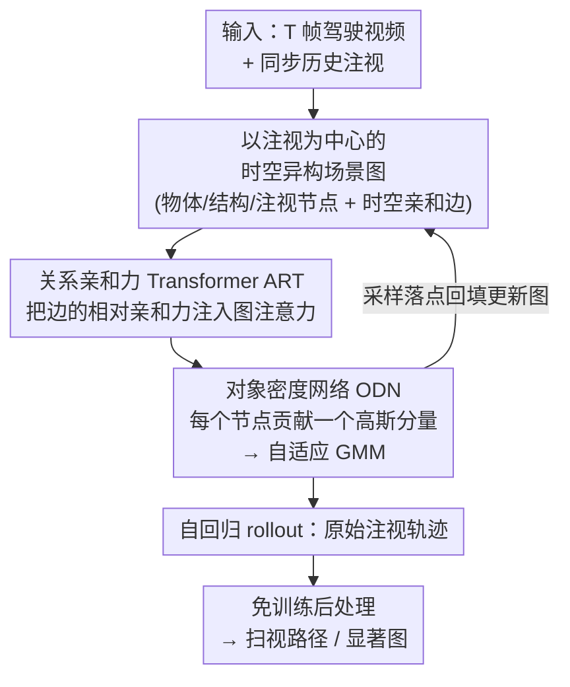

# Beyond Scanpaths: Graph-Based Gaze Simulation in Dynamic Scenes

**会议**: CVPR 2026  
**论文**: [CVF Open Access](https://openaccess.thecvf.com/content/CVPR2026/html/Palmer_Beyond_Scanpaths_Graph-Based_Gaze_Simulation_in_Dynamic_Scenes_CVPR_2026_paper.html)  
**代码**: 项目页 [glimpse.ml/beyond-scanpaths](https://glimpse.ml/beyond-scanpaths)（未见公开代码仓库）  
**领域**: 人体理解 / 驾驶注意力建模  
**关键词**: 注视模拟, 异构图Transformer, 驾驶员注意力, 混合密度网络, 动力系统建模

## 一句话总结
把驾驶员注视建模成一个自回归动力系统：将每一帧交通场景编码成「以注视为中心」的异构时空图，用关系亲和力 Transformer（ART）建模注视与交通物体的交互，再用对象级混合密度网络（ODN）预测下一步注视分布并自回归地展开成连续注视轨迹，从而用同一个模型同时生成 SOTA 级别的注视时间序列、扫视路径与显著图。

## 研究背景与动机

**领域现状**：在驾驶安全等场景里，人们想知道司机的视线落在哪里。主流做法把注视压缩成两类静态表示——要么是聚合的**显著图**（saliency map，每帧一张概率热图），要么是离散的**扫视路径**（scanpath，一串注视点）。视频显著性方向已经从 CNN-LSTM 演进到 ViT、对抗模型，但产出的始终是「聚合后的概率分布」。

**现有痛点**：这两类表示都把注视的**时间动力学**只当作隐式副产物。显著图直接抹掉了视线随时间移动的轨迹；扫视路径虽保留了顺序，但生成它必须先做**注视点过滤（fixation filtering）**——而在视频刺激下注视点检测算法本身就不可靠，过滤会引入伪影、丢失数据，还会把平滑追随（smooth pursuit）这类连续眼动当噪声删掉。换句话说，现有方法是在「已经被破坏过的中间表示」上建模。

**核心矛盾**：人的注视本质上是一个**随时间连续演化、由场景中物体相关性驱动**的过程，而现有方法要么丢掉时间维度（显著图），要么把连续轨迹离散化并依赖脆弱的预处理（扫视路径）。三种表示（轨迹 / 扫视 / 显著图）各自训一个模型，彼此割裂。

**本文目标**：① 直接在**原始注视轨迹**上学习「注视生成过程」本身，不做任何注视点过滤；② 用**一个模型**统一产出原始轨迹，并通过免训练后处理导出扫视路径和显著图，三项都达到 SOTA。

**切入角度**：作者借用了物理仿真里的「图基仿真（Graph-Based Simulation, GBS）」范式——把流体、布料、沙子这类系统建成「节点是物体/智能体、边是物理关系」的图，用 GNN 自回归地推演动力学。最近的研究表明 GBS 也能建模**不连续、随机**的动力学，而人的注视恰恰是不连续、随机跳变的，天然契合。

**核心 idea**：把驾驶员的注视当成视觉环境里的一个**主动智能体**，给它在异构场景图里专设一个「注视节点」，让它和交通物体节点一起随时间演化，自回归地预测下一步视线落点——首次把 GBS 用到视频与驾驶场景下的人类注意力建模。

## 方法详解

### 整体框架
方法要解决的是：给定 $T$ 帧驾驶视频和已观测到的历史注视，预测下一时刻（$T{+}1$）司机的视线落点，并能一直滚动下去生成完整轨迹。整体分三段串行：先把同步的视频 + 注视转成一张「以注视为中心」的**时空异构场景图**；再用堆叠的 **ART** 块在图上做消息传递，建模注视节点与各类交通物体节点之间的交互；最后用 **ODN** 读出最后一帧各节点的表示，输出一个**节点数自适应的二维高斯混合分布**作为下一步注视位置。训练用负对数似然；推理时从混合分布里**采样**一个注视点，回填进图、更新到下一时刻，如此**自回归 rollout** 得到连续轨迹，轨迹再免训练地后处理成扫视路径和显著图。

### 关键设计

**1. 以注视为中心的时空异构场景图：给视线一个能和物体对话的节点**

针对「显著图/扫视路径抹掉了注视与场景的交互关系」这个痛点，本文把每帧场景建成异构图 $G=(V,E,A,R)$。每个交通实体（车、人、信号灯等）在每个时刻是一个节点，节点特征 $x$ 含 2D 位置、包围框形状、检测置信度、外观向量、深度估计和 one-hot 类别。关键之处是额外引入一个**注视节点**，代表司机的中央凹视野——它用和物体节点相同的特征定义，但包围框中心放在测得的注视位置、尺寸固定为画面的 20% 高 ×10% 宽，外观取该区域的图像 crop；再加一个编码可行驶区域的**结构节点**。节点按检测标签归并成 `vehicle / person / static / gaze / structure` 五种异构类型，让模型给每类分配类型专属参数。

边分两类：同一时刻内所有节点对用双向**空间边**互连；跨时刻只从过去连向未来的**时间边**，且只在时间差落在预定义集合 $T_d=\{1,2,4,8,16\}$ 时连接（多尺度时间上下文，省去全连接的开销）。每条边带一个**亲和力特征向量** $a_{i,j}$，编码两节点在 3D 位置上的差、时间步差、以及外观向量的余弦相似度。注视节点与物体节点之间的边让「之前看过的物体」「当前在看的物体」的信息得以流动，配合跨时刻注视节点串起来的历史，给自回归预测提供上下文。这是把 GBS 用到注意力建模的载体：注视不再是后处理出来的点，而是图里和物体平起平坐、能交互的一员。

**2. 关系亲和力 Transformer（ART）：把边上的相对关系直接灌进注意力**

普通异构图 Transformer（HGT）用类型专属的缩放点积注意力 $a(x_i,x_j)=\xi_j\!\left(\frac{Q_iK_j^{\mathsf T}}{\sqrt d}\right)$，query/key/value 都来自节点自身，**边上的相对几何/外观关系（也就是 $a_{i,j}$）进不去注意力**。而注视往哪跳，恰恰取决于物体相对司机当前视线的位置、时间、外观差异。ART 的做法是：用两个独立编码器把边亲和力 $a_{i,j}$ 分别嵌成 key 偏置和 value 偏置（线性→BatchNorm→ReLU→线性）：

$$p^K_{i,j}=\max(0,\,\mathrm{BN}(a_{i,j}W^K_1+b^K_1))W^K_2,\qquad p^V_{i,j}=\max(0,\,\mathrm{BN}(a_{i,j}W^V_1+b^V_1))W^V_2$$

然后把它们**直接加到** key 和 value 上：$K_j=(x_jW^\tau_K+b^\tau_K)W^\phi_K + p^K_{i,j}$，$V_j=(x_jW^\tau_V+b^\tau_V)W^\phi_V + p^V_{i,j}$，再按 $\tilde x'_i=\sum_{j\in\mathcal N_i}\xi_j\!\left(\frac{Q_iK_j^{\mathsf T}}{\sqrt d}\right)V_j$ 聚合。这等于把语言/图像里「相对位置编码」的思想推广成「任意 $d$ 维关系向量」——不再是固定的 1D/2D 学习嵌入，而是把空间+时间+外观的相对关系一起注入每条消息。ART 块用 Pre-LN 设计（LayerNorm→ART 注意力→LayerNorm→两层 FFN），并用类型专属的门控残差 $y=\lambda_\tau u+(1-\lambda_\tau)h$，堆叠 $L$ 层构成图处理器。相比 HGT/HEAT，正是这套「关系入注意力」让生成的注视序列更贴近人类（见消融）。

**3. 对象密度网络（ODN）：高斯分量数随场景复杂度自适应的混合密度头**

针对「人在驾驶这种复杂任务里的注意力是被物体相关性引导的，而非逐像素的」，ODN 取一种**对象级**视角，而不是预测像素级热图。它读取最后一帧节点集合 $V_T$ 经第 $L$ 层 ART 后的特征，让**每个节点 $v_k$ 贡献一个高斯分量**，混合分量数 $K=|V_T|$——场景里物体越多、越复杂，混合容量越大。这与传统 MDN 用**固定**分量数的做法根本不同。对每个节点，异构线性层输出分量参数 $[\Delta\hat x_k,\Delta\hat y_k,\hat\sigma_{xk},\hat\sigma_{yk},\hat\rho_k,\hat\pi_k]$，经 softmax 得权重 $\pi_k$、$\tanh$ 约束相关系数、$\exp$ 保证标准差为正；均值为节点像平面位置加一个受限偏移 $\Delta\mu_k=\Delta_{\max}\tanh(\Delta\hat\mu_k)$（$\Delta_{\max}=0.05$）。下一步注视分布即

$$p(x,y)=\sum_{k=1}^{K}\pi_k\,\mathcal N\big((x,y)\,|\,\mu_k,\sigma_k,\rho_k\big).$$

这个设计还自带**可解释的注视机制**：注视节点上的 $\pi_k$ 高 → 视线倾向于停在当前位置（维持注视 fixation）；环境节点上的 $\pi_k$ 高 → 视线向对应交通物体或可行驶区域转移（注意力跳转）。一个权重就把「盯着不动」和「扫过去」统一表达了。

### 损失函数 / 训练策略
训练目标是 ground-truth 未来注视在预测混合分布下的负对数似然：

$$\mathcal L_{\mathrm{NLL}}=-\frac1n\sum_i^n\log\sum_{k=1}^{K}\pi_k\,\mathcal N\big(g^{\mathrm{GT}}_i\,|\,\mu_k,\sigma_k,\rho_k\big).$$

用 Adam、batch 128、float16 在 4×L40S 上训 50 epoch；Focus100 基础学习率 $3\times10^{-4}$、MAAD 为 $1\times10^{-3}$，ODN 头用 0.1× 基础学习率，权重衰减 $1\times10^{-6}$，取验证损失最低的 checkpoint。**全程在原始注视上训练，不做注视点过滤。** 推理时用前 20（Focus100）或 25（MAAD）个时间步初始化，反复从 ODN 分布采样并更新图来 rollout；显著图通过每条序列随机初始化跑 50 次模拟、用 EyeMMV 检测注视点、再每帧卷高斯核得到。

## 实验关键数据

数据集：自建 **Focus100**（30 名被试看 100 段 60 s 第一视角驾驶视频，10 fps 视频 + 60 Hz 同步注视，按 70/10/20 划分；含危险物体标注）与 **MAAD**（已有的、规模更小、同步原始注视的驾驶数据集）。评估覆盖三个维度：原始序列（TC↑、DTW↓、LEV↓）、扫视动力学（注视时长 Fix Dur、注视率 Fix Rate、首次注视时间 AOI TFF，越接近 Human 越好）、显著图（NSS↑、IG↑、AUC↑）。

### 主实验

| 数据集 | 模型 | TC ↑ | DTW ↓ | LEV ↓ | NSS ↑ | IG ↑ | AUC ↑ |
|--------|------|------|-------|-------|-------|------|-------|
| Focus100 | Human | 0.46 | 30.93 | 1.03 | - | - | - |
| Focus100 | DReyeVENet | 0.23 | 49.23 | 1.43 | 3.749 | 9.041 | 0.920 |
| Focus100 | SCOUT | 0.22 | 51.76 | 1.45 | 4.152 | 9.440 | 0.933 |
| Focus100 | ViNet | 0.23 | 49.68 | 1.41 | 4.310 | 9.471 | 0.938 |
| Focus100 | **ART（本文）** | 0.22 | **42.31** | **1.23** | **4.864** | **9.728** | **0.945** |
| MAAD | Human | 0.42 | 2.65 | 0.10 | - | - | - |
| MAAD | ViNet | 0.20 | 4.20 | 0.16 | **5.733** | **10.264** | 0.949 |
| MAAD | SCOUT | 0.19 | 5.91 | 0.18 | 4.191 | 9.735 | 0.952 |
| MAAD | **ART（本文）** | **0.46** | **2.70** | **0.10** | 4.926 | 9.778 | **0.953** |

> ART 在两个数据集的**原始序列对齐（DTW/LEV）**上全面领先，且在 MAAD 上 TC（0.46）甚至与 Human（0.42）持平、DTW/LEV 几乎贴上人类水平。显著图三项在 Focus100 上全 SOTA——这点尤其关键：多个 baseline 是**专门为显著图任务设计**的，而 ART 没有任何显著性监督，纯靠建模原始注视动力学就把显著图也做赢了，说明原始动力学里本就编码了底层的注意力结构。

扫视动力学上的对比更直观：Focus100 上 Human 的 Fix Rate 是 1.61 fix/s、Fix Dur 0.44 s，**ART 为 1.64 fix/s、0.41 s**，几乎重合；而 SCOUT/ViNet/DReyeVENet 的 Fix Rate 只有 0.05~0.07 fix/s——它们几乎产生不出连续的注视段，注视行为完全不像人。

### 消融实验

| Processor | Time | Head | TC ↑ | DTW ↓ | LEV ↓ | 说明 |
|-----------|------|------|------|-------|-------|------|
| ART | 20 | ODN | 0.22 | 42.31 | 1.23 | 完整模型 |
| HGT | 20 | ODN | 0.21 | 42.72 | 1.28 | ART→HGT，关系不入注意力，略降 |
| HEAT | 20 | ODN | 0.13 | 59.50 | 1.47 | ART→HEAT，序列合理性大幅下滑 |
| ART | 20 | MDN(k=10) | 0.14 | 44.78 | 1.30 | ODN→固定 10 分量 MDN，明显变差 |
| ART | 20 | MDN(k=20) | 0.14 | 45.69 | 1.32 | 固定 20 分量同样差 |
| ART | 8 | ODN | 0.17 | 43.46 | 1.26 | 时间窗缩到 8，对齐变差 |
| ART | 1 | ODN | 0.17 | 42.35 | 1.24 | 时间窗缩到 1 |

### 关键发现
- **ODN 是性能主心骨**：把对象自适应的 ODN 换成固定分量数的标准 MDN，TC 从 0.22 直接掉到 0.14——固定分量数无法随场景复杂度伸缩，证实「让混合容量等于节点数」这一设计的价值。
- **ART 的关系注意力有效**：换成 HGT 只小降，但换成 HEAT 后 TC 砍半（0.22→0.13）、DTW 暴涨，说明把相对亲和力注入注意力对生成可信注视序列确有贡献。
- **更长时间上下文更好**：时间窗 $T$ 从 20 缩到 8 或 1，TC 都从 0.22 降到 0.17，长时间依赖对捕捉注视动力学有帮助。
- **无监督却赢专门模型**：ART 不用显著性监督就在显著图指标上超过专为该任务设计的 baseline，暗示原始注视动力学本身蕴含了注意力的底层结构。

## 亮点与洞察
- **把"看哪里"重新定义成"一个智能体在场景图里怎么演化"**：注视节点和物体节点平等参与消息传递，注视历史与环境历史共同条件化下一步——这把注意力建模从「静态预测」升级成「动力系统仿真」，是范式层面的迁移。
- **ODN 的权重天然可解释**：注视节点权重高=维持注视、环境节点权重高=跳转，用一个混合权重就把 fixation 和 saccade 两种眼动统一了，且分量数随场景物体数自适应，非常优雅。
- **"在原始数据上直接学生成过程"绕开了脆弱的中间步骤**：不做注视点过滤，反而能同时导出轨迹/扫视/显著图三种表示且都 SOTA，提示我们很多任务里「先离散化再建模」可能是在自找麻烦。
- **ART 的关系注入可迁移**：把任意 $d$ 维关系向量编码进图注意力的 key/value，这套机制不限于注视，对轨迹预测、场景图推理等需要建模「相对关系」的任务都可复用。

## 局限与展望
- 作者承认：Focus100 是**实验室受控环境**采集（被试看屏幕做危险感知测试），并非真实在路驾驶，迁移到真实驾驶时注视行为可能有差异。
- ART **依赖上游感知栈**（YOLOv8 检测、YOLOPv2 可行驶区域、monodepth2 深度、vgg16 外观），上游的检测/深度误差会直接传播到注视预测——端到端鲁棒性是隐患。
- **没有显式建模驾驶意图**，而意图（如准备左转）会强烈调制注意力分配；作者把它列为自然的后续方向。
- ⚠️ 自己补充的局限：评测把每条生成序列与「最近的 ground-truth」配对再平均，这种 best-match 策略可能高估对齐质量；且 DTW/LEV 对序列长度敏感，跨数据集（MAAD vs Focus100）的绝对数值不可直接比大小，只能在同数据集内横比。

## 相关工作与启发
- **vs 视频显著性方法（ViNet / DReyeVENet / SCOUT / GLC）**：它们产出聚合的概率热图，丢掉了注视的时间动力学，Fix Rate 只有 0.05~0.07 fix/s 几乎无连续注视；本文显式 rollout 原始轨迹，注视率贴近人类（1.64 vs 1.61），且无监督就在显著图指标上反超它们。
- **vs 唯一的驾驶扫视路径工作 [39]（CNN-Transformer + 逆强化学习）**：它预测离散注视点序列、无时长，且依赖注视点过滤；本文在连续原始注视上建模、保留平滑追随等动力学，并能免训练导出扫视路径。
- **vs 静态图像自由观看的扩散注视生成 [45]**：[45] 用扩散模型在静态图上生成连续注视；本文首次把连续注视序列生成搬到**任务驱动的视频/驾驶**场景。
- **vs 交通物体轨迹预测的图基仿真（如 [44] 的异构交通图 + 图 Transformer）**：本文沿用异构时空图 + 图 Transformer 框架，但**首次把驾驶员注意力本身作为一个专设节点**纳入仿真，并提出 ART 的相对亲和力编码，是 GBS 在人类注意力建模上的首次应用。

## 评分
- 新颖性: ⭐⭐⭐⭐⭐ 首次把图基仿真用于视频/驾驶注视建模，注视节点 + ART + 自适应 ODN 三处设计都有原创性。
- 实验充分度: ⭐⭐⭐⭐☆ 两数据集 ×三维度指标 + 完整消融，但仅实验室数据、缺真实在路验证。
- 写作质量: ⭐⭐⭐⭐⭐ 动机层层推导清晰，公式与图示完整，三种表示统一的故事讲得很顺。
- 价值: ⭐⭐⭐⭐⭐ 统一框架 + 新数据集 Focus100，对驾驶安全与人类注意力时序建模都有实用价值。

<!-- RELATED:START -->

## 相关论文

- [\[CVPR 2026\] Forecasting 3D Scanpaths in Egocentric Video](forecasting_3d_scanpaths_in_egocentric_video.md)
- [\[CVPR 2026\] SyncDreamer: Controllable and Expressive Avatar Generation Beyond the Talking Head](syncdreamer_controllable_and_expressive_avatar_generation_beyond_the_talking_hea.md)
- [\[CVPR 2026\] Beyond Static Frames: Temporal Aggregate-and-Restore Vision Transformer for Human Pose Estimation](beyond_static_frames_temporal_aggregate-and-restore_vision_transformer_for_human.md)
- [\[CVPR 2026\] Push-and-Step: From RL-Based Balance Recovery to Physical Simulation of Dense Crowds](push-and-step_from_rl-based_balance_recovery_to_physical_simulation_of_dense_cro.md)
- [\[CVPR 2026\] Beyond Single-View Sufficiency: CVBench for Cross-View Human Understanding](beyond_single-view_sufficiency_cvbench_for_cross-view_human_understanding.md)

<!-- RELATED:END -->
