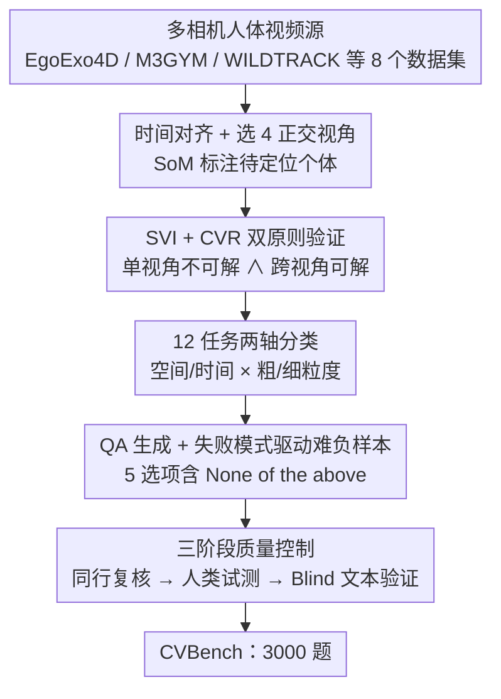

# Beyond Single-View Sufficiency: CVBench for Cross-View Human Understanding

**会议**: CVPR 2026  
**论文**: [CVF Open Access](https://openaccess.thecvf.com/content/CVPR2026/html/Guo_Beyond_Single-View_Sufficiency_CVBench_for_Cross-View_Human_Understanding_CVPR_2026_paper.html)  
**代码**: 待确认  
**领域**: 人体理解 / 多模态VLM  
**关键词**: 跨视角理解, MLLM评测基准, 多视角融合, 单视角偏置, 时空推理  

## 一句话总结
针对现有 MLLM 基准默认"单视角足够"、只奖励单图识别的漏洞，本文构造 CVBench——3000 道每题都被强制验证"单视角不可解、跨视角才可解"的人体理解题（12 个时空任务、4 路同步相机），评测发现最强模型也落后人类近 50 分，并诊断出贯穿所有模型的系统性失败机制"单视角偏置"。

## 研究背景与动机
**领域现状**：人对社会场景的感知本质是一个多视角综合问题——同一场景被多台相机从不同角度、跨较长时间观测，人能轻松把互补、甚至彼此遮挡的视觉线索融合成对"谁是谁、在做什么、如何交互"的一致理解。但现代 MLLM 的评测几乎全建立在单视角场景上，从静态 VQA 到近年的视频基准都默认"给定的单张图/单段视频已包含回答问题所需的全部信息"。

**现有痛点**：这种"充足视角（sufficient-view）"范式只奖励模型在一条连续视觉流内做识别或时序推理，根本没有考核跨视角融合能力。即便很多 MLLM 接受多图输入，它们也从未被系统地测试"能否综合互补、甚至冲突的信息"。后果是模型在多相机真实环境里频繁犯错：混淆外观相似的人、把跨相机看到的同一个人重复计数、深度模糊时误判接触、只看到部分肢体就预测不出动作——这些恰恰是安防、体育分析、人机协作场景里致命的失败模式。

**核心矛盾**：现有多图/视频 VQA 基准存在"摘樱桃（cherry-picking）"问题——模型被喂多个视角，却只因"找到包含答案的最容易的那个视角"而得分，从不因"忽略矛盾证据、没能综合出 3D 一致解释"而被惩罚。于是无法判断模型是真在做跨视角融合，还是只是挑了个最优单视角。

**本文目标**：把"跨视角人体理解"形式化为一项核心但被严重低估的 MLLM 能力，并造一个能可验证地强制多视角综合、且能诊断失败原因的基准。

**切入角度**：作者抓住一个可操作的构造原则——既然要测跨视角融合，就让每一道题在任何单一视角下都不可解、必须融合两个以上视角才能消歧。这把"摘樱桃"直接变成一个失败策略。

**核心 idea**：用"可验证的单视角不充分性（verifiable single-view insufficiency）"作为每道题的硬约束来重建人体理解基准，配合按失败模式定制的难负样本，把基准从"允许多视角输入"升级为"强制多视角综合"。

## 方法详解

### 整体框架
CVBench 不是一个模型，而是一个评测基准，因此"方法"的核心是数据如何被构造得既难又公平。基准沿两条互补的轴组织：**空间轴**（同一时刻、不同相机，考身份关联、去重计数、细粒度接触/遮挡推理）与**时间轴**（多时刻、多相机，考身份连续性、动作识别、运动预测）；每条轴再按**粒度**分为粗粒度（场景级解释）与细粒度（精确到肢体/动作），共 2×2 组织出 12 个任务。所有片段统一为 4 路同步视角、6–30 秒，每题都要求模型维持人物身份、融合互补甚至冲突的线索，并可由真值证据片段（evidence span）定位到"哪段画面消除了歧义"。

构造管线是一条四阶段串行流水线：从多个公开多相机人体数据集汇集素材 → 人工选图并验证"单视角不充分 + 跨视角可解" → 按 12 个任务人工生成 QA 与难负样本 → 三阶段质量控制。下图给出鸟瞰：

### 关键设计

**1. SVI + CVR 双原则：让"摘樱桃"成为失败策略**

这是 CVBench 区别于所有先前多图基准的根。先前基准允许多视角输入，却不阻止模型挑一个最容易的视角蒙混过关；本文要求每道候选题同时通过两道关卡：**单视角不充分性（Single-View Insufficiency, SVI）**——标注员必须确认不存在任何单一视角能无歧义地回答该问题；**跨视角可解性（Cross-View Resolvability, CVR）**——必须确认融合两个以上视角后该问题确实变得唯一可答。只有同时满足 SVI∧CVR 的事件才被允许出题。这一约束直接把基准的目标从"permitting multi-view input"提升到"mandating multi-view synthesis"，并精准瞄准作者识别出的关键失败模式"单视角偏置"：一道题如果能被单视角解出，就测不到融合能力，必须被剔除。标注员被训练去主动"猎取"天然有歧义的时空事件——人-人遮挡、视场重叠、模糊的社交互动、细粒度的接触/近接触——而不是对随机片段提问，从源头保证难度。

**2. 12 任务两轴分类法：把跨视角人体理解拆成可诊断的子能力**

基准沿"空间 × 时间"和"粗 × 细粒度"两条正交轴展开 12 个任务，每个任务对应一种具体的失败机理，使评测能定位模型"到底哪种跨视角能力缺失"。空间粗粒度有跨视角去重计数（直接测"把每个视角检测数朴素相加"导致的重复计数）、跨视角身份关联（被动重识别，姿态/光照/遮挡变化下判断是否同一人）、跨视角接触识别（单视角 2D 邻近是高熵不可靠信号，须靠跨视角一致性解深度歧义）；空间细粒度有肢体遮挡判别、肢体接触识别（要求亚厘米级几何消歧）、跨视角动作计数。时间维则有轨迹概括（跨不连续视场重建某人运动）、重复计数（动作跨视角续接，须维持时序绑定避免重复计数）、运动识别，以及肢体级重复计数、肢体动作顺序、肢体接触识别等细粒度时序任务。表 1 给出分布：空间 1508 题、时间 1492 题，粗/细基本平衡，合计 3000。这种两轴结构让结果能拆成"粗 vs 细""空间 vs 时间"的对比，从而读出"细粒度是瓶颈""时间比空间更难"等结论。

**3. 失败模式驱动的难负样本构造：把干扰项做成模型最可能踩的坑**

基准难度的另一关键来源是难负样本（hard-negative distractors）——它们不是随机采样，而是半自动地围绕最常见失败模式构造。对计数类任务，干扰项就是从部分单视角证据推出的错误答案：若真值为 3，而 View 1 看到 2、View 2 看到 2，则把"2"和朴素相加的"4"设为干扰项，直接惩罚单视角偏置。对身份/空间类任务（如接触），干扰项是最易混淆的对象——物理上最近但并未交互的"Person B"，以及共享相似属性（同款衬衫颜色）的"Person C"，逼模型做细粒度空间与身份辨别。对时序类任务（如动作顺序），干扰项包含被颠倒的动作顺序（"先跳后跑" vs "先跑后跳"）或语义被"抹平"的动词（"moving"），看似合理但不精确。此外每题采用 5 选项多选格式，固定含一个"None of the above"——这个选项关键在于阻止模型靠挑"听起来最合理"的选项来蒙。

**4. 三阶段质量控制：堵住"靠语言先验作弊"的漏洞**

为保证每题确实考的是视觉跨视角融合而非世界知识，基准用三阶段验证。**阶段 1·同行复核**：每道 QA 至少由另一名标注员复审，核心任务是重新验证 SVI 与 CVR 原则，创建者与复审者分歧由资深作者裁决。**阶段 2·人类试测**：找一组未参与标注的人做试测，既确认题目表述清晰，也建立人类性能上界（表 2/3 中 94.4% / 93.5% 的 Human 行即来自此）。**阶段 3·Blind 文本验证**：把每道题（仅文字与选项、不给图）交给纯文本 LLM，若模型靠语言先验或常识就答对（如"健身房通常有很多人"），该题被标记并重写，确保严格视觉接地。评测中报告的"Blind"基线（约 18–21%，接近随机 20%）正是这一关卡留下的可量化证据，说明数据集对语言先验稳健。

## 实验关键数据

### 评测设置
所有帧缩放到 796×448；空间任务对待定位个体用 Set-of-Mark（SoM）视觉提示辅助定位。被测模型含 8 个开源（DeepSeek-VL2、Qwen2.5-VL-7B/72B、LLaVA-OneVision-7B/72B、InternVL2.5-26B、InternVL3-78B）与 3 个闭源（GPT-5、Gemini-2.5-Pro、Gemini-2.5-Flash），温度全设 0。三条基线：Human（上界）、Random（5 选项随机 ≈20%）、Blind（仅文本喂 Gemini-2.5-Flash，测语言先验稳健性）。指标为多选准确率。

### 主实验
空间任务（表 2，All 列为综合准确率，%）：

| 模型 | 类别 | 粗粒度 Coarse | 细粒度 Fine | All |
|------|------|------|------|------|
| Qwen2.5-VL-7B | 开源 | 29.9 | 24.4 | 27.2 |
| InternVL3-78B | 开源(最佳) | 38.5 | 31.1 | **34.8** |
| Gemini-2.5-Flash | 闭源 | 40.5 | 33.6 | 37.1 |
| GPT-5 | 闭源 | 41.2 | 35.5 | 38.4 |
| Gemini-2.5-Pro | 闭源(最佳) | 40.9 | 36.3 | **38.6** |
| Human | 基线 | 96.7 | 92.1 | 94.4 |
| Random / Blind | 基线 | — | — | 20.0 / 18.5 |

时间任务（表 3，%）：

| 模型 | 类别 | 粗粒度 Coarse | 细粒度 Fine | All |
|------|------|------|------|------|
| Qwen2.5-VL-7B | 开源 | 28.6 | 23.5 | 26.0 |
| InternVL3-78B | 开源(最佳) | 35.3 | 30.3 | **32.8** |
| GPT-5 | 闭源 | 35.6 | 31.8 | 33.7 |
| Gemini-2.5-Pro | 闭源(最佳) | 35.8 | 33.9 | **34.9** |
| Human | 基线 | 95.7 | 91.4 | 93.5 |
| Random / Blind | 基线 | — | — | 20.0 / 21.3 |

四点关键结论：① **MLLM 在跨视角时空推理上全面挣扎**——最强的 Gemini-2.5-Pro 空间 38.6%、时间 34.9%，落后人类（94.4% / 93.5%）50 分以上，证实"单视角数据调出来的模型缺乏跨视角融合机制"。② **闭源稳定优于开源**——空间上闭源全部超过最佳开源 InternVL3-78B（34.8%），时间上同样如此，但差距不大、并非不可逾越。③ **时间比空间更难**——同一模型在时间任务上 All 普遍更低（如 InternVL3-78B 34.8%→32.8%），轨迹概括任务尤其难，凸显跨不连续视频流维持身份的困难。④ **细粒度是主要瓶颈**——各模型细粒度分数都明显低于粗粒度（GPT-5 空间 41.2%→35.5%），说明模型能抓场景级概念却做不了精确几何/肢体级推理，而这恰是跨视角线索最关键之处。

### 错误分析（消融式诊断）
作者人工复核了 500 个失败案例（250 空间 + 250 时间，采样自 GPT-5 与 InternVL3-78B），按主因归类（表 4，%）：

| 失败类别 | 域 | InternVL3-78B | GPT-5 |
|------|------|------|------|
| 单视角偏置 Single-View Bias | 空间 | 42.0 | 38.8 |
| 几何推理失败 Geometric Failure | 空间 | 38.4 | 35.2 |
| 身份混淆 Identity Confusion | 空间 | 14.8 | 22.0 |
| 时序不连贯 Temporal Incoherence | 时间 | 44.8 | 40.4 |
| 身份混淆 Identity Confusion | 时间 | 35.2 | 37.6 |
| 单视角偏置 Single-View Bias | 时间 | 15.6 | 16.8 |

### 关键发现
- **"单视角偏置"是系统性病灶**：空间失败中超 40% 属此类。模型不"融合"视角而是"摘樱桃"——View 1 显示两人邻近（模糊）、View 3 清楚显示分开时，模型常只凭 View 1 答"接触"，无法把 View 3 当作"否决/纠错信号"。本质上它把多视角当成无序的"证据袋（bag of evidence）"，最终预测被那个最自信但错误的单模态预测主导。
- **几何/物理推理薄弱**：细粒度失败中超 35% 因模型分不清真接触（手放在膝上）与近接触（手在膝上方），只靠视点依赖的 2D 像素邻近判断。
- **时序双重计数与动作抹平**：重复计数时人移动到 View 2 会把同一动作重数一遍；运动识别时把"坐下→起立"这种有序序列塌缩成一个泛化的"moving"。
- **数据集对语言先验稳健**：Blind 基线约 18.5%（空间）/21.3%（时间），接近随机 20%，说明题目无法靠常识猜出，三阶段质控有效。

## 亮点与洞察
- **把"评测漏洞"形式化为一个可执行的构造约束**：SVI∧CVR 双原则不是口号，而是每题必过的两道关卡，使"摘樱桃"从一种隐性逃逸路径变成可被验证地堵死的失败策略——这是基准设计上最值得复用的思路。
- **难负样本与失败模式同构**：干扰项直接由"单视角朴素相加""最近但不交互的人""颠倒的动作顺序"等失败模式生成，等于把模型最可能踩的坑明码标价，让分数差异直接映射到具体能力缺陷，而非靠运气拉开。
- **证据片段（evidence span）监督**：每题都附"哪段画面消除了歧义"的真值定位，使基准不止给对错，还能诊断"模型为什么错"，这种可验证、可解释的设计可迁移到其他需要多源融合的评测（如多医学影像、多文档推理）。
- **"细粒度+时间"双瓶颈**的实证：把任务拆成两轴后，结论能精确读到"时间比空间难、细粒度是主要短板"，这对后续做跨视角架构的人指明了优先攻坚方向。

## 局限与展望
- 作者立场上更强调诊断而非给出解法：CVBench 揭示了单视角偏置、身份脆弱、几何推理缺失，但本身不提供"跨视角感知架构"，把这留给社区。
- ⚠️ 多视角统一裁剪为 4 路、片段 6–30 秒，且对多于 4 视角的数据集靠人工挑选 4 个正交视角——这一裁剪可能让"视角数/时长"成为隐含变量，真实部署中相机数与时长更可变，基准结论是否随之外推有待验证。
- 评测靠 5 选项多选准确率，虽便于复现，但无法刻画模型"接近正确但推理链不同"的细微差别；且抽取答案时用 Gemini-2.5-Flash-Lite 做匹配，可能引入少量提取误差。
- 跨空间/时间、跨粗/细的分数虽可横比，但不同任务难度本身不同，"时间比空间难"应理解为同模型自比的趋势，而非任务绝对可比。
- 改进思路：把 evidence-span 监督进一步用于训练（而非仅评测），或基于难负样本设计"反单视角偏置"的对比目标，可能是从基准走向方法的自然下一步。

## 相关工作与启发
- **vs 单视角/视频 VQA 基准（如各类 video-centric benchmark）**：它们默认单条视觉流已含全部信息，奖励单视角识别；CVBench 反其道，强制单视角不充分，第一次把"是否真在做跨视角融合"变得可验证。
- **vs 经典多视角人体数据集（MOT、3D 姿态、行人检测等）**：它们提供了理想的同步、常标定的多视角时空数据，但只服务于狭窄预定义任务，缺乏语言接地的开放式查询；CVBench 首次把经典多视角数据结构与现代 MLLM 的语言接地评测范式缝合起来。
- **vs 多图 VQA 基准（无序图集检索、多医学影像比较等）**：它们的输入通常未标定、非同时，无法考核 3D 一致的几何/身份融合；CVBench 用同步、时间对齐的 4 视角填补了这一空白。

## 评分
- 新颖性: ⭐⭐⭐⭐⭐ 把"单视角不充分性"形式化为可验证的构造约束，首次系统考核跨视角人体理解，并诊断出贯穿所有模型的"单视角偏置"。
- 实验充分度: ⭐⭐⭐⭐⭐ 11 个开闭源模型 × 12 任务全面评测，配 3 条基线与 500 例人工错误分析，结论扎实。
- 写作质量: ⭐⭐⭐⭐ 动机—原则—任务—构造—诊断逻辑清晰，表格信息密度高；少数任务定义偏罗列。
- 价值: ⭐⭐⭐⭐⭐ 揭示当前 MLLM 跨视角融合的根本短板，为下一代时空接地、身份感知架构提供可诊断的标尺。

<!-- RELATED:START -->

## 相关论文

- [\[CVPR 2026\] JUMP-Hand: Learning Joint-wise Uncertainty to Gate Mixture of View Experts for Multi-View 3D Hand Reconstruction](jump-hand_learning_joint-wise_uncertainty_to_gate_mixture_of_view_experts_for_mu.md)
- [\[CVPR 2026\] Mocap-2-to-3: Multi-view Lifting for Monocular Motion Recovery with 2D Pretraining](mocap-2-to-3_multi-view_lifting_for_monocular_motion_recovery_with_2d_pretrainin.md)
- [\[CVPR 2026\] View-Aware Semantic Alignment for Aerial-Ground Person Re-Identification](view-aware_semantic_alignment_for_aerial-ground_person_re-identification.md)
- [\[ECCV 2024\] UPose3D: Uncertainty-Aware 3D Human Pose Estimation with Cross-View and Temporal Cues](../../ECCV2024/human_understanding/upose3d_uncertainty-aware_3d_human_pose_estimation_with_cross-view_and_temporal_.md)
- [\[CVPR 2026\] ReGenHOI: Unifying Reconstruction and Generation for 3D Human-Object Interaction Understanding](regenhoi_unifying_reconstruction_and_generation_for_3d_human-object_interaction_.md)

<!-- RELATED:END -->
