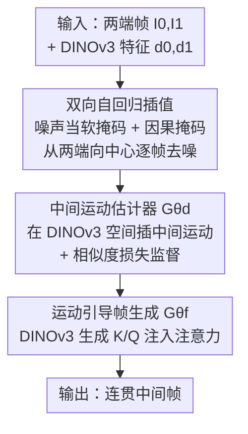

# Bi-directional Autoregressive Diffusion for Large Complex Motion Interpolation

**会议**: CVPR 2026  
**论文**: [CVF Open Access](https://openaccess.thecvf.com/content/CVPR2026/html/Ma_Bi-directional_Autoregressive_Diffusion_for_Large_Complex_Motion_Interpolation_CVPR_2026_paper.html)  
**代码**: 项目页提供（论文称 "Please visit the project page for the code"，具体仓库地址未在正文给出 ⚠️ 以原文为准）  
**领域**: 视频插帧 / 扩散模型 / 人体运动  
**关键词**: 视频帧插值, 自回归扩散, DINOv3运动表征, 大幅复杂运动, 时序一致性

## 一句话总结
ARVFI 把视频插帧从"一次性生成所有中间帧"改成"从两端输入帧向中间逐帧自回归生成"，并用 DINOv3 特征替代光流作为运动表征，在大幅复杂运动下既显著提升插帧精度（FID 全面领先）又把采样步数压到 15 步、比 backbone Wan 快约 3 倍。

## 研究背景与动机
**领域现状**：视频帧插值（VFI）的目标是在两张输入帧之间补出时序连贯的中间帧，核心是估计帧间运动来建立像素对应。早期方法靠光流和局部运动假设，近期主流转向用预训练视频扩散模型（如 Wan）把插帧当成"以两端帧为条件的生成任务"，隐式学习帧间运动分布。

**现有痛点**：面对舞者的腿这类大幅、非刚性、高度非线性的运动，现有扩散插帧仍会产生不连贯的运动和跨帧不一致的物体外观（手变形、自行车断裂）。

**核心矛盾**：作者把失败归到两个根因。其一是**全序列生成策略**——现有方法把所有中间帧同时生成，却忽略了"离输入帧越远的帧插值越难"这一事实，导致远端帧不确定性高、时序连续性和外观一致性崩坏。其二是**像素级重建目标**——L1/L2 损失或光流这类低层表征对外观变化敏感、缺乏语义不变性，在大幅运动下无法充分监督运动生成，常把物体结构生成坏掉。

**本文目标**：在统一框架里同时把"运动"和"外观"建模好，专门攻克大幅复杂运动的插帧。

**切入角度**：既然远帧更难，就别一次性生成——而是像自回归那样，让每一帧都基于已经生成好的近帧来预测，把难题拆成一连串"有上下文支撑"的简单预测；既然像素/光流表征不够稳，就换成 DINOv3 这种带高层语义、靠 patch 相似度天然给出稠密运动信息的特征当运动表征。

**核心 idea**：用"双向自回归插值 + DINOv3 运动表征"两条腿，先在 DINOv3 特征空间插出中间运动，再以运动为引导条件生成像素帧。

## 方法详解

### 整体框架
ARVFI 是一个两阶段、双向自回归的插帧框架。输入是两端帧 $I_0, I_1$ 及其 DINOv3 特征 $d_0, d_1$，输出是中间帧序列。第一阶段用**中间运动估计器** $G_{\theta d}$ 在 DINOv3 特征空间里插出中间运动表征 $d = \{d_{\tau_1}, ..., d_{\tau_{N-1}}\}$；第二阶段用**中间帧生成器** $G_{\theta f}$ 以估计出的 DINOv3 特征为条件，生成中间帧像素。两个阶段都不是"同时生成所有帧"，而是借由**逐帧递增的噪声当软掩码** + **双向因果注意力掩码**，让生成从两端输入帧向时序中心逐步推进——每一帧只依赖已被去噪的近邻帧，而非还是纯噪声的远端帧。

值得强调的是，运动估计和帧生成用的是**两个独立的扩散 Transformer**（都基于 Wan2.1-Fun-InP-1.3B 改造），因为 DINOv3 特征和帧 embedding 的数据分布不同；论文实验证明像 VideoJAM 那样用同一个模型联合生成两者会拉低帧质量。

### 关键设计

**1. 双向自回归插值：让远帧站在近帧的肩膀上生成**

这一设计直击"全序列同时生成导致远帧崩坏"的痛点。ARVFI 不再一次性吐出所有中间帧，而是从最靠近输入的帧开始、向时序中心逐步推进。它没有用硬性的"先完全生成一帧再做下一帧"，而是采用一种"软"自回归：用**序列噪声当掩码**——每帧的扩散时间步随其到输入帧的距离递增，离输入近的帧噪声小、先被去噪，远的帧噪声大、后处理。训练时（Algorithm 1）对第 $i$ 帧取 $t_i = \min(t + i \cdot s, T)$，其中 $t$ 是随机采样的基准时间步、$s$ 是跨帧步长间隔，从而强制"越远噪声越大"。在同一次采样迭代里，ARVFI 先去掉最近帧 $(\tau_1, \tau_5)$ 的部分噪声，再在刚去噪过的帧和下一批帧 $(\tau_2, \tau_4)$ 上继续去噪，迭代直到所有帧生成完。

为防止"还没处理、仍是纯噪声"的远帧把噪声泄漏进当前帧，ARVFI 给所有 DiT block 套了一个**双向因果注意力掩码**：每帧的注意力只能看已经去噪过的帧（图 3 红箭头），不能看未处理的噪声帧。这相对 Diffusion-Forcing 是关键改进——Diffusion-Forcing 是单向从首帧采到尾帧、且用 RNN 实现，破坏了 VFI 里"两端都已知"的双向因果性；ARVFI 把它改成从两端向中间的双向因果版本，并适配进扩散 Transformer。每帧基于更多含噪更少的已生成帧，因此运动过渡更平滑、时序更一致，同时因为有上下文支撑可以用更少采样步数。

**2. DINOv3 运动表征 + 相似度损失：用语义特征替代光流来稳住大幅运动**

这一设计针对"像素级/光流表征监督不了复杂运动"的痛点。光流在小物体和大幅复杂运动上容易退化，且光流上色过程会产生不可预测的颜色突变，让扩散模型训练不稳；稀疏匹配在遮挡和形变下也会退化。ARVFI 改用 DINOv3 特征当运动表征：DINOv3 同时含高层语义和低层结构，靠跨帧 patch 相似度天然给出稠密、对外观/亮度/几何畸变鲁棒的运动信息（图 2 里它对高亮鞋子的 patch 相似度最准）。

为了让生成出来的中间 DINOv3 特征真的携带正确运动，作者在像素重建损失之外加了**相似度损失**：

$$L_{sim} = \|d_0 \cdot d - d_0 \cdot \hat{d}\|^2 + \|d_1 \cdot d - d_1 \cdot \hat{d}\|^2$$

其中 $d$ 是真值中间 DINOv3 特征、$\hat{d}$ 是估计值、$d_0, d_1$ 是两端输入特征。它要求"估计特征与输入的 patch 相似度"匹配"真值与输入的相似度"，从而显式约束运动一致性（为省显存只算与两端输入的相似度、不算全序列两两相似度）。运动估计器的总损失为 $L_d = L_{\epsilon d} + \zeta L_{sim}$，$\zeta = 0.5$。

**3. 运动引导帧生成：把 DINOv3 运动当 K/Q 注入注意力，零额外模块**

有了中间 DINOv3 特征后，怎么把它"喂"给帧生成器是个问题。VideoJAM 是联合生成帧和光流可视化，Motion-I2V 是另加模块灌运动，二者都有代价。ARVFI 的做法很轻：帧生成器 $G_{\theta f}$ 基于 Wan2.1-Fun-InP-1.3B，作者用两个共享的 MLP + 归一化从估计的 DINOv3 特征算出额外的注意力 query $Q_d$ 和 key $K_d$，再把它们**加到**原始帧 embedding 算出的 $Q_f, K_f$ 上，得到增强后的 $Q, K$ 用于所有 30 个 DiTBlock 的注意力（图 4）。

由于 DINOv3 的 patch 相似度对所有 block 提供的是同一份运动先验，这两个 MLP 在所有 block 间共享、用同一套 $Q_d/K_d$。这样几乎不增加计算量就把运动线索注入了帧生成；又因为预训练 DiT 的结构原封不动，帧生成阶段的训练稳定高效。

### 损失函数 / 训练策略
运动估计器 $G_{\theta d}$ 用 $L_d = L_{\epsilon d} + 0.5 \cdot L_{sim}$（像素重建 + 相似度损失），DINOv3 输入不加噪、沿时间维与噪声拼接并把其时间步设到最小（等价无噪）。训练分两步：先训 $G_{\theta d}$ 50 万次迭代，再用训好的 $G_{\theta d}$ 生成 DINOv3 特征去训帧生成器 $G_{\theta f}$ 20 万次迭代。两个 DiT 都在 $576\times320$、$\to25$ 插值设置下、8 张 A100-80G、总 batch 8、学习率 2e-5、AdamW 训练。推理时 DINOv3 估计和帧生成的时间步间隔分别为 500 和 150，合计仅 15 步扩散采样。

## 实验关键数据

### 主实验
在 DAVIS-7（$\to8$ 插值）、FCVG 的评测集（$\to25$ 插值）和自采的 Pixels（100 序列）三个数据集上，与 8 个 SOTA 比（4 个非生成式 + 4 个扩散式）。ARVFI 在 LPIPS / FID / FVD 上全面领先：

| 数据集 | 指标 | ARVFI | 次优 | 备注 |
|--------|------|-------|------|------|
| DAVIS-7 | FID↓ | **21.65** | 22.10 (LDMVFI) | FVD 188.77 也最佳 |
| 评测集[42] | FID↓ | **19.03** | 28.52 (Wan) | 大幅领先 ~33% |
| 评测集[42] | LPIPS↓ | **0.206** | 0.223 (Wan) | — |
| Pixels | FID↓ | **17.60** | 22.48 (Wan) | FVD 101.71 最佳 |

非生成式方法（如 FILM）常因生成模糊帧而在重建型指标上虚高、但感知质量差；扩散式方法受限于运动生成能力，在大幅运动下退化。ARVFI 同时估运动表征和采样视频，分布更贴近真值。

### 消融实验
在 FCVG 数据集上逐步简化模型（表 2）：

| 配置 | LPIPS↓ | FID↓ | FVD↓ | 说明 |
|------|--------|------|------|------|
| Frame Full-Seq | 0.217 | 27.63 | 210.53 | 全序列同时生成（基线） |
| Frame Bi-AR | 0.210 | 23.41 | 205.32 | 换成双向自回归，FID −4.2 |
| Uni-Flow Vis | 0.215 | 23.88 | 203.37 | 联合生成光流可视化，仅微改善 |
| Uni-DINOv3 | 0.232 | 28.97 | 223.37 | 联合生成 DINOv3，反而变差 |
| **Our ARVFI** | **0.206** | **19.03** | **201.47** | 双 DiT 分离 + 运动引导 |

### 关键发现
- **自回归策略是第一大贡献**：从 Full-Seq 换成 Bi-AR，FID 由 27.63 降到 23.41，手、头等部位的时序一致性明显改善。
- **"联合生成"是反例**：把运动表征和帧生成塞进同一个扩散模型（Uni-DINOv3）反而把 FID 拉高到 28.97——因为 DINOv3 特征和帧 embedding 数据分布不同，联合建模会让模型在多分布间被拉偏，证明 ARVFI 用两个独立 DiT 的设计是对的。
- **效率全面碾压**（表 3，$1024\times576$、$\to25$）：ARVFI 仅 15 步采样、每帧 0.775s，比第二快的 Wan（50 步、2.582s）省约 70% 时间，比 FCVG（14.382s）、GI（23.467s）快一个量级——自回归把难题拆成有上下文的简单生成，是省步数的根因。
- **人评压倒性**：20 名观察者、400 票，85% 认为 ARVFI 运动最自然，12% 选 Wan，其余方法合计 <3%。

## 亮点与洞察
- **"远帧更难"这个观察很朴素但被忽略了**：现有扩散插帧都默认所有中间帧一视同仁地同时生成，ARVFI 指出离输入越远不确定性越大，并用自回归 + 递增噪声软掩码顺势解决，思路顺滑。
- **双向因果掩码是把 Diffusion-Forcing 搬进 VFI 的关键缝合点**：原版单向采样破坏了 VFI"两端已知"的双向性，一个注意力掩码就把它改造成双向因果、并适配扩散 Transformer，工程上很干净。
- **用 DINOv3 当运动表征 + 注意力 K/Q 注入几乎零成本**：把语义特征经 MLP 变成额外的 $Q_d/K_d$ 加到原注意力上、且全 block 共享，不动预训练 DiT 结构，训练稳定——这种"轻量注入运动先验"的范式可迁移到其他需要运动引导的视频生成任务。
- **相似度损失的设计巧在"只跟两端比"**：用 patch 相似度的相对一致性当监督、且只算与输入帧的相似度避免全序列两两计算的爆炸开销，是精度与显存的务实折中。

## 局限与展望
- 作者把"代码见项目页"，正文未给出明确仓库地址，可复现性需查项目页 ⚠️ 以原文为准。
- 依赖预训练 Wan2.1-Fun-InP-1.3B 和 DINOv3 ViT-S，两个独立 DiT 都需各自长训（50 万 + 20 万迭代、8×A100），训练成本不低；对没有强 backbone 的场景迁移性存疑。
- 评测集仍偏小（Pixels 100 序列、人评仅 20 人/400 票），大幅复杂运动的覆盖面有限。
- 自回归虽缓解了远帧误差累积，但本质仍是序列依赖——若近帧生成出错，误差是否会沿自回归链传播到后续帧，论文未深入分析。
- 扩散调度矩阵 $S$ 的具体构造放在补充材料，正文未展开，是理解推理流程的一个空白点。

## 相关工作与启发
- **vs Wan（全序列扩散 backbone）**：Wan 同时生成所有中间帧、50 步采样；ARVFI 在同一 backbone 上改成双向自回归 + DINOv3 引导，15 步即可，FID 从 28.52 降到 19.03 且快约 3 倍，证明"生成顺序 + 运动表征"比单纯堆 backbone 更关键。
- **vs Diffusion-Forcing**：后者单向自回归、RNN 实现、破坏 VFI 双向因果性；ARVFI 改为从两端到中间的双向因果掩码并适配 DiT，更契合"两端已知"的插帧设定。
- **vs VideoJAM / Motion-I2V（联合/额外模块运动建模）**：VideoJAM 用同一模型联合生成帧和光流可视化、Motion-I2V 另加模块灌运动；ARVFI 改用 DINOv3 语义特征、双独立 DiT 分离运动与帧，消融显示联合建模（Uni-DINOv3）反而掉点，分离设计更优。
- **vs 光流/稀疏匹配类 VFI（FILM、GIMM-VFI、FCVG）**：它们靠像素级对应，在大幅非刚性运动下产生模糊或形变；ARVFI 用 DINOv3 patch 相似度提供语义鲁棒的运动，对遮挡与外观变化更稳。

## 评分
- 新颖性: ⭐⭐⭐⭐⭐ 把自回归生成改造成双向因果版搬进 VFI + 用 DINOv3 当运动表征，两个角度都新且互补
- 实验充分度: ⭐⭐⭐⭐ 三数据集主比 + 完整消融 + 效率 + 人评齐全，但评测规模偏小、误差传播未深析
- 写作质量: ⭐⭐⭐⭐ 动机—方法—实验逻辑清晰，图示到位，但调度矩阵等关键细节甩给补充材料
- 价值: ⭐⭐⭐⭐⭐ 大幅运动插帧精度与效率同时大幅提升，对实用 VFI 与视频生成都有借鉴

<!-- RELATED:START -->

## 相关论文

- [\[CVPR 2026\] BIT: Matching-based Bi-directional Interaction Transformation Network for Visible-Infrared Person Re-Identification](bit_matching-based_bi-directional_interaction_transformation_network_for_visible.md)
- [\[CVPR 2026\] HSI-GPT2: A Dual-Granularity Large Motion Reasoning Model with Diffusion Refinement for Human-Scene Interaction](hsi-gpt2_a_dual-granularity_large_motion_reasoning_model_with_diffusion_refineme.md)
- [\[CVPR 2026\] HUM4D: A Dataset and Evaluation for Complex 4D Markerless Human Motion Capture](hum4d_markerless_motion_capture.md)
- [\[CVPR 2026\] Next-Scale Autoregressive Models for Text-to-Motion Generation](next-scale_autoregressive_models_for_text-to-motion_generation.md)
- [\[CVPR 2026\] Towards Decompositional Human Motion Generation with Energy-Based Diffusion Models](towards_decompositional_human_motion_generation_with_energy-based_diffusion_mode.md)

<!-- RELATED:END -->
