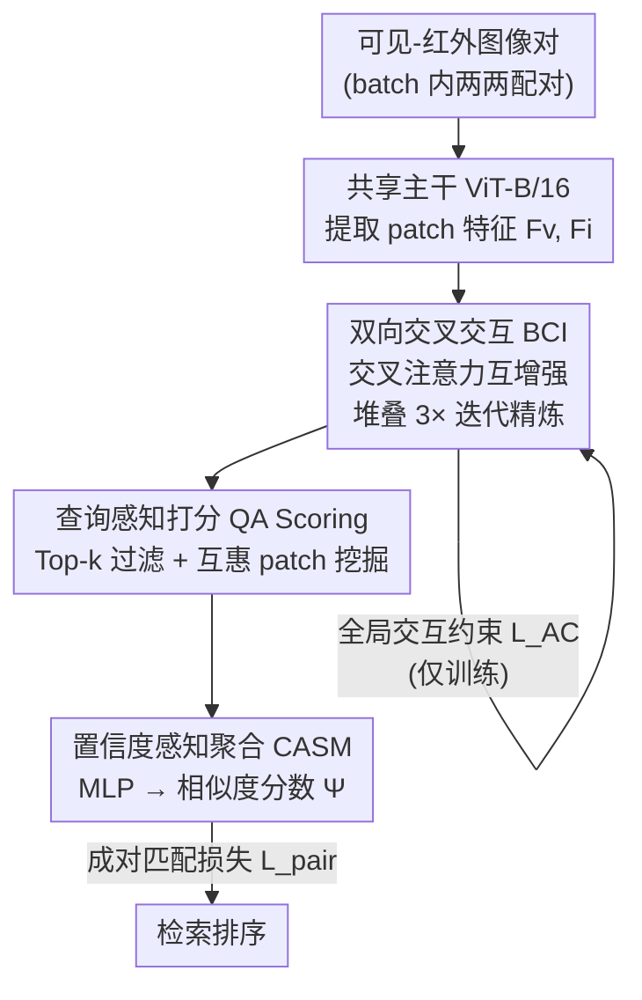

# BIT: Matching-based Bi-directional Interaction Transformation Network for Visible-Infrared Person Re-Identification

**会议**: CVPR 2026  
**论文**: [CVF Open Access](https://openaccess.thecvf.com/content/CVPR2026/html/Xu_BIT_Matching-based_Bi-directional_Interaction_Transformation_Network_for_Visible-Infrared_Person_Re-Identification_CVPR_2026_paper.html)  
**代码**: https://github.com/Xuan266/BIT  
**领域**: 行人重识别 / 跨模态检索  
**关键词**: 可见光-红外重识别, 跨模态匹配, 双向交互, 互惠patch挖掘, 查询感知打分

## 一句话总结
针对可见光-红外行人重识别（VI-ReID）中模态鸿沟大、红外样本稀少的问题，BIT 抛弃"把两模态特征对齐到共享空间"的老套路，改用**成对匹配（matching-based）**范式：先用双向交叉交互模块让一对可见-红外图像互相吸收互补信息，再用查询感知打分模块在 patch 级别挖掘可靠的互惠对应关系算出最终相似度，在 SYSU-MM01 / LLCM / RegDB 三个基准上刷到 SOTA。

## 研究背景与动机
**领域现状**：VI-ReID 要在可见光和红外两种光谱下检索同一行人，主流做法分两类——图像级方法用生成模型做风格迁移把一种模态"翻译"成另一种；特征级方法在共享嵌入空间里学习模态不变（modality-invariant）表征，把可见光特征和红外特征拉到一起对齐。

**现有痛点**：这两类方法都依赖**固定映射 + 静态对齐**。红外强度反映的是可见光谱之外的电磁辐射，受材质、温度分布等因素影响——可见光下外观相似的衣服在红外下可能差异巨大，可见光下颜色迥异的物体在红外下反而几乎一样（论文 Fig.1a）。这种复杂且隐式的跨模态关联，让"一个全局固定映射"很容易过拟合：当两个不同身份的人在红外模态下长得很像时，固定映射会把它俩都投影到同一个可见光特征附近，把视觉相似的负样本也拉近，造成误识别。

**核心矛盾**：更要命的是 VI-ReID 数据集严重不平衡——红外样本远少于可见光样本（Fig.1c）。特征级方法依赖稠密、均衡的数据才能学出鲁棒的模态不变嵌入，数据一失衡学习能力就大打折扣。

**本文目标**：找一种**不依赖全局对齐、对数据不平衡天然鲁棒**的范式，直接捕捉每一对图像的细粒度对应关系。

**切入角度**：作者观察到，成对匹配（pairwise matching）范式关注的是**关系建模**而非全局表征学习——它学的是"每一对可见-红外样本特有的自适应变换模式"，而不是一个对所有样本一刀切的固定映射。关系建模对训练数据的稀疏/失衡天然更鲁棒。

**核心 idea**：用**自适应的成对匹配**代替**刚性的特征对齐**来解决 VI-ReID。BIT 据作者所述是首个把这种 pairwise matching-driven interaction 引入 VI-ReID 的工作。

## 方法详解

### 整体框架
BIT 是一个 encoder-decoder 架构。**编码器**是一个共享主干（ViT-B/16）做初步特征提取；**解码器**由两个核心模块组成——BCI（Bi-directional Cross Interaction，双向交叉交互）负责让一对可见-红外特征在多阶段中互相交换互补信息，QA Scoring（Query Aware Scoring，查询感知打分）负责在 patch 级别挖掘可靠对应、算出这一对图像最终的相似度标量 $\Psi \in [0,1]$。

整条流水线是这样转的：先在一个 batch 内把每张可见光图和每张红外图两两配对（batch 内构造全部 $B^2$ 个 pair），每个 pair 经主干得到 patch 特征；BCI 用交叉注意力让这一对特征双向互相增强、堆叠 $T=3$ 个 block 迭代精炼；得到精炼后的 $F'_v, F'_i$ 后送入 QA Scoring，先算双向 patch 相似度矩阵、Top-k 过滤、互惠 patch 挖掘出可靠对应、再用一个轻量 MLP（CASM）把 patch 级相似度聚合成最终匹配分数。训练用两阶段：先单独练主干，再冻结主干只练 BIT。

### 关键设计

**1. 双向交叉交互 BCI：让一对特征互相"补课"而非各自对齐**

这一块直接针对"固定映射把不同身份的相似负样本拉到一起"的痛点。BCI 不在共享空间里强行对齐，而是让可见光和红外特征**双向**交换互补信息。先做 batch 内配对：给定可见光 patch 特征 $F_v \in \mathbb{R}^{B\times N\times C}$ 和红外 $F_i$，把可见光沿 batch 维重复 $B$ 次、红外整体重复 $B$ 次，得到 $F_v^{(0)}, F_i^{(0)} \in \mathbb{R}^{B^2\times N\times C}$，使每张可见光图都和 batch 里每张红外图配上对。

交互的核心是双向交叉注意力：一个模态当 query、另一个当 key-value，互为补充：

$$\tilde{F}_v^{(0)} = \mathrm{CrossAtt}(F_v^{(0)}, F_i^{(0)}), \quad \tilde{F}_i^{(0)} = \mathrm{CrossAtt}(F_i^{(0)}, F_v^{(0)})$$

然后用 Transformer 风格的 BCI Block 迭代精炼：两条独立但相互作用的流（可见流、红外流），每条流是残差结构、交替做交叉注意力和前馈。可见流第 $t$ 阶段更新为 $\hat{F}_v^{(t)} = F_v^{(t)} + \mathrm{CrossAtt}(\mathrm{LN}(F_v^{(t)}), \mathrm{LN}(F_i^{(t)}))$，再过 $F_v^{(t+1)} = \hat{F}_v^{(t)} + \mathrm{MLP}(\mathrm{LN}(\hat{F}_v^{(t)}))$，红外流对称。堆叠 $T=3$ 个 block 渐进精炼，每阶段两模态都吸收对方语义线索、同时保留各自域先验。关键差异在于"双向"：消融里单纯加标准交叉注意力反而比 baseline 还差，而双向设计带来显著增益——因为双向能产生对齐更好的中间特征供后续匹配用。

**2. 全局交互约束 $L_{AC}$：用聚合对比损失保证交互是身份一致的**

光让特征互相交互还不够，得保证交互后的聚合表征在身份层面是对的。作者引入一个聚合对比损失（Aggregation Contrastive Loss）作为正则项，作用在最后一个 BCI block 输出池化得到的表征 $f_i$ 上：

$$L_{AC} = -\frac{1}{|P_i|}\sum_{p\in P_i}\log\frac{e^{f_i\cdot f_p/\tau}}{e^{f_i\cdot f_p/\tau} + \sum_{j\in N_i}e^{f_i\cdot f_j/\tau}}$$

其中 $P_i$ / $N_i$ 是与样本 $i$ 同身份 / 不同身份的样本集合，温度 $\tau$ 固定为 $1/16$。它把跨模态正对拉近、把难负样本推开，鼓励 BCI 的跨模态聚合朝着身份判别的方向走，而不是被表面视觉线索或背景噪声带偏。

**3. 查询感知打分 QA Scoring：在 patch 级别挖互惠对应，不再一视同仁**

传统相似度计算的毛病是"所有 patch 同等对待"，但不同 query 因姿态、遮挡、背景杂乱而依赖不同的视觉线索。QA Scoring 让相似度估计变得 query-specific。它分几步走（对应论文 Algorithm 1）：

先算双向 patch 相似度矩阵，softmax 沿行归一化：$S_{vi} = s\!\left(\frac{F'_v F_i'^{\top}}{\sqrt{C}}\right)$，$S_{iv} = s\!\left(\frac{F'_i F_v'^{\top}}{\sqrt{C}}\right)$。注意虽然原始点积上 $S_{iv}$ 是 $S_{vi}$ 的转置，但行归一化让二者方向上不等价。然后 **Top-k 过滤**（$k=3$）：$R_{v-i}=\mathrm{TopK}(S_{vi}, k)$ 为每个可见 patch 保留 top-k 个红外邻居，反之亦然——因为固定切分下一个 patch 的语义可能对应另一模态的多个 patch。

接着是**互惠 patch 挖掘（RPM）**，这是该模块的灵魂：红外缺色彩信息让单边匹配容易引噪，于是只保留**互相选中**的 patch 对构成互惠集 $M = \{(p,q)\mid q\in R_{v-i}[p] \text{ 且 } p\in R_{i-v}[q]\}$。但严格互惠会让某些可见 patch 一个对都配不上、被排除在打分外，所以再做平滑补全：对没有互惠匹配的 patch $p$（$M_p=\emptyset$），强行补上它单边相似度最高的红外 patch $q^*=\arg\max S_{vi}[p]$，得到鲁棒版 $M'$。最后算每个可见 patch 的相似度分量：$\hat{S}[p] = \frac{1}{|M'_p|}\sum_{q\in M'_p} w_{p,q}\cdot S_{vi}[p,q]$，其中权重 $w_{p,q}=1$（互惠对）或 $\alpha=0.2$（补全对），用惩罚系数 $\alpha$ 压低补全引入的非互惠匹配的贡献。

**4. 置信度感知聚合 CASM：把 patch 分数向量学成一个标量分数**

得到 patch 级相似度向量 $\hat{S}\in\mathbb{R}^N$ 后，要把它压成一个图像级标量。作者不用简单求和/求平均，而是设计了 CASM（Confidence-Aware Scoring Module）——一个轻量 MLP，自适应地按 patch 的信息量加权：$\Psi = \sigma(\mathrm{CASM}(\hat{S}))$，$\sigma$ 是 Sigmoid。动机很具体：不是所有互惠匹配都同等重要，有些对应的是显著身体部位或独特配饰，有些则是噪声；学一个软聚合方案能让模型优先用信息量大的匹配、压制误导性匹配。

### 损失函数 / 训练策略
两阶段训练。**第一阶段**单独练主干，用标准模态不变损失 $L_{base}$（身份分类损失 + triplet 损失），先学出可见/红外两模态判别性强的特征嵌入，避免过早被模态特定交互带偏过拟合；此阶段 BIT 不参与。**第二阶段**冻结主干、只优化 BIT，用 QA Scoring 给出的标量分数 $\Psi$ 配真值标签 $y\in\{0,1\}$（是否同身份）算成对匹配损失 $L_{pair} = -(y\log\Psi + (1-y)\log(1-\Psi))$，总目标 $L_{total} = L_{pair} + \lambda L_{AC}$，平衡权重 $\lambda=0.6$（网格搜索得到）。

## 实验关键数据

### 主实验
SYSU-MM01（All-Search / Indoor-Search，Single/Multi-Shot），BIT 全面超越 SOTA。下表摘 All-Search Single-Shot（不用 re-ranking）与跨数据集结果：

| 数据集/设置 | 指标 | BIT | 之前最好 | 提升 |
|------|------|------|----------|------|
| SYSU All-Search Single | Rank-1 | 80.53 | 79.07 (DiVE) | +1.46 |
| SYSU All-Search Single | mAP | 79.76 | 75.40 (WRIM-Net) | +4.36 |
| SYSU Indoor Single | Rank-1 | 87.42 | 86.20 (WRIM-Net) | +1.22 |
| LLCM Visible→Infrared | Rank-1 | 73.1 | 64.9 (HOS-Net) | +8.2 |
| LLCM Infrared→Visible | Rank-1 | 66.7 | 56.4 (HOS-Net) | +10.3 |
| RegDB V2I | Rank-1 | 96.12 | 95.19 (MUN) | +0.93 |

在 LLCM 上提升最猛（V2I/I2V 的 Rank-1 各涨 8.2 / 10.3 个点），说明匹配范式在更具挑战的场景优势明显。配合 re-ranking 后 SYSU All-Search Single 进一步到 Rank-1 84.42 / mAP 83.64。

### 消融实验
SYSU-MM01 All-Search Single-Shot，以复现的 PMT 为 baseline：

| 配置 | Rank-1 | mAP | 说明 |
|------|--------|-----|------|
| Base | 69.23 | 66.02 | 仅主干 baseline |
| + BCI | 75.24 | 73.35 | 早期跨模态交互，+6.01 / +7.33 |
| + BCI + $L_{AC}$ | 76.42 | 74.54 | 聚合对比损失，再 +1.18 / +1.19 |
| + BCI + QA Scoring | 79.53 | 79.02 | QA 打分，相对仅 BCI +4.11 / +5.22(mAP) |
| Full（全开） | 80.53 | 79.76 | 完整模型 |

双向设计的专项消融（Table 5）尤其说明问题：在 baseline 上加**标准**交叉注意力（如 ALBEF 那种）反而掉点（Rank-1 69.23→68.68），而换成 BCI 的双向设计直接涨到 75.24——证明增益来自"双向互补"而非简单堆注意力。

### 关键发现
- **贡献最大的两个模块是 BCI 和 QA Scoring**：BCI 单独 +6.01 Rank-1，QA Scoring 在 BCI 之上再 +4.11 Rank-1 / +5.22 mAP；$L_{AC}$ 是锦上添花的正则。
- **双向是关键不是注意力本身**：标准交叉注意力会让性能比 baseline 还差，反向印证 BCI 的"互相补课"设计才是有效成分。
- **超参不敏感且有最优点**：Top-k 在 $k=3$、惩罚系数 $\alpha=0.2$、权重 $\lambda=0.6$ 时最佳（Fig.3），曲线整体平缓说明对超参鲁棒。

## 亮点与洞察
- **范式切换最值得借鉴**：把 VI-ReID 从"学全局模态不变映射"重构成"学每对样本的自适应匹配"，绕开了固定映射在数据失衡下过拟合的死结——这个"关系建模 > 表征学习"的思路可迁移到任何模态不平衡的跨模态检索。
- **互惠 patch 挖掘 + 平滑补全这套组合很巧**：先用双向 Top-k 互选保证可靠性、再对落单 patch 用惩罚权重 $\alpha$ 软补全保证覆盖率，在"只信互惠"和"全用上"之间找了个可调的折中。
- **CASM 把"该信哪些 patch"交给一个小 MLP 学**：相比手工平均，让模型自己学软聚合权重，是把先验"不是所有匹配同等重要"参数化的干净做法。

## 局限与展望
- **两阶段训练 + 冻结主干**：第二阶段冻结主干、只练匹配头，简化了优化但也意味着主干本身没法从匹配信号里再受益，端到端联合训练是否更好论文没探讨。
- **batch 内 $B^2$ 配对的开销**：BCI 在 batch 内构造全部 $B^2$ 个 pair 做交叉注意力，patch 数 $N$ 一大、batch 一大，交叉注意力的二次复杂度可能成为瓶颈，论文未给出训练/推理耗时与显存的量化对比。⚠️ 数据不平衡鲁棒性的实验细节放在补充材料，正文只给了结论，无法核对具体数字。
- **patch 用固定切分**：QA Scoring 明确承认固定切分会让一个 patch 语义对应另一模态多个 patch（所以才要 Top-k），若用可变形/语义对齐的 patch 划分或许能进一步减噪。

## 相关工作与启发
- **vs 特征级方法（MID / CAJ / PMT 等）**：它们在共享空间学模态不变表征、用固定映射对齐；BIT 不对齐，直接成对匹配学自适应变换。优势是对数据失衡更鲁棒、不易把相似负样本拉近；代价是要做成对前向、计算结构更重。
- **vs 图像级生成方法**：生成模型做风格迁移补齐配对数据，但引噪且算力贵；BIT 不生成、直接在特征上做交互匹配，避开了生成噪声。
- **vs 单模态匹配式 Re-ID**：它们假设特征同质、用简单映射算最终相似度；BIT 多了 BCI 这一步本质性的特征精炼来弥合模态差异，而非假设两模态特征已经同质。

## 评分
- 新颖性: ⭐⭐⭐⭐⭐ 据作者所述首个把成对匹配范式引入 VI-ReID，双向交互 + 互惠 patch 挖掘是一套自洽的新设计
- 实验充分度: ⭐⭐⭐⭐ 三大基准全面 SOTA、消融拆解到位，但数据失衡鲁棒性和效率分析都塞进了补充材料
- 写作质量: ⭐⭐⭐⭐ 动机（Fig.1 三连）讲得清楚，方法公式完整；个别表述（$S_{iv}$ 与转置的关系）需要细读
- 价值: ⭐⭐⭐⭐ 范式切换思路对模态不平衡的跨模态检索有普适启发，代码已开源

<!-- RELATED:START -->

## 相关论文

- [\[CVPR 2026\] MFEN: Multi-Frequency Expert Network for Visible-Infrared Person Re-ID](mfen_multi-frequency_expert_network_for_visible-infrared_person_re-id.md)
- [\[CVPR 2026\] Spatial-Frequency Collaborative Learning for Occluded Visible-Infrared Person Re-Identification](spatial-frequency_collaborative_learning_for_occluded_visible-infrared_person_re.md)
- [\[CVPR 2026\] Towards Cross-Modal Preservation, Consistency and Alignment for Privacy-Preserving Visible-Infrared Person Re-Identification](towards_cross-modal_preservation_consistency_and_alignment_for_privacy-preservin.md)
- [\[CVPR 2026\] COPE: Consistent Occlusion and Prompt Enhancement Network for Occluded Person Re-identification](cope_consistent_occlusion_and_prompt_enhancement_network_for_occluded_person_re-.md)
- [\[ECCV 2024\] Multi-Memory Matching for Unsupervised Visible-Infrared Person Re-Identification](../../ECCV2024/human_understanding/multi-memory_matching_for_unsupervised_visible-infrared_person_re-identification.md)

<!-- RELATED:END -->
