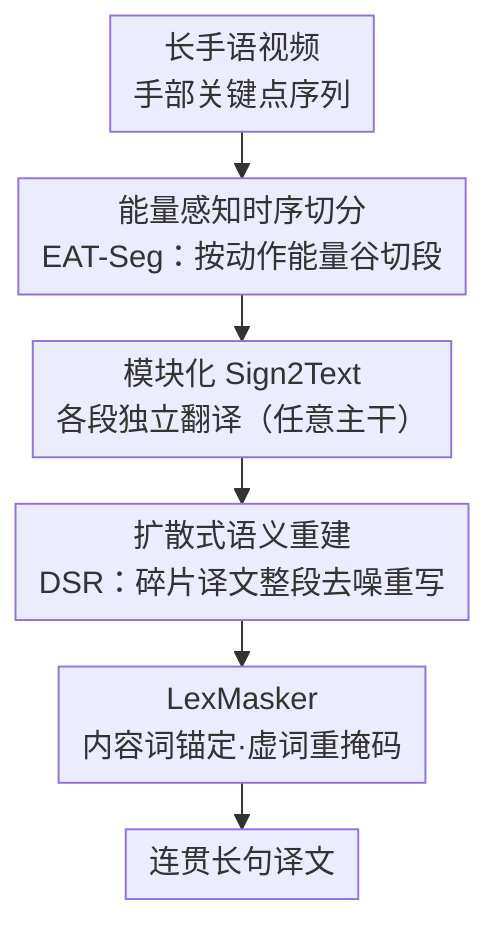

# BoostSLT: Boosting Sign Language Translation via a Plug-and-Play Diffusion-Based Semantic Enhancer

**会议**: CVPR 2026  
**论文**: [CVF Open Access](https://openaccess.thecvf.com/content/CVPR2026/html/Han_BoostSLT_Boosting_Sign_Language_Translation_via_a_Plug-and-Play_Diffusion-Based_Semantic_CVPR_2026_paper.html)  
**代码**: https://github.com/K1sna/BoostSLT  
**领域**: 人体理解 / 手语翻译  
**关键词**: 手语翻译, 扩散语言模型, 无监督时序切分, 即插即用, 长句翻译  

## 一句话总结
BoostSLT 在任意手语翻译模型外面套一层「先按动作能量把长视频切成语义段、各段独立翻译、再用扩散语言模型把碎片译文重建成连贯长句」的即插即用模块，不依赖 gloss 标注就显著提升了长句、篇章级手语翻译的 BLEU 与 ROUGE。

## 研究背景与动机
**领域现状**：手语翻译（Sign Language Translation, SLT）把连续手语视频转成口语文本，主流分两条路线——gloss-based（先识别手语词元 gloss，再 gloss→文本）和 gloss-free（视频直接端到端翻译）。近年 TwoStreamNetwork、CV-SLT 等架构在**短句**上的准确率已接近饱和。

**现有痛点**：一旦输入变成新闻、访谈、日常对话里那种长句或多句段落，性能就明显塌方。作者在 Fig.1 里按译文长度分组（1–10 / 10–15 / 15–20 / 20+ token）画出 BLEU、ROUGE、WER，越长的组退化越严重。痛点有两层：（1）gloss-based 方法要精确对齐视频帧和 gloss 边界，标注代价极高，且改进只惠及 gloss-based 自己、无法泛化到所有模型；（2）几乎所有 SLT 解码器都是**自回归**的，token 逐个生成、后一个强依赖前面所有 token，早期一个识别/对齐错误会沿序列一路传播放大，在长输入上累积成严重的语义漂移、译文支离破碎。

**核心矛盾**：「局部段准」和「全局连贯」之间存在 trade-off——逐段翻译能保证每个短片段的局部保真，但把多段短译文直接拼起来往往跨段指代/时态错乱、篇章不通顺；而想要全局连贯又绕不开自回归的误差累积。

**本文目标**：在**不引入 gloss 监督、不改动现有翻译模型**的前提下，把局部准确度和全局连贯度同时拿到手，尤其救活长句/篇章级翻译。

**切入角度**：作者借两个观察破局——一是从运动控制理论（Bernstein 的协同结构）出发，假设连续手语也由「能量有界的运动基元」拼成，动作能量的波动天然标出语义切换点，于是边界可以**无监督**地从能量曲线里读出来；二是看到扩散语言模型（D3PM、LLaDA）能对整段序列做并行去噪、整体优化全局语义，正好克制自回归的逐步误差累积。

**核心 idea**：用「能量驱动的无监督切分 + 扩散式整段语义重建」替代「gloss 监督 + 自回归后处理」，做成一个模型无关、即插即用的增强外壳。

## 方法详解

### 整体框架
BoostSLT 是套在任意 SLT 主干外面的三段式 pipeline：输入是长手语视频（RGB / 关键点序列），输出是连贯流畅的长句译文。中间分三步——先用**能量感知时序切分（EAT-Seg）**把长视频按手部动作能量切成若干语义连贯的短段；每段送进一个可替换的**模块化 Sign2Text 主干**（任意 gloss-free 翻译模型）独立翻成短文本；最后把这些碎片短译文交给**扩散式语义重建（DSR）**模块，用扩散语言模型并行去噪、缝合重写成一段通顺长文。其中 Sign2Text 是通用脚手架节点（直接复用 MMTLB / TSN / CV-SLT 等现成模型，不重训），真正的贡献集中在首尾两个模块；DSR 内部还嵌了一个 **LexMasker** 来约束去噪方向。

### 关键设计

**1. 能量感知时序切分（EAT-Seg）：用动作能量谷无监督地切出语义段**

针对「gloss 边界标注贵、且不通用」的痛点，EAT-Seg 完全不看 gloss，而是从手部关键点的运动能量里读边界。手语的语义主要由双手承载，所以只在手部关节集合 $\mathcal{H}$ 上算逐帧动能。给定姿态序列 $P=\{p_t\}_{t=1}^T$（每帧含 $J$ 个关键点的 2D 坐标和置信度），逐帧动能定义为

$$E_t = \sum_{j\in\mathcal{H}} \big(\mathbf{1}[c_{t,j}\!\ge\!\theta]\,\mathbf{1}[c_{t-1,j}\!\ge\!\theta]\,c_{t,j}c_{t-1,j}\big)\cdot \|\mathbf{x}_{t,j}-\mathbf{x}_{t-1,j}\|_2,$$

即「相邻帧关节位移」按置信度加权——只有当前后两帧该关节都可靠（置信度超阈值 $\theta$）才计入，遮挡/抖动的关节自动降权，切分线索更稳。再用窗口为 $k$ 的滑动平均把曲线平滑成 $\tilde{E}_t$（式 2）抑制瞬时噪声。

关键在于切分策略不是「固定阈值找能量峰」——那样快速手势会被过切、慢手势会被欠切。EAT-Seg 改用**长度感知的局部自适应**：先由偏好长度区间 $[L_{\min},L_{\max}]$ 和目标长度 $L^\star$ 算出该视频应切几段 $n$，使 $F/n$ 落在区间内；每段给一个期望中心 $c_k$，在宽度 $\omega_k=\lfloor \text{window\_factor}\cdot L_k\rfloor$ 的局部窗口里找能量最低、又不太偏离中心的切点：

$$b_k=\arg\min_{t\in[c_k-\omega_k,\,c_k+\omega_k]}\big(\tilde{E}_t+\lambda_{\text{cent}}|t-c_k|\big),$$

$\lambda_{\text{cent}}$ 平衡「局部能量极小」与「时间规整性」。配合最小间隔和尾段长度约束防止过/欠切，得到单调的切点序列；相邻段还留一点重叠以保上下文连续。这样切分既贴合手语的内在节奏，又对不同 signer、语速稳健，是个轻量但有效的预处理。

**2. 扩散式语义重建（DSR）：从碎片译文而非高斯噪声起步去噪，把碎片缝成连贯长句**

针对「逐段译文拼起来跨段错乱」和「自回归后处理仍会误差累积」的痛点，DSR 把缝合改成**整段并行去噪**。它的关键不同点是：传统文本扩散从纯随机噪声起步，而 DSR 是在扩散模型上微调、让它从**有意义的初始短语**起步去噪——把各段短译文 $\{\hat{T}_m\}_{m=1}^M$ 当作底层长句的「部分观测信号」，建成条件去噪扩散过程：

$$x_0=\mathrm{Encode}(\{\hat{T}_m\}),\quad x_t\sim q(x_t|x_{t-1}),\quad \tilde{Y}=\mathrm{Decode}(x_T).$$

也就是 $x_0$ 不是噪声而是「结构化的语言先验」，模型实质是个**语义扩散器**：沿去噪轨迹把碎片渐进重建成连贯长句，恢复篇章级流畅度的同时不覆盖原有内容。训练时用 EAT-Seg 切出的「短语集合 → 长句」伪配对，往短语集合注入噪声扰动模拟不完美翻译，让模型学会把被破坏的碎片逆向还原成原长句。推理时跑 $T=25$ 步迭代去噪：编码碎片成 $x_0$ → 逐步预测残差噪声 $\epsilon_\theta(x_t,t,c)$ 并更新 → 解码出 $\tilde{Y}$。因为每一步都对整段序列联合精修，它是**全局**而非逐 token 地强制连贯，从机制上压住了自回归的累积误差。整个 DSR 只在推理期工作、text-in/text-out，所以完全模块化、能接在任何上游切分/翻译系统后面。

**3. LexMasker：把掩码不确定性导向虚词，去噪时锚住内容词不破坏语义**

DSR 去噪有个风险：不加约束地反复 remask，可能把已经翻对的关键信息词也改坏。LexMasker 是 DSR 去噪过程里的**约束引导**机制，做有方向、有词性意识的重掩码。每步产出中间假设后，用一个轻量词法分类器把高信息**内容词**（名词、动词、数词、命名实体）和低信息**虚词**（功能词）分开：内容词作为语义锚点保留（已在段级预测中稳定，但仍可被后续去噪微调），只对虚词和新产生的空位做选择性重掩码。这样它把「掩码带来的不确定性」重新分配到语法黏合剂上、而不是承载意义的 token 上，引导模型修的是篇章结构而非内容。除了 remask 方向，命名实体保留、片段全覆盖、单调时间序等额外约束也并进同一引导机制，保证去噪轨迹始终全局一致——这也是 DSR 能「改通顺却不改事实」的关键。

### 损失函数 / 训练策略
扩散重建模块基于 **LLaDA-8B** 微调（仅在推理期作为轻量插件解码器，不重训翻译主干）。用三套数据集（PHOENIX-2014T、CSL-Daily、Auslan-Daily）由 EAT-Seg 切出的「短语 → 长句」伪配对训练，AdamW、学习率 $2\times10^{-5}$、batch size 32、weight decay 0.01，训 30 epoch，按验证集 BLEU-4 早停；推理 $T=25$ 步。视频帧（25 fps）用预训练 I3D 编码，姿态用在 COCO-WholeBody 上训练的 HRNet 提取。

## 实验关键数据

### 主实验
在 PHOENIX-2014T（德语手语）、CSL-Daily（中文手语）、Auslan-Daily（澳大利亚手语）三个数据集、六种 gloss-free 主干（MMTLB、GASLT、TSN、CV-SLT、Sign2GPT、LiTFiC）上，给每个主干都接上 BoostSLT 插件对比。下表摘 PHOENIX-2014T 与 CSL-Daily 的 Test 结果（R=ROUGE-L，B4=BLEU-4）：

| 数据集 | 主干 | R（原始→BoostSLT） | B4（原始→BoostSLT） |
|--------|------|--------------------|---------------------|
| PHOENIX-2014T Test | CV-SLT | 54.33 → **59.15** | 29.27 → **33.32**（+14%↑） |
| PHOENIX-2014T Test | TSN | 53.48 → **57.94** | 28.95 → **30.12** |
| PHOENIX-2014T Test | MMTLB | 49.59 → **54.38** | 24.60 → **29.41** |
| PHOENIX-2014T Test | 全主干均值 | 48.62 → **53.37** | 23.51 → **26.60** |
| CSL-Daily Test | CV-SLT | 57.06 → **61.79** | 28.94 → **32.49** |
| CSL-Daily Test | 全主干均值 | 45.03 → **50.39** | 18.83 → **22.12** |

平均提升约 +3.8 BLEU-4 / +3.2 ROUGE（PHOENIX）、+4.1 BLEU-4（CSL-Daily）、+3.5 BLEU-4（Auslan-Daily）。在长且句法复杂的 PHOENIX 上增益最大，CV-SLT 的 BLEU-4 相对提升超 14%，印证扩散重建确实压住了长输入的自回归误差累积。Auslan-Daily 的极端低基线场景增益尤为夸张——News 子集 CV-SLT 的 BLEU-4 从 3.26 抬到 7.24，MMTLB 的 ROUGE 从 18.90 抬到 32.39，说明在嘈杂真实场景里碎片缝合的价值更突出。

### 消融实验
在 PHOENIX-2014T 上拆解各模块（EAT-Seg vs 随机切分 R-Seg；DSR vs 自回归后处理 GPT / 微调 LLaMA）：

| 切分 | 后处理 | R | B4 | 说明 |
|------|--------|------|------|------|
| R-Seg | 无 | 35.25 | 8.03 | 随机切+直接拼，最差 |
| 无切分 | 无 | 39.63 | 15.62 | 不切、直接拼（下界基线） |
| 无切分 | GPT | 41.72 | 14.71 | GPT 润色，B4 反降 |
| 无切分 | F-LLaMA | 42.39 | 15.36 | 微调 LLaMA 后处理 |
| EAT-Seg | GPT | 43.64 | 17.44 | 好切分+自回归后处理 |
| R-Seg | DSR | 42.67 | 16.30 | 扩散救不回乱切分 |
| **EAT-Seg** | **DSR** | **46.72** | **21.95** | 完整模型，全面最优 |

### 关键发现
- **切分和扩散是互补的，缺一不可**：EAT-Seg+DSR（B4 21.95）远超 EAT-Seg+GPT（17.44）和 R-Seg+DSR（16.30）。好切分把输入结构化、扩散解决段间断裂，两者叠加才打满。
- **自回归后处理治标不治本**：GPT/F-LLaMA 能改局部流畅度，但 GPT 单独用时 B4 甚至比不处理还低（14.71 vs 15.62），说明它会改坏内容；DSR 才能真正修长程结构错误、补回跨段丢失的内容。
- **扩散增益与 LLM 推理互补而非重复**：连 Sign2GPT、LiTFiC 这类已带 LLM 的模型都还能再涨最多 +4.8 BLEU-4，说明并行去噪式重建提供的是 LLM 自回归推理拿不到的全局一致性。
- **越长越受益**：Fig.1 显示增益集中在长度 20+ token 的长句组，正对应「自回归在长输入上误差累积最重」的痛点。

## 亮点与洞察
- **用「运动能量谷」当无监督边界检测器**：把动作切分类比成运动基元的能量边界，置信度加权 + 长度感知局部搜索，绕开了 gloss/帧级标注，跨 signer/方言/语种都能用——这套「物理先验代替标注」的思路可迁到任意连续动作序列的分段。
- **「从碎片而非噪声起步」的条件扩散**：把段级译文当部分观测信号、初始化扩散轨迹，等于给扩散一个强语言先验，既减幻觉又不覆盖内容——这是 SLT 里首次把扩散语言建模用作后编辑器。
- **LexMasker 的「把不确定性分配给虚词」很巧**：去噪只动语法黏合剂、锚住内容词，从机制上保证「改通顺不改事实」，比无差别 remask 安全得多。
- **真·即插即用**：DSR 只在推理期跑、text-in/text-out，切分/翻译/重建三段解耦，能套在任意 gloss-based 或 gloss-free 主干上，工程落地友好。

## 局限与展望
- **作者承认**：DSR 用 8B 的 LLaDA 带来中等推理开销（Fig.3，仅后编辑期、不重训）；DSR 依赖 EAT-Seg 生成的伪短语-长句配对，配对更准/更强的数据增广能进一步提升鲁棒性；三段模块化设计未来可走向切分-翻译-重建联合优化的紧耦合框架。
- **自己发现**：⚠️ 表格中 ROUGE 偶有越界值（如 BoostSLT[GASLT] PHOENIX 的 B1=37.12 反低于 R=47.98、且低于其 B2=33.45），疑似排版错位，**以原文为准**。Auslan-Daily 上基线本身极低（B4 个位数），此时的相对增益虽大但绝对质量仍有限，横向比较需谨慎。8B 扩散模型的开销对实时部署仍是门槛，论文只说「可接受」未给具体延迟数字。
- **改进思路**：让切分边界质量与下游翻译端到端可微对齐；探索更小的扩散重建器换取更低延迟；把 LexMasker 的词性分类器换成任务自适应的可学习掩码策略。

## 相关工作与启发
- **vs gloss-based 方法（如 TwoStreamNetwork 的 gloss 分支）**：他们靠 gloss 中间表示拿到强语言对齐但标注昂贵、不可泛化；BoostSLT 用无监督能量切分替代 gloss 边界，既能去掉 gloss-based pipeline 对标注的依赖，又能直接增强 gloss-free 模型，缩小两条路线的差距。
- **vs 自回归后编辑器（GPT / 微调 LLaMA）**：他们逐 token 润色、小错会累积成全局不连贯；DSR 整段并行去噪、全局而非增量地强制连贯，消融里 B4 高出 4–5 个点，且不会像 GPT 那样改坏内容。
- **vs 时序动作分割 / 弱监督 CSLR（MS-TCN、Pu et al.）**：他们依赖帧级或有序序列标注、学到数据集特定的时序先验、难泛化到新 signer；EAT-Seg 在长句级做无监督能量切分，不需任何标注、跨数据集稳健。
- **vs 文本扩散（D3PM、LLaDA）**：BoostSLT 把它们「从噪声去噪」改成「从碎片译文去噪」，并加 LexMasker 约束，专门服务 SLT 的篇章重建场景。

## 评分
- 新颖性: ⭐⭐⭐⭐⭐ 首次把扩散语言建模引入 SLT 做后编辑，配能量谷无监督切分，两个 idea 都不落俗套
- 实验充分度: ⭐⭐⭐⭐ 三语种、六主干、完整消融与效率分析覆盖到位，但部分表格数值疑似排版错位、缺延迟绝对值
- 写作质量: ⭐⭐⭐⭐ 动机—机制—实验链条清晰，运动控制理论引入有说服力
- 价值: ⭐⭐⭐⭐⭐ 即插即用、模型/语种无关、去 gloss 依赖，对长句 SLT 落地价值高

<!-- RELATED:START -->

## 相关论文

- [\[CVPR 2026\] Learning Effective Sign Features without Text for Gloss-free Sign Language Translation](learning_effective_sign_features_without_text_for_gloss-free_sign_language_trans.md)
- [\[CVPR 2026\] Focal–General Diffusion Model with Semantic Consistent Guidance for Sign Language Production](focal-general_diffusion_model_with_semantic_consistent_guidance_for_sign_languag.md)
- [\[CVPR 2026\] SignPR: A Progressive Vector-Quantized Diffusion Framework for Sign Language Production](signpr_a_progressive_vector-quantized_diffusion_framework_for_sign_language_prod.md)
- [\[CVPR 2025\] Lost in Translation, Found in Context: Sign Language Translation with Contextual Cues](../../CVPR2025/human_understanding/lost_in_translation_found_in_context_sign_language_translation_with_contextual_c.md)
- [\[CVPR 2026\] Sign Language Recognition in the Age of LLMs](sign_language_recognition_llms.md)

<!-- RELATED:END -->
