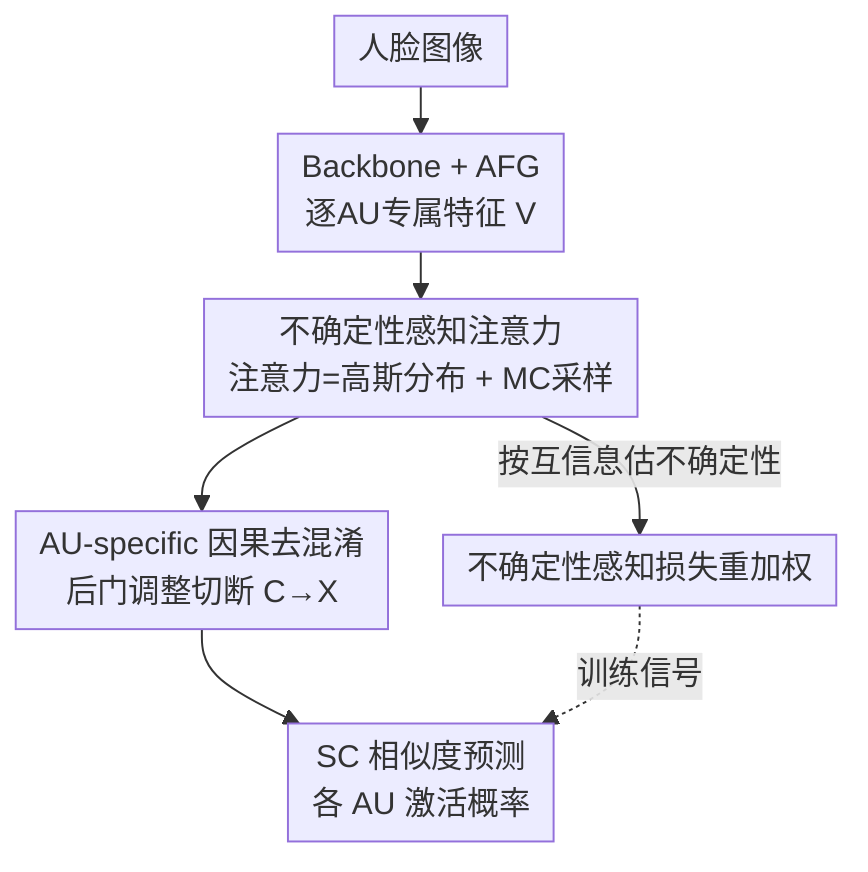

# Breaking Spurious Correlations: Uncertainty-Driven Causal Transformers for AU Detection

**会议**: CVPR 2026  
**论文**: [CVF Open Access](https://openaccess.thecvf.com/content/CVPR2026/html/Wang_Breaking_Spurious_Correlations_Uncertainty-Driven_Causal_Transformers_for_AU_Detection_CVPR_2026_paper.html)  
**代码**: 未公开  
**领域**: 人体理解 / 面部动作单元检测  
**关键词**: AU检测, 不确定性建模, 因果干预, 概率注意力, 后门调整  

## 一句话总结
针对面部动作单元（AU）检测中数据少、类别不均衡、标签噪声和混杂偏差的问题，本文提出 UDCT 框架：把 Transformer 注意力权重建模成高斯分布以显式表达不确定性，用不确定性给样本损失重加权来抗噪声/不均衡，再用 per-AU 的因果后门调整切断混杂因子造成的虚假 AU 关联，在 BP4D / DISFA 上取得有竞争力且更鲁棒的结果（DISFA 平均 F1 67.36%）。

## 研究背景与动机
**领域现状**：AU 检测要识别 FACS 定义的细微面部肌肉动作，是情感计算、心理分析、人机交互的基础。近年主流做法是用 Transformer 建模 AU 之间的长程依赖和共现关系（如 FAUDT、Jacob et al.），相比早期只看局部纹理的 CNN 能更好地捕捉 AU 间的结构化关系。

**现有痛点**：AU 数据集标注极其昂贵稀少，类别严重不均衡（有些 AU 几乎不出现），还混入光照、遮挡、错标等噪声。现有 Transformer 用的是**确定性注意力**——对同一输入，注意力权重是唯一固定的，无法表达"这个样本到底有多模糊/可信"，因而极易在小数据上过拟合，并把训练集的偏差当成规律学进去。

**核心矛盾**：模型学到的 AU 共现关系里混了两类东西——一类是跨被试稳定的真关系（如开心时 AU6+AU12 联动），另一类是**被试个人习惯、光照、社交场景**等混杂因子（confounder）带来的虚假关联。确定性模型分不清这两者，分布一变就崩。换句话说：既缺对"不确定性"的刻画，也缺对"因果 vs 相关"的区分。

**本文目标**：让模型在噪声/不均衡监督下既能显式表达不确定性，又能主动剥离混杂因子引起的虚假相关。拆成三个子问题：(1) 注意力如何表达不确定性；(2) 如何利用不确定性降低噪声样本的影响；(3) 如何在不做不切实际的全被试干预下消除混杂偏差。

**切入角度**：作者的两点观察——其一，面部表情本身是随机的，注意力应当是分布而非点估计；其二，只靠表层相关、不做因果推理的模型决策很脆。于是把**概率注意力**与**因果干预**同时塞进一个 Transformer。

**核心 idea**：用"高斯分布化的注意力 + 不确定性加权损失 + per-AU 后门调整"三件套，把不确定性建模和因果去混淆联合进一个框架，断掉虚假 AU 关联。

## 方法详解

### 整体框架
UDCT 的输入是单张人脸图像，输出是各个 AU 的二分类激活概率。整条管线是串行的四步：先用 backbone（Swin Transformer）抽全局特征图 $F\in\mathbb{R}^{H\times W\times C}$；再用 **AFG（AU-specific Feature Generation）** 模块为每个 AU 生成专属特征向量，得到 AU 特征矩阵 $V\in\mathbb{R}^{N\times C}$；接着送进 **UAT（Uncertainty-Aware Transformer）**，把注意力权重当随机变量来建模 AU 间依赖和不确定性；最后每个 AU 各自经过一个 **因果去混淆（Causal Deconfounding）** 模块，用后门调整压掉混杂因子，再用相似度（SC）方式给出预测。训练侧额外挂一条**不确定性感知损失重加权**，用每个样本估出的不确定性去调它在总损失里的权重。

其中 AFG 是相对通用的脚手架（N 个独立分支，每支 = 一个 FC + GAP，把共享特征图投到第 i 个 AU 的专属特征 $v_i=\mathrm{GAP}(\mathrm{FC}_i(F))$）；真正承载本文创新的是 UAT、因果去混淆、损失重加权三处。

### 关键设计

**1. 不确定性感知注意力（UAT）：把注意力权重从点估计换成高斯分布**

针对"确定性注意力无法刻画模糊/噪声样本、易过拟合"的痛点，UAT 不再让 query-key 之间的注意力分数是一个固定值，而是假设未归一化的注意力分数服从高斯分布 $a_{ij}\sim\mathcal{N}(\mu_{ij},\sigma_{ij}^2)$，其中 $\mu_{ij}$ 表示 query $q_i$ 与 key $k_j$ 的期望交互强度，$\sigma_{ij}^2$ 直接编码这条依赖有多不可信——方差越大越没把握。一个轻量预测器同时输出 $\mu_{ij}$ 和 $\log\sigma_{ij}$（用指数 $\sigma_{ij}=\exp(\log\sigma_{ij})$ 保证正值）。

直接从分布里采样会断梯度，所以用重参数化技巧把随机性挪到外部噪声上：

$$a_{ij}=\mu_{ij}+\sigma_{ij}\odot\epsilon,\quad \epsilon\sim\mathcal{N}(0,1)$$

这样整条链路仍可端到端反传。预测时做 $S$ 次蒙特卡洛采样、对注意力分布求期望来得到 AU 标签的概率：$P(Y_i\mid X,\theta)\approx\frac{1}{S}\sum_{s=1}^{S}f(X,\theta,\alpha_s)$。和把不确定性塞进图结构的 UGN-B 不同，UDCT 把不确定性**直接长在 Transformer 注意力里**，从而能学到更有表达力的 AU 特征与 AU 间依赖。

**2. AU-specific 因果去混淆：用后门调整把预测从 $P(Y|X)$ 改成 $P(Y|do(X))$**

针对"模型把被试个人习惯/光照/场景这些混杂因子当成 AU 共现规律学进去"的痛点，作者建一个结构因果模型（SCM），变量为人脸图像 $X$、样本混杂因子 $C$、AU 激活 $Y$。问题在于存在 $C\to X$ 的后门路径，让 $Y$ 隐式被样本特有属性影响。解法是对 $X$ 施加 do 算子，把目标从条件概率 $P(Y|X)$ 换成干预概率 $P(Y|do(X))$，从而阻断 $C\to X$。

由于对所有被试做显式干预不现实，本文用**后门调整**隐式地把混杂因子的平均因果效应算进来：

$$P(Y_j\mid do(X))=\sum_c P(Y_j\mid X,c)\,P(c)$$

再用 NWGM（归一化加权几何平均）近似把求和挪进期望里 $P(Y_j\mid do(X))\approx P\big(Y_j\mid X,\sum_c c\,P(c)\big)$，并用线性模型实现 $P(Y_j\mid do(X))=W_X^j f_i^j + W_c^j C$。其中混杂量 $C$ 由一组**样本原型** $\{c_1,\dots,c_S\}$ 加权聚合 $C=\sum_s \alpha_s c_s P(c_s)$，权重 $\alpha_s$ 用缩放点积注意力算出。这些原型就是 UAT 输出的 AU 专属特征，每个 epoch 更新一次，**无需额外标注**就能捕捉混杂模式。去混淆后不接线性分类器，而是用相似度（SC）策略：每个 AU 有一个可学习原型 $s_i$，预测取 $f_i$ 与 $s_i$ 的余弦相似度。⚠️ 因果图细节与公式以原文为准。

**3. 不确定性感知损失重加权：让模型少听"不确定"样本的话**

针对"标签噪声/不均衡会污染学习、并诱发虚假相关"的痛点，作者用互信息量化**认知不确定性（epistemic uncertainty）**——它来自数据有限造成的模型不确定，可随数据增多缓解，正对应 AU 标注稀少的处境：

$$I(\alpha,Y\mid X,\theta)=H\Big[\tfrac{1}{S}\sum_{s=1}^{S}P(Y\mid X,\theta,\alpha_s)\Big]-\tfrac{1}{S}\sum_{s=1}^{S}H\big[P(Y\mid X,\theta,\alpha_s)\big]$$

第一项是平均预测分布的熵（总不确定性），第二项是多次随机预测熵的期望（偶然不确定性），两者之差即认知不确定性。互信息越大说明模型对该样本越没把握，往往对应噪声标注或不可靠的 AU 依赖。于是给第 $j$ 个 AU、第 $s$ 个样本一个自适应权重，让高不确定样本的权重变小：

$$w_s^j=1-\frac{\exp\big(I[Y_j,\alpha\mid X_s,\theta]\big)}{\sum_{s'}\exp\big(I[Y_j,\alpha\mid X_{s'},\theta]\big)}$$

总损失为 $L=\sum_s\sum_j w_s^j\cdot L_s^j$。基础损失用加权非对称损失 WA-Loss，自带类别权重 $w'_j$ 来压类别不均衡、强调难正样本。两者正交互补：$w_s^j$ 管"样本级不确定性"，$w'_j$ 管"类别不均衡"，合起来让目标同时对数据可信度和标签分布自适应。

## 实验关键数据

数据集：BP4D（41 被试，评 12 个 AU）、DISFA（27 被试，评 8 个 AU），均用被试无重叠三折交叉验证。Backbone 为 ImageNet 预训练 Swin Transformer，UAT 取 6 层 8 头、维度 512，AdamW + 余弦退火训练 20 epoch，单卡 RTX 4090。指标为逐 AU / 平均 F1 与识别准确率。

### 主实验

DISFA 上 UDCT 取得最佳平均 F1，超过此前的 AC2D / SACL 约 2.0% / 1.9%；BP4D 上平均略低但在代表性 AU（如 AU6 比 AC2D +1.47%）上稳定提升。值得注意的是 BG-AU、FG-Net 这类对手用了额外训练数据，而 UDCT 不借外部数据。

| 数据集 | 指标 | UDCT | 之前最优 | 说明 |
|--------|------|------|----------|------|
| DISFA（8 AU） | 平均 F1 | **67.36** | AC2D 65.4 / SACL 65.5 | DISFA 上取最佳 |
| BP4D（12 AU） | 平均 F1 | 62.59 | SACL 65.6 / AC2D 64.6 | 略低但有竞争力，未用外部数据 |
| DISFA AU1 | F1 | 71.14 | AAR 62.4 | 单 AU 大幅领先 |
| DISFA AU9 | F1 | 61.51 | AC2D 54.4 | 单 AU 明显提升 |

跨域（BP4D→DISFA）泛化：UDCT 平均 F1 44.5，仅次于 FG-Net（54.4）位列第二——而 FG-Net 借了在 FFHQ 大规模人脸上预训练的 StyleGAN2 提供额外泛化力。

| 方法 | AU6 | AU12 | 平均 F1 (BP4D→DISFA) |
|------|------|------|----------------------|
| FG-Net（用外部数据） | 42.2 | 61.5 | **54.4** |
| AUFormer | 31.5 | 43.5 | 43.6 |
| UDCT（本文） | **53.61** | **67.79** | 44.5 |

### 消融实验

在 DISFA 上逐组件叠加（DT = 确定性 Transformer，UAT = 不确定性版，CD = 因果去混淆）：

| 配置 | 平均 F1 | 说明 |
|------|---------|------|
| Backbone + AFG | 55.90 | 仅逐 AU 特征 |
| + DT（确定性 Transformer） | 62.97 | 长程依赖建模带来大提升（+7.07） |
| + UAT（替换 DT） | 64.41 | 概率注意力比确定性再涨 +1.44 |
| + UAT + CD（完整 UDCT） | **67.36** | 加因果去混淆再涨 +2.95 |

### 关键发现
- **因果去混淆贡献最大**（在 UAT 基础上 +2.95），说明剥离样本特有混杂因子比单纯建模不确定性带来的增益更大；UAT 单独相对 DT +1.44，二者叠加相对标准 Transformer 共 +4.39，验证"不确定性 + 因果"互补。
- **跨域更能体现价值**：UDCT 在分布迁移（BP4D→DISFA）下不靠外部数据就逼近用 StyleGAN2 增强的 FG-Net，印证去混淆确实提升了泛化而非只刷同分布点数。
- **可解释性佐证**：Grad-CAM 显示标准 Transformer 注意力散乱、会看到 AU 无关区域，UDCT 的激活更集中在对应肌肉区（如 AU26 下颌、AU9 鼻梁/鼻翼），说明去混淆和不确定性模块确实减少了无关区域干扰。

## 亮点与洞察
- **把不确定性长进注意力本体**：不是在输出端加个方差头，而是直接把注意力分数高斯化 + 重参数化 + MC 期望，使"AU 依赖有多可信"成为可学习量——这种"概率注意力"思路可迁移到任何标注稀缺、关系不固定的多标签任务。
- **样本原型当混杂字典**：用 UAT 输出的 AU 特征做样本原型、每 epoch 更新，免标注地近似后门调整里的混杂分布 $\sum_c cP(c)$，是把因果去混淆落地到无监督混杂估计的实用 trick。
- **两套权重正交分工**：$w_s^j$（样本不确定性）压噪声、$w'_j$（类别权重）压不均衡，互不抢功能——这种"按来源拆解再各自加权"的损失设计很值得借鉴。

## 局限与展望
- 作者自述未来才扩展到动态（视频时序）和跨域设置，当前是**逐帧静态**建模，没利用 AU 的时序连续性。
- **BP4D 上平均 F1 反而落后** SACL/AC2D（62.59 vs 65.6/64.6），说明该框架的优势更多体现在 DISFA 与跨域鲁棒性上，在标注更充分的同分布场景未必占优——"鲁棒性增益"和"同分布精度"之间存在 trade-off。⚠️ 论文未深究 BP4D 掉点原因。
- 因果模块依赖"样本原型能近似真实混杂分布"这一假设，若混杂因子高度非线性或原型数 $S$ 不足，后门调整可能失真；且全文缺对 $S$、MC 采样数 $S$ 等关键超参的敏感性分析。
- 代码未公开，复现需自行实现概率注意力与后门调整细节。

## 相关工作与启发
- **vs Jacob et al. / FAUDT（确定性 Transformer）**：他们用固定注意力建 AU 长程依赖，本文把注意力换成高斯分布显式建模不确定性，区别在于能区分"可信依赖 vs 模糊依赖"，在噪声/不均衡下更稳。
- **vs UGN-B**：同样建不确定性，但 UGN-B 在图结构里建，本文直接在 Transformer 注意力里建，能学到更有表达力的 AU 特征与依赖。
- **vs CISNet / AC2D（因果去混淆）**：CISNet 针对被试身份混杂、AC2D 针对 AU 专属混杂，本文把因果去混淆**和不确定性感知 Transformer 整合**到同一框架，并用样本原型免标注估混杂，得到更鲁棒的 AU 关系。

## 评分
- 新颖性: ⭐⭐⭐⭐ 首次把概率注意力 + 后门调整因果去混淆联合进 Transformer 做 AU 检测，组合有新意但各组件均有前作。
- 实验充分度: ⭐⭐⭐⭐ 两数据集 + 跨域 + 逐组件消融 + Grad-CAM 可视化，但缺超参敏感性、BP4D 掉点未解释。
- 写作质量: ⭐⭐⭐⭐ 动机—方法—实验链条清晰，公式给得完整，因果图细节略简。
- 价值: ⭐⭐⭐⭐ 在标注稀缺、分布迁移场景给出可迁移的"不确定性 + 因果"鲁棒化范式，对低资源情感计算实用。

<!-- RELATED:START -->

## 相关论文

- [\[CVPR 2026\] JUMP-Hand: Learning Joint-wise Uncertainty to Gate Mixture of View Experts for Multi-View 3D Hand Reconstruction](jump-hand_learning_joint-wise_uncertainty_to_gate_mixture_of_view_experts_for_mu.md)
- [\[CVPR 2026\] Multi-level Causal LLM-based Text-to-Motion Generation with Human Alignment (MoTiGA)](multi-level_causal_llm-based_text-to-motion_generation_with_human_alignment.md)
- [\[CVPR 2026\] FisherPoser: Human Motion Estimation from Sparse Observations with Hierarchical Region-Wise Fisher-Matrix Uncertainty Modeling](fisherposer_human_motion_estimation_from_sparse_observations_with_hierarchical_r.md)
- [\[CVPR 2026\] Unleashing Vision-Language Semantics for Deepfake Video Detection](unleashing_vision-language_semantics_for_deepfake_video_detection.md)
- [\[CVPR 2026\] CIGPose: Causal Intervention Graph Neural Network for Whole-Body Pose Estimation](cigpose_causal_intervention_graph_neural_network_for_whole-body_pose_estimation.md)

<!-- RELATED:END -->
