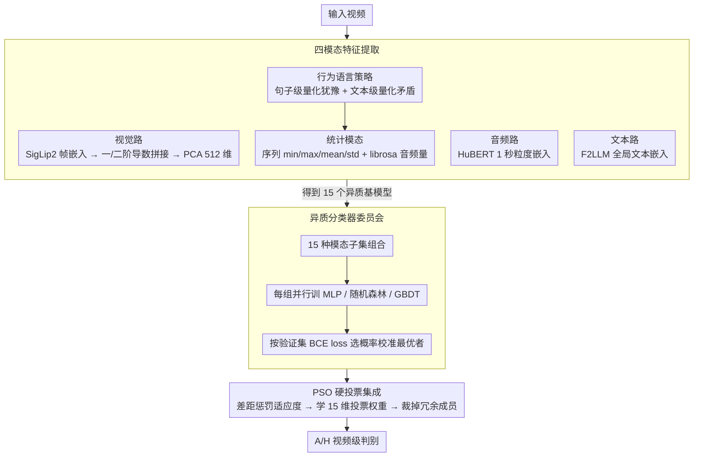

# BROTHER: Behavioral Recognition Optimized Through Heterogeneous Ensemble Regularization for Ambivalence and Hesitancy

**会议**: CVPR 2026  
**arXiv**: [2603.14361](https://arxiv.org/abs/2603.14361)  
**代码**: 未开源  
**领域**: 人体理解  
**关键词**: 矛盾与犹豫识别, 多模态融合, 集成学习, 粒子群优化, 行为分析

## 一句话总结

提出一个高度正则化的多模态融合管线，通过视觉(SigLip2)、音频(HuBERT)、文本(F2LLM)及统计特征四模态的异质分类器委员会，结合带训练-验证差距惩罚的 PSO 硬投票集成，实现自然场景下矛盾与犹豫（A/H）行为的鲁棒视频级识别，在 ABAW10 测试集上取得 Macro F1 = 0.7465。

## 研究背景与动机

**矛盾/犹豫识别的重要性**：矛盾（Ambivalence）和犹豫（Hesitancy）是人们在健康行为改变中的主要心理障碍，自动检测对数字行为干预有重要意义。

**与基础情绪的本质区别**：A/H 不同于"开心""愤怒"等离散情绪，它是一种微妙的内在冲突状态，表现为正负态度间的灰色地带，传统固定类别的情绪识别系统难以准确捕捉。

**多模态线索的必要性**：A/H 在面部表情、语调/语速和用词选择中均有体现，单模态方法难以全面建模这种跨通道的行为矛盾信号。

**自然场景下的挑战**：BAH 数据集来自 ABAW10 竞赛，参与者在非受控日常环境中录制，光照变化、背景噪声等因素增加了检测难度。

**预训练情绪分类器的局限**：将模型输出限制为固定情绪类别会阻碍更复杂、细粒度的多模态特征关系的有机涌现。

**过拟合风险**：训练集规模有限，多模态高维特征空间容易导致模型记忆训练分布而非学习泛化模式，需要强正则化策略。

## 方法详解

### 整体框架

整篇工作要解决的是一个很实际的问题：A/H 这种内在冲突状态散落在表情、语音和措辞里，单一模型既容易抓不全，又容易在小数据上记住训练分布。BROTHER 给出的答案不是端到端大模型，而是一条高度正则化的"委员会"流水线。它先把每段视频拆成视觉、音频、文本、统计四路特征；再把这四路按 $2^4-1=15$ 种子集组合，每个组合各训练 MLP、随机森林、GBDT 三种分类器，并用验证集 BCE loss 挑出最会"校准概率"的那一个，凑成 15 个性格各异的基模型；最后用粒子群优化（PSO）在这 15 票上学一组硬投票权重，把过拟合的、冗余的模型权重压到零。整条管线的立意是：与其追求一个更强的 backbone，不如保留多个模态子集各自的长处，再靠一个会"自我裁员"的集成器把它们安全地拼起来。

### 关键设计

**1. 四模态特征提取：不让预训练情绪分类器框死表达空间**

A/H 不是离散情绪，所以这里刻意绕开"喜怒哀乐"那种固定类别输出，全部停在基础嵌入层，让后续分类器自己从嵌入里发现冲突信号。视觉路是 RetinaFace 检测人脸、SigLip2 提取帧嵌入，再用 MAD（中位数绝对偏差）剔掉噪声帧，把原始、一阶、二阶导数的均值拼成 2304 维后 PCA 压到 512 维——一阶/二阶导数是为了把"表情怎么变"也编码进来。音频路用 HuBERT 以 1 秒为粒度取嵌入，留住语调和节奏这类非语言线索；文本路用 F2LLM 对整段转录文本取全局嵌入，保住完整语言上下文。第四路统计模态则从前三路的时间/句子级序列里聚合 min/max/mean/std，再补一组 librosa 音频量（RMS、频谱质心/带宽、过零率、静音比率、基频均值/方差）——它的作用是把序列里那些会被直接建模丢掉的时间/结构规律重新捞回来。

**2. 行为语言策略：用不同粒度分别量化犹豫和矛盾**

这是统计模态里最有心理学味道的一块，关键洞察是犹豫和矛盾的"作案现场"根本不在同一尺度上。犹豫高度局部化——它藏在某一句话的停顿、含糊里，所以按句子级处理：把每句话分别和填充词、填充音、模糊语、自我纠正这四类词典算余弦相似度，相似度越高说明这句越犹豫。矛盾则是全局性的——它体现在整段话里正负态度的来回拉扯，所以按文本级处理：围绕情感、能力、借口、成功、动机、机会六个主题构造 prompt 嵌入，在"中性/负面/正面/兼具"四个极性上算带温度的 softmax 相似度，用极性分布的纠缠程度刻画态度冲突。一个词典扫局部、一组 prompt 扫全局，正好对上两种行为各自的尺度。

**3. 异质分类器委员会：让每个模态子集挑自己最合手的分类器**

如果对所有 15 种模态组合都套同一个分类器，等于强行假设"最优架构与模态无关"，而实验恰恰说明不是这样——MLP 在低维简单配置上占优，随机森林在高维多模态拼接上抗过拟合更强。于是这里对每个组合都并行训练 MLP、随机森林、GBDT，再以验证集 BCE loss（而非 F1 这类硬分类指标）选出胜者。选 BCE 而非 F1 是有意为之：下游 PSO 要在概率上做加权投票，所以委员会成员的概率校准比硬分类边界更值钱。15 个组合各留一个赢家，就得到 15 个彼此互补的异质基模型。

**4. PSO 硬投票集成：用差距惩罚逼集成器自己裁掉过拟合成员**

有了 15 个基模型，问题变成怎么给它们分配投票权。每个基模型先按各自优化过的阈值给出 0/1 二元票，加权求和过半即判正类——选硬投票而非平均概率，是为了不让概率分布的平均抹掉个别模型的强判断。权重则交给 PSO 在 15 维连续空间里搜，适应度不是单看验证 F1，而是训练/验证 F1 的调和均值再减去一个差距惩罚：

$$\text{Fitness} = \frac{2 \cdot F1_{val} \cdot F1_{train}}{F1_{val} + F1_{train}} - (\lambda \cdot |F1_{train} - F1_{val}|)^2$$

调和均值这一项强制训练和验证必须双高，任一边塌了适应度都上不去；后面的平方差距惩罚则直接对"训练好、验证差"的过拟合开刀，$\lambda$ 越大惩罚越狠。它带来的副作用恰恰是好事——随着 $\lambda$ 增大，PSO 会主动把 9/15 个模型的权重压到零，只留下最可靠的 6 个，等于把"集成正则化"和"模型选择"一步做完，而且文本、Text+Video+Stats 这些组合始终保持最高权重。

### 损失函数与训练策略

每个基分类器自带一套正则化：MLP 用高斯噪声注入 + Batch Normalization + Dropout，随机森林用平衡类权重 + 深度限制 50，GBDT 则把学习率压到极低的 1e-3。模型选择阶段统一以验证集 BCE loss 为准，看的是概率校准而非硬分类边界。集成阶段 PSO 用 50 粒子 × 100 轮，惯性权重 $w=0.9$ 鼓励探索、认知参数 $c_1=1.5$、社会参数 $c_2=2.1$；惩罚系数 $\lambda$ 在 $\{0.0, 0.2, 0.4, 0.6, 0.8\}$ 中逐一搜索，每个取值独立跑一遍实验。

## 实验关键数据

**表1：各模态组合的最优分类器选择（验证集 BCE loss 与 Macro F1）**

| 模态组合 | MLP BCE / F1 | RF BCE / F1 | GBDT BCE / F1 | 胜出 |
|----------|-------------|-------------|---------------|------|
| Text | 0.573 / 0.728 | 0.623 / 0.661 | 0.631 / 0.678 | MLP |
| Audio | 0.675 / 0.632 | 0.695 / 0.599 | 0.692 / 0.597 | MLP |
| Video | 0.747 / 0.523 | 0.696 / 0.464 | 0.696 / 0.470 | GBDT |
| Stats | 0.650 / 0.693 | 0.634 / 0.641 | 0.640 / 0.632 | RF |
| Text+Audio | 0.593 / 0.701 | 0.632 / 0.641 | 0.639 / 0.654 | MLP |
| Text+Video | 0.688 / 0.536 | 0.624 / 0.669 | 0.632 / 0.669 | RF |
| All Modalities | 0.696 / 0.595 | 0.627 / 0.660 | 0.636 / 0.654 | RF |

**关键发现**：文本是最强单模态（F1=0.728），视频最弱（F1=0.470）；MLP 在简单配置胜出，RF 在高维多模态组合中更优（赢得 7/15）。

**表2：PSO 集成在不同惩罚系数 λ 下的性能（Macro F1）**

| 惩罚系数 λ | 训练 F1 | 验证 F1 | **测试 F1** |
|------------|---------|---------|------------|
| 0.0 (无惩罚) | 0.974 | 0.736 | 0.740 |
| **0.2 (20%)** | **0.982** | **0.736** | **0.747** |
| 0.4 (40%) | 0.965 | 0.758 | 0.741 |
| 0.6 (60%) | 0.965 | 0.758 | 0.741 |
| 0.8 (80%) | 0.978 | 0.749 | 0.742 |

**关键发现**：λ=0.2 取得最佳测试 Macro F1（0.7465）和 Weighted F1（0.7559）；适度正则化比无惩罚和过度惩罚都更好。

## 亮点与洞察

1. **统计模态的创新设计**：第四模态不是简单的手工特征，而是针对犹豫（局部句子级）和矛盾（全局文本级）分别设计了不同粒度的行为语言策略，心理学启发性强。
2. **PSO 泛化惩罚的有效性**：差距惩罚项不仅提升了泛化性能，还自动完成了模型选择——高 λ 值下 PSO 将 9/15 模型权重归零，文本和 Text+Video+Stats 始终保持最高权重。
3. **委员会 vs. 端到端**：没有训练复杂的端到端多模态 Transformer，而是通过异质分类器 + 智能集成达到了竞争力水平，方法简洁且可解释性好。

## 局限性

1. **缺少端到端时序建模**：所有特征都经过统计池化压缩为视频级向量，丧失了细粒度的时序动态信息，对长视频中的犹豫-矛盾转换过程建模不足。
2. **视频模态表现差**：单独视觉 F1 仅 0.47，说明 SigLip2 虽是强通用视觉模型，但对微妙面部矛盾信号的捕捉仍有限，可能需要专门的面部动作单元（AU）建模。
3. **数据集规模受限**：BAH 数据集相对小，PSO 的 15 维搜索空间在小数据上容易不稳定，各次运行结果可能有较大方差。
4. **未利用大语言模型的推理能力**：文本模态仅用嵌入做分类，未利用 LLM 对犹豫/矛盾的语义推理能力（相比 Video-LLaVA baseline 的思路）。

## 相关工作与启发

- **González-González et al. (ICLR 2026)**：BAH 数据集提出者，用 Video-LLaVA 零样本达到 F1=0.634，本文大幅超越。
- **HSEmotion (ABAW-8)**：使用 EmotiEffLib + 轻量 MLP 融合，思路类似但本文在特征提取和集成策略上更精细。
- **启发**：(1) 对于模糊/混合情感状态，避免预训练分类器的固定类别限制比追求更强的backbone更重要；(2) PSO 差距惩罚是一种通用的集成正则化策略，可迁移到其他小数据多模态任务。

## 评分

- **新颖性**: ⭐⭐⭐ — 核心贡献在统计模态和 PSO 正则化集成的工程设计，思路实用但理论突破有限
- **实验充分度**: ⭐⭐⭐⭐ — 15 种模态组合 × 3 种分类器的系统消融 + 5 组 λ 值对比，分析全面
- **写作质量**: ⭐⭐⭐⭐ — 动机清晰、方法描述条理分明、实验分析到位
- **价值**: ⭐⭐⭐ — 竞赛性质的工作，方法可复现且集成策略有参考价值，但通用性仍需验证

<!-- RELATED:START -->

## 相关论文

- [\[CVPR 2026\] Team LEYA in 10th ABAW Competition: Multimodal Ambivalence/Hesitancy Recognition Approach](team_leya_in_10th_abaw_competition_multimodal_ambi.md)
- [\[ICLR 2026\] BAH Dataset for Ambivalence/Hesitancy Recognition in Videos for Digital Behaviour Analysis](../../ICLR2026/human_understanding/bah_dataset_for_ambivalencehesitancy_recognition_in_videos_for_digital_behaviour.md)
- [\[CVPR 2026\] LaMoGen: Language to Motion Generation Through LLM-Guided Symbolic Inference](lamogen_language_to_motion_generation_through_llm-guided_symbolic_inference.md)
- [\[CVPR 2026\] MMGait: Towards Multi-Modal Gait Recognition](mmgait_multi_modal_gait_recognition.md)
- [\[CVPR 2026\] Sign Language Recognition in the Age of LLMs](sign_language_recognition_llms.md)

<!-- RELATED:END -->
