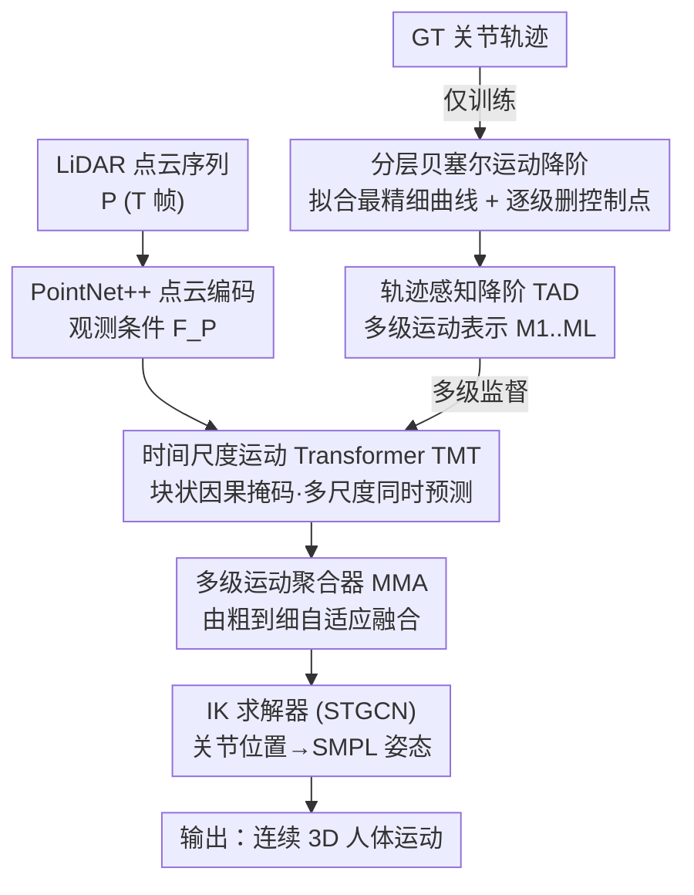

# Bézier Degradation Modeling for LiDAR-based Human Motion Capture

**会议**: CVPR 2026  
**arXiv**: [2605.19620](https://arxiv.org/abs/2605.19620)  
**代码**: 无  
**领域**: 3D视觉 / 人体动作捕捉  
**关键词**: LiDAR动捕、贝塞尔曲线、运动表示、由粗到细重建、遮挡补偿

## 一句话总结
针对 LiDAR 人体动捕在稀疏点云、严重遮挡下抖动甚至失败的问题，本文用**可逐级降阶的贝塞尔曲线**显式建模关节轨迹，配合「时间尺度 Transformer（TMT）+ 多级运动聚合器（MMA）」做由粗到细的渐进重建，在 4 个主流基准上同时拿下精度（MPJPE）和时序连续性（Accel Err）的 SOTA。

## 研究背景与动机
**领域现状**：3D 人体动捕要从传感器数据重建随时间变化的标准化人体表示。传统靠 marker / IMU 等可穿戴设备，后来发展出基于 RGB / RGB-D 的低成本方案；但 RGB 类方法受光照影响、缺乏绝对深度，多局限于室内。自动驾驶、机器人对大场景、无约束环境下的人体感知有强需求，**LiDAR 动捕**因对光照鲁棒、能提供可靠全局深度而成为有前景的方向。

**现有痛点**：LiDAR 是单视角、稀疏深度采样，天然容易被遮挡、被噪声点污染。代表工作 LiveHPS 用 SMPL 顶点特征作为教师信号处理残缺点云，LiveHPS++ 引入速度预测来抑制噪声测量——但它们本质上都还是**从残缺的点云特征里直接学**，碰到关键关节长时间遮挡时，仍会产生抖动、有偏甚至失败的预测。

**核心矛盾**：这些方法依赖**特定点云模式的动作先验**，一旦输入帧缺失就无能为力；问题根源在于「重建目标绑定在不可靠的逐帧观测上」，缺少对运动本身内在规律的约束。

**本文目标**：(1) 找一种对遮挡鲁棒、又便于网络学习的运动表示；(2) 设计能在遮挡造成的「观测断点」处把运动接续起来的重建机制。

**切入角度**：作者走 **kinematics-driven（运动学驱动）** 的路子——不直接从残缺点云特征学，而是用**贝塞尔曲线**参数化人体运动。这种参数化显式暴露位置、速度、加速度，即使长时间遮挡也能得到平滑稳定的插值。关键观察（论文 Fig.2）：激进地裁剪贝塞尔控制点（如只保留 12%）仍能保住全局运动趋势——这与人类运动的层次性吻合：抬腿、迈步、落地、蹬地一连串动作可被粗粒度概括为「从 A 走到 B」，粗趋势表达意图、额外控制点补细节。

**核心 idea**：把运动表示成贝塞尔曲线，并设计一个**逐级删除控制点的降阶策略**生成多级表示；重建则是它的逆过程——由粗到细，先恢复点对点的运动趋势，再逐级细化到每个时间步的精细姿态，用粗层趋势去桥接遮挡导致的观测断点。

## 方法详解

### 整体框架
BMLiCap 是一个 coarse-to-fine 框架，输入是 $T$ 帧 LiDAR 点云序列 $P=\{P_t\in\mathbb{R}^{N\times3}\}$，输出是对应的 3D 人体运动 $M=\{\theta_t, J_t\}$（SMPL 姿态参数 $\theta_t$ 与关节位置 $J_t$）。整条管线由两大部分组成：

1. **分层贝塞尔运动降阶（仅训练用）**：先把原始关节轨迹拟合成最精细的贝塞尔曲线链，再通过「轨迹感知降阶（TAD）」逐级减少控制点，生成一组由粗到细的多级运动表示 $\{M_l\}_{l=1}^{L}$ 作为多级监督目标。

2. **渐进运动重建**：用 PointNet++ 抽取逐帧 LiDAR 特征作为观测条件 $F_\mathcal{P}$；**时间尺度运动 Transformer（TMT）** 把每一级运动表示当作一组 token，在 LiDAR 特征条件下一次前向同时预测各时间尺度的运动曲线；**多级运动聚合器（MMA）** 再把这些多尺度曲线由粗到细自适应融合，得到最终精细运动；最后用 STGCN 的逆运动学（IK）求解器把关节位置转成 SMPL 姿态参数。

注意降阶模块只在训练阶段生成监督目标，推理时直接由 TMT/MMA 一次前向（single forward pass）产出多级运动，避免了以往渐进回归方法的迭代推理慢的问题。

### 关键设计

**1. 分层贝塞尔运动降阶 + 轨迹感知降阶（TAD）：把运动压成「越粗越省、但趋势不丢」的多级表示**

这一步要解决的痛点是「直接逐帧学不可靠观测」，思路是先给运动一个对遮挡鲁棒的层次化参数化。**初始贝塞尔拟合**：对每个关节 $k$ 在 $T$ 帧上的轨迹 $J^{(k)}\in\mathbb{R}^{T\times3}$，把每个 $J^{(k)}_t$ 当锚点，构造 $T-1$ 段三次贝塞尔曲线（式 1），并在每个控制点强制 $C^1$ 连续以保证速度光滑；通过令初始加速度 $\ddot{B}^{(k)}_0(0)=0$，用 Thomas 算法解出所有控制点，得到最精细的曲线链 $\{J^{(k)}_i, C^{(k)}_{i,1}, C^{(k)}_{i,2}\}$。

**TAD 降阶**：给定下采样步长 $s$，新轨迹长度降为 $M_s=\lceil T/s\rceil$，先均匀采样 $M_s$ 个时间索引、取对应关节位置作新锚点。光做下采样会丢动态，所以 TAD 还从最精细曲线上提取每个锚点处的单位切向量 $\widehat{\mathbf{d}}^{(k)}_i$（式 2），把新控制点定义为锚点沿切向偏移一段长度 $\ell$：$\widetilde{C}^{(k)}_{i,1}=\widetilde{J}^{(k)}_i-\ell_{i,1}\widehat{\mathbf{d}}^{(k)}_i$、$\widetilde{C}^{(k)}_{i,2}=\widetilde{J}^{(k)}_i+\ell_{i,2}\widehat{\mathbf{d}}^{(k)}_i$（式 3），再用最小二乘求最优长度 $\ell$，让降阶后的曲线段在原时间区间内最贴合原始采样点（式 4，有闭式解）。用一组不同步长 $S=\{s_1,...,s_L\}$（$s_l>s_{l+1}$、$s_L=1$）就得到由粗到细的多级运动表示 $\{M_l\in\mathbb{R}^{M_{s_l}\times K\times9}\}$。相比线性插值（只有 $G^0$ 连续、速度不连续）、B 样条/VAE（过度平滑）、DCT 频率分解（激进降阶时引入相位滞后和振铃），$C^1$ 贝塞尔 + TAD 在「去噪」和「保真」之间取得更好平衡（见表 2）。

**2. 时间尺度运动 Transformer（TMT）+ 块状因果掩码：让粗趋势引导细化、并在遮挡处跨级补全**

TMT 要解决的是「如何让多级表示之间形成正确的信息流、又能利用 LiDAR 线索」。它是 encoder-only 架构，把每一级运动表示当作一段独立 token 序列；给定初始多级运动嵌入 $\{E_l\}$ 与 LiDAR 特征 $F_\mathcal{P}$，TMT 联合建模它们的交互、一次前向输出各尺度的重建运动曲线 $\{\widehat{M}_l\}=\text{MLP}(\text{TMT}(F_\mathcal{P},\{E_l\}))$（式 5）。

精髓在**块状因果掩码（block-wise causal mask）**：在自注意力层中，每个运动 token 只能注意到所有更粗层级的 token 和所有点云特征 token。这样粗层运动趋势能有效引导细层运动的细化，同时各级都能吸收 LiDAR 的可见线索。论文的注意力可视化（Fig.9）显示：正常序列里各级注意力近似对角化（只看同时刻/邻近位置即可推断）；而严重遮挡序列里注意力变得分散，一些运动 token 在多个层级、多个时刻被当成「关键帧」参与补全——这正是「用粗趋势桥接观测断点」的机制在起作用。

**3. 多级运动聚合器（MMA）：由粗到细把多尺度曲线融合成最终精细运动**

TMT 给出的是各尺度的运动曲线，MMA 负责把它们整合成一条连贯的精细运动。它用一个 reduction 机制逐级融合：$\widehat{M}'_{l+1}=\text{MLP}(\text{Resample}(\widehat{M}'_l),\widehat{M}_{l+1})$（$l=2,...,L-1$；$l=1$ 时 $\widehat{M}'_1=\widehat{M}_1$，式 6）。其中 $\text{Resample}(\cdot)$ 用预测出的贝塞尔曲线参数把较粗的运动表示上采样到与较细一级等长，再用 MLP 融合两者。最终取最精细融合表示 $\widehat{M}'_L$ 的位置分量作为关节位置预测 $\{\widehat{J}_t\}$。由于上采样是用贝塞尔参数解析地插值，融合过程能保持时序光滑，不会引入逐帧拼接的抖动。随后用 STGCN 的 IK 求解器把关节位置转成 SMPL 姿态 $\widehat{\theta}_t$，再做 SMPL 前向运动学得到 $\widehat{J}_{t;\text{FK}}$（式 7）。

### 损失函数 / 训练策略
三项损失联合训练：
- **多级运动损失** $\mathcal{L}_M=\sum_{l=1}^{L}\frac{1}{M_{s_l}}\|\widehat{M}_l-M_l\|_F^2$，对每一级预测的贝塞尔运动表示做监督（式 8）；
- **姿态参数损失** $\mathcal{L}_\theta=\frac{1}{KT}\sum_t\|\theta_t-\widehat{\theta}_t\|_F^2$ 与**前向运动学损失** $\mathcal{L}_\text{FK}=\frac{1}{KT}\sum_t\|J_t-\widehat{J}_{t;\text{FK}}\|_F^2$ 监督 IK 求解器（式 9）。

总损失 $\mathcal{L}=\lambda_M\mathcal{L}_M+\lambda_\theta\mathcal{L}_\theta+\lambda_\text{FK}\mathcal{L}_\text{FK}$（式 10），取 $\lambda_M=0.5$、$\lambda_\theta=\lambda_\text{FK}=1.0$。实现细节：PyTorch 2.3.1 + CUDA 11.8，沿用 LiDARCap 大部分模块；点云编码器是在合成人体实例上预训练的 PointNet++；TMT 为标准 Transformer 编码器（12 层、512 维、16 头）；AdamW，学习率 $2.5\times10^{-4}$，训练 50 epoch，4× RTX 4090。

## 实验关键数据

数据集：LiDARHuman26M、FreeMotion、NoiseMotion、SLOPER4D（从受控室内到复杂室外、不同遮挡与噪声水平）。
指标：**MPJPE/JPE**（平均关节位置误差，mm，↓）、**MPVPE/PVE**（平均顶点位置误差，mm，↓）、**Accel Err/AE**（加速度误差，cm/s²，↓，衡量运动的连贯/平滑度）。`†` 表示 32 帧时间窗变体。

### 主实验
| 数据集 | 指标 | BMLiCap | BMLiCap† | 之前最好 | 说明 |
|--------|------|---------|----------|----------|------|
| LiDARHuman26M | JPE / VPE / AE | 70.1 / 89.5 / 31.2 | **66.8 / 85.4 / 28.8** | LiveHPS 71.9 / 92.1 / 34.1 | 三指标全面领先 |
| FreeMotion | JPE / VPE / AE | 49.6 / 60.3 / 27.1 | **47.2 / 59.0 / 22.5** | LiveHPS++ 61.9 / 75.3 / 54.2 | †较 LiveHPS++ 提升 14.7/16.3/31.7 |
| NoiseMotion | JPE / VPE / AE | **34.0 / 42.8 / 24.1** | 36.9 / 47.0 / 23.8 | LiveHPS++ 34.0 / 42.8 / 34.8 | 精度持平、AE 大幅降；此数据集短窗更好 |
| SLOPER4D | JPE / VPE / AE | 39.7 / 47.8 / 22.3 | **36.5 / 44.2 / 13.6** | LiveHPS++ 42.7 / 50.6 / 43.4 | AE 从 43.4 降到 13.6，连续性提升最显著 |

关键现象：在 NoiseMotion 上**较短时间窗反而更好**——作者归因于该数据集视角跳变多，长窗会聚合更多损坏/轻微错位的位置标注，而 JPE/VPE 对对齐敏感。

**运动表示对比（LiDARHuman26M）**：
| 表示方式 | MPJPE | MPVPE | Accel Err |
|----------|-------|-------|-----------|
| Frequency-DCT | 76.4 | 97.8 | 35.4 |
| VAE-smooth | 78.2 | 100.1 | 36.8 |
| Linear | 75.7 | 96.3 | 35.5 |
| B-Spline | 70.5 | 90.4 | 30.0 |
| **Bézier+TAD（本文）** | **66.8** | **85.4** | **28.8** |

### 消融实验
| 配置 | MPJPE | MPVPE | Accel Err | 说明 |
|------|-------|-------|-----------|------|
| Base（[34]+Transformer） | 79.0 | 101.0 | 42.6 | 仅把 GRU 换成 Transformer，证明增益非来自此 |
| + Bézier & TAD（表示） | 72.3 | 91.4 | 30.7 | 单换运动表示即降 6.7 MPJPE |
| + Tokens & Mask（架构） | 72.2 | 92.4 | 30.7 | 单换多级 token+掩码 |
| + m.s.+m.l.+b.m.+mma（完整） | **66.8** | **85.4** | **28.8** | 各组件互补，较 Base 共降 12.2 MPJPE |

层级与 TAD 消融（表 3）：$L=3$、调度 $\{32,16,8\}$ 为最优；TAD 在各 $L$ 下都带来稳定提升（$L=4$ 时 +TAD 降 1.7 MPJPE）。说明各阶段间**均衡的时间分辨率**有利于捕捉运动动态。

### 关键发现
- **贡献最大的两块**：贝塞尔+TAD 运动表示（单换就 -6.7 MPJPE / -11.9 AE）和完整渐进重建（共 -12.2 MPJPE / -13.8 AE）；其中 m.s.+m.l.+b.m.（多级 token + 运动损失 + 块状掩码）一起加入时 MPJPE 从 78.6 骤降到 68.9，是质变点。
- **抗丢帧鲁棒性**：推理时随机丢掉部分 LiDAR 帧（丢掉的帧用 90% 无意义占位填充），即使**丢失 50% 帧**性能仍保持稳定（Fig.7），印证粗层趋势能补观测断点。
- **时序连续性提升尤为突出**：SLOPER4D 上 AE 从 43.4 降到 13.6，定性可视化（Fig.5/6）显示遮挡下 LiDARCap/LiveHPS 抖动甚至失败，BMLiCap 仍连贯准确。

## 亮点与洞察
- **用「曲线降阶」统一了运动表示与由粗到细监督**：贝塞尔控制点的逐级删除天然给出多级目标，重建恰好是其逆过程——表示设计和训练范式高度自洽，而非两套东西硬拼。
- **TAD 不只是下采样**：它额外沿切向解最优控制点长度来贴合原曲线，比单纯抽帧/线性插值更保动态，这是贝塞尔相对 B 样条/线性大幅领先的关键。
- **块状因果掩码把「粗引导细」做成了显式归纳偏置**：让每个 token 只看更粗层级 + 点云特征，遮挡时注意力自动跨级寻找「关键帧」补全，可解释性强。
- **单次前向取代迭代推理**：以往渐进回归慢在迭代，本文用一个 Transformer 一次前向输出所有层级，把渐进式的精度收益和效率兼得——这个「多级 token + 因果掩码」的思路可迁移到其它由粗到细的序列重建任务（如轨迹预测、视频插帧）。

## 局限与展望
- 降阶/拟合依赖对原始关节轨迹做贝塞尔拟合，**训练阶段需要相对干净的 GT 轨迹**；GT 标注本身有噪声/错位时（如 NoiseMotion 视角跳变）会拖累长窗表现，作者也观察到此现象。
- 时间窗大小与数据集特性强相关（NoiseMotion 短窗好、其余长窗好），缺少自适应选窗机制，实际部署需按场景调。
- 论文未提供代码与推理速度的定量数据，单次前向虽快但 12 层 Transformer + IK 求解的实时性如何尚不明确。⚠️ 以原文为准。
- 仅在 LiDAR 单模态下验证，融合 IMU/RGB 等多模态线索是否进一步增益未探讨。

## 相关工作与启发
- **vs LiveHPS / LiveHPS++**：它们从点云特征学时空一致性先验（顶点教师信号、速度预测）来抗噪，本文转而从**运动本身的运动学规律**入手用贝塞尔显式参数化；优势是长时间遮挡下能靠粗趋势补全（FreeMotion/SLOPER4D 大幅领先），NoiseMotion 上精度持平但 AE 明显更低。
- **vs LiDARCap / LiDAR-HMR**：LiDARCap 是首个 LiDAR 动捕基准+GCN IK 基线，本文沿用其多数模块但把逐帧/迭代重建换成多级贝塞尔表示 + 单次前向渐进重建。
- **vs DCT/VAE/B 样条等运动表示**：DCT 频率分解的正交分量使早期信号误差难纠正、激进降阶有相位滞后与振铃；VAE/B 样条过度平滑；线性插值只有 $G^0$ 连续。$C^1$ 贝塞尔 + TAD 在去噪与保真间更平衡（表 2 全面领先）。

## 评分
- 新颖性: ⭐⭐⭐⭐⭐ 把贝塞尔曲线降阶作为运动表示与多级监督的统一载体，切入角度新颖且自洽。
- 实验充分度: ⭐⭐⭐⭐⭐ 4 个基准、3 指标全面 SOTA，表示对比/组件/层级/丢帧鲁棒性消融齐全。
- 写作质量: ⭐⭐⭐⭐ 方法逻辑清晰、图示到位，部分公式与符号较密集需对照原文。
- 价值: ⭐⭐⭐⭐ 显著提升遮挡场景下动捕的精度与连续性，对自动驾驶/机器人的人体感知有实用价值。

<!-- RELATED:START -->

## 相关论文

- [\[CVPR 2026\] HUM4D: A Dataset and Evaluation for Complex 4D Markerless Human Motion Capture](hum4d_markerless_motion_capture.md)
- [\[CVPR 2026\] Decoupled Generative Modeling for Human-Object Interaction Synthesis](decoupled_generative_modeling_for_human-object_interaction_synthesis.md)
- [\[CVPR 2026\] FisherPoser: Human Motion Estimation from Sparse Observations with Hierarchical Region-Wise Fisher-Matrix Uncertainty Modeling](fisherposer_human_motion_estimation_from_sparse_observations_with_hierarchical_r.md)
- [\[CVPR 2026\] Occluded Human Body Capture with Frequency Domain Denoising Prior](occluded_human_body_capture_with_frequency_domain_denoising_prior.md)
- [\[CVPR 2026\] IMU-HOI: A Symbiotic Framework for Coherent Human-Object Interaction and Motion Capture via Contact-Conscious Inertial Fusion](imu-hoi_a_symbiotic_framework_for_coherent_human-object_interaction_and_motion_c.md)

<!-- RELATED:END -->
