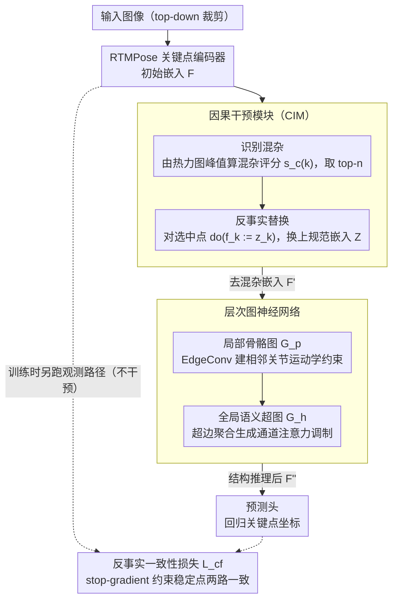

<!-- 由 src/gen_stubs.py 自动生成 -->
# CIGPose: Causal Intervention Graph Neural Network for Whole-Body Pose Estimation

**会议**: CVPR2026  
**arXiv**: [2603.09418](https://arxiv.org/abs/2603.09418)  
**代码**: [53mins/CIGPose](https://github.com/53mins/CIGPose)  
**领域**: 人体理解  
**关键词**: 全身姿态估计, 因果推断, 图神经网络, 结构因果模型, 反事实干预

## 一句话总结

提出因果干预图姿态估计框架 CIGPose，通过结构因果模型识别视觉上下文混杂因素，利用预测不确定性定位受混杂影响的关键点并用学习得到的上下文无关规范嵌入替换，再经层次图神经网络建模骨骼解剖约束，在 COCO-WholeBody 上达到 67.0% AP 的新 SOTA。

## 研究背景与动机

**全身姿态估计的脆弱性**：现有 SOTA 方法（RTMPose、DWPose 等）在严重遮挡、杂乱背景、极端光照等真实场景下常产生解剖学上不合理的预测，鲁棒性不足。

**虚假相关性问题**：高容量模型依赖表面统计特征而非解剖学理解，例如将"椅背"与"躯干"关联，导致在分布外场景频繁失败。

**因果视角的缺失**：传统方法学习的是观测分布 $P(Y|F)$，受视觉上下文混杂因素 $C$ 通过后门路径 $F \leftarrow X \leftarrow C \to Y$ 的污染，未从因果层面解决问题。

**现有改进策略的局限**：知识蒸馏（DWPose）或超大数据集（Sapiens）只是间接缓解，并未直接切断混杂因素的影响路径。

**GNN 对受污染输入的脆弱性**：现有骨骼图神经网络虽可建模解剖约束，但若输入嵌入已被混杂因素污染，GNN 会传播而非纠正这些错误。

**后门调整公式不可行**：理论上的 $P(Y|do(F)) = \sum_c P(Y|F,c)P(c)$ 因混杂因素 $C$ 的高维不可观测性而无法直接计算，需要实用的近似方案。

## 方法详解

### 整体框架

CIGPose 走 top-down 路线，用 RTMPose 当关键点编码器提取初始嵌入 $F$，先经因果干预模块（CIM）把受视觉上下文污染的部分"洗掉"得到 $F'$，再用层次图神经网络注入骨骼解剖约束得到 $F''$，最后由预测头回归坐标。训练时同时跑观测路径和反事实路径以保证干预只动该动的地方，推理时只保留反事实路径。

### 关键设计

**1. 因果干预模块（CIM）：用不确定性找混杂、用规范嵌入切断后门**

全身姿态估计的脆弱根源，是模型把"椅背"这类上下文 $C$ 通过后门路径 $F \leftarrow X \leftarrow C \to Y$ 偷偷关联进了预测，而理论上的后门调整 $P(Y|do(F)) = \sum_c P(Y|F,c)P(c)$ 因为 $C$ 高维不可观测根本算不出来。CIM 给出一个可落地的近似，分两步。第一步识别混杂：对每个关键点嵌入生成 1D 坐标热力图并归一化成后验分布 $(P_{k,x}, P_{k,y})$，定义混杂评分

$$s_c(k) = 1 - \frac{1}{2}(\max(P_{k,x}) + \max(P_{k,y}))$$

峰值越低说明越不确定、越可能被上下文带偏，取得分最高的 $n$ 个关键点来干预（实验证实被遮挡关键点的 $s_c(k)$ 确实显著更高）。第二步反事实替换：维护一张可学习的规范嵌入表 $Z \in \mathbb{R}^{K \times d_{emb}}$，对被选中的关键点做 $do(f_k := z_k)$：

$$f'_k = \begin{cases} z_k, & k \text{ 被选中干预} \\ f_k, & \text{否则} \end{cases}$$

由于 $Z$ 是模型参数、天然独立于输入混杂（$Z \perp C$），这一替换就把后门路径直接掐断；UMAP 可视化也显示规范嵌入学到了高度集中的上下文无关表示。

**2. 层次图神经网络：在干净嵌入上做结构推理**

就算嵌入去了混杂，单点预测仍缺解剖约束，而现成的骨骼 GNN 若喂进被污染的嵌入只会把错误一路传播。CIGPose 把 GNN 放在 CIM 之后，并拆成两层。局部用标准解剖骨骼图 $\mathcal{G}_p$ 上的 EdgeConv 建相邻关节的运动学关系；全局再定义语义超图 $\mathcal{G}_h$，把功能相关的关键点（如"左手"）聚成超边，聚合超边内嵌入并消息传递后，生成通道注意力去调制每个关键点：

$$f''_k = f'_k \odot \left(\frac{1}{|\mathcal{E}_k|} \sum_{e \in \mathcal{E}_k} \sigma(\psi_a(g'_e))\right)$$

"先去混杂再结构推理"的次序是关键——消融里 CIM 与 GNN 的协同增益大于各自之和，正说明在干净嵌入上做结构推理才划算。

### 损失函数

- 关键点预测损失 $\mathcal{L}_{kpt}$：反事实路径输出与真值分布的 KL 散度，按可见性加权
- 反事实一致性损失 $\mathcal{L}_{cf}$：仅对未被干预的稳定关键点，用 stop-gradient 约束观测路径与反事实路径预测一致，确保干预只改受混杂影响的部分
- 总损失 $\mathcal{L} = \mathcal{L}_{kpt} + \lambda \mathcal{L}_{cf}$，$\lambda = 0.1$

## 实验

### 主要结果

**COCO-WholeBody (133 关键点)**：

| 方法 | 输入尺寸 | GFLOPs | whole-body AP | whole-body AR |
|------|---------|--------|--------------|--------------|
| RTMPose-x | 384×288 | 18.1 | 65.3 | 73.3 |
| DWPose-l* (蒸馏+UBody) | 384×288 | 10.1 | 66.5 | 74.3 |
| **CIGPose-x** | 384×288 | 18.7 | **67.0** | **75.4** |
| **CIGPose-x + UBody** | 384×288 | 18.7 | **67.5** | **75.5** |

CIGPose-x 仅用 COCO-WholeBody 训练就超过了依赖两阶段蒸馏+额外 UBody 数据的 DWPose-l（67.0 vs 66.5），体现了更强的数据效率。

**COCO val (17 关键点)**：

| 方法 | GFLOPs | AP | AR |
|------|--------|-----|-----|
| RTMPose-l (384×288) | 9.3 | 77.3 | 81.9 |
| **CIGPose-l (384×288)** | 9.4 | **78.5** | 81.1 |

**CrowdPose (拥挤遮挡场景)**：

| 方法 | AP | AP_E | AP_M | AP_H |
|------|-----|------|------|------|
| HRFormer-B | 72.4 | 80.0 | 73.5 | 62.4 |
| **CIGPose-x (384×288)** | **75.8** | **84.2** | **77.3** | **63.6** |

### 消融实验

| CIM | 超图 $\mathcal{G}_h$ | 骨骼图 $\mathcal{G}_p$ | AP (CIGPose-x) | 增益 |
|-----|------|------|--------|------|
| ✗ | ✗ | ✗ | 65.3 | baseline |
| ✗ | ✗ | ✓ | 66.3 | +1.0 |
| ✗ | ✓ | ✓ | 66.8 | +1.5 |
| ✓ | ✗ | ✗ | 66.1 | +0.8 |
| ✓ | ✓ | ✓ | **67.0** | **+1.7** |

### 关键发现

- CIM 单独使用即可带来 +0.8 AP，说明去混杂本身有效
- 层次 GNN（$\mathcal{G}_p + \mathcal{G}_h$）贡献 +1.5 AP，结构推理价值显著
- CIM + GNN 的协同效果（+1.7）大于各自独立贡献之和，验证了"在去混杂嵌入上做结构推理"的核心假设
- CIGPose-l (66.3 AP) 以更少 GFLOPs 超过更大的 RTMPose-x (65.3 AP)，计算效率优异
- 在 CrowdPose hard 子集上持续提升，证明对遮挡/杂乱场景的鲁棒性

## 亮点

- 首次将因果推断中的结构因果模型和 do-算子系统性地引入 2D 全身姿态估计
- 混杂因素识别方式新颖：利用预测不确定性（热力图峰值分散度）作为代理，理论直观且实验验证充分
- 规范嵌入替换的设计简洁高效：参数级的上下文无关保证（$Z \perp C$），无需显式枚举混杂因素
- 数据效率突出：不依赖额外数据和蒸馏即超越 DWPose

## 局限性

- 混杂因素代理仅以遮挡进行验证，对光照变化、运动模糊等非遮挡类混杂因素的有效性缺乏直接定量分析
- 干预的关键点数 $n$ 为超参数，过度干预可能丢弃有效视觉证据
- 规范嵌入 $Z$ 对所有样本共享同一"理想"表示，可能不足以捕捉关键点的多模态姿态分布
- 仅在 2D 单帧设定下验证，未扩展到 3D 姿态估计或视频序列场景
- 计算开销相比 baseline 略有增加（18.1→18.7 GFLOPs），虽小但存在

## 相关工作

- **RTMPose / DWPose**：当前 SOTA 的高效姿态估计器，CIGPose 的直接基线和对比对象
- **因果推断在视觉中的应用**：语义分割中的反事实注意力、VQA 中的后门调整；CleanPose 用前门调整解决物体位姿的数据偏差，与本文的干预策略不同
- **骨骼图神经网络**：HD-GCN 的层次分解思想直接启发了本文的超图设计
- **ProbPose**：处理超出图像范围的关键点不确定性，与本文的混杂评分思路有相通之处

## 评分

- 新颖性: ⭐⭐⭐⭐ — 因果推断视角在全身姿态估计中属首创，反事实嵌入替换的设计优雅
- 实验充分度: ⭐⭐⭐⭐ — 三个数据集全面对比+消融+可视化验证，但缺少非遮挡混杂因素的定量分析
- 写作质量: ⭐⭐⭐⭐ — SCM 建模和理论推导清晰，图示辅助理解好
- 价值: ⭐⭐⭐⭐ — 在实际部署场景中鲁棒性提升有意义，因果干预思路可迁移到其他密集预测任务

<!-- RELATED:START -->

## 相关论文

- [\[CVPR 2026\] AudioAvatar: Personalized Audio-driven Whole-body Talking Avatars](audioavatar_personalized_audio-driven_whole-body_talking_avatars.md)
- [\[ECCV 2024\] Upper-Body Hierarchical Graph for Skeleton Based Emotion Recognition in Assistive Driving](../../ECCV2024/human_understanding/upper-body_hierarchical_graph_for_skeleton_based_emotion_recognition_in_assistiv.md)
- [\[NeurIPS 2025\] KungfuBot: Physics-Based Humanoid Whole-Body Control for Learning Highly-Dynamic Skills](../../NeurIPS2025/human_understanding/kungfubot_physics-based_humanoid_whole-body_control_for_learning_highly-dynamic_.md)
- [\[CVPR 2026\] Beyond Scanpaths: Graph-Based Gaze Simulation in Dynamic Scenes](beyond_scanpaths_graph-based_gaze_simulation_in_dynamic_scenes.md)
- [\[CVPR 2026\] SAM 3D Body: Robust Full-Body Human Mesh Recovery](sam_3d_body_robust_full-body_human_mesh_recovery.md)

<!-- RELATED:END -->
