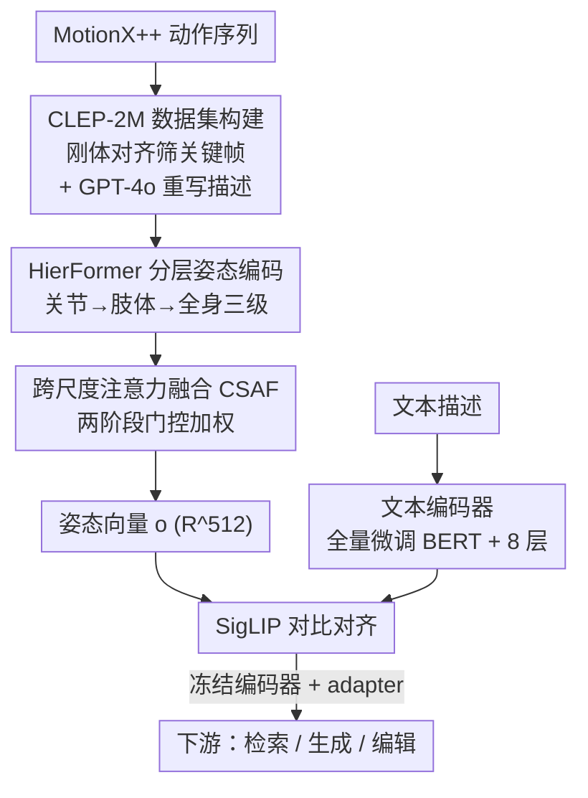

# CLEP: Contrastive Language-Pose Pretraining

**会议**: CVPR 2026  
**论文**: [CVF Open Access](https://openaccess.thecvf.com/content/CVPR2026/html/Jia_CLEP_Contrastive_Language-Pose_Pretraining_CVPR_2026_paper.html)  
**代码**: 未公开（原文未给出仓库链接）  
**领域**: 多模态VLM / 人体理解  
**关键词**: 姿态-语言对齐, 对比预训练, 分层姿态编码器, 跨尺度注意力, 3D人体姿态

## 一句话总结
CLEP 把 CLIP 式对比学习搬到「3D 人体姿态 ↔ 自然语言」上：用分层姿态编码器 HierFormer（关节/肢体/全身三级 + 跨尺度注意力融合 CSAF）配上自建的 200 万对 CLEP-2M 数据集做对比预训练，在 PoseScript-H 零样本检索上把 mRecall 从 5.9 拉到 34.8（近 6 倍），并在姿态生成、姿态编辑等下游任务上全面超越基线。

## 研究背景与动机
**领域现状**：理解人体姿态是姿态条件图像生成、文本驱动人像检索、动作编辑、网格恢复等一大票应用的底座。自然语言能描述「左手抬到肩膀高度、身体微微前倾」这种远比动作类别更细的姿态语义，因此「姿态-语言对齐」被视为以人为中心的多模态理解/生成的基础能力。CLIP 已经证明了图文对齐能解锁强大的下游零样本能力，姿态领域显然也想复刻这条路。

**现有痛点**：早期的 PoseScript 只有约 10 万对姿态-文本数据，规模小、描述多样性窄，导致对比目标几乎学不到东西，对齐能力有限。后来的 ChatPose、UniPose、ChatHuman 转而借助 LLM（甚至外挂一堆专家工具）来做姿态生成/估计，但它们绕开了「在共享嵌入空间里显式对齐姿态与语言」这件事，于是引入噪声、效率低、误差层层累积，表示是碎片化的。

**核心矛盾**：姿态-语言对齐质量同时被两件事卡住——一是缺一个**懂人体结构**的姿态表示（PoseScript 把关节坐标拍平成定长向量，丢掉了人体「关节→肢体→全身」的层次结构，也无法适配不同骨架配置）；二是缺**大规模、语义丰富**的姿态-语言配对数据。只补其中一个都不够。

**本文目标**：从表示层和数据层同时下手，做一个真正在共享空间里对齐姿态与语言的基础模型。

**切入角度**：人体本身是分层的——从指尖、脚趾这类细粒度关节，到躯干、四肢这类高层部件。作者据此设计一个分层 Transformer 姿态编码器，让它既抓局部细节又抓全局结构，再用对比学习把它和文本对齐。

**核心 idea**：用「分层姿态编码器 HierFormer（含跨尺度注意力融合）+ 200 万对自建数据 + SigLIP 对比损失」把 CLIP 范式落到 3D 姿态-语言，学出可迁移的对齐表示。

## 方法详解

### 整体框架
CLEP 是一个双塔对比预训练框架：姿态侧是分层编码器 HierFormer，文本侧是微调的 BERT（外加 8 层 Transformer），两塔在共享空间里用对比损失对齐。要让这套框架跑起来，作者先解决「没有足量数据」的问题——从 MotionX++ 动作序列里抽取多样关键姿态、用 GPT-4o 重写描述，构造出 200 万对的 CLEP-2M。预训练时两塔联合训练；下游使用时冻结两个编码器，只挂轻量 adapter 适配检索、生成、编辑等任务。

整条 pipeline 自上而下是：**数据集构建 → 分层姿态编码（HierFormer）→ 跨尺度融合（CSAF）得到姿态向量 → 与文本编码器做 SigLIP 对比对齐 → 冻结编码器 + adapter 做下游任务**。

### 关键设计

**1. CLEP-2M 数据集构建：用刚体对齐误差筛关键姿态，再用 GPT-4o 补语义**

痛点很直接：PoseScript 只有 10 万对、描述贫乏，对比学习根本喂不饱。但简单地把 MotionX++ 连续动作里的每一帧都拿来用又会造成大量冗余监督（相邻帧姿态几乎一样），反而削弱对齐。作者的解法是「只留信息量大的关键姿态」：对相邻两帧 $P_1, P_2$，求一个最优的缩放 $s$、旋转 $R$、平移 $t$ 把 $P_1$ 刚体对齐到 $P_2$，对齐残差定义为

$$\sum_{i=1}^{n}\sum_{d=1}^{3}\left| s\cdot(R\cdot P_1(i))_d + t_d - P_2(i)_d \right|$$

其中 $i$ 索引关节、$d$ 索引空间维度。只有当这个残差超过预设阈值（即两帧姿态差异够大）才保留该姿态，从而保证最终数据集的多样性。语义侧则用 GPT-4o 配专门 prompt 生成更像人话、更多样的描述，并做严格质控：GPT-4o 自评 0–10 分、低于 4 分的重写或重生成，再人工抽检 5000 样本（15 位志愿者），95% 以上通过流畅度与语义正确性审核。最终得到 200 万对，规模是已有数据的 20 倍。

**2. HierFormer：把人体拆成关节/肢体/全身三级逐层编码**

PoseScript 把关节坐标拍平成定长向量，既丢层次也锁死骨架配置。HierFormer 反其道而行：每个关键点当成一个独立 token，先在**关节级**用 Transformer block 建模关节间空间依赖；再到**肢体级**，按语义把关节分组（如肩-肘-腕），对组内有序关节特征做 1D 卷积提取局部肢体表示，再用 Transformer 建模肢体间依赖；最后到**全身级**，把肢体进一步聚成手臂、腿、躯干、头等大区域，同样的方式编码。形式上对每一级 $i\in\{l,b\}$：

$$E_i = T^{(i)}\!\left(\left\{\mathrm{Conv}\!\left(E_{i-1}[G_i(k)]\right)\right\}_{k=1}^{K_i}\right)$$

其中 $G_i(k)$ 是第 $i$ 级第 $k$ 个单元的关节索引集，$E_i\in\mathbb{R}^{n_i\times d}$ 是该级特征，$T^{(i)}$ 是该级的 Transformer block。这种「token 化每个关节 + 逐级聚合」让编码器既能抓指尖级细节又能抓全身结构，还能灵活适配任意骨架配置——这是 CLEP 声称「能处理任意骨架关键点」的来源。

**3. 跨尺度注意力融合 CSAF：两阶段门控，动态决定哪一尺度更重要**

有了关节/肢体/全身三级特征，怎么融合是关键。传统加性融合会抹掉关键细节、引入语义不一致。CSAF 改成动态加权，分两阶段。**第一阶段（尺度内精炼）**：对每个尺度 $i\in\{j,l,b\}$，把 $E_i$ 当 query、其余尺度的拼接 $[E_{k\neq i}]$ 当 key/value 做 Scale Attention：

$$C_i = \mathrm{softmax}\!\left(\frac{(W_{Q_i}E_i)(W_{K_i}[E_{k\neq i}])^\top}{\sqrt{d_k}}\right)(W_{V_i}[E_{k\neq i}])$$

再用门控残差把跨尺度信息和原始 token 融合：$E'_i = g_i\cdot E_i + (1-g_i)\cdot C_i$，其中门控向量 $g_i=\sigma(\mathrm{MLP}(E_i))\in[0,1]^{n_i\times 1}$ 依据 $E_i$ 自身语义自适应地平衡「保留原始信息」与「吸收跨尺度信息」。**第二阶段（尺度间聚合）**：对每个精炼后的 $E'_i$ 在空间维 $n_i$ 上平均池化得到全局向量 $\bar E_j,\bar E_l,\bar E_b$，再由一个标量门控 $g_i=\sigma(\mathrm{MLP}(\bar E_i))$ 调节各尺度贡献，最终姿态向量

$$o = \sum_{i\in\{j,l,b\}} g_i\cdot \bar E_i,\quad o\in\mathbb{R}^{512}$$

两阶段门控让模型对每个输入动态强调最有信息量的尺度（细粒度文本看关节、整体描述看全身），这正是多尺度文本能精准对齐的机理所在。

**4. 文本编码器全量微调 + SigLIP 对比损失**

文本侧，PoseScript 因数据少只能冻结 BERT、微调几层；CLEP 有了 200 万数据底气，全量微调整个 BERT 并外加 8 层 Transformer（8 层、512 隐藏维），更充分地把语言知识适配到姿态对齐。对齐目标改用 SigLIP 损失而非标准 InfoNCE：把对比对齐当成逐对二分类、独立评估每个姿态-文本对，无需在 batch 内做全局归一化。给定 $N$ 对归一化嵌入 $x_i$（姿态）、$y_j$（文本）：

$$L_{\text{SigLIP}} = \frac{1}{N^2}\sum_{i=1}^{N}\sum_{j=1}^{N}\log\!\left(1+\exp\!\left(-z_{ij}\cdot(\tau\cdot\langle x_i,y_j\rangle + b)\right)\right)$$

其中正对 $z_{ij}=1$、负对 $z_{ij}=-1$，$\langle x_i,y_j\rangle$ 是余弦相似度，$\tau$ 是温度，$b$ 是可学习偏置。SigLIP 在小 batch 下训练更高效、梯度更稳定，消融里它单独又带来约 3 个点的 mRecall 提升。

### 损失函数 / 训练策略
预训练：在 CLEP-2M（200 万对）上用 SigLIP 损失训两塔，单卡 H100 训 12 小时，batch 1024、学习率 1e-4、30 epoch。下游微调：冻结姿态/文本编码器，只挂轻量 adapter，在 PoseScript 上微调 20 epoch（学习率 8e-4、batch 512）；姿态编辑遵循 PoseFix 的目标。

## 实验关键数据

### 主实验
**零样本检索（Table 2）**——预训练只看 CLEP-2M、不碰目标集，直接迁移到 PoseScript：

| 测试集 | 方法 | mRecall↑ | pose→text R@1 | text→pose R@1 |
|--------|------|----------|---------------|---------------|
| PoseScript-H | PoseScript（且在 -A 上训练过） | 5.9 | 2.3 | 1.4 |
| PoseScript-H | CLEP（零样本） | **34.8** | 16.2 | 15.8 |
| PoseScript-A | CLEP（零样本） | 43.6 | 13.1 | 19.2 |

人工标注的 PoseScript-H 上 mRecall 从 5.9 跳到 34.8（近 6 倍），而且 PoseScript 还是在 -A 上训练过的、CLEP 完全没见过目标分布。

**微调检索（Table 1）**——三个数据集上对比 PoseScript（为公平也在 CLEP-2M 上训了一版基线）：

| 测试集 | PoseScript | CLEP | 提升 |
|--------|-----------|------|------|
| PoseScript-A | 72.8 | **83.4** | +10.6 |
| PoseScript-H | 40.9 | **51.4** | +10.5 |
| CLEP-2M | 64.98 | **75.69** | +10.7（text→pose R@1 提升 >13 点） |

**下游生成与编辑**：

| 任务 | 指标 | 最优基线 | CLEP |
|------|------|---------|------|
| 姿态生成（Table 3） | FID↓ / mRecall↑ | 0.07 / 53.4（ChatHuman） | **0.06 / 56.5** |
| 姿态编辑（Table 4） | FID↓ / MPJE↓ / MPVE↓ | 0.02 / 201 / 167（PoseFix） | **0.02 / 195 / 162** |

### 消融实验
逐步叠加四个组件（CLEP-2M 检索基准，mRecall↑）：

| 配置 | mRecall | 说明 |
|------|---------|------|
| 基线（拍平向量 + InfoNCE） | 64.98 | 起点 |
| + Hier 分层表示 | 67.90 | +2.92，引入关节/肢体/全身分层 |
| + SA 尺度注意力 | 69.64 | +1.74，CSAF 第一阶段 |
| + GatedHead 门控融合 | 72.79 | +3.15，CSAF 第二阶段门控聚合 |
| + SigLIP 损失 | **75.69** | +2.90，替换 InfoNCE |

### 关键发现
- 四个组件每个都带正贡献，其中**门控融合头（GatedHead，+3.15）**和**SigLIP 损失（+2.90）**贡献最突出，说明「怎么融合多尺度」和「用什么对比损失」比单纯分层更关键。
- 在**相同数据条件**下（PoseScript 也在 CLEP-2M 上训练），CLEP 仍以 75.69 对 64.98 大幅领先——作者据此论证收益不只来自数据规模，架构与训练策略同样重要。
- 零样本场景增益最夸张（PoseScript-H 近 6 倍），说明大规模 + 语义丰富的预训练数据对跨分布泛化最有价值。
- 姿态编辑在 rotation ELBO 和 geodesic 距离上略逊 PoseFix，作者归因于解码器敏感性而非表示本身的局限。

## 亮点与洞察
- **把 CLIP 范式干净地搬到 3D 姿态**：双塔 + 对比，但姿态塔换成懂人体层次结构的 HierFormer，证明了「领域专用的结构先验 + 大数据 + 对比」组合在新模态上同样成立。
- **关节 token 化是关键 trick**：把每个关键点当独立 token（而非拍平成定长向量），自然支持任意骨架配置，这对跨数据集/跨骨架复用很有迁移价值。
- **CSAF 的两阶段门控**值得借鉴：先尺度内交叉注意精炼、再尺度间门控聚合，让模型按输入语义动态选尺度——这套「门控决定信息流」的思路可迁移到任何多尺度/多分支特征融合场景。
- **SigLIP 替 InfoNCE 在小 batch 下更稳**：消融里单独 +2.9，提示数据/算力受限时优先考虑逐对二分类式对比损失。

## 局限与展望
- **代码与数据未见公开链接**（原文未给仓库），CLEP-2M 的可获取性与可复现性存疑 ⚠️。
- **数据质量依赖 GPT-4o**：描述由 GPT-4o 生成、再用 GPT-4o 自评打分，存在「裁判即选手」的循环偏置；虽有 5000 样本人工抽检，但 200 万规模下覆盖比例很低。
- **姿态编辑非全面领先**：rotation ELBO / geodesic 距离上略输 PoseFix，细粒度旋转控制仍有提升空间。
- 评测主要落在 PoseScript 系与自建的 CLEP-2M 上，跨更多样真实场景（如野外多人、遮挡）的泛化未充分验证。
- 改进思路：开放数据、引入更独立的描述质控、把分层编码扩到带时序的动作序列（论文也提到可作为 motion sequence 建模的底座）。

## 相关工作与启发
- **vs PoseScript**：PoseScript 把关节拍平成定长向量、冻结 BERT、只有 10 万对数据；CLEP 用 token 化分层编码器 + 全量微调 BERT + 200 万对数据，在同数据条件下仍大幅领先，说明结构与损失本身就贡献了一大块增益。
- **vs ChatPose / UniPose / ChatHuman**：这些方法靠 LLM（甚至外挂工具）做姿态任务，但没有在共享空间显式对齐姿态与语言，易累积误差；CLEP 直接在表示层做对比对齐，路径更短、误差更可控。
- **vs MotionCLIP**：MotionCLIP 把动作映射进 CLIP 的图文空间，但继承的图文特征和人体运动学不对齐，存在语义鸿沟；CLEP 强调要建在**姿态感知**的表示上，而非借用图文空间。

## 评分
- 新颖性: ⭐⭐⭐⭐ 首个同时为 3D 姿态-文本对齐设计分层编码器 + 大规模数据集，思路清晰但底层范式沿用 CLIP/SigLIP。
- 实验充分度: ⭐⭐⭐⭐ 覆盖检索（零样本+微调）、生成、编辑三类下游 + 逐组件消融，零样本提升说服力强。
- 写作质量: ⭐⭐⭐⭐ 动机到方法链路顺畅，公式给得清楚；个别记号（如 $g_i$ 在两阶段复用）略易混。
- 价值: ⭐⭐⭐⭐ 给以人为中心的多模态理解/生成提供了可复用的姿态-语言基础模型，但代码/数据未公开限制了直接落地。

<!-- RELATED:START -->

## 相关论文

- [\[CVPR 2026\] Mocap-2-to-3: Multi-view Lifting for Monocular Motion Recovery with 2D Pretraining](mocap-2-to-3_multi-view_lifting_for_monocular_motion_recovery_with_2d_pretrainin.md)
- [\[CVPR 2026\] LCA: Large-scale Codec Avatars - The Unreasonable Effectiveness of Large-scale Avatar Pretraining](lca_large-scale_codec_avatars_the_unreasonable_effectiveness_of_large-scale_avata.md)
- [\[CVPR 2026\] Sign Language Recognition in the Age of LLMs](sign_language_recognition_llms.md)
- [\[CVPR 2025\] Pose Priors from Language Models](../../CVPR2025/human_understanding/pose_priors_from_language_models.md)
- [\[NeurIPS 2025\] CPEP: Contrastive Pose-EMG Pre-training Enhances Gesture Generalization on EMG Signals](../../NeurIPS2025/human_understanding/cpep_contrastive_pose-emg_pre-training_enhances_gesture_generalization_on_emg_si.md)

<!-- RELATED:END -->
