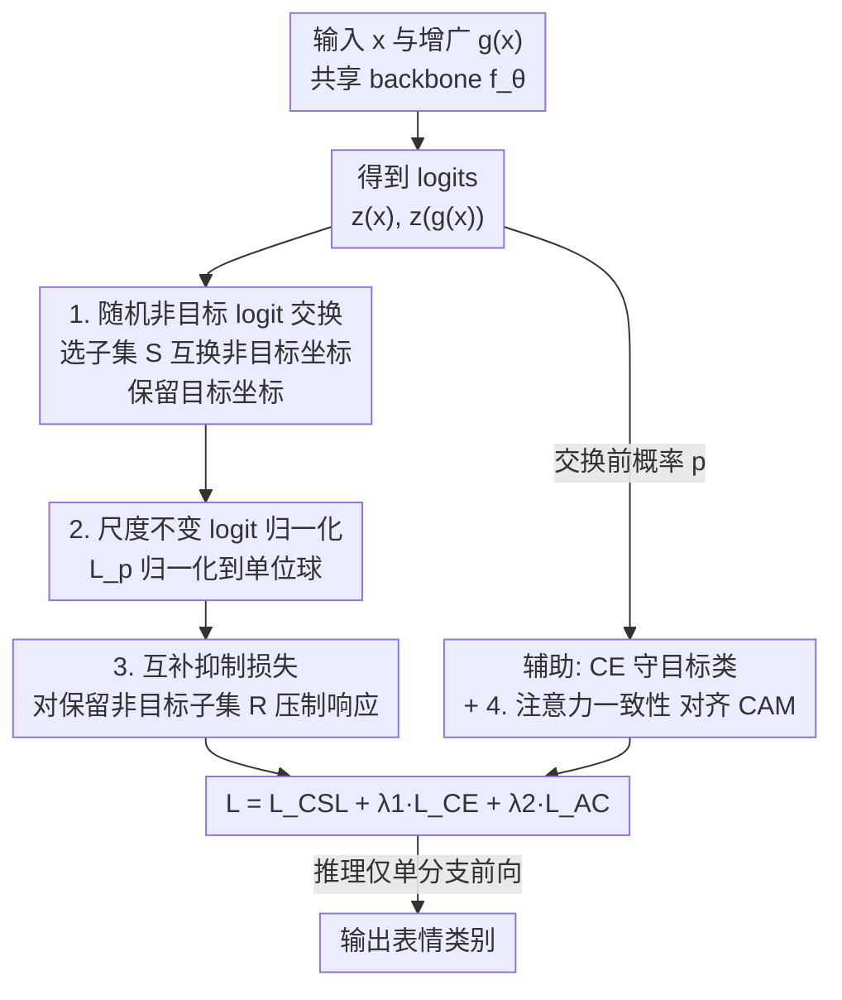

# CLEX: Complementary Label Exchange Learning for Noisy Facial Expression Recognition

**会议**: CVPR 2026  
**论文**: [CVF Open Access](https://openaccess.thecvf.com/content/CVPR2026/html/Wang_CLEX_Complementary_Label_Exchange_Learning_for_Noisy_Facial_Expression_Recognition_CVPR_2026_paper.html)  
**代码**: 未公开  
**领域**: 人体理解 / 表情识别 / 噪声标签学习  
**关键词**: 噪声表情识别, 互补标签, 非目标logit交换, 一致性正则, 鲁棒学习  

## 一句话总结
CLEX 通过在原图与增广图两个分支之间**随机交换一部分非目标类（non-target）的 logit**，再做尺度不变归一化，并用「互补抑制损失」专门压制随机保留的那些非目标类响应，从而在不需要干净数据、不需要噪声先验的前提下抑制虚假激活，在 RAF-DB / AffectNet / FERPlus 三个野外 FER 数据集的各种噪声率下都刷到 SOTA。

## 研究背景与动机
**领域现状**：野外表情识别（FER）天然带噪——模糊表情、复合表情让标注者之间互相不一致，加上「愤怒 vs 厌恶」这类类别视觉上本就相近，标签噪声非常普遍。现有的抗噪 FER 大致分三类：样本选择（按置信度/不确定性挑可靠样本，如 SCN、RUL、NLA）、标签精修（建模潜在标签分布重构监督目标，如 DMUE、LA-Net、ReSup）、一致性正则（对齐增广视图的预测或注意力，如 EAC）。

**现有痛点**：这三类方法的监督信号几乎全都**围着目标类（target class）转**。样本选择依赖准确的样本可靠性评估和噪声率先验，对阈值敏感；标签精修受早期标签估计质量拖累、开销大；一致性正则要么只对齐目标类输出、要么只强制全局一致，**对非目标类分布几乎不加约束**。

**核心矛盾**：标签噪声真正的危害体现在**非目标类上的虚假激活**——遮挡、光照、几何变换会让模型在错误的非目标类上产生高响应，并在训练中被强化；但现有监督设计很少显式建模非目标标签携带的互补信息，于是这些虚假激活始终缺乏约束。即便有方法（如 NL）引入互补标签，也只是给每个样本随机指派**单个**非目标类，没有建模多个非目标响应之间的结构关系，更没有跨视图交互。

**核心 idea**：与其继续在目标类上做文章，不如**直接在 logit 层把非目标类的信息在两个增广视图之间交换出去**——让两条分支在「容易出错」的非目标坐标上互相耦合、互相纠偏，再专门对保留下来的非目标响应施加抑制，从而把虚假激活压下去，同时不碰目标类这个监督锚点。这是首个把「互补标签交换」用于 FER 抗噪的工作。

## 方法详解

### 整体框架
CLEX 是一个**孪生双分支 + 共享 backbone** 的训练框架（推理时退化为单分支，零额外开销）。给定输入图 $x$ 和它的增广版本 $g(x)$，共享的特征提取器 $f_\theta$ 分别产出 pre-softmax logits $z(x)\in\mathbb{R}^C$ 和 $z(g(x))\in\mathbb{R}^C$（$C$ 是表情类别数）。核心流程是：在**随机选中的非目标坐标**上把两条分支的 logit 互相交换（目标坐标始终保持不动），得到交换后的 $z^E(x)$ 和 $z^E(g(x))$；交换结果先做 $L_p$ 归一化、再过 softmax 得到 $\hat p(x)$、$\hat p(g(x))$，在一个**随机保留的非目标子集**上施加互补抑制损失。为稳住训练，再挂两个辅助项：跨视图的注意力一致性正则（对齐两条分支的类激活图），以及作用在**交换前**概率上的标准交叉熵（守住目标类语义）。

整条 pipeline 的数据流如下：

### 关键设计

**1. 随机非目标 Logit 交换（NTX）：让两条分支在易错坐标上互相纠偏**

针对「非目标类虚假激活无人约束」这个痛点，CLEX 直接在 logit 层做交换。设 $\bar Y=\{1,\dots,C\}\setminus\{y\}$ 为非目标类集合，$\gamma\in[0,1]$ 为交换率，采样子集 $S\subseteq\bar Y$，其大小为 $|S|=\lfloor\gamma(C-1)\rfloor$。对原图分支，交换后的 logit 定义为

$$z^E_k(x)=\begin{cases}z_k(g(x)), & k\in S\\ z_k(x), & k\notin S\end{cases},\quad k\in\bar Y$$

增广分支对称地把 $S$ 上的坐标换成原图的值；**两条分支的目标坐标都保持不变**：$z^E_y(x)=z_y(x)$、$z^E_y(g(x))=z_y(g(x))$。这样做的本质是：在选中的非目标坐标上，让两个视图共用对方的响应，从而把两条「可能出错」的预测耦合起来，强制它们跨视图一致；而 $S$ 每次迭代随机重采样，使耦合在整个 $\bar Y$ 上轮流覆盖。交换后的响应在归一化前会被一个小常数 $\epsilon$ 下界裁剪以稳住优化。直觉上，交换把纠偏梯度导向那些**跨分支不一致**的坐标，缓解噪声标签下的误差累积——而目标类锚点始终在，监督不丢。

**2. 尺度不变 Logit 归一化（Norm）：让正则作用在方向而非幅值上**

交换之后直接算损失会有个隐患：过拟合噪声标签的样本往往 logit 幅值极大，会在一致性损失里「以大压小」。CLEX 用 $L_p$ 范数（$p\ge1$）把交换后的 logit 归一化到单位球：

$$\tilde z(x)=\frac{z^E(x)}{\|z^E(x)\|_p},\qquad \|z^E(x)\|_p=\Big(\sum_{c=1}^{C}|z^E_c(x)|^p\Big)^{1/p}$$

归一化消去了公共的尺度因子，使后续的互补惩罚作用在 logit 空间的**方向**上，而不是被任意幅值主导；几何上相当于把 logit 投影到单位 $L_p$ 球面，防止极端幅值样本垄断损失，把正则的注意力聚焦在「方向上的分歧」。实验里 $p=3$ 最稳（$p=1$ 对方向差异不敏感、表现最差）。

**3. 互补抑制损失（CSL）：只压制随机保留的非目标类，避免一刀切收缩**

归一化后的 logit 过 softmax 得到分支概率 $\hat p_j(x)$、$\hat p_j(g(x))$。这里再做一次随机：设丢弃的非目标坐标数 $d\in\{0,\dots,C-2\}$，采样保留子集 $R\subset\bar Y$，$|R|=(C-1)-d$。互补抑制损失为

$$L_{CSL}=\sum_{j\in R}\log\hat p_j(x)+\sum_{j\in R}\log\hat p_j(g(x))$$

由于 $\log\hat p_j(\cdot)\le0$，最小化 $L_{CSL}$ 就是把保留下来的非目标概率往下压。妙处在于它**不是均匀收缩整个非目标空间**——梯度对越大的非目标响应施加越强的抑制，于是模型会重点打击那些「冒头」的显著虚假激活，而不像统一惩罚那样把所有非目标类一视同仁地压扁（那会损害判别能力）。随机丢掉 $d$ 个坐标则起到正则作用，$d=1$ 最优（$d=0$ 缺正则、$d$ 过大丢信息）。

**4. 注意力一致性正则（AC）+ 辅助 CE：稳住训练、守住目标语义**

前三个设计都在 logit 层动手，CLEX 再加两个辅助项把训练拉稳。注意力一致性沿用 EAC 思路：对两条分支末层卷积特征做 GAP、过共享分类器得到类激活图 $M_{ij}(\cdot)$，用对齐算子 $\Pi_g$（如撤销水平翻转）把增广图的注意力映回原图坐标系后做 L2 对齐：

$$L_{AC}=\frac{1}{NCH'W'}\sum_{i=1}^{N}\sum_{j=1}^{C}\big\|M_{ij}(x)-\Pi_g(M_{ij}(g(x)))\big\|_2^2$$

同时对**交换前**的概率 $p(x)$、$p(g(x))$ 保留标准交叉熵 $L_{CE}=-\log p_y(x)-\log p_y(g(x))$，守住目标类的判别语义。总目标为 $L=L_{CSL}+\lambda_1 L_{CE}+\lambda_2 L_{AC}$，全数据集固定 $\lambda_1=0.4$、$\lambda_2=2$。

### 损失函数 / 训练策略
- 总损失：$L=L_{CSL}+\lambda_1 L_{CE}+\lambda_2 L_{AC}$，$\lambda_1=0.4$、$\lambda_2=2$。
- 关键超参跨数据集固定：交换率 $\gamma=0.5$、归一化阶 $p=3$、丢弃数 $d=1$。
- backbone 为 MS-Celeb-1M 预训练的 ResNet-18，图像对齐裁剪到 224×224，增广用随机水平翻转 + 随机擦除。
- Adam 优化器，初始 lr $1\times10^{-4}$，weight decay $1\times10^{-4}$，ExponentialLR（每 epoch 衰减 0.9），训练 60 epoch，batch size 32。
- **推理零额外成本**：测试时只在原图 $x$ 上单次前向，从 $z(x)$ 的 softmax 取预测，不做任何 logit 交换。

## 实验关键数据

### 主实验：合成均匀噪声下对比 SOTA
在 RAF-DB / AffectNet / FERPlus 三个数据集、10%/20%/30% 均匀翻转噪声下，CLEX 全面领先。下表节选 10% 与 30% 两档（数值为测试准确率 %，CLEX 报告 5 次独立运行末 5 epoch 均值±标准差）：

| 数据集 | 噪声率 | Baseline | EAC | NLA(前SOTA) | CLEX(本文) |
|--------|--------|----------|------|------------|-----------|
| RAF-DB | 10% | 81.01 | 88.02 | 88.83 | **88.91±0.09** |
| AffectNet | 10% | 57.24 | 61.11 | 63.52 | **64.30±0.19** |
| FERPlus | 10% | 83.29 | 87.03 | 88.20 | **88.24±0.02** |
| RAF-DB | 30% | 75.50 | 84.42 | 86.71 | **87.11±0.08** |
| AffectNet | 30% | 52.16 | 58.91 | 62.48 | **63.87±0.31** |
| FERPlus | 30% | 79.77 | 85.44 | 86.97 | **87.12±0.09** |

在最严苛的 30% 噪声下，CLEX 相对 Baseline 提升 **11.61% / 11.71% / 7.35%**（三库），相对前 SOTA NLA 提升 0.40% / 1.21% / 0.15%。在真实噪声数据集 **AffectNet Auto** 上，CLEX 拿到 58.76%，超过 SCN/DMUE/MTAC/EAC/NLA 分别 3.33% / 1.78% / 1.38% / 1.08% / 1.82%，说明优势不只来自合成噪声。

### 消融实验（RAF-DB, 30% 噪声）
逐步叠加组件，验证每个模块的增量贡献：

| 配置 | 组件 | RAF-DB(30%) | 说明 |
|------|------|-------------|------|
| (a) | CE | 81.36 | 纯交叉熵基线 |
| (b) | CE + AC | 84.94 | 加注意力一致性，+3.58% |
| (c) | CE + Norm + CSL | 84.73 | 归一化+互补抑制（无AC），相对基线 +3.37% |
| (d) | CE + AC + Norm + CSL | 85.47 | 在(b)上加归一化，确认尺度伪影的危害 |
| (e) | 全模型(再加 NTX) | **87.35** | 加随机非目标交换，达到最佳 |

### 关键发现
- **各组件互补、缺一掉点**：从 (d) 85.47% 到 (e) 87.35%，加上 NTX 交换贡献了近 +1.9%，说明「跨视图交换非目标 logit」是核心增益来源；只靠 AC（b）或只靠 Norm+CSL（c）都到不了全模型水平。
- **超参有明确甜点**：交换子集 $|S|$ 从 1→2/3 显著涨、再大略降（适度交换有益、过度引入冗余噪声）；归一化阶 $p=3$ 最稳；丢弃数 $d=1$ 最优（$d=0$ 缺正则、$d=5$ 丢信息）；$\lambda_1\in[0.2,0.4]$、$\lambda_2=2$ 为最佳区间。
- **可视化佐证机制**：t-SNE 显示 CLEX 的类内更紧、类间边界更清；预测置信度分布上，CE 让干净/噪声样本都堆在置信度 1.0（严重过拟合），EAC 部分缓解成双峰，CLEX 分离最清楚——直接印证「抑制虚假激活」确实发生了。

## 亮点与洞察
- **把「非目标类」当一等公民**：绝大多数抗噪方法盯着目标类，CLEX 反其道而行，显式利用非目标 logit 的互补信息并跨视图交换，这是一个干净且可迁移的视角——任何带增广双分支的分类任务都能借鉴。
- **三处随机性各司其职**：交换子集 $S$ 随机（让耦合覆盖整个非目标空间）、保留子集 $R$ 随机 + 丢 $d$ 个（抑制+正则）、增广本身随机。三层随机叠加，既制造一致性约束又防过拟合，设计上很克制。
- **非均匀抑制的梯度直觉**：$L_{CSL}=\sum_{j\in R}\log\hat p_j$ 对大响应施加更强梯度，自动「打冒头的」而非一刀切压平，这比统一收缩非目标分布更保判别力。
- **零推理开销**：所有花活只在训练期，测试退化为标准单分支前向，工程上几乎免费，落地友好。

## 局限与展望
- 只验证了**均匀（对称）合成噪声** + AffectNet Auto，没覆盖类别相关的非对称噪声（如「愤怒↔厌恶」定向混淆），而后者恰恰是 FER 最真实的噪声形态——⚠️ 这类结构化噪声下 NTX 是否仍有效，论文未给答案。
- 三层随机性引入了 $\gamma$、$p$、$d$、$\lambda_1$、$\lambda_2$ 等多个超参，虽然论文称跨数据集固定，但 sweep 都在 RAF-DB 30% 上做的，迁移到别的库/噪声率是否仍是这套甜点值，存疑。
- 交换发生在非目标 logit 上，隐含假设「目标标签虽噪声但仍是有用锚点」（CE 一直在守目标类）。在目标标签本身大面积错的极端高噪声场景下，这个锚点可能反噬——论文最高只测到 30%。
- 方法主要针对 FER 的小类别数（$C=6\sim8$）设计，$|S|$、$d$ 都是个位数；扩到大类别数（如 ImageNet 级）时随机子集策略是否还高效，需要重新评估。

## 相关工作与启发
- **vs EAC（注意力一致性）**：EAC 只对齐跨视图的类注意力图、约束的是空间一致；CLEX 把 EAC 当作辅助项 $L_{AC}$ 保留，真正的新东西是在 logit 层交换非目标响应——消融里 NTX 带来的 +1.9% 正是 EAC 给不了的。
- **vs NLA / SCN / RUL（样本选择类）**：它们要估计样本可靠性、依赖噪声率先验和阈值；CLEX 不挑样本、不需要干净数据也不需要噪声先验，靠交换+抑制隐式抗噪，少了一堆超参假设。
- **vs NL（互补标签学习）**：NL 给每个样本随机指派**单个**非目标类作监督；CLEX 在 logit 层耦合**多个**非目标坐标并跨视图交换，建模了非目标响应之间的结构关系与视图交互，互补监督更丰富，对虚假激活的抑制更有针对性。
- **vs 标签精修类（DMUE / LA-Net / ReSup）**：它们重构软监督目标、受早期标签估计质量拖累且开销大；CLEX 不改标签、不建噪声转移矩阵，直接在输出空间动手，训练更轻。

## 评分
- 新颖性: ⭐⭐⭐⭐⭐ 首个把「非目标 logit 跨视图交换」用于 FER 抗噪，视角新颖、机制干净。
- 实验充分度: ⭐⭐⭐⭐ 三库 + 真实噪声 + 完整消融与超参分析，但只测到 30% 对称噪声、缺非对称噪声。
- 写作质量: ⭐⭐⭐⭐⭐ 三个组件动机—机制—公式衔接清楚，图文对应，消融逻辑递进。
- 价值: ⭐⭐⭐⭐ 零推理开销、即插即用，对带噪 FER 落地友好，思路可迁移到其他带增广分类任务。

<!-- RELATED:START -->

## 相关论文

- [\[CVPR 2026\] Dynamic Label Noise Suppression with Optimal Teacher Pool for Facial Expression Recognition](dynamic_label_noise_suppression_with_optimal_teacher_pool_for_facial_expression_.md)
- [\[CVPR 2026\] A Two-Stage Dual-Modality Model for Facial Expression Recognition](a_two_stage_dual_modality_model_for_facial_expression_recognition.md)
- [\[CVPR 2026\] Region-Aware Instance Consistency Learning for Micro-Expression Recognition](region-aware_instance_consistency_learning_for_micro-expression_recognition.md)
- [\[CVPR 2026\] D³FER: Dual Channel and Dual Branch Network for Robust Facial Expression Recognition under Dual Challenges](d3fer_dual_channel_and_dual_branch_network_for_robust_facial_expression_recognit.md)
- [\[ECCV 2024\] Generalizable Facial Expression Recognition](../../ECCV2024/human_understanding/generalizable_facial_expression_recognition.md)

<!-- RELATED:END -->
