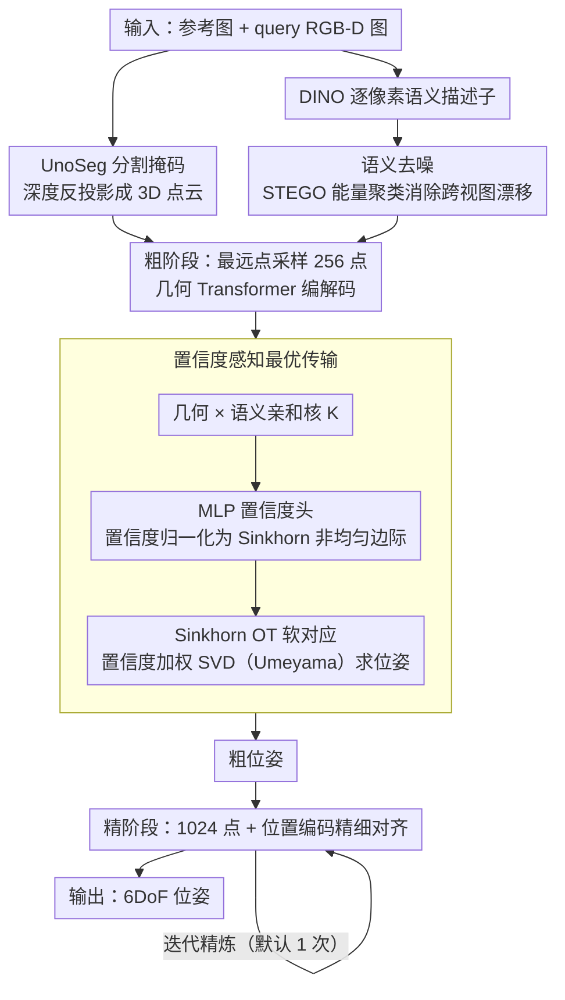

<!-- 由 src/gen_stubs.py 自动生成 -->
# COG: Confidence-aware Optimal Geometric Correspondence for Unsupervised Single-reference Novel Object Pose Estimation

**会议**: CVPR2026  
**arXiv**: [2603.00493](https://arxiv.org/abs/2603.00493)  
**代码**: [YC-Che/COG](https://github.com/YC-Che/COG)  
**领域**: 人体理解 / 6DoF物体位姿估计  
**关键词**: 新物体位姿估计, 最优传输, 置信度学习, 无监督学习, 点云配准, 视觉基础模型

## 一句话总结

提出 COG 框架，将跨视图对应关系建模为置信度感知的最优传输(OT)问题，通过预测逐点置信度作为传输边际约束来抑制非重叠区域和离群点，实现无监督条件下媲美有监督方法的单参考图像新物体6DoF位姿估计。

## 研究背景与动机

**任务定义**：从单张参考RGB-D图像估计任意新物体的6DoF位姿(旋转+平移)，是机器人、AR和3D场景理解的基础任务

**现有限制**：传统方法依赖CAD模型或多视图参考图，实际部署可扩展性差；单参考图设定下大视角变化和部分观测使问题更加病态

**离散匹配的缺陷**：现有方法(如UnoPose)通过argmax构建离散一对一匹配，容易坍缩到少数主导关键点，大量点未被利用

**不可微性**：离散匹配打断梯度流，阻止模型以无监督方式训练

**OT后处理问题**：已有OT方法(RPM-Net、Robust OT)使用均匀边际，置信度仅作为后处理校准，无法与对应关系联合端到端优化

**语义歧义**：纯几何匹配存在歧义，需要语义先验辅助来区分物体不同部件

## 方法详解

### 整体框架

COG 把“单张参考图估计新物体 6DoF 位姿”做成粗到精两阶段。预处理阶段先用 UnoSeg 分出物体掩码、把深度图反投影成 3D 点云、用 DINO 提逐像素 RGB 语义描述子，并借 STEGO 自标签策略对语义特征去噪以消除跨视图漂移。粗阶段对点云做最远点采样取 256 个稀疏点，经几何 Transformer 编解码预测逐点置信度与特征，用 Sinkhorn 最优传输算软对应、再加权 SVD 求粗位姿；精阶段用粗位姿把 query 点云对齐后，换 1024 点配位置编码做精细对齐输出最终位姿。推理时还能用估计位姿反复迭代精炼（默认 1 次）。

### 关键设计

**1. 置信度感知最优传输：把置信度直接当成传输边际**

以往单参考位姿估计靠 argmax 做离散一对一匹配，容易坍缩到几个主导关键点、浪费大量点，而且离散操作不可微、断了梯度没法无监督训练；已有的 OT 方法又只用均匀边际、把置信度当后处理校准，无法和对应关系联合优化。COG 的做法是让置信度直接进入 OT 的边际约束。先构建融合几何与语义的亲和核 $\mathbf{K}_{[i,j]} = \exp(\frac{1}{\tau}\langle \mathbf{G}_{p[i]}, \mathbf{G}_{q[j]}\rangle_{\cos}) \cdot (1 + \langle \mathbf{S}_{p[i]}, \mathbf{S}_{q[j]}\rangle_{\cos})^{\lambda/\tau}$；再让 MLP 置信度头输出 $\mathbf{c}_p, \mathbf{c}_q \in [0,1]^n$，归一化成 $\mathbf{w}_p = \mathbf{c}_p / \overline{\mathbf{c}_p}$ 作为 Sinkhorn 的目标边际；从传输计划 $\Pi$ 行归一化得到软对应矩阵 $\mathbf{M}_{pq}$、$\mathbf{M}_{qp}$，最后拼接双向对应与原始点云做置信度加权 SVD（Umeyama）求刚体变换。这样非重叠区域和离群点会被低置信度自动压下去，对应关系与置信度还能端到端一起学。

**2. 语义去噪：让纯几何匹配不再有歧义**

纯几何匹配在物体不同部件间容易歧义，需要语义先验来区分，但跨视角的 DINO 特征本身存在不一致。COG 借 STEGO 的自标签细化策略对 DINO 特征做能量聚类去噪，消除跨视图的特征漂移，让对应关系聚焦到语义一致的区域——消融里语义先验注入后 mAP 从 73.2 升到 75.9、对应熵 ENT 从 23.0 降到 10.5，对应明显更紧凑。

### 损失函数

| 损失 | 作用 | 公式核心 |
|------|------|----------|
| $\mathcal{L}_{\text{pose}}$ | 置信度加权 Chamfer 距离，优化位姿对齐 | 高斯RBF核衡量变换后点云与目标点云的几何距离 |
| $\mathcal{L}_{\text{cycl}}$ | 循环一致性约束，强化重叠区域对应 | 点经双向投影后应重建自身位置 |
| $\mathcal{L}_{\text{sem}}$ | 语义一致性约束，防止语义不匹配的对应 | 惩罚分配到语义不相似点的对应关系 |
| $\mathcal{L}_{\text{conf}}$ | 伪标签监督置信度学习 | BCE损失，伪标签=几何×位姿×语义 RBF核的乘积(stop-gradient) |

总损失：$\mathcal{L} = \gamma_{\text{pose}}\mathcal{L}_{\text{pose}} + \gamma_{\text{cycl}}\mathcal{L}_{\text{cycl}} + \gamma_{\text{sem}}\mathcal{L}_{\text{sem}} + \gamma_{\text{conf}}\mathcal{L}_{\text{conf}}$。其中无监督版本的关键在于：用几何重建、位姿对齐、语义一致性三种高斯 RBF 核响应生成连续（非二值）伪标签来 BCE 监督置信度分支；有监督变体只是把 $\mathcal{L}_{\text{pose}}$ 里的 Chamfer 距离换成与 GT 变换点的逐点距离。

## 实验

### 主实验：单参考图像新物体位姿估计 (BOP基准)

| 方法 | 监督 | LM-O | TUD-L | YCB-V | Mean |
|------|------|------|-------|-------|------|
| FreeZe | 无 | 45.5 | 68.3 | 65.5 | 59.8 |
| Robust OT | 无 | 45.5 | 66.3 | 66.0 | 59.3 |
| Dustbin OT | 无 | 50.2 | 67.6 | 65.4 | 61.1 |
| **COG (无监督)** | **无** | **56.7** | **73.8** | **75.9** | **68.8** |
| UnoPose | GT位姿 | 58.7 | 71.0 | 83.1 | 70.9 |
| **COG (有监督)** | **GT位姿** | **60.8** | **80.0** | **80.5** | **73.8** |

### 重叠区域预测 (TUD-L IoU)

| 方法 | Dragon | Frog | Watering Can | Mean |
|------|--------|------|--------------|------|
| UnoPose (有监督) | 70.0 | 72.2 | 59.1 | 67.1 |
| COG (无监督) | 71.2 | 64.4 | 81.2 | 72.3 |
| COG (有监督) | 72.9 | 68.3 | 83.9 | 75.0 |

### 消融实验

**对应关系机制消融** (YCB-V)：

- Argmax+全部损失 → Mean 73.1；Softmax → 73.0；Uniform OT → 75.2；**Confidence OT → 75.9**
- OT方法比离散匹配高约 2-3%，置信度边际进一步提升性能

**OT参数消融**：

- 语义先验注入后 mAP 从 73.2 提升到 75.9，ENT 从 23.0 降到 10.5，对应关系更紧凑
- Sinkhorn 迭代超过2次反而轻微降低性能(对应关系过于弥散)，最终采用2次迭代

### 关键发现

1. 无监督 COG 与 SOTA有监督方法 UnoPose 仅差 2.1%，在TUD-L上反超 2.8%
2. 置信度作为OT边际 vs 均匀边际，一致带来提升，验证了非均匀边际的有效性
3. 语义去噪后的 DINO 特征显著降低 ENT，使对应关系聚焦在语义一致区域
4. 迭代精炼1次即提升>1%，收益递减，兼顾精度与速度(约4秒/样本)

## 亮点

- **优雅的数学建模**：将置信度直接嵌入OT边际约束，而非后处理，使对应关系和置信度可端到端联合优化
- **无监督性能惊人**：仅靠几何/语义/循环一致性生成伪标签即可媲美有监督方法，通用性强
- **置信度可解释性强**：可视化显示模型能准确识别非重叠区域和离群点并赋予低置信度
- **设计完备**：粗到精架构 + 语义去噪 + 循环一致性 + 伪标签置信度学习，各模块互补

## 局限性

- 在高遮挡/杂乱场景(LM-O、YCB-V)中，无监督版本与有监督仍有差距(LM-O差4.1%)，表明无监督训练在复杂环境下仍有提升空间
- 依赖分割模型 UnoSeg 提供初始掩码，分割失败将直接导致位姿估计失败
- 推理速度约4秒/样本(含分割和DINO特征提取)，实时应用仍受限
- Sinkhorn 迭代的边际精度与对应关系锐度存在固有矛盾，需手动平衡
- 仅评估了刚体物体的位姿估计，未扩展到铰接物体或可变形物体

## 相关工作

- **新物体位姿估计**：UnoPose(SE(3)不变框架+离散匹配)、SAM-6D(DINO+SAM分割)、MegaPose(CAD检索+精炼)
- **OT用于点云配准**：RPM-Net(均匀边际Sinkhorn)、Robust OT(鲁棒OT)、Dustbin OT(垃圾桶行/列)
- **视觉基础模型**：DINOv2 提供语义特征、STEGO 提供语义去噪策略
- **无监督位姿**：Equi-Pose(SE(3)等变骨干)、OP-Align(铰接物体)、Zero-shot Pose(语义特征对齐)

## 评分

- 新颖性: ⭐⭐⭐⭐ (置信度嵌入OT边际的思路新颖且自然)
- 实验充分度: ⭐⭐⭐⭐ (3个BOP基准+详细消融+可视化)
- 写作质量: ⭐⭐⭐⭐ (公式推导清晰，整体架构图表达力强)
- 价值: ⭐⭐⭐⭐ (无监督媲美有监督是有实用价值的方向)

<!-- RELATED:START -->

## 相关论文

- [\[CVPR 2025\] Co-op: Correspondence-based Novel Object Pose Estimation](../../CVPR2025/human_understanding/co-op_correspondence-based_novel_object_pose_estimation.md)
- [\[ICCV 2025\] MixRI: Mixing Features of Reference Images for Novel Object Pose Estimation](../../ICCV2025/human_understanding/mixri_mixing_features_of_reference_images_for_novel_object_pose_estimation.md)
- [\[ECCV 2024\] GS-Pose: Category-Level Object Pose Estimation via Geometric and Semantic Correspondence](../../ECCV2024/human_understanding/gs-pose_category-level_object_pose_estimation_via_geometric_and_semantic_corresp.md)
- [\[CVPR 2025\] UNOPose: Unseen Object Pose Estimation with an Unposed RGB-D Reference Image](../../CVPR2025/human_understanding/unopose_unseen_object_pose_estimation_with_an_unposed_rgb-d_reference_image.md)
- [\[AAAI 2026\] CoordAR: One-Reference 6D Pose Estimation of Novel Objects via Autoregressive Coordinate Map Generation](../../AAAI2026/human_understanding/coordar_one-reference_6d_pose_estimation_of_novel_objects_via_autoregressive_coo.md)

<!-- RELATED:END -->
