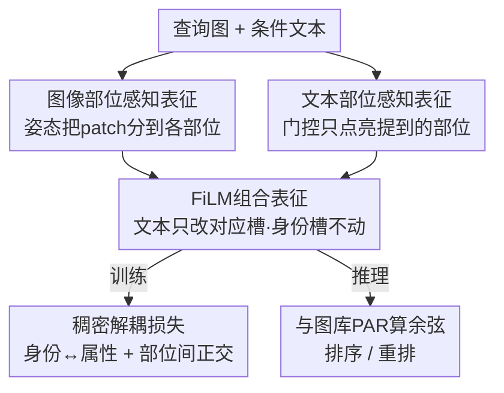

# Composite-Attribute Person Re-Identification via Pose-Guided Disentanglement

**会议**: CVPR 2026  
**论文**: [CVF Open Access](https://openaccess.thecvf.com/content/CVPR2026/html/Patwari_Composite-Attribute_Person_Re-Identification_via_Pose-Guided_Disentanglement_CVPR_2026_paper.html)  
**代码**: 无  
**领域**: 人体理解 / 行人重识别  
**关键词**: 行人重识别, 组合属性检索, 姿态引导解耦, 部位感知表征, 多模态检索  

## 一句话总结
针对「参考图 + 短关键词属性」这种自然但模糊的查询，本文提出 CA-ReID 新任务，并用姿态引导的「部位感知表征（PAR）」把文本属性绑定到对应身体区域、再配合「稠密解耦损失（DDL）」把身份和属性维度拆开，在自建的组合属性基准上把 Hard 查询的 Recall@1 提了最多 +17%。

## 研究背景与动机
**领域现状**：换衣行人重识别（CC-ReID）和多模态 ReID 正在从「纯图搜图」走向「图 + 文本」联合检索。借助视觉-语言模型（VLM），用户可以用一句详细描述（如"穿红夹克、紫裤子、黑鞋"）来更细粒度地控制要找谁。CVPR'24 的 Instruct-ReID 就把「参考图 + 整句描述」定义成 LI-ReID 任务。

**现有痛点**：作者发现，当用户把整句描述换成一个**短关键词**（如"穿绿裤子"）时，SOTA 方法（Instruct-ReID）的 Recall@1 在 COCAS+Real2 上直接**腰斩**。但短关键词恰恰是更自然、更省力、可迭代细化的交互方式——用户更愿意先打一个词、再逐步加条件。

**核心矛盾**：短关键词掉点源于三个具体原因——① **歧义**：Celeb-ReID-Light 里超过 30% 的人都匹配"长裤"，模型必须靠视觉身份来消歧；② **训练偏置**：现有 VLM-ReID 几乎都在整句 caption 上训练，对简短模糊短语理解差；③ **稀有属性**：像"草帽"这类词在训练数据里欠表达，泛化弱。更深一层的矛盾是：身份约束和短属性约束要**同时满足**，而现有特征空间把身份和属性纠缠在一起，一个属性词会激活一堆不相关维度。

**本文目标**：① 立一个能真正考核「身份 + 短/组合属性联合满足」的任务与数据集；② 设计一种表征，让短属性词只影响它该影响的那块身体区域，且不污染身份。

**切入角度**：人体是天然分区的——"帽子"只该看头部、"夹克"只该看上身。如果把图像特征按身体部位拆成槽位（slot），再让文本属性只去更新对应槽位，就能把短查询的歧义大幅压下来。姿态估计正好能提供这种「patch→部位」的强空间先验。

**核心 idea**：用**姿态引导的部位感知表征**把"图像 patch / 文本属性 / 身份"三者按身体部位对齐成槽位，再用**稠密解耦损失**强制身份维度与属性维度、各部位之间互不串扰——把"一个词污染全身"的纠缠问题，从表征结构和损失约束两头同时治。

## 方法详解

### 整体框架
CA-ReID 的输入是「查询图 $x_q$ + 条件文本 $t$ + 图库 $\{x_g^i\}$」，目标是检索出**既同身份、又满足属性**的图库图。整套方法围绕一个核心数据结构——**部位感知表征（Part-Aware Representation, PAR）**：把图像和文本都拆成 6 个槽位 `{id, head, top, bottom, feet, other}`，让文本属性只在对应槽位上做修改。

流程是：图像侧用 ViT 编码出全局 token 和 patch token，再借姿态估计器把 patch 按身体部位分组、池化成各部位的**图像 PAR**；文本侧用冻结的 CLIP 文本编码器把条件文本投影成各部位**文本 PAR**，并用门控只点亮被提到的部位。两路 PAR 经 FiLM 融合成**组合 PAR**（身份槽不动），训练时用身份损失 $L_{ID}$ + 稠密解耦损失（$L_{DDL1}$ 对齐身份/属性、$L_{DDL2}$ 强制部位正交）联合优化；推理时图库图预先编码成图像 PAR，与组合查询 PAR 算余弦相似度排序。

### 关键设计

**1. 图像部位感知表征：用姿态把 patch 钉到身体部位**

这一步针对「短属性词污染全身特征」的痛点：与其让一个全局向量同时编码头/上/下/脚，不如先把图像物理地切成部位槽。具体地，ViT 编码器 $E_I$ 输出全局 token $c\in\mathbb{R}^d$ 和 patch token $\{p_i\}_{i=1}^N$；用现成姿态估计器（HRNet-W32）检测关键点，把每个部位 $k$ 映射到一组 patch 下标 $\mathcal{I}_k$（这套 patch→部位的分配在训练时缓存，避免重复计算）。每个部位特征由对应 patch 均值池化后再过一个轻量投影：

$$\mathbf{f}_k^I = \text{MLP}_k\!\left(\frac{1}{|\mathcal{I}_k|}\sum_{i\in\mathcal{I}_k}\mathbf{p}_i\right)\in\mathbb{R}^d.$$

身份槽则特别处理——把全局 token 和头部特征拼起来再投影：$\mathbf{f}_{id}^I = \text{MLP}_{id}([c;\,\mathbf{f}_{head}^I])$，这样身份既吃到全局外观线索、又以人脸/头部这种**换衣不变**的判别区域为主，从而对换衣鲁棒。最终图像 PAR 是 $\mathbf{F}^I=\{\mathbf{f}_{id}^I,\mathbf{f}_{head}^I,\mathbf{f}_{top}^I,\mathbf{f}_{bottom}^I,\mathbf{f}_{feet}^I,\mathbf{f}_{other}^I\}$。和以往「外加一个姿态模块做对齐」的工作不同，这里姿态只当**模块化空间先验**用来分组 patch，把部位槽变成后续文本编辑的接口。

**2. 文本部位感知表征：投影到部位槽 + 门控抑制无关部位**

这一步针对「短词激活一堆不相关维度」的歧义来源。条件文本 $c_t$ 经冻结 CLIP 文本编码器 $E_T$ 得到全局文本嵌入 $\mathbf{f}^T$，再用各部位可学习投影矩阵 $W_k^T$ 拆成部位文本槽 $\mathbf{f}_k^T = W_k^T\mathbf{f}^T$。关键是一个**解析门控**：分析 $c_t$ 提到了哪些属性，对**没提到**的部位直接把槽位清零 $\mathbf{f}_k^T=0$。例如"红夹克"只激活 $\mathbf{f}_{top}^T$，其余槽保持为零——这就从源头杜绝了跨部位的虚假干扰，确保文本条件只作用在语义上该作用的地方。训练时还借助冻结 VLM 从目标图自动抽出部位级属性（如 top:"红夹克"）来监督这些部位投影，无需人工标注。

**3. FiLM 组合表征：文本只调对应区域，身份槽锁死**

要把文本属性"叠"进视觉表征，又不能让它扰动身份。本文用一个加性残差的 FiLM 风格调制网络 $\phi_{FiLM}$（逐槽位的轻量 MLP）：对每个部位 $k$，由图像和文本槽拼接预测一个调制向量 $\boldsymbol{\beta}_k$，再加回图像槽并归一化：

$$\hat{\mathbf{f}}_k=\mathcal{N}\!\left(\mathbf{f}_k^I+\boldsymbol{\beta}_k\right),\qquad \boldsymbol{\beta}_k=\phi_{FiLM}\!\left([\mathbf{f}_k^I;\mathbf{f}_k^T]\right),$$

其中 $\mathcal{N}$ 是 L2 归一化。这样文本只**选择性地修改对应视觉区域**的外观，而 ViT 编码的空间布局保持不变。最关键的是身份槽**不参与调制**：$\hat{\mathbf{f}}_{id}=\mathbf{f}_{id}^I$，保证属性查询不会让身份漂移。最终组合表征 $\hat{\mathbf{F}}=\{\hat{\mathbf{f}}_{id},\hat{\mathbf{f}}_{head},\hat{\mathbf{f}}_{top},\hat{\mathbf{f}}_{bottom},\hat{\mathbf{f}}_{feet},\hat{\mathbf{f}}_{other}\}$ 在一个结构化、部位对齐的空间里同时承载身份与局部属性。

**4. 稠密解耦损失：身份-属性对齐 + 部位间正交双管齐下**

光有结构还不够，必须用损失强制各维度真的解耦。DDL 由两个互补项组成。

第一项 $L_{DDL1}$ 做**身份-属性解耦**，思路是在 batch 内按四种样本关系挖三元组：对每个 anchor（组合特征 $\hat{\mathbf{F}}$），找出 ① **全匹配** $F^+$（同身份且同属性，应最相似）、② **仅属性匹配** $F^{A+}$（同属性不同身份）、③ **仅身份匹配** $F^{I+}$（同人不同属性）、④ **全不匹配** $F^-$。然后组成多三元组损失：

$$L_{DDL1}=\alpha_1 L_{tri}(\hat{\mathbf{F}},F^+,F^{A+})+\alpha_2 L_{tri}(\hat{\mathbf{F}},F^+,F^{I+})+\alpha_3 L_{tri}(\hat{\mathbf{F}},F^+,F^-),$$

$L_{tri}$ 用余弦相似度的三元组损失。其中 $F^{A+}$ 和 $F^{I+}$ 这两类"半匹配"正是解耦的关键——它们逼模型在属性维度上把 $F^{A+}$ 拉近、在身份维度上把 $F^{I+}$ 拉近，从而把两个因子撕开。若某 anchor 找不到某类样本，对应三元组项就跳过。

第二项 $L_{DDL2}$ 做**部位间正交**，直接惩罚不同部位槽之间的相似度：

$$L_{DDL2}=\sum_{k_i\neq k_j}\left\|\cos(\hat{\mathbf{f}}_{k_i},\hat{\mathbf{f}}_{k_j})\right\|^2,$$

防止特征跨部位泄漏，确保每个槽只编码它负责的语义区域。

### 损失函数 / 训练策略
总目标在 DDL 之外再加一个标准身份三元组损失 $L_{ID}=L_{tri}(\hat{\mathbf{f}}_{id},\mathbf{f}_{id}^+,\mathbf{f}_{id}^-)$ 维持人物判别力，最终：

$$L_{Total}=\lambda_1 L_{ID}+\lambda_2 L_{DDL1}+\lambda_3 L_{DDL2}.$$

实现上：视觉 backbone 用 EVA02-CLIP-L/14，输入 224×224；姿态用 HRNet-W32（COCO val 75.8 AP），作者称换不同姿态估计器对 ReID 性能影响不大。batch=32，backbone 学习率 $1\times10^{-6}$、MLP head $3\times10^{-4}$，SGD + 余弦退火，warmup 后训 70 epoch，2 张 A100。损失权重 $\lambda_{ID},\lambda_{DDL1},\lambda_{DDL2}=1.0,1.0,0.02$，margin $\alpha_1,\alpha_2,\alpha_3=1.0,1.0,1.5$。推理时**不需要 VLM 标注**，图库图一次性编码成 PAR 缓存，查询走 FiLM 组合后算余弦相似度排序；标准 CC-ReID（纯图）则省掉 $t$ 直接比图像 PAR。

## 实验关键数据

### 主实验
在自建 CA-ReID 基准上对比纯图基线 DIFFER（CVPR'25，忽略文本所以表现差）和多模态 Instruct-ReID（CVPR'24），分 Easy/Medium/Hard 三档查询：

| 数据集 | 难度 | 指标 | Inst-ReID | 本文 | 提升 |
|--------|------|------|-----------|------|------|
| Celeb-ReID-L | Hard | R@1 | 41.6 | **58.6** | +17.0 |
| Celeb-ReID-L | Hard | mAP | 14.7 | **20.4** | +5.7 |
| Celeb-ReID-L | Medium | R@1 | 74.0 | **78.9** | +4.9 |
| Celeb-ReID-L | Easy | R@1 | 81.8 | **83.1** | +1.3 |
| COCAS+Real2 | Hard | R@1 | 44.0 | **50.4** | +6.4 |
| COCAS+Real2 | Medium | R@1 | 51.8 | **55.1** | +3.3 |

可以看到提升集中在**最模糊的 Hard 单关键词查询**——这正是 PAR + DDL 想解决的场景；Easy 整句查询本就清晰，差距自然小。

按属性子类拆分 Hard 查询（Celeb-ReID-L）也很有意思：

| 属性类别 | R@1 | mAP |
|----------|-----|-----|
| top（上装） | **62.4** | 23.5 |
| bottom（下装） | 60.3 | 21.9 |
| head（头部） | 59.4 | 18.4 |
| feet（鞋） | 58.3 | 21.0 |
| belongings（随身物） | 58.2 | 19.9 |
| context（情境动作） | 56.2 | 18.4 |
| accessories（配饰） | 55.4 | 19.5 |

视觉定位强、外观区分度高的 top/bottom 最好检索；弥散、依赖情境、弱定位的 accessories/context 最难——和「部位感知」的直觉吻合。

### 消融实验
在 Celeb-ReID-L（组合属性）和 LTCC（标准换衣）上逐步加损失项：

| 配置 | Celeb R@1 | Celeb mAP | LTCC Top1 | LTCC mAP | 说明 |
|------|-----------|-----------|-----------|----------|------|
| 仅 $L_{ID}$ | 54.7 | 17.2 | 60.2 | 52.3 | 无 PAR、靠全局特征 |
| + $L_{DDL2}$ | 55.0 | 18.5 | 62.7 | 52.6 | 加部位正交 |
| + $L_{DDL1}$ | **56.1** | **20.7** | **63.8** | **53.7** | 再加身份-属性解耦（完整） |

两项损失互补：$L_{DDL2}$ 先把各部位结构性拉开、稳住表征，$L_{DDL1}$ 再对齐身份与属性因子，得到「属性敏感但保身份」的检索表征。mAP 从 17.2→20.7 的提升主要来自 $L_{DDL1}$。

### 关键发现
- **增益高度集中在 Hard 短查询**：Easy 仅 +1.3 R@1，Hard 高达 +17，说明方法真正补的是「短/模糊关键词」这块短板，而非全面刷点。
- **稠密解耦损失里 $L_{DDL1}$ 贡献最大**：尤其拉高 mAP（消融里 18.5→20.7），印证「身份-属性两个因子撕开」是核心。
- **失败模式是属性优先偏置**：定性结果显示，当属性清晰常见时检索准；但遇到小区域/被遮挡、类别不均衡的稀有细粒度属性，模型会返回「属性对但身份错」的干扰项——它更倾向先满足属性约束。
- **CC-ReID 上保持竞争力但非最优**：标准换衣基准上本文 LTCC Top1 63.8、PRCC Top1 55.2，超过不少早期基线、逼近 DIFFER/Inst-ReID，但因模型偏向「属性合规」的归纳偏置，并非纯换衣场景的最优（DIFFER LTCC Top1 68.5）。这是设计取向带来的预期代价。

## 亮点与洞察
- **把姿态从"对齐模块"重新定位成"文本编辑的接口"**：以往 pose-guided ReID 用姿态做部位对齐提鲁棒性，本文进一步把部位槽当成「让短文本只编辑对应身体区域」的接口，巧妙地把组合图像检索（CIR）的思路落到行人 ReID 上。
- **门控清零是个朴素但有效的 trick**：未提到的部位文本槽直接置零，从结构上消除跨部位干扰，比让网络"自己学会忽略"更干脆。
- **四类样本关系挖三元组**（全匹配/仅属性/仅身份/全不匹配）是可迁移的解耦范式——任何「需要把两个语义因子拆开」的检索任务都能借鉴这套 $F^{A+}/F^{I+}$ 半匹配构造。
- **推理零 VLM 依赖**：训练靠 VLM 自动抽属性监督，推理完全不需要，部署成本可控。

## 局限与展望
- 作者承认：稀有/细粒度/弱定位属性（配饰、情境动作）仍是弱项，定性失败案例里身份排序会被属性干扰项带偏。
- ⚠️ 自己发现的：方法对**姿态估计质量**有隐性依赖——虽然作者称换估计器影响不大，但严重遮挡/截断时 patch→部位映射会失准，文中未给这种退化场景的定量分析。
- 数据集规模偏小（Celeb-ReID-L 590 id、COCAS+Real2 仅 101 id），且 COCAS+Real2 的属性来自固定列表 caption 解析、词汇重复度高，组合多样性受限。
- 改进思路：把"context（情境动作）"这类不绑定单一部位的属性显式建模成跨部位槽；以及引入难例感知的属性采样，缓解稀有属性的类别不均衡。

## 相关工作与启发
- **vs Instruct-ReID (LI-ReID, CVPR'24)**：它用「参考图 + 整句描述」但评测只看身份、文本仅作辅助；本文把文本变成**强约束**（身份+属性都要满足），并专攻短/组合关键词，Hard 档 R@1 高出约 +17。
- **vs DIFFER (CVPR'25)**：DIFFER 用 VLM 生成描述监督来解耦身份/衣着，但是**纯图检索**、不接受文本控制，因此在 CA-ReID 里几乎失效（Easy R@1 仅 23.6）；不过在纯换衣 LTCC 上仍更强（68.5 vs 63.8），体现两者设计取向差异。
- **vs PFD / pose-guided 解耦方法**：以往姿态引导只做视觉部位对齐与外观鲁棒，不支持对部位级特征做文本组合编辑；本文显式把"部位槽"作为语言-视觉的组合接口，是与既有 pose-guided 路线的核心区别。
- **vs 通用 Composed Image Retrieval（CIR）**：通用 CIR 在时尚/商品上做「参考图 + 修改文本」检索但不强制保身份；本文把 CIR 实例化到行人 ReID，要求结果同时满足身份和属性编辑。

## 评分
- 新颖性: ⭐⭐⭐⭐ 把 CIR 思路 + 姿态部位槽 + 解耦损失三者捏成 CA-ReID 新任务，定位清晰，但各组件（PAR/FiLM/三元组解耦）本身较常规。
- 实验充分度: ⭐⭐⭐⭐ 主表 + 属性分类 + 损失消融 + CC-ReID 四表齐全，但数据集 id 规模偏小、缺姿态退化的鲁棒性分析。
- 写作质量: ⭐⭐⭐⭐ 动机三因素拆得清楚，方法公式完整，图 2 pipeline 直观。
- 价值: ⭐⭐⭐⭐ 短关键词检索是真实交互痛点，PAR + DDL 思路对属性可控检索有迁移价值。

<!-- RELATED:START -->

## 相关论文

- [\[CVPR 2026\] Vision-Language Attribute Disentanglement and Reinforcement for Lifelong Person Re-Identification](vision-language_attribute_disentanglement_and_reinforcement_for_lifelong_person_.md)
- [\[CVPR 2026\] Pose-guided Enriched Feature Learning for Federated-by-camera Person Re-identification](pose-guided_enriched_feature_learning_for_federated-by-camera_person_re-identifi.md)
- [\[CVPR 2026\] WHU-MARS: A Multispectral Aerial-Ground Benchmark Towards Any-Scenario Person Re-Identification](whu-mars_a_multispectral_aerial-ground_benchmark_towards_any-scenario_person_re-.md)
- [\[CVPR 2026\] SSM-Aware Token-Efficient VMamba via Adaptive Patch Pruning and Merging for Person Re-Identification](ssm-aware_token-efficient_vmamba_via_adaptive_patch_pruning_and_merging_for_pers.md)
- [\[CVPR 2026\] Dynamic Magic: Unleashing Restricted Knowledge for Lifelong Person Re-Identification](dynamic_magic_unleashing_restricted_knowledge_for_lifelong_person_re-identificat.md)

<!-- RELATED:END -->
