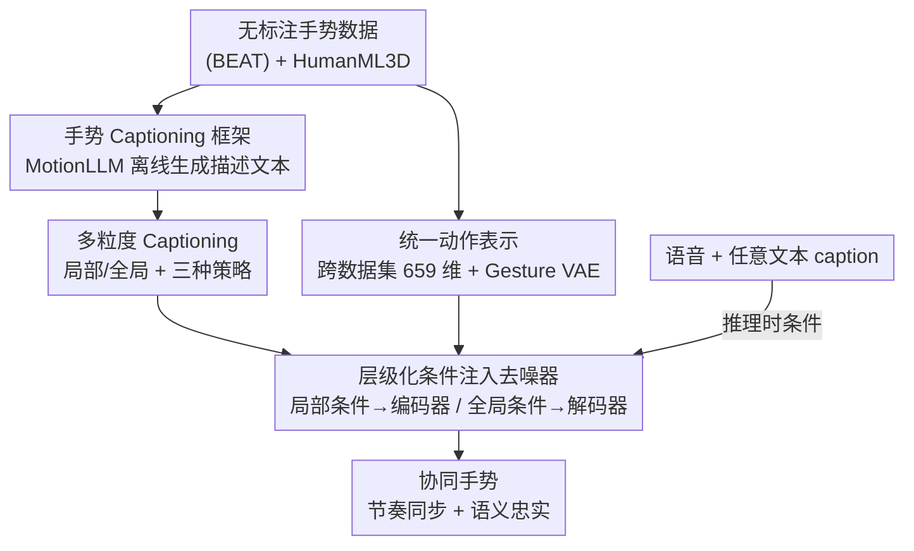

# CoordSpeaker: Exploiting Gesture Captioning for Coordinated Caption-Empowered Co-Speech Gesture Generation

**会议**: CVPR 2026  
**论文**: [CVF Open Access](https://openaccess.thecvf.com/content/CVPR2026/html/Fang_CoordSpeaker_Exploiting_Gesture_Captioning_for_Coordinated_Caption-Empowered_Co-Speech_Gesture_Generation_CVPR_2026_paper.html)  
**代码**: 待确认  
**领域**: 人体理解 / co-speech 手势生成  
**关键词**: co-speech 手势生成, 手势 captioning, 潜在扩散模型, 多模态协同控制, 动作-语言模型  

## 一句话总结
CoordSpeaker 先用一个"手势 captioning"框架给没有文本标注的手势数据离线生成多粒度描述文本，再用一个带「层级化条件注入去噪器」的条件潜在扩散模型，把语音和文本两路异质条件协同起来，从而生成既跟语音节奏对齐、又能听从文本指令（如"边说边鞠躬"）的全身说话人手势。

## 研究背景与动机

**领域现状**：co-speech 手势生成（给一段说话语音，生成与之匹配的全身手势）已经是数字人/虚拟主播/游戏 NPC 的核心能力。主流做法以语音音频为主要条件，辅以 transcript、情绪、风格、身份等模态，重点追求两件事：**与语音的节奏同步**（speech synchronization）和**与语义的相关性**（semantic correlation）。

**现有痛点**：现有方法几乎只会生成「随语音自发产生的手势」（spontaneous gestures，如说话时手随节奏挥动），却忽略了「文本驱动的非自发动作」（non-spontaneous gestures，如一边讲话一边走上前、鞠躬、指向屏幕）。这让说话人的全身动作被困住——一个虚拟老师没法"边讲课边指 PPT"，一个游戏 NPC 没法"边说话边踱步搬东西"。

**核心矛盾**：作者把根因拆成两点。其一是**语义先验缺口（Semantic Prior Gap）**：现有手势数据集（BEAT 等）只有语音、没有对动作内容的描述性文本标注；想靠语音 transcript 间接推语义，信息太弱；想人工标注语义又贵到不可行。其二是**多模态协同控制难题（Coordinated Multimodal Control）**：语音和文本描述是「间接相关」的两路异质条件，控制目标常常冲突（语音想让你挥手、文本想让你鞠躬），而以往方法只是简单 concat 拼接，把它们当成强度不同的信号，没建模交互，结果控制不和谐。

**本文目标**：在低标注成本、低算力成本下，同时实现「自发手势的节奏同步」和「非自发动作的语义忠实」，并让两路条件协调共存。

**切入角度**：作者反问——既然手势本身就携带丰富语义（手势是一种"身体语言"），那为什么不**反过来给手势生成文字描述**？也就是把"理解手势"当成补语义缺口的钥匙。这是本文最关键的视角转换：第一次把 gesture captioning（动作→文本）引入手势生成（文本→动作），构成双向的 gesture-text 映射。

**核心 idea**：先用动作-语言模型给手势"配字幕"（离线、零额外推理开销）补上语义标注，再用层级化的扩散去噪器把语音（局部、节奏）和文本（全局、语义）分层注入，实现协同可控生成。

## 方法详解

### 整体框架
CoordSpeaker 分两大块。**第一块是 Gesture Captioning 框架**：用一个 MotionLLM（动作-语言模型）离线把手势序列翻译成多粒度的描述性文本，给原本无标注的手势数据补上「语义先验」，这些 caption 被缓存复用，推理时不产生额外开销。**第二块是 Coordinated Gesture Generation 模型**：先训一个 Gesture VAE 把跨数据集的动作压进统一的低维潜在空间，再训一个条件潜在扩散模型，其核心是一个「层级化条件注入去噪器」——把语音+局部 caption 当"局部条件"注入编码器、把全局 caption 当"全局条件"注入解码器，两级分工对应多粒度 caption，实现节奏与语义的协调。整套流程的输入是「语音 + 任意文本 caption」，输出是与语音节奏同步、又听文本指令的全身说话人手势。训练采用两阶段（先 VAE 后扩散）。

### 关键设计

**1. 手势 Captioning 框架：用 MotionLLM 给无标注手势"配字幕"，离线补齐语义先验**

这一步直击「语义先验缺口」——手势数据集没文本标注，那就让模型自己生成。框架由两部分组成：一个基于 VQ-VAE 的 motion tokenizer（编码器 $E_M$ / 解码器 $D_M$）把手势序列离散化成 motion token，一个共享文本-动作词表 $V=\{V_t, V_m\}$ 的 transformer 语言模型（实现用 MotionGPT，推理时冻结）。给一段 $M$ 帧手势 $m_{1:M}=\{x_i\}_{i=1}^{M}$，tokenizer 把它量化成离散 token 序列 $s_{1:L}$，再和精心设计的 prompt 文本 token $w_{1:N}$ 混合喂进语言模型，生成手势描述 $\hat w_{1:L}$。为对齐通用动作-语言空间，手势序列会先转成统一动作表示再投到 22 关节子集。**关键的工程取巧是：caption 全部离线生成并缓存**，所以推理时完全没有额外开销，绕开了以往"动作-文本对齐预训练"带来的训练/推理成本。这是论文第一次把"理解手势"用于"生成手势"，构成双向映射。

**2. 多粒度 Captioning：用局部+全局两层描述解决时间动态与语义粒度不匹配**

一段手势在时间上是动态变化的、不同时刻语义粒度不同，单条 caption 既对不准时间也概括不全。作者把手势按段长 $K$ 切成片段 $m_{1:M}=\{m_{i:i+K-1}\}$，每段独立生成**局部 caption** $C_{local}$ 提供片段级细粒度语义监督；再把局部 caption 用分隔符拼起来得到**全局 caption** $C_{global}=\{C^1_{local}\langle\text{SEP}\rangle C^2_{local}\langle\text{SEP}\rangle\dots\}$ 概括整段语义。在此之上给出三种 caption 策略：**Regular**（均匀切段，时间对齐最精准）、**Dynamic**（训练时随机采样片段 + caption 混合，增强对时间模式变化和灵活组合的鲁棒性）、**Hierarchical**（同时用局部+全局，互补 fine-to-coarse 语义）。这套多粒度机制为后面去噪器的两级注入提供了天然的"局部对编码器、全局对解码器"的对应物。消融里最终采用「Hierarchical 策略 + Regular 局部 caption」的组合，因为它在所有指标上整体最平衡。

**3. 统一跨数据集动作表示：把手势与通用人体动作压进同一潜在空间，借来语义先验**

为了把 HumanML3D 这类有丰富文本语义的通用人体动作数据集"借"进来联合训练，必须先解决格式不统一的问题。作者把不同来源的数据统一转成 SMPL-X 轴角表示，缩放与初始朝向调整后经 SMPL-X 前向计算得到 3D 关节位置，每帧表示成 $x_i = (\dot r_a, \dot r_x, \dot r_z, r_y, j_p, j_v, j_r, c_f)$，其中含根关节角速度/线速度/高度、关节位置/速度/旋转、足部接触；为更好容纳手势数据用了 55 个关节，每帧 659 维，整段记为 $x\in\mathbb{R}^{T\times659}$。然后用一个带长跳连（long skip connection，保动作细节）的 transformer VAE 把动作编码进紧凑潜在向量 $z\in\mathbb{R}^{n\times d}$：编码器吃逐帧特征+可学习分布 token，输出高斯参数 $\mu,\sigma$ 并重参数化采样；解码器用 cross-attention、以零 token 为 query、$z$ 为 key/value 重建动作。训练目标是重建 MSE + KL 正则：

$$\mathcal{L}_{VAE} = \|x_{1:L}-\hat x_{1:L}\|_2^2 + \beta\, \mathrm{KL}\big(q(z|x_{1:L})\,\|\,p(z)\big)$$

统一表示让手势能蹭到通用动作里的语义先验，消融显示去掉它（-w/o mo.）语义相关性掉得最狠。

**4. 层级化条件注入去噪器：把语音与文本分两级注入，化解多模态控制冲突**

这是协同控制的核心。扩散在潜在空间做：前向加噪 $q(z_t|z_{t-1})=\mathcal{N}(\sqrt{\alpha_t}\,z_{t-1}, (1-\alpha_t)I)$；去噪器 $\epsilon_\theta$ 用 transformer 编码器-解码器结构。与以往"把所有条件 concat 一锅炖"不同，作者按多粒度 caption 做**两级注入**：第一级，局部条件 $c_1=\{C_{local}, A\}$（局部 caption + 音频）和噪声潜在、时间步 embedding 拼接后送进去噪器编码器 $E_d$ 做 self-attention，保证与局部手势片段的语义和节奏精准同步；第二级，全局条件 $c_2=\{C_{global}\}$ 通过 cross-attention 注入去噪器解码器 $D_d$，提升整体连贯性和高层语义相关性：

$$h = E_d(\mathrm{concat}(z_t, t, c_1)), \qquad \epsilon_\theta(z_t,t,c) = D_d(h, c_2)$$

这种"局部→编码器、全局→解码器"的分层正好和多粒度 caption 对齐，让异质条件各司其职、贡献平衡，而不是互相打架。训练时还用 classifier-free guidance：随机 mask 10% 条件以同时学条件/无条件分布，推理时对音频 $A$ 和 caption $C$ 各给一个 guidance scale $s_1, s_2$ 做加权：

$$\epsilon_\theta^s = s_1\epsilon_\theta(c{=}\{\varnothing, A\}) + s_2\epsilon_\theta(c{=}\{C, \varnothing\}) + (1-s_1-s_2)\epsilon_\theta(c{=}\{\varnothing,\varnothing\})$$

这样可以独立调节"听语音"还是"听文本"的强度。

### 损失函数 / 训练策略
两阶段训练。第一阶段训 Gesture VAE，目标即上面的 $\mathcal{L}_{VAE}$（重建 MSE + $\beta$·KL）。第二阶段冻结 VAE、训条件潜在扩散，用标准 $\ell_2$ 噪声预测目标 $\mathcal{L}_{Diff}=\mathbb{E}_{\epsilon,t}[\|\epsilon-\epsilon_\theta(z_t,t,c)\|_2^2]$，其中 $\epsilon\sim\mathcal{N}(0,I)$、$z_0=E(x_{1:L})$。推理用 DDIM 采样器、50 步去噪得到 $\hat z_0$ 再经 VAE 解码器还原动作序列。联合训练数据为 BEAT（76 小时语音-手势，4 个英语说话人）+ HumanML3D（14,616 条动作、44,970 条文本）；BEAT 缺的文本由本文 captioning 框架补，HumanML3D 缺的音频置零。

## 实验关键数据

### 主实验
协同手势生成上，与唯一两个相关工作 FreeTalker、SynTalker 对比（SynTalker 无多模态条件下的定量协议，故主表用 FreeTalker 复现为基线）。Table 1 节选（BC 报 $\times10^{-1}$，→ 表示越接近真实越好）：

| 方法 | Jerk→ | FGD↓ | BC↑ | L1Div↑ | FID↓ | Div→ | 说明 |
|------|-------|------|-----|--------|------|------|------|
| GT | 1.165 | - | - | - | - | 5.512 | 真实动作 |
| FreeTalker | 0.611 | 2.101 | 1.147 | 11.332 | 0.761 | 5.396 | 只会语音驱动，无语义动作 |
| **Ours** | **1.190** | 3.173 | **1.327** | 10.861 | 1.118 | **5.558** | 节奏(BC↑0.180)、多样性(Div↑0.162)更优，重建更接近 GT |

用户偏好（Table 2，胜率%，20 人评 10 对 9 秒片段）：

| 方法 | 自然度 | 同步性 | 文本匹配 |
|------|--------|--------|----------|
| FreeTalker | 18.0 | 24.0 | 15.5 |
| SynTalker | 32.0 | 26.5 | 31.5 |
| **Ours** | **36.0** | **32.0** | **33.0** |

CoordSpeaker 在三项主观维度上均第一，相对 SynTalker 在自然度/同步/匹配上分别 +4.0%/+5.5%/+1.5%（卡方检验均显著，p<0.05）。

纯文本驱动动作生成（HumanML3D 测试集，仅文本条件，Table 3）：本文 FID 0.405（第二好）、MM-Dist 3.584（最好的文本对齐），显著优于同类协同方法 SynTalker（FID 4.385），证明层级化去噪器能很好整合细粒度语义。

### 消融实验
Table 1 的消融行（指标越偏离 GT 越差）：

| 配置 | BC↑ | MM-Dist↓ | R-Prec↑ | 说明 |
|------|-----|----------|---------|------|
| Full (Ours) | 1.327 | 6.814 | 0.100 | 完整模型，多模态平衡 |
| w/o hcd. | 1.910 | 6.872 | 0.102 | 去层级去噪器：偏向 co-speech(BC 异常↑0.583)、丢语义 |
| w/o mgc. | 2.256 | 7.031 | 0.082 | 去多粒度 caption：语义相关性大跌(MM-Dist↑、R-Prec↓) |
| w/o mo. | 2.627 | 7.664 | 0.043 | 去统一动作表示：语义退化最严重(MM-Dist↑0.850, R-Prec↓0.057) |

### 关键发现
- **统一动作表示（mo.）去掉后掉点最狠**：R-Precision 从 0.100 暴跌到 0.043、MM-Dist 升 0.850，说明跨数据集借来的语义先验是模型能做"非自发动作"的根本来源；缺了它连"举手"这类意图动作都执行不全。
- **多粒度 caption（mgc.）主要管语义**：去掉后只剩基础 co-speech 手势、几乎没有有意义的非自发动作，验证了 captioning 这条线正是补语义缺口的关键。
- **层级化去噪器（hcd.）管协调**：去掉后 BC 反而异常飙到 1.910，模型过度偏向语音手势、丢了文本语义——说明它的价值是"平衡两路冲突条件"，而非单纯提某一指标。
- **效率显著**：用 AITS（每句平均推理时间，单张 RTX 3090）测，本文 0.842s，比 FreeTalker（6.632s）和 SynTalker（5.804s）快 6 倍以上——得益于潜在空间扩散 + DDIM 50 步 + caption 离线缓存。

## 亮点与洞察
- **"用理解反哺生成"的视角**：第一次把 gesture captioning（动作→文本）引入 co-speech 手势生成，把"无文本标注"这个老大难变成"让模型自己配字幕"，且离线缓存做到零推理开销——这个 trick 可迁移到任何"目标数据缺标注、但存在能生成伪标注的预训练模型"的场景。
- **多粒度 caption 与两级注入的对偶设计很巧**：局部 caption↔去噪器编码器（self-attention，管节奏+局部语义）、全局 caption↔解码器（cross-attention，管整体连贯），让"caption 怎么切"和"条件怎么注入"在结构上一一对应，而不是把条件一股脑 concat。这种"按粒度分层注入异质条件"的思路可用于任何多模态可控生成。
- **跨数据集统一表示借语义先验**：把 HumanML3D 的语义"借"给手势生成，本质是用统一潜在空间打通两个原本不互通的数据分布——是低成本扩语义能力的实用路子。

## 局限与展望
- 作者承认：captioning 模型在**较长手势序列中难以正确感知时间先后顺序**（temporal order），这会影响复杂复合动作的描述准确性。
- 定量评估手势 caption 本身很难，因为缺 ground-truth caption（正是论文要补的"语义缺口"），只能靠 200 条专家标注集 + GPT 评语言质量 + MotionClipScore 等间接评，⚠️ 这类评测的绝对数值参考价值有限。
- 自己发现：方法依赖 MotionGPT 这类现成动作-语言模型的质量，caption 错了会直接污染下游语义控制；且训练绑定 SMPL-X / HumanML3D 特定格式，迁到其他骨架/数据集需重做统一表示。两路 guidance scale $s_1, s_2$ 需要手调，自动平衡仍是开放问题。

## 相关工作与启发
- **vs FreeTalker [47]**：FreeTalker 也试图做"语音+文本驱动"，但靠额外动作数据集联合训练、不支持联合信号下的协同控制，且仍受语义标注缺口困扰；CoordSpeaker 用 captioning 直接补语义、用层级去噪器做真协同，定量上节奏/多样性/效率全面更优（推理快 6×）。
- **vs SynTalker [4]**：SynTalker 用 prompt-motion 对齐预训练生成隐式文本标签，但引入额外训练/推理成本，且多模态条件冲突时会"顾此失彼"（如"边走边说"会丢掉 co-speech 手势）；CoordSpeaker 的 caption 离线缓存零开销、两级注入显式协调，主观匹配/自然度更高。
- **vs 纯 text-to-motion（MDM / T2M-GPT / MLD / MoMask）**：这些只做文本→动作、不管语音节奏；CoordSpeaker 在纯文本条件下仍能取得 MM-Dist 最优、FID 第二，同时多出"语音协同"这一整块能力。

## 评分
- 新颖性: ⭐⭐⭐⭐⭐ 首次把 gesture captioning 引入手势生成、构造双向 gesture-text 映射，视角转换很有启发。
- 实验充分度: ⭐⭐⭐⭐ 协同/纯文本/captioning/消融四类实验+用户研究+效率都有，但 caption 定量评估受限于缺 GT。
- 写作质量: ⭐⭐⭐⭐ 两难题→两方案的结构清晰，公式与图配合到位。
- 价值: ⭐⭐⭐⭐⭐ 把"非自发动作"能力补进 co-speech 手势生成，且离线 caption + 潜在扩散兼顾效果与 6× 效率，实用性强。

<!-- RELATED:START -->

## 相关论文

- [\[CVPR 2026\] LiveGesture: Streamable Co-Speech Gesture Generation Model](livegesture_streamable_co-speech_gesture_generation_model.md)
- [\[ICCV 2025\] SemGes: Semantics-aware Co-Speech Gesture Generation using Semantic Coherence and Relevance Learning](../../ICCV2025/human_understanding/semges_semantics-aware_co-speech_gesture_generation_using_semantic_coherence_and.md)
- [\[CVPR 2026\] Miburi: Towards Expressive Interactive Gesture Synthesis](miburi_towards_expressive_interactive_gesture_synthesis.md)
- [\[CVPR 2026\] DyaDiT: A Multi-Modal Diffusion Transformer for Socially Favorable Dyadic Gesture Generation](dyadit_a_multi-modal_diffusion_transformer_for_socially_favorable_dyadic_gesture.md)
- [\[CVPR 2026\] Active Inference for Micro-Gesture Recognition: EFE-Guided Temporal Sampling and Adaptive Learning](active_inference_for_micro-gesture_recognition_efe-guided_temporal_sampling_and_.md)

<!-- RELATED:END -->
