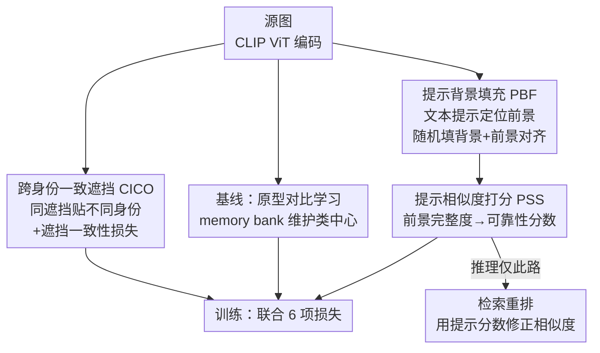

# COPE: Consistent Occlusion and Prompt Enhancement Network for Occluded Person Re-identification

**会议**: CVPR 2026  
**论文**: [CVF Open Access](https://openaccess.thecvf.com/content/CVPR2026/html/Sun_COPE_Consistent_Occlusion_and_Prompt_Enhancement_Network_for_Occluded_Person_CVPR_2026_paper.html)  
**代码**: https://github.com/Cecoming/COPE  
**领域**: 行人重识别 / 遮挡 ReID  
**关键词**: 遮挡行人重识别, 一致性遮挡, 提示增强, 视觉-语言对齐, 检索重排  

## 一句话总结
COPE 用三个轻量模块解决遮挡 ReID 的"特征干扰"与"信息丢失"两大顽疾——跨身份施加**相同遮挡**并约束遮挡区特征一致(CICO)、用 CLIP 文本提示定位前景再随机填充背景(PBF)、推理时用前景完整度打分对检索做后处理重排(PSS)，在 Occluded-Duke 上达到 Rank-1 约 82%、mAP 约 75–76%，且几乎不增加推理开销。

## 研究背景与动机

**领域现状**：行人重识别(Re-ID)要在跨摄像头的图库中检索同一行人，但实拍图像常被车辆、行人、栏杆等遮挡。主流应对分两派：一派做**遮挡数据增强**(在输入上贴各种遮挡块来增强泛化)，另一派做**特征重建**(借助外部线索或图库近邻把被遮住的特征恢复出来)。近年 Transformer/CLIP backbone 把特征抽取能力推得很高，但遮挡场景仍卡在瓶颈。

**现有痛点**：作者指出三个被忽视的问题。其一，多数增强方法只追求遮挡的"多样性"，却忽略了**相似遮挡会诱导误匹配**——如图 1(a)，CLIP-REID 检索遮挡 query 时，返回的全是带相似车辆遮挡的错误结果，说明相似遮挡本身成了干扰信号。其二，遮挡 ReID 的图库里大量样本其实是**完整(holistic)无遮挡**的，单纯模拟遮挡解决不了不同环境下的背景干扰。其三，特征重建依赖近邻特征逐个恢复，**计算开销大、推理延迟高**，难以实时部署。

**核心矛盾**：遮挡带来两个本质难题——**特征干扰**(遮挡 token 在全局自注意力里和前景 token 纠缠，污染表征)和**信息丢失**(可见区域太少，query 和正确 gallery 直接相似度过低)。增强派治不了"相似遮挡误导"，重建派又太贵，二者各顾一头。

**本文目标**：(1) 让模型学会识别并抑制遮挡 token，把注意力推回前景；(2) 在完整图库样本上削弱背景依赖；(3) 在不做昂贵特征重建的前提下，挽回严重遮挡造成的检索失败。

**切入角度**：与其让每个身份都被"不同"的遮挡增强，作者反其道而行——**故意给不同身份贴上完全相同的遮挡**，制造"视觉上像、身份上不同"的歧义样本，再用一致性损失强迫模型把这些相同遮挡区编码成相似(因而与身份无关)的特征，遮挡自然就被注意力降权了。同时复用 CLIP 的文本-视觉对齐能力定位前景，并把"前景完整度"转成一个可学习的可靠性分数，用于检索重排。

**核心 idea**：用"跨身份一致遮挡 + 遮挡一致性损失"把遮挡变成可被抑制的共性信号，用"提示引导的前景定位"同时服务背景增强和可靠性打分，把信息丢失的修复从"重建特征"降级为"几乎零成本的相似度后处理"。

## 方法详解

### 整体框架
COPE 分**训练**与**推理**两阶段。骨干是冻结大部分参数的 CLIP ViT，对源图抽出全局 token $F^{src}_g$ 和 patch token $F^{src}_{pat}$。训练时一张源图衍生出两路增强：CICO 路(贴一致遮挡)产出 $F^{cico}$，PBF 路(填随机背景)产出 $F^{pbf}/F^{rbf}$。基线用基于原型的对比学习(PCL)维护一个 memory bank 来监督全局特征；三个核心模块分别在其上挂损失：CICO 加遮挡一致性损失抑制遮挡干扰，PBF 用文本提示生成前景热图并做前景对齐，PSS 学一个"前景完整度→可靠性"的提示分数。推理时**不跑增强**，只用 PSS 学到的提示分数对标准检索相似度做一次重排。

### 关键设计

**1. 跨身份一致遮挡 CICO：把"相似遮挡误导"变成可被抑制的共性信号**

针对"相似遮挡诱导误匹配"且"遮挡 token 在自注意力里污染前景"这个痛点。CICO 先预初始化 $M$ 个高斯形状的遮挡模板，每个 batch 采样 $N$ 种遮挡类型，并把**同一种遮挡贴到 $N$ 个不同身份**上——故意制造"看起来像、其实不是一个人"的歧义场景(组内仍保留多样性以保类内鲁棒)。光在数据层贴遮挡不够，因为 ViT 的全局自注意力会让遮挡 token 和前景 token 互相纠缠。于是在特征层加一个**遮挡一致性损失**：先用全局加权平均池化(GWAP)按 patch 级遮挡 mask $O_{pat}$ 抽出第 $i$ 张图在第 $n$ 种遮挡下的遮挡特征

$$F^{cico}_n(i) = \mathrm{GWAP}(O_n, F^{cico}_{pat}) = \frac{\sum_h\sum_w O_n(h,w)\,F^{cico}_{pat}(i,h,w)}{\sum_h\sum_w O_n(h,w)}$$

再让同一遮挡类型内、不同身份之间的遮挡特征互相靠拢：

$$L_{oc} = \sum_{n=1}^{N}\frac{1}{|I_n|^2}\sum_{i,j\in I_n}\big\|F^{cico}_n(i)-F^{cico}_n(j)\big\|^2$$

其中 $I_n$ 是贴了第 $n$ 种遮挡的图像集合。直觉上：既然同一块遮挡在不同人身上长得一样，那它的特征就**应当**一致——一旦特征被拉成一致，它对"区分身份"就没贡献了，注意力会自然从遮挡区移向可见前景。图 1(b) 的注意力图印证了这点：只做数据增强时遮挡区注意力下降，再加特征损失后目标行人区域被进一步强化。

**2. 提示背景填充 PBF：用视觉-语言对齐定位前景，削弱背景依赖**

针对"图库大量样本是完整无遮挡的、单纯模拟遮挡治不了背景干扰"这个痛点。PBF 复用 CLIP 的定位能力：接一个冻结的文本编码器，文本输入设为 `{v, person}`，其中 $v=\{v_1,...,v_4\}$ 是可学习 token；再把源图全局特征 $F^{src}_g$ 经 MLP 注入提示(沿用 CoCoOp 的 $v'=\mathrm{MLP}(F^{src}_g)+v$)，得到文本特征 $T$，与 patch 特征做余弦相似度得到**前景热图** $H = T\cdot F^{src}_{pat}$。用人体解析标签 $\hat H$ 通过分割损失 $L_{seg}$ 监督这张热图(把 patch 级热图上采样到像素级再算交叉熵)。

定位到前景后，把背景区域**随机填上颜色**，模拟不同环境。为保证填背景前后前景特征一致，加前景对齐损失：以热图当权重对前景做加权池化，再用 MSE 对齐原图与填背景图的前景特征

$$L_{align} = \big\|\mathrm{GWAP}(H, f^{src}_{pat}) - \mathrm{GWAP}(H, f^{rbf}_{pat})\big\|^2$$

这样模型被逼着只盯身份相关的前景、不靠背景线索作弊。消融(Tab. 6)显示：用可学习 token 的提示热图(82.1/75.4)优于固定模板 "A photo of a person."(81.3/74.8)和直接用人体解析标签(80.2/74.6)，说明提示学习比硬标签更能定位前景。

**3. 提示相似度打分 PSS：把前景完整度变成几乎零成本的检索重排**

针对"严重遮挡可见区太少、query 与正确 gallery 直接相似度过低"且"特征重建太贵"这个痛点。核心观察：前景越完整，匹配越可靠。PSS 把 PBF 产出的前景热图经 MLP 转成一个**提示分数** $P\in\mathbb{R}^1$：

$$P = \sigma(\mathrm{MLP}(\sigma(H)))$$

并用"特征到类中心的余弦相似度"作为可靠性的监督信号——训练时用 memory bank 算每个实例与其类中心的相似度 $S[i]=\mathrm{Cos}(F_g[i], K[i])$，再用 MSE 让提示分数贴近它($L_{sim}=\|P-S\|^2$)。

推理阶段(图 3)才是 PSS 真正发力处：先算 query 与 gallery 的欧氏距离并转成相似度 $S_G=\frac{1}{1+D(F_Q,F_G)}$，再用提示分数加权得到提示相似度 $S_P=S_G\cdot P$。从 $S_G$ 取 top-$K_1$ 当候选、从 $S_P$ 取 top-$K_2$ 当**中间参考样本**(它们是高可靠、前景完整的样本)；候选与中间样本之间算中间相似度 $S_{inter}=\frac{1}{1+D(F_1,F_2)}$，再乘上中间样本自身的提示相似度得到增量

$$\Delta_i = \frac{1}{K_2}\big(S_{inter}\times S^{K_2}_P\big),\qquad S_i = S^i_G + \Delta_i$$

最终把候选相似度 $S\in\mathbb{R}^{K_1}$ 转回距离参与排序。妙处在于：两个可见区不重叠、直接低相似度的样本(比如一个露上半身、一个露下半身)，可以通过一个**前景完整的"桥梁"参考样本**(都共享背包/下半身等可见部件)被关联起来——这等价于一次软性的近邻传播，但**完全不做特征重建**，只用已有相似度做后处理，几乎不增加推理时间(Tab. 4：$K_1{=}200,K_2{=}5$ 时全图库推理 51.42s，与不同设置差异在 1s 内)。

### 损失函数 / 训练策略
全局特征 $F^{src}_g, F^{cico}_g, F^{rbf}_g$ 用交叉熵 $L_{ce}$ 监督，总损失为六项之和：

$$L = L_{ce} + L_{pcl} + L_{oc} + L_{seg} + L_{align} + L_{sim}$$

其中 $L_{pcl}$ 是原型对比损失(memory bank 由源图特征初始化、并用源图与 CICO 全局特征动态更新以平衡遮挡/完整两种条件)。骨干用 CLIP ViT，batch 64(每身份 4 张)，SGD 初始学习率 3.5e-4 并在 30%/... 处衰减;CICO 中 $M{=}20,N{=}2$;PBF 用分割损失预训练 60 epoch;PSS 中 $K_1{=}200,K_2{=}5$。⚠️ 部分超参数细节(学习率衰减节点等)因原文 PDF 抽取不全，以原文为准。

## 实验关键数据

### 主实验
在 2 个完整(Market-1501、MSMT17)+ 4 个遮挡(Occluded-Duke、P-Duke-REID、Occluded-ReID、Partial-REID)数据集上评测，所有方法统一 256×128 分辨率。

| 数据集 | 指标 | COPE | 之前最优(代表) | 提升 |
|--------|------|------|----------------|------|
| Occluded-Duke | Rank-1 / mAP | 82.1 / 75.4 | KPR(Swin) 79.8 / 67.1 | +2.6 / +3.6(对前一领先法) |
| P-Duke-REID | Rank-1 / mAP | — / — | — | +0.2 / +3.2 |
| Market-1501 | Rank-1 / mAP | SOTA | 前最优 | +0.1 / +1.9 |
| MSMT17 | mAP | SOTA | 前最优 | mAP 领先 |

> 摘要宣称 Occluded-Duke 达 82.4% Rank-1 / 76.4% mAP，而 Tab.1/Tab.2 的 COPE 行为 82.1 / 75.4，二者略有出入(可能为不同设置)，⚠️ 以原文为准。在跨域基准 Occluded-ReID 上 COPE Rank-1 排第二、其余指标最优，泛化性强。

### 消融实验
组件消融(Occluded-Duke，Tab. 2)：

| Index | CICO | PBF | PSS | Rank-1 | mAP |
|-------|------|-----|-----|--------|-----|
| 1 (CLIP 基线) | | | | 70.2 | 60.3 |
| 2 | ✓ | | | 74.8 (+4.6) | 67.9 (+7.6) |
| 3 | ✓ | ✓ | | 76.8 (+2.0) | 68.9 (+1.0) |
| 4 (Full) | ✓ | ✓ | ✓ | 82.1 (+5.3) | 75.4 (+6.5) |

损失消融(Tab. 3)：

| 配置 | Rank-1 | mAP | 说明 |
|------|--------|-----|------|
| COPE (Full) | 82.1 | 75.4 | 完整模型 |
| − $L_{oc}$ | 79.3 (-2.9) | 72.7 (-2.7) | 去遮挡一致性损失，CICO 仅数据层不够 |
| − $L_{align}$ | 80.9 (-1.2) | 75.0 (-0.4) | 去前景对齐，背景变化下前景一致性受损 |

### 关键发现
- **PSS 贡献最大**(Rank-1 +5.3、mAP +6.5)，且推理几乎零成本——把"挽回信息丢失"从昂贵重建变成 1s 内可完成的后处理，是本文性价比最高的设计。
- **CICO 的特征层损失不可省**：只贴一致遮挡而不加 $L_{oc}$，Rank-1 掉 2.9%，说明数据增强必须配特征约束才能真正抑制遮挡注意力。
- **PSS 对 $K_2$ 敏感**(Tab. 4)：$K_2{=}1$ 时 Rank-1 仅 76.5、$K_2{=}5$ 升到 82.1、$K_2{=}20$ 又回落到 80.7，说明中间参考样本太少则桥梁不足、太多则引入噪声；$K_1$ 在 50–500 间对 Rank-1 影响很小。
- **提示热图来源**：可学习 token 提示(82.1/75.4) > 固定文本模板 > 人体解析硬标签，提示学习更利于前景定位。
- CICO 作为遮挡增强方式在 ViT 上(67.4/57.8)与 SPT、ADM 等同类增强相当，但其真正价值要配 $L_{oc}$ 才释放。

## 亮点与洞察
- **"反多样性"的遮挡设计**：别人都在追求遮挡多样化，COPE 反而故意贴**相同**遮挡 + 一致性损失，把遮挡从"干扰"转成"可被显式降权的共性"——这个逆向思路很巧，本质是用一致性约束告诉模型"这块是噪声、别拿它认人"。
- **一图三用的前景热图**：PBF 的提示热图同时服务于背景填充(增强)、前景对齐(损失)和可靠性打分(PSS 的输入)，一个 CLIP 文本对齐模块串起了三个目标，复用度高。
- **把信息丢失修复降级为后处理**：PSS 用"前景完整度桥梁"做软近邻传播替代特征重建，几乎零延迟换来 +5% 以上的 Rank-1，对实时部署很友好；这种"用可靠性分数做检索重排"的思路可迁移到任何有质量评分的检索任务。

## 局限与展望
- **依赖人体解析标签**：PBF 的前景热图需要 $\hat H$ 解析标签做分割监督，跨域或无解析标注场景下定位质量可能退化。
- **PSS 重排对超参敏感**：$K_2$ 取值需要调，且"桥梁样本"假设(总存在前景完整的同类参考)在极端稀疏图库下可能不成立。
- **遮挡模板是预定义高斯形状**：CICO 用 $M$ 个固定高斯遮挡，真实遮挡形状/纹理更复杂，模板化遮挡与真实分布仍有差距。
- **数值出入未澄清**：摘要 82.4/76.4 与正文表 82.1/75.4 不一致，论文未明确解释，复现时需以代码为准。

## 相关工作与启发
- **vs 遮挡数据增强(SPT/ADM 等)**：它们追求遮挡多样性来提泛化，但治不了"相似遮挡误导"；COPE 反向用一致遮挡 + 特征一致性损失直接抑制遮挡的身份相关性。
- **vs 特征重建(RFCnet / FRT / KPC)**：它们靠近邻特征恢复缺失信息，推理开销大、难实时；COPE 的 PSS 只做相似度后处理，不重建特征，几乎零额外延迟。
- **vs CLIP-REID / PCL-CLIP**：同样基于 CLIP ViT，但 COPE 进一步用文本提示做前景定位与可靠性打分，而非仅用 CLIP 抽全局/局部特征，针对遮挡场景更有的放矢。

## 评分
- 新颖性: ⭐⭐⭐⭐ 跨身份一致遮挡 + 一致性损失的逆向思路新颖，PSS 用前景完整度做免重建重排也很巧。
- 实验充分度: ⭐⭐⭐⭐ 6 数据集 + 组件/损失/超参/热图来源多组消融充分，但摘要与正文数值出入未澄清。
- 写作质量: ⭐⭐⭐⭐ 三模块对应三痛点、动机清晰;公式完整(PDF 抽取个别符号需校对)。
- 价值: ⭐⭐⭐⭐ 几乎零成本重排 + SOTA，对实时遮挡 ReID 部署有直接价值。

<!-- RELATED:START -->

## 相关论文

- [\[CVPR 2026\] Prompt-Anchored Vision–Text Distillation for Lifelong Person Re-identification](prompt-anchored_vision-text_distillation_for_lifelong_person_re-identification.md)
- [\[CVPR 2026\] Spatial-Frequency Collaborative Learning for Occluded Visible-Infrared Person Re-Identification](spatial-frequency_collaborative_learning_for_occluded_visible-infrared_person_re.md)
- [\[CVPR 2026\] BIT: Matching-based Bi-directional Interaction Transformation Network for Visible-Infrared Person Re-Identification](bit_matching-based_bi-directional_interaction_transformation_network_for_visible.md)
- [\[CVPR 2026\] MFEN: Multi-Frequency Expert Network for Visible-Infrared Person Re-ID](mfen_multi-frequency_expert_network_for_visible-infrared_person_re-id.md)
- [\[CVPR 2026\] Composite-Attribute Person Re-Identification via Pose-Guided Disentanglement](composite-attribute_person_re-identification_via_pose-guided_disentanglement.md)

<!-- RELATED:END -->
