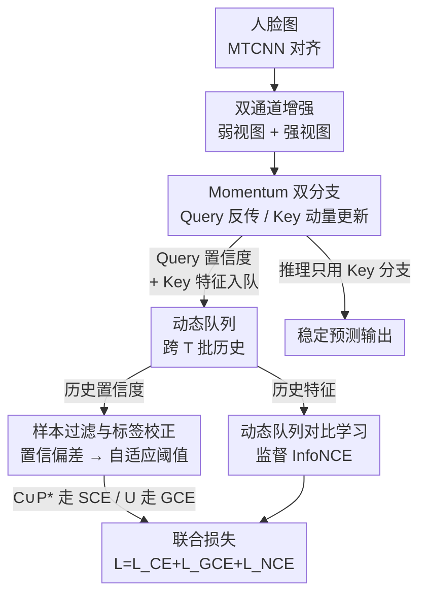

# D³FER: Dual Channel and Dual Branch Network for Robust Facial Expression Recognition under Dual Challenges

**会议**: CVPR 2026  
**论文**: [CVF Open Access](https://openaccess.thecvf.com/content/CVPR2026/html/Tang_D3FER_Dual_Channel_and_Dual_Branch_Network_for_Robust_Facial_CVPR_2026_paper.html)  
**代码**: https://github.com/D3FER/D3FER  
**领域**: 人体理解 / 面部表情识别  
**关键词**: 面部表情识别, 标签噪声, 动量对比学习, 动态队列, 鲁棒性  

## 一句话总结
针对野外面部表情识别同时遭遇「视觉扰动（遮挡/姿态）+ 标签噪声」的复合难题，D³FER 用弱/强双通道增强喂一个 Query-Key 动量双分支，并在一个跨批次的动态队列里既缓存置信度做自适应阈值的样本过滤与标签校正、又缓存特征做监督对比学习，推理时用更平滑的 Key 分支，在 RAF-DB/FERPlus/AffectNet 及其遮挡/姿态/噪声子集上全面刷新 SOTA。

## 研究背景与动机
**领域现状**：野外 FER 早已从受控实验室转向真实场景，主流方法分两条线——一条用注意力/频域/多模态先验对抗遮挡与姿态（如 POSTER、DAN、ORSANet），另一条用置信度重加权、邻域软标签、双网络分歧建模等手段对抗标注噪声（如 LA-Net、ReSup、NLA）。对比学习近年也被引入 FER 以学到更判别的表情嵌入。

**现有痛点**：这两类挑战在真实数据里是**同时发生**的——同一张图既可能被遮挡又可能被标错。但绝大多数方法只孤立处理其中一个：抗扰动的方法默认标签是干净的，抗噪声的方法又忽略了视觉退化会模糊类间边界、放大类内方差。两者耦合时，鲁棒性显著下滑。

**核心矛盾**：视觉扰动和标签噪声会**相互放大**。扰动让特征本身不可靠 → 基于预测置信度的噪声判别更容易误判；而错误的监督又会让对比学习把脏样本拉进错误的类簇，进一步腐蚀特征空间。单从一个批次估计噪声阈值还会受类别不均衡与训练抖动影响，阈值本身就不稳。

**本文目标**：在一个统一框架里同时（a）可靠地识别并纠正脏标签，（b）在脏标签存在下仍能学到紧致可分的表情特征，（c）让推理输出稳定不随单批噪声抖动。

**切入角度**：作者借鉴 MoCo 的动量编码器 + 记忆队列思想，但把队列从「只存负样本特征」扩展成「同时存跨批次的置信度 + 特征」——前者用来做噪声阈值的稳健统计，后者用来做监督对比，二者共享同一个动量稳定的 Key 分支。

**核心 idea**：用一个**动态队列**把「噪声估计」和「对比学习」统一起来——队列里的历史置信度让噪声阈值不再被单批次抖动绑架，队列里的历史特征让对比学习有充足且稳定的负样本，再配合动量 Key 分支同时稳住两件事。

## 方法详解

### 整体框架
D³FER 的输入是一张人脸图，先经 MTCNN 检测对齐裁到 $3\times224\times224$，然后走「双通道增强 + 双分支编码 + 动态队列 + 三损失联合优化」的管线，输出表情类别。

整体上：每张图被弱增强 $x_i^W$ 和强增强 $x_i^S$ 两个视图。模型有结构相同的两套编码器+分类器——Query 分支 $(f^Q, g^Q)$ 走反向传播更新，Key 分支 $(f^K, g^K)$ 用 Query 参数的动量滑动平均更新。一个长度为 $L$、跨最近 $T$ 个批次的动态队列同时缓存三类东西：Query 分支在强/弱通道下的分类置信度 $\{p_i^{S,Q}\}$、$\{p_i^{W,Q}\}$，以及 Key 分支对强增强样本提取的特征 $\{h_i^{S,K}\}$。置信度那部分喂给「样本过滤+标签校正」算自适应噪声阈值，把每个样本分成干净集 $\mathcal{C}$、不确定集 $\mathcal{U}$、噪声集 $\mathcal{P}$（噪声集再纠错成 $\mathcal{P}^*$）；特征那部分喂给监督对比学习。最后干净/纠错样本走对称交叉熵、不确定样本走 GCE、对比项走 InfoNCE，三者等量相加联合训练。推理时只用稳定的 Key 分支出结果。

### 关键设计

**1. 动态队列：把噪声估计和对比学习挂在同一块跨批次记忆上**

痛点直击：很多 FER 方法只从**单个训练批次**估计噪声阈值，对统计抖动极敏感，类别不均衡时阈值更不可信。D³FER 让一个动态队列保存最近 $T$ 个批次的历史信息，总长度 $L$。与 MoCo 只缓存 Key 特征不同，这里队列里同时塞三行：强/弱两通道的 Query 置信度 $\{p_i^{S,Q}\}$、$\{p_i^{W,Q}\}$，以及 Key 分支对强增强样本的特征 $\{h_i^{S,K}\}$，其中 $p_i^{W,Q}=g^Q(f^Q(x_i^W))$、$p_i^{S,Q}=g^Q(f^Q(x_i^S))$、$h_i^{S,K}=f^K(x_i^S)$。

为什么有效：置信度行让噪声阈值从「多批历史」上做类内平均，天然平滑掉单批抖动和类别不均衡；特征行给对比学习提供了远超单批 batch 的负样本规模。两条线共享同一个队列、同一个动量 Key 分支，使得「判脏」和「拉特征」用的是同一份稳定表征，避免两套机制各算各的、互相打架。

**2. 基于置信偏差的样本过滤与标签校正：跨批阈值把样本三分**

痛点：要纠错先得稳健地判断「哪个样本可能标错」。作者定义**置信偏差** $\bar{z}=\max(p)-z_{y_i}$，即最大类置信度与目标类 $y_i$ 置信度之差——偏差为 0 说明目标类就是最高分（很可能标对），偏差越大说明非目标类抢了风头（越可能是脏标签）。

机制：在动态队列里，对每个类 $c$ 按两通道分别算类内平均置信偏差作为自适应阈值：

$$\tau_c^{S,Q}=\frac{1}{|D_c|}\sum_{i\in D_c}\bar{z}_i^{S,Q},\qquad \tau_c^{W,Q}=\frac{1}{|D_c|}\sum_{i\in D_c}\bar{z}_i^{W,Q}$$

其中 $D_c$ 是队列里真值标签为 $c$ 的样本集合。判别时：只要样本在强或弱**任一通道**的置信偏差低于对应阈值，就并入干净集 $\mathcal{C}=\{\bar{z}_i^{S,Q}<\tau_{y_i}^{S,Q}\}\cup\{\bar{z}_i^{W,Q}<\tau_{y_i}^{W,Q}\}$（取并集是因为只要有一个视图认它干净就保守保留）。噪声集 $\mathcal{P}$ 则用两通道**平均**后的偏差超过 $\max(\bar\tau,\sigma)$ 来判定（$\sigma$ 是安全下限超参，防止过拟合时阈值被压得太小而漏判），剩下的归入不确定集 $\mathcal{U}=D\setminus(\mathcal{C}\cup\mathcal{P})$。噪声样本按两通道置信度之和取 argmax 重新打标签：$y_i^*=\arg\max_c(z_c^{S,Q}+z_c^{W,Q})$，与干净集合成混合训练集 $\mathcal{M}=\mathcal{C}\cup\mathcal{P}^*$。

为什么有效：相比固定阈值或单批动态阈值，跨批 + 双通道 + 类内统计三重平滑让阈值更稳；用「置信偏差」而非绝对置信度，对类别整体置信度水平的差异更不敏感。

**3. 基于动态队列的监督对比学习：用标签构造正负对，把脏特征挡在队列外**

痛点：MoCo 这类无监督对比靠数据增强构造正负对，捕捉不到 FER 里细微的表情语义差异；而视觉扰动恰恰模糊类间边界、放大类内方差。作者改成**监督**对比：当前批 Query 弱增强特征 $H^Q=\{h_i^{W,Q}\}$ 去和队列里 Key 强增强历史特征 $H^K=\{h_i^{S,K}\}$ 对齐，同标签为正、其余为负，用温度 $\epsilon=0.07$ 的 InfoNCE：

$$\mathcal{L}_{NCE}=-\frac{1}{|\hat H^Q|}\sum_{h_i^{W,Q}\in\hat H^Q}\log\frac{\sum_{y_l=y_i}\exp(\mathrm{sim}(h_i^{W,Q},h_l^{S,K})/\epsilon)}{\sum_{j}\exp(\mathrm{sim}(h_i^{W,Q},h_j^{S,K})/\epsilon)}$$

关键的防腐设计是两端用**不同**的过滤强度：队列侧 $\hat H^K$ 因为记忆机制会让纠错错误跨多批传播，所以采取保守策略，只保留确信干净集 $\mathcal{C}$ 的特征；当前批侧 $\hat H^Q$ 则用完整的混合集 $\mathcal{M}$（含纠错样本）。数据扰动来自强增强、模型扰动来自动量更新的 Key 分支，二者共同提升对比学习的多样性与稳定性。

为什么有效：标签监督直接逼出「类内紧致、类间可分」的嵌入，正好对冲视觉扰动带来的边界模糊；而对队列侧用更严的过滤，避免脏标签经记忆队列长期污染对比目标——这是把「纠错」和「对比」安全耦合的关键。

**4. 动量 Query-Key 双分支与 Key 分支推理：用时间平滑稳住训练与预测**

痛点：噪声批次会让参数剧烈抖动，单步模型的预测不稳。D³FER 让 Key 分支不走反传，而用 Query 参数的动量滑动平均更新：$\theta_{f^K}=m\theta_{f^K}+(1-m)\theta_{f^Q}$，$\theta_{g^K}=m\theta_{g^K}+(1-m)\theta_{g^Q}$（$m\in[0,1)$ 为动量系数）。这让 Key 分支保留长期优化趋势、平滑掉单批扰动，既稳住了队列里特征的一致性，也降低陷入局部最优的风险。

为什么有效：推理时直接用累积了历史动态的 Key 分支 $\hat p=g^K(f^K(x_i))$ 出预测，相当于做了一次隐式的时间集成，比用实时抖动的 Query 分支更平滑、更泛化——消融里把推理分支从 Query 换成 Key（表 1 第 2/6 行）在所有噪声水平上都稳定涨点。

### 损失函数 / 训练策略
按样本可靠性分而治之：混合集 $\mathcal{M}$（干净+纠错）用两通道对称交叉熵 $\mathcal{L}_{CE}=-\frac{1}{|\mathcal{M}|}\sum(\log p_{i,y_i}^{W,Q}+\log p_{i,y_i}^{S,Q})$；不确定集 $\mathcal{U}$ 用广义交叉熵 GCE（带参数 $\gamma$ 在 CE 的收敛性与 MAE 的抗噪性之间折中）$\mathcal{L}_{GCE}=\frac{1}{|\mathcal{U}|}\sum(\frac{1-(p_{i,y_i}^{W,Q})^\gamma}{\gamma}+\frac{1-(p_{i,y_i}^{S,Q})^\gamma}{\gamma})$；再加对比项。总目标 $\mathcal{L}=\mathcal{L}_{CE}+\mathcal{L}_{GCE}+\mathcal{L}_{NCE}$，因三项量级相当，作者**不引入额外加权系数**。backbone 用 MS-Celeb-1M 预训练的 ResNet-18，队列长度 $L=1024$、$\sigma=0.4$。

## 实验关键数据

### 主实验

干净野外数据集上与同用 ResNet-18 backbone 的 SOTA 对比（表 4，准确率 %）：

| 方法 | 年份 | RAF-DB | FERPlus | AffectNet-7 | AffectNet-8 |
|------|------|--------|---------|-------------|-------------|
| EAC | 2022 | 89.99 | 89.64 | 65.32 | — |
| ReSup | 2025 | 89.70 | 88.85 | 65.46 | — |
| NHG | 2025 | 90.09 | 88.94 | 65.14 | — |
| **D³FER** | 2025 | **90.71** | **89.86** | **66.00** | **62.38** |

合成标签噪声下与抗噪方法对比（表 3，准确率 %，节选）：

| 噪声 | 数据集 | ReSup | NLA | **D³FER** |
|------|--------|-------|-----|-----------|
| 10% | RAF-DB | 88.43 | 88.83 | **89.37** |
| 10% | AffectNet | 64.29 | 63.52 | **64.89** |
| 30% | RAF-DB | 86.86 | 86.71 | 86.41 |
| 30% | FERPlus | 86.74 | 86.97 | **87.57** |
| 30% | AffectNet | 62.89 | 62.48 | **63.34** |

遮挡/姿态子集（表 2，节选，准确率 %）：

| 子集 | 条件 | 前最佳 | **D³FER** |
|------|------|--------|-----------|
| Occlusion-RAF-DB | 遮挡 | 86.12 (CC-KD) | **87.48** (+1.36) |
| Occlusion-FERPlus | 遮挡 | 86.61 (DSAN) | **87.60** |
| Occlusion-AffectNet | 遮挡 | 62.98 (VTFF) | **63.10** |
| Pose-AffectNet | Pose>45° | 61.32 (DSAN) | **61.93** |

### 消融实验
RAF-DB 在 0%–30% 对称噪声下评三大组件（表 1，SL=样本过滤与标签校正，CL=对比学习，IB=推理分支，准确率 %）：

| SL | CL | IB | 0% | 10% | 20% | 30% |
|----|----|----|----|----|----|----|
| ✗ | ✗ | Query | 88.75 | 84.75 | 81.45 | 79.40 |
| ✗ | ✗ | Key | 89.51 | 84.93 | 81.76 | 79.66 |
| ✓ | ✗ | Query | 89.66 | 86.92 | 85.16 | 81.91 |
| ✗ | ✓ | Query | 89.92 | 86.73 | 84.45 | 81.37 |
| ✓ | ✓ | Query | 90.38 | 89.11 | 86.95 | 86.05 |
| ✓ | ✓ | Key (Full) | **90.71** | **89.37** | **87.29** | **86.41** |

### 关键发现
- **SL 在高噪声下贡献最大**：单加样本过滤+标签校正（第 3 行）在 30% 噪声把 79.40→81.91；而单加对比学习（第 4 行）虽在干净数据涨点，但随噪声升高掉得更快——脏标签会扭曲嵌入空间，说明 CL 必须配 SL 才稳。
- **两模块互补、协同最强**：SL+CL（第 5 行）在 30% 噪声把单模块的 ~81% 拉到 86.05%，远超二者单独之和的线性预期，印证「干净标签」与「结构化特征」互相强化。
- **Key 分支推理是稳定的免费午餐**：仅把推理从 Query 换 Key（第 1↔2、5↔6 行），各噪声水平稳定 +0.2~0.4，靠的是动量平滑掉噪声批抖动。
- **超参 sweet spot**：队列 $L=1024$ 时最佳（太小限制对比多样性与噪声估计稳定性，太大引入陈旧错位特征）；$\sigma=0.4$ 在 RAF-DB/FERPlus 上呈一致单峰（太小过度过滤干净样本，太大漏判明显噪声）。
- **鲁棒性突出**：RAF-DB 噪声从 10%→30% 仅掉 2.96%，而 baseline 掉超过 5%。

## 亮点与洞察
- **一个队列同时服务两件事**：把跨批次置信度和特征塞进同一个动态队列，让「噪声阈值估计」和「对比负样本池」共享同一份动量稳定表征——这是统一两类挑战的结构性巧思，而不是简单把两个 loss 拼一起。
- **置信偏差 $\bar z=\max(p)-z_{y_i}$ 比绝对置信度更鲁棒**：它衡量「目标类被别人压过多少」，天然消掉了不同类整体置信度水平的差异，是个可迁移到任何带噪分类任务的判脏信号。
- **双端不对称过滤**：队列侧只放确信干净样本、当前批侧放含纠错的混合集——精准识别出「记忆机制会让纠错错误跨批传播」这个隐患并对症下药，是把纠错与对比安全耦合的点睛之笔。
- **三损失等量不调权**：作者直接说三项量级相当所以不加权，省掉了一个常见的调参黑洞，工程上很友好。

## 局限与展望
- 论文承认的局限较少，结论里主要强调成效；FERPlus 大姿态（Pose>30°/45°）上仍略逊于 DSAN，30% 噪声 RAF-DB 也未夺第一，说明在「纯姿态」或「极端噪声 + 特定数据集」的边角场景上并非全面碾压。
- ⚠️ 训练/推理完整伪代码、数据集与可视化细节作者都放进了 supplementary，正文未给，复现需查补充材料。
- 自己的观察：方法依赖弱/强增强构造可靠的双通道置信度，增强策略的选择对阈值统计影响应该不小，但正文没消融增强方案；动态队列引入 $L$、$T$、$\sigma$、$m$、$\gamma$ 多个超参，跨数据集迁移时的调参成本值得关注。
- 改进思路：可探索把置信偏差与不确定集 $\mathcal{U}$ 做更细粒度的课程式调度，或把动态队列扩展到多模态（如加入 landmark/文本先验）以进一步压低大姿态场景的失分。

## 相关工作与启发
- **vs MoCo**：MoCo 的队列只缓存 Key 特征做无监督对比；D³FER 把队列扩成「置信度 + 特征」双用途，并改成**有监督**对比（用表情标签构造正负对），更适配 FER 的细粒度语义。
- **vs 单批阈值的抗噪方法（如部分动态阈值法）**：它们从单个 batch 估噪声阈值，受抖动和类别不均衡影响大；D³FER 用跨 $T$ 批历史 + 类内平均的自适应阈值，稳健得多。
- **vs FENN / NHG（同样号称联合处理双挑战）**：D³FER 在 RAF-DB/FERPlus/AffectNet 四个设置上全面超过 NHG（如 RAF-DB 90.71 vs 90.09），靠的是动态队列把噪声估计与对比学习真正打通，而非两套机制松散叠加。

## 评分
- 新颖性: ⭐⭐⭐⭐ 把动态队列同时用于噪声阈值估计与监督对比、双端不对称过滤是有辨识度的结构设计，但基础组件（MoCo 动量、GCE、置信度纠错）多为已有零件的精巧组合。
- 实验充分度: ⭐⭐⭐⭐⭐ 三数据集 × 干净/遮挡/姿态/合成噪声多设置全覆盖，组件消融 + 队列长度/σ 敏感性都给了，证据链完整。
- 写作质量: ⭐⭐⭐⭐ 动机与方法叙述清晰、公式完整，但关键的训练/推理流程与可视化压进了 supplementary，正文略显单薄。
- 价值: ⭐⭐⭐⭐ 直击野外 FER「扰动+噪声」复合痛点且全面 SOTA，ResNet-18 backbone 工程落地友好，对智能座舱/情感计算等实用场景价值明确。

<!-- RELATED:START -->

## 相关论文

- [\[CVPR 2026\] A Two-Stage Dual-Modality Model for Facial Expression Recognition](a_two_stage_dual_modality_model_for_facial_expression_recognition.md)
- [\[CVPR 2026\] Dynamic Label Noise Suppression with Optimal Teacher Pool for Facial Expression Recognition](dynamic_label_noise_suppression_with_optimal_teacher_pool_for_facial_expression_.md)
- [\[CVPR 2026\] HSI-GPT2: A Dual-Granularity Large Motion Reasoning Model with Diffusion Refinement for Human-Scene Interaction](hsi-gpt2_a_dual-granularity_large_motion_reasoning_model_with_diffusion_refineme.md)
- [\[CVPR 2026\] CLEX: Complementary Label Exchange Learning for Noisy Facial Expression Recognition](clex_complementary_label_exchange_learning_for_noisy_facial_expression_recogniti.md)
- [\[CVPR 2026\] EventGait: Towards Robust Gait Recognition with Event Streams](eventgait_towards_robust_gait_recognition_with_event_streams.md)

<!-- RELATED:END -->
