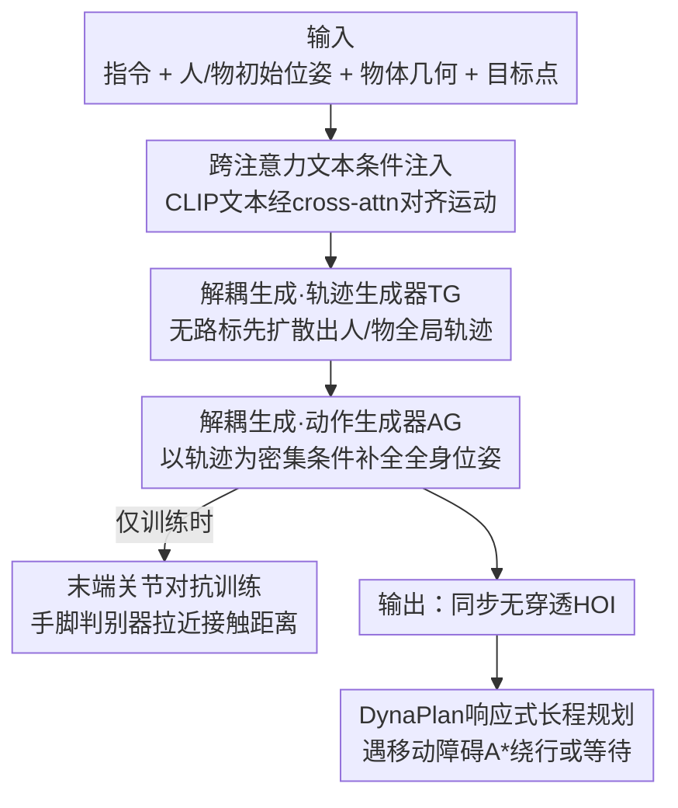

# Decoupled Generative Modeling for Human-Object Interaction Synthesis

**会议**: CVPR 2026  
**论文**: [CVF Open Access](https://openaccess.thecvf.com/content/CVPR2026/html/Jung_Decoupled_Generative_Modeling_for_Human-Object_Interaction_Synthesis_CVPR_2026_paper.html)  
**代码**: 未公开  
**领域**: 人体理解 / 运动生成 / 扩散模型  
**关键词**: 人物交互合成, 运动生成, 扩散模型, 对抗训练, 轨迹规划  

## 一句话总结
DecHOI 把"人-物交互合成"拆成两个轻量扩散专家——轨迹生成器先无需人工路标地规划人和物体的全局路径，动作生成器再在路径条件下补全细粒度全身动作，并用一个只盯手脚末端关节的对抗判别器拉近接触真实度，在 FullBodyManipulation 和 3D-FUTURE 上多数指标超过 CHOIS/HOIFHLI，且支持遇到移动障碍时实时重规划。

## 研究背景与动机

**领域现状**：人-物交互合成（HOI synthesis）要在给定文本指令、人和物体的初始位姿、以及目标点之后，生成一段人把物体搬到目标位置的合理 4D 动作序列。当前主流做法（CHOIS、HOIFHLI、OMOMO）是用一个扩散模型，同时以"文本指令 + 稀疏 3D 路标（waypoints）+ 初始人/物状态"为条件，一口气去噪出人和物体的整段运动。

**现有痛点**：这一范式有两个具体毛病。其一是**强依赖人工路标**——推理时用户不仅要给起点和目标点，还得手动在中间标若干路标点让人去跟随；这既增加了用户负担，又把模型的生成空间收窄、削弱了自主性。其二是**单网络优化复杂度爆炸**——HOI 要求模型在每一帧同时解出人的位姿和物体的位姿，把"轨迹 + 姿态 + 接触"所有目标全压到一个去噪网络上，优化难度极高，实际训练常陷入大量局部极小，产物表现为人物不同步、物体悬浮（hovering）、手脚穿模（penetration）。

**核心矛盾**：把一个本该分层（先想去哪、再想怎么动）的任务塞进单一网络，导致全局路径规划和细粒度动作合成互相干扰，损失曲面崎岖、收敛不稳。

**本文目标**：设计一种更简单、灵活、信息充分的中间表征，既能去掉人工路标、又能降低单网络的优化负担，还要保证生成动作忠实于指令、接触真实。

**切入角度**：作者观察到轨迹规划和动作合成是两个不同性质的子问题——前者关心"人和物从哪到哪"的低维全局路径，后者关心"每个关节怎么动、手怎么贴住物体"的高维细节。把它们交给两个各管一摊的专家网络，各自的优化目标都更纯粹，损失曲面也更平滑。

**核心 idea**：用"轨迹生成 + 动作生成"两阶段解耦来替代单网络联合建模，再叠一个专盯末端关节的对抗判别器来修接触，用密集轨迹条件代替人工稀疏路标。

## 方法详解

### 整体框架
DecHOI 是一个两阶段解耦的扩散框架。输入是文本指令、物体几何（用 Basis Point Set 表示）、人和物体的初始位姿、以及目标点；输出是一整段同步、接触真实、无穿透的人-物交互动作。整条管线先由**轨迹生成器（TG）** 在没有任何中间路标的前提下，扩散出物体和人的全局 3D 路径；再把这两条路径当作密集条件喂给**动作生成器（AG）**，由它补全物体的完整位姿和人的全身关节运动，最后用 SMPL-X 重建出人体网格。训练阶段额外接一个**末端关节对抗判别器**，只看手脚关节相对物体表面的接触动态，逼 AG 把接触做实。作为应用层，**DynaPlan** 在长序列动态场景里给系统加上碰撞检测和 A* 响应式重规划，让人在遇到移动障碍时能绕行或等待。

### 关键设计

**1. 解耦生成建模：把单网络拆成轨迹专家 TG 和动作专家 AG**

这一设计直接针对"单网络同时解人和物每一帧位姿、优化复杂度爆炸"的痛点。两个生成器都是预测干净序列 $\hat{x}_0$ 而非噪声的条件扩散网络（实测对运动数据更稳，也方便在每个去噪步施加引导损失），训练损失为 $L = \mathbb{E}_{x_0, n\sim[1,N]}\|\hat{x}_0 - x_0\|_1$。TG 接收物体位姿序列 $P_o \in \mathbb{R}^{T\times 12}$（每帧含 3D 位置 + 9 参数相对旋转矩阵）和人位姿序列 $P_h \in \mathbb{R}^{T\times D_h}$，关键技巧是**保持起始帧的人/物位姿干净、并把末帧物体位置也保持干净来锚定目标点**，其余帧加噪后与几何嵌入拼成条件 $X$，扩散出连续的物体路径 $\hat{T}_o \in \mathbb{R}^{T\times 3}$ 和人路径 $\hat{T}_h \in \mathbb{R}^{T\times 3}$——整个过程不需要任何人工中间路标，路径靠指令本身长出来（如"抬起椅子、搬动、放下"，物体轨迹会在前段升高、靠近目标时下降）。AG 收到和 TG 完全相同的输入 $X$，唯一区别是把所有 $T$ 帧的物体全局位置和人根节点位置替换成 TG 生成的轨迹，于是它得到的是"密集轨迹先验"而非稀疏路标，学习目标被大幅简化，只需聚焦补全 $\hat{P}_o \in \mathbb{R}^{T\times 12}$ 和 $\hat{P}_h \in \mathbb{R}^{T\times D_h}$ 的精细位姿。这种分工让每个分支的优化目标都更纯粹——论文用损失曲面可视化佐证：CHOIS 单网络的曲面崎岖、局部极小密布，DecHOI 的曲面平滑、收敛更稳。

**2. 跨注意力文本条件注入：让指令真正对齐到运动**

前作（CHOIS、HOIFHLI）把 CLIP 文本嵌入沿序列维度直接拼接到运动特征上，这种"贴在旁边"的注入方式语义对齐弱。DecHOI 改用 **cross-attention 层显式地把文本嵌入 $F_{text} \in \mathbb{R}^D$ 与运动特征做交叉注意力**，让每一帧运动都能去"查询"指令里的语义意图，从而把"先抬、再搬、后放"这类动词序列更准确地映射到轨迹和动作的时序结构上。消融里它单独把 R-precision（文本-动作对齐 top-3）从 0.67 提到 0.70，证明语义传递确实更强；代价是单独用时会略微削弱接触正则（CF1 下降），所以它必须和对抗训练配合才能两头都好。

**3. 末端关节对抗训练：用手脚判别器把接触做实**

人级别交互的关键在手和脚的精确控制，但扩散模型生成的手脚常飘在空中或插进物体里。作者抓住一个朴素观察：**判断交互真假最可靠的线索，就是末端关节（手、脚）到物体表面的距离**——真值里因为完整接触这个距离很小，生成结果往往留有明显间隙。于是设计一个紧凑判别器 $\mathcal{D}$，只吃手 $H \in \mathbb{R}^{T\times 2\times 3}$、脚 $F \in \mathbb{R}^{T\times 2\times 3}$（由 6D 关节旋转前向运动学算出的全局坐标）以及从物体几何采样并逐帧施加相对旋转平移的 $M$ 个表面点 $B'$。判别器用 hinge 损失训练，逐帧打分 $s_t^{(r)} = \mathcal{D}(x)_t$（真）、$s_t^{(f)} = \mathcal{D}(\hat{x})_t$（假）：

$$L_{\mathcal{D}} = \frac{1}{T}\sum_{t=1}^{T}\Big([1 - s_t^{(r)}]_+ + [1 + s_t^{(f)}]_+\Big), \qquad L_{G} = -\frac{1}{T}\sum_{t=1}^{T} s_t^{(f)}.$$

判别器收敛后，AG 通过最小化 $L_G$ 去骗过它，等价于一个**驱动接触趋向完整的正则项**。为进一步稳住末端关节，训练还加了前向运动学损失 $L_{FK} = \|\hat{H}_0 - H_0\|_1 + \|\hat{F}_0 - F_0\|_1$ 直接监督手脚全局位置。消融显示加入对抗训练把手-物穿透 $P_{hand}$、体-物穿透 $P_{body}$ 明显压低。

**4. DynaPlan：响应式长程动态规划**

前作只能在静态场景里做长序列交互。DynaPlan 给"人"和"移动对手方"都套上圆形影响半径，当两者区域相交即判定潜在碰撞；一旦检测到碰撞，就用 **A* 重规划**，自适应地选择短距绕行或原地等待，以维持目标导向且无碰撞的运动。为应对对手未来路径的不确定性，它用一个预训练的轨迹预测网络去预测对手走向，再据此规划。这把 DecHOI 从"一次性规划好就执行"升级成"边走边根据环境变化更新计划"，但仍保持高层意图（把物体搬到目标）不变。

### 损失函数 / 训练策略
TG 与 AG 用不同目标分阶段训练。TG 只管规划，重构干净轨迹 $L_{TG} = \mathbb{E}\|\hat{T}_0 - T_0\|_1$；AG 在轨迹保持干净的条件下重构整段运动 $L_{AG} = \mathbb{E}\|\hat{P}_0 - P_0\|_1$，并叠加末端关节的前向运动学损失 $L_{FK}$。生成器总目标把重构项和对抗项加权合并：

$$L = \lambda_{TG} L_{TG} + \lambda_{AG} L_{AG} + \lambda_{FK} L_{FK} + \lambda_G L_G.$$

推理阶段沿用重构引导（reconstruction guidance），在每个去噪步注入约束而无需为特定目的重训：$\tilde{P}_0 = \hat{P}_0 - \alpha \Sigma_n \nabla_{P_n} F(\hat{P}_0)$，其中正则目标 $F$ 一边惩罚末端关节到物体表面的距离以保证接触精确，一边压制脚关节偏离地面以防悬浮和穿透，$\alpha$ 控制扰动强度。

## 实验关键数据

### 主实验
在 FullBodyManipulation（约 10 小时、15 类刚体）上，所有 baseline 都在"无中间路标"的公平设置下评测。DecHOI 在条件匹配、运动质量、交互质量、与真值差异四类指标的多数项上领先（↓ 越低越好，↑ 越高越好，→ 越接近真值越好；真值 DIV 参考为 9.02）：

| 方法 | $T_s$↓ | $T_e$↓ | FID↓ | R-prec↑ | DIV→ | $C_{F1}$↑ | $P_{hand}$↓ | MPJPE↓ |
|------|------|------|------|------|------|------|------|------|
| Pred-OMOMO | 2.34 | 9.66 | 13.01 | 0.63 | 6.68 | 0.52 | 0.59 | 23.63 |
| CHOIS | 1.92 | 8.01 | 1.58 | 0.68 | 8.31 | 0.58 | 0.66 | 18.86 |
| HOIFHLI | 1.73 | 7.65 | 2.06 | 0.62 | 8.55 | 0.64 | 0.58 | 19.31 |
| **DecHOI** | **1.59** | **6.91** | **0.33** | **0.72** | **8.86** | **0.67** | **0.53** | **15.27** |

最醒目的是 FID 从 CHOIS 的 1.58 降到 0.33、物体平移误差 $T_{obj}$ 从 ~51 降到 22.96，说明解耦后生成分布与真值大幅靠拢、轨迹精度显著提升。在 3D-FUTURE 未见物体上（替换 17 个测试物体为同类别的全新家具模型），DecHOI 同样保持优势，FID 1.01 对 CHOIS 的 2.04，接触百分比 C% 0.48 对 0.46，证明对未见几何的泛化能力。

### 消融实验
在 FullBodyManipulation 上拆解各模块（Baseline = 仅解耦建模 + 文本沿序列轴拼接）：

| 配置 | $T_e$↓ | R-prec↑ | $C_{F1}$↑ | $P_{hand}$↓ | $P_{body}$↓ | 说明 |
|------|------|------|------|------|------|------|
| Baseline | 7.92 | 0.67 | 0.65 | 0.58 | 0.60 | 高穿透、接触一致性有限 |
| w/ 对抗训练 | 7.78 | 0.64 | 0.66 | 0.53 | 0.57 | 穿透明显下降，R-prec 略降 |
| w/ 跨注意力 | 7.82 | 0.70 | 0.54 | 0.56 | 0.56 | 语义对齐增强，交互质量略降 |
| **DecHOI（全量）** | **6.91** | **0.72** | **0.67** | **0.53** | **0.54** | 两模块互补，全面最优 |

### 关键发现
- **对抗训练和跨注意力是互补的一对**：单独加对抗训练能压低穿透但削弱文本对齐（R-prec 降到 0.64），单独加跨注意力能提升对齐但削弱接触正则（CF1 跌到 0.54）；两者合起来才同时把 R-prec、CF1、穿透三项都拉到最好——这解释了为什么二者必须共存。
- **解耦本身是降优化复杂度的根因**：损失曲面可视化里 CHOIS 单网络崎岖、局部极小密布，DecHOI 平滑、收敛稳，定性验证了"两个轻量专家各管一摊"的有效性。
- **长程动态场景全面占优**：在约 190 个室内长序列场景的 DynaPlan 上，DecHOI 相比 CHOIS 在轨迹误差和全部穿透指标（含人/物与静态场景碰撞 $P_{o\to s}$、$P_{h\to s}$）上都更低，能在杂乱室内维持无碰撞轨迹。
- **人类感知偏好一致**：AMT 上 200 名被试在文本对齐和交互质量两项上都以约 67–71% 的比例偏好 DecHOI 而非 CHOIS/HOIFHLI。

## 亮点与洞察
- **"先规划后动作"的解耦是把高维联合问题降维的关键**：把全局路径（低维）和精细动作（高维）分开，每个分支优化目标更纯，损失曲面更平滑——这个"分层"思路可迁移到任何需要同时解全局结构和局部细节的生成任务（如轨迹+步态、构图+渲染）。
- **判别器只盯"末端关节到物体表面距离"这一物理线索极其聪明**：不需要复杂接触标注，抓住"真值接触距离小、生成结果有间隙"这一最朴素判据，就把对抗训练变成了一个接触完整性正则，且判别器紧凑、只看手脚，训练代价低。
- **用密集轨迹条件替代稀疏人工路标**：TG 生成的连续路径直接当 AG 的密集条件，既去掉了用户标路标的负担，又给 AG 提供了比稀疏 waypoint 强得多的先验，是"用模型自产的中间表征喂下游"的范例。
- **末帧物体位置保持干净来锚定目标点**：一个很巧的条件设置——不需要额外的目标损失，靠"哪些帧加噪、哪些帧干净"就把起点/终点约束注入扩散，值得借鉴。

## 局限与展望
- 作者明确只处理**刚体交互**，训练时排除了带关节的（articulated）物体，对可变形/铰接物体（开抽屉、揉布料）尚不适用。
- 大量关键定量分析（更多消融、对抗采样点数 $M$ 的敏感性、DynaPlan 细节）被放进 supplementary，正文可复现信息有限。⚠️ 部分超参（$\lambda$ 权重、采样点 $M$、判别器结构细节）正文未给具体数值，以原文/附录为准。
- DynaPlan 依赖一个**预训练的轨迹预测网络**来预测对手未来路径，其鲁棒性受该外部预测器精度限制；若对手运动高度不可预测，A* 重规划的有效性可能下降。
- 评测仍局限在室内、单对手方场景，多对手方密集动态环境、户外大场景未验证。

## 相关工作与启发
- **vs CHOIS / HOIFHLI**：它们用单网络 + 稀疏 3D 路标条件来生成长程 HOI，推理需用户手标中间路标，且把轨迹/姿态/接触全压在一个去噪网络里；DecHOI 把它拆成 TG+AG 两个专家、去掉人工路标，并用密集轨迹做条件，优化更稳、FID 从 1.58 降到 0.33。区别核心在"单网络联合 vs 两阶段解耦"。
- **vs OMOMO**：OMOMO 逐帧条件于完整物体运动来合成操作，信息需求高；在本文"极有限输入"设置下它运动与交互质量都明显落后，说明强依赖逐帧物体条件的范式不够灵活。
- **vs NIFTY / CG-HOI**：NIFTY 用学到的交互场引导采样靠近接触流形，CG-HOI 用接触线索联合生成人物运动——都仍是"固定计划 + 引导"且偏静态；DecHOI 的差异在于既用对抗训练直接正则接触，又通过 DynaPlan 支持推理时更新计划、适应场景变化。
- **vs 单人运动生成（MDM / OmniControl / MoMask）**：这些只生成单人运动、既不操作物体也不感知场景；DecHOI 面向场景感知的人-物交互，要同时避障并按指令操控物体。

## 评分
- 新颖性: ⭐⭐⭐⭐ 解耦轨迹/动作 + 末端关节对抗判别器的组合在 HOI 合成里是清晰且有效的新范式，但每个单点（解耦、对抗、cross-attn）都有迹可循。
- 实验充分度: ⭐⭐⭐⭐ 两数据集 + 长程动态 + 消融 + 200 人感知研究覆盖全面，但不少关键消融和超参细节被放进 supplementary。
- 写作质量: ⭐⭐⭐⭐ 动机—方法—实验逻辑清楚，损失曲面可视化有说服力；部分符号和指标定义偏密集。
- 价值: ⭐⭐⭐⭐ 去人工路标 + 降优化复杂度 + 响应式重规划，对动画/具身控制实用性强，解耦思路可迁移。

<!-- RELATED:START -->

## 相关论文

- [\[CVPR 2026\] ReGenHOI: Unifying Reconstruction and Generation for 3D Human-Object Interaction Understanding](regenhoi_unifying_reconstruction_and_generation_for_3d_human-object_interaction_.md)
- [\[CVPR 2026\] GenHOI: Towards Object-Consistent Hand-Object Interaction with Temporally Balanced and Spatially Selective Object Injection](genhoi_towards_object-consistent_hand-object_interaction_with_temporally_balance.md)
- [\[CVPR 2026\] RegFormer: Transferable Relational Grounding for Efficient Weakly-Supervised Human-Object Interaction Detection](regformer_transferable_relational_grounding_for_efficient_weakly-supervised_huma.md)
- [\[CVPR 2026\] IMU-HOI: A Symbiotic Framework for Coherent Human-Object Interaction and Motion Capture via Contact-Conscious Inertial Fusion](imu-hoi_a_symbiotic_framework_for_coherent_human-object_interaction_and_motion_c.md)
- [\[CVPR 2026\] Bézier Degradation Modeling for LiDAR-based Human Motion Capture](bézier_degradation_modeling_for_lidar-based_human_motion_capture.md)

<!-- RELATED:END -->
