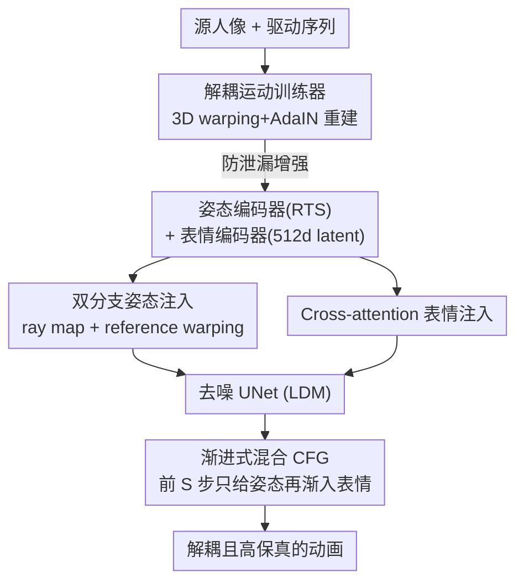

# DeX-Portrait: Disentangled and Expressive Portrait Animation via Explicit and Latent Motion Representations

**会议**: CVPR 2026  
**论文**: [CVF Open Access](https://openaccess.thecvf.com/content/CVPR2026/html/Shi_DeX-Portrait_Disentangled_and_Expressive_Portrait_Animation_via_Explicit_and_Latent_CVPR_2026_paper.html)  
**代码**: [项目主页](https://syx132.github.io/DeX-Portrait/)（代码状态待确认）  
**领域**: 人体理解 / 肖像动画  
**关键词**: 肖像动画, 姿态-表情解耦, 扩散模型, 显式运动表示, Classifier-Free Guidance

## 一句话总结
用「显式全局变换表示头部姿态 + 隐式 latent code 表示面部表情」的混合运动表示，配合双分支姿态注入与渐进式混合 CFG，让单图肖像动画首次做到姿态与表情**高保真解耦控制**，支持只改姿态或只改表情的精细编辑。

## 研究背景与动机

**领域现状**：单图肖像动画（one-shot portrait animation）给一张源人像 + 一段驱动视频，让源人像按驱动视频的头部运动和表情动起来。近两年主流是把预训练的扩散图像/视频生成模型（LDM、Animate Anyone 这套 reference UNet 范式）拿来微调，画质和表现力都很强。

**现有痛点**：这些扩散方法虽然画质高，却做不到**姿态和表情的解耦控制**——你想"只改表情、头别动"或者"只改头部姿态、表情保持源图"，它们做不到，因为姿态和表情信号在内部是纠缠的。SOTA 的 X-NeMo 把整段运动编码成一个 1D latent code，表情确实抓得很细（吐舌头、皱眉都能复现），但姿态（尤其是平移 translation 和缩放 scale）被一起塞进了这个 latent，控制不精确。另一条路是用 3DMM 的姿态/表情 blendshape 参数，天然解耦，但受限于 3DMM tracker 不准、blendshape 表达力有限，复杂细微表情抓不住。

**核心矛盾**：**表达力**和**解耦/可控性**之间的拉锯——隐式 latent 表达力强但纠缠，显式 3DMM 解耦但表达力弱。姿态本身是个低自由度的刚性全局变换，硬塞进高维 latent 既浪费又污染表情。

**本文目标**：做到既"表现力强"又"姿态-表情解耦"的肖像动画，支持 expression-only / pose-only 编辑。

**切入角度**：姿态和表情天生是两种不同性质的量——头部姿态是**刚性全局变换**（旋转/平移/缩放，自由度低），适合用显式参数表示；面部表情是**高维非刚性形变**，适合用隐式 latent。那就别用一种表示硬扛两者，**各用各的最合适的表示**。

**核心 idea**：姿态用显式 RTS（rotation-translation-scale）全局变换、表情用 512 维 latent code，分别训练两个互相解耦的编码器，再用各自最匹配的方式注入扩散模型（姿态走双分支空间注入、表情走 cross-attention）。

## 方法详解

### 整体框架
DeX-Portrait 分两步走。**第一步是 GAN-based 运动训练器**（motion trainer），目标只有一个：训出两个互不串扰的编码器——显式姿态编码器（输出 RTS 变换）和隐式表情编码器（输出 512 维 latent），靠 3D warping + AdaIN 重建 + 一套防泄漏增强来逼出解耦。**第二步是扩散动画生成器**：冻结上一步的两个编码器，用 latent diffusion model（LDM）+ reference UNet 范式，把驱动姿态用**双分支**注入、把驱动表情用 cross-attention 注入去噪 UNet，最后用**渐进式混合 CFG** 在去噪前几步先保结构、再加表情，稳住身份一致性。

输入：源人像 $I_s$ + 驱动序列 $\{I_d\}$；输出：身份/背景跟随源图、姿态和表情跟随驱动的动画序列。

### 关键设计

**1. 解耦运动训练器：用一个 GAN 重建任务把姿态和表情逼成两路互不泄漏的编码**

这一步解决"怎么得到干净解耦的姿态/表情信号"。训练器是一个 StyleGAN2-like 的重建 GAN，含三个编码器（3D 外观编码器、显式姿态编码器、隐式表情编码器）。姿态编码器（ConvNeXt 实例化）输出一个 6 自由度的全局变换 $\mathbf{P}=\begin{bmatrix} s\mathbf{R} & \mathbf{t}\end{bmatrix}\in\mathbb{R}^{3\times4}$（旋转 3 + 平移 2 + 缩放 1），自由度低本身就让姿态分量装不下表情信息；表情编码器（FAN 实例化）输出 512 维 latent。重建时：从源图编 3D 外观特征，用 $\mathbf{P}_d\mathbf{P}_s^{-1}$ 把它从源姿态 warp 到驱动姿态，再用表情 latent 通过 **AdaIN** 调制生成器，产出动画图与 GT 对比。这样姿态走"几何 warp"、表情走"AdaIN 风格调制"，两条路在结构上就分开了。

**2. 姿态/表情增强：从输入端切断信息泄漏，保证编码器真的解耦**

光靠网络结构还不够——表情编码器吃的是整张人脸图，会顺手把头部姿态偷学进去；姿态输入也可能漏进表情。本设计在**输入图像层面**做针对性增强（对应整体框架里训练器的"防泄漏增强"边）：对姿态输入，用 MediaPipe landmark 把眼睛和嘴巴区域遮掉，消除大部分表情信息；对表情输入，先随机旋转或换视角（多视角数据集才有）让表情编码器对头部旋转不敏感，再用 MediaPipe 包围盒裁出脸部并 resize 到固定 $224\times224$，消掉头部平移和缩放。一句话：让每个编码器只能"看到"它该负责的那部分信号，从源头逼出解耦。消融里去掉增强，姿态/表情一致性显著下降（见 Tab. 2）。

**3. 双分支姿态注入：ray map 管长程对应、reference warping 管边界对齐，两者互补**

把低自由度的 RTS 姿态塞进扩散模型，常规做法是渲成 2D 骨架图或球面再空间注入，但刻画不准头部姿态。本文用**两条分支**。第一条是 **ray map**：借鉴相机位姿控制里的 Plücker ray map，把头部姿态转成一张 ray map，公式为

$$\mathrm{RayMap}(u,v)=\mathbf{P}\,[u,v,0,0]^\top-[u,v,0,0]^\top,\quad (u,v)\in[-1,1]^2$$

每个像素是从标准姿态指向目标姿态的向量；把源、驱动两张 ray map 与噪声 latent 拼接，就能在源/驱动姿态差异很大（大角度旋转、大幅平移缩放）时仍精确控制并保身份。但作者发现只用 ray map 在 expression-only 编辑时会出现合成结果与原图的**边缘错位**（贴回原图有缝）。于是加第二条分支 **reference warping**：利用 LDM 本身具备的 3D 感知能力，把 reference UNet 里的 2D 源特征 reshape 成 3D、按姿态 warp 到驱动姿态、再 flatten 回 2D，经一层卷积投影后**逐元素加**到去噪 UNet 的 latent 特征上。因为 warp 后的源特征与去噪特征空间对齐，这条分支在 expression-only 场景下提供一个近似单位变换的稳健信号，消除接缝。两条分支一个保"远距离姿态变换下的全局一致"、一个保"局部边界对齐"，互补。

**4. 渐进式混合 CFG：去噪前几步先只给姿态把结构和身份立住，再逐步放进表情**

身份、姿态、表情三个条件在每个去噪步里纠缠，普通 CFG 在源人像侧脸等大幅姿态变化时容易身份漂移。作者分析 DDIM 采样发现：第一步里给全条件就能快速生成大致正确姿态的全局结构，而**只给姿态**的生成对身份一致性保护最强。于是设计渐进策略——总共 35 步 DDIM，前 $S=5$ 步**排除表情条件**只用姿态把结构/身份立稳，接下来 5 步把表情条件**线性渐入**，最后剩余步用全条件。形式上（$t$ 为去噪步、$\mathbf{c}|_{\text{exp}}$ 表示去掉表情的条件）：

$$\widetilde{\epsilon}_\theta^{*}=\begin{cases}\widetilde{\epsilon}_\theta(z_t,\mathbf{c}|_{\text{exp}};t) & 30<t\le35\\[2pt]\widetilde{\epsilon}_\theta(z_t,\mathbf{c}|_{\text{exp}};t)\tfrac{t-25}{5}+\widetilde{\epsilon}_\theta(z_t,\mathbf{c};t)\tfrac{30-t}{5} & 25<t\le30\\[2pt]\widetilde{\epsilon}_\theta(z_t,\mathbf{c};t) & t\le25\end{cases}$$

其中基础 CFG 用 $\widetilde{\epsilon}_\theta(z_t,\mathbf{c};t)=\omega\,\hat{\epsilon}_\theta(z_t,\mathbf{c};t)+(1-\omega)\hat{\epsilon}_\theta(z_t,\varnothing;t)$，CFG scale $\omega=2.5$。$S=5$ 是实验选出的甜点：太小身份不稳、太大表情跟不准（Fig. 6）。⚠️ 上面分段公式的步数区间（30/25 等）按原文 Eq.(5) 抄录，注意原文采样步从 35 递减计数。

### 损失函数 / 训练策略
三阶段训练，512×512 分辨率，联合用两个多视角数据集（NerSemble、ava-256）+ 两个野外单目数据集（PFHQ、VFHQ）：
1. **运动训练**：训出解耦的姿态/表情编码器，batch 112、lr $1\times10^{-4}$、200k iter。
2. **扩散训练**：冻结两个编码器，训 reference UNet 和去噪 UNet，batch 48、lr $1\times10^{-5}$、120k iter。
3. **时序训练**：只训时序模块，用 24 帧视频序列，batch 8、lr $1\times10^{-5}$、80k iter。
扩散主干用 LDM（DDPM 训练目标，MSE 预测噪声 $\mathcal{L}_\theta=\mathbb{E}_{\epsilon,t}\|\epsilon_t-\hat{\epsilon}_\theta(z_t,\mathbf{c};t)\|_2^2$），源身份经 reference UNet 注入。

## 实验关键数据

评测分三种场景：自重演（self-reenactment，有 GT，用 PSNR/SSIM/LPIPS）、跨重演（cross-reenactment，无 GT，用 CSIM 测身份、AED 测表情、APD 测姿态）、解耦重演（disentangled-reenactment，姿态和表情来自两段不同视频）。Benchmark 自建 150 张野外人像 + 150 段大幅姿态/表情视频。

### 主实验

| 场景 | 指标 | 本文 | 最强基线 | 对比 |
|------|------|------|----------|------|
| Self-Reenactment | PSNR↑ | **28.590** | Wan-Animate 27.970 | 最高 |
| Self-Reenactment | SSIM↑ | 0.862 | Wan-Animate **0.865** | 仅微弱落后 |
| Self-Reenactment | LPIPS↓ | **0.088** | Wan-Animate 0.098 | 最低 |
| Cross-Reenactment | CSIM↑ | **0.623** | Wan-Animate 0.551 | 身份最优 |
| Cross-Reenactment | AED↓ | **0.0515** | X-NeMo 0.0518 | 表情最准 |
| Cross-Reenactment | APD↓ | **0.145** | HelloMeme 0.173 | 姿态最准 |
| Disentangled-Reenact. | CSIM/AED/APD | **0.631 / 0.0546 / 0.100** | LivePortrait 0.458 / 0.0695 / 0.195 | 全面领先 |

在解耦重演里，X-NeMo、HunyuanPortrait、Wan-Animate 直接 "N/A"（不支持解耦），能解耦的 GAN 方法（LivePortrait、EMOPortraits）和 HelloMeme 各项指标都被本文大幅甩开。

### 消融实验

| 配置 | Cross CSIM↑ | Cross AED/APD↓ | Disent. CSIM↑ | Disent. AED/APD↓ | 说明 |
|------|------|------|------|------|------|
| w/o ray map | 0.609 | 0.0506 / 0.162 | 0.609 | 0.0542 / 0.105 | 去 ray map，姿态 APD 变差、身份掉 |
| w/o warping | 0.619 | 0.0507 / 0.166 | 0.631 | 0.0573 / 0.121 | 去 reference warping，表情边界出问题 |
| w/o augmentation | 0.619 | 0.0583 / 0.283 | 0.629 | 0.0634 / 0.168 | 去防泄漏增强，姿态 APD 暴涨（0.283/0.168） |
| **Ours (full)** | **0.623** | **0.0515 / 0.145** | **0.631** | **0.0546 / 0.100** | 完整模型各项最优 |

### 关键发现
- **防泄漏增强贡献最大**：去掉它后 cross-reenactment 的 APD 从 0.145 飙到 0.283（姿态准度几乎翻倍劣化），证明编码器解耦真正靠的是输入端切断泄漏，而非只靠网络结构。
- **ray map 与 reference warping 各司其职**：ray map 主管大幅姿态变化下的长程对应和身份一致（去掉后 APD 升到 0.162）；reference warping 主管 expression-only 编辑时的边界/背景对齐（去掉后会出现贴回原图的接缝，AED 也变差）——两者缺一不可，正好对应双分支设计动机。
- **$S=5$ 是 CFG 渐入的甜点**：前 5 步只给姿态立结构能稳住侧脸场景的身份，再渐入表情兼顾表情准度。
- 唯一被超过的指标是 self-reenactment 的 SSIM（0.862 vs Wan-Animate 0.865），差距极小，而 PSNR/LPIPS 都反超。

## 亮点与洞察
- **"按物理性质选表示"的思路很干净**：姿态是刚性低自由度量就用显式 RTS、表情是非刚性高维量就用 latent，避免了"一个 latent 硬扛两件事"的纠缠根源。这个"该显式的显式、该隐式的隐式"的拆分原则可迁移到任何"刚性全局 + 非刚性局部"耦合的可控生成任务。
- **从输入端做解耦增强**比在 loss 里加正则更直接：用 landmark 遮挡 + 裁剪 resize 物理性地"挖掉"不该看到的信息，让编码器没机会偷学，消融里这一项贡献最大，是个很实用的 trick。
- **双分支互补**揭示了一个细节：单一姿态注入要么牺牲长程一致、要么牺牲局部边界，把"全局 ray map 信号"和"局部 warp 对齐信号"叠加才两头都顾上，这种"一个分支管全局一个管局部"的拆法对位姿控制类任务有借鉴价值。
- **渐进式 CFG** 把"先定结构后填细节"的去噪先验显式化成条件调度，是稳身份的轻量 trick。

## 局限与展望
- 训练**重度依赖多视角数据**（NerSemble、ava-256）才能做表情增强里的"换视角"，纯单目场景下这条增强失效，解耦质量可能打折。⚠️ 论文未充分讨论无多视角数据时的退化程度。
- 三阶段训练 + GAN 训练器 + 扩散 + 时序，**pipeline 较重**，训练成本高（200k+120k+80k iter），复现门槛不低。
- 姿态用 6 自由度 RTS 全局变换，**无法表达局部非刚性头部形变**（如头发飘动、复杂遮挡），对"姿态"的定义偏刚体。
- 表情仍是单个 512 维全局 latent，**空间局部表情控制**（如只动左眼）能力受限，cross-attention 注入是全局的。
- 评测无 GT 的 cross/disentangled 场景靠 CSIM/AED/APD 等代理指标 + user study，⚠️ 这些指标对"解耦是否干净"只是间接度量。

## 相关工作与启发
- **vs X-NeMo**：X-NeMo 把姿态+表情塞进一个 1D latent，表情很强但姿态（尤其平移/缩放）控制不准且不可解耦；本文把姿态拆成显式 RTS、表情留 latent，既保表达力又拿回精确解耦控制，cross-reenactment APD 0.145 vs 0.551 是数量级的姿态精度差距。
- **vs LivePortrait / EMOPortraits（GAN 解耦派）**：它们能解耦但受限于 GAN 生成力，结果模糊、运动失真；本文用扩散主干拿到高保真，同时靠 GAN 训练器只负责"学解耦编码"而非"出图"，把 GAN 的解耦能力和扩散的画质各取所长。
- **vs 3DMM blendshape 派**：3DMM 天然解耦但 tracker 不准、blendshape 表达力弱，抓不住吐舌头/皱眉等细微表情；本文的隐式表情 latent 保留了这类细节表现力。
- **vs HelloMeme / Wan-Animate / HunyuanPortrait（扩散派）**：它们用 CLIP 或预训练表情编码器（LIA、MegaPortrait），表情编码不够精确且不支持解耦；本文自训精确解耦编码器并补齐解耦能力。

## 评分
- 新颖性: ⭐⭐⭐⭐⭐ 显式+隐式混合运动表示 + 双分支姿态注入，首次在扩散肖像动画里做到高保真姿态-表情解耦控制
- 实验充分度: ⭐⭐⭐⭐ 三场景、七基线、完整消融，但部分解耦评估依赖代理指标、无多视角退化分析
- 写作质量: ⭐⭐⭐⭐ 动机清晰、设计-消融一一对应，公式排版略有 OCR 噪声
- 价值: ⭐⭐⭐⭐⭐ expression-only / pose-only 精细编辑对数字内容创作实用价值高，解耦表示思路可迁移

<!-- RELATED:START -->

## 相关论文

- [\[CVPR 2025\] Sonic: Shifting Focus to Global Audio Perception in Portrait Animation](../../CVPR2025/human_understanding/sonic_shifting_focus_to_global_audio_perception_in_portrait_animation.md)
- [\[CVPR 2025\] MoEE: Mixture of Emotion Experts for Audio-Driven Portrait Animation](../../CVPR2025/human_understanding/moee_mixture_of_emotion_experts_for_audio-driven_portrait_animation.md)
- [\[CVPR 2026\] Gaussian-Mixture Latent Flow for Stochastic 3D Human Motion Prediction](gaussian-mixture_latent_flow_for_stochastic_3d_human_motion_prediction.md)
- [\[CVPR 2026\] Hierarchical Enhancement of Semantic Priors for Disentangled Text-Driven Motion Generation](hierarchical_enhancement_of_semantic_priors_for_disentangled_text-driven_motion_.md)
- [\[CVPR 2026\] ParTY: Part-Guidance for Expressive Text-to-Motion Synthesis](party_part-guidance_for_expressive_text-to-motion_synthesis.md)

<!-- RELATED:END -->
