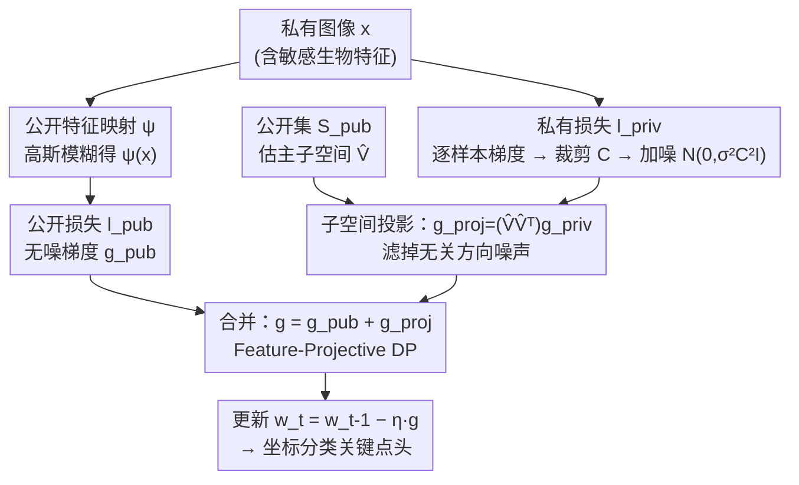

# Differentially Private 2D Human Pose Estimation

**会议**: CVPR 2026  
**论文**: [CVF Open Access](https://openaccess.thecvf.com/content/CVPR2026/html/Sivangi_Differentially_Private_2D_Human_Pose_Estimation_CVPR_2026_paper.html)  
**代码**: [项目页](https://bhairava2898.github.io/DP2DHPE/)  
**领域**: 人体理解  
**关键词**: 差分隐私, 2D人体姿态估计, DP-SGD, 子空间投影, 特征级隐私

## 一句话总结
首个面向 2D 人体姿态估计的差分隐私统一框架：把"梯度子空间投影"和"特征级差分隐私（只给原图私有特征加噪）"两种降噪机制拼成 Feature-Projective DP，在形式化隐私保证下大幅缩小与非隐私模型的精度差距（ε=0.8 时 MPII 达 82.61% PCKh@0.5，恢复了 73% 的隐私损失）。

## 研究背景与动机
**领域现状**：2D 人体姿态估计（HPE）把原始图像转成结构化关键点，是医疗、行为识别、人机交互的基础任务。但它依赖高质量图像，而原图含人脸、体型等可识别的生物特征；训练好的网络还会"记住"训练数据，攻击者能通过模型反演、成员推断、梯度重建等手段还原出病人长相甚至家庭环境。

**现有痛点**：HPE 领域过去的隐私保护几乎都是数据匿名化——模糊、像素化、去皮肤、模板化体型建模。这些方法有三个硬伤：(1) 任务专用、破坏数据效用（去掉人脸可能保住关节位置，却毁掉做压力评估、异常步态检测所需的临床线索）；(2) 没有形式化隐私保证，存在"洋葱效应"——剥掉一层保护就暴露下一层；(3) 根本不防神经网络的记忆攻击。

**核心矛盾**：差分隐私（DP）能给出可证明的保证，但标准实现 DP-SGD 在梯度上裁剪+加高斯噪声，会带来严重的精度塌方。HPE 是细粒度空间预测任务，对精度极其敏感，直接套 DP-SGD 几乎不可用。这就是隐私与效用之间难以调和的张力，而它在 HPE 语境下从未被系统研究过。

**本文目标**：在形式化 DP 保证下，把 HPE 的效用损失压回来，并建立第一个系统的 DP-HPE benchmark。

**切入角度**：作者抓住两个观察——(a) 深网训练的有效梯度更新集中在一个远小于全参数空间的低维子空间里，加在无关方向的噪声纯属浪费；(b) 一张图里真正敏感的只是细粒度私有信息，粗粒度的姿态线索（模糊后还在）其实是"公开的"，不必加噪。

**核心 idea**：用"子空间投影 + 特征级隐私"两种互补降噪机制——把噪声梯度投影回低维信号子空间过滤掉无效噪声，同时只对原图私有分量加噪、让公开特征贡献无噪梯度——二者叠加在信噪比上是**乘性**增益。

## 方法详解

### 整体框架
模型骨干是 TinyViT（四阶段轻量层级 Transformer，参数少很关键——DP-SGD 的误差界随参数量增长），后接一个**坐标分类**关键点头：把连续坐标 $(x_i,y_i)$ 按分裂因子 $k\ge1$ 量化成离散 bin $p'_i=(\lfloor x_i\cdot k\rfloor,\lfloor y_i\cdot k\rfloor)$，卷积头输出 16 通道（每通道对应一个关节）特征图，上采样展平后在离散坐标 bin 上做分类，再解码回连续坐标；训练时用高斯标签平滑给邻近 bin 软标签。

隐私部分在每次迭代里同时跑三路（见下图）：用一个**独立的公开数据集 $S_{pub}$**（COCO，与私有集同分布）估计梯度协方差的主子空间、定期更新投影矩阵；对**私有批**算逐样本梯度、裁剪、加噪后投影去噪；对**公开特征批**（私有图经 $\psi$ 高斯模糊得到）算无噪梯度。最后把"无噪公开梯度 + 去噪私有梯度"相加来更新参数。

### 关键设计

**1. 子空间投影 DP-SGD：把噪声只留在"有信号"的方向上**

DP-SGD 的痛点是噪声 $\mathcal{N}(0,\sigma^2C^2\mathbf{I})$ 被**均匀**撒到所有 $p$ 个梯度分量上，但真正携带姿态信息的方向只占少数。作者用一个小的公开辅助集 $S_{pub}$ 估计梯度二阶矩 $M(w)=\frac{1}{m}\sum_{i=1}^m \nabla l(w,\tilde z_i)\nabla l(w,\tilde z_i)^{\top}$，取 top-$k$ 特征向量堆成投影矩阵 $\hat V\in\mathbb{R}^{p\times k}$（$k\ll p$），定期重估以跟上训练中梯度分布的漂移。每个私有 mini-batch 先裁剪 $\tilde g_i=\mathrm{clip}(\nabla l(w,z_i),C)$、聚合加噪得 $g$，再投影：

$$g_{proj}=(\hat V\hat V^{\top})\,g$$

这把更新方向限制在梯度方差最大的子空间里，把落在无信息方向上的噪声直接丢掉，信噪比随之上升。关键是投影发生在加噪**之后**、属于后处理，根据 DP 的后处理不变性，整体 $(\varepsilon,\delta)$ 保证不受影响——白拿一份降噪。理论上它把隐私误差从 $\tilde O(p\cdot G^2)$ 降到 $\tilde O(k\cdot C^2)$ 量级。

**2. 特征级差分隐私 FDP：只给"敏感原图"加噪，公开模糊图免费用**

即便投影了，把整张图当私有、整条梯度都加噪仍然浪费——一张图里粗粒度姿态轮廓（模糊后还在）本就不算秘密。FDP 用一个公开特征映射 $\psi$（这里取高斯模糊，能抹掉人脸和体型细节）把每张图拆成公开变体 $\psi(x)$ 和私有原图 $x$，并把总损失分解为

$$l(w,x)=l_{priv}(w,x)+l_{pub}(w,\psi(x))$$

形式化地，机制 $M$ 满足 $f$-FDP 是指：对任意只在一对图像-标签 $x_i\ne x'_i$ 上不同、但**公开表示相同** $\psi(x_i)=\psi(x'_i)$ 的相邻数据集，有 $\mathbb{P}[M(d)\in S]\le 1-f(\mathbb{P}[M(d')\in S])$；当 $f(x)=1-\delta-e^{\varepsilon}x$ 时即等价于关于 $\psi$ 的 $(\varepsilon,\delta)$-DP。于是只有捕捉敏感细粒度细节的 $l_{priv}$ 那条梯度需要裁剪+加噪，$l_{pub}$ 的梯度完全无噪、自由贡献效用。相比"全图都保护"的经典 DP，在同一隐私预算下噪声预算花得更省，效用更高。⚠️ 公式 (6) 的不等式形式以原文为准。

**3. Feature-Projective DP：两套降噪机制乘性叠加**

FDP 解决"对谁加噪"，投影解决"加了噪怎么滤"，二者正交，可以直接组合（Algorithm 1）。每次迭代 $t$ 从 $S_{data}$ 采两个**独立**批：公开批上算无噪公开梯度 $g_{pub}^t=\frac{1}{|B_{psi}^t|}\sum \nabla l_{pub}(w_{t-1},\psi(x))$；私有批上算裁剪加噪梯度 $g_{priv}^t=\frac{1}{|B_{priv}^t|}\big(\sum\tilde g+\mathcal{N}(0,\sigma^2C^2I)\big)$，再用当前子空间投影去噪 $g_{proj}^t=(\hat V_t\hat V_t^{\top})g_{priv}^t$。最终梯度是干净公开分量与去噪私有分量之和：

$$g_t=g_{pub}^t+g_{proj}^t,\qquad w_t=w_{t-1}-\eta_t g_t$$

为什么"乘性"有效：收敛分析（式 13）把平均梯度范数界成两项之和——隐私误差 $\tilde O\!\big(\frac{k\rho C^2}{n\varepsilon}\big)$ 与重建误差 $O\!\big(\frac{\Lambda G^4\rho^2\gamma_2^2\ln p}{m}\big)$。投影把维度从 $p$ 压到 $k$，FDP 把梯度范数从全局 $G$ 压到私有阈值 $C$（$C\le G$），隐私误差里**同时**出现 $k$ 和 $C^2$，相当于两个降噪因子相乘，这就是单用任一种都达不到的效用增益的来源。

### 损失函数 / 训练策略
总损失即 $l=l_{priv}+l_{pub}$ 的公私分解；坐标分类头上用高斯标签平滑。三种训练情景对比：(i) 冻结骨干前三阶段、只微调第四阶段+所有 LayerNorm 的微调；(ii) 全量微调（COCO 权重初始化、全层训练）；(iii) 从零随机初始化训练。COCO 当公开预训练集，MPII/HumanART 当私有集；扫 $\varepsilon\in\{0.2,0.4,0.6,0.8\}$、$C\in\{0.01,0.1,1.0\}$。

## 实验关键数据

### 主实验
MPII 上不同隐私机制对比（PCKh@0.5，%，微调策略），可见两机制叠加后的恢复幅度：

| 配置 | C=0.01, ε=0.2 | C=0.01, ε=0.8 | C=1.0（强噪声） |
|------|------|------|------|
| 非隐私上界（微调） | — | — | 89.36（Mean） |
| Vanilla DP-SGD | 63.85 | 78.17 | 12.53 |
| + 子空间投影 | 78.48 | 80.63 | — |
| + FDP | 75.46 | 80.40 | — |
| Feature-Projective DP | 更高 | **82.61** | **71.66** |

最具说服力的一组：$C=1.0$ 强噪声下 vanilla DP-SGD 只剩 12.53%，Feature-Projective DP 拉到 71.66%，约 6 倍相对增益；ε=0.8 时整体达 82.61% PCKh@0.5，恢复了隐私引入性能差距的 73%。

MPII 非隐私基线（Mean PCKh@0.5，%），说明原图细粒度细节对姿态精度不可替代：

| 训练策略 | 原图 Mean | 仅公开特征(模糊) Mean |
|------|------|------|
| 微调（冻结骨干） | 89.36 | 83.61 |
| 从零微调 | 88.28 | 70.32 |
| 从零训练 | 76.89 | 17.99 |

### 消融实验
两机制各自及组合的贡献（MPII，PCKh@0.5）：

| 配置 | 代表设置 | 关键指标 | 说明 |
|------|------|------|------|
| Vanilla DP-SGD | C=0.01, ε=0.2 | 63.85 | 基线 |
| 仅子空间投影 | C=0.01, ε=0.2 | 78.48 | +14.63，过滤无关方向噪声 |
| 仅 FDP | C=0.01, ε=0.2 | 75.46 | +11.61，只给私有分量加噪 |
| Full（Feature-Projective） | C=0.1, ε=0.8, 从零训练 | 33.48 | vanilla 仅 6.85、FDP 仅 11.22，组合后乘性跃升 |

### 关键发现
- **裁剪阈值越小越好**：有效噪声幅度随 $C$ 线性增长，$C=0.01$ 时 ε=0.2 就有 63.85%，而 $C=0.1$ 仅 28.46%、$C=1.0$ 仅 5.94%。$C=1.0$ 时原始梯度被噪声主导，出现非单调的局部塌陷。
- **预训练骨干是 DP 的救命稻草**：从 COCO 预训练微调远比从零训练抗噪，预训练的姿态特征先验给 DP-SGD 提供了稳健起点。
- **DP 下"更新更少参数反而更好"**：HumanART 上非隐私时从零微调(69.5 mAP)优于冻结骨干微调(63.3)，但加 DP 后趋势反转——冻结大部分参数集中了有效学习、减少了注入噪声总量，印证 DP 噪声对大参数规模伤害更大。
- **跨数据集泛化**：在风格化/艺术化的 HumanART 上 ε=0.8 仍达 51.6 mAP，域偏移下隐私-效用平衡稳定。

## 亮点与洞察
- **"后处理免费降噪"用得很巧**：投影放在加噪之后，靠 DP 后处理不变性零成本提升信噪比——不动隐私预算就把效用拉回来，是可直接迁移到其他 DP 视觉任务的 trick。
- **把"隐私粒度"从样本下放到特征**：FDP 用一个简单的高斯模糊 $\psi$ 划分公私分量，无需人工标注哪些是敏感特征——自动保护整张原图（连同空间环境），工程上很省心。
- **乘性增益有理论背书**：式 13 把误差界显式拆成 $k$（投影）与 $C^2$（FDP）两个独立降噪因子相乘，解释了"1+1>2"为何成立，而非纯经验拼装。
- **最"啊哈"的一点**：强裁剪强噪声（$C=1.0$）这种通常被认为不可用的设置下，组合方法把 12.53% 救到 71.66%，说明两机制在高噪声区是真正互补、缺一不可。

## 局限与展望
- 依赖一个与私有集同分布的**公开数据集** $S_{pub}$ 来估子空间（这里用 COCO）；当拿不到匹配公开数据时方法是否还成立未充分讨论。⚠️ 重建误差项 $O(\cdot/m)$ 显示公开集规模 $m$ 不足会反噬效用。
- 公开特征映射 $\psi$ 固定为高斯模糊，"模糊后剩下的就算公开"这一假设在某些场景可能仍泄露敏感信息（如体型轮廓本身敏感时），$\psi$ 的选择对隐私语义的影响值得更细的攻击实验验证。
- 主结果多以 Figure 折线图呈现、完整表格在补充材料，正文可直接核对的数值点有限；不同训练策略/裁剪阈值间的横向比较需注意设置不可直接等价。
- 仅在 2D-HPE 与两个数据集上验证，是否推广到 3D HPE、视频时序或更大骨干仍待检验。

## 相关工作与启发
- **vs 数据匿名化（模糊/像素化/模板建模/GAN 匿名化/对抗学习）**：它们任务专用、无形式化保证、有洋葱效应，且对抗学习假设训练后不再需要原图、损害临床可解释性；本文给出可证明的 $(\varepsilon,\delta)$-DP 保证且保留数据真实性。
- **vs 标准 DP-SGD**：DP-SGD 在所有方向均匀加噪、对全图保护，细粒度 HPE 上塌方严重；本文用投影+FDP 两路互补降噪，在同一预算下效用显著更高。
- **vs Selective DP / 原始 FDP [44,51]**：前者在 NLP 里只保护敏感 token，FDP 把特征分公私；本文首次把 FDP 引入结构化视觉预测，并与子空间投影组合、给出乘性收敛分析，是这两条线在 HPE 上的首次系统落地。

## 评分
- 新颖性: ⭐⭐⭐⭐⭐ 首个 DP-HPE 框架，把投影与特征级隐私乘性组合并配收敛分析
- 实验充分度: ⭐⭐⭐⭐ 两数据集×多 ε×多 C×三训练策略覆盖全面，但主结果多以折线图呈现、完整表格在补充材料
- 写作质量: ⭐⭐⭐⭐ 动机与机制讲得清楚，理论与实验呼应；部分数值需翻补充材料
- 价值: ⭐⭐⭐⭐⭐ 为敏感场景（医疗/居家）隐私保护姿态估计提供了首个严谨 benchmark 与可落地蓝图

<!-- RELATED:START -->

## 相关论文

- [\[CVPR 2026\] Egocentric Visibility-Aware Human Pose Estimation](egocentric_visibility-aware_human_pose_estimation.md)
- [\[CVPR 2026\] E-3DPSM: A State Machine for Event-Based Egocentric 3D Human Pose Estimation](e-3dpsm_a_state_machine_for_event-based_egocentric_3d_human_pose_estimation.md)
- [\[CVPR 2026\] Beyond Static Frames: Temporal Aggregate-and-Restore Vision Transformer for Human Pose Estimation](beyond_static_frames_temporal_aggregate-and-restore_vision_transformer_for_human.md)
- [\[CVPR 2026\] FMPose3D: monocular 3D pose estimation via flow matching](fmpose3d_monocular_3d_pose_estimation_via_flow_matching.md)
- [\[CVPR 2026\] Mocap-2-to-3: Multi-view Lifting for Monocular Motion Recovery with 2D Pretraining](mocap-2-to-3_multi-view_lifting_for_monocular_motion_recovery_with_2d_pretrainin.md)

<!-- RELATED:END -->
