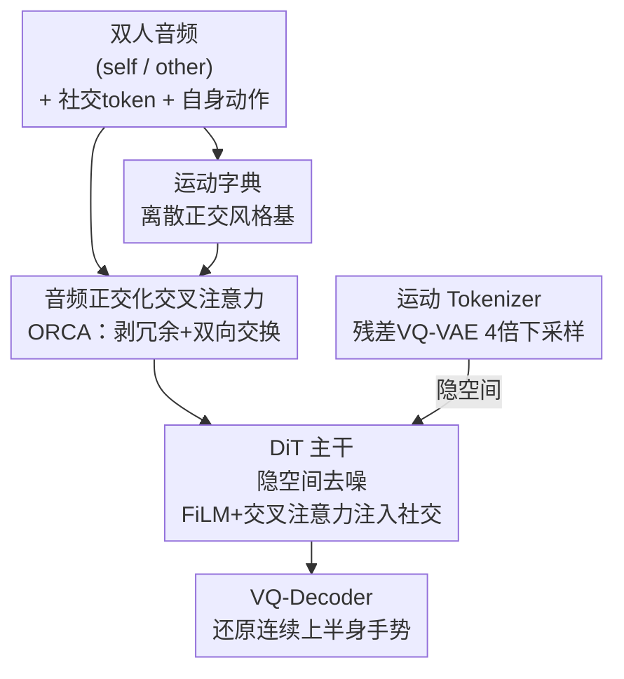

# DyaDiT: A Multi-Modal Diffusion Transformer for Socially Favorable Dyadic Gesture Generation

**会议**: CVPR 2026  
**论文**: [CVF Open Access](https://openaccess.thecvf.com/content/CVPR2026/html/Peng_DyaDiT_A_Multi-Modal_Diffusion_Transformer_for_Socially_Favorable_Dyadic_Gesture_CVPR_2026_paper.html)  
**代码**: https://puckikk1202.github.io/dyadit_hp/ (项目页)  
**领域**: 人体理解 / 手势生成 / 扩散模型  
**关键词**: 双人手势生成, 扩散 Transformer, 社交语境, 音频正交化, 运动字典

## 一句话总结
DyaDiT 是一个面向双人对话场景的多模态扩散 Transformer，用一个正交化交叉注意力模块把两路重叠音频解纠缠、再叠加关系/人格等社交条件和运动字典先验，生成既贴合对话动态又符合社交语境的上半身手势，客观指标和用户偏好都超过现有双人手势方法。

## 研究背景与动机

**领域现状**：协同语音手势生成（co-speech gesture）的主流做法是把单个说话人的一路音频映射到这个人的动作，代表工作如 BEAT/CaMN、EMAGE、TalkSHOW 等，近年也大量转向扩散模型（DiffGesture、DiffuseStyleGesture+ 等）来建模手势的多模态分布。

**现有痛点**：这些方法几乎都只看"语音内容→动作"的对齐，忽略了人在对话里的两类关键信息——一是**社交语境**（说话双方是朋友还是陌生人、各自什么性格，都会显著影响怎么动手），二是**双人交互动态**（两人会同时说话、打断对方、在说/听之间快速切换）。把这两点丢掉，生成的动作就显得"千篇一律"、不像在真实对话。

**核心矛盾**：双人对话里两路音频在时间上高度重叠、互相纠缠，而现有双人手势方法（Audio2PhotoReal、ConvoFusion、TAG2G）要么把双人音频当成一路混合信号塞进去，要么不显式区分"自己说的话"和"对方说的话"。结果是模型分不清谁是说话人、谁是听者，角色和交互模式都糊在一起。

**本文目标**：在双人对话设定下，为"对方说话人"（other）生成符合上下文的上半身手势，且要做到：(1) 把两路音频干净地解纠缠；(2) 让生成显式受社交属性调控；(3) 可选地参考搭档的实际动作做出更协调的反应。

**核心 idea**：用一个**正交化交叉注意力（ORCA）**先把两路音频的冗余成分剥掉、再双向交换互补信息，得到干净的音频条件；同时把关系/人格作为显式社交 token 注入扩散 Transformer，并用一个**离散运动字典**提供风格先验。

## 方法详解

### 整体框架

DyaDiT 的骨干是一个在 DDPM 框架下的扩散 Transformer（DiT），它不直接在原始手势空间上扩散，而是先用 VQ-VAE 把手势序列离散压缩成 token，在这个紧凑的隐空间里做去噪。输入侧把多种模态拼成条件 $c$：两路对话音频经 ORCA 融合得到的干净音频特征、自己（self）的动作、关系类型 $f_{relat}$、人格分数 $f_{ps}$；其中关系和人格既通过 FiLM 调制、又通过交叉注意力注入，让模型同时抓住"社交属性"和"个体表达风格"。整个流程是：音频/动作/社交条件 → ORCA 解纠缠 + 运动字典加风格 → DiT 在隐空间去噪 → VQ-Decoder 还原成连续手势序列。

### 关键设计

**1. 音频正交化交叉注意力 ORCA：把两路重叠音频解纠缠成干净条件**

这是论文最核心的模块，直接针对"双人音频纠缠、角色分不清"这个痛点。给定 Wav2Vec2 编码的两路音频特征 $a_{self}$ 和 $a_{other}$，ORCA 先做一次正交化，把 self 音频里和 other 音频相关（冗余）的成分投影掉：

$$a^{\perp}_{self} = a_{self} - \mathrm{Proj}_{a_{other}}(a_{self})$$

其中投影算子用一个轻量 MLP $\phi(x) = W_2\,\sigma(W_1 x + b_1) + b_2$ 实现。这一步强制两路音频只保留互补信息、削掉相关部分。接着用两个对称的交叉注意力做双向交换：一支以 $a_{other}$ 为 query 去注意 $a^{\perp}_{self}$（捕捉"说话人对搭档发言的回应"），另一支以 $a^{\perp}_{self}$ 为 query 去注意 $a_{other}$（建模"听者的反应线索"）。两支输出再用一个可学习门控自适应融合：

$$f_{audio} = \sigma(W_g)\cdot h_{self\to other} + (1-\sigma(W_g))\cdot h_{other\to self}$$

得到的 $f_{audio}$ 作为最终音频条件。和直接拼接两路音频、或用普通交叉注意力相比，ORCA 的关键在于"先剥冗余再交换"，让模型在一人打断另一人这种重叠时刻仍能分清谁该主导动作，从而既能生成说话人手势、也能生成听者手势。

**2. 离散运动字典 MD：用正交风格基提供可控的风格先验**

针对"生成动作风格单一、缺乏可控性"，作者借鉴 LIA 在初始化时强制正交的思路，引入一组可学习的正交运动基 $\{d_0, d_1, \dots, d_n\}$，每个基编码一种代表性手势原型。训练时用真实动作的风格特征 $f_{motion}=[m_0,\dots,m_n]$ 引导模型学"音频线索↔运动模式"的风格对应。具体把搭档音频 $a_{other}$ 经字典调制：

$$a'_{other} = \mathrm{CA}\Big(a_{other}, \sum_{k=0}^{n} m_k d_k\Big) + a_{other}$$

其中 $m_k$ 是从 $f_{motion}$ 导出的风格权重。值得注意的是运动字典联合训练时**不做正交化**（手势不需要严格相位对齐，强行正交反而损害学习），正交只用在初始化。推理时字典可选激活：配合 classifier-free guidance 既能放大风格条件、生成风格鲜明的手势，也能完全丢弃、退化成纯靠音频-动作先验驱动的风格无关动作。消融显示离散字典在 Diversity(Static) 上明显优于连续变体，说明离散基更能捕捉多样的交互风格。

**3. 显式社交条件 + 可选自身动作分支：让手势贴合关系/人格并与搭档协调**

DyaDiT 把数据集自带的两类高层社交标注作为显式条件：关系类型 $f_{rs}\in\{0,1\}^4$（朋友/陌生人/家人/恋人）和五维人格分数 $f_{ps}\in\mathbb{R}^5$（外向、宜人、尽责、神经质、开放）。这些社交 token 通过 FiLM 调制和交叉注意力双通道注入 DiT，使同一段音频在不同关系/人格下产出不同动作。此外，因为双人场景里自己的动作常受搭档手势影响，模型可选地把 self 的动作序列作为额外条件，生成更协调、更有回应性的手势。消融里 w/o self、Uncond、Random（随机社交标签）都比完整模型差，尤其错配社交语境会明显压低 Diversity(Static)，印证了"正确的社交线索能让动作分布更宽"。

### 损失函数 / 训练策略

DiT 主干遵循标准 DDPM 的 $\epsilon$-预测损失：

$$L_{diff} = \mathbb{E}_{x_0,t,\epsilon}\big[\,\|\epsilon - \epsilon_\theta(x_t, t, c)\|_2^2\,\big],\quad x_t=\sqrt{\bar\alpha_t}x_0+\sqrt{1-\bar\alpha_t}\,\epsilon$$

运动用 6D 旋转表示。运动 Tokenizer 采用残差 VQ-VAE（残差长度 4、四级级联码本逐步细化量化误差），编码器用 1D 卷积把序列时间维下采样 4 倍（每 4 帧一个 token），隐维 $d=64$。扩散直接在隐空间进行：训练时只用 VQ 编码器、推理时只用解码器。训练数据为 Seamless Interaction 数据集自然场景子集，约 3,000 段、182 小时，音频经 Wav2Vec2 编码。

## 实验关键数据

### 主实验
在 Seamless Interaction 验证集上，与两个双人手势 SOTA（ConvoFusion、Audio2PhotoReal）对比，指标含 Beat Consistency (BC)、Fréchet Distance (FD，Static/Kinetic，越低越真实)、Diversity (Static/Kinetic，越高越多样)。推理用 DDIM 50 步、CFG=2、生成 300 帧（10s）。

| 方法 | BC ↑ | FD-Sta ↓ | FD-Kine ↓ | Div-Sta ↑ | Div-Kine ↑ |
|------|------|----------|-----------|-----------|------------|
| GT | - | - | - | 28.42 | 1.97 |
| ConvoFusion | - | 9.22 | 1.74 | 18.33 | 1.10 |
| Audio2PhotoReal | - | 8.77 | 1.84 | 19.35 | 1.05 |
| **DyaDiT** | **7.71** | **6.40** | **1.37** | **27.46** | 1.38 |

DyaDiT 在 FD（真实度）和 Static Diversity 上都大幅领先两个基线，Diversity(Static) 几乎逼近 GT 的 28.42。

### 消融实验
| 配置 | FD-Sta ↓ | Div-Sta ↑ | 说明 |
|------|----------|-----------|------|
| **DyaDiT (Full)** | **6.40** | **27.46** | 完整模型 |
| w/o ORCA | 7.32 | 23.57 | 去掉 ORCA 直接拼双路音频，FD 明显变差 |
| CrossAttn | 7.82 | 18.87 | ORCA 换成普通交叉注意力，FD/多样性都掉 |
| w/o MD | 6.88 | 18.34 | 去掉运动字典，Diversity 大跌 |
| MD contin | 6.69 | 21.47 | 离散字典换连续表示，多样性下降 |
| w/o self | 6.64 | 26.43 | 去掉自身动作分支 |
| Uncond | 7.40 | 21.65 | 无任何社交条件 |
| Random | 8.24 | 21.94 | 随机错配关系/人格标签，FD 最差 |

### 关键发现
- **ORCA 贡献最大**：去掉或换成普通交叉注意力，FD 和多样性同时变差，验证"先正交剥冗余再双向交换"对解纠缠重叠音频确实关键。
- **离散运动字典优于连续**：MD contin 在 Diversity(Static) 上明显低于离散版，说明离散正交基更能覆盖多样的交互风格。
- **社交条件是真有用而非装饰**：Random（错配标签）FD 最差（8.24），错配社交语境显著压低 Static Diversity；作者解释双人场景里很多片段是听者行为、本身动作幅度小，正确社交线索能帮模型消歧、产出更丰富手势。
- **用户研究甚至略超 GT**：16 名参与者 A/B 评测，DyaDiT 在整体质量/关系一致性/人格一致性上分别被 73.9%、69.8%、66.7% 偏好；相对 GT 在两项设定上还分别高出 1.0% 和 1.7%（作者归因于扩散生成更平滑、社交条件让动作略更有表现力），关系/质量对基线的偏好达 $\chi^2,\,p<10^{-8}$ 显著。

## 亮点与洞察
- **正交化是"廉价的解纠缠"**：用一次向量投影 $a_{self}-\mathrm{Proj}_{a_{other}}(a_{self})$ 就把两路音频的相关成分剥掉，比堆叠注意力层更直接，这个 trick 可迁移到任何"两路高度相关信号要分离主辅"的多模态融合场景（如双人对话语音分离、说话人/听者建模）。
- **离散字典 + CFG = 风格可开可关**：运动字典推理时可选激活，配 classifier-free guidance 既能强化风格、也能整段丢弃退化成风格无关动作，给了使用者一个干净的"风格旋钮"。
- **把社交标注当一等条件**：关系/人格通过 FiLM + 交叉注意力双通道注入，是少见地把"社交语境"显式建模进手势生成，而消融证明它不是锦上添花、错配会真的掉点。

## 局限与展望
- 只生成**上半身手势**，未涉及全身、面部表情和手指精细动作的完整协同（虽然 FD 用了含手指关节的 43 个关节定义，但生成目标是上半身）。
- 依赖 Seamless Interaction 数据集自带的关系/人格标注，社交条件的泛化受标注质量与覆盖关系类型（仅 4 类）限制；⚠️ 人格一致性未与 GT 对比，作者称连续人格标注让参与者难可靠判断。
- 用户研究规模偏小（16 人、CS 背景、25-35 岁），偏好结论的人群代表性有限。
- 作者展望走向"社交感知的双智能体（dual-agent）手势生成"——目前只为 other 一方生成，双方同时实时互生成仍未解决。

## 相关工作与启发
- **vs Audio2PhotoReal / ConvoFusion**：它们把双人音频当单路混合信号、或不显式拆分两路，DyaDiT 用 ORCA 显式解纠缠并双向交换，FD 与多样性全面领先。
- **vs 单说话人 co-speech（EMAGE / DiffuseStyleGesture+ 等）**：这些只对齐"一路音频→一人动作"，DyaDiT 加入社交语境与搭档动态，针对的是更难的双人交互设定。
- **vs LIA（运动方向正交）**：DyaDiT 借用其"初始化强制正交"的思想构建运动字典，但区别在于联合训练时**不再**保持正交（手势无需严格相位对齐），只在初始化用正交、推理时可选激活。

## 评分
- 新颖性: ⭐⭐⭐⭐ ORCA 的正交化解纠缠 + 显式社交条件 + 离散运动字典组合在双人手势生成里是新颖切入。
- 实验充分度: ⭐⭐⭐⭐ 客观指标 + 7 组消融 + 用户研究三管齐下，但基线仅 2 个、数据集单一。
- 写作质量: ⭐⭐⭐⭐ 方法与公式交代清晰，图文对应；个别记号（如 $f_{rs}$/$f_{relat}$）前后不完全统一。
- 价值: ⭐⭐⭐⭐ 把社交语境显式带进手势生成，对数字人/具身交互有实际意义。

<!-- RELATED:START -->

## 相关论文

- [\[CVPR 2026\] MMGait: Towards Multi-Modal Gait Recognition](mmgait_multi_modal_gait_recognition.md)
- [\[ICCV 2025\] GestureHYDRA: Semantic Co-speech Gesture Synthesis via Hybrid Modality Diffusion Transformer and Cascaded-Synchronized Retrieval-Augmented Generation](../../ICCV2025/human_understanding/gesturehydra_semantic_co-speech_gesture_synthesis_via_hybrid_modality_diffusion_.md)
- [\[CVPR 2026\] CoordSpeaker: Exploiting Gesture Captioning for Coordinated Caption-Empowered Co-Speech Gesture Generation](coordspeaker_exploiting_gesture_captioning_for_coordinated_caption-empowered_co-.md)
- [\[CVPR 2026\] MimicTalker: A Multimodal Interactive and Memory-Enhanced Framework for Real-Time Dyadic 3D Head Generation](mimictalker_a_multimodal_interactive_and_memory-enhanced_framework_for_real-time.md)
- [\[CVPR 2026\] LiveGesture: Streamable Co-Speech Gesture Generation Model](livegesture_streamable_co-speech_gesture_generation_model.md)

<!-- RELATED:END -->
