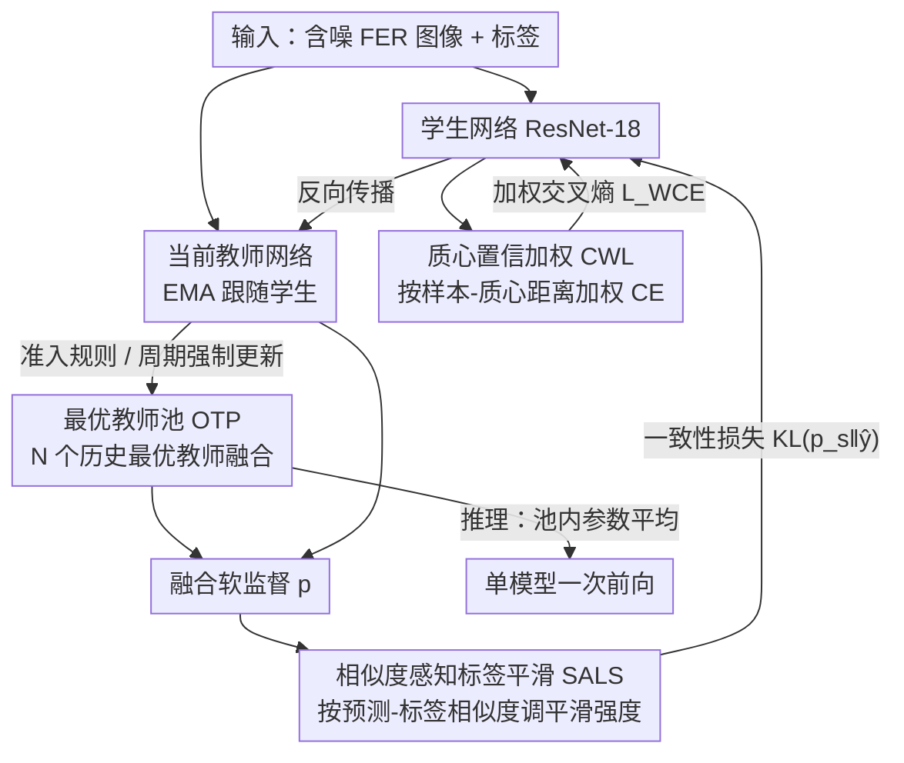

# Dynamic Label Noise Suppression with Optimal Teacher Pool for Facial Expression Recognition

**会议**: CVPR 2026  
**论文**: [CVF Open Access](https://openaccess.thecvf.com/content/CVPR2026/html/Yang_Dynamic_Label_Noise_Suppression_with_Optimal_Teacher_Pool_for_Facial_CVPR_2026_paper.html)  
**代码**: 无（论文未提供）  
**领域**: 人体理解 / 面部表情识别  
**关键词**: 面部表情识别, 噪声标签学习, 教师-学生网络, 标签平滑, 置信度加权

## 一句话总结
针对面部表情识别（FER）数据集中普遍存在的噪声标签，本文提出 OTP-NS 框架：用一个"最优教师池"替代单一 EMA 教师以打破师生参数耦合与噪声累积，再叠加样本级的相似度感知标签平滑（SALS）和质心置信加权（CWL）两个抑噪部件，在多个 benchmark 的各噪声比例下超过现有 SOTA，且推理零额外开销。

## 研究背景与动机

**领域现状**：FER 长期依赖 CNN / ViT 在大规模标注数据上训练。面对噪声标签，主流抑噪范式有两条线——一是标签平滑正则（LSR/SLS），把 one-hot 标签软化以降低模型对错误标签的过拟合；二是教师-学生架构（典型如 Mean Teacher），用 EMA 把历史参数平均成一个"更稳"的教师来给学生提供监督信号。

**现有痛点**：表情本身有歧义、标注又带主观性，FER 数据里噪声标签几乎不可避免，而深度网络强记忆能力会把错误标签也"背下来"，严重损害泛化。Mean Teacher 这一支虽然稳，但它的 EMA 耦合更新有两个硬伤：① 随训练推进，教师参数渐进收敛到学生参数，二者**过度耦合**，模型学习能力被锁死；② 在噪声环境下，被污染的学生网络会**沿 EMA 通路把噪声传回教师**，监督信号本身被腐蚀。而传统标签平滑这一支用的是**固定且全局统一**的平滑强度，对干净样本是有害的——把它本来很高的真值概率白白稀释到其他类。

**核心矛盾**：单一 EMA 教师在"稳定性"和"抗噪/解耦"之间无法兼得——想稳就得长期平均历史参数，但长期平均恰恰带来耦合与噪声累积；固定平滑强度则在"压噪声样本"和"保干净样本"之间无法两全。

**本文目标**：(1) 打破单教师的噪声累积与师生耦合；(2) 让标签平滑因样本而异，只压噪声样本、放过干净样本；(3) 在损失层面进一步削弱噪声样本对学生训练的拖累。

**切入角度**：作者的关键观察是——与其依赖"一个不断被污染的教师"，不如**维护一池历史最优教师并融合它们的预测**，相当于用一个动态的"专家委员会"做监督；同时，预测与标签的相似度（余弦相似度）、样本到类质心的距离这些**样本级信号**能有效区分噪声/干净样本，可以用来做细粒度调控。

**核心 idea**：用"最优教师池 + 样本级动态平滑 + 样本级置信加权"替代"单一 EMA 教师 + 全局固定平滑"，把抗噪从模型级粗粒度做到样本级细粒度。

## 方法详解

### 整体框架
OTP-NS 在标准 teacher-student 训练回路上做改造。每个训练步：学生网络的输出与标签算**加权交叉熵损失**（CWL 部件）；当前教师网络与最优教师池的融合输出作为软监督，与学生输出算 **KL 散度一致性损失**（SALS 部件作用在这条软监督上）。学生先反向传播更新参数，教师再由 EMA 跟随更新，最后**最优教师池按准入规则更新**。推理时不再需要这套机制——直接把池内 N 个教师参数**平均**成单个模型，只跑一次 backbone 前向，零额外开销。

整体可以看成"一个池 + 两个样本级抑噪部件"协同：池负责在模型层面提供干净稳定的监督源，SALS 负责把这份监督做成因样本而异的软标签，CWL 负责在学生这侧按样本可靠度重新加权损失。

### 关键设计

**1. 最优教师池 OTP：用"历史最优委员会"替代单一 EMA 教师，斩断噪声累积与师生耦合**

这是全文的主干，直接针对 Mean Teacher 的两个硬伤。OTP 动态维护容量为 $N$ 的历史最优教师参数集合 $P=\{\theta_k^{opt}\}_{k=1}^N$，靠**双重筛选**保证池内质量。第一道是**准确率准入**：每个 epoch $t$ 在训练集上算当前教师的准确率 $\mathrm{Acc}(\theta_t^{teacher})$，若它超过池内最差成员

$$\mathrm{Acc}(\theta_t^{teacher}) > \min_{\theta_i\in P}\mathrm{Acc}(\theta_i)$$

就替换掉最差的那个。注意这里用训练集准确率而非额外的干净验证集，所以方法能直接用在真实含噪 FER 数据上。第二道是**周期强制更新**：作者发现只靠准入会出问题——训练早期网络学新特征时准确率往往会轻微下降，导致 OTP 一直进不去新模型、永远抱着旧知识停滞。所以每隔 $K$ 个 epoch 无条件用当前教师替换池内最差成员 $P\leftarrow P\setminus\{\theta_{worst}\}\cup\{\theta_t^{teacher}\}$，强行注入新知识。

训练时 OTP 把当前教师与池内成员的预测**融合**成监督 logits：

$$\boldsymbol{p}=\beta_t\cdot f(\theta_t^{teacher};\boldsymbol{x})+(1-\beta_t)\sum_{k=1}^N\lambda_k f(\theta_k^{opt};\boldsymbol{x})$$

其中池内权重按验证准确率自适应分配 $\lambda_k=\mathrm{Acc}(\theta_k^{opt})\big/\sum_j\mathrm{Acc}(\theta_j^{opt})$——准的教师说话更响。融合系数 $\beta_t=\gamma\cdot\exp(-t/T_{max})$ 随训练时间衰减：早期 $\beta_t\approx\gamma$ 让当前教师主导、快速吸收新知识；后期 $\beta_t\to0$ 让稳定的历史池主导、压制噪声累积。这套"准入 + 强制更新 + 准确率加权融合 + 时变系数"组合拳，使监督源既不被单一污染教师拖垮、又不和学生死锁耦合。

**2. 相似度感知标签平滑 SALS：按"预测-标签相似度"给每个样本不同的平滑强度，只压噪声不伤干净**

针对"固定平滑强度伤害干净样本"的痛点。传统 LSR 对所有样本一刀切地把真值概率均匀挪给其他类，SLS 虽按置信度软化多类但平滑强度仍固定。SALS 的核心是让平滑强度 $\epsilon_i$ 因样本而异。它先用余弦相似度衡量预测与标签的吻合程度

$$S_i=\frac{\sum_k \boldsymbol{y}_{ik}\boldsymbol{f}_{ik}}{\sqrt{\sum_k \boldsymbol{f}_{ik}^2}}=\cos(\boldsymbol{f}_i,\boldsymbol{y}_i)$$

（$\boldsymbol{f}_i$ 是 softmax 输出，$\boldsymbol{y}_i$ 是 one-hot 标签），再据此线性映射出平滑强度 $\epsilon_i=\epsilon_{min}+(\epsilon_{max}-\epsilon_{min})(1-S_i)$。直觉很清楚：相似度高（预测和标签一致、大概率是干净样本）→ $S_i$ 大 → $\epsilon_i$ 小 → 少平滑，保住高真值概率；相似度低（疑似噪声）→ $\epsilon_i$ 大 → 多平滑，稀释错误标签。最终软标签按置信阈值 $\tau$ 在高置信类（$q_i>\tau$）和其余类间分配：高置信类拿 $\frac{q_i}{\sum_{j}q_j[q_j>\tau]}(1-\epsilon_i)$，其余类均分 $\frac{\epsilon_i}{C-k}$（$q=\mathrm{softmax}(p)$，$k$ 为高置信类数）。这个软标签 $\hat{y}$ 作为教师侧的监督目标，参与一致性损失 $L_{Cons}=D_{KL}(\boldsymbol{p}_s\|\hat{\boldsymbol{y}})$。

**3. 置信加权 Logit CWL：用"样本到类质心的距离"给损失重加权，弱化噪声样本的训练贡献**

针对噪声样本在损失层面仍会拖累学生的问题。作者的观察是：噪声样本因标签错误，在特征空间里**离其所属类的质心更远**。于是先在每个 batch 内按标签求各类质心 $\boldsymbol{\mu}_j=\frac{\sum_i\{c_i=j\}\boldsymbol{x}_i}{\sum_i\{c_i=j\}}$，并用 EMA 跨 batch 平滑质心 $\boldsymbol{\mu}_j'\leftarrow\omega\boldsymbol{\mu}_j'+(1-\omega)\boldsymbol{\mu}_j$，避免噪声样本扰动质心估计。再把样本到对应质心的距离过一个带可训练缩放/偏置的 sigmoid 得到置信度

$$\alpha_i=\mathrm{sigmoid}(\sigma\cdot\|\boldsymbol{x}_i-\boldsymbol{\mu}_i\|_2+\beta)$$

（$\sigma,\beta$ 可学习）。最后把 $\alpha_i$ 作为温度因子注入交叉熵 logits：

$$L_{WCE}=-\frac{1}{m}\sum_i\log\frac{e^{\alpha_i\boldsymbol{W}_{y_i}^\top(\boldsymbol{x}_i)}}{\sum_j e^{\alpha_i\boldsymbol{W}_j^\top(\boldsymbol{x}_i)}}$$

离质心近的（干净）样本拿到更大权重以保留判别信息，离得远的（疑似噪声）样本被压低权重以抑制其负面影响。⚠️ 原文公式 (13) 求和上标记为 $N$、前面归一化用 $m$，二者应同指 batch 内样本数，以原文为准。

### 损失函数 / 训练策略
总损失由学生侧的加权交叉熵 $L_{WCE}$（CWL）与师生间的一致性 KL 损失 $L_{Cons}$（SALS 作用的软标签）组成。骨干用 ResNet-18，师生均在 MS-Celeb-1M 上预训练；学生用 Adam 优化，教师 EMA 衰减 0.999。关键超参：池容量 $N=3$、每 $K=10$ epoch 强制更新一次、初始置信 $\gamma=0.7$、$\epsilon_{min}=0.1$、$\epsilon_{max}=0.3$、验证集 $D_{val}$ 取训练数据 10%、batch size 64，输入 resize 到 $224\times224$ 并配学习率 warmup。

## 实验关键数据

数据集：RAF-DB、AffectNet、FERPlus 三个 in-the-wild FER benchmark，主要在合成对称噪声（10%/20%/30%/50%）下评测，并补做了更贴近现实的非对称噪声实验。

### 主实验（对称噪声下与 SOTA 对比，准确率 %）

| 数据集 | 噪声比 | Baseline | EAC | SOFT | LA-Net | MCR | **Ours** |
|--------|--------|----------|------|------|--------|-----|----------|
| RAF-DB | 10% | 81.01 | 88.02 | 89.05 | 88.75 | 89.28 | **90.12** |
| RAF-DB | 20% | 77.98 | 86.05 | 87.86 | 87.12 | 87.61 | **88.91** |
| RAF-DB | 30% | 75.50 | 84.42 | 86.08 | 85.33 | 86.08 | **87.56** |
| AffectNet | 30% | 52.16 | 58.91 | 59.50 | 60.82 | 59.50 | **60.99** |
| FERPlus | 30% | 79.77 | 85.44 | — | 86.01 | — | **86.18** |

OTP-NS 在各数据集、各噪声比下稳定领先此前最优的 MCR：RAF-DB 上 10%/20%/30% 分别 +0.84%/+1.30%/+1.48%，AffectNet 上 +0.85%/+0.60%/+1.49%。非对称噪声更能体现优势——RAF-DB 上相比 SOFT，在 10%/20%/30%/50% 分别提升 1.39%/1.39%/1.61%/2.98%，噪声越重领先越大（50% 时 Ours 52.90% vs SOFT 49.92% vs DMUE 43.72%）。

### 消融实验

OTP 内部组件消融（RAF-DB，30% 对称噪声）：

| P（周期强制更新） | W（自适应加权融合） | C（置信系数 $\beta_t$） | Acc |
|:---:|:---:|:---:|------|
| × | × | × | 87.42 |
| × | √ | √ | **36.15** |
| √ | × | √ | 87.47 |
| √ | √ | × | 85.41 |
| √ | √ | √ | **87.56** |

SALS / CWL 部件消融（节选）：

| 配置 | RAF-DB 10% | RAF-DB 20% | RAF-DB 30% | 说明 |
|------|-----------|-----------|-----------|------|
| LS | 87.04 | 86.19 | 85.43 | 固定平滑 |
| SLS | 89.51 | 88.26 | 87.24 | 实例感知软平滑 |
| **SALS** | **90.12** | **88.91** | **87.56** | 相似度感知动态平滑 |
| w/o CWL | 89.63 | 88.51 | 87.28 | 标准 CE |
| **w/ CWL** | **90.12** | **88.91** | **87.56** | 质心置信加权 |

### 关键发现
- **周期强制更新是 OTP 的命门**：去掉 P（只保留 W、C）准确率从 87.56 暴跌到 **36.15**——早期网络学新特征时准确率轻微下降，严格准入会让池子永远进不去新教师、训练直接停滞。这是全文最反直觉也最关键的发现：纯"择优"会害死自己，必须留一条强制吸收新知识的通道。
- **自适应加权融合贡献明显**：去掉 W 掉到 85.41（−2.15），说明按验证准确率给池内教师加权、放大可靠监督、抑制不靠谱教师确有用。
- **SALS 优于 SLS/LS 主要在 10–30% 这一现实常见区间**：动态强度让干净样本不被过度平滑、噪声样本被有效平滑；但 50% 极端噪声下 SALS 相对 SLS 优势收窄（RAF-DB 80.91 vs 80.82），说明噪声过半时单靠相似度区分变难。
- **推理零额外开销**：池内参数平均成单模型，延迟 11.9 ms/image，与 ResNet-18 基线 11.8 ms 几乎相同，明显低于 DMUE(14.0)、RUL(13.1) 等带额外推理分支的方法。

## 亮点与洞察
- **"最优池 + 周期强制更新"是对 Mean Teacher 的精准修补**：单 EMA 教师的耦合/污染问题被"历史最优委员会"化解，而委员会本身容易陷入精英固化（只进不出最优），作者又用周期强制更新破除停滞——一收一放的设计很有工程智慧，消融数据（去掉就崩到 36%）也极有说服力。
- **把样本级信号用到三个层面**：相似度（SALS 调平滑）、质心距离（CWL 调损失权重）、验证准确率（池内融合权重），都是"用可观测代理区分噪声/干净样本"的思路，可迁移到医学图像等其他细粒度含噪标注任务。
- **训练重、推理轻**：所有抗噪机制只在训练期生效，推理塌缩成单次前向，这种"训练复杂度换推理零成本"的取舍对实际部署很友好。

## 局限与展望
- 作者承认目前面向静态图像，未来计划扩展到视频表情分析。
- ⚠️（自己观察）准入用的是**训练集准确率**，在高噪声下训练集准确率本身受噪声标签影响，可能与真实泛化能力错位，论文未深入讨论这一代理指标的可靠边界。
- 50% 等极端噪声下 SALS 相对 SLS 的增量很小，说明相似度信号在噪声过半时区分力下降；非对称噪声虽有提升但只对比了 SOFT/DMUE 两个方法，对比面偏窄。
- 池容量 $N$、强制更新周期 $K$、$\gamma$、$\epsilon_{min}/\epsilon_{max}$ 等超参较多，论文给了固定取值但未给敏感性分析，迁移到新数据集的调参成本未知。

## 相关工作与启发
- **vs Mean Teacher**：二者都是 teacher-student + EMA，但 Mean Teacher 用单一 EMA 教师，本文换成动态最优教师池并加准入/强制更新/加权融合，直接解决其噪声累积与师生耦合，这是本文立论的核心 delta。
- **vs SOFT (SLS)**：SLS 做实例感知的软标签平滑但平滑强度仍固定，SALS 用预测-标签余弦相似度把强度做成逐样本自适应，干净样本少平滑、噪声样本多平滑；实验中 SALS 全面优于 SLS。
- **vs SCN / DMUE / RUL / EAC / MCR 等 FER 抗噪法**：这些多走样本重加权/不确定性建模/擦除注意力路线，本文则从"监督源质量（池）+ 软标签粒度（SALS）+ 损失加权（CWL）"三处协同改造，在对称/非对称噪声下均超过当时最优的 MCR。

## 评分
- 新颖性: ⭐⭐⭐⭐ 最优教师池 + 周期强制更新是对 Mean Teacher 的巧妙修补，样本级三信号协同设计有想法，但单看每个部件改进幅度温和。
- 实验充分度: ⭐⭐⭐⭐ 三数据集、对称/非对称多噪声比、组件消融与推理延迟都覆盖，但超参敏感性与更宽的非对称对比缺失。
- 写作质量: ⭐⭐⭐⭐ 动机-方法-实验链条清晰，图 2 流程图直观；公式排版（CVF 抓取）略乱需对照原文。
- 价值: ⭐⭐⭐⭐ 训练抗噪、推理零开销，对真实含噪 FER 部署友好，思路可迁移到其他细粒度含噪标注任务。

<!-- RELATED:START -->

## 相关论文

- [\[CVPR 2026\] CLEX: Complementary Label Exchange Learning for Noisy Facial Expression Recognition](clex_complementary_label_exchange_learning_for_noisy_facial_expression_recogniti.md)
- [\[CVPR 2026\] A Two-Stage Dual-Modality Model for Facial Expression Recognition](a_two_stage_dual_modality_model_for_facial_expression_recognition.md)
- [\[CVPR 2026\] D³FER: Dual Channel and Dual Branch Network for Robust Facial Expression Recognition under Dual Challenges](d3fer_dual_channel_and_dual_branch_network_for_robust_facial_expression_recognit.md)
- [\[ECCV 2024\] Generalizable Facial Expression Recognition](../../ECCV2024/human_understanding/generalizable_facial_expression_recognition.md)
- [\[CVPR 2026\] Region-Aware Instance Consistency Learning for Micro-Expression Recognition](region-aware_instance_consistency_learning_for_micro-expression_recognition.md)

<!-- RELATED:END -->
