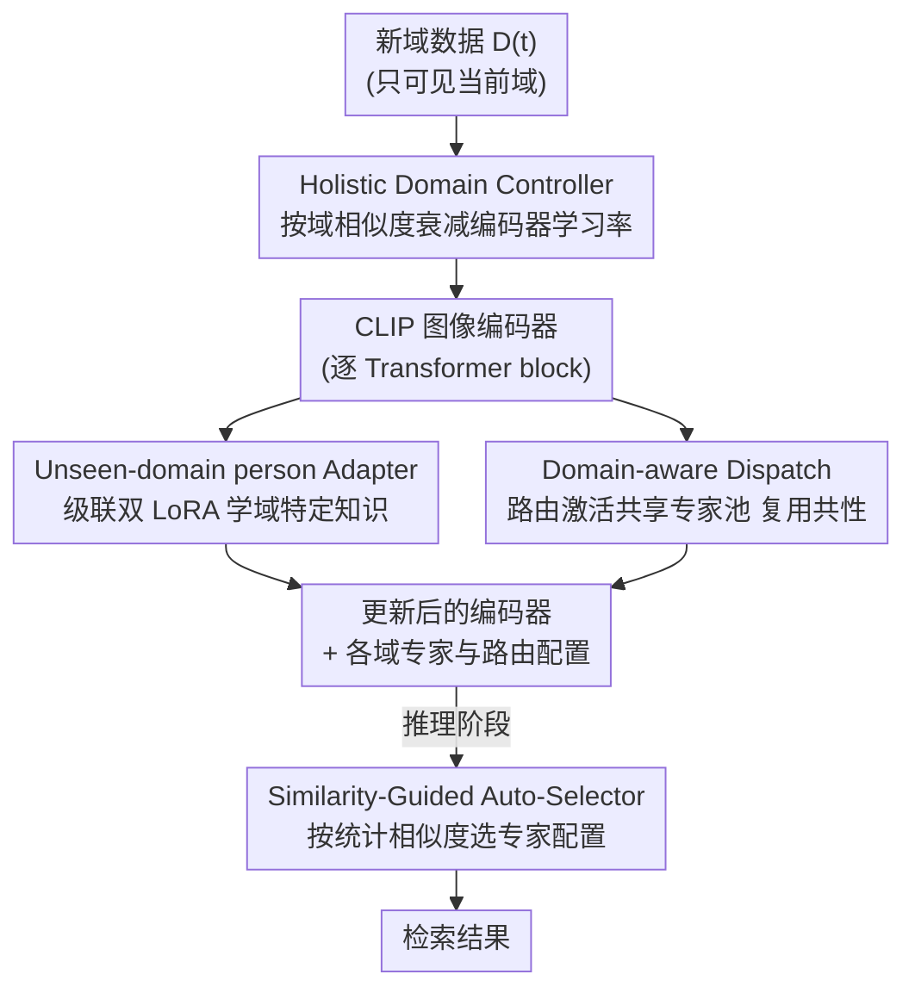

# Dynamic Magic: Unleashing Restricted Knowledge for Lifelong Person Re-Identification

**会议**: CVPR 2026  
**论文**: [CVF Open Access](https://openaccess.thecvf.com/content/CVPR2026/html/Peng_Dynamic_Magic_Unleashing_Restricted_Knowledge_for_Lifelong_Person_Re-Identification_CVPR_2026_paper.html)  
**代码**: 未公开  
**领域**: 人体理解 / 终身学习 / 行人重识别  
**关键词**: 终身行人重识别, 灾难性遗忘, 动态扩展, LoRA专家适配器, 跨域知识复用

## 一句话总结
针对终身行人重识别（LReID）中固定网络架构"塞不下"持续累积知识、导致灾难性遗忘的问题，本文提出动态扩展框架 VIA：用级联双 LoRA 适配器给每个新域单独建模、用共享专家池路由复用跨域共性、再用域相似度自适应调节编码器学习率，最终在 5 个见过域上把平均 mAP 从 baseline 的 66.4% 拉到 77.7%。

## 研究背景与动机
**领域现状**：行人重识别（ReID）要在不同摄像头视角下检索同一个人。终身行人重识别（LReID）更进一步——监控环境随光照、视角、人群外观不断变化，模型要在一连串新域上持续学习，且不能回看旧域数据（隐私约束）。现有方法分两派：rehearsal-based（存少量旧样本回放）和 distillation-based（约束新模型输出/表征向旧模型对齐），后者在 LReID 中更主流。

**现有痛点**：无论蒸馏还是回放，这些方法都试图把越来越多样的域知识**硬塞进一个固定的网络架构**里。随着域数量增加，新知识不断覆盖旧参数，知识互相干扰严重，灾难性遗忘难以避免。蒸馏派还有个附带问题——旧模型自身保留了错误知识，得先做先验过滤和纠正才能保证蒸馏有效。

**核心矛盾**：固定容量的架构与"持续膨胀的知识量"之间存在根本矛盾。静态参数共享让所有域抢同一组权重，新域适配必然以牺牲旧域为代价；但如果完全隔离每个域又会让跨域共性（背景、视角、光照这些其实可以复用的模式）被割裂，浪费容量。

**本文目标**：打破对固定架构的依赖，做一个**可动态扩展**的框架，既要隔离域特定知识防干扰、又要复用跨域共性知识、还要保住大预训练模型的全局泛化能力。

**切入角度**：作者借鉴模块化学习（modular learning）的思路，把"一个模块学所有知识"拆成"三类互补知识 × 三个专门模块"——域特定知识、域子集共享知识、全局可迁移知识各管各的。底座用 CLIP-ReID（ViT-B/16），新增的全是轻量 LoRA 适配器。

**核心 idea**：与其在固定网络里反复覆盖，不如**给每个新域动态长出一组轻量专家适配器**（隔离），同时维护一个共享专家池供跨域按需调用（复用），再根据新域与旧域的相似度动态收紧编码器学习率（保泛化）。

## 方法详解

### 整体框架
VIA（Versatile Incremental Adaptation）建在冻结的 CLIP-ReID 图像编码器上，把"持续学习"转成"持续往 Transformer block 里加轻量适配器 + 动态路由"。四个核心组件分工明确：**UnA** 给每个域建独立的专家适配器（域内隔离），**DAD** 维护一个跨域共享的专家池并用路由按需激活（域间复用），**HDC** 根据域相似度调节编码器学习率（全局保泛化），推理时 **SGAS** 不靠域标签、纯统计相似度把测试样本派到对应专家配置。

训练对每个新域 $D^{(t)}$ 分两阶段交替：先冻结图像侧、训练文本分支 120 epoch 学 identity token；再冻结文本侧、训练图像编码器与适配器 60 epoch。整个流程见下图。

### 关键设计

**1. UnA — 级联双 LoRA 适配器：把域特定知识从静态共享里"解放"出来**

固定架构最大的毛病是所有域共享一套 MLP 权重、互相覆盖。UnA 给每个域 $t$ 在每个 Transformer 层的 MLP 内部嵌入两个独立的 LoRA 专家 $E^f_t$ 和 $E^p_t$，把域特定知识隔离开。它没有像常规做法那样把 adapter 并联在 MLP 旁边（图 3a）或塞进多头注意力（图 3b），而是把两个 adapter **级联**进 MLP 的前向计算里：

$$h_{fc} = W_{fc}\cdot x_t + E^f_t(x_t),\quad h_{gelu} = \mathrm{GELU}(h_{fc}),\quad y^t_a = W_{proj}\cdot h_{gelu} + E^p_t(h_{gelu})$$

关键在于第一个 adapter 放在激活函数**之前**、作用于原始线性响应，负责粗对齐低层外观偏移（光照、纹理）；GELU 非线性变换后，第二个 adapter 处理被压缩、重加权过的特征，精修高层域特定语义。两个 adapter 在互补层级上调特征，比单点插入对细微域变化更敏感、更鲁棒。消融（表 4）显示这种 MLP 内级联插入比 QKV/Proj 单插都好。

**2. DAD — 共享专家池 + 路由：在隔离之外把跨域共性"接回来"**

UnA 隔离得太彻底会导致知识碎片化——背景、体态、光照这些本可在域子集间复用的共性被割开。DAD 维护一个轻量的共享 LoRA 专家池 $\{E_1,\dots,E_{N_E}\}$，给每个域配一个路由器 $R_t$，用 [CLS] token $c_t$ 算门控、Top-k（实现里 k=3）选出最相关的几个专家加权求和：

$$y^t_b = \sum_{i=1}^{N_E} W^t_i E_i(x_t),\quad W^t = \mathrm{Softmax}(\mathrm{Topk}(R_t(c_t)))$$

DAD 还配两个稳定机制。其一是**结构级解耦损失**，对共享专家两两施加 Frobenius 正交约束，逼专家学不同子空间、减少冗余：$L_{dec}=\sum_{i}\sum_{j>i}\big(\lVert A_iA_j^\top\rVert_F^2+\lVert B_i^\top B_j\rVert_F^2\big)$（$A_i,B_i$ 是 LoRA 的两个低秩投影矩阵）。其二是**域感知路由迁移**：训新域前先找到与它最相似的旧域 $j=\arg\max_k s_{t,k}$，用 $R_j$ 的参数初始化 $R_t$，让路由从对齐过的表示空间出发，加速收敛、减少负迁移。

**3. HDC — 按相似度衰减学习率：保住大模型的全局泛化潜力**

DAD 只复用域子集间的局部共性，保不住"对所有域都通用"的全局不变特征。HDC 从全局调控编码器容量：第一个域用标准初始学习率 $\eta_0$，之后每个域 $t$ 的初始学习率按"与旧域平均相似度"和"已学域数"双重指数衰减：

$$\eta_t = \eta_0\cdot\Big(\tfrac{1}{t-1}\sum_{i=1}^{t-1}s_{t,i}\Big)^{t-1}$$

相似度越低、已学域越多，衰减越狠——既限制对累积的通用知识做破坏性更新、又给域特定适配留足空间。域相似度 $s_{t,i}$ 用 2-Wasserstein 距离度量两域特征分布（用 Inception-V3 抽 768 维特征统计 $\mu,\Sigma$）：$s_{t,i}=\exp\!\big(-\tfrac{1}{\tau}D(\mu_t,\Sigma_t;\mu_i,\Sigma_i)\big)$，$\tau$ 控制敏感度。这个相似度同时被 DAD 的路由迁移和 HDC 复用。

**4. SGAS — 推理期统计相似度自选专家：不靠域标签也能派对路**

UnA 和 DAD 都引入了域专属适配器与路由，推理时来一张测试图，怎么知道该用哪套？SGAS 不引入额外域分类器、不依赖域标签，纯靠统计相似度：把测试样本与每个见过域存下来的统计量（均值、协方差）按上面同一个 $s_{t,i}$ 比一遍，选最相似域的专家配置 $k=\arg\max_i s_{t,i}$ 来派发输入。轻量、域无关，省下训练额外分类器的开销。

> ⚠️ 论文未给出 $L_{dec}$ 与三元组/ID/跨模态损失的最终加权系数全表，仅说图像分支由 $L_{i2tce}+L_{tri}+L_{id}+L_{dec}$ 组合优化、解耦损失权重 $\lambda=1.0$ 最佳，具体配比以原文为准。

### 损失函数 / 训练策略
两阶段交替训练（每个新任务）：(1) 文本分支训 120 epoch，用 CLIP-style prompt 学 identity token $[X_i]$，配对比损失 $L_{t2i}, L_{i2t}$；(2) 冻文本、训图像编码器与适配器 60 epoch，用跨模态损失 $L_{i2tce}$ + 三元组损失 $L_{tri}$ + ID 损失 $L_{id}$ + 解耦损失 $L_{dec}$。Adam 优化、batch=64、LoRA rank $r=64$、$\alpha=512$、共享专家数 5、Top-3 门控，单卡 A4000。

## 实验关键数据

### 主实验（Training Order-1，5 见过域 + 7 未见域）

| 方法 | 来源 | Seen-Avg mAP/R@1 | UnSeen-Avg mAP/R@1 |
|------|------|------|------|
| LSTKC++ | T-PAMI 2025 | 55.2 / 66.7 | 63.2 / 56.3 |
| DASK | AAAI 2025 | 55.4 / 69.3 | 65.3 / 58.4 |
| Baseline (CLIP-ReID) | 本文基线 | 66.4 / 78.1 | 73.1 / 66.5 |
| **VIA (本文)** | 本文 | **77.7 / 86.6** | **77.1 / 70.8** |

单域上提升更夸张：DukeMTMC-reID mAP 从 DASK 的 58.5% 提到 79.9%；MSMT17 从 29.1% 提到 57.5%。Order-2 顺序下结论一致（Seen-Avg 77.4/86.2）。

### 消融实验（逐步叠加模块，Order-1）

| 配置 | Seen-Avg mAP/R@1 | UnSeen-Avg mAP/R@1 | 说明 |
|------|------|------|------|
| Baseline | 66.4 / 78.1 | 73.1 / 66.5 | CLIP-ReID |
| + UnA | 71.9 / 81.5 | 61.8 / 55.1 | 见过域 +5.5 mAP，但未见域掉（隔离过头） |
| + DAD | 57.6 / 70.7 | 71.1 / 64.0 | 单独 DAD 见过域反而弱 |
| + UnA + DAD | 74.0 / 83.3 | 72.5 / 65.8 | 两者互补 |
| **Full (+ HDC)** | **77.7 / 86.6** | **77.1 / 70.8** | HDC 把泛化救回来 |

### 关键发现
- **UnA 强在见过域、弱在未见域**：单加 UnA 见过域 mAP +5.5，但未见域反而从 73.1 掉到 61.8——纯隔离让模型过拟合每个域、丢了跨域泛化。这正是必须配 DAD/HDC 的原因。
- **DAD 强在未见域、HDC 补全局**：UnA+DAD 把未见域救回 72.5，再加 HDC 同时把见过域（+3.7）和未见域（+4.6）一起拉高，说明"局部共享 + 全局调控"缺一不可。
- **关键超参**：共享专家数从 3→5 持续涨、超过 5 饱和（冗余）；LoRA rank 越大越好（受存储限制止于 64），$\alpha/r=10$ 过大反而退化；解耦损失权重 $\lambda=1.0$ 最佳。
- **开销可接受**：每个新域平均只加 11M 可训练参数、约 291M 额外 GPU 显存、39M 存储，相对 10%+ 的性能收益是划算的。

## 亮点与洞察
- **"三类知识 × 三模块"的拆法干净**：域特定（UnA 隔离）、域子集共享（DAD 复用）、全局通用（HDC 保护）三层正交，消融里能清楚看到每层各自负责见过/未见域的哪部分收益，而不是一锅炖。
- **级联双 adapter 的位置很巧**：一个放 GELU 前管低层外观、一个放 GELU 后管高层语义，借激活函数天然分工——比并联/单插更贴合"域偏移既有低层也有高层"的本质。
- **一个相似度三处复用**：2-Wasserstein 域相似度同时驱动 HDC 学习率衰减、DAD 路由迁移初始化、SGAS 推理选专家，设计上很经济，可迁移到任何"需要判断新旧任务远近"的持续学习场景。
- **推理免域标签**：SGAS 纯统计量选专家，省掉额外域分类器，对真实部署友好。

## 局限与展望
- **存储随域线性增长**：每个新域都长一组适配器与路由，域数量极多时存储/显存仍会累积（11M/域），论文也因存储约束没探索 rank>64。长序列下的可扩展性还需验证。
- **依赖外部特征抽取器算分布**：域相似度用 Inception-V3 抽 768 维特征统计 $\mu,\Sigma$，相似度质量受这个外部 backbone 影响，作者未分析其敏感性。⚠️ 这是笔记观察。
- **未见域泛化靠"选最近见过域"**：SGAS 把测试样本派给最相似的见过域专家配置，若测试域与所有见过域都很远，这种 argmax 选择是否仍最优值得探讨。
- 作者展望把 VIA 扩展到多模态终身学习任务。

## 相关工作与启发
- **vs 蒸馏派（LSTKC++ / DASK）**：他们在固定架构内约束新旧模型一致来抗遗忘，域多了仍会知识干扰；VIA 改成动态扩展、给每域长独立适配器，从根上回避覆盖，见过域 mAP 比 DASK 高 22 个点。
- **vs 常规 adapter 插入（并联 MLP / 注意力内嵌）**：本文把双 LoRA 级联进 MLP 内部、借 GELU 分工低层/高层，消融（表 4）证明比并联和单点插入都强。
- **vs MoE 路由**：DAD 借鉴了 Top-k 专家门控的思路，但额外加结构级解耦损失防专家冗余、加域感知路由迁移防冷启动负迁移，是针对 LReID 跨域场景的定制。

## 评分
- 新颖性: ⭐⭐⭐⭐ 把动态扩展 + 三类知识分治系统地引入 LReID，级联双 adapter 与一相似度三用都有巧思
- 实验充分度: ⭐⭐⭐⭐⭐ 两种训练顺序、5 见 7 未见域、模块/插入/路由迁移/学习率/超参全套消融 + 开销分析
- 写作质量: ⭐⭐⭐⭐ 框架清晰、公式完整，但部分损失加权系数未给全表
- 价值: ⭐⭐⭐⭐ 在 LReID 上大幅刷新 SOTA 且开销可控，对真实监控部署有实用意义

<!-- RELATED:START -->

## 相关论文

- [\[CVPR 2026\] Prompt-Anchored Vision–Text Distillation for Lifelong Person Re-identification](prompt-anchored_vision-text_distillation_for_lifelong_person_re-identification.md)
- [\[CVPR 2026\] Vision-Language Attribute Disentanglement and Reinforcement for Lifelong Person Re-Identification](vision-language_attribute_disentanglement_and_reinforcement_for_lifelong_person_.md)
- [\[CVPR 2026\] Composite-Attribute Person Re-Identification via Pose-Guided Disentanglement](composite-attribute_person_re-identification_via_pose-guided_disentanglement.md)
- [\[CVPR 2026\] View-Aware Semantic Alignment for Aerial-Ground Person Re-Identification](view-aware_semantic_alignment_for_aerial-ground_person_re-identification.md)
- [\[CVPR 2026\] Pose-guided Enriched Feature Learning for Federated-by-camera Person Re-identification](pose-guided_enriched_feature_learning_for_federated-by-camera_person_re-identifi.md)

<!-- RELATED:END -->
