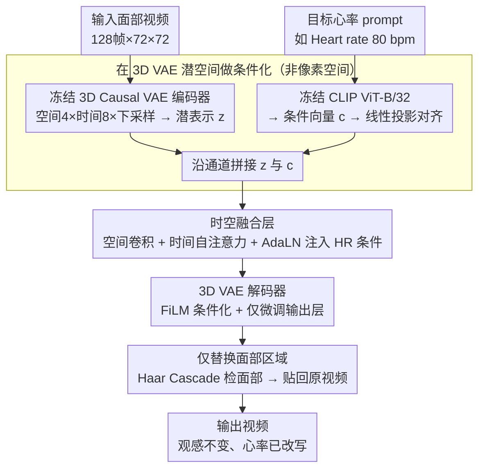

# Editing Physiological Signals in Videos Using Latent Representations

**会议**: CVPR 2026  
**arXiv**: [2509.25348](https://arxiv.org/abs/2509.25348)  
**代码**: 有（论文承诺公开）  
**领域**: 人体理解  
**关键词**: 心率编辑, rPPG隐私, 视频生理信号, 3D VAE, 生物特征匿名化, FiLM, AdaLN

## 一句话总结

提出PhysioLatent框架，将输入面部视频编码到3D VAE潜空间，与目标心率CLIP文本嵌入融合，通过AdaLN增强的时空融合层捕捉rPPG时间相干性，结合FiLM调制解码器和微调输出层实现精确心率修改，在保持PSNR 38.96dB/SSIM 0.98的视觉质量下达到10 bpm MAE的心率调制精度。

## 研究背景与动机

**领域现状**：摄像头远程光电容积脉搏波(rPPG)技术可从面部视频无接触提取心率，是远程健康监测的关键技术。但这也意味着面部视频中不可见地嵌入了敏感生理信息，可被算法提取用于隐蔽的健康推断、情绪监控和生物特征画像。

**现有痛点**：

1. 现有视觉隐私方法（人脸模糊/替换）可能意外破坏或保留PPG信号，且不专门处理生理信息维度的隐私
2. 面部替换同时引入新的身份线索——在隐私保护场景中不理想
3. PulseEdit等直接在像素空间操作的方法时间相干性差(Low temporal coherency)
4. 无法精确地将心率修改到目标值（如统一为固定HR做匿名化）

**核心矛盾**：rPPG信号嵌入在微妙的皮肤颜色变化中(<1%像素值变化)，肉眼不可见但算法可提取——需要在完全不影响视觉外观的前提下精确修改这种"看不见"的信号。

**本文目标** 构建一个可控的视频生理信号编辑框架——能将心率精确修改到任意目标值，同时保持高视觉保真度。

**切入角度**：在3D VAE潜空间做心率编辑——利用潜空间的压缩性做精确调制 + 兼容视频生成管线 + 时空融合层捕捉rPPG周期特性。

**核心 idea**：3D VAE潜空间编辑 + AdaLN时间注意力条件化 + FiLM解码器微调 = 精确可控的心率修改。

## 方法详解

### 整体框架

这篇论文要解决的，是怎么把一段面部视频里"看不见"的心率信号精确改写到任意目标值，同时让画面看起来和原视频一模一样。难点在于 rPPG 信号藏在不到 1% 的皮肤颜色周期波动里——肉眼无感，却能被算法稳定提取——所以编辑既不能破坏视觉外观，又要精准命中目标频率。

PhysioLatent 把这件事搬到 3D VAE 的潜空间里做。一段 128 帧、72×72 的面部视频先经冻结的 3D Causal VAE 编码器压成潜表示 $z$；目标心率写成一句文本 prompt（如 "Heart rate 80 bpm"），交给冻结的 CLIP ViT-B/32 得到条件向量 $c$。$c$ 经线性投影对齐 $z$ 的尺寸后沿通道拼接，送进唯一可训练的**时空融合层**（空间卷积 + 时间自注意力 + AdaLN 注入 HR 条件）完成调制，再由 3D Causal VAE 解码器（FiLM 条件化 + 微调输出层）还原成视频。最后用 Haar Cascade 检出面部区域、只把这块替换回原视频，其余像素原样保留——于是观感不变、心率已被改写。

### 关键设计

**1. 在 3D VAE 潜空间而非像素空间做编辑：让微妙信号可被精确调制**

PulseEdit 这类方法直接在像素上动手，时间相干性差、HR 也调不准，根源在于 rPPG 是一个跨帧的周期序列，逐像素编辑很难维持帧间一致。PhysioLatent 改用空间 4×、时间 8× 下采样的 3D Causal VAE：3D 潜表示天然把时空相干性压进一个紧凑空间，在这里调制频率比在高维像素上稳定得多。这个选择还有个顺带的好处——该潜空间与 Latent Diffusion / Video Diffusion 同源，意味着 PhysioLatent 可以直接挂在生成视频管线后面当后处理模块。CLIP 的 512 维文本嵌入投影后与视频潜表示沿通道拼接，给出一个统一的条件化接口。

**2. AdaLN 时空融合层：把目标频率写进归一化参数，建模长程时间相干性**

光把条件拼进去还不够，因为心率是周期信号，调制必须跨帧一致。融合层用可分解的空间—时间自注意力显式建模这种长程时间相干性，再用 AdaLN（Adaptive Layer Normalization）把 HR 条件注入时间注意力流——目标频率被编码进归一化的缩放/偏移参数里，逐层引导特征朝目标周期收敛。作者对比过只用 (2+1)D 卷积的朴素方案：卷积只能捕局部模式、抓不住长程依赖，HR 调制因此不准。由于 rPPG 变化在亚像素级（<1% 像素值），唯有这种精细的长程时间条件化才压得住目标频率。

**3. FiLM 解码器条件化 + 只微调输出层：防止解码器把刚改好的信号"擦掉"**

一个现实障碍是：标准 3D VAE 解码器优化目标是通用视频重建，它会在还原画面时把刚注入的微妙 rPPG 调制顺手抹平。PhysioLatent 用 FiLM（Feature-wise Linear Modulation）在解码器中间层再注入一次 HR 条件——CLIP 投影出的嵌入生成逐通道的缩放和偏移，调制解码器激活，让生理信号在解码全程被显式保持。同时只微调解码器的输出层、冻住其余部分，既保留了预训练的视觉重建能力，又让最后一层适配这种极精细的颜色变化。

**4. 仅替换面部区域：把保真度兜到非面部像素的"零误差"**

用 Haar Cascade 人脸检测器生成面部 mask $M$，解码器输出只在面部区域替换回原视频，背景、衣服、头发等非面部像素原封不动。这样 VAE 重建带来的微小损失被局限在脸部，画面其余部分保持完美保真。

### 损失函数 / 训练策略

- **视觉保真损失**：$\mathcal{L}_F = \text{MSE}(v, \hat{v}) + \text{LPIPS}(v, \hat{v})$
- **波形损失**（形态引导）：$\mathcal{L}_{\text{wave}} = 1 - \text{Pearson}(rPPG(\hat{v}), \sin(2\pi f t))$，f=HR_d/60，引导rPPG趋向目标频率的平滑周期波形
- **频率损失**（精确对齐）：$\mathcal{L}_{\text{freq}} = |f - f_{\text{pred}}|$，f_pred由FFT获取
- 课程学习策略：前10 epoch仅用视觉+波形损失→第10 epoch起线性ramp频率损失权重 $\beta(t) = 0.005(t-10)$
- **总损失**：$\mathcal{L} = 0.2\mathcal{L}_{\text{wave}} + \beta(t)\mathcal{L}_{\text{freq}} + 1.0\mathcal{L}_F$
- 训练：4×RTX4090, batch=4, 30 epochs, AdamW, OneCycle lr=5e-4, 输入128帧×72×72

## 实验关键数据

### 主实验（跨数据集，POS估计器）

| 数据集 | 目标HR | PSNR↑(dB) | SSIM↑ | 输入MAE(bpm) | 输出MAE↓(bpm) | 输出MAPE↓(%) |
|--------|--------|-----------|-------|-------------|--------------|-------------|
| PURE | 60 bpm | 39.04 | 0.98 | 38.95 | 9.22 | 8.20 |
| PURE | 80 bpm | 39.02 | 0.98 | 41.80 | 9.98 | 10.55 |
| PURE | 100 bpm | 38.85 | 0.98 | 44.67 | 10.41 | 10.29 |
| PURE | 120 bpm | 38.94 | 0.98 | 50.63 | 10.36 | 11.34 |
| **PURE Avg** | - | **38.96** | **0.98** | 44.01 | **10.00** | **10.09** |
| UBFC Avg | - | 40.09 | 0.98 | 26.77 | 11.08 | 10.57 |
| MMPD Avg | - | 37.50 | 0.95 | 44.58 | 9.84 | 8.09 |

### Benchmark对比（目标HR=120 bpm, POS估计器）

| 数据集 | 方法 | PSNR↑(dB) | SSIM↑ | 输出MAE↓(bpm) | 输出MAPE↓(%) |
|--------|------|-----------|-------|--------------|-------------|
| PURE | **PhysioLatent** | 38.94 | **0.9761** | **10.36** | **11.34** |
| PURE | PulseEdit | **42.68** | 0.9720 | 16.71 | 12.26 |
| UBFC | **PhysioLatent** | 40.04 | 0.9803 | **11.18** | **10.15** |
| UBFC | PulseEdit | **43.08** | **0.9867** | 15.07 | 15.56 |
| MMPD | **PhysioLatent** | 37.87 | 0.9542 | **10.75** | **7.96** |
| MMPD | PulseEdit | **41.72** | **0.9664** | 20.36 | 18.30 |

### 关键发现

- PSNR>38 dB + SSIM≥0.95 = 对人眼完全不可见的修改→成功的"看不见的隐私保护"
- HR调制MAE约10 bpm，比PulseEdit(16-20 bpm)低6-10 bpm——时间相干性建模的优势
- PulseEdit在PSNR上更高(42-43 vs 38-40)但HR准确度差(MAE 15-20 vs 10-11)——trade-off不同
- 7种rPPG估计器（PCA/POS/CHROM/TSCAN/DeepPhys/PhysNet/PhysFormer++）均被成功误导至目标HR——验证了方法的鲁棒性
- MMPD（多肤色/多光照）上PSNR略低(37.5)但HR准确度反而最好(MAE 9.84)——说明HR编辑不依赖特定外观条件

## 亮点与洞察

- **"看不见的隐私"问题定义精准**：首次专门针对视频中不可见的生理信号进行可控编辑——人脸模糊/替换无法解决的隐私维度
- **3D VAE兼容视频生成管线**：在Latent Diffusion/Video Diffusion的潜空间工作→可直接作为生成视频框架的后处理模块
- **匿名化+合成的双重价值**：匿名化(固定HR=60)保护隐私；合成(指定任意HR)为rPPG研究生成带标注的训练数据
- **微妙信号编辑的工程方案**：rPPG变化<1%像素值→AdaLN长程时间条件化 + FiLM解码器显式保持 + 微调输出层适配精度的三层保障

## 局限与展望

- HR MAE约10 bpm对精确健康监测应用仍嫌大——需进一步提高频率对齐精度
- 当前仅处理心率→呼吸率/血压/血氧等生理信号的编辑待探索
- 3D VAE编解码本身引入微妙视觉变化（PSNR≈39不是无限），高频区域(边缘/纹理)可见局部失真
- 未验证运动鲁棒性（Table 1中motion robustness列标记为No）
- PulseEdit在PSNR上更高(+3-4dB)——说明VAE重建本身是视觉质量的瓶颈

## 相关工作与启发

- **vs PulseEdit**：像素空间直接操作，PSNR更高但时间相干性低(Low)且HR准确度差(MAE 15-20)；PhysioLatent在潜空间操作，HR准确度好2倍(MAE 10)但PSNR低3-4dB
- **vs Privacy-Phys**：3D CNN直接修改rPPG，但时间相干性低且无法精确控制目标HR
- **vs Wang et al.**：GAN生成条件化rPPG视频，但无法处理信号移除
- 启发：潜空间编辑的范式可推广到其他不可见信号的控制（如视频中的音频水印、运动模式等）；3D VAE+CLIP条件化的接口设计天然兼容现有生成管线

## 评分

- 新颖性: ⭐⭐⭐⭐⭐ 视频中不可见的生理信号编辑是全新问题，潜空间编辑方案优雅
- 实验充分度: ⭐⭐⭐⭐ 3个数据集、7种rPPG估计器验证、与PulseEdit的系统对比、消融齐全
- 写作质量: ⭐⭐⭐⭐ 问题动机("看不见的隐私")清晰有力，rPPG两大特性(时间相干+视觉不可见)的图示直观
- 价值: ⭐⭐⭐⭐ 对AI隐私保护和rPPG研究数据生成均有贡献，3D VAE兼容性有工程价值

<!-- RELATED:START -->

## 相关论文

- [\[CVPR 2026\] SVC 2026: The Second Multimodal Deception Detection Challenge and the First Domain Generalized Remote Physiological Measurement Challenge](svc_2026_the_second_multimodal_deception_detection_challenge_and_the_first_domai.md)
- [\[CVPR 2026\] UniDex: A Robot Foundation Suite for Universal Dexterous Hand Control from Egocentric Human Videos](unidex_a_robot_foundation_suite_for_universal_dexterous_hand_control_from_egocen.md)
- [\[CVPR 2025\] VI3NR: Variance Informed Initialization for Implicit Neural Representations](../../CVPR2025/human_understanding/vi3nr_variance_informed_initialization_for_implicit_neural_representations.md)
- [\[AAAI 2026\] KineST: A Kinematics-guided Spatiotemporal State Space Model for Human Motion Tracking from Sparse Signals](../../AAAI2026/human_understanding/kinest_a_kinematics-guided_spatiotemporal_state_space_model_for_human_motion_tra.md)
- [\[ECCV 2024\] ADen: Adaptive Density Representations for Sparse-view Camera Pose Estimation](../../ECCV2024/human_understanding/aden_adaptive_density_representations_for_sparseview_camera.md)

<!-- RELATED:END -->
