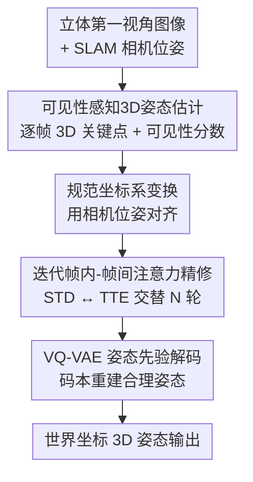

# Egocentric Visibility-Aware Human Pose Estimation

**会议**: CVPR 2026  
**论文**: [CVF Open Access](https://openaccess.thecvf.com/content/CVPR2026/html/Dai_Egocentric_Visibility-Aware_Human_Pose_Estimation_CVPR_2026_paper.html)  
**代码**: 未开源（无）  
**领域**: 3D视觉 / 人体姿态估计  
**关键词**: 第一视角姿态估计, 关键点可见性, VQ-VAE 姿态先验, 数据集, VR/AR  

## 一句话总结
针对头戴设备第一视角人体姿态估计中"关键点经常看不见"的痛点，本文构建了首个带可见性标注的大规模真实数据集 Eva-3M（300 万帧、43.5 万帧可见性标签），并提出 EvaPose——显式预测每个关键点可见性、并用可见性给损失加权，把可见关键点的 MPJPE 从 FRAME 的 49.8mm 降到 34.2mm。

## 研究背景与动机
**领域现状**：用头戴设备（HMD，如 VR 头显）做第一视角（egocentric）人体姿态估计是 VR/AR、机器人遥操作的关键能力。和外部相机的"由外向内"不同，第一视角相机朝下拍自己的身体，主流做法（UnrealEgo、EgoPoseFormer、FRAME）是从立体图像预测 2D 热图再 lift 到 3D，近期还引入 SLAM 相机位姿做时序与全局对齐。

**现有痛点**：第一视角的核心难题是**关键点不可见**，来自两个原因——一是身体部位（尤其下半身）严重自遮挡，二是头戴相机视场角（FoV）有限，手脚伸出去就拍不全。统计显示 Eva-3M 中肢体关键点有近一半时间是不可见的。但现有方法对可见点和不可见点**一视同仁**地估计，不可见点没有直接视觉证据、3D 位置天然模糊，这种"混为一谈"的处理反过来**拖累了可见点的精度**。

**核心矛盾**：可见点本可以估得很准，但训练时不可见点的高噪声监督信号会污染共享网络；问题的根子在于——既没有数据标注告诉模型哪些点可见，方法也没有机制去区分对待。

**本文目标**：(1) 提供带可见性标注的真实第一视角数据集；(2) 设计一个显式利用可见性信息、把不可见点的干扰隔离开的姿态估计方法。

**切入角度**：作者认为关键点可见性不是副产品，而应该是一个**被显式预测、并参与监督加权**的一等公民。先花大力气标注可见性（这是过去所有数据集都缺的），再让网络预测可见性并据此分配损失权重。

**核心 idea**：用"预测可见性 + 按可见性给损失加权"把不可见点降权，再用 mocap 学到的 VQ-VAE 姿态先验兜底不可见点，从而在不牺牲不可见点的前提下大幅提升可见点精度。

## 方法详解

### 整体框架
EvaPose 输入是一段 $T$ 帧的立体第一视角观测——左右灰度图 $I^{1:T}_L, I^{1:T}_R$ 以及 HMD 内置 SLAM 给出的相机位姿 $C^{1:T}_L, C^{1:T}_R$（每个位姿 $C^t_v=[R^t_v|T^t_v]\in\mathbb{R}^{3\times4}$），输出是世界坐标系下的 SMPL 关键点序列 $J^{1:T}_W$，整体建模为 $f_\phi(J^{1:T}_W \mid I^{1:T}_L, I^{1:T}_R, C^{1:T}_L, C^{1:T}_R)$。

pipeline 分三步走：先由**可见性感知 3D 姿态估计网络**逐帧预测相机坐标系下的 3D 关键点 $J^t_{Cam}$ 和每点的可见性分数 $S^t_{Vis}$；再借助相机位姿把这些点变换到一个对平移/绕竖轴旋转不变的**规范坐标系**（canonical），喂给**迭代帧内-帧间注意力网络**做多视角与时序融合；最后把融合特征过一个在大规模 mocap 上预训练好的 **VQ-VAE 解码器**重建出高保真 3D 姿态，再转回世界坐标。其中 VQ-VAE 在整个 EvaPose 训练中冻结，充当强姿态先验。

### 关键设计

**1. Eva-3M 数据集与可见性标注：给"看不见"这件事第一次配上标签**

过去第一视角数据集要么是合成的（有完美标注但 domain gap 大），要么用定制采集架（凸出的相机摆位刻意减少自遮挡，和真实 VR 设备的纤薄外形不符），且**没有一个提供关键点可见性标注**。本文用商用 Pico4 Ultra VR-MR 头显采集了 1,353 段动作序列、300 万同步帧，覆盖 31 名受试者、24 类日常 VR 动作，每帧含成对立体灰度图（640×480）、相机/世界坐标下的 GT SMPL 参数与 2D/3D 关键点，其中 **43.5 万帧带逐关键点可见性标签**——这是首个同时提供真实 GT SMPL 姿态与可见性标注的真实第一视角数据集。作者还顺手给已有的 EMHI 数据集补标了 48.8 万帧可见性标签。Eva-3M 的运动多样性也更广：对 spine1（内部点）和右踝（末端点）随机采样 7 万个根相对坐标做归一化分布对比，Eva-3M 的空间覆盖范围和坐标方差都明显大于 EMHI。这套标注是后面所有"可见性感知"机制能成立的前提。

**2. 可见性感知 3D 姿态估计网络：首次显式预测可见性并据此给损失加权**

这是隔离"不可见点污染可见点"的核心。给定立体图像对，图像编码器抽出特征 $F_L, F_R$，再分两条轻量解码头：一条按 ViTPose 风格用反卷积层预测 2D 热图 $H_v\in\mathbb{R}^{N_J\times H'\times W'}$，另一条用卷积+MLP 预测可见性分数 $S_v\in\mathbb{R}^{N_J}$。关键一步是构造**可见性感知热图** $H'_{i,v}=s_{i,v}\cdot H_{i,v}$，即用预测的可见性分数去调制对应关键点的热图，让不可见点的热图响应被天然压低；这些热图 patch embedding 后过三层 ViT encoder 建模跨关节、跨视角依赖，最后把第 $i$ 个关键点左右视角的 token 拼接经 MLP 回归出相机坐标 3D 位置 $J^i_{Cam}$，可见性分数取左右平均 $S_{Vis}=(S_L+S_R)/2$。

更关键的是训练阶段的**可见性加权损失**。第一阶段损失为 $L_{stage1}=\lambda_{vis}L_{vis}+\lambda_{heatmap}L_{heatmap}+\lambda_{3D}L_{3D}$，其中 $L_{vis}$ 是预测与 GT 可见性的二元交叉熵，热图损失和 3D 损失都乘上一个按可见性取值的权重函数 $w(\cdot)$：

$$L_{heatmap}=\frac{1}{2N_J}\sum_{j=1}^{2}\sum_{i=1}^{N_J} w(s_{i,j})\cdot \mathrm{MSE}(H_{i,j},\bar H_{i,j}),\quad L_{3D}=\frac{1}{N_J}\sum_{i=1}^{N_J}\frac{w(s_{i,1})+w(s_{i,2})}{2}\cdot \mathrm{MSE}(J^i_{Cam},\bar J^i_{Cam})$$

权重函数对可见点取 $w=1.0$、对不可见点取 $w=0.1$，把不可靠的不可见点监督降权到十分之一。这样网络的容量被引导去拟合那些"有视觉证据"的点，可见点精度因此显著提升，而不可见点交给后面的先验兜底。

**3. 迭代帧内-帧间注意力精修：STD 管多视角、TTE 管时序，交替迭代**

逐帧预测缺乏时序一致性与跨视角充分融合。先用相机位姿把 $J^{1:T}_{Cam}$ 变换到规范坐标 $J^{1:T}_{Can}$（该坐标系把头关节投影到地面、对齐竖轴，对地面平移和绕竖轴旋转不变，适配不同身高体型的用户），把每帧的 $J^t_{Can}$ 与可见性分数 $S^t_{Vis}$ 拼接经前馈网络生成帧级 query $q^t_0$。随后这些 query 在 **Stereo Transformer Decoder（STD）** 和 **Temporal Transformer Encoder（TTE）** 之间交替迭代：STD 让每个 query 分别与左右视角视觉特征交互 $f^t_v=\mathrm{Decoder}(q^t_{n-1}, F_v),\ v\in\{L,R\}$，左右结果拼接过 MLP 得多视角融合特征 $f^t_n$；TTE 再把整窗口的 $\{f^t_n\}_{t=1}^{T}$ 做时序融合 $[q^1_n,\dots,q^T_n]=\mathrm{Encoder}([f^1_n,\dots,f^T_n])$。如此 $N$ 轮后既补足了单帧缺失的视觉证据，又抹平了时序抖动。

**4. VQ-VAE 姿态先验：用 mocap 码本给不可见点一个"合理"的兜底**

不可见点没有视觉证据，纯回归容易给出违反人体结构的姿态。本文先在 AMASS/MOYO/AIST++ 等大规模 mocap 上预训练一个 VQ-VAE：编码器把规范坐标 3D 关键点 $J_{Can}$ 编成隐序列 $z=E(J_{Can})=[z_1,\dots,z_M]$，每个 $z_i$ 量化到可学习码本 $CB=\{c_k\}_{k=1}^{K}$ 中最近的码字（训练用 EMA 更新+周期性重置防码本坍缩）。在 EvaPose 中该 VQ-VAE 冻结，迭代注意力输出的特征 $q^t_N$ 经 MLP+softmax 估计 logits $\bar z^t=\mathrm{Softmax}(\mathrm{MLP}(q^t_N))\in\mathbb{R}^{M\times K}$，再与码本相乘得到**可微的近似量化特征** $z^t=\bar z^t_{M\times K}\times CB_{K\times D}$（避开直接选码字的不可微操作），最后过 VQ-VAE 解码器重建出落在"真实人体姿态流形"上的 3D 姿态。这一步是不可见点也能输出合理结果的关键。

### 损失函数 / 训练策略
两阶段训练：第一阶段训可见性感知估计网络，权重 $\lambda_{vis}=5\times10^{-3}, \lambda_{heatmap}=0.1, \lambda_{3D}=1.0$，batch 24、lr $1\times10^{-5}$、20 epoch。第二阶段训迭代注意力网络，用关节位置损失 $L_{joint}$（预测与 GT 3D 关节位置的 MSE）加平滑损失 $L_{smooth}$（预测与 GT 关节加速度的 MAE），batch 4、lr $1\times10^{-5}$、40 epoch、时间窗 $T=24$。VQ-VAE 全程冻结。两种 backbone：EvaPose-ResNet50（输入 640×480）与 EvaPose-ViT-L（0.3B 参数，输入 448×336）。

## 实验关键数据

### 主实验
在 Eva-3M 与 EMHI 上重训 UnrealEgo、EgoPoseFormer、FRAME 三个主流方法做公平对比，指标含 MPJPE、PA-MPJPE、上/下半身 PE、足/手 PE、Jitter（运动平滑度）、FPS（V100），单位 mm。

| 数据集 | 方法 | MPJPE↓ | PA-MPJPE↓ | L-PE↓ | FootPE↓ | Jitter↓ |
|--------|------|--------|-----------|-------|---------|---------|
| Eva-3M | FRAME（之前SOTA） | 49.8 | 35.1 | 60.5 | 77.4 | 3.1 |
| Eva-3M | EvaPose-ResNet50 | 35.6 | 24.7 | 46.1 | 58.4 | 3.0 |
| Eva-3M | EvaPose-ViT-L | **34.2** | **24.0** | **44.5** | **56.4** | 3.2 |
| EMHI-P2（未见动作） | FRAME | 60.5 | 44.3 | 67.4 | 78.6 | 6.4 |
| EMHI-P2 | EvaPose-ResNet50 | 38.5 | 29.5 | 48.8 | 61.9 | 3.1 |
| EMHI-P2 | EvaPose-ViT-L | **33.3** | **26.2** | **44.7** | **58.9** | 3.4 |

在 Eva-3M 上 MPJPE 从 49.8 降到 34.2mm（-31%）；在含未见动作的 EMHI-P2 上从 60.5 降到 33.3mm（-45%），泛化能力提升尤为明显，且 Jitter 大幅下降说明时序更平滑。

可见/不可见点分项（Eva-3M，肢体关键点均值，mm）显示提升集中在**可见点**：

| 方法 | 可见点 Mean | 不可见点 Mean |
|------|------------|--------------|
| FRAME | 70.0 | 79.4 |
| EvaPose-ResNet50 | 45.8 | 65.6 |
| EvaPose-ViT-L | **42.5** | **63.0** |

可见点误差几乎砍半（70.0→42.5），不可见点也有改善但幅度较小，印证了"降权不可见点 → 解放可见点精度"的设计意图。

### 消融实验

| 配置 | MPJPE↓ | PA-MPJPE↓ | VLK-PE↓ | ILK-PE↓ |
|------|--------|-----------|---------|---------|
| w/o 可见性 | 40.6 | 27.9 | 53.5 | 65.3 |
| with 可见性（Full） | **35.6** | **24.7** | **45.8** | 65.6 |

| TTE | STD | VQ-VAE | MPJPE↓ | PA-MPJPE↓ | Jitter↓ |
|-----|-----|--------|--------|-----------|---------|
| ✗ | ✗ | ✗ | 46.0 | 33.3 | 4.7 |
| ✓ | ✗ | ✗ | 40.3 | 27.0 | 2.5 |
| ✓ | ✓ | ✗ | 39.1 | 25.9 | 2.7 |
| ✓ | ✓ | ✓ | **35.6** | 24.7 | 3.0 |

### 关键发现
- **可见性加权的收益精准落在可见点**：加入可见性建模后，可见肢体点 VLK-PE 从 53.5 降到 45.8mm，而不可见肢体点 ILK-PE 几乎不变（65.3→65.6）。这正是设计初衷——降权不可见点不是为了把它们估得更准，而是阻止它们污染可见点。
- **三个模块逐级加分，各司其职**：TTE 贡献最大单步增益（46.0→40.3）且把 Jitter 从 4.7 砍到 2.5，说明时序融合同时提精度与平滑度；STD 补充多视角融合（40.3→39.1）；VQ-VAE 先验再降 3.5mm（39.1→35.6），主要靠解决不可见点的歧义。
- **精度-速度权衡明确**：EvaPose-ResNet50 在 V100 上 48 FPS 可实时，ViT-L（0.3B 参数）精度最高但仅 9.4 FPS。

## 亮点与洞察
- **把"可见性"从隐含副产品提升为显式监督信号**：$H'_{i,v}=s_{i,v}\cdot H_{i,v}$ 这一步用预测可见性调制热图、再配 $w=1.0/0.1$ 的损失加权，思路极简但抓住了"不可见点污染可见点"的真问题，可迁移到任何有遮挡/截断的姿态/关键点任务。
- **"降权坏数据"而非"硬补坏数据"的取舍很聪明**：实验证明不可见点本就难估准，与其逼网络拟合它们，不如把容量让给可见点、把不可见点交给 mocap 先验兜底，分工清晰。
- **可微近似量化绕开码本选择的不可微**：$z^t=\bar z^t\times CB$ 用 logits 乘码本代替 argmax 取码字，让 VQ-VAE 先验能端到端接入精修网络，是个可复用的工程 trick。
- **数据集本身是硬贡献**：首个真实 VR 设备采集、同时带 GT SMPL 与可见性标签的大规模数据集，且补标了 EMHI，降低了后续研究门槛。

## 局限与展望
- 作者承认：方法是数据驱动的，强依赖大规模高质量 GT 标注，而野外场景很难获取这类标注；未来方向是弱监督/自监督训练以提升泛化。
- ⚠️（自己观察）可见性权重 $w=0.1$ 是固定硬阈值，对不同关节/不同遮挡程度可能并非最优，是否该做成自适应或随训练退火值得探究。
- 不可见点精度提升有限（ILK-PE 几乎不变），意味着真正"看不见的下半身"仍主要靠先验猜，复杂或罕见姿态下不可见点可能不准；当前依赖 SLAM 相机位姿，位姿漂移对规范坐标变换的影响未单独评估。
- ViT-L 版本 9.4 FPS 难以满足 VR 实时需求，高精度与实时仍未兼得。

## 相关工作与启发
- **vs FRAME**：FRAME 也用相机位姿做全局对齐+时序融合，但对可见/不可见点一视同仁；本文显式预测可见性并加权，在 Eva-3M 上 MPJPE 49.8→34.2、可见点误差近乎减半，差距主要来自对可见点的"解放"。
- **vs EgoPoseFormer**：后者用可变形自注意力做多视角融合、DETR 式 coarse-to-fine，但无可见性建模也无强姿态先验；本文用 STD+TTE 迭代融合加 VQ-VAE 先验，在未见动作 EMHI-P2 上泛化优势尤为突出（62.6→33.3）。
- **vs EMHI / EgoBody3M 数据集**：两者都用真实 VR 设备但均未提供可见性标注；Eva-3M 首次补上这一空白，并以更广的运动多样性支撑可见性感知模型的训练与评测。

## 评分
- 新颖性: ⭐⭐⭐⭐ 把可见性显式化为预测目标+损失权重的思路直击痛点，但单个组件（VQ-VAE 先验、STD/TTE）多为已有技术组合。
- 实验充分度: ⭐⭐⭐⭐⭐ 双数据集、可见/不可见分项、逐组件消融、含未见动作泛化集，论证链条完整。
- 写作质量: ⭐⭐⭐⭐ 逻辑清晰、动机与设计对应紧密；部分坐标变换细节甩到补充材料。
- 价值: ⭐⭐⭐⭐⭐ 首个带可见性标注的真实第一视角数据集 + SOTA 方法，对 VR/AR 姿态估计有实打实的推动。

<!-- RELATED:START -->

## 相关论文

- [\[CVPR 2026\] E-3DPSM: A State Machine for Event-Based Egocentric 3D Human Pose Estimation](e-3dpsm_a_state_machine_for_event-based_egocentric_3d_human_pose_estimation.md)
- [\[CVPR 2026\] Differentially Private 2D Human Pose Estimation](differentially_private_2d_human_pose_estimation.md)
- [\[CVPR 2026\] EgoPoseFormer v2: Accurate Egocentric Human Motion Estimation for AR/VR](egoposeformer_v2_accurate_egocentric_human_motion_estimation_for_arvr.md)
- [\[CVPR 2026\] UniDex: A Robot Foundation Suite for Universal Dexterous Hand Control from Egocentric Human Videos](unidex_a_robot_foundation_suite_for_universal_dexterous_hand_control_from_egocen.md)
- [\[CVPR 2026\] Forecasting 3D Scanpaths in Egocentric Video](forecasting_3d_scanpaths_in_egocentric_video.md)

<!-- RELATED:END -->
