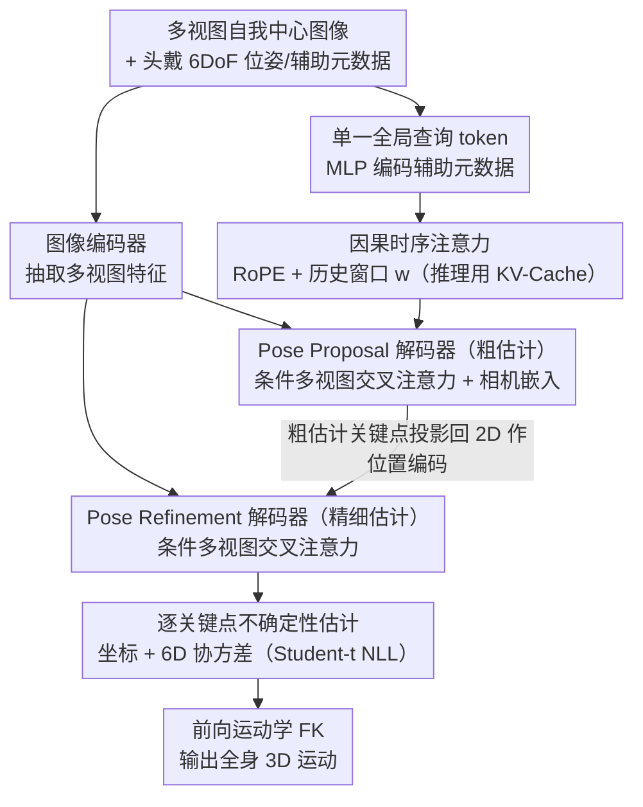

<!-- 由 src/gen_stubs.py 自动生成 -->
# EgoPoseFormer v2: Accurate Egocentric Human Motion Estimation for AR/VR

**会议**: CVPR2026  
**arXiv**: [2603.04090](https://arxiv.org/abs/2603.04090)  
**代码**: 未开源  
**领域**: 人体理解 (Human Understanding)  
**关键词**: 自我中心姿态估计, Transformer, 半监督学习, 自动标注, AR/VR, 时序建模

## 一句话总结

提出 EgoPoseFormer v2 (EPFv2)，通过端到端 Transformer 架构（单一全局查询 + 因果时序注意力 + 条件多视图交叉注意力）和基于不确定性蒸馏的自动标注系统，在 EgoBody3M 基准上以 0.8ms GPU 延迟实现了自我中心 3D 人体运动估计的 SOTA 精度（MPJPE 4.02cm，比前作提升 15-22%）。

## 研究背景与动机

**AR/VR 核心需求**：自我中心 3D 运动估计是 AR/VR 交互的基础能力，但从头戴设备摄像头恢复全身 3D 姿态仍是开放难题

**视角受限**：自我中心视角仅能覆盖少量身体区域，频繁出现自遮挡，且场景上下文有限

**时序一致性差**：早期方法（EgoGlass、UnrealEgo）依赖单帧热图回归，导致预测抖动和时序不一致；LSTM 方法（EgoBody3M）改善了平滑性但缺乏 3D 几何建模

**前作架构局限**：EgoPoseFormer v1 使用每个关节对应一个查询 token 的设计，计算量随关节数线性增长；两阶段架构无法端到端训练（梯度无法回传到粗估计阶段）；依赖可变形注意力，难以部署到边缘设备

**标注数据稀缺**：真实世界自我中心数据采集和标注成本极高，大量无标签的野外数据无法被利用

**部署约束严格**：VR 设备要求极低延迟（<1ms）和边缘计算友好的算子，可变形注意力等操作不易在消费级设备上实现

## 方法详解

### 整体框架

EPFv2 想从头戴设备的稀疏视角端到端地恢复全身 3D 运动，还要快到能塞进 VR 设备。它用一套编码器-解码器结构：图像编码器抽取多视图特征，头戴位姿和辅助元数据被压成**一个**全局姿态查询 token，并经因果时序注意力吸收历史信息；随后两个结构相同的 Transformer 解码器先出粗估计（Pose Proposal）、再出精细估计（Pose Refinement），每个关键点附带不确定性，最后经前向运动学（FK）输出全身姿态。和 v1 最大的不同是整条链路完全可微，梯度能在两个阶段之间自由回传，不再是割裂的两段式。

### 关键设计

**1. 单一全局查询 token：把计算量和身体表示解耦**

v1 给每个关节都配一个查询 token，计算量随关节数线性涨，关节一多就拖慢推理。EPFv2 反其道而行，只用一个 token 聚合全部信息，初始化时通过 MLP 把头戴 6DoF 位姿等辅助元数据编码进去：$\mathbf{q}_t = \text{MLP}_{\text{query}}(\mathbf{H}_t)$。因为信息都汇到这一个 token 上，模型的计算预算是恒定的，和身体怎么表示无关——无论用关键点还是参数化身体模型（关节旋转 + 身体尺度），开销都一样。

**2. 条件多视图交叉注意力：用标准注意力换掉难部署的可变形注意力**

v1 依赖可变形注意力，精度不错但算子在消费级 VR 设备上难落地。这里改成对每个视图独立做多头交叉注意力、再线性融合的标准结构。粗估计阶段以可学习的相机嵌入 $\xi^v$ 作为条件；精细阶段额外把 3D 粗估计关键点投影回 2D 的位置编码喂进去，相当于给注意力一个空间锚点，复刻了 v1 立体可变形注意力的效果，却更硬件友好。

**3. 因果时序注意力：让被遮挡的部位也能从历史推断**

自我中心视角自遮挡频繁，腿、脚常常根本看不见，单帧预测必然抖。EPFv2 用带 RoPE 位置编码的因果自注意力，让当前帧的查询 token 关注窗口 $w$ 内的历史 token。训练时是标准因果 mask 自注意力，推理时用 KV-Cache 省资源。这样即使某一帧腿不可见，模型也能借时序线索推出合理姿态，而不是凭空抖动。

**4. 逐关键点不确定性估计：让模型对看不见的部位"知道自己不确定"**

每个关键点除了出坐标，还预测一个 6D 不确定性向量（协方差矩阵的 Cholesky 因子 $\mathbf{L}$），配 Student-t 分布的负对数似然损失训练。相比常用的 Laplacian，Student-t 在原点更平滑、尾部更厚，对大残差更鲁棒。实际效果也符合直觉——脚、腿这些频繁不可见的关键点，预测出的不确定性确实更高，这个信号后面还被自动标注系统拿来做蒸馏。

### 损失函数 / 训练策略

主损失把多项目标加权在一起：

$$\mathcal{L} = \lambda_{\text{pos}} w_d \mathcal{L}_{\text{mse}}(\mathbf{P}_r, \hat{\mathbf{P}}) + \lambda_{\text{pos}}(1-w_d) \mathcal{L}_{\text{tNLL}}(\mathbf{P}_r, \hat{\mathbf{P}}, \Sigma) + \lambda_{\text{pos}} \mathcal{L}_{\text{mse}}(\mathbf{P}_p, \hat{\mathbf{P}}) + \lambda_{\text{jerk}} [\mathcal{L}_{\text{jerk}}(\mathbf{P}_r) + \mathcal{L}_{\text{jerk}}(\mathbf{P}_p)]$$

其中 $w_d$ 用余弦调度动态平衡 MSE 与不确定性似然两项的权重，Jerk 损失（$\lambda_{\text{jerk}}=0.8$）鼓励时序平滑。

在监督训练之外，EPFv2 还配了一套**自动标注系统（ALS）**来吃无标签的野外数据。它是 teacher-student 半监督：教师模型（DINOv3 初始化的 ViT 编码器）在标注数据上训练，给大规模无标签数据打伪标签；教师接原始输入、学生接强增强版本（不对称增强），保证伪标签稳定而学生学到泛化能力。蒸馏时学生不只学姿态，还模仿教师逐关键点的置信度结构，对应损失 $\mathcal{L}_{\text{uncertainty}} = \|s_T - s_S\|$。在 70M 帧的野外数据（EGO-ITW-70M）上，数据规模带来的增益持续存在。

## 实验

### 主实验：EgoBody3M 基准对比

| 方法 | MPJPE (cm) ↓ | MPJVE ↓ | 手腕 MPJPE | 肩部 MPJPE | 腿部 MPJPE | 脚部 MPJPE |
|------|-------------|---------|-----------|-----------|-----------|-----------|
| UnrealEgo (ECCV22) | 7.41 | 1.27 | - | - | - | - |
| EgoBody3M (ECCV24) | 5.18 | 0.54 | 6.14 | 2.80 | 8.40 | 10.25 |
| EgoPoseFormer v1 (ECCV24) | 4.75 | 0.87 | 6.01 | 2.72 | 7.95 | 10.16 |
| **EPFv2 w/o ALS** | **4.17** | **0.42** | 5.74 | 2.38 | 6.91 | 9.11 |
| **EPFv2 with ALS** | **4.02** | **0.42** | **4.99** | **2.33** | **6.66** | **8.69** |

### 消融实验

| 变体 | Overall MPJPE | 手腕 MPJPE | 腿部 MPJPE |
|------|:---:|:---:|:---:|
| ① 直接关键点头（无 FK） | 4.35 | 6.02 | 7.17 |
| ② 无时序注意力 | 4.35 | 6.04 | 7.21 |
| ③ 无投影条件 | 4.30 | 5.96 | 7.15 |
| ④ 无辅助信息 | 4.39 | 5.98 | 7.34 |
| ⑤ 无不确定性 | 4.25 | 5.83 | 7.00 |
| ⑥ EPFv2 完整（无 ALS） | 4.17 | 5.74 | 6.91 |
| ⑦ + ALS（无不确定性蒸馏） | 4.08 | 5.07 | 6.74 |
| ★ + ALS + 不确定性蒸馏 | **4.02** | **4.99** | **6.66** |

### 关键发现

- **精度大幅提升**：EPFv2 比 EgoBody3M 提升 22.4%，比 EPFv1 提升 15.4%（MPJPE）
- **时序稳定性显著改善**：MPJVE 比 EgoBody3M 降低 22.2%，比 EPFv1 降低 51.7%
- **ALS 对手腕效果最显著**：手腕 MPJPE 从 5.74→4.99（改善 13.1%），手腕因频繁遮挡和快速运动最难估计
- **轻量模型受益更多**：MobileNetV4-S 从 ALS 中获得的比例增益大于 ResNet-18，说明 ALS 特别适合轻量部署场景
- **实时性能**：0.8ms GPU 延迟，满足 VR 设备实时需求
- **FK 建模优于直接回归**：通过前向运动学预测关节旋转再计算位置，比直接回归 3D 关键点更准确（物理结构先验）

## 亮点

- 单一全局查询 token 设计简洁优雅，将模型计算与身体表示完全解耦，同时支持关键点和参数化表示
- 用标准交叉注意力 + 投影条件替代可变形注意力，精度相当但部署友好
- 自动标注系统思路清晰且有效，不确定性蒸馏是合理的补充，数据规模增益曲线令人信服
- 0.8ms 延迟，是目前最适合真实 VR 设备部署的方案之一

## 局限性

- 无标签数据集 EGO-ITW-70M 为私有数据，ALS 的可复现性受限
- 仅在 EgoBody3M 一个基准上评估，缺乏跨数据集定量对比
- 教师模型依赖 DINOv3-L 权重，半监督流程的适用范围可能受限于视觉基础模型的质量
- 野外泛化仅以定性结果展示（XR-MBT），缺乏定量验证
- 未讨论在遮挡极端场景（如长期全身不可见）下的失败案例

## 相关工作

- **自我中心姿态估计**：EgoGlass、UnrealEgo（热图方法）→ EgoBody3M（LSTM 时序）→ EgoPoseFormer v1（可变形注意力 Transformer）→ EPFv2
- **自我中心数据集**：EgoCap → Mo2Cap2 → xR-EgoPose → UnrealEgo → EgoBody3M（首个大规模真实数据集）→ Nymeria、EMHI
- **半监督/自动标注**：经典 pseudo-labeling 范式，在自我中心运动估计领域此前几乎未被探索；最接近的 EgoPW 需要额外外部视角辅助

## 评分

- 新颖性: ⭐⭐⭐⭐ — 单一查询设计和条件注意力替代可变形注意力的思路新颖实用，ALS 在该领域的应用有开创意义
- 实验充分度: ⭐⭐⭐⭐ — 消融全面，数据规模实验有说服力，但基准单一且 ALS 私有数据不可复现
- 写作质量: ⭐⭐⭐⭐⭐ — 结构清晰，动机论述充分，与前作对比到位
- 价值: ⭐⭐⭐⭐ — 对 AR/VR 人体姿态估计有直接工程价值，0.8ms 延迟和边缘部署友好设计很实际

<!-- RELATED:START -->

## 相关论文

- [\[CVPR 2026\] Egocentric Visibility-Aware Human Pose Estimation](egocentric_visibility-aware_human_pose_estimation.md)
- [\[CVPR 2026\] E-3DPSM: A State Machine for Event-Based Egocentric 3D Human Pose Estimation](e-3dpsm_a_state_machine_for_event-based_egocentric_3d_human_pose_estimation.md)
- [\[CVPR 2026\] GazeShift: Unsupervised Gaze Estimation and Dataset for VR](gazeshift_unsupervised_gaze_estimation_and_dataset_for_vr.md)
- [\[CVPR 2026\] MAMMA: Markerless Accurate Multi-person Motion Acquisition](mamma_markerless_accurate_multi-person_motion_acquisition.md)
- [\[ECCV 2024\] MANIKIN: Biomechanically Accurate Neural Inverse Kinematics for Human Motion Estimation](../../ECCV2024/human_understanding/manikin_biomechanically_accurate_neural_inverse_kinematics_for_human_motion_esti.md)

<!-- RELATED:END -->
