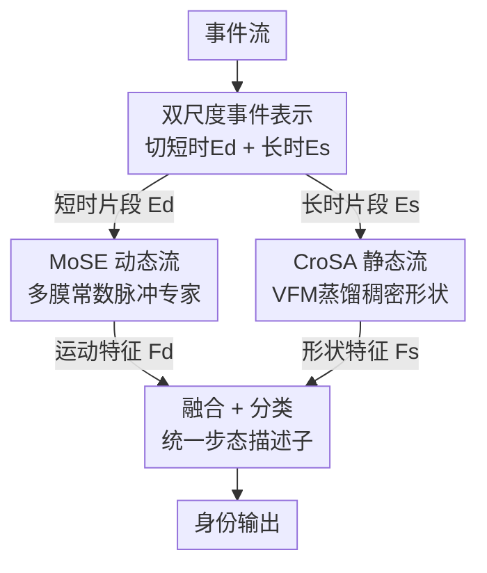

# EventGait: Towards Robust Gait Recognition with Event Streams

**会议**: CVPR 2026  
**论文**: [CVF Open Access](https://openaccess.thecvf.com/content/CVPR2026/html/Xu_EventGait_Towards_Robust_Gait_Recognition_with_Event_Streams_CVPR_2026_paper.html)  
**代码**: https://github.com/QUEAHREN/EventGait  
**领域**: 人体理解 / 步态识别  
**关键词**: 步态识别, 事件相机, 脉冲神经网络, 跨模态结构对齐, 双流网络  

## 一句话总结
EventGait 用事件相机做步态识别，提出"短时片段走动态流、长时片段走静态流"的双流框架：动态流用混合脉冲专家（MoSE）以不同膜时间常数的脉冲神经元自适应捕捉多时间尺度运动，静态流用 DINOv2 当老师做跨模态结构对齐（CroSA）把稠密形状先验蒸馏进稀疏事件，在合成与真实事件步态基准上既追平相机方法、又在弱光下大幅超越（夜晚 +37.3%）。

## 研究背景与动机

**领域现状**：步态识别是一种非侵入、保护隐私、可远距离工作的生物特征识别手段。主流模态包括轮廓图（silhouette）、骨架、解析图、RGB 图像、点云等；近年方法从依赖上游分割/姿态估计的中间表示转向端到端 RGB 方法。

**现有痛点**：RGB 相机时间分辨率低（≈30 ms）、动态范围窄（<80 dB），在弱光、遮挡、运动模糊下视觉线索严重退化，识别不可靠；LiDAR 点云虽对光照鲁棒，但成本与能耗极高（论文给的数字是单台 LiDAR 约 75K 美元 vs 事件相机约 1.5K 美元），难以规模化部署。

**核心矛盾**：图像类方法对光照敏感、3D 传感器成本高，二者之间存在"鲁棒性 ↔ 成本"的权衡，而步态识别同时需要**稳定的静态身体形状**和**高频的动态运动节律**。事件相机天然具备微秒级时间分辨率（<3 µs）和超高动态范围（>120 dB），且会主动抑制衣着纹理、颜色等无关信息，看似是理想载体——但已有事件步态方法（EV-Gait 等）把事件流在长时间窗内聚合成网格化"事件图"再喂给 CNN/GNN，这一步**体素化**会同时毁掉两样东西：① 高频时间线索被时间窗抹平，丢掉步态最关键的动态节律；② 空间表示过于稀疏，普通深网络难以从中读出稠密、可判别的外观特征。

**本文目标**：在不退化事件时间精度、又能补回空间稠密度的前提下，把事件相机的潜力真正吃满，做出在正常光下追平相机、弱光下显著超越的鲁棒事件步态识别器。

**切入角度**：作者的关键观察是——鲁棒的事件步态识别**不应只编码空间静态形状**，更要从高时间分辨率事件里**保留细粒度动态**。于是把"动态"和"形状"显式拆开、用两套各自擅长的机制分别建模，再融合。

**核心 idea**：用"短时片段 + 脉冲专家混合"建模高频运动，用"长时片段 + 视觉基础模型蒸馏"恢复稠密形状，双流互补，既保住事件的时间优势又补上空间稀疏的短板。

## 方法详解

### 整体框架
EventGait 是一个端到端**双流**框架。输入是一段事件流，先在事件表示阶段用**双尺度时间设计**把同一个长曝光窗 $T$ 切成两种粒度：用小 $\Delta T = T/K$ 的**短时片段** $\mathbf{E}_d$ 喂给动态流以保住时间保真度，把整个窗 $T$ 内的事件聚合成一张**长时片段** $\mathbf{E}_s$ 喂给静态流以拿到稳定形状。动态流由**混合脉冲专家（MoSE）** 构成，输出运动特征 $\mathbf{F}_d$；静态流是 CNN 编码器，训练时被**跨模态结构对齐（CroSA）** 用冻结的视觉基础模型当老师监督，输出稠密形状特征 $\mathbf{F}_s$。两路特征经一个常规融合模块 $\Phi(\cdot)$ 拼接融合成统一步态描述子 $\mathbf{F}_{gait}$，再送入下游识别头（解码 + 分类）。注意 CroSA 的 RGB 老师分支**只在训练时存在**，推理时静态流只吃事件，不需要任何 RGB。

### 关键设计

**1. 双尺度事件表示 + 双流分解：让动态和形状各取所需，不再互相牺牲**

这一步直接针对"长时间窗体素化既毁时间精度又过稀疏"的痛点。事件相机异步记录每像素对数亮度变化 $e_i=(x_i,y_i,t_i,p_i)$，当变化超过阈值 $c$ 时触发一个带极性 $p_i\in\{+1,-1\}$ 的事件（式 1）。为对接深网络，作者把曝光窗 $T$ 均匀切成 $K$ 个 bin，用线性插值核做体素化：

$$E_p(x,y,k)=\sum_{e_i\in E_p}\max\!\Big(0,\,1-\frac{|t_i-t_k|}{\Delta T}\Big),\quad \Delta T=T/K,$$

得到 $\mathbf{E}\in\mathbb{R}^{2\times K\times H\times W}$，正负极性分通道，保留了亚 bin 的时间精度。关键不在体素化本身，而在**怎么用这套层次**：动态流取宽度只有 $\Delta T$ 的短时片段 $\mathbf{E}_d$（保高频运动），静态流把整窗 $T$ 聚合成一张长时片段 $\mathbf{E}_s$（求稳定形状）。一份事件、两种切法，把"时间精度"和"空间稳定"这对矛盾分配给两条专门的流去解决，而不是逼一个表示同时满足。

**2. MoSE 混合脉冲专家：用不同膜时间常数的脉冲神经元覆盖多时间尺度运动**

动态流处理的是高时间频率、空间稀疏的事件信号，和稠密视频帧性质不同，传统 CNN/RNN 既抓不准运动又不契合事件的稀疏性。作者用**脉冲神经网络（SNN）** 当基本单元：LIF 神经元的膜电位 $U(t)$ 随时间积分稀疏脉冲，

$$\tau\frac{dU(t)}{dt}=-U(t)+R\cdot I(t),\qquad S(t)=\Theta(U(t)-U_{th}),$$

其中膜时间常数 $\tau$ 控制电位衰减速率、决定神经元的时空感知特性，超过阈值 $U_{th}$ 就发放脉冲并复位。问题在于**单一固定 $\tau$ 的神经元高度专一**：小 $\tau$（"快"神经元）擅长亮场景/快运动下的高频爆发，却整合不了弱光/慢运动的稀疏信号；大 $\tau$（"慢"神经元）能在弱光下靠长时累积稀疏脉冲，却在亮场景引入时间噪声。真实场景里光照与运动耦合出更复杂的脉冲模式，单一配置无法通吃。

受 MoE 启发，作者提出 MoSE：用 $N$ 个并行脉冲专家 $\{E_1,\dots,E_N\}$，各自初始化一个不同的膜常数 $\tau_i$；一个轻量脉冲门控网络 $\mathcal{G}(\cdot)$ 分析事件的动态模式、为每个专家算自适应混合系数 $\alpha_i$，加权得到最终动态运动特征：

$$\hat{E}_t=\sum_{i=1}^{N}\alpha_i\,E_i(E_t).$$

小 $\tau_i$ 的专家专攻高频亮场景运动，大 $\tau_i$ 的专家负责整合暗场景稀疏事件，门控按当前信号动态分配权重。这样一组"快慢搭配"的专家就能自适应跨越复杂运动与光照，比单神经元鲁棒得多。

**3. CroSA 跨模态结构对齐：把视觉基础模型的稠密形状先验蒸馏进稀疏事件**

静态流虽然靠长时聚合 $\mathbf{E}_s$ 拿到了全局空间统计，但事件本身**仍然稀疏**，编码器很难从这种稀疏输入里自学出复杂稠密的人体形状先验。CroSA 的做法是**跨模态蒸馏**：拿一个冻结的 DINOv2 当老师 $F_{teacher}$（论文选它是因为它对细粒度结构信息把握强），把同步的 RGB 帧 $\mathbf{I}_c$ 先灰度化成 $\mathbf{I}_g=\mathcal{I}(\mathbf{I}_c)$ 以剔除颜色干扰，再过老师得到 $z_{img}$；学生是基于 CNN 的事件静态编码器 $F_{student}$，其输出经一个对齐卷积层 $\mathcal{A}(\cdot)$ 投影成 $z_{evs}$。对齐损失用 $\ell_2$ 距离拉近两者：

$$z_{img}=F_{teacher}(\mathbf{I}_g),\quad z_{evs}=\mathcal{A}(F_{student}(\mathbf{E}_s)),\qquad \mathcal{L}_{align}=\|z_{evs}-z_{img}\|_2^2.$$

关键是这套监督**只在训练时用 RGB**，推理时静态流纯吃事件——老师只负责把"人体结构长什么样"的稠密先验灌进学生权重里，部署阶段不依赖任何 RGB。消融显示对齐权重要适中（$\lambda_d=0.2$ 最佳）：太小监督太弱，太大会把衣着纹理这类身份无关线索也引进来，反而伤细粒度识别。

**4. 事件合成管线 + 两个大规模事件步态基准：补上数据空白**

事件步态识别长期受限于"无大规模事件数据集"（先前工作只在 ~100 身份的小数据上验证）。作者建了一条从 RGB 视频合成事件流的管线：先用帧插值网络生成中间序列，再按 v2e 工具箱调参（截止频率、时间噪声等）模拟多种光照下的事件流（遵循像素强度的对数时间演化），累积成同步事件片段，最后用人体检测框（时间插值后）裁剪得到离散事件表示。由此把两个常用 RGB 数据集转成事件版：**CCGR-Mini-E**（47,884 序列 / 970 人 / 53 协变量 / 33 视角，是已知最大、协变量最丰富的事件步态数据集）和 **SUSTech1K-E**（25,239 序列 / 1,050 人，多模态配对 RGB/轮廓/骨架/点云/事件）。这把验证规模从 ~100 身份推到 ~2000 身份，也为社区提供了强基准。⚠️ 合成管线的具体网络与参数细节论文放在附录，此处以原文为准。

### 损失函数 / 训练策略
总损失把识别与对齐合在一起：

$$\mathcal{L}_{total}=\mathcal{L}_{ce}+\mathcal{L}_{tri}+\lambda_d\mathcal{L}_{align},$$

其中 $\mathcal{L}_{ce}$ 是交叉熵、$\mathcal{L}_{tri}$ 是三元组损失，$\lambda_d$ 平衡跨模态对齐项（默认 0.2）。训练用 8×RTX 3090，SGD（初始 lr 0.1、weight decay 5e-4），图像 Pad-and-Resize 到 64×64。

## 实验关键数据

### 主实验
SUSTech1K-E 上的域内评测（Rank-1，Overall 为综合）。EventGait 仅 4.6M 参数，综合超过最优相机方法 +5.2%，在难场景（换衣 CL、夜晚 NT）优势尤其大，甚至超过 LiDAR 方法 LidarGait++：

| 输入 | 方法 | 参数 | CL（换衣） | NT（夜晚） | Overall |
|------|------|------|-----------|-----------|---------|
| 点云 | LidarGait++ (CVPR25) | 4.4M | 92.4 | 92.2 | 92.7 |
| 轮廓 | GaitBase (CVPR23) | 8.0M | 49.6 | 25.9 | 76.1 |
| 轮廓 | DeepGaitV2 (TPAMI25) | 9.1M | 53.4 | 28.8 | 82.3 |
| 事件 | EVGait (CVPR19) | 45.2M | 67.8 | 78.7 | 65.4 |
| 事件 | **EventGait (Ours)** | **4.6M** | **93.3** | **84.8** | **92.8** |

相比轮廓基线 GaitBase，换衣 +18.4%、夜晚 +37.3%；事件相机成本约为 LiDAR 的 1/50，却拿到相当甚至更优的精度。

跨光照评测（Table 4）最能说明事件模态的价值——正常光到弱光，轮廓方法崩盘，EventGait 只掉 9.6%：

| 模态 | 方法 | 正常光 Overall | 弱光 Overall | 掉点 |
|------|------|---------------|-------------|------|
| 轮廓 | GaitSet | 65.0 | 31.7 | −33.3 |
| 轮廓 | GaitBase | 76.1 | 41.5 | −34.6 |
| 事件 | **EventGait** | **92.8** | **83.2** | **−9.6** |

跨域（Table 3）CCGR-Mini→SUSTech1K 夜晚场景 EventGait 达 51.4%，超最优轮廓法 +29.5%；真实事件相机数据 DVS128-Gait（Table 5）Rank-1 87.4%，超 EV-Gait（81.8）与 GaitBasee（74.4）。

### 消融实验
双流缺一不可，且 MoSE 专家数 3 个为甜点（SUSTech1K-E，Overall）：

| 配置 | NM | CL | NT | Overall | 说明 |
|------|----|----|----|---------|------|
| 仅静态流 | 82.6 | 61.6 | 76.9 | 82.0 | 缺动态运动 |
| 仅动态流 | 74.5 | 52.0 | 71.7 | 72.4 | 缺结构形状 |
| 双流（Full） | 92.5 | 78.1 | 84.8 | 92.8 | 完整模型 |
| MoSE 1 专家 | — | — | — | 88.4 | 退化为单 SNN |
| MoSE 3 专家 | — | — | — | 92.8 | 默认配置 |
| MoSE 4 专家 | — | — | — | 92.7 | 增益边际，效率不划算 |

CroSA 目标/权重消融（Table 7）：去掉对齐 87.4 → 加 $\ell_2$ 且 $\lambda_d=0.2$ 升到 92.8；cosine（89.1）不如 $\ell_2$，因方向约束缺细粒度引导；$\lambda_d$ 过大（0.5→89.7）会引入衣着纹理等身份无关线索。

### 关键发现
- **双流互补是性能主因**：单动态流只有 72.4、单静态流 82.0，合起来 92.8——动态补不了结构、静态补不了运动，缺一掉 10+ 个点。
- **MoSE 的"多 $\tau$"是关键**：单专家（标准 SNN）仅 88.4，3 专家 92.8；快慢神经元搭配才能跨光照/运动自适应，但 4 专家几乎不再涨，作者选 3 个权衡精度与效率。
- **CroSA 监督要"适度"**：$\ell_2$ 且中等权重最好；太弱监督不足、太强反而把 RGB 的身份无关纹理引进来，体现"蒸结构而非蒸外观"的取舍。
- **弱光是事件模态的主场**：跨光照掉点仅 9.6%，而轮廓法掉 30+%；事件步态在夜晚、换衣、跨视角等难条件下系统性领先。

## 亮点与洞察
- **把"动态 vs 形状"显式解耦再各配专门机制**，是这篇最干净的设计哲学：同一份事件流切两种时间粒度分别喂两条流，避免单一表示在时间精度与空间稠密之间互相妥协，这个"双尺度同源切分"思路可迁移到任何高时间分辨率传感（如事件目标跟踪/分割）。
- **MoSE 把 MoE 搬到脉冲神经元的"时间常数"维度**很巧妙——专家差异不在权重容量而在膜常数 $\tau$，等于让网络持有一组覆盖不同时间尺度的"滤波器"，由门控按光照/运动自适应路由，天然契合事件信号的多尺度本质。
- **CroSA 用 VFM 当训练期老师、推理期甩掉 RGB**：既借到 DINOv2 的稠密结构先验补事件稀疏，又不增加部署成本，是"训练用强模态、推理用弱模态"的一个干净范例。
- **成本对比给出强落地理由**：事件相机 ~1.5K vs LiDAR ~75K 美元却追平 LidarGait++，把"鲁棒步态识别"从昂贵 3D 传感拉回可规模化的 2D 事件方案。

## 局限与展望
- **依赖合成事件**：两个新基准 SUSTech1K-E / CCGR-Mini-E 都由 RGB 视频经 v2e 管线合成而非真实事件相机采集，存在 sim-to-real gap；真实数据仅 DVS128-Gait（20 人）和 EV-CASIA-B（回放重录），规模仍小。作者把"采集大规模真实事件步态数据"列为首要 future work。
- **CroSA 需要训练期同步 RGB 帧**：合成场景天然配对，但真实事件采集要同时拿到对齐的 RGB 才能蒸馏，部署到纯事件采集流水线时这个监督源未必现成（⚠️ 论文未深入讨论无 RGB 时如何获得结构先验）。
- **跨域到 CCGR-Mini 仍弱**：SUSTech1K→CCGR-Mini 的 Rank-1 只有 3.7（Table 3），说明协变量极丰富、视角极多的目标域泛化仍是难点，事件模态也没完全解决。
- **改进思路**：作者提的多模态融合（事件 + RGB/LiDAR）是自然延伸；另可探索 MoSE 门控对真实事件噪声的鲁棒性、以及自监督/无 RGB 的结构先验获取方式以摆脱对配对 RGB 的依赖。

## 相关工作与启发
- **vs EV-Gait / 先前事件步态 [65,66]**：它们把事件长时间窗聚合成"事件图"再用 CNN/GNN 编码，丢高频动态又过稀疏，且只在 ~100 身份小数据验证；本文保留亚 bin 时间精度、双流分别建模动态与形状、并把验证推到 ~2000 身份，参数还更小（4.6M vs EVGait 45.2M）。
- **vs 轮廓/RGB 方法（GaitBase / DeepGaitV2）**：它们对光照敏感，弱光下崩盘（掉 30+%）；EventGait 借事件高动态范围在弱光仅掉 9.6%，且换衣场景因事件抑制衣着纹理而更鲁棒。
- **vs LiDAR 方法（LidarGait++）**：点云对光照鲁棒但传感器昂贵（~75K vs ~1.5K 美元）；EventGait 用 2D 事件直接对标 3D 点云，综合精度追平甚至跨视角部分超越，作者归因于事件提供比几何稀疏点云更稠密的时空动态。

## 评分
- 新颖性: ⭐⭐⭐⭐⭐ 双尺度双流 + MoSE（脉冲专家按膜常数分工）+ CroSA（VFM 跨模态蒸馏）三件套，把事件步态从"事件图 + CNN"范式整体翻新。
- 实验充分度: ⭐⭐⭐⭐⭐ 域内/跨域/跨光照/跨视角/真实数据五类评测 + 双流与 MoSE/CroSA 消融齐全，结论自洽。
- 写作质量: ⭐⭐⭐⭐ 动机与机制清晰、图文对照好；合成管线与部分实现细节压在附录，主文略简。
- 价值: ⭐⭐⭐⭐⭐ 给出低成本、弱光鲁棒的事件步态方案并开源数据与代码，对监控/安防场景落地价值高。

<!-- RELATED:START -->

## 相关论文

- [\[CVPR 2026\] MMGait: Towards Multi-Modal Gait Recognition](mmgait_multi_modal_gait_recognition.md)
- [\[CVPR 2026\] Text-guided Feature Disentanglement for Cross-modal Gait Recognition](text-guided_feature_disentanglement_for_cross-modal_gait_recognition.md)
- [\[CVPR 2026\] HyperGait: Unleashing the Power of Parsing for Gait Recognition in the Wild via Hypergraph](hypergait_unleashing_the_power_of_parsing_for_gait_recognition_in_the_wild_via_h.md)
- [\[CVPR 2026\] Unlocking Motion from Large Vision Models with a Semantic and Kinematic Duality for Gait Recognition](unlocking_motion_from_large_vision_models_with_a_semantic_and_kinematic_duality_.md)
- [\[CVPR 2026\] RGB-Event based Pedestrian Attribute Recognition: A Benchmark Dataset and An Asymmetric RWKV Fusion Framework](rgb-event_based_pedestrian_attribute_recognition_a_benchmark_dataset_and_an_asym.md)

<!-- RELATED:END -->
