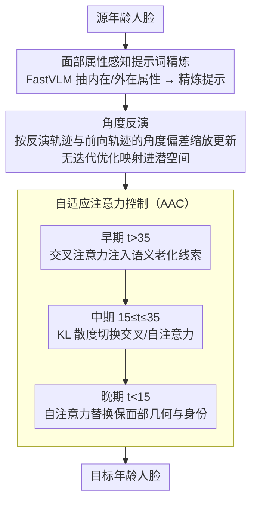

<!-- 由 src/gen_stubs.py 自动生成 -->
# Face Time Traveller: Travel Through Ages Without Losing Identity

**会议**: CVPR2026  
**arXiv**: [2602.22819](https://arxiv.org/abs/2602.22819)  
**代码**: 待确认  
**领域**: 人体理解  
**关键词**: 人脸老化, 扩散模型, 身份保持, 注意力控制, 无需调优反演

## 一句话总结

提出 FaceTT 框架，通过面部属性感知提示词精炼、角度反演和自适应注意力控制三大模块，实现高保真、身份一致的人脸年龄变换，在多个基准上超越现有方法。

## 研究背景与动机

**人脸老化是一个病态问题**：受遗传、环境、生活方式等内外因素共同影响，真实的年龄变换需要同时改变年龄相关特征（皱纹、肤色）并保持年龄无关特征（身份、表情），平衡极为困难。

**GAN 方法的局限**：HRFAE、CUSP 等基于 GAN 的方法在高分辨率细节捕捉和身份保持上表现不足，容易产生伪影或不准确重建，尤其在大跨度年龄变换时身份漂移严重。

**扩散模型反演成本高**：现有扩散模型依赖迭代优化的反演方法（如 Null-Text Inversion），计算开销大且重建质量不稳定，难以在保留面部细节的同时实现高效编辑。

**简单提示词不足以描述老化**：仅用"Photo of a X years old person"无法捕捉老化的复杂语义——内在生物因素（肤质变化）和外在环境因素（紫外线、生活习惯）的交互影响被忽略。

**静态注意力控制的缺陷**：P2P、PnP 等方法在整个图像上施加统一的注意力策略，无法隔离和优先处理年龄相关区域，导致背景幻觉和配饰丢失等问题。

**评估协议不完善**：传统评估依赖将重新老化的图像与真实目标年龄图像比较，但配对真值稀缺，使得身份一致性评估不可靠。

## 方法详解

### 整体框架

FaceTT 要解决的是「换年龄不换人」：输入一张源年龄人脸，输出目标年龄的人脸，既要把皱纹、肤色这些年龄相关特征改到位，又不能让身份、表情漂走。它基于预训练 Stable Diffusion，在 FFHQ-Aging 上只做 150 步轻量微调，然后让一张脸依次过三个模块——先用 VLM 把人脸读成一段属性丰富的文本提示，再用角度反演把它无优化地映射进扩散潜空间，最后用自适应注意力控制在去噪过程中动态权衡「改年龄」和「保结构」。三个模块串起来，推理时不需要任何额外优化。

### 关键设计

**1. 面部属性感知提示词精炼：让文本条件真正描述「老化」**

一句 `Photo of a X years old person` 根本撑不起老化的复杂语义——肤质变化这类内在生物因素、紫外线/生活习惯这类外在环境因素全被丢掉了。FaceTT 用视觉语言模型 FastVLM 从输入人脸抽出年龄、性别、肤色与纹理（内在）以及外部条件描述（外在），拼成 `Photo of a <src_age> years old <gender> with <skin tone & texture>, due to <cause/condition description>` 这样的精炼提示。这样模型才能把「脱发」「体重增加」这种高层语义对应到具体的视觉特征上。

**2. 角度反演：用几何角度偏差替代迭代优化**

现有扩散反演（如 Null-Text Inversion）靠迭代优化，又慢又不稳。角度反演把源分支和目标分支解耦独立优化，核心是在每个去噪步上看反演轨迹 $z_t^*$ 与前向轨迹 $z_t^{src/tgt}$ 之间的角度偏差：用指数衰减 $\exp(-\xi \cdot \theta)$ 按角度大小缩放更新量——角度越大说明对齐越差，更新权重就压得越低；同时用余弦相似度自适应加权源/目标两个分支的校正项，相似度高时侧重编辑保真、低时侧重源图保持。衰减速率由超参 $\xi = 1.2$ 控制。整个过程不迭代优化，反演速度因此快了一个数量级。

**3. 自适应注意力控制（AAC）：按去噪阶段动态切换语义变换与结构保持**

P2P、PnP 这类方法在整张图上用统一的注意力策略，既隔离不了年龄相关区域，又容易出背景幻觉、丢配饰。AAC 改成随去噪阶段切策略：早期（$t > \tau_1 = 35$）用交叉注意力注入语义老化线索（皱纹、肤色、发色）；中间（$\tau_2 \leq t \leq \tau_1$）用 KL 散度 $\eta$ 判断源/目标交叉注意力的差异——$\eta > \eta_{th} = 0.05$ 时优先交叉注意力引入显著语义变换，否则优先自注意力保住精细结构，并用基于注意力图熵的自适应混合权重 $w_t = 1 - H(M)$ 实现平滑过渡；晚期（$t < \tau_2 = 15$）用自注意力替换维持面部几何、表情和身份一致性。粗到细的这套切换让语义变换集中在该变的地方，结构则被牢牢锚住。

### 损失函数 / 训练策略

- 在 FFHQ-Aging（7 万张图，10 个年龄段）上微调 Stable Diffusion，仅 150 步
- Adam 优化器，学习率 $5 \times 10^{-6}$，batch size 2
- 推理时无需额外优化，单张约 5 秒（A100 GPU），相比 FADING 的 130 秒快 26 倍

## 实验

### 主要结果

**CelebA-HQ (young→60) 定量对比**：

| 方法 | 预测年龄 | Blur ↓ | Gender ↑ | Smiling ↑ |
|------|---------|--------|----------|-----------|
| HRFAE | 55.05±9.18 | 3.42 | 94.80 | 74.60 |
| CUSP | 57.57±7.88 | 3.39 | 89.79 | 75.88 |
| FADING | 69.88±6.20 | 2.18 | 98.44 | 76.17 |
| **FaceTT** | **62.05±6.81** | **2.18** | **99.79** | **78.31** |

FaceTT 预测年龄最接近真实标签 65.14，性别保持率达 99.79%（最优）。

**FFHQ-Aging 全年龄段对比**：

| 指标 | HRFAE | CUSP | FADING | **FaceTT** |
|------|-------|------|--------|-----------|
| MAE (均值) | 21.84 | 16.40 | 13.47 | **11.40** |
| Gender Acc. | 0.45 | 0.51 | 0.57 | **0.62** |
| KID (均值) | 0.34 | 3.06 | 2.03 | **1.58** |

FaceTT 的 MAE 比 FADING 降低 15%，KID 降低 22%。

### 消融实验

| Angular Inv. | AAC | 预测年龄 | Gender ↑ | Smiling ↑ |
|:---:|:---:|---------|----------|-----------|
| ✗ | ✗ | 69.88 | 98.44 | 76.17 |
| ✗ | ✓ | 61.70 | 99.22 | 73.78 |
| ✓ | ✗ | 61.25 | 99.02 | 68.58 |
| ✓ | ✓ | **62.05** | **99.79** | **78.31** |

两个模块各有贡献，组合后在所有指标上取得最优平衡。超参数敏感性分析表明 $\xi=1.2$、$\eta_{th}=0.05$、$(\tau_1,\tau_2)=(35,15)$ 为最优配置。

### 关键发现

- **身份保持**：在循环身份相似度 ($ID_{sim}^{cyc}$) 上，FaceTT 在 FFHQ 上达到 0.69、在名人测试集上达到 0.80，均为最优；参考身份相似度 ($ID_{sim}^{ref}$) 达到 0.55，超过 FADING 的 0.50
- **生物特征验证**：在 35 年跨度的 FNMR@FMR=0.1% 上，FaceTT 仅为 0.01，远优于 FADING 的 0.07 和 CUSP 的 0.09
- **推理速度**：单张 ~5 秒 vs FADING ~130 秒，加速约 26 倍
- **背景与配饰保持**：定性对比显示 FaceTT 能保持眼镜、耳环等配饰以及背景细节一致性

## 亮点

- 角度反演方法巧妙利用几何角度偏差控制潜空间更新，无需迭代优化即可实现高质量反演，推理速度提升一个数量级
- 自适应注意力控制机制根据去噪阶段和 KL 散度动态切换交叉/自注意力，比静态方法更灵活
- 提出循环身份相似度评估协议，不依赖配对真值数据，为人脸老化评估提供了更可靠的衡量方式
- 面部属性感知提示词精炼充分利用了 VLM 的能力，将内在/外在老化因素编码为语义丰富的文本条件

## 局限性

- 仅在静态图像上验证，尚未扩展到视频序列的时序年龄渐变
- 依赖 FastVLM 提取属性提示词，VLM 的属性描述准确性会影响最终效果
- 在极端年龄段（0-2 岁）的 KID 分数相对较高（12.18），表明婴幼儿阶段的生成质量仍有提升空间
- 微调仅在 FFHQ-Aging 上进行，对非西方面孔的泛化能力未充分验证

## 相关工作

- **GAN 方法**：HRFAE（潜空间操纵）、CUSP（风格内容解耦）、MyTimeMachine（个性化时序老化），均受限于 GAN 反演导致的身份失真
- **扩散反演**：DDIM Inversion（确定性但有重建误差）、Null-Text Inversion（稳定但慢）、Direct Inversion（解耦分支但非线性编辑受限）
- **注意力编辑**：P2P、PnP、MasaCtrl（静态策略）、FPE（稳定变换）、Inversion-Free Editing（交叉+自注意力联合控制）
- **最新未发表工作**：Aging Multiverse（多轨迹老化，牺牲精细控制）、TimeBooth（个性化但背景一致性差）

## 评分

- 新颖性: ⭐⭐⭐⭐ — 角度反演和自适应注意力控制均为有价值的技术创新，循环评估协议也有贡献
- 实验充分度: ⭐⭐⭐⭐ — 多数据集 + 多指标 + 消融 + 用户研究 + 生物特征验证，实验设计全面
- 写作质量: ⭐⭐⭐⭐ — 结构清晰，算法伪代码详尽，图表丰富
- 价值: ⭐⭐⭐⭐ — 推理速度大幅提升且效果优于 SOTA，具有较强的实用价值

<!-- RELATED:START -->

## 相关论文

- [\[CVPR 2026\] Seeing without Pixels: Perception from Camera Trajectories](seeing_without_pixels_perception_from_camera_trajectories.md)
- [\[AAAI 2026\] Robust Long-term Test-Time Adaptation for 3D Human Pose Estimation through Motion Discretization](../../AAAI2026/human_understanding/robust_long-term_test-time_adaptation_for_3d_human_pose_estimation_through_motio.md)
- [\[CVPR 2026\] All in One: Unifying Deepfake Detection, Tampering Localization, and Source Tracing with a Robust Landmark-Identity Watermark](all_in_one_unifying_deepfake_detection_tampering_localization_and_source_tracing.md)
- [\[ACL 2026\] Hybrid Autoregressive-Diffusion Model for Real-Time Sign Language Production](../../ACL2026/human_understanding/hybrid_autoregressive-diffusion_model_for_real-time_sign_language_production.md)
- [\[CVPR 2026\] LaMoGen: Language to Motion Generation Through LLM-Guided Symbolic Inference](lamogen_language_to_motion_generation_through_llm-guided_symbolic_inference.md)

<!-- RELATED:END -->
