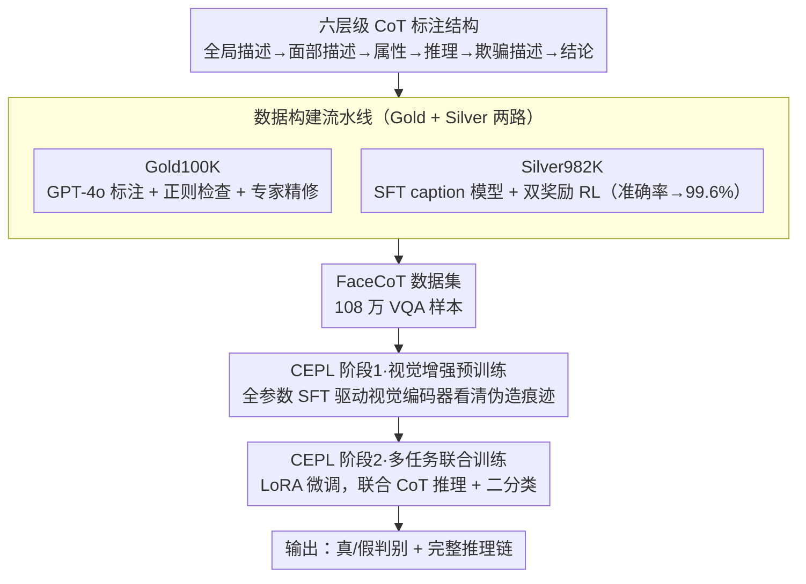

# FaceCoT: Chain-of-Thought Reasoning in MLLMs for Face Anti-Spoofing

**会议**: CVPR 2026  
**arXiv**: [2506.01783](https://arxiv.org/abs/2506.01783)  
**代码**: 即将开源 (数据集 FaceCoT 将公开)  
**领域**: 人体理解  
**关键词**: 人脸反欺骗, CoT推理, VQA数据集, 渐进式学习, 强化学习标注  

## 一句话总结
构建了首个面向人脸反欺骗（FAS）的大规模 VQA 数据集 FaceCoT（108 万样本，覆盖 14 种攻击类型），包含六层级 CoT 推理标注（从全局描述到局部推理到最终结论）；同时提出 CoT-Enhanced Progressive Learning (CEPL) 两阶段训练策略，在 11 个基准数据集上平均 AUC 提升 4.06%、HTER 降低 5.00%，超越所有 SOTA 方法。

## 背景与动机
现有 FAS 方法主要依赖单一视觉模态，泛化能力差且缺乏可解释性。MLLM 在图文理解和语义推理上的突破，为 FAS 提供了融合视觉和语言共同推理的新思路。然而关键瓶颈是**缺乏高质量的视觉-语言多模态 FAS 数据集**——现有 FAS 数据集仅提供图像 + 二分类标签，没有结构化的推理链信息。

## 核心问题
如何构建大规模、高质量的 FAS CoT VQA 数据集，并设计有效的训练策略让 MLLM 充分利用 CoT 数据提升检测性能和可解释性？

## 方法详解

### 整体框架

FaceCoT 的目标是让 MLLM 不只给「真/假」二分类，而是带着结构化推理链去做人脸反欺骗。它分两条腿：一条是造数据——把 FaceCoT-Gold100K（GPT-4o 自动标注 + 人工精修）和 FaceCoT-Silver982K（RL 增强的 caption 模型自动标注）合成 108 万样本的 VQA 数据集；另一条是训练——用两阶段的 CoT-Enhanced Progressive Learning（CEPL）让模型先学会看细粒度伪造痕迹、再学会联合推理与判别。

### 关键设计

**1. 六层级 CoT 标注结构：把人类「从全局到局部」的判别路径写成可学习的链**

FAS 数据集长期只有图像 + 二分类标签，模型既学不到推理、也给不出可解释性。FaceCoT 把每个样本的推理过程拆成六层级：Caption（全局场景描述）→ Facial Description（面部特征描述）→ Facial Attributes（面部属性列举）→ Reasoning（基于多尺度信息的逻辑推理）→ Spoofing Description（欺骗特征和方法描述）→ Conclusion（最终 Yes/No）。整条链用 XML 标签格式化，给模型一个清晰、可监督的推理骨架，而不是让它黑箱出结论。

**2. 数据构建流水线：用 RL 把自动标注的准确率从 88% 顶到 99.6%**

高质量 CoT 标注靠纯人工成本太高、靠纯自动又不准。FaceCoT 走两步：Gold100K 用 GPT-4o 自动标注，给不同攻击类型配针对性 hint（如「拍摄海报构成欺骗」），再用正则匹配检查，二轮仍失败的 581 个 hard case 交专家人工修正；Silver982K 则在 Gold100K 上 SFT 出一个 caption 模型，再用双奖励 RL 增强——准确性奖励（结论匹配标签则为 1）+ 格式奖励（输出符合模板则为 1）。这套 RL 把标注准确率从 88% 拉到 **99.6%**，于是能低成本扩到近百万规模。

**3. CEPL 两阶段训练：先让视觉编码器「看清」，再联合推理与判别**

如果端到端一把训，二分类目标会很快收敛、把推理任务挤到欠优化。CEPL 把训练拆两段：Stage 1（Visual Enhancement Pre-training）对 CoT 数据做全参数 SFT，用语言引导的监督信号驱动视觉编码器去关注微妙的伪造痕迹；Stage 2（Multi-task Joint Training）继承 Stage 1 的视觉编码器，把连接层和语言解码器重置为预训练权重并加 LoRA 微调，再联合训练 CoT 推理与二分类损失。先打好视觉地基、再联合优化，正好避开了任务之间的相互干扰。

### 损失函数 / 训练策略

- 输入分辨率 448×448，backbone 为 MiniCPMV-2.6-8B
- AdamW 优化器，初始 lr=1e-6，weight decay=0.1
- 10 epochs，batch size 256，8× A100
- 评估时从第一个生成 token 提取 Yes/No logits 做 softmax，得到连续置信度分数

## 实验关键数据

### 1-to-11 跨域泛化（最挑战设置）

| 方法 | 平均 HTER ↓ | 平均 AUC ↑ |
|------|------------|-----------|
| I-FAS (AAAI 2025) | 11.30% | 93.71% |
| **Ours-100K** | 7.65% | 96.59% |
| **Ours-All** | **6.30%** | **97.77%** |

在全部 11 个评测集上均取得最高性能。特别是 HKBU-MARs-V1+ 和 HiFiMask（含训练中未见的攻击类型），AUC 分别提升约 10% 和 14%。

### Leave-one-out 协议

| 方法 | 平均 HTER ↓ | 平均 AUC ↑ |
|------|------------|-----------|
| I-FAS | 1.33% | 99.50% |
| **Ours** | **1.06%** | **99.85%** |

### 消融实验要点
- **CEPL vs 单阶段**：CEPL 降低 HTER 1.19%，提升 AUC 0.68%——渐进式学习有效解决任务干扰
- **CoT 数据 vs 纯标签**：CoT 数据训练在 224 分辨率下降低 HTER 5.79%——低分辨率下收益更大
- **RL vs 纯 SFT caption 模型**：RL 将 HTER 从 8.00% 降至 6.87%，证明 RL 不仅提升准确率还提升语义质量
- **零样本 vs CoT 微调**：MiniCPMV 零样本 17.91% HTER → 微调后 6.30%，降低 11.61 个点

## 亮点
- **开创性数据集**：108 万样本的 FAS VQA 数据集，是该领域首个，覆盖 14 种攻击类型
- **RL 增强标注**：双奖励 RL 将 caption 模型标注准确率从 88% 提升到 99.6%，提供了低成本高质量数据扩展路径
- **可解释性**：模型不仅给出判断还输出完整推理链，在安全敏感场景中至关重要
- **跨域泛化强**：对训练中未见的 3D 面具攻击仍有强泛化能力，AUC 提升 10%+
- **两阶段训练设计合理**：先让视觉编码器通过 CoT 学习细粒度特征，再联合训练分类，避免任务干扰

## 局限与展望
- 数据集源自 CelebA-Spoof 和 WFAS，人口统计学多样性取决于原始数据集
- 部分罕见攻击类型（如 adultdull 仅 165 样本）数据量极少
- 仅在 FAS 领域验证，CoT 构建方法是否可推广到其他安全检测任务有待验证

## 与相关工作的对比
- **vs I-FAS (AAAI 2025)**: I-FAS 也用 MLLM 做可解释 FAS 但仅提供简单描述；FaceCoT 提供六层级结构化推理链，信息密度更高
- **vs FLIP (CVPR 2023)**: FLIP 用 CLIP 做跨域 FAS；FaceCoT 用 MLLM + CoT 推理，泛化能力更强
- **vs LLaVA-CoT**: LLaVA-CoT 是通用 CoT 推理框架，FaceCoT 是专门为 FAS 设计的 CoT 结构

## 启发与关联
- FaceCoT 的数据构建流水线（GPT-4o + 人工精修 → RL 增强 caption 模型扩展）可以复用到其他安全检测任务的 VQA 数据集构建
- 两阶段训练策略（先视觉增强再联合训练）对其他需要细粒度视觉理解的 MLLM 任务有参考价值
- RL 提升标注质量的方法值得在更多自动数据标注场景中尝试

## 评分
- 新颖性: ⭐⭐⭐⭐ 首个 FAS VQA 数据集 + CoT 渐进式学习，将 MLLM 推理引入传统 CV 安全任务
- 实验充分度: ⭐⭐⭐⭐⭐ 11 个跨域基准 + 两种协议 + 多种消融 + 跨 backbone 验证 + 细粒度攻击类型分析
- 写作质量: ⭐⭐⭐⭐ 整体清晰但信息量极大，补充材料内容丰富
- 价值: ⭐⭐⭐⭐⭐ 数据集和方法论对 FAS 和更广泛的安全 AI 领域都有重要推动作用

<!-- RELATED:START -->

## 相关论文

- [\[CVPR 2026\] From Intuition to Investigation: A Tool-Augmented Reasoning MLLM Framework for Generalizable Face Anti-Spoofing](from_intuition_to_investigation_a_tool-augmented_reasoning_mllm_framework_for_ge.md)
- [\[AAAI 2026\] PA-FAS: Towards Interpretable and Generalizable Multimodal Face Anti-Spoofing via Path-Augmented Reinforcement Learning](../../AAAI2026/human_understanding/pa-fas_towards_interpretable_and_generalizable_multimodal_face_anti-spoofing_via.md)
- [\[ECCV 2024\] Towards Unified Representation of Invariant-Specific Features in Missing Modality Face Anti-Spoofing](../../ECCV2024/human_understanding/towards_unified_representation_of_invariant-specific_features_in_missing_modalit.md)
- [\[ECCV 2024\] TF-FAS: Twofold-Element Fine-Grained Semantic Guidance for Generalizable Face Anti-Spoofing](../../ECCV2024/human_understanding/tf-fas_twofold-element_fine-grained_semantic_guidance_for_generalizable_face_ant.md)
- [\[CVPR 2025\] Optimal Transport-Guided Source-Free Adaptation for Face Anti-Spoofing](../../CVPR2025/human_understanding/optimal_transport-guided_source-free_adaptation_for_face_anti-spoofing.md)

<!-- RELATED:END -->
