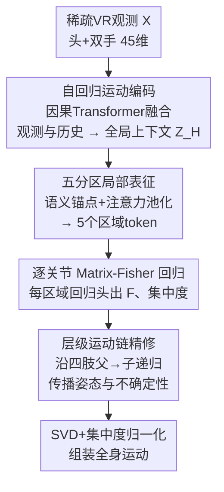

# FisherPoser: Human Motion Estimation from Sparse Observations with Hierarchical Region-Wise Fisher-Matrix Uncertainty Modeling

**会议**: CVPR 2026  
**论文**: [CVF Open Access](https://openaccess.thecvf.com/content/CVPR2026/html/Xia_FisherPoser_Human_Motion_Estimation_from_Sparse_Observations_with_Hierarchical_Region-Wise_CVPR_2026_paper.html)  
**代码**: 无  
**领域**: 人体理解 / 3D姿态估计  
**关键词**: 稀疏VR动捕, Matrix-Fisher分布, SO(3)不确定性, 分区建模, 运动链层级解码  

## 一句话总结
FisherPoser 把"用头显+两手柄三个 6-DoF 信号估全身姿态"建模成 SO(3) 流形上的概率推断：每个关节输出一个 Matrix-Fisher 分布而非单一旋转，再用"五分区 token + 沿肢体链父到子递归"把姿态和不确定性逐级传递，在 AMASS 稀疏 VR benchmark 上 MPJPE/MPJRE 全面刷新 SOTA，同时给出校准良好的逐关节置信度。

## 研究背景与动机
**领域现状**：消费级 VR 的稀疏动捕只能观测三个刚体——头显（HMD）和两个手柄，约 45 维信号，要据此还原 SMPL 骨架 22 个关节的全身姿态。主流做法是数据驱动：在 AMASS 等大型动捕数据上训一个从头手信号到全身姿态的映射，要么是确定性回归（每帧一个姿态），要么是 VAE / normalizing flow / diffusion 这类生成模型采样多个候选。

**现有痛点**：躯干被头显间接约束、手臂被手柄部分约束，而下肢几乎完全没有观测。这种严重欠约束导致典型的 one-to-many 歧义——同一段头手轨迹对应无穷多个运动学上合理的姿态。确定性回归会塌缩到一个脆弱的解；生成方法重度依赖数据先验、且缺少校准良好的不确定性，推理时难以在多个假设里可靠地挑一个；强化学习/物理仿真对 reward 设计和 sim-to-real gap 敏感；加骨盆/脚部传感器虽然有效但牺牲了"极简三点"的体验。

**核心矛盾**：作者点出现有学习框架的三个根本缺陷——(1) 缺乏内禀的不确定性量化，对下肢这类弱约束关节硬给一个确定值；(2) 把身体当成单一整体建模，忽略了不同身体区域在运动统计和可观测性上的巨大异质性；(3) 并行预测各关节、违反人体运动链的父子依赖，容易产出生理上不合理的姿态。

**本文目标**：只用头手信号，把这三件事一次性补上——显式表达旋转歧义、按区域差异化建模、按运动链层级传播。

**核心 idea**：用 SO(3) 流形上的 Matrix-Fisher 分布替代单一旋转回归，让分布的众数（mode）给姿态、集中度（concentration）给不确定性，并把这个"带不确定性的分布"作为可传播的状态，沿分区和肢体链层级精修。

## 方法详解

### 整体框架
输入是 $T$ 帧稀疏观测 $X$（每帧头/双手的位置 $p^*$、线速度 $\dot p^*$、旋转矩阵 $R^*$，拼成 $N_c=45$ 维），输出是 22 个关节相对父关节的旋转 $R^{(j)}_t \in SO(3)$。但 FisherPoser 不直接回归旋转，而是为每个关节预测一个 Matrix-Fisher 参数矩阵 $F^{(j)}_t \in \mathbb{R}^{3\times3}$，它定义了该关节旋转的一个概率分布：

$$p\!\left(R^{(j)}_t \mid F^{(j)}_t\right) = \frac{1}{c(F^{(j)}_t)} \exp\!\left(\mathrm{tr}\big[(F^{(j)}_t)^\top R^{(j)}_t\big]\right),$$

其中 $c(\cdot)$ 是归一化常数。对 $F$ 做 SVD $F = USV^\top$ 即可解出众数旋转 $\hat R = U\,\mathrm{diag}(1,1,|UV|)\,V^\top$ 和集中度向量 $s\in\mathbb{R}^3$（奇异值，越大越确定）。

整个 pipeline 串成三段：① 自回归运动编码——因果 Transformer 把当前稀疏观测和历史姿态融成全局上下文 $Z_H$；② 局部运动表征——从语义锚点和历史关节特征构造五个区域 token，驱动每个区域内逐关节的 Matrix-Fisher 回归；③ 层级概率精修——沿四条肢体链把父关节分布递归传给子关节，最后做集中度归一化与组装，回归出全身运动。

### 关键设计

**1. SO(3) 上的 Matrix-Fisher 概率建模：把"歧义"变成可训练、可传播的量**

针对"确定性回归在欠约束关节上脆弱"的痛点，FisherPoser 不输出单一旋转，而是输出一个 SO(3) 流形上的 Matrix-Fisher 分布。选 Matrix-Fisher 而非欧氏空间的高斯，是因为旋转本质上活在流形上：MF 的集中度参数能在几何上天然编码"每个关节的朝向被观测约束得有多强"，从而直接量化 one-to-many 歧义；而且它用连续旋转矩阵表示、参数无约束，优化比四元数上的 Bingham 更稳。

训练用流形上的最大似然，即负对数似然损失 $L_{MF} = \log c(F) - \mathrm{tr}[F^\top R]$，再配一个用众数 $\hat R$ 的旋转项 $L_R = -\mathrm{tr}[\hat R^\top R]$。一个工程关键点是：奇异值 $S$（即集中度）动态范围极大，直接学会优化不稳，作者引入一个可学习、数据相关的标量 $u$ 作为不确定性调节，最终集中度写成 $\exp(u)\cdot S$，自适应缩放分布的弥散程度来稳住训练。这样得到的不确定性是可校准的：实验里左膝在接触切换的复杂阶段集中度下降、采样姿态发散，平稳阶段集中度回升、采样收敛到单一众数。

**2. 五分区条件化：让模型容量对齐异质的可观测性**

针对"把身体当单一整体、稀释少量有效信号"的痛点，作者把身体按运动学切成五个区域 $\mathcal{R}=\{\text{Torso, L-Arm, R-Arm, L-Leg, R-Leg}\}$（躯干=骨盆-脊柱-颈-头；每条手臂=肩-肘-腕-手；每条腿=髋-膝-踝-脚），各配一个可学习的区域索引嵌入。

每个区域 token 的构造融合三路证据：(i) 全局上下文 $z_{H_t}$；(ii) 针对该区域定制的语义锚点 $a^{(r)}_t$；(iii) 上一帧该区域内各关节的历史特征 $h^{(j)}_{t-1}$。锚点是这个设计的精髓——它把"哪类区域该看什么"写死成先验：躯干锚点用头的绝对位置/速度/朝向作全局参考；手臂锚点用相对头显的位移、相对速度、相对旋转 $R^{H\top}_t R^{L/R}_t$ 捕捉上肢关节运动；腿部锚点因为没有直接观测，只能用头显前向 $f^H_t$、头高 $p^H_{t,z}$、头速 $|\dot p^H_t|$ 这类弱先验给下肢一个稳定基底。区域 token 先用 $Q^{(r)}_t = W_Q[z_{H_t}; a^{(r)}_t; e_r]$ 做 query，对区域内历史关节特征做 cross-attention 池化，再拼上下文/锚点/索引经两层 MLP 得到 $T^r$。五个区域并行处理，每个区域有专属回归头 $H_r$ 输出本区域各关节的初始 Fisher 参数和集中度 logit。这样下肢用弱锚点也能稳，上肢则充分利用强观测，互不稀释。

**3. 沿运动链的层级父到子递归：把校准好的不确定性顺着骨架传下去**

针对"并行预测违反运动链依赖"的痛点，区域回归虽然分了区，但区域内各关节仍是独立估的。作者加一个层级精修阶段，沿四条肢体链（如手臂 肩→肘→腕、腿 髋→膝→踝）从近端到远端递归。精修子关节 $c$ 时，把全局上下文 $z_{H_t}$、$c$ 所在区域的 token、以及父关节 $p$ 当前的 Fisher 矩阵 $F^{(p)}_{pred,t}$ 和集中度 $u^{(p)}_{pred,t}$ 拼成特征 $f^{(c)}_t$，喂给两个子关节专属网络 $\Gamma^{(c)}_F$、$\Gamma^{(c)}_u$ 得到精修后的 $F^{(c)}_{prop,t}$ 和 $u^{(c)}_{prop,t}$。

关键在于"传播的不只是姿态、还有不确定性"，并且用混合权重 $\lambda\in[0,1]$ 把递归预测和区域直接预测线性融合：

$$F^{(c)}_{pred,t} = (1-\lambda)F^{(c)}_{dir,t} + \lambda F^{(c)}_{prop,t}, \quad u^{(c)}_{pred,t} = (1-\lambda)u^{(c)}_{dir,t} + \lambda u^{(c)}_{prop,t}.$$

递归从近端到远端逐关节走，子关节因此继承父关节的姿态与不确定性特征，整条肢体链一遍向量化前向即可完成。注意躯干关节不走递归、走直接路径以保效率——这就是论文说的"region-wise conditioning（局部特异性）与 limb-wise recursion（全局一致性）的混合层级解码"。最终全身参数 $F^{(j)}_{final,t} = U \exp(u)S V^\top$（对 $F_{pred}$ 做 SVD 后重组），再算 $L_{MF}$ 和测地众数对齐损失 $L_{mode} = \sum_j \|\log(\hat R^{(j)\top}_t R^{(j)}_{gt,t})\|_2^2$，外加（补充材料里的）物理相关损失。

## 实验关键数据

数据集为 AMASS（SMPL 表示），采用两套既有协议：P1 在 CMU/BMLrub/HDM05 上按 90%/10% 划分；P2 用更大规模子集训练、留 Transitions 与 HumanEva 测试。指标为 MPJRE（旋转误差，度）、MPJPE（位置误差，mm）、MPJVE（速度误差，mm/s）和 Jitter（抖动）。

### 主实验
对比 AvatarPoser / AGRoL / AvatarJLM / SAGE / HMDPoser / RPM 等 SOTA：

| 协议 | 指标 | 本文 | 之前最好 | 提升 |
|------|------|------|----------|------|
| P1 | MPJRE(°) | **2.04** | HMDPoser 2.28 | 10.5% |
| P1 | MPJPE(mm) | **29.7** | HMDPoser 31.9 | 6.9% |
| P1 | Jitter | 5.33 | SAGE 6.55 | 18.7% |
| P2 | MPJRE(°) | **3.89** | HMDPoser 4.27 | 8.9% |
| P2 | MPJPE(mm) | **53.4** | HMDPoser 54.4 | 1.8% |
| P2 | Jitter | **3.18** | HMDPoser 5.62 | 43.4% |

P1 相比 SAGE 的 MPJRE/MPJPE 提升达 19.4%/9.5%。MPJVE 上不是最低（P1 为 205.2，RPM-Reactive 174.1 更低；P2 为 270.4，AGRoL 241.4 更低）——RPM 虽抖动最小、MPJVE 最低，但精度代价巨大（MPJRE/MPJPE 比本文差 37.2%/21.8%），本文是在精度-平滑度之间取得更好平衡。

### 消融实验
逐组件累加（P1）：

| 配置 | MPJRE(°) | MPJPE(mm) | Jitter | 说明 |
|------|---------|-----------|--------|------|
| Ours-AR | 4.26 | 63.2 | 8.06 | 仅自回归 Transformer 确定性回归 |
| Ours-Fisher | 2.87 | 38.7 | 5.64 | 加 Matrix-Fisher 头 + NLL |
| Ours-Fisher-Part | 2.13 | 30.9 | 5.36 | 再加五区域 token |
| Ours (Full) | **2.04** | **29.7** | **5.33** | 再加肢体链父子精修 |

不确定性参数化对比：

| 配置 | MPJRE(°) | MPJPE(mm) | MPJVE | Jitter |
|------|---------|-----------|-------|--------|
| Ours-AR（确定性） | 4.26 | 63.2 | 240.7 | 8.06 |
| Ours-AR-Gaussian（轴角高斯头） | 3.03 | 45.0 | 292.0 | 20.73 |
| Ours（SO(3) Matrix-Fisher） | **2.04** | **29.7** | **205.2** | **5.33** |

### 关键发现
- **从确定性到 Matrix-Fisher 这一步收益最大、其次是分区**：AR→Fisher 让 MPJPE 从 63.2 降到 38.7，再加区域 token 又降到 30.9（论文称分区贡献"the largest gain"），最后的层级精修把所有指标再小幅推进到 SOTA，说明三件事互补且缺一不可。
- **欧氏高斯参数化会破坏时序稳定**：轴角空间的高斯头虽然把精度从确定性基线拉上来（MPJPE 63.2→45.0），却让 MPJVE/Jitter 显著恶化（Jitter 飙到 20.73），印证了"欧氏参数化与旋转几何不匹配"；只有把旋转建在 SO(3) 上、把众数和逐轴集中度分离，才能同时拿到高精度和平滑运动。
- **不确定性是校准的**：左膝集中度曲线与采样姿态发散程度紧耦合——接触切换阶段集中度下降、采样发散反映真实歧义，平稳阶段集中度回升、采样收敛，说明它给的是"随运动变化"的可信置信度而非盲目自信。
- **下肢与高动态场景增益最明显**：深蹲、攀爬、跑跳等大关节活动幅度动作下，髋膝弯曲更真实、无骨盆漂移、脚步打滑和帧间翻转明显减少。

## 亮点与洞察
- **把不确定性当"可传播的状态"而非事后产物**：多数方法即便估不确定性也只是输出端的副产品，FisherPoser 让父关节的 Fisher 矩阵和集中度直接进入子关节的输入特征沿运动链传下去，是这篇最"啊哈"的点——歧义信息真正参与了下游决策。
- **锚点把领域先验显式写进特征**：腿部没观测就只给头显前向/头高/头速这类弱先验，躯干给绝对头位姿、手臂给头显相对变换，这种"按可观测性定制锚点"的思路可迁移到任何稀疏传感的结构化预测（如 IMU 动捕、稀疏关键点补全）。
- **混合解码平衡局部与全局**：躯干走直接路径保效率、四肢走递归保运动学一致，这种"哪里需要层级就用层级"的省力设计避免了对所有关节都串行解码的开销。

## 局限与展望
- 作者承认自回归架构在长序列推理时可能出现漂移失败。
- 物理相关损失被放进补充材料、正文未详述，其对最终指标的具体贡献无法从主文核验 ⚠️ 以原文为准。
- MPJVE 并非最优（被 RPM、AGRoL 等以牺牲精度为代价超过），说明在纯速度平滑这一维上仍有取舍空间。
- 自己看：方法只在 AMASS 合成/重定向动捕上验证，真实头显设备的传感噪声、延迟、漂移未端到端测试；混合权重 $\lambda$ 是否逐关节/逐区域自适应、还是全局常数，正文未明确交代。
- 展望：作者提出引入更丰富的锚点（接触、地形线索），扩展到带延迟漂移的真实长时段会话，以及与物体交互的场景。

## 相关工作与启发
- **vs AvatarPoser / AvatarJLM**：它们用 Transformer 直接回归或两阶段建模关节依赖，本质仍是确定性单姿态预测；本文把输出换成 SO(3) 分布并沿运动链传播不确定性，在欠约束的下肢上更稳。
- **vs SAGE / AGRoL（生成式，diffusion/flow）**：生成方法能采样多个候选但依赖数据先验、缺校准且采样开销大；本文用单个 Matrix-Fisher 分布同时给众数和置信度，推理时无需多次采样即可挑出可靠假设，且实时可行。
- **vs HMDPoser（加传感器路线）**：HMDPoser 靠骨盆/脚部额外传感器提精度，本文坚持极简头手三点配置，靠分区条件化和概率建模在不加硬件的前提下反超其 MPJRE/MPJPE。
- **vs 既有 Matrix-Fisher 旋转回归（Mohlin et al.）**：先前 MF 回归只做单旋转级别估计，本文首次把它结合区域条件化与肢体层级精修、专门针对头手稀疏场景沿运动链传播姿态与不确定性。

## 评分
- 新颖性: ⭐⭐⭐⭐ 把 Matrix-Fisher 概率建模、分区条件化、运动链层级不确定性传播三者系统耦合到稀疏 VR 动捕，组合新颖且动机扎实。
- 实验充分度: ⭐⭐⭐⭐ 两套协议、六个 SOTA、三组消融加不确定性校准可视化，较完整；但缺真实设备实测、$\lambda$ 等超参敏感性分析。
- 写作质量: ⭐⭐⭐⭐ 三大缺陷→三大设计的逻辑清晰，公式与锚点定义给得明确。
- 价值: ⭐⭐⭐⭐ 在不加硬件的极简 VR 配置下刷新精度并给出可用的逐关节置信度，对 VR/具身交互的实用价值高。

<!-- RELATED:START -->

## 相关论文

- [\[CVPR 2026\] Bézier Degradation Modeling for LiDAR-based Human Motion Capture](bézier_degradation_modeling_for_lidar-based_human_motion_capture.md)
- [\[CVPR 2026\] JUMP-Hand: Learning Joint-wise Uncertainty to Gate Mixture of View Experts for Multi-View 3D Hand Reconstruction](jump-hand_learning_joint-wise_uncertainty_to_gate_mixture_of_view_experts_for_mu.md)
- [\[CVPR 2026\] Hierarchical Enhancement of Semantic Priors for Disentangled Text-Driven Motion Generation](hierarchical_enhancement_of_semantic_priors_for_disentangled_text-driven_motion_.md)
- [\[CVPR 2026\] MotionHiFlow: Text-to-Motion via Hierarchical Flow Matching](motionhiflow_text-to-motion_via_hierarchical_flow_matching.md)
- [\[CVPR 2026\] Decoupled Generative Modeling for Human-Object Interaction Synthesis](decoupled_generative_modeling_for_human-object_interaction_synthesis.md)

<!-- RELATED:END -->
