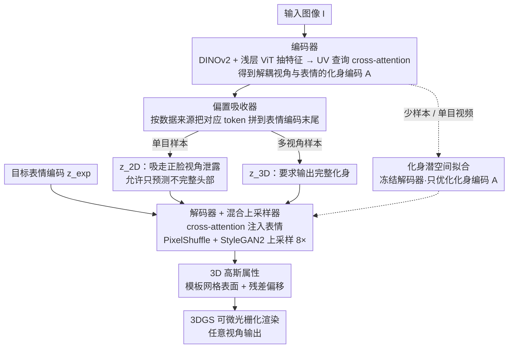

# FlexAvatar: Learning Complete 3D Head Avatars with Partial Supervision

**会议**: CVPR 2026  
**arXiv**: [2512.15599](https://arxiv.org/abs/2512.15599)  
**代码**: [有](https://tobias-kirschstein.github.io/flexavatar/)  
**领域**: Human Understanding / 3D 头部化身生成  
**关键词**: 3D 头部化身, 单图重建, 偏置吸收器, 3D Gaussian Splatting, Transformer

## 一句话总结

提出 FlexAvatar，通过引入可学习的"偏置吸收器"（bias sinks）token 统一单目和多视角数据训练，解决了驱动信号与目标视角的纠缠问题，从单张图像生成完整、高质量、可动画的 3D 头部化身。

## 研究背景与动机

从单张图像创建高质量可动画的 3D 头部化身是一个极具挑战性的问题。挑战来自两个方面：（1）大量不可观测区域使 3D 重建严重欠约束；（2）模型必须在未见过任何表情的情况下推断出逼真的面部动画。

**现有方法的困境**：

- **多视角数据**能提供完整的 3D 监督，但规模有限、难以获取
- **单目视频数据**（如从互联网抓取的人脸视频）覆盖身份广泛，但只有单一视角，存在强烈的正面偏置，导致训练出的模型只能重建不完整的 3D 头部
- **3DMM 先验**（如 FLAME）提供粗略几何和动画能力，但限制了表达力

**核心发现**：作者识别出问题的根源在于单目训练数据中**驱动信号与目标视角的纠缠**。具体来说，在单目自重演设定中，表情控制信号从目标图像本身提取，模型可以利用表情输入来猜测视角——这鼓励模型只预测部分 3D 头部即可满足损失函数。简单混合单目和多视角训练数据并不能解决这一纠缠。

## 方法详解

### 整体框架

FlexAvatar 想从一张图片就重建出完整、可驱动的 3D 头部，难点是训练数据里既有视角完整但身份稀少的多视角采集，又有身份海量但只有正脸的单目视频，二者不能简单混在一起喂。整体是一条编码器-解码器流水线：编码器 $E$ 先把输入图像 $I$ 压成一份和视角、表情都解耦的紧凑化身编码 $\mathcal{A} \in \mathbb{R}^{H_l \times W_l \times D}$（定义在模板头部 UV 空间上的 2D 隐编码）；解码器 $D$ 再把目标表情 $z_{exp}$ 注入这份编码，生成一组带动画的 3D 高斯属性；最后由 3DGS 可微光栅化渲染器 $\mathcal{R}$ 从任意视角渲染出图。整条链路真正的胜负手不在网络结构，而在如何让单目和多视角两类数据各自发力又不互相污染——这正是「偏置吸收器」要解决的事。

### 关键设计

**1. 编码器：把图像信息锚回 UV 流形，得到一份解耦的化身编码**

要让后续动画不受输入那一刻的视角和表情干扰，第一步就得把图像压成「这个人长什么样」而非「这张照片拍成什么样」。编码器先用预训练 DINOv2 加一层浅层可学习 ViT 抽出图像特征 $f_{img}$，再在模板头部网格的 UV 空间里铺一组带正弦位置编码的查询 $Q$，让每个查询通过 cross-attention 去图像特征里检索属于自己那块表面的信息。这样做的好处是查询点天生锚定在固定的 UV 流形上，跨身份共享同一套拓扑，检索出来的化身编码 $\mathcal{A}$ 自然和具体视角、具体表情无关，给后面的动画和拟合留出干净的操作空间。

**2. 偏置吸收器（Bias Sinks）：用两个 token 把单目数据的视角泄露「吸」走**

这是全文的核心贡献，针对的正是动机里那个纠缠痛点：单目自重演时驱动图和目标图是同一张（$I_{drive} = I_{target}$），表情编码 $z_{target}$ 里偷偷裹着目标视角 $\pi_{target}$ 的信息，模型只要照着这个泄露的视角预测半张脸就能把损失压低，根本没有动力补全 3D。作者的解法极简：准备两个可学习 token——$z_{2D}$ 专给单目样本、$z_{3D}$ 专给多视角样本，训练时按数据来源把对应 token 拼到表情编码序列末尾：

$$s_{exp} \leftarrow [s_{exp}, z_{bias}]$$

这个 token 就像一个「偏置的垃圾桶」，让解码器一眼看出当前样本来自哪类数据：走 $z_{2D}$ 路径时它被允许只预测不完整的头部、把正脸偏置都甩给这个 token 去吸收，走 $z_{3D}$ 路径时则必须给出完整化身。关键是两条路径共享同一套主干权重，$z_{3D}$ 路径照样能吃到海量单目数据带来的身份泛化，而单目数据的正脸偏置被 $z_{2D}$ 隔离在外、污染不到它。推理时一律切到 $z_{3D}$，于是泛化性和 3D 完整性两头都占。

**3. 解码器与混合上采样器：在不依赖 3DMM 表情空间的前提下把化身「点亮」成高斯**

拿到化身编码后还要让它真的动起来、且分辨率够高。解码器同样用 cross-attention 让化身编码去和序列化的表情编码交互，动画是数据驱动学出来的、不绑定 FLAME 之类预定义表情基，因此能表达 3DMM 覆盖不到的细微表情。为了把低分辨率的 UV 编码放大到可用尺度，这里没单用某一种上采样，而是把 PixelShuffle 和 StyleGAN2 的 CNN 块混搭成总倍率 8× 的上采样器——PixelShuffle 负责高效铺像素、StyleGAN 块负责补高频纹理细节。最后用 grid sampling 加 MLP 解出每个高斯的属性，位置则初始化在模板网格表面、只学一个残差偏移，既保证几何稳定又给细节留了自由度。

**4. 化身潜空间拟合：让同一套编码器顺手支持少样本和单目视频两种创建场景**

上述训练自然副产出一个光滑的化身潜空间，于是只要在这个空间里做优化拟合，就能用同一个模型覆盖更多场景。少样本化身创建时，先编码一张图拿到初始 $\mathcal{A}^{init}$，再对所有可用观测一起优化这份编码；单目视频创建则走同样的拟合流程，只优化 $\mathcal{A}$、把解码器冻住。相比纯 Autodecoder 从零优化，这里因为有编码器先给出一个靠谱的初值，收敛快得多——论文里 10 分钟拟合就能超过对手 4 小时的结果，靠的正是这个好起点。

### 损失函数 / 训练策略

重建损失结合四项：

$$\mathcal{L}_{rec} = \mathcal{L}_1 + \mathcal{L}_{SSIM} + \mathcal{L}_{DINO} + \mathcal{L}_{SAM}$$

| 损失项 | 说明 |
|--------|------|
| $\mathcal{L}_1$ | L1 像素损失 |
| $\mathcal{L}_{SSIM}$ | 结构相似性损失 |
| $\mathcal{L}_{DINO}$ | DINOv2 中间特征图的感知损失 |
| $\mathcal{L}_{SAM}$ | SAM 中间特征图的感知损失 |

训练细节：
- 5 个数据集联合训练（2 个单目 + 2 个多视角 + 1 个合成多视角）
- Adam 优化器，学习率 1e-4
- 感知损失在 400k 步后引入（避免早期过拟合于高频细节）
- 总计 1M 步，batch size 20，单块 A100 训练约 3 周

## 实验关键数据

### 3D 人像动画（VFHQ 数据集）

| 方法 | PSNR↑ | SSIM↑ | LPIPS↓ | CSIM↑ |
|------|-------|-------|--------|-------|
| GAGAvatar | 21.83 | 0.818 | 0.122 | 0.816 |
| LAM | 22.65 | 0.829 | 0.109 | 0.822 |
| **FlexAvatar** | **23.47** | **0.837** | **0.099** | **0.830** |

### 单图化身创建（Ava256 数据集）

| 方法 | PSNR↑ | SSIM↑ | LPIPS↓ | AKD↓ | CSIM↑ |
|------|-------|-------|--------|------|-------|
| Portrait4Dv2 | 11.9 | 0.671 | 0.404 | 7.77 | 0.578 |
| GAGAvatar | 12.7 | 0.709 | 0.371 | 7.45 | 0.555 |
| LAM | 13.1 | 0.702 | 0.399 | 11.2 | 0.411 |
| **FlexAvatar** | **16.9** | **0.762** | **0.265** | **5.52** | **0.695** |

PSNR 提升 3.8+ dB，LPIPS 大幅领先，说明生成的 3D 头部完整度和质量显著优于现有方法。

### 消融实验

| 配置 | 2D | 3D | Bias Sinks | StyleGAN | PSNR↑ | CSIM↑ |
|------|:---:|:---:|:---:|:---:|-------|-------|
| only 2D | ✓ | | | ✓ | 13.7 | 0.593 |
| only 3D | | ✓ | | ✓ | 13.2 | 0.119 |
| w/o bias sinks | ✓ | ✓ | | ✓ | 14.5 | 0.583 |
| w/o StyleGAN | ✓ | ✓ | ✓ | | 17.1 | 0.614 |
| Ours_ref | ✓ | ✓ | ✓ | ✓ | 17.2 | 0.621 |
| Ours + fitting | ✓ | ✓ | ✓ | ✓ | 16.9 | **0.682** |

### 关键发现

- **仅用单目数据**：泛化好但 3D 不完整（纠缠问题导致）
- **仅用多视角数据**：3D 完整但泛化极差（CSIM 仅 0.119）
- **简单混合两类数据**（无 bias sinks）：不能解决纠缠问题，与 only 2D 表现接近
- **Bias sinks 有效**：让模型学会在不同数据源上采用不同策略
- **拟合进一步提升**：身份保持（CSIM）和表情保真度（AKD）明显改善，仅耗时约 1 分钟

## 亮点与洞察

1. **巧妙的问题诊断**：准确识别出"驱动信号-目标视角纠缠"这一核心障碍，比简单堆积更多数据更有洞察力
2. **Bias sinks 设计极简而有效**：仅两个可学习 token 就能解耦数据集偏差，无需复杂的架构修改
3. **摆脱 3DMM 限制**：通过数据驱动方式学习面部动画，不再受限于 FLAME 的预定义表情空间
4. **统一框架覆盖多场景**：单图/少样本/单目视频三种化身创建场景，用一个模型应对
5. **在 NeRSemble 基准上**：10 分钟拟合超越了 CAP4D 的 4 小时拟合

## 局限与展望

- 光照从输入图像中"烘焙"，无法显式控制——放入不同虚拟环境可能显得不自然
- 虽然架构不依赖 3DMM，但实验都用 FLAME 表情编码，舌头等细节受限
- 可扩展到人体全身或通用动态新视角合成，但目前仅验证了头部场景
- 训练需要约 3 周（单 A100），计算成本较高

## 相关工作与启发

- **LAM** 的编码器设计为 FlexAvatar 提供了灵感（UV 空间上的查询 + cross-attention）
- **Avat3r** 的无模型动画建模思路（cross-attention 到表情编码序列）被本文采用
- **NeRF-in-the-wild** 的逐图像嵌入思想与 bias sinks 有相似之处，但 bias sinks 是数据集级别而非图像级别
- bias sinks 的设计理念（可学习 token 吸收特定偏差）可能对其他多源数据混合训练场景有广泛启示

## 评分

- **新颖性**: ⭐⭐⭐⭐⭐ — 问题诊断精准（视角-表情纠缠），bias sinks 方案简洁而原创
- **实验充分度**: ⭐⭐⭐⭐⭐ — 4 个任务、3 个数据集、详细消融验证了每个设计选择
- **写作质量**: ⭐⭐⭐⭐ — 论文逻辑清晰，图示直观，问题阐释透彻
- **价值**: ⭐⭐⭐⭐⭐ — 单图 3D 化身创建的实质性突破，bias sinks 的通用设计理念值得推广

<!-- RELATED:START -->

## 相关论文

- [\[NeurIPS 2025\] VASA-3D: Lifelike Audio-Driven Gaussian Head Avatars from a Single Image](../../NeurIPS2025/human_understanding/vasa-3d_lifelike_audio-driven_gaussian_head_avatars_from_a_single_image.md)
- [\[CVPR 2025\] WildAvatar: Learning In-the-Wild 3D Avatars from the Web](../../CVPR2025/human_understanding/wildavatar_learning_in-the-wild_3d_avatars_from_the_web.md)
- [\[CVPR 2026\] ActAvatar: Temporally-Aware Precise Action Control for Talking Avatars](actavatar_temporally-aware_precise_action_control_for_talking_avatars.md)
- [\[CVPR 2026\] SyncDreamer: Controllable and Expressive Avatar Generation Beyond the Talking Head](syncdreamer_controllable_and_expressive_avatar_generation_beyond_the_talking_hea.md)
- [\[CVPR 2026\] MatchED: Crisp Edge Detection Using End-to-End, Matching-based Supervision](matched_crisp_edge_detection_using_end-to-end_matching-based_supervision.md)

<!-- RELATED:END -->
