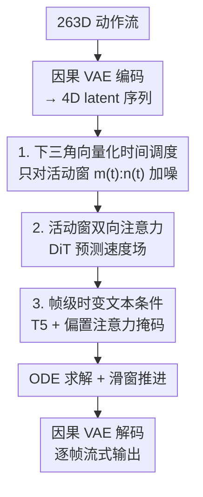

# FloodDiffusion: Tailored Diffusion Forcing for Streaming Motion Generation

**会议**: CVPR 2026  
**论文**: [CVF Open Access](https://openaccess.thecvf.com/content/CVPR2026/html/Cai_FloodDiffusion_Tailored_Diffusion_Forcing_for_Streaming_Motion_Generation_CVPR_2026_paper.html)  
**代码**: https://shandaai.github.io/FloodDiffusion/ （项目页，已开源模型/代码/权重）  
**领域**: 人体动作生成 / 扩散模型  
**关键词**: 流式动作生成, diffusion forcing, 文本驱动动作, 实时生成, 因果 VAE  

## 一句话总结
FloodDiffusion 把视频领域的 diffusion forcing 改造（tailor）到文本驱动的流式人体动作生成上，通过"下三角时间调度 + 活动窗双向注意力 + 帧级时变文本条件"三处关键修改，首次让 diffusion forcing 框架在 HumanML3D 上做到 FID=0.057，达到流式 SOTA 并逼近非流式方法。

## 研究背景与动机
**领域现状**：文本驱动的人体动作生成（text-to-motion）绝大多数工作做的是"非流式"——给一段完整文本，一次性吐出一整条动作序列（MDM、MoMask、T2M-GPT 等）。但实时 NPC、机器人控制等场景需要的是"流式"：文本提示会随时间变化（比如先"抬膝"再"深蹲"），动作要边生成边输出、并能立刻响应新提示。

**现有痛点**：现有流式方案有两条路线，各有硬伤。① **逐块扩散**（chunk-by-chunk，如 PRIMAL）：每块要等上下文填满才能开始去噪，"首帧延迟"很高；② **自回归 + 扩散头**（如 MotionStreamer）：逐 token 生成，难以显式利用过去动作的长程历史。

**核心矛盾**：流式动作生成本质是"在时变控制信号下的时间序列生成"，既要低首帧延迟、又要能用上完整历史，而上面两条路线都只能二选一。

**切入角度**：视频生成里有个叫 **diffusion forcing** 的框架——给序列里每一帧分配不同的噪声水平，理论上同时具备低首帧延迟和显式历史利用两个优点，正好对症。于是作者尝试把它搬到动作生成。

**核心 idea**：但作者发现，照搬视频版的 vanilla diffusion forcing 根本生成不出真实的动作分布。本文的贡献正是找出"为什么不行"并做三处针对性改造（tailor），并从数学上证明改造后的框架能精确复现目标数据分布（而非像原版那样优化 ELBO 代理），用"Flood"（洪水/逐帧漫灌去噪）命名这套定制版 diffusion forcing。

## 方法详解

### 整体框架
FloodDiffusion 是一个**潜空间**扩散框架。先用一个**因果 VAE** 把 263 维的动作流（全局速度、根旋转、关节旋转、足部接触）时间下采样 4 倍、编码成一条紧凑的 4 维 latent 序列；扩散过程只在这个 latent 空间里跑，从而把流式延迟压低。去噪器是 DiT 风格的骨干，预测 latent 的速度场 $\hat{u}_t$。

关键在于它如何"流式"地去噪：作者把标量的扩散时间调度 $\alpha_t,\beta_t$ 扩展成**向量化时间调度**——序列里每一帧 $k$ 各自有 $\alpha_t^k,\beta_t^k$，按一条**下三角**形状随时间推进，使得任意时刻 $t$ 只有一个"活动窗" $[m(t), n(t))$ 内的帧在被去噪，窗前的帧已固化、窗后的帧仍是纯噪声。推理时从噪声起步、不断把这个活动窗向后滑动，每生成出的 latent 帧立刻解码成动作输出，实现逐帧流式。

### 关键设计

**1. 下三角向量化时间调度：把"流式"变成可证明的局部计算**

vanilla diffusion forcing 给每帧采**随机**时间步，导致活动窗大小不定、训练-推理调度错配，而且没有一个"超过某索引后必为纯噪声"的确定边界。作者改用一条确定性的下三角调度：令 $n_s$ 为流式步长，第 $k$ 帧的噪声系数为
$$\alpha_t^k = \mathrm{clamp}\!\left(t - \tfrac{k}{n_s},\, 0,\, 1\right),\qquad \beta_t^k = 1 - \alpha_t^k,\qquad \sigma_t = 0$$
这样每帧从噪声到数据级联式地推进。配合活动窗定义 $m(t)=\lceil (t-1)\,n_s\rceil$（已完全去噪帧）、$n(t)=\lceil t\,n_s\rceil$（活动帧），作者证明了 **Streaming Locality 定理**：速度场在活动窗外恒为零，
$$u_t(\mathbf{X}_t,\mathbf{c}^{0:K}) = \big[\mathbf{0}^{0:m(t)},\; u_t^{m(t):n(t)},\; \mathbf{0}^{n(t):K}\big]^\top$$
于是每步只需对窗口 $[m(t),n(t))$ 计算，前面的帧已定稿、后面的帧还是纯噪声。这把无界的全序列计算压成有界局部计算：首帧延迟仅 1 帧（$N/n_s$ 步），控制响应延迟被 $n_s$ 帧界住。这条三角形之所以关键（论文 Remark 3.9），是因为它的硬饱和 $\alpha_t^k\in\{0,1\}$ 给出了一个确定的有限截断点 $n_s$，随机/非确定递减调度都没有这个性质，定理也就不成立。同时整套调度保持**精确似然**，而不是原版 diffusion forcing 的 ELBO 近似。

**2. 活动窗内双向注意力：让缓冲帧吃到最新文本**

视频版 diffusion forcing 用因果注意力（每帧只看过去），但本文里时刻 $t$ 的有效上下文是一整个区间 $[0,n(t))$ 而非严格的前缀（论文 Remark 3.10）。如果仍用因果掩码，活动窗内那些处于不同噪声水平的帧就看不到窗内"未来"的、合法且有用的上下文，去噪会次优。作者改成在活动窗内做**双向自注意力**，保证缓冲区里的帧都基于最新文本被去噪。消融印证这点极其关键：换成因果注意力后 FID 从 0.057 直接崩到 3.377——和全块扩散里"双向换因果只让 FID 从 0.51 涨到 0.92"完全不是一个量级，说明对 diffusion forcing 而言双向上下文是必需而非锦上添花。

**3. 帧级时变文本条件：原生处理提示切换，免去 refresh 检测**

流式场景里文本随时会变（"走路"→"坐下"→"站起"），现有方法靠推理时的人工"refresh 机制"——检测到新提示就停掉当前生成、刷新条件，既脆弱又会带来信息融合不一致。作者把它换成连续的、帧级的文本条件注入：用预训练 T5（最大长度 128）抽 token 特征，展平成 1D，套上和动作 token 同样的旋转位置编码对齐；注意力内部用一个**偏置掩码**，让每一帧动作只能 attend 到它当前时刻所激活的那段文本。这样自注意力对动作本身保持干净、又持续灌入最新文本，模型被直接训练在时变文本条件上，推理时无需任何停止/刷新/提示切换检测就能即时反映新提示。图 4 还显示同样几条提示、按不同时机投喂会得到不同动作，说明条件确实是"时变"地被消化的。

### 损失函数 / 训练策略
训练在 latent 空间做流匹配（flow matching，$\sigma_t=0$），直接回归条件速度目标：
$$\hat{u}_t = \arg\min_{u^\theta_t}\ \mathbb{E}_{t,\mathbf{z},\boldsymbol{\epsilon}}\big[\,\|u^\theta_t(\mathbf{x}_t,\mathbf{c}) - u_t(\mathbf{x}_t\mid\mathbf{z})\|^2\big]$$
其中 $t\sim\mathrm{Unif}(0,T)$、$\mathbf{z}\sim p_\text{data}$、$\boldsymbol{\epsilon}\sim p_\text{init}$、$\mathbf{x}_t=\boldsymbol{\alpha}_t\odot\mathbf{z}+\boldsymbol{\beta}_t\odot\boldsymbol{\epsilon}$；每步只在活动窗 $A=\{m,\dots,n-1\}$ 上算 loss（Algorithm 1）。训练超参：因果 VAE 时间下采样 4、latent 通道 4，AdamW（lr $2\times10^{-4}$）训 300K 步；扩散骨干流式斜率 $n_s=5$，AdamW（lr $1\times10^{-3}$）+ cosine 退火训 50K 步，均在 H200 上。先在 HumanML3D 上单独训（每帧共享同一文本，对应标准 text-to-motion），再在 HumanML3D+BABEL 上联合训以覆盖时变提示场景。推理用 CFG，最佳文本 CFG=6。

## 实验关键数据

### 主实验（HumanML3D 非流式 + BABEL 流式，Table 1）

| 方法 | 流式 | R@3↑ | FID↓ | MM-Dist↓ | PJ→ | AUJ↓ |
|------|------|------|------|----------|-----|------|
| Real motion | — | 0.797 | 0.002 | 2.974 | 1.100 | 41.20 |
| MoMask（非流式 SOTA） | ✗ | 0.807 | **0.045** | 2.958 | — | — |
| ReMoDiffuse | ✗ | 0.795 | 0.103 | 2.974 | — | — |
| PRIMAL（流式） | ✓ | 0.780 | 0.511 | 3.120 | 1.304 | 19.36 |
| MotionStreamer（流式） | ✓ | 0.802 | 0.092 | 2.909 | 0.912 | 16.57 |
| **FloodDiffusion** | ✓ | **0.810** | 0.057 | **2.887** | **0.713** | **14.05** |

FloodDiffusion 拿下最好的 R@k 与 MM-Dist，FID 0.057 仅次于非流式的 MoMask、且远超所有流式基线；流式专属指标 PJ（峰值 jerk，越接近真值越好）与 AUJ（jerk 曲线下面积，越低越平滑）都明显领先，说明过渡更平滑。

### 消融实验（核心设计，Table 3）

| 配置 | FID↓ | R@3↑ | MM-Dist↓ |
|------|------|------|----------|
| Full（Ours） | **0.057** | **0.810** | **2.887** |
| w/o 双向注意力（换因果） | 3.377 | 0.625 | 4.296 |
| w/o 下三角调度（换随机） | 3.883 | 0.532 | 4.651 |

去掉任一项 FID 都从 0.057 崩到 3+ 量级，两处改造都是"成败开关"而非微调。

### 关键发现
- **双向注意力是 diffusion forcing 的命门**：同样换因果掩码，全块扩散只是 FID 0.51→0.92，而 diffusion forcing 直接 0.057→3.377。因为活动窗内各帧噪声水平不同，去噪必须看到整窗上下文。
- **结构化级联调度 ≫ 随机调度**：随机时间步训 1M 迭代后 FID 仍是 3.883，下三角调度才 0.057，说明"确定性、级联推进"对该任务高度有利。
- **CFG 影响大**：FID/MM-Dist 随 CFG 从 1 增大显著改善，CFG=6 时达到最优（FID=0.057, MM-Dist=2.852）。
- **因果 VAE 选型不敏感**（Table 4）：VQ-VAE / MotionStreamer 的 CausalVAE / Wan CausalVAE 在相同 latent 维度下重建质量相近，作者选 Wan 版只为与视频生成社区保持架构一致。
- **用户研究**（Table 2，100 人 Bradley–Terry）：FloodDiffusion 在 Preference / Transition / Consistency 三项上都是生成基线里最高，过渡与偏好分甚至接近真实动作。

## 亮点与洞察
- **"tailor 而非照搬"的范式诊断**：论文没有发明全新框架，而是精确指出 vanilla diffusion forcing 在动作任务上失败的三个具体原因并逐一修复——这种"为什么别人的框架在我这不灵"的工程诊断本身很有借鉴价值。
- **下三角调度把流式变成可证明的局部计算**：活动窗外速度场恒零的 Streaming Locality 定理，让"边生成边输出、有界延迟"从工程 trick 升格为有数学保证的性质，且保持精确似然而非 ELBO。
- **免 refresh 的时变条件**：用偏置注意力掩码做帧级文本注入，直接在时变条件上训练，省掉了所有"检测提示切换→停止→刷新"的脆弱推理逻辑，这套思路可迁移到任何需要实时响应控制信号切换的流式生成任务（如交互式视频、音频流）。
- **首帧延迟 1 帧**：相比逐块扩散必须等满一个 chunk，diffusion forcing 在这里把首帧延迟压到 $N/n_s$ 步，同时还能用上百帧历史上下文。

## 局限与展望
- **依赖因果 VAE 的 latent 质量**：整套扩散在 4 维 latent 上跑，VAE 重建误差会成为动作质量上限；Table 4 虽显示选型不敏感，但 latent 维度等仍是潜在瓶颈。⚠️ 论文未充分讨论更高自由度表示（如 330D SMPL-X）下的表现。
- **$n_s$ 即延迟-质量权衡的旋钮**：流式步长 $n_s$（实验取 5）同时决定控制响应延迟（$n_s$ 帧）与窗口大小，论文未给出 $n_s$ 的系统敏感性分析，实际部署时这是个需要调的关键超参。
- **评测仍偏离线指标**：虽有 PJ/AUJ/用户研究，但真实实时系统里的端到端延迟、抖动、长序列漂移等尚缺直接测量。
- **改进思路**：把时变文本条件扩展到多模态控制信号（音频、轨迹、场景约束）、或探索可变 $n_s$ 以在不同动作段动态权衡延迟与质量。

## 相关工作与启发
- **vs PRIMAL（逐块扩散）**：PRIMAL 靠 chunk-by-chunk 扩散在过去动作+当前文本上扩展序列，首帧延迟高（须填满一块）；FloodDiffusion 用滑动活动窗把首帧延迟降到 1 帧，FID（0.511→0.057）与平滑度全面领先。
- **vs MotionStreamer（AR+扩散头）**：MotionStreamer 用因果 latent 空间逐 token 自回归生成，长程历史只能隐式利用；本文用双向注意力显式吃整个活动窗的历史，R@3 0.802→0.810、AUJ 16.57→14.05。
- **vs vanilla diffusion forcing（视频版）**：原版用因果注意力 + 随机时间调度 + refresh 机制，且只优化 ELBO；本文三处改造（双向注意力 / 下三角调度 / 时变文本条件）让它首次在动作流上达到 SOTA 并保持精确似然，是"把视频框架成功移植到 1D 时序动作"的关键案例。
- **vs MoMask（非流式 SOTA）**：MoMask 用离散 token 做非流式生成、FID 0.045 略优；FloodDiffusion 作为流式方法 FID 0.057 已逼近它，且在 R@k/MM-Dist 上反超，证明流式不必以质量为代价。

## 评分
- 新颖性: ⭐⭐⭐⭐⭐ 首个 diffusion-forcing 流式动作框架，且把流式性质做成可证明的定理。
- 实验充分度: ⭐⭐⭐⭐ 双数据集 + 客观/主观/消融齐全，但缺 $n_s$ 敏感性与端到端延迟实测。
- 写作质量: ⭐⭐⭐⭐ "诊断三处失败再逐一修复"的叙事清晰，理论部分推导完整。
- 价值: ⭐⭐⭐⭐⭐ 实时 NPC/机器人等流式动作场景的强基线，免 refresh 设计可迁移。

<!-- RELATED:START -->

## 相关论文

- [\[AAAI 2026\] Streaming Generation of Co-Speech Gestures via Accelerated Rolling Diffusion](../../AAAI2026/human_understanding/streaming_generation_of_co-speech_gestures_via_accelerated_rolling_diffusion.md)
- [\[CVPR 2026\] Avatar Forcing: Real-Time Interactive Head Avatar Generation for Natural Conversation](avatar_forcing_real-time_interactive_head_avatar_generation_for_natural_conversa.md)
- [\[CVPR 2026\] Towards Decompositional Human Motion Generation with Energy-Based Diffusion Models](towards_decompositional_human_motion_generation_with_energy-based_diffusion_mode.md)
- [\[CVPR 2026\] Ultra Diffusion Poser: Diffusion-Based Human Motion Tracking From Sparse Inertial Sensors and Ranging-Based Between-Sensor Distances](ultra_diffusion_poser_diffusion-based_human_motion_tracking_from_sparse_inertial.md)
- [\[CVPR 2026\] Towards Highly-Constrained Human Motion Generation with Retrieval-Guided Diffusion Noise Optimization](towards_highly-constrained_human_motion_generation_with_retrieval-guided_diffusi.md)

<!-- RELATED:END -->
