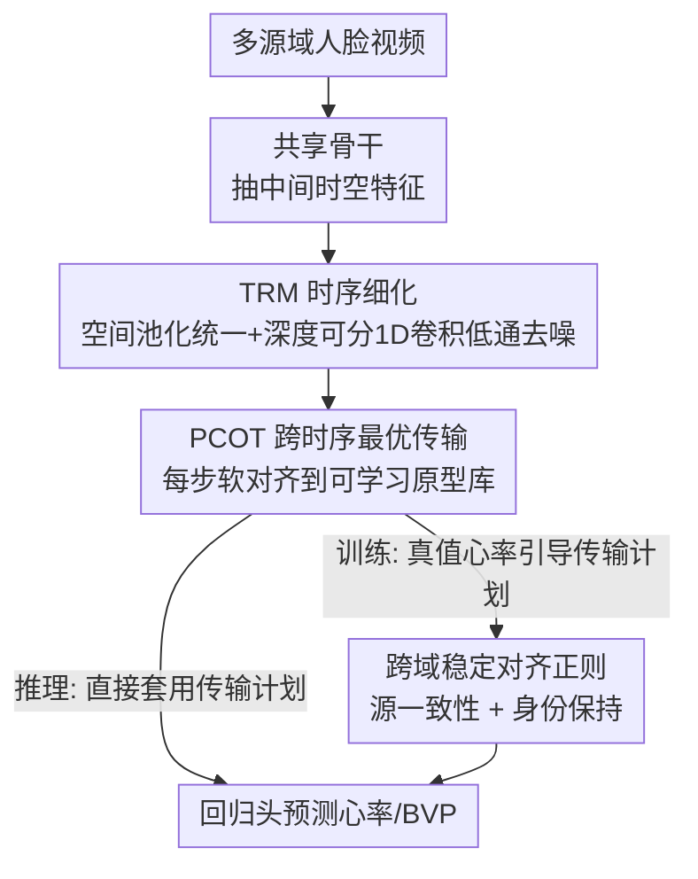

# FLOW: Optimal Transport-Driven Feature Warping for Generalized Remote Physiological Measurement

**会议**: CVPR 2026  
**论文**: [CVF Open Access](https://openaccess.thecvf.com/content/CVPR2026/html/Zhao_FLOW_Optimal_Transport-Driven_Feature_Warping_for_Generalized_Remote_Physiological_Measurement_CVPR_2026_paper.html)  
**代码**: 无  
**领域**: 人体理解 / 远程生理测量(rPPG) / 域泛化  
**关键词**: rPPG, 域泛化, 最优传输, 原型对齐, 时序特征

## 一句话总结
FLOW 把端到端 rPPG 模型跨域时的"分布漂移"看成一个特征级最优传输（OT）问题——先用轻量时序细化模块（TRM）把不同域的时序特征统一去噪，再用基于可学习原型库的跨时序最优传输（PCOT）做软对齐，配两条正则项，在四个 rPPG 基准上以即插即用、骨干无关的方式刷到跨域 SOTA。

## 研究背景与动机
**领域现状**：远程光体积描记（rPPG）从人脸视频里非接触地估计心率/血容量脉搏（BVP），近年主流是端到端神经网络（DeepPhys、PhysNet、PhysFormer 等）直接从原始视频回归生理信号，不再依赖手工的时空图（STMap）预处理。

**现有痛点**：这些端到端模型一旦换到光照、相机传感器、肤色或运动模式不同的新场景，性能会断崖式下跌——典型如 PhysNet 在 PURE 上 Pearson 相关 R 甚至为 −0.15，等于完全没抓到生理节律。现实部署中域漂移不可避免，又不可能为每个目标域采标注数据，所以域泛化（DG，训练时不接触任何目标域）成了 rPPG 真正落地的关键瓶颈。

**核心矛盾**：DG 在图像分类里被研究得很透，但搬到端到端 rPPG 几乎是空白。已有 rPPG 泛化工作要么停留在数据级 STMap 预处理 + 手工调流水线，要么只在单源设定下改架构；它们既没解决"原始视频→生理信号"这条全端到端管线的泛化，也缺乏"如何对齐/统一多个源域表示"的理论依据。更麻烦的是，rPPG 是时序回归任务，而经典 OT 域对齐基本只在分类问题上验证过，不能直接照搬。

**本文目标**：为端到端、多源 rPPG 设计一个既即插即用、又有理论保证的特征级域对齐机制，且在对齐时不能破坏生理信号本身的节律结构。

**切入角度**：作者的核心观察是——把"域间差异"重新解释成一个结构化的传输问题，用最优传输的几何来做有原则的特征对齐。相比对抗式或纯统计（MMD/CORAL）对齐，OT 给出的是可解释、数学有据的域不变表示，且天然兼容各种 rPPG 骨干。

**核心 idea**：用"特征级最优传输 warping"代替对抗/二阶统计对齐，把每个时间步软映射到一组可学习的、域无关但生理一致的原型上，从而在抹掉域特定外观因素的同时保住内在心律节奏。

## 方法详解
FLOW 的整体思路是：在任意 rPPG 骨干抽出的中间特征上插入两个轻量模块——先"统一+去噪"，再"跨域对齐"，最后用两条正则稳住对齐，整体是一条纯前馈、无对抗训练的管线。输入是多个源域的人脸视频，骨干输出中间时空特征；TRM 先把形状各异的特征统一成一致的时序序列并做低通去噪；PCOT 再把每个时间步软对齐到共享原型库上得到域不变表示；OT 对齐损失 + 源一致性 + 身份保持 + 任务回归损失共同训练。推理时模型直接套用学好的传输计划预测心率，不需要任何真值。

### 整体框架

### 关键设计

**1. TRM 时序细化模块：先把异构时序特征统一去噪，再谈对齐**

PCOT 做对齐前有个隐患——骨干抽出的中间特征可能还带着空间纠缠和高频运动伪影，形状还五花八门（如 $B\times C\times H\times W$ 或 $B\times C\times T\times H\times W$），直接拿去做传输会把噪声一起对齐进去。TRM 先做空间全局池化把任意形状压成统一时序序列 $X=\mathrm{Pool}_{\text{spatial}}(F)\in\mathbb{R}^{B\times T\times C}$，让所有时间 token 共享统一语义基；再用堆叠的深度可分 1D 卷积块做残差细化：$Y^{(l+1)}=\mathrm{Norm}\big(X^{(l)}+F_{\text{TRM}}(X^{(l)})\big)$。每个块由深度时序滤波 $Z_{t,c}=\sum_{i=1}^{k} w^{(d)}_{c,i}X^{(l)}_{t+i,c}$（抓局部节律依赖）+ 逐点通道融合 $\tilde Z_t=\phi(W_p Z_t+b_p)$（GELU 非线性）组成，复杂度仅 $O(BTCk)$。从信号处理视角看，TRM 等价于一个低通时序滤波器，逐层压掉短时噪声、增强相位稳定性与节律一致性——它是后续 OT 对齐能稳的前提。

**2. PCOT 基于原型的跨时序最优传输：把每个时间步软搬运到域无关原型上**

这是 FLOW 的核心。不同域的时序信号节律各异、还带域特定畸变，PCOT 维护一组可学习原型 $P=\{p_k\}_{k=1}^K$ 及配套的生理锚点 $H=\{h_k\}_{k=1}^K$，把每个时间步建模成"在共享原型上的分布"，用熵正则 OT 求软对应。传输代价同时考虑特征相似度和生理一致性：

$$C_{t,k}=\|W(x_t-p_k)\|_2^2+\lambda_{hr}\Big(1-\exp\big(-\tfrac{(h_t-h_k)^2}{2\sigma^2}\big)\Big),$$

其中 $W$ 是可学习对角加权矩阵，$h_t$ 是辅助头 HeadHR 估出的心率；第一项强制语义相似，第二项惩罚生理不一致，逼原型编码"域不变但生理上说得通"的特征。把时序特征经验分布 $\mu$（$\mu_t=1/T$）与原型分布 $\nu$（$\nu_k=1/K$）的匹配写成熵正则 OT：$S_\varepsilon(\mu,\nu)=\min_{\Pi\in U(\mu,\nu)}\langle C,\Pi\rangle+\varepsilon H(\Pi)$，用 Sinkhorn 迭代求最优耦合 $\Pi^\star=\mathrm{Diag}(u)\,K\,\mathrm{Diag}(v)$（$K=\exp(-C/\varepsilon)$，交替更新 $u,v$ 满足边际约束），整个过程可微。对齐结果由重心投影给出：$\tilde x_t=\sum_{k=1}^K \pi^\star_{t,k}p_k$，相当于把时序特征重新表达在原型流形上，抹掉域特定外观、又顺带平滑了时序。为消除熵偏置，对齐损失用去偏 Sinkhorn 散度 $L_{OT}=S_\varepsilon(\mu,\nu)-\tfrac12 S_\varepsilon(\mu,\mu)-\tfrac12 S_\varepsilon(\nu,\nu)$，这种对称无偏的度量让对齐更稳、泛化更好。相比 MMD/CORAL 只做全局分布的统计对齐，PCOT 是逐时间步的软搬运，能在对齐的同时保住节律结构——这正是 rPPG 这种时序回归任务的命门。

**3. 跨域稳定对齐的两条正则：防对齐"塌成一团"或"改得面目全非"**

OT 虽有原则，但域差距大时传输计划容易不稳或过度平滑。作者加两条互补正则。其一是**源一致性正则**：对每个源域 $D_j$ 按传输计划算平均原型分配直方图 $\bar h_j=\frac{1}{|D_j|}\sum_{i\in D_j}\frac1T\sum_t \pi^\star_{t,k}$，再最小化各域直方图之间的方差 $L_{src}=\frac1M\sum_j\|\bar h_j-\bar h\|_2^2$，逼所有域共享一致的原型占用模式，强化域不变语义。其二是**身份保持正则**：约束对齐前后表示的距离 $L_{id}=\frac{1}{BT}\sum_{b,t}\|\tilde x_{b,t}-x_{b,t}\|_2^2$，防止特征被搬得过度形变、保住被试身份与内在节律。最终目标 $L_{total}=L_{task}+\lambda_{OT}L_{OT}+\lambda_{src}L_{src}+\lambda_{id}L_{id}$，把任务回归、OT 对齐、全局域一致与局部生理保持拧成一个连贯目标，整套无需对抗训练即可得到平滑的时序表示。

### 损失函数 / 训练策略
总损失 $L_{total}=L_{task}+\lambda_{OT}L_{OT}+\lambda_{src}L_{src}+\lambda_{id}L_{id}$：$L_{task}$ 是 rPPG 回归任务损失，$L_{OT}$ 用去偏 Sinkhorn 散度做原型对齐，$\lambda_{src},\lambda_{id}$ 平衡"对齐灵活度"与"表示稳定性"。训练时用真值心率信号引导/细化传输计划以更好对齐原型；推理时直接套用学好的传输计划预测心率，全程不需真值（详细训练/推理流程见原文附录 D ⚠️ 以原文为准）。

## 实验关键数据

四个公开数据集做多源域泛化：UBFC-rPPG(U)、PURE(P)、BUAA-MIHR(B)、MMPD(M)；指标为 MAE↓、RMSE↓、Pearson 相关 R↑。

### 主实验
多源 DG（留一域作为目标，其余作源）平均结果，FLOW 全面领先传统手工法、端到端 rPPG 基线以及 DG 基线（CORAL/MMD，同骨干公平对比）：

| 方法 | 平均 MAE↓ | 平均 RMSE↓ | 平均 R↑ |
|------|-----------|------------|---------|
| POS（手工） | 8.64 | 11.58 | 0.41 |
| PhysNet（端到端） | 18.30 | 22.98 | 0.14 |
| PhysFormer | 16.51 | 21.98 | 0.23 |
| CORAL+（DG 基线） | 9.97 | 14.21 | 0.55 |
| MMD+（DG 基线） | 9.35 | 13.28 | 0.57 |
| **FLOW（本文）** | **6.84** | **10.75** | **0.70** |

分域看，FLOW 在 BUAA-MIHR 上 MAE 2.23 / R 0.97，超过最强 DG 基线 MMD（MAE 2.80 / R 0.95）；在 UBFC-rPPG 与 PURE 上相关系数 R 比 MMD 高出 0.4 以上，说明对外观与运动变化更鲁棒。

限源设定（只用两个数据集作源）同样稳定领先，例如目标域 MMPD 的平均成绩：

| 方法 | MAE↓ | RMSE↓ | R↑ |
|------|------|-------|-----|
| PhysNet | 12.57 | 17.00 | 0.20 |
| NEST | 10.46 | 15.13 | 0.33 |
| CORAL+ | 11.15 | 15.57 | 0.27 |
| MMD+ | 10.74 | 15.48 | 0.28 |
| **FLOW** | **8.65** | **13.26** | **0.48** |

### 消融实验
在 BUAA-MIHR 与 MMPD 上逐个去掉 TRM / PCOT（Table 5）：

| 配置 | BUAA MAE↓ | BUAA RMSE↓ | MMPD MAE↓ | MMPD RMSE↓ | 说明 |
|------|-----------|------------|-----------|------------|------|
| FLOW（完整） | 2.23 | 3.36 | 7.38 | 13.12 | TRM+PCOT 全开 |
| w/o TRM | 3.12 | 4.61 | 8.16 | 14.10 | 去时序细化，时序去噪能力下降 |
| w/o PCOT | 4.67 | 6.13 | 10.24 | 14.94 | 去原型 OT 对齐，掉点最多 |

### 关键发现
- **PCOT 是贡献主力**：去掉它 BUAA MAE 从 2.23 飙到 4.67（翻倍多），远大于去掉 TRM（→3.12），说明原型最优传输对齐才是跨域鲁棒的核心，时序细化是辅助但必要的前置。
- **骨干无关、即插即用**：把 FLOW 接到 RhythmFormer / EfficientPhys / PhysFormer / PhysNet 等多种骨干上都能显著降 MAE；在 PhysFormer 上对比同骨干的 MMD/CORAL（Table 4），FLOW 在多组源-目标设定上 MAE/RMSE 最低，例如 PURE+MMPD→BUAA 把 MAE 从 14.86 降到 10.38。
- **统计对齐不够，需语义+生理一致性**：MMD/CORAL 这类只做全局二阶/分布统计对齐的方法在某些组合下甚至出现负相关（如 PURE+MMPD 或 PURE+UBFC 设置），印证了 rPPG 跨域不能只看分布距离，还要保住时序节律——这正是 PCOT 软对齐 + 身份保持正则要解决的。

## 亮点与洞察
- **把域漂移重述成"特征搬运"问题**很巧：用熵正则 OT + 重心投影把时序特征软映射到原型流形，天然抹外观、留节律，比对抗对齐可解释、比 MMD/CORAL 更尊重时序结构。
- **传输代价里塞进生理锚点**是点睛之笔：代价函数第二项用辅助心率头的 $h_t$ 和原型锚点 $h_k$ 的高斯差，把"生理一致性"直接写进 OT 几何，逼原型既域不变又生理可解释，而不是单纯几何最近邻。
- **轻量 + 即插即用**：TRM 只是深度可分 1D 卷积（$O(BTCk)$），PCOT 是可微 Sinkhorn，整套无对抗、无需额外预处理就能塞进现有端到端 rPPG 架构——这条"特征级 OT warping + 原型库"的思路也可迁移到其它跨域时序回归任务（如可穿戴信号、语音节律）。

## 局限与展望
- 作者给出了条件 OT 判别下的多源泛化界，把对齐质量和未见域预测风险形式化挂钩，但理论假设（如域条件分布、原型容量 $K$）在真实复杂域漂移下是否成立未充分实证 ⚠️ 以原文为准。
- 训练阶段依赖真值心率信号去引导/细化传输计划，对标注质量与辅助心率头 HeadHR 的精度有隐性依赖；HeadHR 估计差时生理一致性项可能误导原型。
- 实验只在四个常见 rPPG 数据集上验证，肤色多样性、剧烈运动、低光等极端域是否仍稳健缺乏针对性压力测试；原型数 $K$、$\lambda_{hr}$、$\varepsilon$ 等关键超参的敏感性分析在正文中呈现有限。
- 可改进方向：把真值引导换成自/弱监督的传输计划细化以降低对标注依赖；为原型库引入在线更新或域自适应扩容，应对推理时遇到的全新域。

## 相关工作与启发
- **vs MMD / CORAL**：它们只对齐全局特征分布的一/二阶统计，FLOW 改为逐时间步的原型软最优传输 + 时序细化，能保住时序节律；实验里 MMD/CORAL 在大域差时不稳甚至出负相关，FLOW 各配置稳定领先。
- **vs 基于 STMap 的 rPPG 泛化方法**：那类工作停在数据级预处理 + 手工流水线、且多为单源设定，FLOW 是面向全端到端、多源的特征级对齐，无需 STMap 预处理。
- **vs 经典 OT 域适应/泛化（多用于图像分类）**：FLOW 首次把 OT 对齐用到端到端 rPPG 这种时序回归任务，并加入生理锚点与去偏 Sinkhorn 散度使其适配节律信号，兼有算法与理论贡献。

## 评分
- 新颖性: ⭐⭐⭐⭐⭐ 首个面向端到端、多源 rPPG 的特征级 OT 域泛化框架，把生理一致性写进传输代价
- 实验充分度: ⭐⭐⭐⭐ 四基准 + 多源/限源 + 多骨干 + 消融较全，但极端域与超参敏感性验证偏少
- 写作质量: ⭐⭐⭐⭐ 机制与公式清晰、动机扎实；部分实现细节甩到附录
- 价值: ⭐⭐⭐⭐ 轻量即插即用、骨干无关，对 rPPG 真实跨域部署有直接落地价值

<!-- RELATED:START -->

## 相关论文

- [\[CVPR 2026\] PHASE-Net: Physics-Grounded Harmonic Attention System for Efficient Remote Photoplethysmography Measurement](phase-net_physics-grounded_harmonic_attention_system_for_efficient_remote_photop.md)
- [\[CVPR 2025\] Optimal Transport-Guided Source-Free Adaptation for Face Anti-Spoofing](../../CVPR2025/human_understanding/optimal_transport-guided_source-free_adaptation_for_face_anti-spoofing.md)
- [\[CVPR 2026\] FlowPalm: Optical Flow Driven Non-Rigid Deformation for Geometrically Diverse Palmprint Generation](flowpalm_optical_flow_driven_non-rigid_deformation_for_geometrically_diverse_pal.md)
- [\[CVPR 2026\] HUMAPS-4D: A Multimodal Dataset for HUman Motion Analysis with Physiological and Semantic informations](humaps-4d_a_multimodal_dataset_for_human_motion_analysis_with_physiological_and_.md)
- [\[CVPR 2026\] FMPose3D: monocular 3D pose estimation via flow matching](fmpose3d_monocular_3d_pose_estimation_via_flow_matching.md)

<!-- RELATED:END -->
