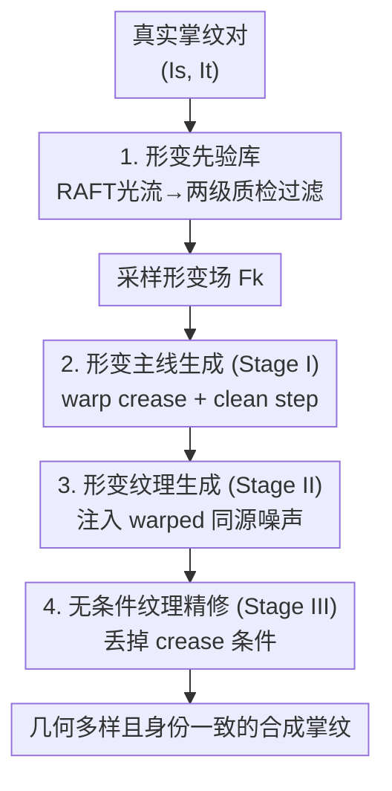

# FlowPalm: Optical Flow Driven Non-Rigid Deformation for Geometrically Diverse Palmprint Generation

**会议**: CVPR 2026  
**论文**: [CVF Open Access](https://openaccess.thecvf.com/content/CVPR2026/html/Zou_FlowPalm_Optical_Flow_Driven_Non-Rigid_Deformation_for_Geometrically_Diverse_Palmprint_CVPR_2026_paper.html)  
**代码**: https://yuchenzou.github.io/FlowPalm/ (项目主页)  
**领域**: 人体理解 / 生物特征识别 / 扩散模型  
**关键词**: 掌纹生成, 光流, 非刚性形变, 扩散模型, 身份一致性  

## 一句话总结
FlowPalm 用 RAFT 光流从真实掌纹对里统计出非刚性形变场、过滤成"形变库"，再在扩散采样里分三阶段把形变注入主线（crease warp）和纹理（warped noise），生成几何多样且身份一致的合成掌纹——只用合成数据训练的识别模型（85.20% TAR）反超真实数据（73.59%）。

## 研究背景与动机

**领域现状**：掌纹识别因纹理丰富、隐私友好成为热门生物特征，但高性能识别模型依赖大规模、多样、高质量的数据集，而真实掌纹采集受隐私政策和严格采集协议限制。于是近年研究普遍用 GAN / 扩散模型合成带新身份的掌纹（典型做法是用 B 样条/多项式曲线参数化掌纹主线 crease 作为条件），来替代真实数据训练识别器。

**现有痛点**：现有合成方法几乎只做"外观建模"——增强风格、迁移纹理，却忽视了真实掌纹固有的**几何多样性**。真实环境里，手掌弯曲、手指关节运动、相机视角、成像参数差异会让掌纹产生复杂的非刚性形变，而这恰恰是决定识别鲁棒性的关键维度。但现有方法要么**完全忽略**几何形变（Diff-Palm），要么只用**手工简化扰动**：线条振荡（RPG-Palm、PFIG-Palm）或仿射变换（PCE-Palm）。

**核心矛盾**：手工形变无法复现真实手掌那种空间变化的、局部弹性弯曲叠加全局形状变化的非刚性形变，导致合成数据几何多样性受限，识别性能撞上瓶颈。生成真实形变之所以难，卡在两点：(1) 如何准确建模并模拟真实手掌空间变化的非刚性形变；(2) 引入形变的同时如何保持身份一致性（形变过头会破坏 identity 纹理）。

**核心 idea**：与其手工设计形变，不如**让真实数据自己说话**——用预训练光流模型 RAFT 在同身份的真实掌纹对之间估计稠密形变场，统计出真实形变的分布作为几何先验；再利用扩散模型"噪声-内容等变性"（对输入噪声做空间变换会让生成图产生对应结构变化），在采样过程中渐进地把形变同时注入到 crease 条件和噪声里，做到"几何多样 + 身份一致"。

## 方法详解

### 整体框架
FlowPalm 分两大组件：**(1) 形变先验构建**——从真实掌纹对估计光流形变场并两级质检，攒成"形变库"$\mathcal{L}=\{F_1,\dots,F_N\}$，统计性地代表真实非刚性形变分布；**(2) 形变驱动的三阶段生成**——从库里采样形变场 $F_k$，分三阶段渐进地把几何形变注入扩散去噪：Stage I 在 warp 过的 crease 条件下生成"形变主线"，Stage II 注入"warp 过的同源噪声"长出与主线对齐的形变纹理，Stage III 丢掉 crease 条件做无条件精修提升纹理真实感。

掌纹由两部分组成：**principal line / crease（主线，承载身份结构）** 和 **texture（细纹理）**。本文的关键洞察是：要让形变后两者仍然身份一致，就得让 crease 和 noise **同步形变**——crease warp 控制全局结构形变，warped noise 保证纹理跟着主线一起形变。

### 关键设计

**1. 形变先验库：用光流把真实非刚性形变"采集"成可复用的几何先验**

针对"手工形变无法复现真实非刚性形变"这个痛点，作者不再手工设计变换，而是从真实数据里**统计**形变。给定同身份的一对掌纹 $I_s$（源）和 $I_t$（目标），用预训练 RAFT-Large 估计稠密形变场 $F=(u,v)$，每个向量 $(u_{x,y}, v_{x,y})$ 表示像素从源到目标的水平/垂直位移，满足 $\mathbf{I}_t(x,y)\approx \mathbf{I}_s(x+u_{x,y},\,y+v_{x,y})$，$F\in\mathbb{R}^{H\times W\times 2}$。这种形变场天然同时捕获了局部弹性弯曲和手指/手掌姿态带来的全局形状变化。

但光流不全可靠（可能有不连续、噪声向量、错误对应），所以做**两级质检**：① **平滑性校验**——物理上合理的形变应在局部邻域平滑变化，用不连续比例 $\mathcal{D}(\mathbf{F})=\frac{1}{HW}\sum_{x,y}\mathbb{I}(\|\nabla\mathbf{F}(x,y)\|_2>\delta)$ 度量（$\delta=5$），只保留 $\mathcal{D}(\mathbf{F})<\tau_d$ 的；② **身份一致性校验**——即使几何上合理，失败形变常表现为身份纹理失真，于是把 $F$ warp 到源图得 $\hat{\mathbf{I}}_t=\mathcal{W}(\mathbf{I}_s,\mathbf{F})$（$\mathcal{W}$ 是双线性采样 warp），再用预训练识别模型 $\mathcal{R}(\cdot)$ 算 $\hat{\mathbf{I}}_t$ 与 $\mathbf{I}_t$ 特征的余弦相似度 $\mathcal{C}(\mathbf{F})$，只留 $\mathcal{C}(\mathbf{F})>\tau_c$ 的。实现里 $\tau_d=0.01$、$\tau_c=0.4$，每身份最多取 40 对。过滤后留下的高质量形变场组成形变库 $\mathcal{L}$，成为后续生成可采样的物理意义明确的几何先验。

**2. 形变主线生成（Stage I）：warp crease 条件控制全局结构形变**

针对"如何把形变注入身份结构"，本阶段在去噪步 $t\in[T,\,0.5T]$ 工作。给定一张表示合成身份主线结构的手工 crease 图 $\mathbf{C}$，从同身份采样形变场 $\{F_k\}$ 并用双线性采样把它 warp 掉：$\mathbf{C}^{(k)}_w=\mathcal{W}(\mathbf{C},\mathbf{F}_k)$。以 warp 后的 $\mathbf{C}^{(k)}_w$ 为条件，扩散模型按 DDIM 反向更新去噪（$\eta=0$ 确定性采样）。在本阶段末步 $t^\star=0.5T$ 做一个 **clean denoising step**，把随机噪声成分显式去掉，得到干净的结构信号：

$$\mathbf{x}_{\text{clean}}=\frac{\mathbf{x}_{t^\star}-\sqrt{1-\bar\alpha_{t^\star}}\,\boldsymbol{\epsilon}_\theta(\mathbf{x}_{t^\star},\mathbf{C}^{(k)}_w,t^\star)}{\sqrt{\bar\alpha_{t^\star}}}$$

这个 $\mathbf{x}_{\text{clean}}$ 是几何一致的主线结构，为下一步注入 warped 噪声提供干净的"画布"。crease warp 控制的是**全局形变**——主线骨架先变形定调。

**3. 形变纹理生成（Stage II）：注入 warped 同源噪声让纹理跟着主线一起形变**

光让主线形变还不够，纹理也得跟着同步形变才身份一致。本阶段（$t\in[0.5T,\,0.25T]$）利用扩散模型的**噪声-内容等变性**：对输入噪声做空间变换，会让生成图产生对应的结构变化。于是作者在 Stage I 的 clean 主线上注入一个**与形变场一致的 warped 同源高斯噪声** $\mathbf{n}_{\text{warp}}=\mathcal{T}_{\text{warp}}(\boldsymbol{\xi},\mathbf{F}_k)$，其中 $\mathcal{T}_{\text{warp}}$ 用 $\int$-Noise warp 策略保证 warp 后噪声**仍服从** $\mathcal{N}(0,\mathbf{I})$。然后重建 $t^\star$ 处的带噪状态：

$$\mathbf{x}^{\text{new}}_{t^\star}=\sqrt{\bar\alpha_{t^\star}}\,\mathbf{x}_{\text{clean}}+\sqrt{1-\bar\alpha_{t^\star}}\,\mathbf{n}_{\text{warp}}$$

之后继续 DDIM 去噪长出与 warp 主线对齐的形变纹理。和 Diff-Palm 的区别很关键：Diff-Palm 基于 DDPM、要在每个迭代步逐渐对齐噪声分布；而 FlowPalm 先用 Stage I 的 clean step **显式去掉**原噪声成分，于是只需**一次性**注入新噪声、用确定性 DDIM 加速——噪声 warp 只做一次而非每步都做，省了不少计算。这就是"crease warp 管全局、warped noise 管纹理细节"的分工，两者由同一个 $F_k$ 驱动所以天然对齐。

**4. 无条件纹理精修（Stage III）：丢掉 crease 条件去掉过约束伪影**

训练时用的纹理条件（纹理提取器从真图抽的）和采样时用的**手工 crease 图**有显著分布差异，直接一路拿手工 crease 当条件会让纹理被**过度约束**、显得不真实。为弥合这个 mismatch，训练时**随机丢弃 crease 条件**学出一个无条件分支；采样的最后阶段（$t<\tau_u\cdot T$）移除 crease 条件，按相同更新规则做无条件去噪 $\boldsymbol{\epsilon}_\theta(\mathbf{x}_t,\varnothing,t)$ 精修纹理，得到最终 $\mathbf{x}_0$。消融显示丢弃起始时刻 $\tau_u$ 很敏感：$\tau_u=0$（全程无条件）只有 29.89%，$\tau_u=0.25$ 升到 58.95%，再大到 0.30 基本持平——说明既要保留足够的条件引导身份，又要留一段无条件窗口去掉过约束伪影。

### 损失函数 / 训练策略
基础是预训练噪声预测器 $\boldsymbol{\epsilon}_\theta$ 的 DDIM 框架（$\eta=0$ 确定性采样，$T=250$ 步）。U-Net 五级分辨率、256×256，batch 128，Adam（lr $8\times10^{-5}$）训 100k 步 + EMA，8×A100。训练用纹理提取器抽纹理作配对条件，并随机丢 crease 条件以学无条件分支（即 Stage III 的能力来源）。识别评测端：MobileFaceNet backbone，每个生成方法造 2000 个合成身份、每身份 40 张图，SGD 训 40 epoch。

## 实验关键数据

### 主实验
六个公开掌纹库（XJTU-UP、MPD、TCD、CASIA、IITD、PolyU），指标为 TAR@FAR=$10^{-6}$（%）。纯合成数据训练识别器的对比（Table 1）：

| 设置 | 方法 | 几何变换 | 平均 TAR |
|------|------|---------|---------|
| w/o Aug. | Diff-Palm (CVPR'25) | × | 9.84 |
| w/o Aug. | UAA (ICCV'25) | 仿射 | 51.35 |
| w/o Aug. | **FlowPalm** | 非刚性 | **58.95** |
| w/ Aug. | Diff-Palm | × | 79.02 |
| w/ Aug. | PFIG-Palm | 线振荡 | 62.00 |
| w/ Aug. | **FlowPalm** | 非刚性 | **85.20** |

不同训练范式（Table 2，平均 TAR）：

| 范式 | Real Only | Diff-Palm | PFIG-Palm | FlowPalm |
|------|-----------|-----------|-----------|----------|
| Syn. Only（纯合成） | 73.59 | 79.02 | 62.00 | **85.20** |
| Syn. + Real（混合） | — | 90.57 | 91.60 | **92.95** |
| Syn. → Real（预训练→微调） | — | 90.00 | 92.03 | **94.15** |

最亮的一点：**Syn. Only 85.20% 反超 Real Only 73.59%**——只用 FlowPalm 合成数据训练的识别器，比用真实数据训练的还好 11.6 个点，说明非刚性形变真的补上了真实数据里也欠缺的类内几何多样性。

### 消融实验
Table 3 中段，逐步加形变组件（$\tau_u=0.25$，TAR@FAR=$10^{-6}$）：

| Deform Sel. | Crease Warp | Noise Warp | w/o Aug. | w/ Aug. |
|:---:|:---:|:---:|---:|---:|
| × | × | × | 7.78 | 74.78 |
| × | ✓ | ✓ | 51.73 | 76.61 |
| ✓ | × | ✓ | 27.43 | 71.00 |
| ✓ | ✓ | × | 7.58 | 74.08 |
| **✓** | **✓** | **✓** | **58.95** | **85.20** |

condition drop 起始时刻 $\tau_u$ 的影响：

| $\tau_u$ | 0.00 | 0.10 | 0.20 | 0.25 | 0.30 |
|------|---:|---:|---:|---:|---:|
| w/o Aug. | 29.89 | 39.50 | 54.32 | **58.95** | 58.57 |
| w/ Aug. | 67.25 | 70.58 | 83.88 | **85.20** | 85.14 |

### 关键发现
- **Noise Warp 是最关键组件**：去掉它（✓✓×）w/o Aug 直接从 58.95 崩到 7.58——纹理不跟着主线形变，身份一致性破坏，几何形变形同虚设。
- **Crease Warp 同样不可少**：去掉它（✓×✓）掉到 27.43，只 warp 噪声而主线不动，结构对不齐。
- **形变质检不可省**：不做 Deformation Selection（×✓✓）从 58.95 掉到 51.73——未过滤的形变会引入不连续/过激 warp 严重破坏掌纹结构。
- **类内距离不是越小越好**：Table 3 上段，FlowPalm 的 Fréchet Distance 最低（0.1503，最真实）、类间距离最高（0.9559，身份最可分），但**类内距离不是最小**（0.3766）——作者解释这是非刚性形变自然带来的类内几何多样性，且这种多样性反而提升了下游识别鲁棒性，并非缺陷。

## 亮点与洞察
- **"形变也是数据"**：把识别鲁棒性所需的几何多样性，从"手工设计扰动"换成"用光流从真实数据统计采集"，这个视角迁移性很强——任何受类内几何形变影响的生物特征（指纹、虹膜、人脸表情）都能套这套"光流采集形变库 + 注入生成"的范式。
- **crease/noise 双 warp + 同一形变场驱动**：用一个 $F_k$ 同时 warp 条件和噪声，巧妙地把"结构形变"和"纹理形变"绑定到同一几何先验上，天然保证两者对齐——这是身份一致性的关键，比逐步对齐噪声分布更省算。
- **clean step 解锁单次噪声注入**：先 clean 去噪显式清掉原噪声、再一次性注入 warped 噪声，把 Diff-Palm 每步加噪改成一次加噪 + DDIM 确定性采样，是个能复用的加速 trick。
- **无条件精修治"过约束"**：识别到训练条件（自动抽纹理）vs 采样条件（手工 crease）的分布 mismatch，用 condition drop 学无条件分支并在末段切换，是对"训练-推理条件不一致"的实用解法。

## 局限与展望
- **依赖配对真实数据建库**：形变库需要同身份的真实掌纹对来估计光流，对真实数据仍有依赖（虽然只用训练 split 的身份），完全 data-free 还做不到。
- **质检阈值需经验调**：$\tau_d=0.01$、$\tau_c=0.4$、$\delta=5$ 都是经验设定，跨数据集/采集条件的可迁移性未充分验证。⚠️ 论文未给阈值敏感性曲线。
- **CASIA 上偶有不及**：Table 1 w/ Aug 在 CASIA 上 FlowPalm（66.53）略低于 Diff-Palm（66.40 附近）波动，少数库上非刚性形变收益不明显，可能与该库本身几何变化小有关。
- **三阶段切换点固定**：Stage 边界（$0.5T$/$0.25T$）和 $\tau_u$ 都是手调，能否自适应每个身份/形变强度值得探索。

## 相关工作与启发
- **vs Diff-Palm（CVPR'25）**: Diff-Palm 完全忽略几何形变、靠后期 DDPM 一致性噪声维持纹理一致；FlowPalm 显式建模非刚性形变（crease+noise 双 warp），且用 clean step + 单次噪声注入 + DDIM 替代逐步加噪，Syn. Only 从 79.02 提到 85.20。
- **vs RPG-Palm / PFIG-Palm（线振荡）、PCE-Palm（仿射）**: 它们用手工简化扰动近似几何变化，无法复现空间变化的非刚性形变；FlowPalm 从真实光流统计形变分布，几何多样性和真实感都更高（Fréchet Distance 0.15 vs 0.24~0.37）。
- **启发自噪声-内容等变性**（$\int$-Noise warp [3]、noise equivariance [48]）: 把"对噪声做空间变换 ⇒ 生成内容对应形变"这一性质，从通用可控生成落地到掌纹的纹理形变对齐，是一次漂亮的领域应用。

## 评分
- 新颖性: ⭐⭐⭐⭐⭐ 首次用光流统计真实非刚性形变并注入扩散生成，把"几何多样性"这一被忽视维度补上。
- 实验充分度: ⭐⭐⭐⭐ 六库 + 四训练范式 + 三层消融充分，但缺阈值敏感性曲线。
- 写作质量: ⭐⭐⭐⭐ 公式与三阶段流程清晰，crease/noise 双 warp 的动机讲得透。
- 价值: ⭐⭐⭐⭐⭐ Syn. Only 反超 Real Only，对隐私受限的生物特征数据合成有强实用价值。

<!-- RELATED:START -->

## 相关论文

- [\[CVPR 2026\] FLOW: Optimal Transport-Driven Feature Warping for Generalized Remote Physiological Measurement](flow_optimal_transport-driven_feature_warping_for_generalized_remote_physiologic.md)
- [\[CVPR 2026\] Unified Number-Free Text-to-Motion Generation Via Flow Matching](unified_number-free_text-to-motion_generation_via_flow_matching.md)
- [\[CVPR 2026\] ReMoGen: Real-time Human Interaction-to-Reaction Generation via Modular Learning from Diverse Data](remogen_real-time_human_interaction-to-reaction_generation_via_modular_learning_.md)
- [\[CVPR 2026\] MotionMaster: Generalizable Text-Driven Motion Generation and Editing](motionmaster_generalizable_text-driven_motion_generation_and_editing.md)
- [\[CVPR 2026\] Text-Driven 3D Hand Motion Generation from Sign Language Data](text-driven_3d_hand_motion_generation_from_sign_language_data.md)

<!-- RELATED:END -->
