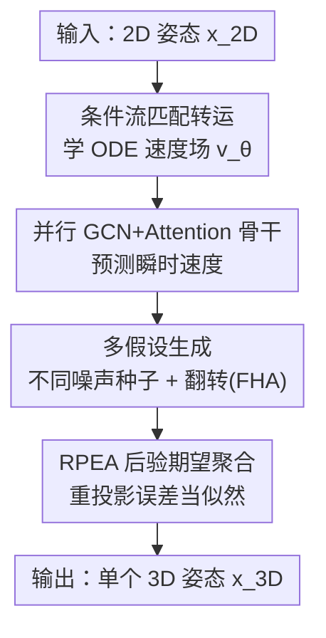

# FMPose3D: monocular 3D pose estimation via flow matching

**会议**: CVPR 2026  
**论文**: [CVF Open Access](https://openaccess.thecvf.com/content/CVPR2026/html/Wang_FMPose3D_monocular_3D_pose_estimation_via_flow_matching_CVPR_2026_paper.html)  
**代码**: https://github.com/AdaptiveMotorControlLab/FMPose3D  
**领域**: 人体理解 / 3D视觉  
**关键词**: 单目3D姿态估计, 流匹配, 多假设生成, 贝叶斯后验聚合, 2D-to-3D lifting  

## 一句话总结
把单目 2D-to-3D 姿态提升重新表述成"条件分布转运"问题，用 Flow Matching 学一个 ODE 速度场，只需 3 步积分就能把高斯噪声搬运到合理 3D 姿态分布；再用基于重投影误差的后验期望聚合（RPEA）把多个假设融成一个估计，在 Human3.6M / MPI-INF-3DHP 与动物数据集上都超过扩散类方法，且推理快约 5 倍。

## 研究背景与动机
**领域现状**：单目 3D 人体姿态估计主流走 2D-to-3D lifting 两段式——先用现成检测器拿 2D 关节，再把 2D 关节"抬升"到 3D 坐标。由于单视角下多个 3D 姿态会投影成同一个 2D 姿态，这个抬升本质上是病态（ill-posed）的，确定性回归模型只会退化成"对所有合理解取平均"的模糊预测。

**现有痛点**：为了刻画这种不确定性，近年主流转向概率式多假设建模，其中扩散模型（DiffPose、D3DP、CHAMP）效果最好——它们把 lifting 看成对随机噪声的逐步去噪。但扩散的反向过程是一条 SDE，每生成一个假设都要跑很多次顺序采样：即使用 DDIM 加速，要达到好精度通常还得 10–15 步，单帧 DiffPose 不用 DDIM 只有 3.36 FPS。这个"精度 vs 速度"的取舍让它们难以实时落地。

**核心矛盾**：要表达多假设就得用生成模型，而生成模型（扩散）的迭代采样又慢。问题根源在于扩散学的是随机去噪 SDE，轨迹随机、步数多。

**本文目标**：在保留多假设建模能力的前提下，把采样步数压到个位数，并且最后还能稳定地从多个假设里收敛出一个准确预测。

**切入角度**：Flow Matching（FM）学的是确定性速度场，由 ODE 支配，把简单噪声分布连续搬运到目标数据分布；确定性轨迹意味着可以用极少的积分步（甚至单步）完成采样。作者据此假设：FM 同样能做姿态分布的"搬运"，且天然比扩散快。

**核心 idea**：把 3D 姿态估计写成"以 2D 姿态为条件、把高斯先验转运到合理 3D 姿态分布"的条件分布转运问题——用一个条件速度场代替扩散的去噪链，靠不同噪声种子产生多假设，再用一个贝叶斯最优的聚合模块把假设合一。

## 方法详解

### 整体框架
FMPose3D 输入一张图的 2D 姿态 $x_{2D}\in\mathbb{R}^{J\times2}$，输出一个 3D 姿态 $\hat{x}_{3D}\in\mathbb{R}^{J\times3}$。它不直接回归 3D 坐标，而是学一个**条件速度场** $v_\theta(x_t,t,c)$（条件 $c=x_{2D}$），定义一条从高斯噪声 $x_0\sim\mathcal{N}(0,I)$ 出发、由 ODE 驱动、终点落在"合理 3D 姿态分布"上的连续轨迹。推理时给定 2D 姿态，从噪声出发用显式 Euler 积分速度场（默认只 3 步）就得到一个 3D 假设；换不同噪声种子就得到多个不同假设，最后交给 RPEA 模块聚合成一个鲁棒预测。

整条 pipeline 是"速度场骨干 → ODE 采样 → 多假设 → 后验聚合"的串行结构，外加测试时的水平翻转作为额外假设来源（FHA）。

### 关键设计

**1. 条件流匹配转运：用确定性 ODE 速度场代替扩散去噪链**

针对扩散采样慢的痛点，本文把 lifting 写成条件分布转运。训练时给一对真值 $(x_{2D},x_1)$，采样噪声 $x_0\sim\mathcal{N}(0,I)$ 和时间 $t\sim\mathcal{U}[0,1)$，沿**线性插值路径**构造中间态 $x_t=(1-t)x_0+t\,x_1$。对 $t$ 求导得到这条路径上的**目标速度** $v_t=\frac{dx_t}{dt}=x_1-x_0$（一个与 $t$ 无关的常向量），网络 $v_\theta(x_t,t,c)$ 被训练去逼近它，损失就是条件流匹配（CFM）目标：

$$\mathcal{L}_{\text{CFM}}(\theta)=\mathbb{E}_{x_0\sim p_0,\,t\sim\mathcal{U}[0,1)}\big[\,\|v_\theta(x_t,t,c)-(x_1-x_0)\|_2^2\,\big].$$

推理时把学好的速度场当成 ODE $\frac{dx_t}{dt}=v_\theta(x_t,t,c)$，从 $x_0\sim\mathcal{N}(0,I)$ 积分到 $t=1$：$\hat{x}_{3D}=x_0+\int_0^1 v_\theta(x_t,t,c)\,dt$，实际用 $S$ 步显式 Euler 近似 $x_{t+1/S}=x_t+\frac{1}{S}v_\theta(x_t,t,c)$。因为目标速度是路径恒定的直线方向、轨迹确定，所以默认 $S=3$ 步就够——这正是它比扩散需要 10–15 步快一个量级的根本原因。

**2. 并行 GCN + 自注意力骨干：让速度场同时看局部骨架拓扑与全局关节关系**

速度场 $v_\theta$ 的网络要在每个 ODE 步吃进 $(x_t, x_{2D}, t)$ 预测逐关节速度。先用三个轻量 MLP 嵌入层分别把当前 3D 状态、2D 条件、时间映射到隐空间，拼成逐关节特征 $F_t\in\mathbb{R}^{J\times D}$。骨干用**两条并行分支**：局部分支是 GCN，把骨架当图、建模相邻关节的短程依赖与拓扑；全局分支是自注意力，捕捉非相邻关节的长程上下文。两支输出拼接后过 LayerNorm + MLP，再由逐关节回归头输出速度 $v_\theta\in\mathbb{R}^{J\times3}$。消融显示并行融合（49.3 mm）明显优于串行 GCN→Attention（50.5 mm）或单分支（50.1 / 50.9 mm），因为串行结构限制了局部线索与全局线索之间互补性的挖掘。

**3. 多假设生成 + 翻转假设聚合（FHA）：把确定性轨迹变成多样性来源**

ODE 轨迹对固定噪声种子是确定的，看似只能出一个解。本文的关键观察是：换不同初始噪声 $x_0$，同一个 2D 输入会被转运到不同的合理 3D 姿态，于是采 $N$ 个种子就得到 $N$ 个假设 $\{H_1,\dots,H_N\}$，天然实现了多假设建模而无需任何随机去噪。在此基础上测试时还做翻转假设聚合（FHA）：把原图和水平翻转后的输入当成两批独立假设一起喂进聚合模块（而不是简单平均两者预测）。Human3.6M 上取 $N=40$（原始 20 + 翻转 20）。多假设几乎不拖慢速度——靠并行设计，生成 40 个假设仍有 145.59 FPS。

**4. RPEA 后验期望聚合：用重投影误差当似然，逼近贝叶斯 MMSE 估计**

有了 $N$ 个假设，怎么收敛成一个准确预测？本文从贝叶斯决策论出发：在 MSE 损失下，最优估计（MMSE）就是后验期望 $\hat{X}_{\text{MMSE}}=\mathbb{E}[X_{3D}\mid X_{2D}]=\int X_{3D}\,p(X_{3D}\mid X_{2D})\,dX_{3D}$。但真实后验无法解析。RPEA 给了一个有原则的近似：一个合理的 3D 假设必须与它的 2D 观测一致，于是用 **2D 重投影误差** $L$ 当似然代理，假设 $p(H_i\mid X_{2D})\propto\exp(-\alpha L(H_i,X_{2D}))$（$\alpha$ 是温度超参）。聚合按关节独立进行（joint-wise）两步走：① **过滤**——对第 $j$ 个关节，按其 $N$ 个候选的重投影损失排序，取 Top-K 最低损失的候选组成高似然集合 $\mathcal{H}_{K,j}$；② **加权聚合**——在该集合上做加权平均逼近后验期望：

$$\hat{X}^{\text{RPEA}}_j=\sum_{H_{i,j}\in\mathcal{H}_{K,j}} w_{i,j}\,H_{i,j},\qquad w_{i,j}=\frac{\exp(-\alpha L_{i,j})}{\sum_{H_{k,j}\in\mathcal{H}_{K,j}}\exp(-\alpha L_{k,j})}.$$

把所有关节拼起来即最终姿态。相比 DiffPose 用的均匀平均（无法利用样本多样性、随 $N$ 增长几乎不涨）或 JPMA 的逐关节选单个最优点（$N>12$ 后饱和，且 joint-wise 拼接会破坏骨架结构、P-MPJPE 上不去），RPEA 理论上更接近贝叶斯最优、且随假设数增加能持续涨点；其 pose-wise 变体则给出最佳 P-MPJPE。

### 损失函数 / 训练策略
训练只用 CFM 单一目标 $\mathcal{L}_{\text{CFM}}=\|v_\theta-(x_1-x_0)\|_2^2$，Adam 优化。Human3.6M 用 CPN 检测的 2D 姿态作输入，MPI-INF-3DHP 用真值 2D；推理 ODE 步数 $S=3$。RPEA 的 $\alpha$ 与 Top-K 为超参；动物数据集实验未用 RPEA 模块。

## 实验关键数据

### 主实验

Human3.6M（输入为检测 2D 姿态，指标 MPJPE↓，单位 mm，$N$ 为假设数）：

| 方法 | 类型 | MPJPE ↓ |
|------|------|---------|
| SimpleBaseline (ICCV'17) | 确定性 | 62.9 |
| GraFormer (CVPR'22) | 确定性 | 51.8 |
| MLP-JCG (TMM'23) | 确定性 | 49.7 |
| CVAE ($N{=}200$) | 概率式 | 58.0 |
| DiffPose ($N{=}5$) | 概率式(扩散) | 49.7 |
| ProPose ($N{=}1$) | 概率式 | 51.9 |
| **FMPose3D ($N{=}2$)** | 概率式(FM) | 49.3 |
| **FMPose3D ($N{=}40$)** | 概率式(FM) | **47.3** |

$N=40$ 时 47.3 mm，比 DiffPose 的 49.7 mm 相对提升约 4.8%。跨数据集泛化（仅在 Human3.6M 训练、直接测 MPI-INF-3DHP，无微调）：

| 方法 | All PCK ↑ | All AUC ↑ |
|------|-----------|-----------|
| UGRN | 84.1 | 53.7 |
| ProPose | 84.4 | 52.1 |
| **FMPose3D ($N{=}2$)** | 85.9 | 53.7 |
| **FMPose3D ($N{=}20$)** | **86.4** | **54.6** |

动物数据集（P-MPJPE↓）：Animal3D 上 61.5（AniMer 80.4），CtrlAni3D 上 44.0（AniMer 44.1），均为最佳，且未用 RPEA 仍超过基于 SMAL 形状拟合的基线。

### 消融实验

骨干结构消融（Human3.6M, MPJPE↓）：

| Attention | GCN | 连接方式 | MPJPE ↓ |
|-----------|-----|----------|---------|
| ✓ | - | 单分支 | 50.9 |
| - | ✓ | 单分支 | 50.1 |
| ✓ | ✓ | 串行 GCN→Attn | 50.5 |
| ✓ | ✓ | **并行融合** | **49.3** |

推理速度（单张 RTX 4090，$S$=步数，$N$=假设数）：

| 方法 | Steps | $N$ | FPS |
|------|-------|-----|-----|
| DiffPose (w/o DDIM) | 50 | 5 | 3.36 |
| DiffPose (DDIM) | 5 | 5 | 27.15 |
| **FMPose3D** | 3 | 1 | **160.11** |
| **FMPose3D** | 3 | 40 | 145.59 |

### 关键发现
- **RPEA 是涨点关键且可持续利用更多假设**：Mean 随 $N$ 增长几乎不动（平均掩盖了多样性）；joint-wise JPMA 在 $N>12$ 后饱和，且因跨假设拼关节破坏骨架结构、P-MPJPE 上不去；RPEA 随 $N$ 持续降 MPJPE，joint-wise 版保结构、pose-wise 版给最优 P-MPJPE。
- **并行优于串行**：串行 GCN→Attn 反而限制局部/全局互补性，并行融合才把两类线索的优势都吃到。
- **速度优势显著**：即便 $N=40$，FMPose3D 仍比 DiffPose 快约 5.4×，根因是确定性 ODE 只需 3 步 + 假设可并行。

## 亮点与洞察
- **把"确定性"反过来当多样性来源**：ODE 轨迹对固定种子是确定的，作者不去对抗这点，而是用"不同种子→不同合理解"获得多假设，既保住了快采样又拿回了不确定性建模——这是 FM 用于病态 lifting 的关键转念。
- **RPEA 用重投影误差当似然代理**：把"合理 3D 必须与 2D 一致"这个几何先验直接量化成贝叶斯似然，Top-K 过滤 + softmax 加权两步就逼近了 MMSE，理论动机干净、实现轻量，可迁移到任何"多假设 + 有可验证一致性约束"的生成式估计任务。
- **首个把 Flow Matching 成功用于 2D-to-3D pose lifting 的工作**，且同一框架在人体与动物（形态差异巨大）两域都拿 SOTA，说明这套转运范式对域并不敏感。

## 局限与展望
- 依赖现成 2D 检测器，仍是两段式，2D 误差会传导到 3D（与所有 lifting 方法共有的局限）。
- RPEA 的似然假设把后验概率设为重投影误差的指数，是一个"合理但未必精确"的近似，$\alpha$、Top-K 需调；⚠️ 重投影所需相机参数/投影方式在正文未细述，以原文与补充材料为准。
- 动物实验未用 RPEA，且多假设带来的精度增益在该域是否同样成立未充分展开。
- 进一步可探索单步速度场（论文提到正确学到的速度场可单步采样）以再压延迟，以及把 FHA 之外的更多对称/几何先验纳入假设生成。

## 相关工作与启发
- **vs DiffPose / D3DP（扩散类）**：都做概率式多假设 lifting，但它们学随机去噪 SDE、需 10–15 步，本文学确定性 ODE 速度场、只 3 步，精度更优（47.3 vs 49.7 mm）且快约 5 倍；聚合上本文用 RPEA 取代 DiffPose 的均匀平均。
- **vs JPMA（D3DP 的聚合）**：JPMA 逐关节/逐姿态选"单个最优"候选，$N$ 大后饱和、joint-wise 还破坏结构；RPEA 改成 Top-K 高似然候选的后验期望加权，理论更接近贝叶斯最优、随假设数持续涨点且保骨架一致性。
- **vs CVAE / NF / GAN 等概率式**：同样建模多假设，但 FM 的速度场训练目标简单（单一 CFM 回归损失）、采样确定且快，规避了 GAN 训练不稳、NF 架构受限、CVAE 多样性有限的问题。

## 评分
- 新颖性: ⭐⭐⭐⭐⭐ 首个把 Flow Matching 用于 2D-to-3D pose lifting，并配套提出贝叶斯动机的 RPEA 聚合。
- 实验充分度: ⭐⭐⭐⭐ 覆盖人体两库 + 动物两库 + 速度 + 多种聚合对比，消融到位；部分（P-MPJPE、积分步数）放在补充。
- 写作质量: ⭐⭐⭐⭐⭐ 公式推导清晰，从 FM 机制到 RPEA 的贝叶斯论证一气呵成。
- 价值: ⭐⭐⭐⭐⭐ 兼顾精度与实时（160 FPS），为概率式 3D 姿态估计提供了比扩散更实用的范式。

<!-- RELATED:START -->

## 相关论文

- [\[CVPR 2026\] ProjFlow: Projection Sampling with Flow Matching for Zero-Shot Exact Spatial Motion Control](projflow_projection_sampling_with_flow_matching_for_zero-shot_exact_spatial_moti.md)
- [\[CVPR 2026\] Unified Number-Free Text-to-Motion Generation Via Flow Matching](unified_number-free_text-to-motion_generation_via_flow_matching.md)
- [\[CVPR 2026\] MotionHiFlow: Text-to-Motion via Hierarchical Flow Matching](motionhiflow_text-to-motion_via_hierarchical_flow_matching.md)
- [\[CVPR 2026\] Gaussian-Mixture Latent Flow for Stochastic 3D Human Motion Prediction](gaussian-mixture_latent_flow_for_stochastic_3d_human_motion_prediction.md)
- [\[CVPR 2026\] E-3DPSM: A State Machine for Event-Based Egocentric 3D Human Pose Estimation](e-3dpsm_a_state_machine_for_event-based_egocentric_3d_human_pose_estimation.md)

<!-- RELATED:END -->
