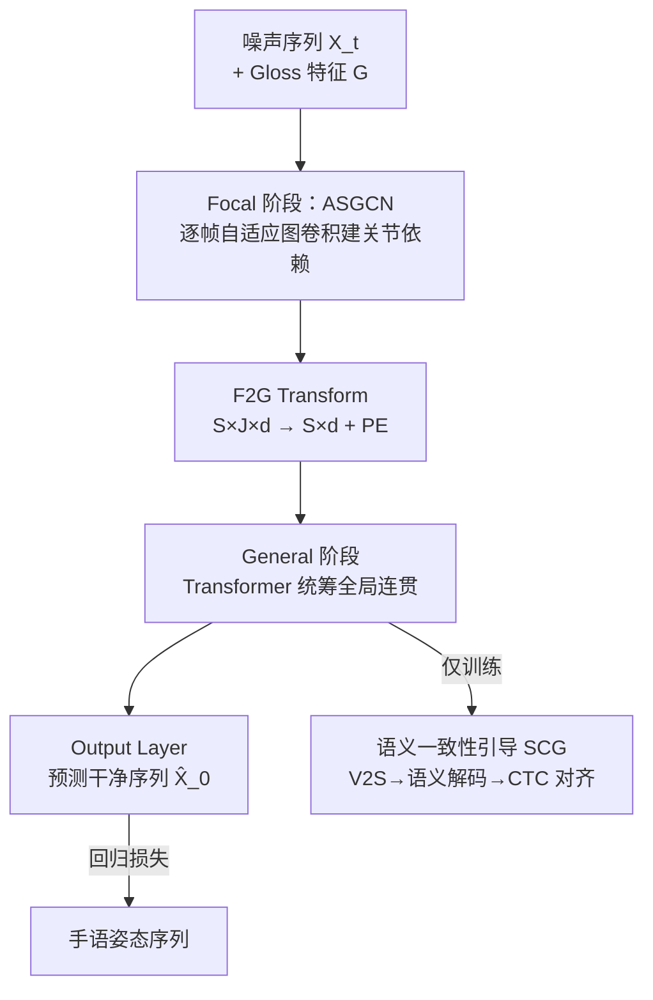

# Focal–General Diffusion Model with Semantic Consistent Guidance for Sign Language Production

**会议**: CVPR 2026  
**论文**: [CVF Open Access](https://openaccess.thecvf.com/content/CVPR2026/html/Yu_Focal-General_Diffusion_Model_with_Semantic_Consistent_Guidance_for_Sign_Language_CVPR_2026_paper.html)  
**代码**: 项目页见论文（未给出明确 GitHub 仓库）⚠️ 以原文为准  
**领域**: 人体理解 / 手语生成 / 扩散模型  
**关键词**: 手语生成, Gloss-to-Pose, 扩散模型, 自适应图卷积, 跨模态语义一致性  

## 一句话总结
针对手语生成（SLP）中 Gloss-to-Pose 阶段「只建模全局、忽略关节级细粒度依赖」的通病，本文提出 Focal–General 扩散模型（FGDM）：用「先聚焦关节、再统筹全局」的两段式去噪结构，配上逐帧自适应的图卷积 ASGCN 和把 CTC 语义监督注入扩散训练的 SCG 机制，在 PHOENIX14T 和 USTC-CSL 上全面刷新 SOTA。

## 研究背景与动机
**领域现状**：手语生成（Sign Language Production, SLP）通常被拆成 Text-to-Gloss（T2G，把口语文本转成手语词 gloss 序列）和 Gloss-to-Pose（G2P，把每个 gloss 映射成连续骨架姿态并补出平滑过渡）两个阶段。T2G 已被 NMT 类方法较好解决，难点和研究价值都集中在 G2P——生成的姿态序列后续可驱动数字人或合成手语视频。近期 G2P 的主流从自回归 Transformer 逐步转向扩散模型（如 G2P-DDM、GCDM、Sign-IDD）。

**现有痛点**：现有 SOTA 扩散方法把每一帧姿态当成一个**不可分的整体单元**来建模，过度强调全局序列建模，无法捕捉关节级（joint-level）的细粒度依赖，导致生成姿态质量下降——手势的精细之处（哪个手指、哪个关节怎么动）糊掉了。

**核心矛盾**：手语姿态里，**关节的语义和空间依赖强度是随时间动态变化的**——同一对关节在不同 gloss、不同时刻的耦合关系完全不同。但现有基于 GCN 的方法用的是「全帧共享」的静态邻接矩阵，天生没法随时刻灵活调整。另一方面，扩散模型只在回归损失（坐标 L1/L2）下「盲拟合坐标」，完全没有机制保证生成姿态在**语义上**和目标 gloss 对齐；少数非扩散方法尝试过语义引导，但跨模态对齐 gap 太大、训练不稳，且因扩散训练的特殊性无法直接迁移过来。

**本文目标**：(1) 让模型既能精细建模关节级依赖、又能保持全局连贯；(2) 在扩散框架内有效引入语义信号做跨模态监督。

**核心 idea**：用「Focal（聚焦局部关节）→ General（统筹全局序列）」两段式去噪替代单一全局建模，关节级阶段用逐帧自适应图卷积 ASGCN；同时把 CTC 风格的语义对齐损失（SCG）作为辅助监督注入扩散训练，并按当前去噪时刻动态调节其强度。

## 方法详解

### 整体框架
FGDM 是一个条件扩散模型，目标是给定 gloss 序列 $G=\{g_i\}_{i=1}^{L}$，生成对应的 3D 骨架姿态序列 $X=\{x_i\}_{i=1}^{S}$，其中每帧 $x_i\in\mathbb{R}^{J\times 3}$ 是 $J$ 个关键点的三维坐标。训练时按 DDPM 对目标序列 $X_0$ 逐步加噪得到 $X_t$（公式 1：$Q(X_t|X_0):=\sqrt{\bar a_t}X_0+\epsilon\sqrt{1-\bar a_t}$，$\bar a_t=\prod_s a_s$，余弦方差表），网络在 gloss 条件下对 $X_t$ 去噪、预测干净序列 $\hat X_0$；推理时从高斯噪声采样，迭代 $I$ 步逐步精修。

整个去噪网络是本文创新的核心，串成一条清晰的 pipeline：噪声序列先做 Iconicity Disentanglement（$\mathbb{R}^{S\times J\times3}\!\to\!\mathbb{R}^{S\times J\times7}$）和 embedding，gloss 序列经 Gloss Encoder 并融合时间嵌入得到 gloss 特征 $G\in\mathbb{R}^{L\times c}$；随后进入 **Focal 阶段**（$L_1$ 层 ASGCN+TCN，空间-时间分解，专攻关节级依赖）；经 **F2G Transform**（把 $S\times J\times d_f$ 形状压成 $S\times d_g$ 并加位置编码）转入 **General 阶段**（$L_2$ 层 Transformer decoder，统筹长程全局连贯）；最后 Output Layer 出 $\hat X_0$。训练时额外接一条 **SCG 分支**：General 输出经 V2S Adapter 投到语义空间、由 Semantic Decoder 解码成 gloss logits，算 SCG 损失（仅训练时启用，推理不参与）。

### 关键设计

**1. Focal–General 两段式去噪：先抠局部关节、再统筹全局序列**

针对「现有扩散方法过度全局建模、丢掉关节级细节」这一痛点，FGDM 把去噪网络一刀切成两个职责互补的阶段，而不是用一个网络硬扛全部尺度。Focal 阶段由 $L_1$ 层 ASGCN + TCN 堆叠组成，沿用空间-时间分解（ASGCN 管空间关节依赖、TCN 管时间关节动态），它把姿态当作「$J$ 个关节构成的图」逐帧精细建模，专门解决关节级耦合。General 阶段则先经 F2G Transform 把关节维度折叠成一个高层特征向量（$S\times J\times d_f\!\to\!S\times d_g$，公式 10），再用 $L_2$ 层 Transformer decoder 做跨注意力——自注意力建帧间长程依赖、交叉注意力把 gloss 特征 $G$ 作为 K/V 注入（公式 11），从而保证整段序列的全局连贯与自然过渡。这种「局部→全局」的渐进式建模让两个尺度各司其职：消融显示单独 General 基线 BLEU-1 仅 22.54%，加上 Focal 阶段直接拉到 28.09%（DEV），证明关节级建模正是此前方法漏掉的关键。

**2. ASGCN：逐帧自适应、注入语义的图卷积，取代全帧共享的静态邻接**

这是本文最核心的贡献，直击「静态共享邻接矩阵无法随时刻调整关节依赖」的矛盾。常规图卷积用一张固定邻接矩阵，ASGCN 则让每一帧 $i$ 拥有自己的邻接矩阵 $A^i$，并把它拆成三股力量融合（公式 3）：

$$A^i = (A^i_a + A^i_b)\odot M^i$$

其中 $A^i_a$ 是**上下文相关性**：对第 $i$ 帧，计算它与前后 $n$ 个邻帧（$n=3$）的关节相关图 $C^i\in\mathbb{R}^{(2n+1)\times J\times J}$（公式 4），再经 sigmoid 门控并用一个**零初始化**的线性层 $W_{Agg}$ 加权聚合（公式 5）——零初始化让模型训练初期先信任先验、再逐步引入学到的动态相关性，稳住训练。$A^i_b$ 是**骨架拓扑先验**：以颈部关节为根建立骨架层级，用 Spatial Separation 分解成 $K_v$ 个子矩阵并归一化，因为它编码物理骨架结构、所以全帧共享、保证结构稳定。$M^i$ 是**语义掩码**：为每个 gloss 特征经掩码生成器造一组原型掩码 $M=\{MG(G_l)\}$（公式 6），对第 $i$ 帧取其 $J$ 个关节均值与各 gloss 特征算 softmax 权重 $w^i$（公式 7），加权聚合原型得 $\bar M^i$（公式 8），最后经卷积模拟空间分离、用缩放 sigmoid 把掩码值映到 $[0,2]$（公式 9：$M^i=2\cdot\sigma(W_s\bar M^i)$）——大于 1 即**增强**连接、小于 1 即**抑制**，等于让 gloss 语义直接去调制「哪些关节该强耦合、哪些该断开」。最终用可分离卷积形式的图卷积（公式 2）出特征。消融表明三股缺一不可，去掉相关性 $A^i_a$ 掉点最狠（BLEU-1 −4.80%/−4.16%），其次是语义掩码 $M^i$。

**3. SCG 语义一致性引导：把 CTC 语义监督注入扩散训练，并按去噪时刻动态调强**

回归损失只让模型「拟合坐标」，无法保证生成姿态在语义上读得通。SCG 另开一条监督路径解决跨模态一致性：General 阶段视觉特征 $X^{go}_t$ 先经 V2S Adapter（两层线性+ReLU）做视觉→语义的中间过渡（公式 15），再送进 Semantic Decoder——它借鉴手语识别架构，由 LSD（两个 1D-TCN + MaxPool 抽局部，下采样到 $S'<S/2$）、GSD（BiLSTM 抓全局）、Gloss Classifier 三段组成（公式 16），输出 gloss logits $y^o_t\in\mathbb{R}^{S'\times(\text{num glosses}+1)}$（多一个 blank 标签做对齐）。监督用 CTC 思路：对所有能折叠成目标 gloss 序列 $G$ 的对齐路径求似然最大化（公式 18），但关键改造在于乘了一个**随扩散时刻 $t$ 变化的权重**（公式 17）：

$$\mathcal{L}_{SCG} = -\frac{1}{e^{\alpha t/T}}\log\!\sum_{\pi\in B^{-1}(G)} p(\pi\mid y^o_t)$$

其中 $\alpha=10$。直觉是：$t$ 大（噪声重、姿态还很糊）时让语义监督弱一点，避免在「看不清」的阶段硬逼语义对齐而破坏收敛；$t$ 小（接近干净姿态）时语义监督才发力。这个时刻感知的强度调节正是为了「适配扩散训练特殊性」而设，也是此前非扩散语义引导方法无法直接搬过来的原因。消融里单加 SCG 就能在基线上全面涨点（BLEU-1 22.54→25.13），与 Focal 叠加后 WER 相比基线降 −8.78%/−9.06%。

### 损失函数 / 训练策略
总损失为回归损失 + SCG 损失（公式 19）：$\mathcal{L}=\mathcal{L}_{joint}+\lambda\mathcal{L}_{bone}+\gamma\mathcal{L}_{SCG}$。其中 $\mathcal{L}_{joint}$ 是关节坐标 L1 损失、$\mathcal{L}_{bone}$ 是骨向量 L2 损失（公式 20），$\lambda=0.1$、$\gamma=0.0001$。扩散 $T=1000$、推理仅 $I=5$ 步，Adam（lr=0.001），单张 A6000；$n=3$、$L_1=3$、$L_2=2$。

## 实验关键数据

### 主实验
PHOENIX14T（德语天气预报手语，7096/519/642 划分）上，FGDM 全指标刷新 SOTA：

| 方法 | B1↑(TEST) | B4↑(TEST) | ROUGE↑(TEST) | WER↓(TEST) | FID↓(TEST) |
|------|-----------|-----------|--------------|------------|------------|
| GEN-OBT（非扩散最强） | 23.08 | 8.01 | 23.49 | 81.78 | – |
| Sign-IDD（扩散最强） | 23.16 | 8.22 | 24.51 | 79.15 | 2.44 |
| **FGDM（本文）** | **26.51** | **9.67** | **28.45** | **70.70** | **2.31** |

相比 GEN-OBT，ROUGE +4.96%、WER −11.08%（TEST）；相比 Sign-IDD，ROUGE +3.94%、WER −8.45%。一个有趣现象：FGDM 的 WER（70.70）甚至低于 Ground Truth（71.94），作者归因于生成姿态更贴近训练分布、且能纠正部分标注错误的 GT 样本。USTC-CSL（中文手语）上同样领先：Split-I 较 Sign-IDD 的 B1/B4 +1.51%/+3.92%、WER −1.03%；更难的 Split-II 上 B2/B3 大幅领先 +13.01%/+13.03%。

### 消融实验
主创新逐项消融（以 General-only 为基线，PHOENIX14T DEV/TEST）：

| 配置 | B1↑(DEV) | B4↑(DEV) | WER↓(DEV) | WER↓(TEST) |
|------|----------|----------|-----------|------------|
| Baseline（General only） | 22.54 | 7.39 | 81.00 | 79.76 |
| +Focal | 28.09 | 9.84 | 76.57 | 73.91 |
| +SCG | 25.13 | 9.12 | 78.92 | 78.12 |
| +Focal+SCG（完整） | 26.92 | 9.48 | **72.22** | **70.70** |

ASGCN 内部三股邻接的消融（在 Baseline+Focal 上去掉单项）：

| 配置 | B1↓(DEV) | WER 变化(DEV/TEST) | 说明 |
|------|----------|--------------------|------|
| Baseline+Focal（全） | 28.09 | — | 完整 ASGCN |
| w/o $A^i_a$（上下文相关性） | 23.29 | +2.59 / +4.56 | 掉点最多，最关键 |
| w/o $M^i$（语义掩码） | 25.00 | +1.09 / +3.29 | 次关键 |
| w/o $A^i_b$（骨架拓扑） | 26.44 | +0.13 / +1.27 | 影响最小 |

### 关键发现
- **Focal 阶段贡献最大**：单加 Focal 把 BLEU-1 从 22.54 拉到 28.09，证明「关节级细粒度建模」正是此前全局方法漏掉的核心，也直接支撑了本文动机。
- **ASGCN 里上下文相关性 $A^i_a$ 是命脉**：去掉它 BLEU-1 暴跌、WER 飙升，远超去掉骨架先验 $A^i_b$ 的影响——说明「随帧动态学到的关节相关性」比「固定物理拓扑」更重要，语义掩码 $M^i$ 次之。
- **层数 sweet spot**：$L_1=3$、$L_2=2$ 最优，$L_1$ 再加收益微乎其微（+0.02% B1 / −0.28% WER），$L_2=3$ 反而掉点。
- ⚠️ 一个值得留意的现象：单加 SCG 时 DEV 的 B1（25.13）反而比 +Focal（28.09）低，但完整模型 WER 最优——SCG 的收益更多体现在语义可识别性（WER/ROUGE）而非 BLEU，组合使用才发挥最大效益。

## 亮点与洞察
- **「分尺度去噪」的思路很可迁移**：把扩散去噪网络按「局部图结构 → 全局序列」拆成两段、各用最合适的算子（GCN vs Transformer），这套 Focal-General 范式可直接搬到其他「既有结构先验、又要长程连贯」的序列生成任务（人体动作、舞蹈、轨迹生成）。
- **零初始化门控聚合是个稳训练的小 trick**：$W_{Agg}$ 初始化为零，让模型从「纯先验」平滑过渡到「学习到的动态相关」，避免训练早期被随机邻接带偏——这种「先信先验后放手」的设计值得复用。
- **时刻感知的辅助损失**：把辅助监督强度写成扩散时刻 $t$ 的函数 $1/e^{\alpha t/T}$，在噪声重时弱化、噪声轻时强化，是把「为干净数据设计的语义损失」安全注入扩散训练的通用配方，比直接全程等权要稳。
- **语义掩码调制图结构**：用 gloss 语义生成 $[0,2]$ 的掩码去增强/抑制关节连接，把「语言语义」直接接到「图拓扑」上，是跨模态条件注入的一种轻量且可解释的方式。

## 局限与展望
- 作者自承掩码生成器 $MG(\cdot)$ 目前只是一层线性映射，留作未来改进——这暗示语义掩码的表达力可能还没吃满。
- 评测高度依赖 back-translation 模型（NSLT）做姿态→gloss→文本的还原，WER 甚至低于 GT 这一现象虽被解释为「更贴训练分布」，但也提示**指标可能部分反映「易被识别」而非「真实自然」**，需要更直接的人工/感知评估佐证。⚠️
- 只在 PHOENIX14T（德语天气，词表受限领域）和 USTC-CSL（100 句固定句）两个数据集验证，开放域、大词表手语的泛化性未知；USTC-CSL Split-II 上所有方法（含 GT）BLEU-4 都为 0，说明该划分极难、绝对性能仍低。
- G2P 只是 SLP 中间环节，最终落到可用手语视频还需 Pose-to-Video，端到端质量未在本文闭环验证。

## 相关工作与启发
- **vs Sign-IDD / GCDM / G2P-DDM（扩散类）**：它们都把整帧姿态当不可分单元做全局建模，本文指出这丢了关节级依赖，用 Focal 阶段 + ASGCN 在更细粒度上建模；FGDM 在所有指标上反超扩散最强基线 Sign-IDD。
- **vs GEN-OBT / NAT-EA（非扩散语义引导）**：早期非扩散方法尝试过语义引导但跨模态对齐 gap 大、训练不稳，且无法直接迁移到扩散；SCG 通过 CTC 对齐 + 时刻感知加权专门解决「如何在扩散训练里安全注入语义监督」。
- **vs ST-GCN / AGCN（图卷积谱系）**：ASGCN 继承 AGCN「动态学邻接」的思想，但把邻接做成**逐帧**自适应、并额外注入上下文相关性与 gloss 语义掩码，针对手语「关节依赖随时刻变化」的特性，比全帧共享的静态/半静态 GCN 更贴合。

## 评分
- 新颖性: ⭐⭐⭐⭐⭐ 两段式去噪 + 逐帧自适应语义图卷积 + 时刻感知 CTC 语义监督，三处设计都切中 G2P 痛点，组合新颖
- 实验充分度: ⭐⭐⭐⭐ 双数据集双划分 + 主创新/ASGCN 子模块/层数多组消融充分，但缺人工感知评测且数据集领域偏窄
- 写作质量: ⭐⭐⭐⭐ 动机推导清晰、公式完整、图示到位，部分符号（如 V2S 输入 $X^{Go}_t$/$X^{go}_t$ 大小写）略有不一致
- 价值: ⭐⭐⭐⭐ 刷新 SLP G2P SOTA，Focal-General 范式与时刻感知辅助损失对其他结构化序列生成有迁移价值

<!-- RELATED:START -->

## 相关论文

- [\[CVPR 2026\] SignPR: A Progressive Vector-Quantized Diffusion Framework for Sign Language Production](signpr_a_progressive_vector-quantized_diffusion_framework_for_sign_language_prod.md)
- [\[ACL 2026\] Hybrid Autoregressive-Diffusion Model for Real-Time Sign Language Production](../../ACL2026/human_understanding/hybrid_autoregressive-diffusion_model_for_real-time_sign_language_production.md)
- [\[CVPR 2026\] BoostSLT: Boosting Sign Language Translation via a Plug-and-Play Diffusion-Based Semantic Enhancer](boostslt_boosting_sign_language_translation_via_a_plug-and-play_diffusion-based_.md)
- [\[CVPR 2026\] Sign Language Recognition in the Age of LLMs](sign_language_recognition_llms.md)
- [\[CVPR 2026\] Learning Effective Sign Features without Text for Gloss-free Sign Language Translation](learning_effective_sign_features_without_text_for_gloss-free_sign_language_trans.md)

<!-- RELATED:END -->
