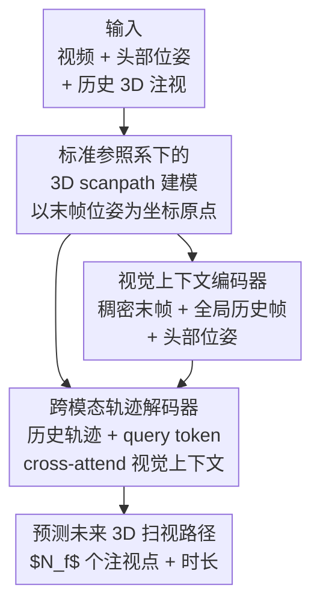

# Forecasting 3D Scanpaths in Egocentric Video

**会议**: CVPR 2026  
**论文**: [CVF Open Access](https://openaccess.thecvf.com/content/CVPR2026/html/Ryan_Forecasting_3D_Scanpaths_in_Egocentric_Video_CVPR_2026_paper.html)  
**代码**: 无  
**领域**: 人体理解 / 第一视角视觉 / 注视预测  
**关键词**: 第一视角视频, 3D 扫视路径预测, 注视预测, 标准参照系, 跨模态注意力  

## 一句话总结
本文首次把"预测人接下来往哪看"从 2D 图像扩展到第一视角视频，定义了**在 3D 世界坐标系下预测未来注视点序列（3D scanpath）**这一新任务，并提出一个以"最后一帧相机位姿"为标准参照系、融合视频/头部位姿/历史注视的 Transformer 架构，在 Aria Digital Twin 上建立了首个 baseline。

## 研究背景与动机
**领域现状**：注视/扫视路径预测（scanpath prediction）一直是理解用户意图、驱动 AR/VR 渲染与机器人交互的关键任务。但绝大多数工作（MIT1003、COCO-Search18 等数据集上的方法）都把它建模成**2D 静态图像**上的问题——给一张图，预测一串按时间排序的像素坐标注视点。

**现有痛点**：看一张显示器上的静态图，是对真实注视行为的高度简化。一旦换到头戴设备拍的第一视角视频，场景是动态的、佩戴者还在 3D 环境里不停平移和快速转头。此时**同一个未来注视目标，在后续帧里可能根本不可见**（已经转出视野）。已有的第一视角注视工作大多仍停留在**单帧像素坐标**里预测，跨帧之间无法对齐，下游做不了一致的空间推理。

**核心矛盾**：AR/VR 渲染、机器人规划这些下游应用，要求注视预测在**多个第一视角帧之间保持空间一致**，这就必须在一个**跨帧持久的固定 3D 坐标系**里出结果；但第一视角数据本身充满剧烈头动、平移和场景动态，又让"在 2D 像素里预测未来帧的注视"这条老路隐式地要求模型先预测未来头动——既难又不可解释。

**本文目标**：① 把任务重新定义为在一个跨帧一致的 3D 坐标系里预测未来 $N_f$ 个注视点；② 设计一个能吃下视频、头部位姿、历史 3D 注视的架构；③ 在真实数据集上建立首个性能基准并找出关键架构要素。

**核心 idea**：不要在变动的像素平面里预测，而是**以"最后一帧观测的相机位姿"为标准参照系（canonical frame）**，把历史注视投影进这个固定 3D 坐标系、也在同一坐标系里预测未来注视序列——让预测天然 grounded 在 3D 环境中，并自然处理"注视点跑出当前画面"的情况。

## 方法详解

### 整体框架
输入是一段第一视角观测：历史的部分 3D 扫视路径 $S_o=\{g_1,\dots,g_{N_o}\}$（每个注视 $g\in\mathbb{R}^4$ 含 3D 世界坐标位置 $x^W_i\in\mathbb{R}^3$ 和停留时长 $m_i$）、对应的视频帧流 $V$、以及每帧的相机位姿 $p=(R^W,t^W)$；输出是未来 $N_f$ 个注视点组成的 $S_f$。整条 pipeline 分两条支路再汇合：先定义**标准参照系**把一切投影进一个固定 3D 坐标系，再用**视觉上下文编码器**把多帧视觉+头部位姿编码成视觉上下文，最后用**跨模态轨迹解码器**让历史轨迹 token 与可学习 query token 一起 cross-attend 视觉上下文，解码出未来 3D 扫视路径。

### 关键设计

**1. 标准参照系下的 3D scanpath 建模：把"看哪里"从动态像素平面搬进固定 3D 坐标系**

这是全文最根本的贡献，针对的就是"第一视角下未来注视点在后续帧可能不可见、跨帧无法对齐"这个痛点。作者为每条扫视路径定义一个标准 3D 坐标系 $C$，原点放在**观测段最后一帧的相机位置 $p^W_{N_o}$**。所有输入注视都投影进这个坐标系得到 $S^C_o$，未来注视也在同一坐标系里预测。这样做的好处是双重的：一是坐标系 grounded 在真实 3D 场景里、且在一条路径内的不同头部位姿之间保持持久不变；二是当某个时刻的注视点跑出相机画面时，3D 输出空间天然能表示它，而 2D 像素建模在这里直接失效。任务被设成**预测固定数量的未来注视点**而非连续时间序列，因为时间是扫视路径的混淆变量——作者把时长当作次要、更模糊的变量，主线聚焦未来注视位置的序列。

**2. 视觉上下文编码器：用"稠密末帧 + 全局历史帧 + 头部位姿"喂出带时序的视觉语境**

第一视角注视预测需要超越单帧的时序上下文来应对场景动态和佩戴者自运动，于是这个分支专门把多帧视觉和头部位置编码进一个统一上下文。对每个观测注视 $g_i$，取其时间对应的最后一帧 $v_i$，用**冻结的预训练视觉编码器 DINOv2-B** $\psi$ 提特征。关键的差异化处理是：对**标准参照帧 $v_{N_o}$ 用完整的逐 patch 稠密特征图**（捕捉将要在其上预测扫视路径的那一帧的稠密语义和空间信息），对**之前的帧 $v_{1:N_o-1}$ 只用全局特征向量**（捕捉相对标准帧的整体视觉运动）；两路分别经线性层 $E_{\text{dense}},E_{\text{global}}\in\mathbb{R}^{d_\psi\times d}$ 嵌入到 $d$ 维。由于各帧因自运动而视角不同，作者还把每帧相机位置 $p^W_i$ 投影进标准参照系得到相对位姿 $p^C_i\in\mathbb{R}^7$（四元数朝向 + 3D 位置），经 $E_{\text{pose}}$ 嵌入后与视觉特征拼接成 $C_{\text{visual}}$。给每个特征加上正弦位置编码来编码相对时间（同一时刻的位姿特征和视觉特征共享同一位置编码），再过 2 层带自注意力的 Transformer 让各帧之间交互，得到更新后的视觉上下文 $C'_{\text{visual}}$。

**3. 跨模态轨迹解码器：让可学习 query token 在视觉语境里"取景"未来注视**

有了视觉上下文，还需要把历史注视行为和视觉信息对齐起来预测未来。作者先把 $S_o$ 里每个观测注视经线性层嵌成历史轨迹特征 $C_{\text{traj}}$，再拼上一组**可学习的轨迹 query 向量** $Q=\{q_1,\dots,q_{N_f}\}$，每个 $q_i$ 最终会被解码成一个未来注视点。$[C_{\text{traj}},Q]$ 送进 2 层 Transformer 解码器：每层内部，轨迹特征通过自注意力跨时间交互，并 cross-attend 视觉上下文 $C'_{\text{visual}}$。为了把历史轨迹和视觉上下文在时间上对齐，给 $C_{\text{traj}}$ 也加正弦时间位置编码，使每个观测注视的轨迹特征与对应位姿、视觉特征共享同一位置编码。最后 query 经线性投影层解码出预测：$S^{\text{pred}}_f=\text{Proj}(Q')$，每个 $g^{\text{pred}}_i\in\mathbb{R}^4$ 给出 3D 标准坐标系下位置 $x^{C,\text{pred}}_i$ 和时长 $m^{\text{pred}}_i$。

### 损失函数 / 训练策略
多任务损失，联合监督注视位置和停留时长，两者都用 MSE：

$$L(S^{\text{pred}}_f,S_f)=\lambda_1 L_{\text{pos}}(X^{\text{pred}}_f,X_f)+\lambda_2 L_{\text{dur}}(M^{\text{pred}}_i,M_i)$$

实现上：$N_o=N_f=10$；输入图像 $224\times224$，DINOv2 对标准帧产出 $16\times16\times768$ 特征图；模型隐维 $d=256$；AdamW，固定学习率 2e-4、weight decay 1e-2，训练 3 个 epoch，一个 epoch 采样训练集中所有可能起点共 87k 条重叠轨迹。

## 实验关键数据

### 数据集与协议
用 **Aria Digital Twin (ADT)** 数据集：Project Aria 眼镜采集的 30Hz 视频、30Hz 眼动、SLAM 估计位姿，并有 3D 数字孪生，可把眼动方向与 3D 环境求交得到 ground-truth 3D 注视点。184 段视频切成 147 训练 / 18 验证 / 19 测试；将连续且距离很小的 3D 注视点聚成 fixation，测试集得到 646 个不重叠片段，平均 2.8s。指标用距离类（DTW / EUC / FRE / EYE / TDE，单位米）和 MultiMatch 套件（Shape/Direction/Length/Position/Duration）。

### 主实验（3D scanpath 预测，ADT，越低越好）

| 方法 | DTW↓ | EUC↓ | FRE↓ | EYE↓ | TDE↓ | Pos↓ |
|------|------|------|------|------|------|------|
| Dataset average | 2.014 | 2.014 | 2.948 | 3.199 | 1.445 | 1.975 |
| Last observed point（强启发式） | 1.533 | 1.533 | 2.646 | 1.977 | 1.310 | 1.504 |
| Linear extrapolation | 4.642 | 4.660 | 8.133 | 5.506 | 1.504 | 4.309 |
| TPP-Gaze（改 3D） | 1.972 | 2.102 | 3.245 | 2.158 | 0.947 | 1.840 |
| Ours - Trajectory only | 1.450 | 1.456 | 2.280 | 1.901 | 0.930 | 1.419 |
| **Ours - Video, pose（完整）** | **1.377** | **1.382** | 2.173 | **1.800** | 0.859 | **1.350** |

完整模型在多数指标上领先，尤其显著优于改到 3D 的图像扫视方法 TPP-Gaze——说明 3D 第一视角扫视确实需要与静态图像不同的建模手段。值得注意的是 **"last observed point" 是个很强的 baseline**：因为标准参照帧对应的就是最后一个观测注视点，加上头动自由度大，注视常居视野中心，这与第一视角 2D 注视估计里 center prior 很强一致。

### 消融实验

| 配置 | DTW↓ | EUC↓ | EYE↓ | 说明 |
|------|------|------|------|------|
| Trajectory only | 1.450 | 1.456 | 1.901 | 无视觉、无位姿 |
| Single image, no pose | 1.410 | 1.421 | 1.836 | 加单帧视觉 |
| Single image, pose | 1.402 | 1.421 | 1.823 | 加单帧 + 位姿 |
| Video, no pose | 1.395 | 1.412 | 1.814 | 多帧视频 |
| **Video, pose（Full）** | **1.377** | **1.382** | **1.800** | 完整 |

**深度方向的位姿增益（Table 2，欧氏误差按平面/深度拆分）**：

| Video | Pose | X-Y 平面 | Z（深度） |
|-------|------|----------|-----------|
| × | × | 0.916 | 0.927 |
| ✓ | × | 0.907 | 0.918 |
| ✓ | ✓ | **0.898** | **0.890** |

**历史注视上下文长度（Table 4）**：context=0 时 DTW=1.720，给 1 个就骤降到 1.450，到 10 个降到 1.377——历史注视是最关键的输入。**解码器注意力结构（Table 5）**：Causal=1.419 < Partial causal=1.403 < **Bidirectional=1.377**，双向注意力最好。

### 关键发现
- **历史注视轨迹贡献最大**：从 0 个到 1 个上下文，DTW 直接从 1.720 跌到 1.450，远大于后续视觉/位姿带来的提升。
- **头部位姿主要帮深度**：在多数指标上位姿增益不大，但 Table 2 显示它**最显著地降低了沿深度方向 Z 的欧氏误差**（0.918→0.890）——印证了"要产出几何上 grounded 的 3D 预测，必须显式建模头动"。
- **为 3D 设计反而 2D 也更准**：Table 3 把 3D 预测投影回 2D 像素比较，作者的 3D 模型投影到 2D 后仍优于直接在 2D 训练的 TPP-Gaze，说明显式利用 3D 信息能产出在 2D 上也更准的预测。⚠️ 视觉/位姿带来的整体提升偏小，作者自己也指出充分利用动态视觉与位姿可能需要更大规模数据。

## 亮点与洞察
- **"标准参照系"是把第一视角注视预测做对的钥匙**：以最后观测帧位姿为原点建固定 3D 坐标系，一举解决了跨帧对齐、注视跑出画面、几何 grounding 三个问题，这个建模思路可迁移到第一视角下的轨迹/交互预测等任务。
- **稠密 vs 全局的非对称视觉编码很务实**：只有"将要在其上预测"的标准帧才用稠密 patch 特征，历史帧用全局向量，既给了预测帧足够的空间语义，又控制了计算量。
- **强启发式 baseline 的诚实呈现**：作者明确指出 last-observed-point 在本任务里非常强，并解释了原因（标准帧锚点 + 头动自由度大），这种把"简单基线为什么难打败"讲清楚的态度，对理解任务本身很有价值。

## 局限与展望
- 作者承认动态视觉与头部位姿带来的整体提升偏小，**可能需要更大规模数据**才能充分发挥；当前只在 ADT 单一数据集、室内数字孪生场景验证。
- 把时长当作次要、模糊变量来处理，Duration 指标上完整模型并不总是最优，⚠️ 时长建模仍是开放问题。
- 依赖可靠的 3D 注视真值（眼动 × 数字孪生求交）和 SLAM 位姿，迁移到无数字孪生的真实场景时，注视点的 3D ground-truth 获取会更困难。
- 固定预测 $N_f=10$ 个未来注视点，没有显式处理可变长度/可变时间跨度的预测。

## 相关工作与启发
- **vs 2D 图像扫视预测（TPP-Gaze 等）**：他们在像素坐标里预测固定图像上的注视序列，本文在跨帧一致的 3D 世界坐标里预测；直接把 TPP-Gaze 改到 3D 效果明显不如本文，证明图像扫视的建模假设（大范围画面内游走）不适合第一视角。
- **vs 第一视角 2D 注视预测（Zhang et al. 等）**：他们在未来帧的 2D 像素里预测注视，隐式要求先预测未来头动且跨帧不可解释；本文在固定 3D 坐标系里预测，预测点跨帧持久共享。
- **vs 注视驱动的行为预测（GazeMotion / GIMO / FICTION）**：这些工作或预测注视方向、或用粗体素 3D 输出；本文预测的是**3D 注视点**（非方向），且不需要身体位姿测量，输出比体素更精细。

## 评分
- 新颖性: ⭐⭐⭐⭐⭐ 首次定义并系统研究第一视角视频中的 3D 扫视路径预测任务，标准参照系建模是有概念深度的新公式。
- 实验充分度: ⭐⭐⭐⭐ 启发式/已有方法/消融对比齐全，但仅 ADT 单数据集、整体增益偏小。
- 写作质量: ⭐⭐⭐⭐ 任务动机和坐标系设计讲得清楚，强 baseline 解释诚实。
- 价值: ⭐⭐⭐⭐ 为 AR/VR 注视预测确立了 3D 任务范式与首个 baseline，参照系思路可迁移。

<!-- RELATED:START -->

## 相关论文

- [\[CVPR 2026\] E-3DPSM: A State Machine for Event-Based Egocentric 3D Human Pose Estimation](e-3dpsm_a_state_machine_for_event-based_egocentric_3d_human_pose_estimation.md)
- [\[CVPR 2026\] Beyond Scanpaths: Graph-Based Gaze Simulation in Dynamic Scenes](beyond_scanpaths_graph-based_gaze_simulation_in_dynamic_scenes.md)
- [\[CVPR 2026\] Egocentric Visibility-Aware Human Pose Estimation](egocentric_visibility-aware_human_pose_estimation.md)
- [\[ECCV 2024\] 3D Hand Pose Estimation in Everyday Egocentric Images](../../ECCV2024/human_understanding/3d_hand_pose_estimation_in_everyday_egocentric_images.md)
- [\[CVPR 2026\] UniDex: A Robot Foundation Suite for Universal Dexterous Hand Control from Egocentric Human Videos](unidex_a_robot_foundation_suite_for_universal_dexterous_hand_control_from_egocen.md)

<!-- RELATED:END -->
