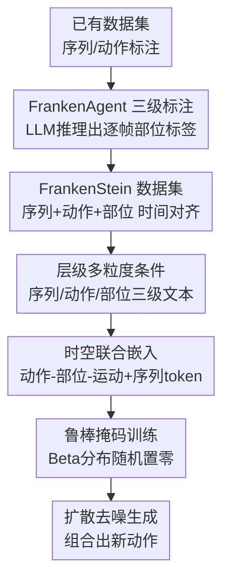

# FrankenMotion: Part-level Human Motion Generation and Composition

**会议**: CVPR 2026  
**论文**: [CVF Open Access](https://openaccess.thecvf.com/content/CVPR2026/html/Li_FrankenMotion_Part-level_Human_Motion_Generation_and_Composition_CVPR_2026_paper.html)  
**代码**: https://coral79.github.io/frankenmotion/ （项目页，代码与数据称发表后开源）  
**领域**: 人体理解 / 人体运动生成  
**关键词**: 人体运动生成, 部位级控制, 时空组合, 扩散模型, LLM标注  

## 一句话总结
针对文本到人体运动生成"只能整段或动作级控制、管不了单个身体部位"的痛点，本文先用 LLM 智能体（FrankenAgent）把已有 mocap 数据集自动标注成"序列 / 原子动作 / 身体部位"三级、且时间对齐的细粒度数据集 FrankenStein，再训练一个基于扩散模型的 FrankenMotion，让每个身体部位由各自的逐帧文本提示驱动，从而能组合出训练中没见过的复杂动作（如"坐着同时抬左臂"）。

## 研究背景与动机
**领域现状**：文本到人体运动生成（text-to-motion）这几年进展很快，主流是用扩散模型把一段文本（如"一个人走路然后坐下"）映射成 SMPL 姿态序列，依赖 HumanML3D、KIT-ML、BABEL 等带文本标注的 mocap 数据集。

**现有痛点**：这些方法只能在**序列级**（整段一句话）或**动作级**（atomic action，如 walk/stand/knock）做控制，**管不了具体某个身体部位**。根因是数据集本身没有部位级、时间对齐的标注——BABEL 只有 'walk'、'knock' 这种动作标签，'knock' 时各部位在干嘛根本没标；少数加了部位标签的工作（如 FineMoGen）又强制所有部位共用同一组固定时间窗，不能表达"左臂和腿在不同时间各做各的"这种**异步**部位运动。

**核心矛盾**：要实现"既精确到部位、又精确到时间"的控制，必须有**逐帧、逐部位、且时间边界自然对齐**的标注，但人工逐帧标全身各部位代价高到不可行。

**本文目标**：(1) 低成本造出一个三级、时间对齐、部位级的标注数据集；(2) 训一个能同时吃序列 / 动作 / 部位三级文本、并能把这些原子元素**组合**成新动作的生成模型。

**切入角度**：作者发现一个关键观察——**高层动作其实蕴含了部位信息，且 LLM 很擅长把它推理出来**：人"系鞋带"时脊柱必然弯、手在打结；人"坐下"时膝盖在弯。于是可以让 LLM 从已有的序列/动作标注里**反推**出各部位逐帧在做什么。

**核心 idea**：把复杂运动看成"原子部位运动元素 + 组合关系"，用 LLM 自动补全部位级标注、再用层级条件扩散模型学这些原子元素及其组合方式，从而实现细粒度可控与零样本组合。

## 方法详解

### 整体框架
方法分两大块。**第一块是数据**：FrankenAgent（一个 LLM 智能体）读入已有数据集的序列标注 $\hat{A}_s$ 和原子动作标注 $\hat{A}_a$，推理输出三级、时间对齐的结构化标注 $A=\{A_s, A_a, A_p\}$，其中部位级标注 $A_p$ 是本文独有的，由此自动构建出迄今最大的部位级运动数据集 FrankenStein。**第二块是模型**：FrankenMotion 是一个 transformer 扩散模型，输入序列级、动作级、部位级三种粒度的文本提示，把它们融进一个联合时空隐空间，在 DDPM 去噪过程中预测干净运动序列；训练时用随机掩码策略应对部位标注稀疏的现实。推理时用户既可只给一句话、也可只给稀疏的部位提示，或编辑已有控制信号。

### 关键设计

**1. FrankenAgent：用 LLM 从高层标注反推逐帧部位标注**

这一步直接攻克"没有部位级数据"这个根上的痛点。作者定义一个基本标注元素为 $a=(L, t_s, t_e)$，即文本标签 $L$ 描述了 $[t_s, t_e]$ 这段运动片段。目标是得到三级集合 $A=\{A_s, A_a, A_p\}$：序列级只有一条 $A_s=\{(L_s, 0, T)\}$；原子动作 $A_a=\{(L_i, t_s^i, t_e^i)\}_{i=1}^N$ 是 $N$ 个首尾相接、不重叠的片段（$t_s^1=0$、$t_e^N=T$、$t_s^i=t_e^{i-1}$）；部位标注 $A_p=\{A_k\}_{k=1}^K$ 对 $K$ 个预定义部位（头、左右臂、左右腿、脊柱、轨迹）各自给一串原子片段标注 $A_k=\{(L_k^j, t_s^j, t_e^j)\}$。FrankenAgent 以 $A_p, A_a, A_s = \text{FrankenAgent}(\hat{A}_a, \hat{A}_s)$ 的方式工作（式 1），用 Deepseek-R1 做主力，靠它的长上下文推理能力。两个防过拟合/防幻觉的关键设计：允许标签为 **unknown**（不是每个部位每一帧都要标，拿不准就输出 unknown，因此标注天然**稀疏**），以及显式要求时间对齐、覆盖各部位、把复杂动作拆成可解释片段。人工评测显示其标注正确率 93.08%、Gwet's AC1=0.91，可靠性很高。

**2. 多粒度层级条件：序列 + 动作 + 部位三级文本同时驱动**

这是把"细粒度可控"落到模型输入上的核心。模型用 transformer 扩散框架，对一段 $T$ 帧的运动接受三级文本：序列级 $L_s=\{L_s\}$（一句整段描述）、动作级 $L_a=\{L_a^j\}$（$W$ 个不重叠时间窗的动作标签）、部位级 $L_p=\{L_k^i\}$（部位 $k$ 在帧 $i$ 的提示，最细粒度）。采用 sample-prediction 模式，模型 $f_\theta$ 从加噪运动 $x_\sigma^{[1...T]}$ 和三级文本预测干净运动：$\hat{x}_0^{[1...T]} = f_\theta(x_\sigma^{[1...T]}, \sigma, L_s, L_a, L_p)$（式 3）。这套设计的好处是把"运动 = 原子部位元素 + 高层语义"显式编码进条件里——部位级管"具体哪只手在干嘛"，动作/序列级管"这些部位组合起来是什么有意义的动作"，于是模型能学到组合关系，进而生成训练中未见过的组合（如坐着抬左臂）。

**3. 时空联合嵌入：把三级异构文本对齐进逐帧特征空间**

三级文本粒度、维度、时间范围都不一样，要喂进同一个 transformer 必须先对齐。作者用 CLIP（ViT-B/32，冻结）抽所有文本特征，对动作和部位标签做 PCA 降到 $D=50$，得到 $F_a\in\mathbb{R}^{W\times D}$ 和 $F_p\in\mathbb{R}^{T\times(K\times D)}$。关键的对齐操作是把每个动作窗的嵌入**扩展到它覆盖的帧范围**得到 $F_a\in\mathbb{R}^{T\times D}$，这样每一帧都同时挂上了部位级和动作级文本特征；二者拼接成 $F_{a+p}$，再与加噪运动拼接、过 MLP，得到逐帧的运动-文本融合特征 $F_{a+p+m}\in\mathbb{R}^{T\times D_{m+t}}$。序列级文本则单独经 CLIP+MLP 编成一个全局向量 $F_s$，作为**额外 token** 拼上去，扩散时间步嵌入也作为一个单独 token，最终输入尺寸为 $\mathbb{R}^{(T+2)\times D_{m+t}}$。这样一来逐帧细节走帧 token、全局语义走附加 token，时空信息在同一隐空间里被联合编码。

**4. Beta 分布随机掩码：让模型对稀疏、不完整的部位条件鲁棒**

由于部位标注本就稀疏（很多帧/部位是 unknown），且推理时用户可能只给寥寥几个部位提示，模型必须在"输入条件残缺"时也能正常工作。作者先把 unknown 的文本特征**置零**形成稀疏条件；更进一步，对**有标签**的部位文本 $L_k^i$ 也按概率 $p$ 随机置零，其中 $p\sim\text{Beta}(5r, 5(1-r))$，$r$ 为目标掩码率，每步训练对每个有标签部位采不同的 $p$。这种随机掩码模拟了推理时各种"只给部分条件"的情况，显著提升了在稀疏监督下的泛化与鲁棒性。训练目标就是标准 DDPM 回归损失 $L=\mathbb{E}[\lVert f_\theta(x_\sigma^{[1...T]}, \sigma, c) - x_0\rVert_2^2]$（式 4），$c=(L_s, L_a, L_p)$ 为层级文本条件。

### 损失函数 / 训练策略
标准 DDPM sample-prediction 目标（式 4）。余弦噪声调度、100 步扩散；AdamW，学习率 $2\times10^{-4}$，batch size 32；冻结 CLIP ViT-B/32 文本编码器。主模型在单卡 H100 上训约 47.5 小时，每个评测模型在单卡 A100 上训约 16 小时。

## 实验关键数据

### 数据集质量
随机抽 50 条运动，3 位专家对每条的部位/动作/序列标签逐一打二值正确分，平均得到 FrankenAgent 标注正确率 **93.08%**，标注者一致性 Gwet's AC1=**0.91**（高可靠）。FrankenStein 规模见下表，关键是它是**唯一**同时具备原子动作标签 + 部位标签的数据集。

| 数据集 | 序列标签 | 原子动作标签 | 部位标签 | 时长 | 总标签数 |
|--------|:---:|:---:|:---:|------|------|
| BABEL | ✓ | ✓ | ✗ | 43.5h | 91.4k |
| HumanML3D | ✓ | ✗ | ✗ | 28.6h | 44.9k |
| KIT-ML | ✓ | ✗ | ✗ | 11.2h | 6.3k |
| **FrankenStein（本文）** | ✓ | ✓ | **✓** | 39.1h | **138.5k**（含 46.1k 部位标签、28.8k LLM 新推理标签） |

### 主实验
在 FrankenStein 上对比把 STMC / DART / UniMotion 适配并重训到本任务的基线。语义正确性用 R-Precision（R@1/R@3）和 M2T，真实度用 FID 和 Diversity。

| 方法 | Avg-part R@1 ↑ | Per-seq R@1 ↑ | Per-seq R@3 ↑ | Per-action FID ↓ | Per-seq FID ↓ |
|------|:---:|:---:|:---:|:---:|:---:|
| GT（上界） | 52.04 | 72.66 | 91.47 | 0.00 | 0.00 |
| STMC | 40.67 | 43.58 | 62.32 | 0.10 | 0.20 |
| DartControl | 38.67 | 54.28 | 76.95 | 0.14 | 0.28 |
| UniMotion | 45.72 | 62.66 | 82.08 | 0.05 | 0.08 |
| **FrankenMotion** | **47.21** | **65.27** | **85.62** | **0.04** | **0.06** |

FrankenMotion 在语义正确性和真实度（FID 最低）上全面领先。定性上：STMC 能跟部位指令但组合不出连贯动作、转场生硬、"转身"这类细节被忽略；DART 自回归易误差累积、产生重复片段（反复坐下站起）；UniMotion 整体真实但缺部位结构、细微动作（如转身）漏掉。

### 消融实验：层级输入的重要性
逐步加入更高层级的文本条件，看部位级生成质量怎么变（M2M = motion-to-motion 一致性）。

| 输入条件 | Avg-part R@3 ↑ | Avg-part M2M ↑ | FID ↓ |
|------|:---:|:---:|:---:|
| 仅 部位 | 56.34 | 0.72 | 0.08 |
| 部位 + 动作 | 57.74 | 0.73 | 0.07 |
| 部位 + 动作 + 序列（Full） | **58.97** | **0.75** | **0.05** |

### 关键发现
- **只给部位文本就已经很强**：仅部位条件的 M2T 已逼近 GT 上界，说明模型对细粒度部位文本的理解能力扎实——这是结构化部位条件设计的直接收益。
- **高层语义是"锦上添花且必要"**：逐步加入动作级、序列级文本，部位级生成的正确性（R@3 56.34→58.97）和真实度（FID 0.08→0.05）都稳定提升，验证层级条件不是冗余，而是给部位运动注入了"有意义的全局语境"。
- **组合泛化**：模型能生成训练中未见过的部位组合（如坐着抬左臂），印证了"原子元素 + 组合"建模思路。

## 亮点与洞察
- **"高层标注里藏着部位信息，让 LLM 挖出来"** 是最巧的一招：把昂贵的逐帧部位标注问题，转化成 LLM 的常识推理问题（坐下→膝盖弯），并用 unknown 机制控制幻觉，93% 正确率拿到了别人没有的细粒度数据。这套"用 LLM 给已有数据集补结构化标注"的范式可迁移到很多缺细粒度标签的任务。
- **异步部位标注 + 把动作窗扩展到帧范围**：相比 FineMoGen 强制各部位共享固定时间窗，本文允许各部位在不同时间各做各的，更贴近真实运动；逐帧对齐通过"窗嵌入扩展到帧"实现，简单有效。
- **Beta 分布随机掩码**：用一个随机置零策略同时解决"标注稀疏"和"推理时条件残缺"两个问题，是稀疏条件生成里值得复用的 trick。

## 局限与展望
- **作者承认**：当前无法在单次前向中生成分钟级长序列，长时序结构建模是未来方向。
- **自己发现**：① 部位级标注由 LLM 推理而非真实观测，7% 错误率会作为噪声进入训练，对极细微或罕见动作可能放大偏差；② 评测指标本身依赖另一批预训练 text-to-motion 模型（每部位/动作/序列各训一个评测器），评分体系与待评模型同源，存在一定循环依赖 ⚠️ 以原文为准；③ 部位是 7 个预定义粗划分（头/四肢/脊柱/轨迹），更精细的手指、表情等不在范围内。
- **改进思路**：引入自回归或分段拼接 + 一致性约束以支持长序列；用真实部位级 mocap（哪怕少量）做半监督校正 LLM 标注噪声。

## 相关工作与启发
- **vs FineMoGen**：都做部位级生成，但 FineMoGen 用 stage-based 标注、强制各部位共享固定时间窗，本文允许**异步**部位运动、逐帧对齐，灵活性更高。
- **vs STMC**：STMC 是 test-time 后处理，把预训练 MDM 各部位的输出在推理时拼起来，缺端到端时空推理，难组合出连贯动作；本文端到端学习部位组合，转场更自然。
- **vs UniMotion**：UniMotion 支持序列级 + 帧级（动作）层级控制但**没有部位控制**，细微动作（如转身）易丢；本文显式加入结构化部位条件，细粒度更准。
- **vs DART**：DART 自回归、主要跟序列级文本，易误差累积/重复；本文非自回归扩散 + 层级条件，整段一次性建模更稳。

## 评分
- 新颖性: ⭐⭐⭐⭐⭐ 首个提供原子、时间对齐部位级标注并能同时做空间（部位）+时间（动作）控制的工作
- 实验充分度: ⭐⭐⭐⭐ 主对比+消融+人工标注评测齐全，但缺长序列与跨数据集泛化验证
- 写作质量: ⭐⭐⭐⭐ 三级标注的形式化定义清晰，pipeline 图文对照好懂
- 价值: ⭐⭐⭐⭐⭐ 数据集 + 模型双产出，"LLM 补结构化标注"范式对整个可控运动生成领域有推动力

<!-- RELATED:START -->

## 相关论文

- [\[CVPR 2026\] Multi-level Causal LLM-based Text-to-Motion Generation with Human Alignment (MoTiGA)](multi-level_causal_llm-based_text-to-motion_generation_with_human_alignment.md)
- [\[CVPR 2026\] ParTY: Part-Guidance for Expressive Text-to-Motion Synthesis](party_part-guidance_for_expressive_text-to-motion_synthesis.md)
- [\[CVPR 2026\] MoLingo: Motion-Language Alignment for Text-to-Human Motion Generation](molingo_motion-language_alignment_for_text-to-motion_generation.md)
- [\[CVPR 2026\] Towards Decompositional Human Motion Generation with Energy-Based Diffusion Models](towards_decompositional_human_motion_generation_with_energy-based_diffusion_mode.md)
- [\[CVPR 2026\] Stability-Driven Motion Generation for Object-Guided Human-Human Co-Manipulation](stability-driven_motion_generation_for_object-guided_human-human_co-manipulation.md)

<!-- RELATED:END -->
